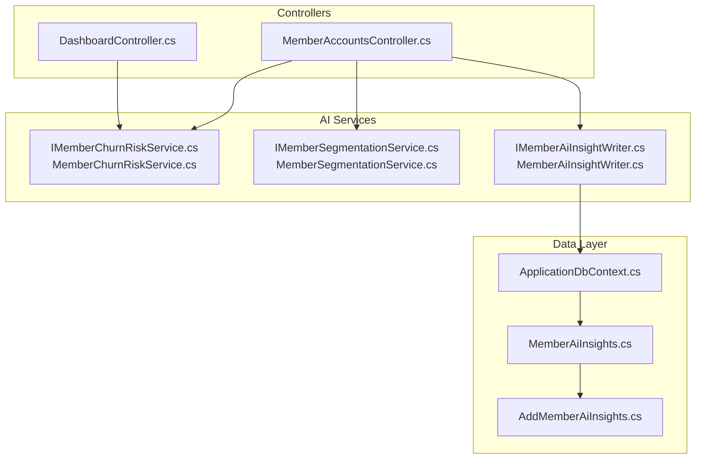
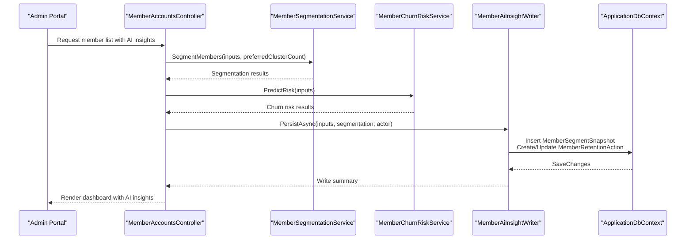
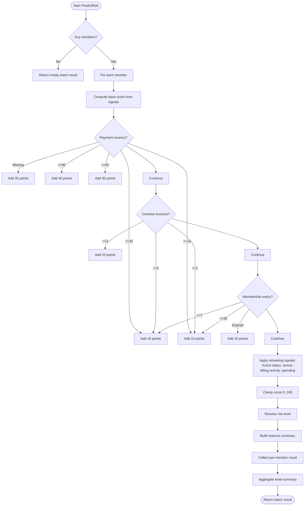
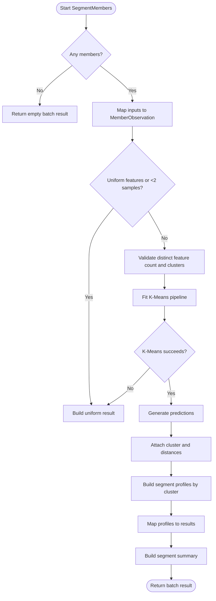
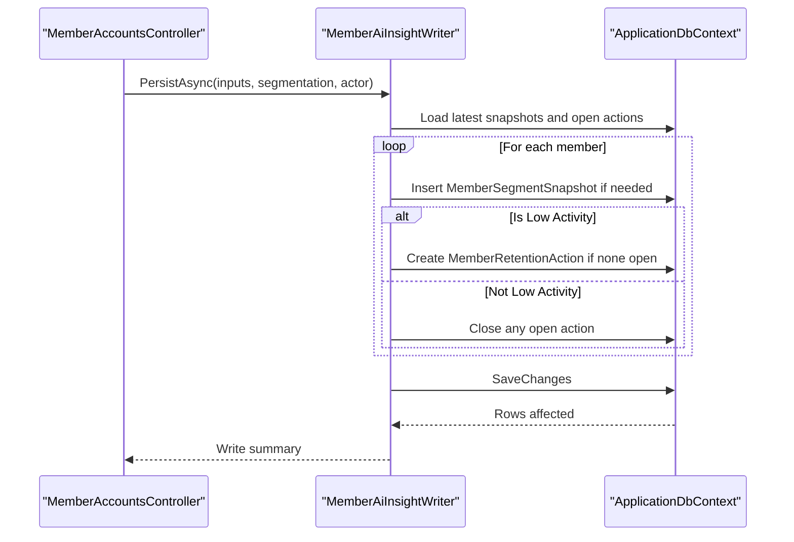
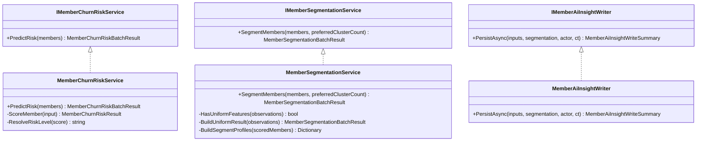

# AI and Machine Learning Integration

<cite>
**Referenced Files in This Document**
- [IMemberChurnRiskService.cs](file://Services/AI/IMemberChurnRiskService.cs)
- [MemberChurnRiskService.cs](file://Services/AI/MemberChurnRiskService.cs)
- [IMemberSegmentationService.cs](file://Services/AI/IMemberSegmentationService.cs)
- [MemberSegmentationService.cs](file://Services/AI/MemberSegmentationService.cs)
- [IMemberAiInsightWriter.cs](file://Services/AI/IMemberAiInsightWriter.cs)
- [MemberAiInsightWriter.cs](file://Services/AI/MemberAiInsightWriter.cs)
- [MemberAiInsights.cs](file://Models/Admin/MemberAiInsights.cs)
- [AddMemberAiInsights.cs](file://Data/Migrations/20260217133237_AddMemberAiInsights.cs)
- [ApplicationDbContext.cs](file://Data/ApplicationDbContext.cs)
- [MemberAccountsController.cs](file://Controllers/MemberAccountsController.cs)
- [DashboardController.cs](file://Controllers/DashboardController.cs)
- [MemberChurnRiskServiceTests.cs](file://EJCFitnessGym.Tests/MemberChurnRiskServiceTests.cs)
</cite>

## Table of Contents
1. [Introduction](#introduction)
2. [Project Structure](#project-structure)
3. [Core Components](#core-components)
4. [Architecture Overview](#architecture-overview)
5. [Detailed Component Analysis](#detailed-component-analysis)
6. [Dependency Analysis](#dependency-analysis)
7. [Performance Considerations](#performance-considerations)
8. [Troubleshooting Guide](#troubleshooting-guide)
9. [Conclusion](#conclusion)
10. [Appendices](#appendices)

## Introduction
This document explains the AI and machine learning capabilities integrated into the EJC Fitness Gym system. It covers:
- Member churn risk prediction: data inputs, scoring methodology, and batch processing
- Member segmentation: clustering-based grouping and actionable insights
- AI insight generation: persistence of segment snapshots and automated retention actions
- Integration with external AI services: Microsoft ML.NET K-Means clustering
- Member dashboard enhancements: AI-powered insights and retention recommendations
- Data privacy and ethical use of AI in member analytics
- Continuous learning aspects and adaptation to evolving membership patterns

## Project Structure
The AI/ML features are organized under Services/AI and are consumed by controllers and persisted via Entity Framework models and migrations.

**Diagram sources**
- [MemberAccountsController.cs](file://Controllers/MemberAccountsController.cs)
- [DashboardController.cs](file://Controllers/DashboardController.cs)
- [IMemberChurnRiskService.cs](file://Services/AI/IMemberChurnRiskService.cs)
- [MemberChurnRiskService.cs](file://Services/AI/MemberChurnRiskService.cs)
- [IMemberSegmentationService.cs](file://Services/AI/IMemberSegmentationService.cs)
- [MemberSegmentationService.cs](file://Services/AI/MemberSegmentationService.cs)
- [IMemberAiInsightWriter.cs](file://Services/AI/IMemberAiInsightWriter.cs)
- [MemberAiInsightWriter.cs](file://Services/AI/MemberAiInsightWriter.cs)
- [ApplicationDbContext.cs](file://Data/ApplicationDbContext.cs)
- [AddMemberAiInsights.cs](file://Data/Migrations/20260217133237_AddMemberAiInsights.cs)
- [MemberAiInsights.cs](file://Models/Admin/MemberAiInsights.cs)

**Section sources**
- [MemberAccountsController.cs](file://Controllers/MemberAccountsController.cs)
- [DashboardController.cs](file://Controllers/DashboardController.cs)
- [IMemberChurnRiskService.cs](file://Services/AI/IMemberChurnRiskService.cs)
- [MemberChurnRiskService.cs](file://Services/AI/MemberChurnRiskService.cs)
- [IMemberSegmentationService.cs](file://Services/AI/IMemberSegmentationService.cs)
- [MemberSegmentationService.cs](file://Services/AI/MemberSegmentationService.cs)
- [IMemberAiInsightWriter.cs](file://Services/AI/IMemberAiInsightWriter.cs)
- [MemberAiInsightWriter.cs](file://Services/AI/MemberAiInsightWriter.cs)
- [ApplicationDbContext.cs](file://Data/ApplicationDbContext.cs)
- [AddMemberAiInsights.cs](file://Data/Migrations/20260217133237_AddMemberAiInsights.cs)
- [MemberAiInsights.cs](file://Models/Admin/MemberAiInsights.cs)

## Core Components
- Member Churn Risk Service: Computes individual risk scores and levels from behavioral and financial signals.
- Member Segmentation Service: Clusters members using K-Means on normalized spending, billing activity, and membership duration.
- Member AI Insight Writer: Persists segment snapshots and creates/updates retention actions for targeted interventions.
- Data Models and Persistence: MemberSegmentSnapshot and MemberRetentionAction tables with supporting indexes.
- Controller Integration: MemberAccountsController orchestrates segmentation, risk scoring, and UI updates; DashboardController supports administrative views.

**Section sources**
- [IMemberChurnRiskService.cs](file://Services/AI/IMemberChurnRiskService.cs)
- [MemberChurnRiskService.cs](file://Services/AI/MemberChurnRiskService.cs)
- [IMemberSegmentationService.cs](file://Services/AI/IMemberSegmentationService.cs)
- [MemberSegmentationService.cs](file://Services/AI/MemberSegmentationService.cs)
- [IMemberAiInsightWriter.cs](file://Services/AI/IMemberAiInsightWriter.cs)
- [MemberAiInsightWriter.cs](file://Services/AI/MemberAiInsightWriter.cs)
- [MemberAiInsights.cs](file://Models/Admin/MemberAiInsights.cs)
- [AddMemberAiInsights.cs](file://Data/Migrations/20260217133237_AddMemberAiInsights.cs)
- [MemberAccountsController.cs](file://Controllers/MemberAccountsController.cs)

## Architecture Overview
The AI/ML pipeline transforms raw member data into actionable insights and operational actions.

**Diagram sources**
- [MemberAccountsController.cs](file://Controllers/MemberAccountsController.cs)
- [MemberSegmentationService.cs](file://Services/AI/MemberSegmentationService.cs)
- [MemberChurnRiskService.cs](file://Services/AI/MemberChurnRiskService.cs)
- [MemberAiInsightWriter.cs](file://Services/AI/MemberAiInsightWriter.cs)
- [ApplicationDbContext.cs](file://Data/ApplicationDbContext.cs)

## Detailed Component Analysis

### Member Churn Risk Prediction
- Inputs: Member identifier, display name, total spending, billing activity count, membership months, days since last successful payment, days until membership end, overdue invoice count, and active membership status.
- Scoring logic: Adds weighted risk factors based on payment recency, overdue invoices, membership expiry, active status, tenure, billing activity, and spending. Final score is clamped to 0–100 and mapped to Low/Medium/High risk levels.
- Outputs: Per-member risk score, risk level, reasons list, and summarized level counts.

**Diagram sources**
- [MemberChurnRiskService.cs](file://Services/AI/MemberChurnRiskService.cs)

**Section sources**
- [IMemberChurnRiskService.cs](file://Services/AI/IMemberChurnRiskService.cs)
- [MemberChurnRiskService.cs](file://Services/AI/MemberChurnRiskService.cs)
- [MemberChurnRiskServiceTests.cs](file://EJCFitnessGym.Tests/MemberChurnRiskServiceTests.cs)

### Member Segmentation Service
- Inputs: Member identifier, display name, total spending, billing activity count, membership months.
- Algorithm: Uses Microsoft ML.NET K-Means clustering on normalized features. Handles edge cases (uniform features, insufficient samples, K-Means failures) by falling back to a uniform “Regular Members” segmentation.
- Profiles: Assigns segment labels (e.g., Low Activity, High Value, Regular Members) based on cluster composition and feature normalization weights.
- Outputs: Per-member cluster ID, segment label, description, and distances; plus segment distribution summary.

**Diagram sources**
- [MemberSegmentationService.cs](file://Services/AI/MemberSegmentationService.cs)

**Section sources**
- [IMemberSegmentationService.cs](file://Services/AI/IMemberSegmentationService.cs)
- [MemberSegmentationService.cs](file://Services/AI/MemberSegmentationService.cs)

### AI Insight Generation and Persistence
- Purpose: Persist segment snapshots daily per member and manage retention actions for low-activity members.
- Behavior:
  - Inserts MemberSegmentSnapshot when the current segment differs from the latest snapshot or when captured today.
  - Creates MemberRetentionAction for “Low Activity” members and auto-closes/open actions based on segment transitions.
- Outputs: Snapshot insertions, retention actions created, and actions auto-closed.

**Diagram sources**
- [MemberAiInsightWriter.cs](file://Services/AI/MemberAiInsightWriter.cs)
- [ApplicationDbContext.cs](file://Data/ApplicationDbContext.cs)
- [MemberAiInsights.cs](file://Models/Admin/MemberAiInsights.cs)

**Section sources**
- [IMemberAiInsightWriter.cs](file://Services/AI/IMemberAiInsightWriter.cs)
- [MemberAiInsightWriter.cs](file://Services/AI/MemberAiInsightWriter.cs)
- [MemberAiInsights.cs](file://Models/Admin/MemberAiInsights.cs)
- [AddMemberAiInsights.cs](file://Data/Migrations/20260217133237_AddMemberAiInsights.cs)

### Integration with External AI Services
- Microsoft ML.NET is used for K-Means clustering. The service composes a feature vector from normalized spending, billing activity, and membership months, then trains and evaluates the model in-memory.
- Robustness: Gracefully handles edge cases (single sample, uniform features, insufficient variance) by returning a uniform segmentation result.

**Section sources**
- [MemberSegmentationService.cs](file://Services/AI/MemberSegmentationService.cs)

### Member Dashboard Enhancements
- Admin portal displays:
  - Segment distribution summaries
  - Churn risk level summaries
  - Per-member AI cluster, segment label/description, risk score/level, and retention action status
- Operational actions:
  - Automated creation of retention actions for low-activity members
  - Automatic closure of retention actions when members move out of low-activity segments

**Section sources**
- [MemberAccountsController.cs](file://Controllers/MemberAccountsController.cs)
- [DashboardController.cs](file://Controllers/DashboardController.cs)

## Dependency Analysis
- Cohesion: AI services encapsulate domain logic cleanly (scoring, clustering, persistence).
- Coupling: Controllers depend on AI interfaces; persistence depends on EF models and migrations.
- External dependencies: Microsoft ML.NET for clustering; Entity Framework for persistence.

**Diagram sources**
- [IMemberChurnRiskService.cs](file://Services/AI/IMemberChurnRiskService.cs)
- [MemberChurnRiskService.cs](file://Services/AI/MemberChurnRiskService.cs)
- [IMemberSegmentationService.cs](file://Services/AI/IMemberSegmentationService.cs)
- [MemberSegmentationService.cs](file://Services/AI/MemberSegmentationService.cs)
- [IMemberAiInsightWriter.cs](file://Services/AI/IMemberAiInsightWriter.cs)
- [MemberAiInsightWriter.cs](file://Services/AI/MemberAiInsightWriter.cs)

**Section sources**
- [IMemberChurnRiskService.cs](file://Services/AI/IMemberChurnRiskService.cs)
- [MemberChurnRiskService.cs](file://Services/AI/MemberChurnRiskService.cs)
- [IMemberSegmentationService.cs](file://Services/AI/IMemberSegmentationService.cs)
- [MemberSegmentationService.cs](file://Services/AI/MemberSegmentationService.cs)
- [IMemberAiInsightWriter.cs](file://Services/AI/IMemberAiInsightWriter.cs)
- [MemberAiInsightWriter.cs](file://Services/AI/MemberAiInsightWriter.cs)

## Performance Considerations
- Batch processing: Both churn risk and segmentation operate on lists of members; ensure callers supply bounded batches to avoid memory pressure.
- Normalization and clustering: Feature normalization and K-Means are lightweight; however, large-scale runs should consider sampling or periodic recomputation windows.
- Persistence: Snapshot insertion and retention action updates are grouped and saved in a single transaction to minimize round-trips.
- Indexes: Database indexes on MemberRetentionActions and MemberSegmentSnapshots optimize lookups for recent snapshots and open actions.

[No sources needed since this section provides general guidance]

## Troubleshooting Guide
- Segmentation fallback: When K-Means fails (e.g., insufficient samples or uniform features), the service returns a uniform “Regular Members” result. Verify input diversity and sample sizes.
- Missing churn risk reasons: If no reasons are populated, it indicates a stable profile; confirm inputs for recency and activity.
- Retention actions not updating: Ensure the “Low Activity” segment label matches the writer’s constant and that snapshots are being inserted daily.
- Database schema: Confirm the AddMemberAiInsights migration has been applied and indexes exist.

**Section sources**
- [MemberSegmentationService.cs](file://Services/AI/MemberSegmentationService.cs)
- [MemberAiInsightWriter.cs](file://Services/AI/MemberAiInsightWriter.cs)
- [AddMemberAiInsights.cs](file://Data/Migrations/20260217133237_AddMemberAiInsights.cs)

## Conclusion
The EJC Fitness Gym integrates practical AI/ML capabilities to predict churn risk, segment members, and automate retention actions. The modular design enables easy extension, while robust fallbacks and persistence ensure reliable operation. Administrators gain actionable insights directly in the member accounts view, and the system supports continuous adaptation through daily snapshots and dynamic retention workflows.

[No sources needed since this section summarizes without analyzing specific files]

## Appendices

### Data Privacy and Ethical Use of AI
- Data minimization: Only necessary financial and engagement metrics are used for segmentation and risk scoring.
- Transparency: Users receive clear labels and descriptions for segments and risk levels.
- Consent and access: Access to AI insights is role-restricted; operators should document who triggers AI workflows.
- Bias mitigation: Regular audits of segment labels and risk thresholds help prevent disparate impact.
- Retention actions: Automated actions include human review points to avoid undue pressure on members.

[No sources needed since this section provides general guidance]

### Continuous Learning and Adaptation
- Daily snapshots: Capture evolving member behavior to inform future segmentation and risk models.
- Periodic retraining: Re-run segmentation with updated cohorts to align labels with changing market dynamics.
- Threshold tuning: Adjust churn risk thresholds and retention action triggers based on outcomes and feedback.
- Model evaluation: Track false positives/negatives in churn predictions and segment drift to refine features and algorithms.

[No sources needed since this section provides general guidance]