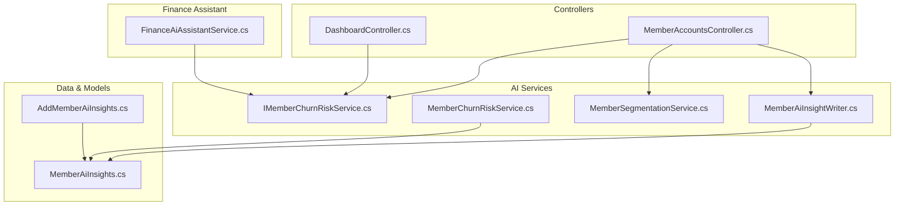
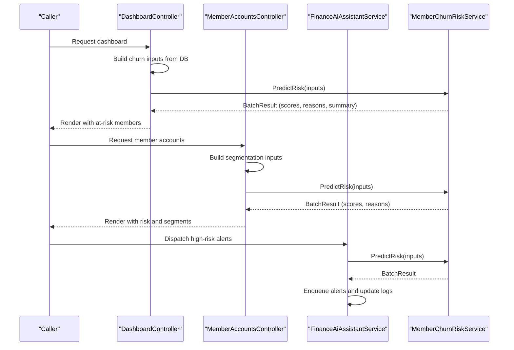
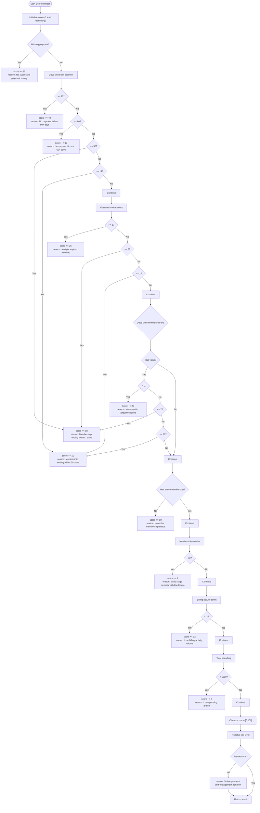
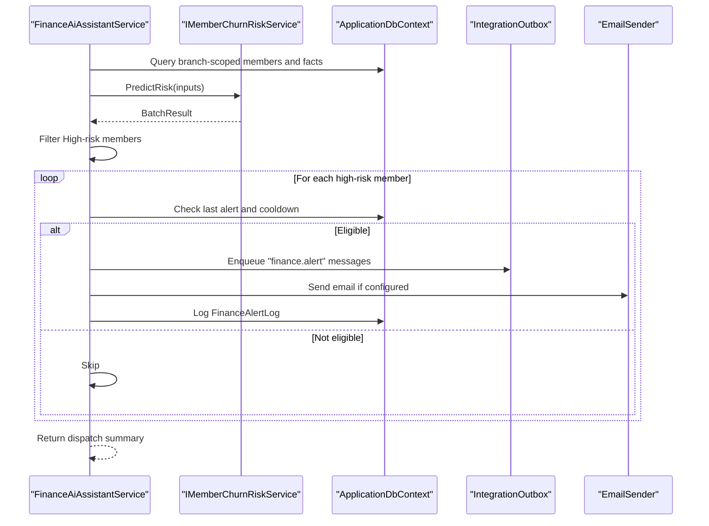
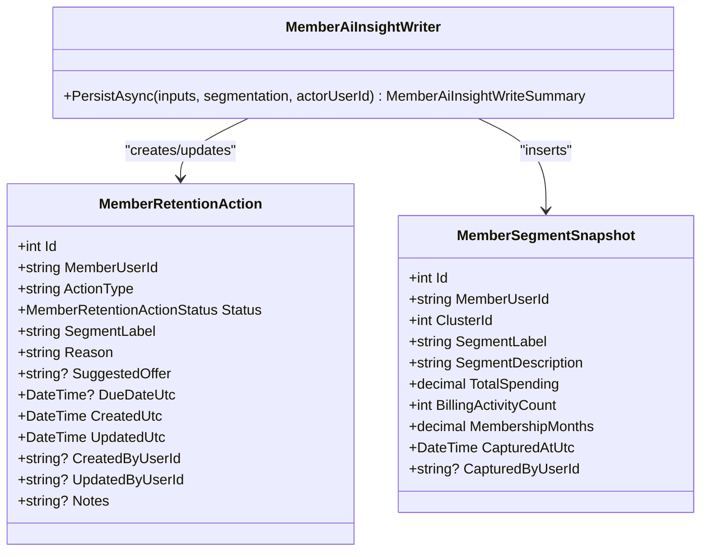
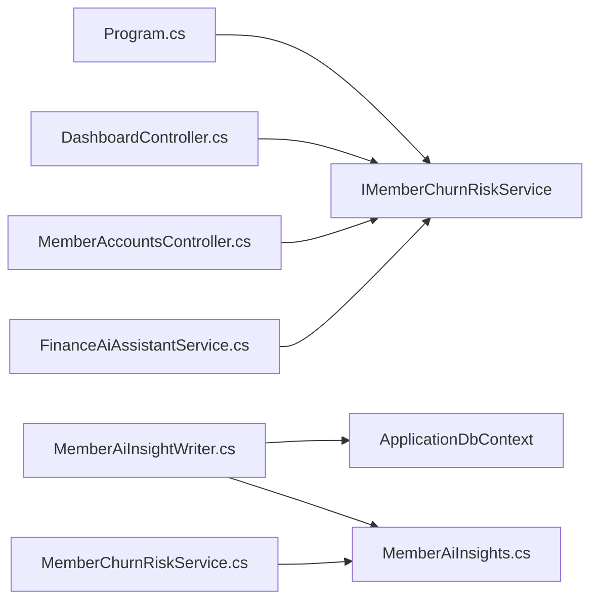

# Churn Risk Prediction System

<cite>
**Referenced Files in This Document**
- [IMemberChurnRiskService.cs](file://Services/AI/IMemberChurnRiskService.cs)
- [MemberChurnRiskService.cs](file://Services/AI/MemberChurnRiskService.cs)
- [MemberChurnRiskServiceTests.cs](file://EJCFitnessGym.Tests/MemberChurnRiskServiceTests.cs)
- [MemberAiInsights.cs](file://Models/Admin/MemberAiInsights.cs)
- [MemberAiInsightWriter.cs](file://Services/AI/MemberAiInsightWriter.cs)
- [MemberSegmentationService.cs](file://Services/AI/MemberSegmentationService.cs)
- [DashboardController.cs](file://Controllers/DashboardController.cs)
- [MemberAccountsController.cs](file://Controllers/MemberAccountsController.cs)
- [FinanceAiAssistantService.cs](file://Services/Finance/FinanceAiAssistantService.cs)
- [AddMemberAiInsights.cs](file://Data/Migrations/20260217133237_AddMemberAiInsights.cs)
- [Program.cs](file://Program.cs)
</cite>

## Table of Contents
1. [Introduction](#introduction)
2. [Project Structure](#project-structure)
3. [Core Components](#core-components)
4. [Architecture Overview](#architecture-overview)
5. [Detailed Component Analysis](#detailed-component-analysis)
6. [Dependency Analysis](#dependency-analysis)
7. [Performance Considerations](#performance-considerations)
8. [Troubleshooting Guide](#troubleshooting-guide)
9. [Conclusion](#conclusion)
10. [Appendices](#appendices)

## Introduction
This document explains the churn risk prediction system used to identify members likely to cancel or disengage. It covers the IMemberChurnRiskService interface and its implementation, the scoring methodology, thresholds, and automated alerting. It also documents how insights are persisted into MemberAiInsights, how staff use predictions for retention, and how segmentation and retention actions integrate with member management workflows.

## Project Structure
The churn risk system spans several layers:
- AI services: churn risk scoring, segmentation, and insight persistence
- Controllers: orchestrate data extraction and pass inputs to services
- Finance assistant: evaluates branch-level churn risk and dispatches alerts
- Data models and migrations: persist MemberAiInsights (retention actions and segment snapshots)
- Tests: validate scoring logic and batch results

**Diagram sources**
- [DashboardController.cs:31-52](file://Controllers/DashboardController.cs#L31-L52)
- [MemberAccountsController.cs:21-39](file://Controllers/MemberAccountsController.cs#L21-L39)
- [IMemberChurnRiskService.cs:53-56](file://Services/AI/IMemberChurnRiskService.cs#L53-L56)
- [MemberChurnRiskService.cs:3-174](file://Services/AI/MemberChurnRiskService.cs#L3-L174)
- [MemberSegmentationService.cs:6-308](file://Services/AI/MemberSegmentationService.cs#L6-L308)
- [MemberAiInsightWriter.cs:7-159](file://Services/AI/MemberAiInsightWriter.cs#L7-L159)
- [FinanceAiAssistantService.cs:14-581](file://Services/Finance/FinanceAiAssistantService.cs#L14-L581)
- [MemberAiInsights.cs:13-82](file://Models/Admin/MemberAiInsights.cs#L13-L82)
- [AddMemberAiInsights.cs:14-57](file://Data/Migrations/20260217133237_AddMemberAiInsights.cs#L14-L57)

**Section sources**
- [Program.cs:382-382](file://Program.cs#L382-L382)
- [DashboardController.cs:31-52](file://Controllers/DashboardController.cs#L31-L52)
- [MemberAccountsController.cs:21-39](file://Controllers/MemberAccountsController.cs#L21-L39)
- [FinanceAiAssistantService.cs:14-581](file://Services/Finance/FinanceAiAssistantService.cs#L14-L581)

## Core Components
- IMemberChurnRiskService: Defines the contract for batch churn risk scoring.
- MemberChurnRiskService: Implements scoring based on payment history, membership lifecycle, overdue invoices, and engagement signals.
- MemberAiInsights: Data models for retention actions and segment snapshots.
- MemberAiInsightWriter: Persists segmentation snapshots and creates/updates retention actions.
- MemberSegmentationService: Clusters members by TotalSpending, BillingActivityCount, and MembershipMonths.
- Controllers and FinanceAiAssistantService: Orchestrate data extraction, compute risk, and dispatch alerts.

Key outputs:
- MemberChurnRiskInput: normalized features for each member
- MemberChurnRiskResult: per-member risk score, level, reasons, and summary
- MemberChurnRiskBatchResult: aggregated results and level summary
- MemberAiInsightWriteSummary: counts of snapshots inserted, actions created/closed

**Section sources**
- [IMemberChurnRiskService.cs:3-56](file://Services/AI/IMemberChurnRiskService.cs#L3-L56)
- [MemberChurnRiskService.cs:5-174](file://Services/AI/MemberChurnRiskService.cs#L5-L174)
- [MemberAiInsights.cs:13-82](file://Models/Admin/MemberAiInsights.cs#L13-L82)
- [MemberAiInsightWriter.cs:7-159](file://Services/AI/MemberAiInsightWriter.cs#L7-L159)
- [MemberSegmentationService.cs:47-175](file://Services/AI/MemberSegmentationService.cs#L47-L175)

## Architecture Overview
The system follows a layered approach:
- Data extraction in controllers and finance assistant pulls payment stats, overdue counts, membership status, and tenure.
- IMemberChurnRiskService computes risk scores and levels.
- Optional segmentation via MemberSegmentationService enriches insights.
- MemberAiInsightWriter persists snapshots and retention actions.
- FinanceAiAssistantService aggregates branch-level insights and dispatches alerts.

**Diagram sources**
- [DashboardController.cs:237-269](file://Controllers/DashboardController.cs#L237-L269)
- [MemberAccountsController.cs:212-252](file://Controllers/MemberAccountsController.cs#L212-L252)
- [FinanceAiAssistantService.cs:57-114](file://Services/Finance/FinanceAiAssistantService.cs#L57-L114)
- [MemberChurnRiskService.cs:5-34](file://Services/AI/MemberChurnRiskService.cs#L5-L34)

## Detailed Component Analysis

### IMemberChurnRiskService and MemberChurnRiskService
- Purpose: Compute churn risk for a batch of members using a rule-based scoring engine.
- Inputs: membership duration, payment history, overdue invoices, membership status, and lifecycle proximity.
- Scoring logic:
  - Penalty tiers for missing/old payments, overdue counts, expiring memberships, inactive status, short tenure, low billing activity, and low spending.
  - Risk level thresholds: High (≥70), Medium ([40, 70), Low (<40).
  - Outputs include reasons list and a concise reason summary.

**Diagram sources**
- [MemberChurnRiskService.cs:36-141](file://Services/AI/MemberChurnRiskService.cs#L36-L141)

**Section sources**
- [IMemberChurnRiskService.cs:3-56](file://Services/AI/IMemberChurnRiskService.cs#L3-L56)
- [MemberChurnRiskService.cs:5-174](file://Services/AI/MemberChurnRiskService.cs#L5-L174)
- [MemberChurnRiskServiceTests.cs:7-112](file://EJCFitnessGym.Tests/MemberChurnRiskServiceTests.cs#L7-L112)

### Risk Scoring Methodology and Thresholds
- Scoring factors and weights are embedded in the scoring method.
- Risk levels:
  - High: score ≥ 70
  - Medium: 40 ≤ score < 70
  - Low: score < 40
- The service ensures a capped score and builds a concise reason summary for quick interpretation.

**Section sources**
- [MemberChurnRiskService.cs:143-171](file://Services/AI/MemberChurnRiskService.cs#L143-L171)

### Automated Alert Systems
- FinanceAiAssistantService orchestrates branch-level evaluation and alert dispatch:
  - Builds churn inputs scoped to a branch within a date range.
  - Calls IMemberChurnRiskService to compute risk.
  - Filters High-risk members and enqueues real-time alerts and emails.
  - Tracks alert logs with cooldown and state transitions.
- Suggested actions depend on risk level and overdue status.

**Diagram sources**
- [FinanceAiAssistantService.cs:57-114](file://Services/Finance/FinanceAiAssistantService.cs#L57-L114)
- [FinanceAiAssistantService.cs:376-501](file://Services/Finance/FinanceAiAssistantService.cs#L376-L501)

**Section sources**
- [FinanceAiAssistantService.cs:14-581](file://Services/Finance/FinanceAiAssistantService.cs#L14-L581)

### MemberAiInsights Persistence and Retention Actions
- MemberAiInsightWriter persists segmentation snapshots and manages retention actions:
  - Inserts a new MemberSegmentSnapshot if the member’s segment changed or if not captured today.
  - Creates a retention action for “Low Activity” members and auto-closes actions when the member leaves that segment.
  - Updates open actions and saves changes atomically.

**Diagram sources**
- [MemberAiInsights.cs:43-82](file://Models/Admin/MemberAiInsights.cs#L43-L82)
- [MemberAiInsightWriter.cs:7-159](file://Services/AI/MemberAiInsightWriter.cs#L7-L159)

**Section sources**
- [MemberAiInsights.cs:13-82](file://Models/Admin/MemberAiInsights.cs#L13-L82)
- [MemberAiInsightWriter.cs:19-156](file://Services/AI/MemberAiInsightWriter.cs#L19-L156)
- [AddMemberAiInsights.cs:14-57](file://Data/Migrations/20260217133237_AddMemberAiInsights.cs#L14-L57)

### Feature Engineering and Segmentation
- MemberSegmentationService clusters members using:
  - Features: TotalSpending, BillingActivityCount, MembershipMonths
  - Pipeline: concatenate → normalize → KMeans trainer
  - Profiles: Low Activity, High Value, Regular Members, derived from cluster distances and feature normalization
- MemberAiInsightWriter integrates segmentation results into MemberAiInsights for retention workflows.

**Section sources**
- [MemberSegmentationService.cs:47-175](file://Services/AI/MemberSegmentationService.cs#L47-L175)
- [MemberAiInsightWriter.cs:19-156](file://Services/AI/MemberAiInsightWriter.cs#L19-L156)

### Integration into Member Management Workflows
- DashboardController:
  - Builds MemberChurnRiskInput from DB aggregates
  - Calls IMemberChurnRiskService and renders top at-risk members
- MemberAccountsController:
  - Computes segmentation and risk for member list
  - Persists insights and displays risk/segment badges and open retention actions
- FinanceAiAssistantService:
  - Branch-level evaluation and alert dispatch for High-risk members

**Section sources**
- [DashboardController.cs:237-299](file://Controllers/DashboardController.cs#L237-L299)
- [MemberAccountsController.cs:195-317](file://Controllers/MemberAccountsController.cs#L195-L317)
- [FinanceAiAssistantService.cs:116-374](file://Services/Finance/FinanceAiAssistantService.cs#L116-L374)

## Dependency Analysis
- IMemberChurnRiskService is registered as a scoped service in Program.cs.
- Controllers depend on IMemberChurnRiskService to compute risk.
- MemberAiInsightWriter depends on ApplicationDbContext and writes to MemberAiInsights tables.
- FinanceAiAssistantService depends on IMemberChurnRiskService and integrates alerting.

**Diagram sources**
- [Program.cs:382-382](file://Program.cs#L382-L382)
- [DashboardController.cs:34-49](file://Controllers/DashboardController.cs#L34-L49)
- [MemberAccountsController.cs:24-38](file://Controllers/MemberAccountsController.cs#L24-L38)
- [FinanceAiAssistantService.cs:17-33](file://Services/Finance/FinanceAiAssistantService.cs#L17-L33)
- [MemberAiInsightWriter.cs:12-16](file://Services/AI/MemberAiInsightWriter.cs#L12-L16)
- [MemberAiInsights.cs:13-82](file://Models/Admin/MemberAiInsights.cs#L13-L82)

**Section sources**
- [Program.cs:382-382](file://Program.cs#L382-L382)
- [DashboardController.cs:34-49](file://Controllers/DashboardController.cs#L34-L49)
- [MemberAccountsController.cs:24-38](file://Controllers/MemberAccountsController.cs#L24-L38)
- [FinanceAiAssistantService.cs:17-33](file://Services/Finance/FinanceAiAssistantService.cs#L17-L33)

## Performance Considerations
- Batch processing: PredictRisk operates on IReadOnlyList inputs and returns a batch result, enabling efficient processing of many members.
- Scoring complexity: Each member incurs O(1) operations; batch complexity scales linearly with member count.
- Segmentation: KMeans pipeline is lightweight and guarded against degenerate cases (uniform features, insufficient samples).
- Persistence: Snapshot insertion and retention action updates are batched and saved in a single transaction when needed.

[No sources needed since this section provides general guidance]

## Troubleshooting Guide
Common scenarios and checks:
- Empty inputs: PredictRisk returns an empty batch result when given no members.
- Missing payment history: Adds a strong penalty and marks a reason accordingly.
- Uniform features: Segmentation falls back to a uniform result when features are constant or insufficient.
- Alert cooldown: FinanceAiAssistantService respects a minimum cooldown and does not resend alerts for open or recently triggered entries.
- Persistence failures: MemberAiInsightWriter only saves when inserts or updates occur; verify snapshot uniqueness and action state transitions.

**Section sources**
- [MemberChurnRiskService.cs:7-10](file://Services/AI/MemberChurnRiskService.cs#L7-L10)
- [MemberSegmentationService.cs:177-217](file://Services/AI/MemberSegmentationService.cs#L177-L217)
- [FinanceAiAssistantService.cs:386-413](file://Services/Finance/FinanceAiAssistantService.cs#L386-L413)
- [MemberAiInsightWriter.cs:25-39](file://Services/AI/MemberAiInsightWriter.cs#L25-L39)

## Conclusion
The churn risk prediction system combines a fast, interpretable scoring engine with optional segmentation and automated retention actions. It integrates seamlessly into dashboards and finance workflows, enabling targeted interventions for at-risk members while maintaining operational simplicity and traceability through MemberAiInsights.

[No sources needed since this section summarizes without analyzing specific files]

## Appendices

### Example Workflows

- Generating churn predictions for a branch:
  - Extract member payment stats, overdue counts, and subscription status.
  - Construct MemberChurnRiskInput for each member.
  - Call IMemberChurnRiskService.PredictRisk and render risk levels and summaries.

- Creating retention actions from segmentation:
  - Run MemberSegmentationService to cluster members.
  - Use MemberAiInsightWriter to persist snapshots and create Low Activity retention actions.
  - Auto-close actions when members move out of the target segment.

- Dispatching high-risk alerts:
  - Use FinanceAiAssistantService to evaluate branch-level risk.
  - Enqueue real-time alerts and emails for High-risk members respecting cooldown.

**Section sources**
- [DashboardController.cs:237-269](file://Controllers/DashboardController.cs#L237-L269)
- [MemberAccountsController.cs:212-252](file://Controllers/MemberAccountsController.cs#L212-L252)
- [FinanceAiAssistantService.cs:57-114](file://Services/Finance/FinanceAiAssistantService.cs#L57-L114)
- [MemberAiInsightWriter.cs:19-156](file://Services/AI/MemberAiInsightWriter.cs#L19-L156)