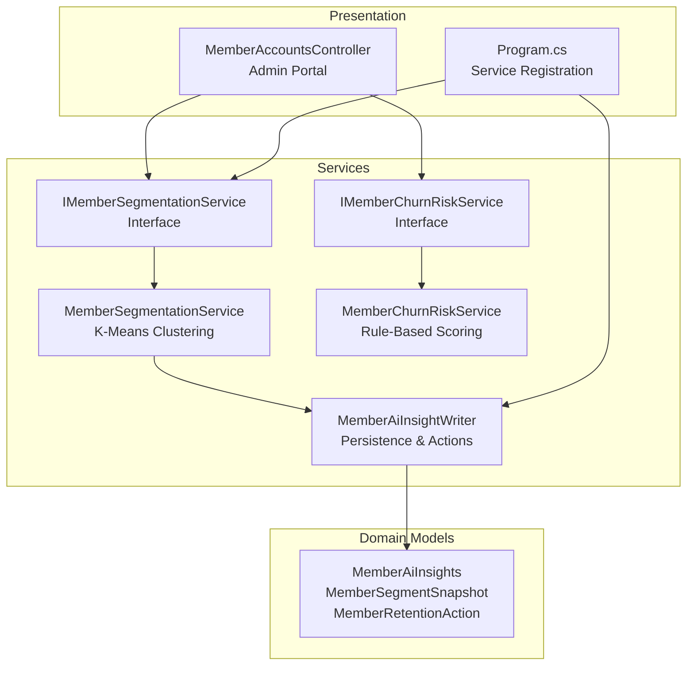
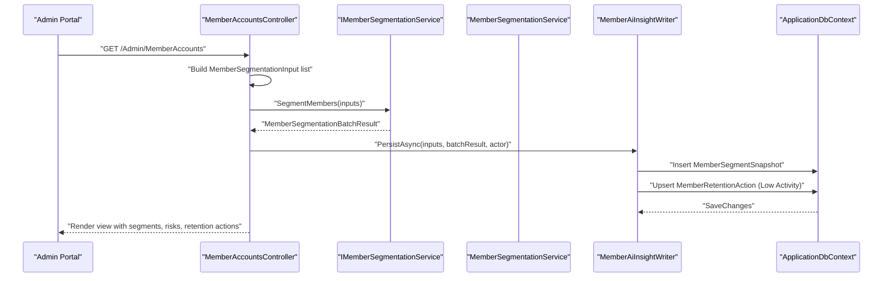
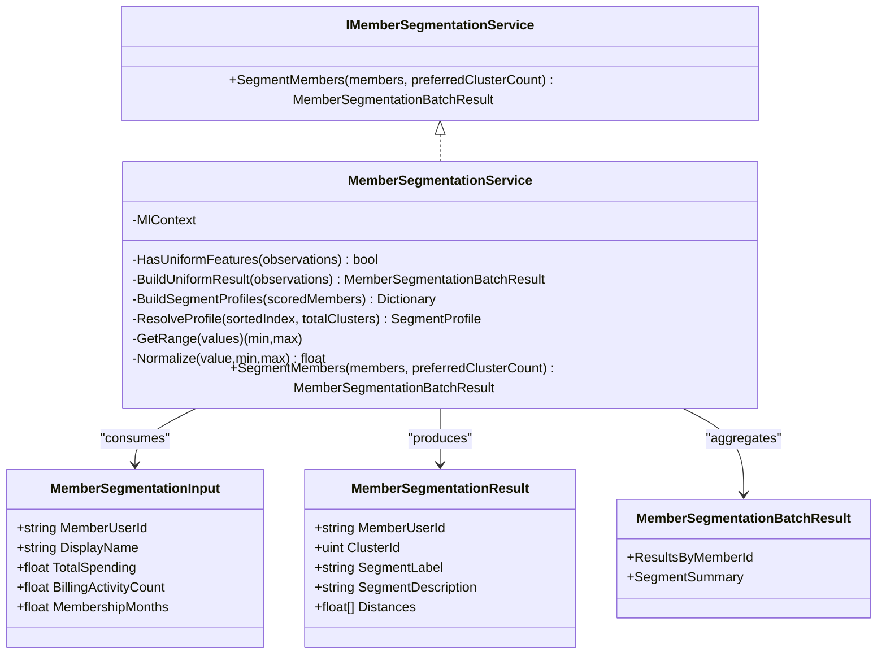
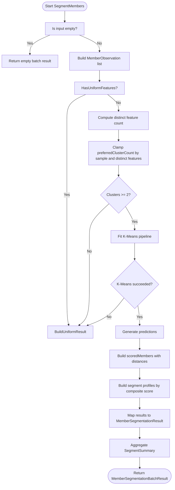
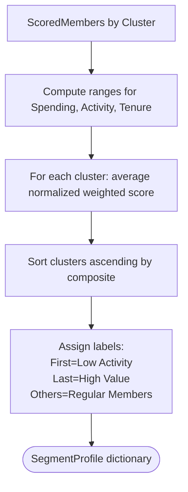
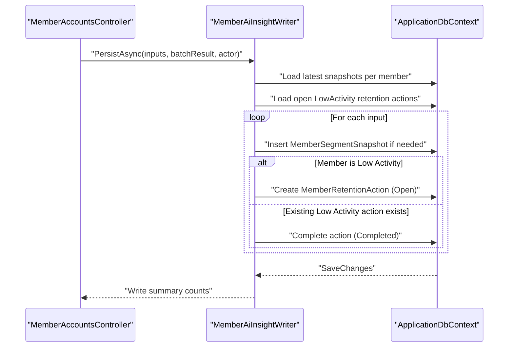
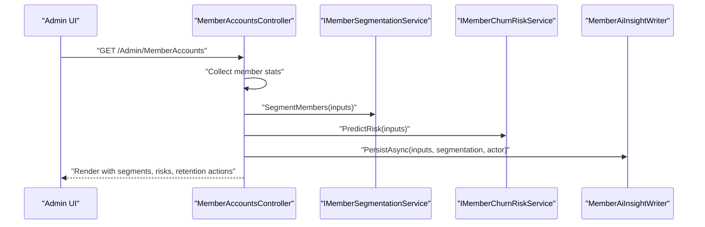
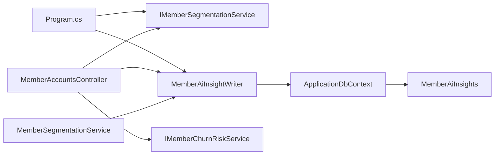
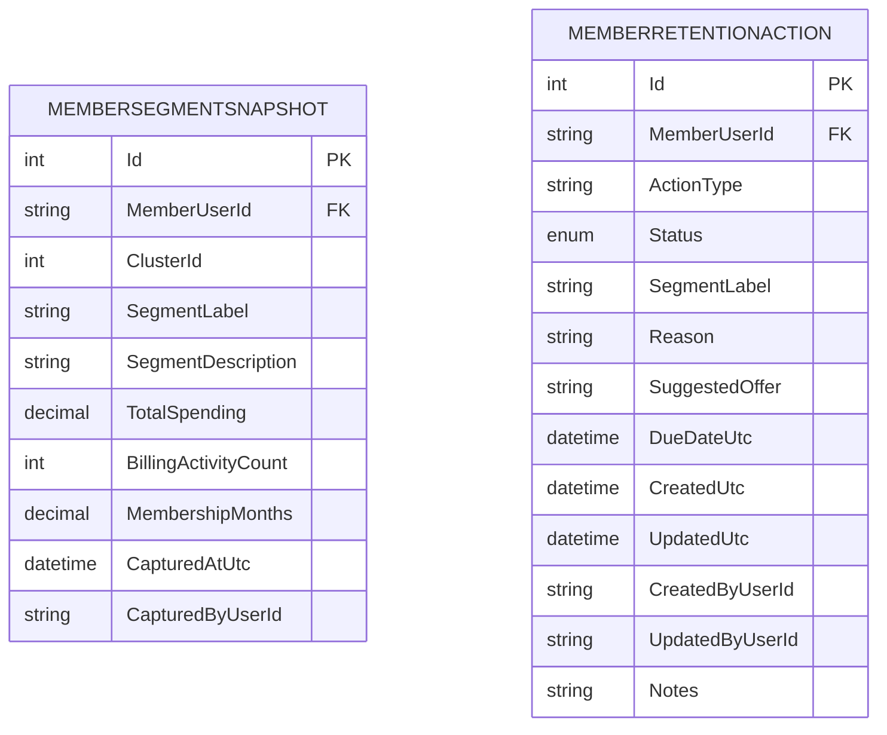

# Member Segmentation Services

<cite>
**Referenced Files in This Document**
- [IMemberSegmentationService.cs](file://Services/AI/IMemberSegmentationService.cs)
- [MemberSegmentationService.cs](file://Services/AI/MemberSegmentationService.cs)
- [IMemberChurnRiskService.cs](file://Services/AI/IMemberChurnRiskService.cs)
- [MemberChurnRiskService.cs](file://Services/AI/MemberChurnRiskService.cs)
- [MemberAiInsightWriter.cs](file://Services/AI/MemberAiInsightWriter.cs)
- [MemberAiInsights.cs](file://Models/Admin/MemberAiInsights.cs)
- [MemberAccountsController.cs](file://Controllers/MemberAccountsController.cs)
- [Program.cs](file://Program.cs)
- [MemberChurnRiskServiceTests.cs](file://EJCFitnessGym.Tests/MemberChurnRiskServiceTests.cs)
</cite>

## Table of Contents
1. [Introduction](#introduction)
2. [Project Structure](#project-structure)
3. [Core Components](#core-components)
4. [Architecture Overview](#architecture-overview)
5. [Detailed Component Analysis](#detailed-component-analysis)
6. [Dependency Analysis](#dependency-analysis)
7. [Performance Considerations](#performance-considerations)
8. [Troubleshooting Guide](#troubleshooting-guide)
9. [Conclusion](#conclusion)
10. [Appendices](#appendices)

## Introduction
This document explains the member segmentation system that categorizes gym members into distinct groups based on behavioral patterns, demographics, and preferences. It focuses on the IMemberSegmentationService interface and its MemberSegmentationService implementation, detailing the clustering algorithms, feature selection criteria, and segmentation criteria used to identify different customer segments. It also describes how segmentation data is used for targeted marketing campaigns, personalized service offerings, and retention strategies, including dynamic adaptation to evolving membership behaviors.

## Project Structure
The segmentation capability is implemented as a service layer with supporting models and persistence utilities. It integrates with the admin portal controller to compute segments for all members and persist insights for operational use.

**Diagram sources**
- [IMemberSegmentationService.cs:47-52](file://Services/AI/IMemberSegmentationService.cs#L47-L52)
- [MemberSegmentationService.cs:6-307](file://Services/AI/MemberSegmentationService.cs#L6-L307)
- [IMemberChurnRiskService.cs:53-56](file://Services/AI/IMemberChurnRiskService.cs#L53-L56)
- [MemberChurnRiskService.cs:3-173](file://Services/AI/MemberChurnRiskService.cs#L3-L173)
- [MemberAiInsightWriter.cs:7-158](file://Services/AI/MemberAiInsightWriter.cs#L7-L158)
- [MemberAiInsights.cs:13-82](file://Models/Admin/MemberAiInsights.cs#L13-L82)
- [MemberAccountsController.cs:17-39](file://Controllers/MemberAccountsController.cs#L17-L39)
- [Program.cs:370-390](file://Program.cs#L370-L390)

**Section sources**
- [IMemberSegmentationService.cs:1-54](file://Services/AI/IMemberSegmentationService.cs#L1-L54)
- [MemberSegmentationService.cs:1-308](file://Services/AI/MemberSegmentationService.cs#L1-L308)
- [IMemberChurnRiskService.cs:1-58](file://Services/AI/IMemberChurnRiskService.cs#L1-L58)
- [MemberChurnRiskService.cs:1-174](file://Services/AI/MemberChurnRiskService.cs#L1-L174)
- [MemberAiInsightWriter.cs:1-159](file://Services/AI/MemberAiInsightWriter.cs#L1-L159)
- [MemberAiInsights.cs:1-84](file://Models/Admin/MemberAiInsights.cs#L1-L84)
- [MemberAccountsController.cs:1-900](file://Controllers/MemberAccountsController.cs#L1-L900)
- [Program.cs:360-400](file://Program.cs#L360-L400)

## Core Components
- IMemberSegmentationService: Defines the contract to segment members in batches, returning per-member segment assignments and a summary of segments.
- MemberSegmentationService: Implements clustering using Microsoft ML.NET K-Means on three financial/engagement features, with robust fallbacks for uniform or insufficient data.
- IMemberChurnRiskService: Provides a complementary risk scoring service to assess attrition likelihood.
- MemberAiInsightWriter: Persists segmentation snapshots and manages retention actions for at-risk members.
- MemberAiInsights models: Store segmentation snapshots and retention actions for operational dashboards and workflows.

Key data transfer objects:
- MemberSegmentationInput: MemberUserId, DisplayName, TotalSpending, BillingActivityCount, MembershipMonths.
- MemberSegmentationResult: MemberUserId, ClusterId, SegmentLabel, SegmentDescription, Distances.
- MemberSegmentationBatchResult: ResultsByMemberId, SegmentSummary.
- MemberChurnRiskInput: Extends segmentation input with DaysSinceLastSuccessfulPayment, DaysUntilMembershipEnd, OverdueInvoiceCount, HasActiveMembership.
- MemberChurnRiskResult: MemberUserId, RiskScore, RiskLevel, Reasons, ReasonSummary.

**Section sources**
- [IMemberSegmentationService.cs:3-52](file://Services/AI/IMemberSegmentationService.cs#L3-L52)
- [MemberSegmentationService.cs:12-175](file://Services/AI/MemberSegmentationService.cs#L12-L175)
- [IMemberChurnRiskService.cs:3-56](file://Services/AI/IMemberChurnRiskService.cs#L3-L56)
- [MemberChurnRiskService.cs:5-141](file://Services/AI/MemberChurnRiskService.cs#L5-L141)
- [MemberAiInsightWriter.cs:19-156](file://Services/AI/MemberAiInsightWriter.cs#L19-L156)
- [MemberAiInsights.cs:13-82](file://Models/Admin/MemberAiInsights.cs#L13-L82)

## Architecture Overview
The segmentation pipeline runs in the admin portal controller. It aggregates member statistics, constructs inputs, computes clusters, persists insights, and enriches the UI with segment and risk information.

**Diagram sources**
- [MemberAccountsController.cs:195-220](file://Controllers/MemberAccountsController.cs#L195-L220)
- [IMemberSegmentationService.cs:49-51](file://Services/AI/IMemberSegmentationService.cs#L49-L51)
- [MemberSegmentationService.cs:47-175](file://Services/AI/MemberSegmentationService.cs#L47-L175)
- [MemberAiInsightWriter.cs:19-156](file://Services/AI/MemberAiInsightWriter.cs#L19-L156)
- [MemberAiInsights.cs:13-82](file://Models/Admin/MemberAiInsights.cs#L13-L82)

## Detailed Component Analysis

### IMemberSegmentationService and MemberSegmentationService
- Purpose: Batch segment members into clusters based on TotalSpending, BillingActivityCount, and MembershipMonths.
- Clustering: Uses Microsoft ML.NET K-Means with normalized features. Automatically selects number of clusters based on data diversity and sample size.
- Fallbacks:
  - Uniform features or insufficient variance: Assigns a default “Regular Members” label.
  - Insufficient samples (< 2) or K-Means failure: Returns uniform results.
- Profiling: Ranks clusters by a composite score derived from normalized feature means to label segments as “Low Activity”, “High Value”, or “Regular Members”.

**Diagram sources**
- [IMemberSegmentationService.cs:47-52](file://Services/AI/IMemberSegmentationService.cs#L47-L52)
- [MemberSegmentationService.cs:6-307](file://Services/AI/MemberSegmentationService.cs#L6-L307)
- [IMemberSegmentationService.cs:3-52](file://Services/AI/IMemberSegmentationService.cs#L3-L52)

**Section sources**
- [IMemberSegmentationService.cs:3-52](file://Services/AI/IMemberSegmentationService.cs#L3-L52)
- [MemberSegmentationService.cs:47-175](file://Services/AI/MemberSegmentationService.cs#L47-L175)

### Clustering Algorithm and Feature Selection
- Features:
  - TotalSpending: Lifetime monetary contribution.
  - BillingActivityCount: Number of successful payments/invoices.
  - MembershipMonths: Tenure in months.
- Preprocessing:
  - Concatenates features into a vector named “Features”.
  - Applies Min-Max normalization to scale features.
- Trainer:
  - K-Means clustering with a dynamically determined number of clusters.
- Deterministic seed:
  - ML context initialized with a fixed seed for reproducibility.
- Robustness:
  - Detects uniform features and insufficient variance.
  - Catches K-Means failures and falls back to uniform labeling.

**Diagram sources**
- [MemberSegmentationService.cs:47-175](file://Services/AI/MemberSegmentationService.cs#L47-L175)
- [MemberSegmentationService.cs:177-217](file://Services/AI/MemberSegmentationService.cs#L177-L217)
- [MemberSegmentationService.cs:219-283](file://Services/AI/MemberSegmentationService.cs#L219-L283)

**Section sources**
- [MemberSegmentationService.cs:95-118](file://Services/AI/MemberSegmentationService.cs#L95-L118)

### Segmentation Criteria and Segment Profiles
- Cluster ranking:
  - Computes average normalized weighted score per cluster (spending 50%, activity 30%, tenure 20%).
  - Sorts clusters ascending by composite score.
- Segment labels:
  - First cluster (lowest composite): “Low Activity”.
  - Last cluster (highest composite): “High Value”.
  - Others: “Regular Members”.
- Descriptions:
  - “Low Activity”: Lower billing activity and value; retention opportunity.
  - “High Value”: Strong spending and engagement; priority member segment.
  - “Regular Members”: Stable engagement with balanced value.

**Diagram sources**
- [MemberSegmentationService.cs:226-254](file://Services/AI/MemberSegmentationService.cs#L226-L254)
- [MemberSegmentationService.cs:257-283](file://Services/AI/MemberSegmentationService.cs#L257-L283)

**Section sources**
- [MemberSegmentationService.cs:219-283](file://Services/AI/MemberSegmentationService.cs#L219-L283)

### Persistence and Retention Actions
- MemberAiInsightWriter:
  - Persists MemberSegmentSnapshot entries with cluster and segment metadata.
  - Avoids duplicate snapshots if the same cluster and date exist.
  - Creates retention actions for “Low Activity” members and auto-closes them when members move out of that segment.
- MemberAiInsights models:
  - MemberSegmentSnapshot: Stores per-member snapshot of cluster and metrics.
  - MemberRetentionAction: Tracks open/in-progress/completed actions for retention.

**Diagram sources**
- [MemberAiInsightWriter.cs:19-156](file://Services/AI/MemberAiInsightWriter.cs#L19-L156)
- [MemberAiInsights.cs:13-82](file://Models/Admin/MemberAiInsights.cs#L13-L82)

**Section sources**
- [MemberAiInsightWriter.cs:19-156](file://Services/AI/MemberAiInsightWriter.cs#L19-L156)
- [MemberAiInsights.cs:13-82](file://Models/Admin/MemberAiInsights.cs#L13-L82)

### Integration in Admin Portal
- MemberAccountsController:
  - Builds MemberSegmentationInput from aggregated member stats.
  - Calls IMemberSegmentationService and IMemberChurnRiskService.
  - Persists insights via MemberAiInsightWriter for SuperAdmin.
  - Enriches view model with AI cluster, segment label/description, and open retention actions.

**Diagram sources**
- [MemberAccountsController.cs:195-220](file://Controllers/MemberAccountsController.cs#L195-L220)
- [IMemberSegmentationService.cs:49-51](file://Services/AI/IMemberSegmentationService.cs#L49-L51)
- [IMemberChurnRiskService.cs:55-56](file://Services/AI/IMemberChurnRiskService.cs#L55-L56)
- [MemberAiInsightWriter.cs:19-28](file://Services/AI/MemberAiInsightWriter.cs#L19-L28)

**Section sources**
- [MemberAccountsController.cs:195-318](file://Controllers/MemberAccountsController.cs#L195-L318)

### Dynamic Nature and Adaptation
- Freshness:
  - Segmentation snapshots are timestamped; duplicates are avoided when the cluster and date match.
- Evolution:
  - As membership patterns change (spending, activity, tenure), K-Means re-clusters members into new profiles.
- Operational feedback:
  - Retention actions are auto-closed when members improve out of “Low Activity,” ensuring dynamic alignment with current behavior.

**Section sources**
- [MemberAiInsightWriter.cs:84-142](file://Services/AI/MemberAiInsightWriter.cs#L84-L142)
- [MemberSegmentationService.cs:177-217](file://Services/AI/MemberSegmentationService.cs#L177-L217)

### Examples of Common Segment Types
- High Value:
  - Strong spending and engagement; priority for upsell and retention.
- Low Activity:
  - Lower billing activity and value; triggers retention outreach.
- Regular Members:
  - Balanced value and engagement; standard communication and offers.

These labels and descriptions are derived from the cluster ranking and composite scoring logic.

**Section sources**
- [MemberSegmentationService.cs:257-283](file://Services/AI/MemberSegmentationService.cs#L257-L283)

### Complementary Risk Scoring
- MemberChurnRiskService augments segmentation with risk scores based on:
  - Days since last successful payment.
  - Overdue invoice count.
  - Membership end date proximity.
  - Active membership status.
  - Tenure and billing activity.
- Risk levels: High (score ≥ 70), Medium (score ≥ 40), Low (score < 40).
- Used alongside segmentation to tailor interventions.

**Section sources**
- [IMemberChurnRiskService.cs:3-56](file://Services/AI/IMemberChurnRiskService.cs#L3-L56)
- [MemberChurnRiskService.cs:36-141](file://Services/AI/MemberChurnRiskService.cs#L36-L141)
- [MemberChurnRiskServiceTests.cs:7-112](file://EJCFitnessGym.Tests/MemberChurnRiskServiceTests.cs#L7-L112)

## Dependency Analysis
- Service registration:
  - IMemberSegmentationService is registered as scoped in Program.cs.
- Controller dependencies:
  - MemberAccountsController depends on IMemberSegmentationService, IMemberChurnRiskService, and MemberAiInsightWriter.
- Persistence:
  - MemberAiInsightWriter writes to ApplicationDbContext and reads MemberSegmentSnapshot and MemberRetentionAction entities.

**Diagram sources**
- [Program.cs:370-390](file://Program.cs#L370-L390)
- [MemberAccountsController.cs:23-38](file://Controllers/MemberAccountsController.cs#L23-L38)
- [MemberAiInsightWriter.cs:12-17](file://Services/AI/MemberAiInsightWriter.cs#L12-L17)
- [MemberAiInsights.cs:13-82](file://Models/Admin/MemberAiInsights.cs#L13-L82)

**Section sources**
- [Program.cs:370-390](file://Program.cs#L370-L390)
- [MemberAccountsController.cs:23-38](file://Controllers/MemberAccountsController.cs#L23-L38)

## Performance Considerations
- Data preprocessing:
  - Normalization ensures balanced influence of features during clustering.
- Sample size:
  - Automatic cluster count clamping prevents overfitting on small samples.
- Robustness:
  - Uniform feature detection and K-Means failure handling avoid inconsistent results.
- Persistence:
  - Snapshot deduplication reduces write overhead and maintains clean historical records.

[No sources needed since this section provides general guidance]

## Troubleshooting Guide
- No segments returned:
  - Verify inputs are non-empty and contain sufficient variation in features.
- Uniform “Regular Members” assignment:
  - Indicates uniform or insufficiently varied features; review data ingestion.
- K-Means failures:
  - Occur on very small or low-variance datasets; fallback logic applies default labels.
- Missing retention actions:
  - Ensure MemberAiInsightWriter is invoked and snapshots are persisted; confirm actor identity and date checks.

**Section sources**
- [MemberSegmentationService.cs:51-90](file://Services/AI/MemberSegmentationService.cs#L51-L90)
- [MemberSegmentationService.cs:114-118](file://Services/AI/MemberSegmentationService.cs#L114-L118)
- [MemberAiInsightWriter.cs:84-142](file://Services/AI/MemberAiInsightWriter.cs#L84-L142)

## Conclusion
The member segmentation system combines scalable K-Means clustering with deterministic fallbacks to deliver actionable segment labels aligned with business goals. Integrated with retention actions and risk scoring, it enables dynamic, data-driven strategies for targeted marketing, personalized offerings, and proactive retention. As membership behaviors evolve, the system adapts automatically through fresh snapshots and operational feedback loops.

[No sources needed since this section summarizes without analyzing specific files]

## Appendices

### Data Model Overview

**Diagram sources**
- [MemberAiInsights.cs:13-82](file://Models/Admin/MemberAiInsights.cs#L13-L82)