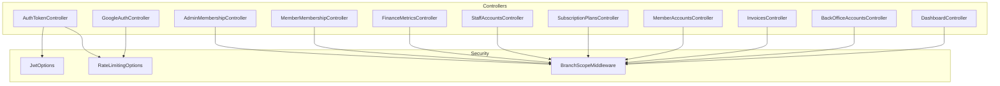
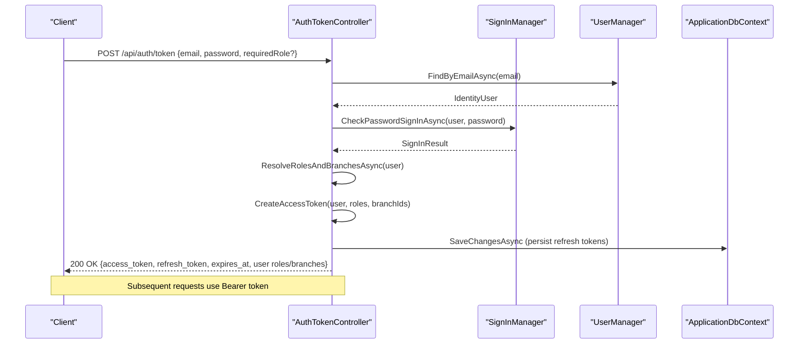
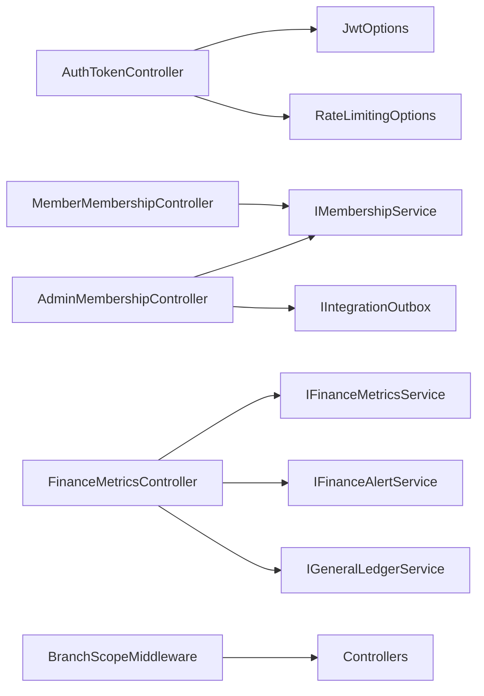

# API Reference

<cite>
**Referenced Files in This Document**
- [AuthTokenController.cs](file://Controllers/AuthTokenController.cs)
- [GoogleAuthController.cs](file://Controllers/GoogleAuthController.cs)
- [AdminMembershipController.cs](file://Controllers/AdminMembershipController.cs)
- [MemberMembershipController.cs](file://Controllers/MemberMembershipController.cs)
- [FinanceMetricsController.cs](file://Controllers/FinanceMetricsController.cs)
- [StaffAccountsController.cs](file://Controllers/StaffAccountsController.cs)
- [SubscriptionPlansController.cs](file://Controllers/SubscriptionPlansController.cs)
- [MemberAccountsController.cs](file://Controllers/MemberAccountsController.cs)
- [InvoicesController.cs](file://Controllers/InvoicesController.cs)
- [BackOfficeAccountsController.cs](file://Controllers/BackOfficeAccountsController.cs)
- [DashboardController.cs](file://Controllers/DashboardController.cs)
- [JwtOptions.cs](file://Security/JwtOptions.cs)
- [BranchScopeMiddleware.cs](file://Security/BranchScopeMiddleware.cs)
- [RateLimitingOptions.cs](file://Security/RateLimitingOptions.cs)
</cite>

## Table of Contents
1. [Introduction](#introduction)
2. [Project Structure](#project-structure)
3. [Core Components](#core-components)
4. [Architecture Overview](#architecture-overview)
5. [Detailed Component Analysis](#detailed-component-analysis)
6. [Dependency Analysis](#dependency-analysis)
7. [Performance Considerations](#performance-considerations)
8. [Troubleshooting Guide](#troubleshooting-guide)
9. [Conclusion](#conclusion)
10. [Appendices](#appendices)

## Introduction
This document provides comprehensive API documentation for the EJC Fitness Gym system. It covers authentication and authorization, membership management, financial reporting and dashboards, staff management, and inventory-related endpoints. For each endpoint group, we describe HTTP methods, URL patterns, request/response schemas, authentication requirements, error responses, and security considerations including rate limiting and branch scoping.

## Project Structure
The API surface is primarily implemented via ASP.NET Core controllers under the Controllers folder. Authentication and authorization are enforced via attributes and middleware. Security configurations for JWT and rate limiting are centralized in Security.

**Diagram sources**
- [AuthTokenController.cs:18-597](file://Controllers/AuthTokenController.cs#L18-L597)
- [GoogleAuthController.cs:17-303](file://Controllers/GoogleAuthController.cs#L17-L303)
- [AdminMembershipController.cs:12-448](file://Controllers/AdminMembershipController.cs#L12-L448)
- [MemberMembershipController.cs:12-204](file://Controllers/MemberMembershipController.cs#L12-L204)
- [FinanceMetricsController.cs:12-693](file://Controllers/FinanceMetricsController.cs#L12-L693)
- [StaffAccountsController.cs:17-1025](file://Controllers/StaffAccountsController.cs#L17-L1025)
- [SubscriptionPlansController.cs:11-290](file://Controllers/SubscriptionPlansController.cs#L11-L290)
- [MemberAccountsController.cs:17-900](file://Controllers/MemberAccountsController.cs#L17-L900)
- [InvoicesController.cs:14-281](file://Controllers/InvoicesController.cs#L14-L281)
- [BackOfficeAccountsController.cs:13-615](file://Controllers/BackOfficeAccountsController.cs#L13-L615)
- [DashboardController.cs:22-1148](file://Controllers/DashboardController.cs#L22-L1148)
- [JwtOptions.cs:3-14](file://Security/JwtOptions.cs#L3-L14)
- [BranchScopeMiddleware.cs:5-73](file://Security/BranchScopeMiddleware.cs#L5-L73)
- [RateLimitingOptions.cs:3-13](file://Security/RateLimitingOptions.cs#L3-L13)

**Section sources**
- [AuthTokenController.cs:18-597](file://Controllers/AuthTokenController.cs#L18-L597)
- [GoogleAuthController.cs:17-303](file://Controllers/GoogleAuthController.cs#L17-L303)
- [AdminMembershipController.cs:12-448](file://Controllers/AdminMembershipController.cs#L12-L448)
- [MemberMembershipController.cs:12-204](file://Controllers/MemberMembershipController.cs#L12-L204)
- [FinanceMetricsController.cs:12-693](file://Controllers/FinanceMetricsController.cs#L12-L693)
- [StaffAccountsController.cs:17-1025](file://Controllers/StaffAccountsController.cs#L17-L1025)
- [SubscriptionPlansController.cs:11-290](file://Controllers/SubscriptionPlansController.cs#L11-L290)
- [MemberAccountsController.cs:17-900](file://Controllers/MemberAccountsController.cs#L17-L900)
- [InvoicesController.cs:14-281](file://Controllers/InvoicesController.cs#L14-L281)
- [BackOfficeAccountsController.cs:13-615](file://Controllers/BackOfficeAccountsController.cs#L13-L615)
- [DashboardController.cs:22-1148](file://Controllers/DashboardController.cs#L22-L1148)
- [JwtOptions.cs:3-14](file://Security/JwtOptions.cs#L3-L14)
- [BranchScopeMiddleware.cs:5-73](file://Security/BranchScopeMiddleware.cs#L5-L73)
- [RateLimitingOptions.cs:3-13](file://Security/RateLimitingOptions.cs#L3-L13)

## Core Components
- Authentication and Authorization
  - JWT issuance, refresh, revoke, and identity retrieval endpoints under api/auth.
  - Google OAuth sign-in endpoint under api/GoogleAuth.
  - Branch-scoped access enforcement via middleware for back-office routes.
  - Rate limiting applied to sensitive authentication endpoints.

- Membership Management
  - Admin endpoints for viewing current membership, listing plans, renewing, pausing, resuming, canceling, and running lifecycle maintenance.
  - Member-facing endpoints for retrieving current membership, available plans, and subscription history.

- Financial APIs
  - Finance dashboards and reports: overview, AI overview, insights, monthly snapshots, equipment, expenses, alerts, and CRUD for equipment and expenses.
  - Alert lifecycle management (acknowledge, resolve, reopen).

- Staff Management
  - Staff account creation, position updates, archiving/restoration, and details.
  - Branch-scoped access controls apply.

- Inventory and POS
  - Subscription plan catalog and management (UI controllers).
  - Invoices management (create, list, details, add payments).
  - Member account management (list, create, edit, delete).

- Dashboards and Profiles
  - Super admin, member, and profile endpoints for dashboards and personal profile updates.

**Section sources**
- [AuthTokenController.cs:18-597](file://Controllers/AuthTokenController.cs#L18-L597)
- [GoogleAuthController.cs:17-303](file://Controllers/GoogleAuthController.cs#L17-L303)
- [AdminMembershipController.cs:12-448](file://Controllers/AdminMembershipController.cs#L12-L448)
- [MemberMembershipController.cs:12-204](file://Controllers/MemberMembershipController.cs#L12-L204)
- [FinanceMetricsController.cs:12-693](file://Controllers/FinanceMetricsController.cs#L12-L693)
- [StaffAccountsController.cs:17-1025](file://Controllers/StaffAccountsController.cs#L17-L1025)
- [SubscriptionPlansController.cs:11-290](file://Controllers/SubscriptionPlansController.cs#L11-L290)
- [MemberAccountsController.cs:17-900](file://Controllers/MemberAccountsController.cs#L17-L900)
- [InvoicesController.cs:14-281](file://Controllers/InvoicesController.cs#L14-L281)
- [BackOfficeAccountsController.cs:13-615](file://Controllers/BackOfficeAccountsController.cs#L13-L615)
- [DashboardController.cs:22-1148](file://Controllers/DashboardController.cs#L22-L1148)
- [BranchScopeMiddleware.cs:5-73](file://Security/BranchScopeMiddleware.cs#L5-L73)
- [RateLimitingOptions.cs:3-13](file://Security/RateLimitingOptions.cs#L3-L13)

## Architecture Overview
The API follows REST conventions with JSON payloads. Authentication is JWT-based with refresh tokens persisted server-side. Branch scoping ensures back-office users operate within assigned branches. Rate limiting protects authentication endpoints.

**Diagram sources**
- [AuthTokenController.cs:49-232](file://Controllers/AuthTokenController.cs#L49-L232)
- [JwtOptions.cs:3-14](file://Security/JwtOptions.cs#L3-L14)

**Section sources**
- [AuthTokenController.cs:49-232](file://Controllers/AuthTokenController.cs#L49-L232)
- [JwtOptions.cs:3-14](file://Security/JwtOptions.cs#L3-L14)

## Detailed Component Analysis

### Authentication API (api/auth)
- Base path: api/auth
- Rate limiting: Enabled for token issuance, refresh, and revoke endpoints.

Endpoints
- POST /api/auth/token
  - Purpose: Issue access and refresh tokens.
  - Auth: None (anonymous).
  - Request body: { email, password, requiredRole? }.
  - Response: { token_type, access_token, expires_at_utc, refresh_token, refresh_token_expires_at_utc, user_id, email, roles[], branch_ids[] }.
  - Errors: 400 (missing credentials), 401 (invalid credentials/locked/out allowed), 423 (signing key missing), 503 (service unavailable).
  - Security: Validates credentials, checks lockout/allow conditions, enforces requiredRole if provided, prunes refresh tokens, sets secure refresh token state.

- POST /api/auth/refresh
  - Purpose: Exchange refresh token for new access and refresh tokens.
  - Auth: None (anonymous).
  - Request body: { refresh_token, requiredRole? }.
  - Response: Same as token issuance.
  - Errors: 400 (invalid token), 401 (expired/revoked/locked), 423 (signing key missing), 503 (service unavailable).
  - Security: Hash validation, revocation checks, rotation of refresh tokens.

- POST /api/auth/revoke
  - Purpose: Mark a refresh token as revoked.
  - Auth: None (anonymous).
  - Request body: { refresh_token }.
  - Response: { revoked: boolean }.
  - Errors: 400 (invalid token), 401 (invalid user), 403 (forbidden).

- GET /api/auth/me
  - Purpose: Retrieve current authenticated identity claims.
  - Auth: Bearer JWT required.
  - Response: { user_id, email, roles[], branch_ids[], authentication_type }.
  - Errors: 401 (unauthorized), 403 (forbidden).

Security and Options
- JWT signing key, issuer, audience, token durations, and refresh retention are configured via JwtOptions.
- Rate limiting policy name is StrictAuthLimit.

**Section sources**
- [AuthTokenController.cs:49-232](file://Controllers/AuthTokenController.cs#L49-L232)
- [JwtOptions.cs:3-14](file://Security/JwtOptions.cs#L3-L14)
- [RateLimitingOptions.cs:3-13](file://Security/RateLimitingOptions.cs#L3-L13)

### Google OAuth API (api/GoogleAuth)
- Base path: api/GoogleAuth
- Purpose: Federated sign-in using Google Sign-In.

Endpoints
- POST /api/GoogleAuth/signin
  - Purpose: Validate Google credential and sign in or create member account.
  - Auth: None (anonymous).
  - Form fields: credential (ID token), g_csrf_token (form param), returnUrl, origin.
  - Behavior: Validates CSRF token, validates Google ID token against configured client ID, ensures email verified, creates/assigns Member role, persists profile, signs in user, redirects to normalized return URL.
  - Errors: Redirects with error messages on validation failures or exceptions.

Notes
- Uses Google.Apis.Auth for ID token verification.
- Ensures member profile and home branch assignment during sign-in.

**Section sources**
- [GoogleAuthController.cs:41-138](file://Controllers/GoogleAuthController.cs#L41-L138)

### Membership Management API (api/admin/memberships and api/member/membership)
- Base paths: api/admin/memberships (Admin/Finance/SuperAdmin), api/member/membership (Member)

Admin Endpoints
- GET /api/admin/memberships/{memberUserId}/current
  - Purpose: Get latest subscription for a member.
  - Auth: Bearer JWT (Admin/Finance/SuperAdmin).
  - Response: { id, member_user_id, plan_id, plan_name, status, start_date_utc, end_date_utc, external_subscription_id }.
  - Errors: 400 (missing memberUserId), 403 (no manage permission), 404 (no subscription).

- GET /api/admin/memberships/plans
  - Purpose: List subscription plans with assignment stats.
  - Auth: Bearer JWT (Admin/Finance/SuperAdmin).
  - Response: Array of { id, name, description, price, billing_cycle, is_active, total_assignments, active_assignments }.

- POST /api/admin/memberships/{memberUserId}/renew
  - Purpose: Renew or activate subscription for a member.
  - Auth: Bearer JWT (Admin/Finance/SuperAdmin).
  - Request body: { plan_id?, start_date_utc?, external_subscription_id?, external_customer_id? }.
  - Response: { id, member_user_id, plan_id, status, start_date_utc, end_date_utc, external_subscription_id }.
  - Errors: 400 (validation), 403 (no manage permission), 404 (not found), 409 (conflict).

- POST /api/admin/memberships/{memberUserId}/pause
  - Purpose: Pause subscription.
  - Auth: Bearer JWT (Admin/Finance/SuperAdmin).
  - Response: { message, subscription_id } or { message } if already paused.

- POST /api/admin/memberships/{memberUserId}/resume
  - Purpose: Resume subscription.
  - Auth: Bearer JWT (Admin/Finance/SuperAdmin).
  - Response: { message, subscription_id, status, start_date_utc, end_date_utc }.

- POST /api/admin/memberships/{memberUserId}/cancel
  - Purpose: Cancel subscription.
  - Auth: Bearer JWT (Admin/Finance/SuperAdmin).
  - Response: { message, subscription_id } or { message } if already cancelled.

- POST /api/admin/memberships/lifecycle/run
  - Purpose: Run lifecycle maintenance (expire subscriptions, overdue invoices).
  - Auth: Bearer JWT (Admin/Finance/SuperAdmin).
  - Response: { as_of_utc, expired_subscriptions, overdue_invoices }.

Member Endpoints
- GET /api/member/membership
  - Purpose: Get current membership status, balances, and plan benefits.
  - Auth: Bearer JWT (Member).
  - Response: { has_subscription, plan_name, plan_tier, entitlements[], status, start_date_utc, end_date_utc, next_payment_due_date_utc, outstanding_balance, scheduled_balance, total_paid }.

- GET /api/member/membership/plans
  - Purpose: List available plans with current plan context.
  - Auth: Bearer JWT (Member).
  - Response: { current_plan_id, current_plan_name, has_active_membership, plans[] }.

- GET /api/member/membership/history
  - Purpose: Retrieve subscription history.
  - Auth: Bearer JWT (Member).
  - Query: take (default 12).
  - Response: Array of { id, plan_id, plan_name, status, start_date_utc, end_date_utc, external_subscription_id }.

Branch Scoping
- Admin endpoints enforce branch scope via claims and membership ownership checks.

**Section sources**
- [AdminMembershipController.cs:31-398](file://Controllers/AdminMembershipController.cs#L31-L398)
- [MemberMembershipController.cs:34-201](file://Controllers/MemberMembershipController.cs#L34-L201)
- [BranchScopeMiddleware.cs:5-73](file://Security/BranchScopeMiddleware.cs#L5-L73)

### Financial APIs (api/finance)
- Base path: api/finance
- Auth: Bearer JWT with FinanceApiAccess policy.
- Branch scoping: Enforced via User.GetBranchId() on protected endpoints.

Endpoints
- GET /api/finance/overview
  - Query: from_utc?, to_utc?
  - Response: Overview metrics for the branch.

- GET /api/finance/ai-overview
  - Query: from_utc?, to_utc?
  - Response: AI-driven insights for the branch.

- GET /api/finance/insights
  - Query: lookback_days=120, forecast_days=30
  - Response: Insights data.

- GET /api/finance/monthly
  - Query: months=6, include_projection=true
  - Response: Monthly snapshots with revenue, costs, profit, counts.

- GET /api/finance/equipment
  - Response: Equipment assets for the branch.

- GET /api/finance/expenses
  - Query: from_utc?, to_utc?
  - Response: Expenses for the branch.

- GET /api/finance/alerts
  - Query: from_utc?, to_utc?, severity?, state?, alert_type?, trigger?, take=100, include_payload=false
  - Response: { count, filters, items[] }.
  - Filters support state enum parsing.

- POST /api/finance/alerts/{id}/ack
  - Body: none
  - Response: Lifecycle result.

- POST /api/finance/alerts/{id}/resolve
  - Body: { false_positive?, resolution_note? }
  - Response: Lifecycle result.

- POST /api/finance/alerts/{id}/reopen
  - Body: none
  - Response: Lifecycle result.

- POST /api/finance/expenses
  - Body: { name, category, amount, expense_date_utc?, is_recurring?, is_active?, notes? }
  - Response: Created expense.

- POST /api/finance/alerts/evaluate
  - Body: none
  - Response: { finance, churn } evaluation results.

- GET /api/finance/equipment/{id}
  - Response: Equipment asset details.

- POST /api/finance/equipment
  - Body: { name, brand?, category, quantity, unit_cost, useful_life_months, purchased_at_utc?, is_active?, notes? }
  - Response: Created equipment asset.

- POST /api/finance/equipment/seed-medium-gym
  - Body: none
  - Response: { inserted, skipped, total_assets }.

Errors
- 400 (validation), 403 (forbidden), 404 (not found), 409 (conflict), 500 (server error).

**Section sources**
- [FinanceMetricsController.cs:43-693](file://Controllers/FinanceMetricsController.cs#L43-L693)
- [BranchScopeMiddleware.cs:5-73](file://Security/BranchScopeMiddleware.cs#L5-L73)

### Staff Management API (Admin/StaffAccounts)
- Base path: Admin/StaffAccounts (UI controllers)
- Auth: Bearer JWT (Admin/SuperAdmin)
- Branch scoping: Enforced for staff actions.

Endpoints (UI)
- GET /Admin/StaffAccounts
  - Lists staff accounts with archive status, positions, and branch info.

- POST /Admin/StaffAccounts/Create
  - Creates staff account with generated password, assigns Staff role, branch claim, and position claim.

- POST /Admin/StaffAccounts/UpdatePosition
  - Updates staff position with validation and branch scope checks.

- POST /Admin/StaffAccounts/Archive
  - Archives staff account (locks out, adds archive claims).

- POST /Admin/StaffAccounts/Restore
  - Restores archived staff account (unlocks, resets counters, adds restore claims).

- GET /Admin/StaffAccounts/Details/{id}
  - Returns staff details including recent attendance events handled by this staff.

Notes
- Email domain and position options are configurable.
- Archive status maintained via custom claims.

**Section sources**
- [StaffAccountsController.cs:57-600](file://Controllers/StaffAccountsController.cs#L57-L600)
- [BackOfficeAccountsController.cs:40-259](file://Controllers/BackOfficeAccountsController.cs#L40-L259)

### Inventory and Subscription Plans API (UI)
- Base path: SubscriptionPlans (UI)
- Auth: Bearer JWT (Admin/Finance/SuperAdmin)

Endpoints (UI)
- GET /SubscriptionPlans
  - Lists subscription plans with assignment totals and active counts.

- GET /SubscriptionPlans/Create
  - Returns default plan preset for creation.

- POST /SubscriptionPlans/Create
  - Creates a new plan with preset application and validation.

- GET /SubscriptionPlans/Edit/{id}
  - Returns plan for editing.

- POST /SubscriptionPlans/Edit/{id}
  - Updates plan with validation.

- GET /SubscriptionPlans/Details/{id}
  - Returns plan details with benefits.

- GET /SubscriptionPlans/Delete/{id}
  - Returns deletion confirmation view.

- POST /SubscriptionPlans/Delete
  - Deletes or deactivates plan depending on assignments.

- POST /SubscriptionPlans/SeedDefaults
  - Seeds default subscription plans if missing.

Notes
- Plan benefits and tiers inferred from catalog helpers.

**Section sources**
- [SubscriptionPlansController.cs:21-256](file://Controllers/SubscriptionPlansController.cs#L21-L256)

### Member Accounts API (Admin/MemberAccounts)
- Base path: Admin/MemberAccounts (UI)
- Auth: Bearer JWT (Admin/Finance/SuperAdmin)

Endpoints (UI)
- GET /Admin/MemberAccounts
  - Lists members with home branch, plan status, overdue counts, and AI insights summaries.

- GET /Admin/MemberAccounts/Create
  - Returns form for creating a member with subscription and profile.

- POST /Admin/MemberAccounts/Create
  - Creates member, assigns Member role, profile, home branch, and initial subscription.

- GET /Admin/MemberAccounts/Details/{id}
  - Returns member details with plan, AI segments, retention actions.

- GET /Admin/MemberAccounts/Edit/{id}
  - Returns form for editing member profile, plan, dates, and status.

- POST /Admin/MemberAccounts/Edit/{id}
  - Updates member profile, plan, dates, and status.

- GET /Admin/MemberAccounts/Delete/{id}
  - Returns deletion confirmation.

- POST /Admin/MemberAccounts/Delete/{id}
  - Deletes member, subscriptions, and profile.

Notes
- Branch scoping enforced for Admin/Finance users.
- AI insights and churn risk computed and persisted.

**Section sources**
- [MemberAccountsController.cs:41-800](file://Controllers/MemberAccountsController.cs#L41-L800)

### Invoices API (Invoices)
- Base path: Invoices (UI)
- Auth: Bearer JWT (Staff/Admin/Finance/SuperAdmin)

Endpoints (UI)
- GET /Invoices
  - Lists invoices filtered by status, scoped by branch.

- GET /Invoices/Create
  - Returns invoice creation form with member selection.

- POST /Invoices/Create
  - Creates invoice linked to member’s branch, validates scope.

- GET /Invoices/Details/{id}
  - Returns invoice details with payments.

- POST /Invoices/AddPayment
  - Adds payment to invoice, updates status to Paid if amount >= invoice amount, posts to general ledger.

Notes
- Branch scoping enforced; SuperAdmin bypasses scope.

**Section sources**
- [InvoicesController.cs:34-281](file://Controllers/InvoicesController.cs#L34-L281)

### Back Office Accounts API (Admin/BackOfficeAccounts)
- Base path: Admin/BackOfficeAccounts (UI)
- Auth: Bearer JWT (SuperAdmin)

Endpoints (UI)
- GET /Admin/BackOfficeAccounts
  - Lists Admin/Finance accounts with audit claims and status.

- POST /Admin/BackOfficeAccounts/Create
  - Creates Admin/Finance account with branch claim and audit claims.

- POST /Admin/BackOfficeAccounts/ToggleStatus
  - Activates/deactivates account (lockout), updates audit claims.

Notes
- Managed roles: Admin, Finance.
- Audit claims track created_by, created_utc, status, status_changed_by, status_changed_utc.

**Section sources**
- [BackOfficeAccountsController.cs:40-259](file://Controllers/BackOfficeAccountsController.cs#L40-L259)

### Dashboards and Profiles API (Dashboard)
- Base path: Dashboard (UI)
- Auth: Bearer JWT (role-based routing)

Endpoints (UI)
- GET /
  - Routes to appropriate dashboard based on role.

- GET /SuperAdmin
  - Returns super admin dashboard metrics.

- GET /Member
  - Returns member dashboard with plan, balances, invoices, recent activities.

- GET /Profile
  - Returns profile edit form.

- POST /Profile
  - Updates profile, validates image constraints, handles uploads, assigns home branch.

- POST /RequestMembershipCancellation
  - Submits membership cancellation request with validation.

Notes
- Member dashboard reconciles pending payments via PayMongo service.
- Profile supports image upload with allowed extensions and size limits.

**Section sources**
- [DashboardController.cs:54-800](file://Controllers/DashboardController.cs#L54-L800)

## Dependency Analysis
- Authentication depends on ASP.NET Core Identity and JWT options.
- Membership endpoints depend on membership service and integration outbox for notifications.
- Finance endpoints depend on metrics, alert, and general ledger services.
- Controllers enforce branch scoping via middleware and user claims.
- Rate limiting applies to authentication endpoints.

**Diagram sources**
- [AuthTokenController.cs:26-47](file://Controllers/AuthTokenController.cs#L26-L47)
- [JwtOptions.cs:3-14](file://Security/JwtOptions.cs#L3-L14)
- [RateLimitingOptions.cs:3-13](file://Security/RateLimitingOptions.cs#L3-L13)
- [AdminMembershipController.cs:17-29](file://Controllers/AdminMembershipController.cs#L17-L29)
- [MemberMembershipController.cs:17-32](file://Controllers/MemberMembershipController.cs#L17-L32)
- [FinanceMetricsController.cs:17-41](file://Controllers/FinanceMetricsController.cs#L17-L41)
- [BranchScopeMiddleware.cs:5-73](file://Security/BranchScopeMiddleware.cs#L5-L73)

**Section sources**
- [AuthTokenController.cs:26-47](file://Controllers/AuthTokenController.cs#L26-L47)
- [JwtOptions.cs:3-14](file://Security/JwtOptions.cs#L3-L14)
- [RateLimitingOptions.cs:3-13](file://Security/RateLimitingOptions.cs#L3-L13)
- [AdminMembershipController.cs:17-29](file://Controllers/AdminMembershipController.cs#L17-L29)
- [MemberMembershipController.cs:17-32](file://Controllers/MemberMembershipController.cs#L17-L32)
- [FinanceMetricsController.cs:17-41](file://Controllers/FinanceMetricsController.cs#L17-L41)
- [BranchScopeMiddleware.cs:5-73](file://Security/BranchScopeMiddleware.cs#L5-L73)

## Performance Considerations
- Token lifecycle maintenance: Refresh tokens are pruned and rotated to limit storage and mitigate replay risk.
- Query pagination and filtering: Finance endpoints clamp take parameters and filter by date ranges to control load.
- Background reconciliation: Membership endpoints attempt reconciliation but swallow transient failures to keep endpoints responsive.
- Branch scoping: Middleware short-circuits unauthorized API requests to reduce unnecessary work.

[No sources needed since this section provides general guidance]

## Troubleshooting Guide
Common Errors and Scenarios
- Authentication
  - 400 Bad Request: Missing email/password or invalid request shape.
  - 401 Unauthorized: Invalid credentials, locked account, not allowed to sign in, or invalid/revoked refresh token.
  - 403 Forbidden: Missing branch scope for back-office routes.
  - 423 Locked: JWT signing key not configured.
  - 503 Service Unavailable: Signing key missing during token issuance.

- Membership
  - 400 Bad Request: Missing memberUserId or invalid renewal request.
  - 403 Forbidden: Insufficient permissions to manage member.
  - 404 Not Found: No subscription found for pause/resume/cancel or renewal target plan.
  - 409 Conflict: Invalid alert lifecycle transitions.

- Finance
  - 400 Bad Request: Invalid alert state value or validation errors.
  - 403 Forbidden: Branch scope required for equipment/alerts endpoints.
  - 404 Not Found: Equipment asset not found.

- Staff and Back Office
  - 403 Forbidden: Attempt to archive self or exceed branch scope.
  - 400 Bad Request: Invalid position or branch selection.

- Invoices
  - 403 Forbidden: Creating invoices without branch scope.
  - 404 Not Found: Invoice not found.
  - 400 Bad Request: Invalid payment amount.

- Member Dashboard
  - 401 Unauthorized: Unauthenticated user.
  - 403 Forbidden: Missing branch scope for back-office routes.

**Section sources**
- [AuthTokenController.cs:49-232](file://Controllers/AuthTokenController.cs#L49-L232)
- [AdminMembershipController.cs:31-398](file://Controllers/AdminMembershipController.cs#L31-L398)
- [FinanceMetricsController.cs:173-321](file://Controllers/FinanceMetricsController.cs#L173-L321)
- [StaffAccountsController.cs:287-394](file://Controllers/StaffAccountsController.cs#L287-L394)
- [BackOfficeAccountsController.cs:163-259](file://Controllers/BackOfficeAccountsController.cs#L163-L259)
- [InvoicesController.cs:122-190](file://Controllers/InvoicesController.cs#L122-L190)
- [DashboardController.cs:504-800](file://Controllers/DashboardController.cs#L504-L800)
- [BranchScopeMiddleware.cs:41-52](file://Security/BranchScopeMiddleware.cs#L41-L52)

## Conclusion
The EJC Fitness Gym API provides robust authentication with JWT and refresh tokens, comprehensive membership lifecycle management, financial dashboards and reporting, staff account administration, and invoice management. Branch scoping and rate limiting enhance security and operational safety. The documented endpoints and schemas enable consistent integration across client applications.

[No sources needed since this section summarizes without analyzing specific files]

## Appendices

### Authentication Requirements Summary
- Bearer JWT required for most endpoints except anonymous auth endpoints (/api/auth/* and /api/GoogleAuth/*).
- Admin/Finance/SuperAdmin roles for administrative endpoints.
- FinanceApiAccess policy for finance endpoints.
- Branch scope enforced for back-office routes via middleware.

**Section sources**
- [AuthTokenController.cs:49-232](file://Controllers/AuthTokenController.cs#L49-L232)
- [FinanceMetricsController.cs:12-41](file://Controllers/FinanceMetricsController.cs#L12-L41)
- [BranchScopeMiddleware.cs:5-73](file://Security/BranchScopeMiddleware.cs#L5-L73)

### Rate Limiting Summary
- Policy name: StrictAuthLimit for authentication endpoints.
- Anonymous policy: AnonymousLimit.
- Defaults: PermitLimit=5, WindowSeconds=60, QueueLimit=0.

**Section sources**
- [RateLimitingOptions.cs:3-13](file://Security/RateLimitingOptions.cs#L3-L13)
- [AuthTokenController.cs:49-51](file://Controllers/AuthTokenController.cs#L49-L51)

### Branch Scoping Summary
- Middleware enforces branch scope for Admin/Finance/Staff routes.
- API routes under /api/admin and /api/finance require branch claims.
- Non-branch-scoped routes return 403 with error details for API paths.

**Section sources**
- [BranchScopeMiddleware.cs:14-53](file://Security/BranchScopeMiddleware.cs#L14-L53)