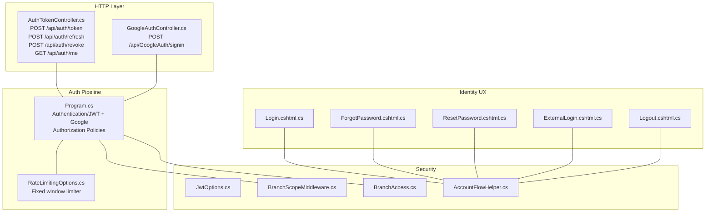
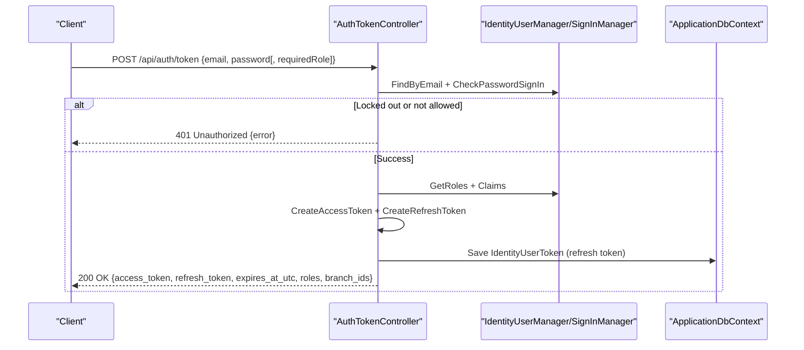
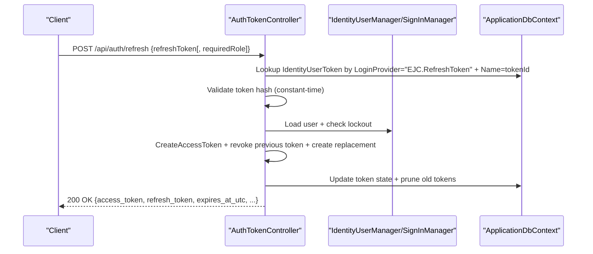
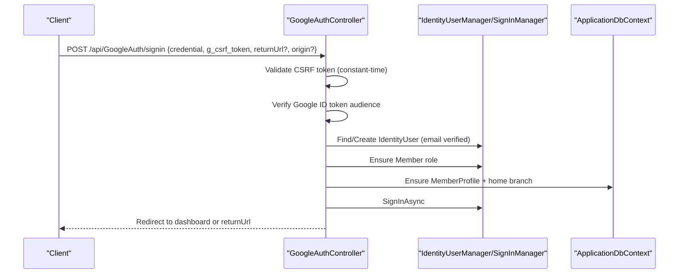
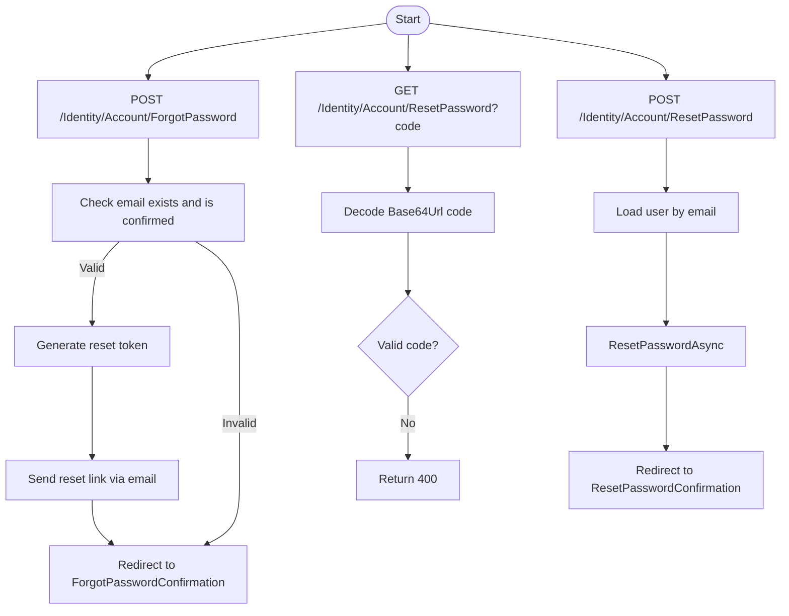
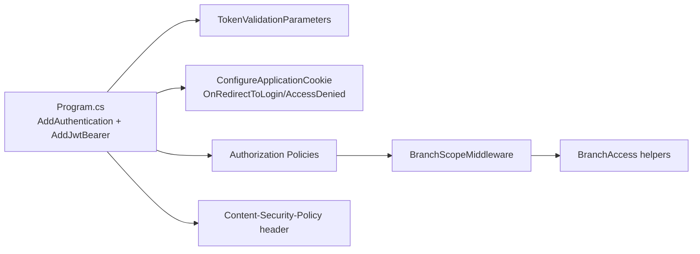
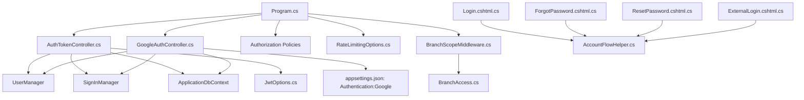

# Authentication API

<cite>
**Referenced Files in This Document**
- [Program.cs](file://Program.cs)
- [appsettings.json](file://appsettings.json)
- [AuthTokenController.cs](file://Controllers/AuthTokenController.cs)
- [GoogleAuthController.cs](file://Controllers/GoogleAuthController.cs)
- [JwtOptions.cs](file://Security/JwtOptions.cs)
- [BranchScopeMiddleware.cs](file://Security/BranchScopeMiddleware.cs)
- [BranchAccess.cs](file://Security/BranchAccess.cs)
- [RateLimitingOptions.cs](file://Security/RateLimitingOptions.cs)
- [Login.cshtml.cs](file://Areas/Identity/Pages/Account/Login.cshtml.cs)
- [Logout.cshtml.cs](file://Areas/Identity/Pages/Account/Logout.cshtml.cs)
- [ForgotPassword.cshtml.cs](file://Areas/Identity/Pages/Account/ForgotPassword.cshtml.cs)
- [ResetPassword.cshtml.cs](file://Areas/Identity/Pages/Account/ResetPassword.cshtml.cs)
- [ExternalLogin.cshtml.cs](file://Areas/Identity/Pages/Account/ExternalLogin.cshtml.cs)
- [AccountFlowHelper.cs](file://Areas/Identity/Pages/Account/AccountFlowHelper.cs)
</cite>

## Table of Contents
1. [Introduction](#introduction)
2. [Project Structure](#project-structure)
3. [Core Components](#core-components)
4. [Architecture Overview](#architecture-overview)
5. [Detailed Component Analysis](#detailed-component-analysis)
6. [Dependency Analysis](#dependency-analysis)
7. [Performance Considerations](#performance-considerations)
8. [Troubleshooting Guide](#troubleshooting-guide)
9. [Conclusion](#conclusion)

## Introduction
This document provides comprehensive API documentation for authentication endpoints in the fitness gym management system. It covers:
- JWT token authentication endpoints: login, token refresh, revoke, and logout
- Password reset workflow
- Google OAuth integration endpoints for authorization and callback handling
- Request/response schemas, token formats, and error responses
- Authentication middleware configuration, token validation, and security headers
- Practical examples of authentication flows, client implementation guidelines, and integration patterns
- Token expiration handling, refresh token mechanisms, and session management

## Project Structure
Authentication is implemented across several layers:
- API controllers for JWT and Google OAuth
- ASP.NET Core authentication and authorization policies
- Middleware for branch-scoped access
- Identity pages for traditional login, logout, forgot password, and reset password
- Configuration for JWT options and rate limiting

**Diagram sources**
- [Program.cs:199-343](file://Program.cs#L199-L343)
- [AuthTokenController.cs:18-259](file://Controllers/AuthTokenController.cs#L18-L259)
- [GoogleAuthController.cs:17-138](file://Controllers/GoogleAuthController.cs#L17-L138)
- [JwtOptions.cs:1-14](file://Security/JwtOptions.cs#L1-L14)
- [BranchScopeMiddleware.cs:1-73](file://Security/BranchScopeMiddleware.cs#L1-L73)
- [BranchAccess.cs:1-31](file://Security/BranchAccess.cs#L1-L31)
- [RateLimitingOptions.cs:1-13](file://Security/RateLimitingOptions.cs#L1-L13)
- [Login.cshtml.cs:10-204](file://Areas/Identity/Pages/Account/Login.cshtml.cs#L10-L204)
- [ForgotPassword.cshtml.cs:12-89](file://Areas/Identity/Pages/Account/ForgotPassword.cshtml.cs#L12-L89)
- [ResetPassword.cshtml.cs:10-92](file://Areas/Identity/Pages/Account/ResetPassword.cshtml.cs#L10-L92)
- [ExternalLogin.cshtml.cs:15-396](file://Areas/Identity/Pages/Account/ExternalLogin.cshtml.cs#L15-L396)
- [Logout.cshtml.cs:8-49](file://Areas/Identity/Pages/Account/Logout.cshtml.cs#L8-L49)
- [AccountFlowHelper.cs:5-197](file://Areas/Identity/Pages/Account/AccountFlowHelper.cs#L5-L197)

**Section sources**
- [Program.cs:199-343](file://Program.cs#L199-L343)
- [appsettings.json:30-53](file://appsettings.json#L30-L53)

## Core Components
- JWT token controller: Issues access tokens, refreshes tokens, revokes tokens, and exposes current identity claims
- Google OAuth controller: Handles Google Sign-In callback, validates CSRF, creates/assigns roles, and ensures member profiles
- Authentication pipeline: Configures JWT Bearer and Google external login, cookie policy, and authorization policies
- Identity pages: Traditional login/logout/password reset flows
- Security helpers: Branch-scoped access enforcement and branch claim utilities
- Rate limiting: Fixed-window policy applied to authentication endpoints

**Section sources**
- [AuthTokenController.cs:18-259](file://Controllers/AuthTokenController.cs#L18-L259)
- [GoogleAuthController.cs:17-138](file://Controllers/GoogleAuthController.cs#L17-L138)
- [Program.cs:199-343](file://Program.cs#L199-L343)
- [JwtOptions.cs:1-14](file://Security/JwtOptions.cs#L1-L14)
- [BranchScopeMiddleware.cs:1-73](file://Security/BranchScopeMiddleware.cs#L1-L73)
- [BranchAccess.cs:1-31](file://Security/BranchAccess.cs#L1-L31)
- [RateLimitingOptions.cs:1-13](file://Security/RateLimitingOptions.cs#L1-L13)

## Architecture Overview
The authentication architecture combines cookie-based and JWT-based authentication with external OAuth providers:
- Identity cookie for server-rendered pages and traditional flows
- JWT Bearer for API clients
- Google external login for social sign-in
- Branch-scoped middleware for back-office access control
- Rate limiting for protection against brute force

**Diagram sources**
- [AuthTokenController.cs:49-117](file://Controllers/AuthTokenController.cs#L49-L117)
- [Program.cs:226-256](file://Program.cs#L226-L256)

**Section sources**
- [Program.cs:226-256](file://Program.cs#L226-L256)
- [AuthTokenController.cs:49-117](file://Controllers/AuthTokenController.cs#L49-L117)

## Detailed Component Analysis

### JWT Token Endpoints
Endpoints:
- POST /api/auth/token: Issue access and refresh tokens
- POST /api/auth/refresh: Exchange refresh token for new access/refresh pair
- POST /api/auth/revoke: Mark a refresh token as revoked
- GET /api/auth/me: Retrieve current identity claims

Request/response schemas:
- TokenRequest: { email, password, requiredRole? }
- RefreshTokenRequest: { refreshToken, requiredRole? }
- RevokeTokenRequest: { refreshToken }
- TokenResponse: { token_type, access_token, expires_at_utc, refresh_token, refresh_token_expires_at_utc, user_id, email, roles[], branch_ids[] }

Behavior highlights:
- Access token creation includes user ID, email, roles, and branch IDs as claims
- Refresh token is a serialized state with a hashed secret and metadata
- Refresh token pruning limits per-user active tokens and retains revoked ones for a retention period
- Rate limiting applies to token issuance and refresh

**Diagram sources**
- [AuthTokenController.cs:119-201](file://Controllers/AuthTokenController.cs#L119-L201)

**Section sources**
- [AuthTokenController.cs:49-232](file://Controllers/AuthTokenController.cs#L49-L232)
- [JwtOptions.cs:1-14](file://Security/JwtOptions.cs#L1-14)

### Google OAuth Integration
Endpoints:
- POST /api/GoogleAuth/signin: Accepts Google credential and CSRF token, validates, and signs in or registers a member

Request schema:
- Form fields: credential (Google ID token), g_csrf_token, optional returnUrl, origin

Behavior:
- Validates CSRF cookie vs request token (constant-time comparison)
- Verifies Google ID token audience matches configured ClientId
- Ensures email is verified
- Creates IdentityUser if missing, assigns Member role, and ensures MemberProfile
- Redirects to dashboard or original returnUrl depending on flow

**Diagram sources**
- [GoogleAuthController.cs:41-138](file://Controllers/GoogleAuthController.cs#L41-L138)

**Section sources**
- [GoogleAuthController.cs:41-138](file://Controllers/GoogleAuthController.cs#L41-L138)

### Password Reset Workflow
Endpoints:
- POST /Identity/Account/ForgotPassword: Generates and emails a password reset token
- GET /Identity/Account/ResetPassword?code: Validates Base64Url-encoded code
- POST /Identity/Account/ResetPassword: Resets password using code

Behavior:
- Email must be confirmed to initiate reset
- Reset code is Base64Url-encoded on the wire
- Confirmation page shows success after reset

**Diagram sources**
- [ForgotPassword.cshtml.cs:46-87](file://Areas/Identity/Pages/Account/ForgotPassword.cshtml.cs#L46-L87)
- [ResetPassword.cshtml.cs:42-90](file://Areas/Identity/Pages/Account/ResetPassword.cshtml.cs#L42-L90)

**Section sources**
- [ForgotPassword.cshtml.cs:46-87](file://Areas/Identity/Pages/Account/ForgotPassword.cshtml.cs#L46-L87)
- [ResetPassword.cshtml.cs:42-90](file://Areas/Identity/Pages/Account/ResetPassword.cshtml.cs#L42-L90)

### Authentication Middleware and Security Headers
- JWT Bearer validation configured with issuer, audience, and symmetric key
- Application cookie configured with HttpOnly, SameSite, and SecurePolicy
- Redirect behavior differs for API vs UI routes (401 vs redirect)
- Branch-scoped access enforced for back-office paths
- CSP header allows Google domains for sign-in frames and scripts

**Diagram sources**
- [Program.cs:199-343](file://Program.cs#L199-L343)
- [Program.cs:686-698](file://Program.cs#L686-L698)
- [BranchScopeMiddleware.cs:14-53](file://Security/BranchScopeMiddleware.cs#L14-L53)
- [BranchAccess.cs:9-28](file://Security/BranchAccess.cs#L9-L28)

**Section sources**
- [Program.cs:199-343](file://Program.cs#L199-L343)
- [Program.cs:686-698](file://Program.cs#L686-L698)
- [BranchScopeMiddleware.cs:14-53](file://Security/BranchScopeMiddleware.cs#L14-L53)
- [BranchAccess.cs:9-28](file://Security/BranchAccess.cs#L9-L28)

## Dependency Analysis
Key dependencies and relationships:
- AuthTokenController depends on Identity framework (UserManager, SignInManager), DbContext, and JwtOptions
- GoogleAuthController depends on Identity framework, configuration, and Google ID token validation
- Program.cs wires authentication schemes, policies, middleware, and rate limiting
- BranchScopeMiddleware enforces branch-scoped access for back-office routes
- Identity pages coordinate with AccountFlowHelper for return URLs and role-based routing

**Diagram sources**
- [AuthTokenController.cs:26-47](file://Controllers/AuthTokenController.cs#L26-L47)
- [GoogleAuthController.cs:21-39](file://Controllers/GoogleAuthController.cs#L21-L39)
- [Program.cs:87-105](file://Program.cs#L87-L105)
- [appsettings.json:30-35](file://appsettings.json#L30-L35)
- [JwtOptions.cs:1-14](file://Security/JwtOptions.cs#L1-L14)
- [RateLimitingOptions.cs:1-13](file://Security/RateLimitingOptions.cs#L1-L13)
- [BranchScopeMiddleware.cs:14-53](file://Security/BranchScopeMiddleware.cs#L14-L53)
- [BranchAccess.cs:1-31](file://Security/BranchAccess.cs#L1-L31)
- [Login.cshtml.cs:10-204](file://Areas/Identity/Pages/Account/Login.cshtml.cs#L10-L204)
- [ForgotPassword.cshtml.cs:12-89](file://Areas/Identity/Pages/Account/ForgotPassword.cshtml.cs#L12-L89)
- [ResetPassword.cshtml.cs:10-92](file://Areas/Identity/Pages/Account/ResetPassword.cshtml.cs#L10-L92)
- [ExternalLogin.cshtml.cs:15-396](file://Areas/Identity/Pages/Account/ExternalLogin.cshtml.cs#L15-L396)
- [AccountFlowHelper.cs:5-197](file://Areas/Identity/Pages/Account/AccountFlowHelper.cs#L5-L197)

**Section sources**
- [Program.cs:87-105](file://Program.cs#L87-L105)
- [appsettings.json:30-35](file://appsettings.json#L30-L35)

## Performance Considerations
- Token refresh pruning prevents unbounded growth of refresh tokens per user
- Fixed-window rate limiting reduces brute-force risk for authentication endpoints
- Access token lifetime is bounded by configuration and clamped to safe ranges
- Refresh token retention balances auditability with storage overhead

[No sources needed since this section provides general guidance]

## Troubleshooting Guide
Common issues and resolutions:
- JWT signing key not configured in production: The app throws an error at startup if Jwt:SigningKey is empty and not in development
- Google sign-in not configured: Missing ClientId/ClientSecret leads to redirect with an error message
- CSRF mismatch: Constant-time comparison failure blocks the request
- Locked out or not allowed: Password sign-in returns 401 with appropriate messages
- Branch-scoped access denied: API returns 403 with a specific error and required claim type
- Rate limit exceeded: Requests receive 429 Too Many Requests

**Section sources**
- [Program.cs:92-105](file://Program.cs#L92-L105)
- [GoogleAuthController.cs:62-66](file://Controllers/GoogleAuthController.cs#L62-L66)
- [GoogleAuthController.cs:57-60](file://Controllers/GoogleAuthController.cs#L57-L60)
- [AuthTokenController.cs:71-84](file://Controllers/AuthTokenController.cs#L71-L84)
- [BranchScopeMiddleware.cs:41-50](file://Security/BranchScopeMiddleware.cs#L41-L50)
- [Program.cs:439-456](file://Program.cs#L439-L456)

## Conclusion
The authentication system provides a robust, layered approach combining cookie-based and JWT-based flows, external OAuth, and strict access controls. Clients should:
- Use POST /api/auth/token for initial login and store access/refresh tokens securely
- Use POST /api/auth/refresh to renew tokens and POST /api/auth/revoke to invalidate on logout
- Integrate Google Sign-In via the provided endpoint with proper CSRF handling
- Implement rate limiting and handle 401/403 responses appropriately
- Respect branch-scoped access for back-office endpoints

[No sources needed since this section summarizes without analyzing specific files]