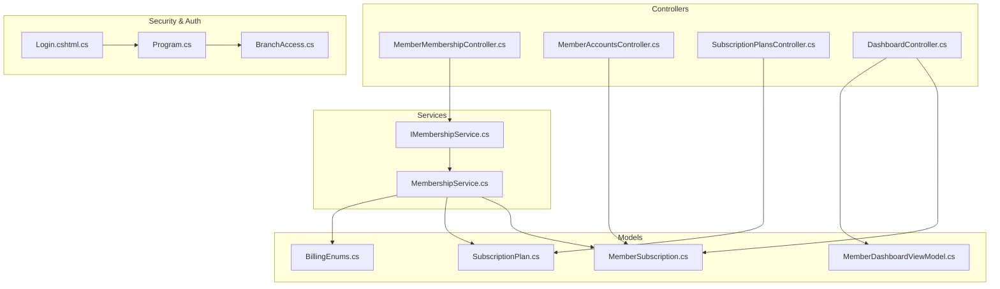
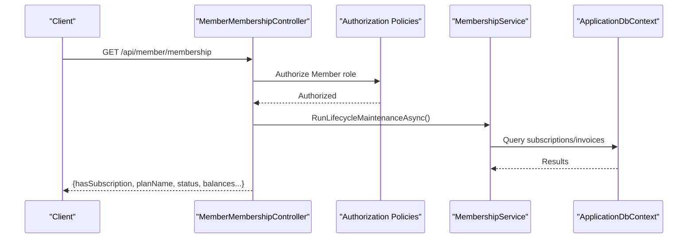
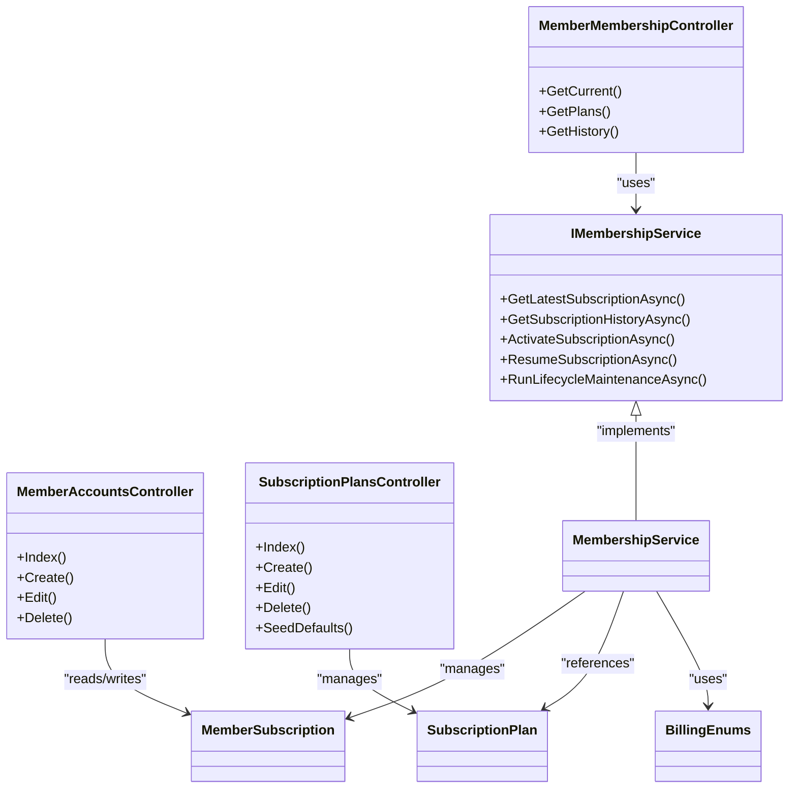

# Membership Management API

<cite>
**Referenced Files in This Document**
- [MemberMembershipController.cs](file://Controllers/MemberMembershipController.cs)
- [MemberAccountsController.cs](file://Controllers/MemberAccountsController.cs)
- [SubscriptionPlansController.cs](file://Controllers/SubscriptionPlansController.cs)
- [DashboardController.cs](file://Controllers/DashboardController.cs)
- [MemberDashboardViewModel.cs](file://Models/Member/MemberDashboardViewModel.cs)
- [MemberSubscription.cs](file://Models/Billing/MemberSubscription.cs)
- [SubscriptionPlan.cs](file://Models/Billing/SubscriptionPlan.cs)
- [BillingEnums.cs](file://Models/Billing/BillingEnums.cs)
- [IMembershipService.cs](file://Services/Memberships/IMembershipService.cs)
- [MembershipService.cs](file://Services/Memberships/MembershipService.cs)
- [Login.cshtml.cs](file://Areas/Identity/Pages/Account/Login.cshtml.cs)
- [Program.cs](file://Program.cs)
- [BranchAccess.cs](file://Security/BranchAccess.cs)
- [Dashboard.cshtml.cs](file://Pages/Member/Dashboard.cshtml.cs)
</cite>

## Table of Contents
1. [Introduction](#introduction)
2. [Project Structure](#project-structure)
3. [Core Components](#core-components)
4. [Architecture Overview](#architecture-overview)
5. [Detailed Component Analysis](#detailed-component-analysis)
6. [Dependency Analysis](#dependency-analysis)
7. [Performance Considerations](#performance-considerations)
8. [Troubleshooting Guide](#troubleshooting-guide)
9. [Conclusion](#conclusion)
10. [Appendices](#appendices)

## Introduction
This document provides comprehensive API documentation for membership management in the fitness gym application. It covers:
- Member account CRUD operations (profile management, personal information updates, account deactivation)
- Subscription plan management (creation, pricing updates, enrollment procedures)
- Membership lifecycle endpoints (renewal processing, cancellation workflows, status tracking)
- Member dashboard endpoints (membership status, upcoming payments, account summaries)
- Authentication and role-based access control
- Request/response schemas for member data, subscription plans, and membership records

## Project Structure
The membership management system spans controllers, services, models, and security policies:
- Controllers expose REST endpoints for member membership, admin member accounts, and subscription plan administration
- Services encapsulate membership lifecycle logic and plan catalog operations
- Models define data structures for subscriptions, plans, and billing enums
- Security policies enforce role-based access and branch scoping

**Diagram sources**
- [MemberMembershipController.cs:1-204](file://Controllers/MemberMembershipController.cs#L1-L204)
- [MemberAccountsController.cs:1-900](file://Controllers/MemberAccountsController.cs#L1-L900)
- [SubscriptionPlansController.cs:1-290](file://Controllers/SubscriptionPlansController.cs#L1-L290)
- [DashboardController.cs:1-1148](file://Controllers/DashboardController.cs#L1-L1148)
- [IMembershipService.cs:1-37](file://Services/Memberships/IMembershipService.cs#L1-L37)
- [MembershipService.cs:1-597](file://Services/Memberships/MembershipService.cs#L1-L597)
- [MemberSubscription.cs:1-30](file://Models/Billing/MemberSubscription.cs#L1-L30)
- [SubscriptionPlan.cs:1-53](file://Models/Billing/SubscriptionPlan.cs#L1-L53)
- [BillingEnums.cs:1-51](file://Models/Billing/BillingEnums.cs#L1-L51)
- [MemberDashboardViewModel.cs:1-37](file://Models/Member/MemberDashboardViewModel.cs#L1-L37)
- [Program.cs:315-343](file://Program.cs#L315-L343)
- [BranchAccess.cs:1-31](file://Security/BranchAccess.cs#L1-L31)
- [Login.cshtml.cs:1-204](file://Areas/Identity/Pages/Account/Login.cshtml.cs#L1-L204)

**Section sources**
- [MemberMembershipController.cs:1-204](file://Controllers/MemberMembershipController.cs#L1-L204)
- [MemberAccountsController.cs:1-900](file://Controllers/MemberAccountsController.cs#L1-L900)
- [SubscriptionPlansController.cs:1-290](file://Controllers/SubscriptionPlansController.cs#L1-L290)
- [DashboardController.cs:1-1148](file://Controllers/DashboardController.cs#L1-L1148)
- [IMembershipService.cs:1-37](file://Services/Memberships/IMembershipService.cs#L1-L37)
- [MembershipService.cs:1-597](file://Services/Memberships/MembershipService.cs#L1-L597)
- [MemberSubscription.cs:1-30](file://Models/Billing/MemberSubscription.cs#L1-L30)
- [SubscriptionPlan.cs:1-53](file://Models/Billing/SubscriptionPlan.cs#L1-L53)
- [BillingEnums.cs:1-51](file://Models/Billing/BillingEnums.cs#L1-L51)
- [MemberDashboardViewModel.cs:1-37](file://Models/Member/MemberDashboardViewModel.cs#L1-L37)
- [Program.cs:315-343](file://Program.cs#L315-L343)
- [BranchAccess.cs:1-31](file://Security/BranchAccess.cs#L1-L31)
- [Login.cshtml.cs:1-204](file://Areas/Identity/Pages/Account/Login.cshtml.cs#L1-L204)

## Core Components
- MemberMembershipController: Provides member-centric membership status, plan listings, and history via API endpoints under api/member/membership
- MemberAccountsController: Admin-facing CRUD for member accounts, including creation, editing, and deletion
- SubscriptionPlansController: Admin-facing CRUD for subscription plans, including activation/deactivation and defaults seeding
- MembershipService: Encapsulates membership lifecycle maintenance, renewal invoice generation, and subscription activation/resume
- Models: MemberSubscription, SubscriptionPlan, and BillingEnums define core domain structures
- Security: Role-based authorization and branch-scoped access enforced via policies and middleware

**Section sources**
- [MemberMembershipController.cs:12-32](file://Controllers/MemberMembershipController.cs#L12-L32)
- [MemberAccountsController.cs:17-39](file://Controllers/MemberAccountsController.cs#L17-L39)
- [SubscriptionPlansController.cs:11-19](file://Controllers/SubscriptionPlansController.cs#L11-L19)
- [IMembershipService.cs:5-36](file://Services/Memberships/IMembershipService.cs#L5-L36)
- [MembershipService.cs:9-26](file://Services/Memberships/MembershipService.cs#L9-L26)
- [MemberSubscription.cs:5-28](file://Models/Billing/MemberSubscription.cs#L5-L28)
- [SubscriptionPlan.cs:5-51](file://Models/Billing/SubscriptionPlan.cs#L5-L51)
- [BillingEnums.cs:3-50](file://Models/Billing/BillingEnums.cs#L3-L50)
- [Program.cs:315-343](file://Program.cs#L315-L343)

## Architecture Overview
The membership management API follows a layered architecture:
- Presentation: Controllers expose REST endpoints and Razor pages
- Domain Services: MembershipService orchestrates lifecycle and plan operations
- Persistence: Entity models and enums represent domain state
- Security: Authorization policies and branch access middleware protect resources

**Diagram sources**
- [MemberMembershipController.cs:34-109](file://Controllers/MemberMembershipController.cs#L34-L109)
- [IMembershipService.cs:23-25](file://Services/Memberships/IMembershipService.cs#L23-L25)
- [MembershipService.cs:248-460](file://Services/Memberships/MembershipService.cs#L248-L460)
- [Program.cs:341-342](file://Program.cs#L341-L342)

## Detailed Component Analysis

### Member Membership API
Endpoints for retrieving current membership status, available plans, and subscription history.

- GET /api/member/membership
  - Purpose: Retrieve current membership status, plan details, and financial summaries
  - Authentication: Member role required
  - Behavior:
    - Reconciles pending member payments if PayMongo service is configured
    - Runs lifecycle maintenance to update statuses and generate renewal invoices
    - Computes outstanding/scheduled balances and next payment due date
  - Response shape:
    - hasSubscription: boolean
    - planName: string
    - planTier: enum string
    - entitlements: array of strings
    - status: enum string
    - startDateUtc: datetime
    - endDateUtc: datetime
    - nextPaymentDueDateUtc: datetime
    - outstandingBalance: number
    - scheduledBalance: number
    - totalPaid: number

- GET /api/member/membership/plans
  - Purpose: List active subscription plans with benefits and current plan context
  - Authentication: Member role required
  - Behavior:
    - Reconciles pending payments
    - Runs lifecycle maintenance
    - Returns current plan context and plan list ordered by price
  - Response shape:
    - currentPlanId: integer
    - currentPlanName: string
    - hasActiveMembership: boolean
    - plans: array of plan objects with id, name, tier, description, price, billingCycle, entitlements, isCurrentPlan

- GET /api/member/membership/history
  - Purpose: Retrieve subscription history for the member
  - Authentication: Member role required
  - Query parameters:
    - take: integer (default 12, capped at 100)
  - Response shape:
    - Array of subscription objects with id, planId, planName, status, startDateUtc, endDateUtc, externalSubscriptionId

**Section sources**
- [MemberMembershipController.cs:34-109](file://Controllers/MemberMembershipController.cs#L34-L109)
- [MemberMembershipController.cs:111-163](file://Controllers/MemberMembershipController.cs#L111-L163)
- [MemberMembershipController.cs:165-201](file://Controllers/MemberMembershipController.cs#L165-L201)
- [IMembershipService.cs:7-8](file://Services/Memberships/IMembershipService.cs#L7-L8)
- [IMembershipService.cs:23-25](file://Services/Memberships/IMembershipService.cs#L23-L25)

### Member Account CRUD API
Admin-only endpoints for managing member accounts.

- GET /Admin/MemberAccounts
  - Purpose: Admin dashboard listing members with profile, subscription, and analytics
  - Authentication: Admin, Finance, SuperAdmin roles; branch-scoped
  - Response: ViewModel with members, clustering, churn risk, retention actions

- POST /Admin/MemberAccounts/Create
  - Purpose: Create a new member account with initial subscription
  - Authentication: SuperAdmin role
  - Request body: Member account form (email, password, profile, home branch, plan, dates, status)
  - Validation: Password required, end date not before start date, plan active, valid branch
  - Response: Redirect to index with success message

- GET /Admin/MemberAccounts/Edit/{id}
  - Purpose: Load edit form for member account
  - Authentication: Admin, Finance roles
  - Response: Form with current user and subscription data

- POST /Admin/MemberAccounts/Edit/{id}
  - Purpose: Update member account (profile, contact, plan, dates, status)
  - Authentication: Admin, Finance roles
  - Validation: End date not before start date, plan exists, valid branch, unique email
  - Response: Redirect to index with success message

- GET /Admin/MemberAccounts/Delete/{id}
  - Purpose: Load delete confirmation
  - Authentication: Admin, Finance roles
  - Response: Deletion view model

- POST /Admin/MemberAccounts/Delete/{id}
  - Purpose: Delete member account and associated profile/subscriptions
  - Authentication: Admin, Finance roles
  - Response: Redirect to index with status message

**Section sources**
- [MemberAccountsController.cs:41-318](file://Controllers/MemberAccountsController.cs#L41-L318)
- [MemberAccountsController.cs:320-446](file://Controllers/MemberAccountsController.cs#L320-L446)
- [MemberAccountsController.cs:448-650](file://Controllers/MemberAccountsController.cs#L448-L650)
- [MemberAccountsController.cs:652-737](file://Controllers/MemberAccountsController.cs#L652-L737)

### Subscription Plan Management API
Admin-only endpoints for managing subscription plans.

- GET /Admin/SubscriptionPlans
  - Purpose: List all plans with assignment totals and access summary
  - Authentication: Admin, Finance, SuperAdmin roles; branch-scoped
  - Response: List of plan items with tier, pricing, cycle, and counts

- POST /Admin/SubscriptionPlans/Create
  - Purpose: Create a new plan using default preset
  - Authentication: Admin, Finance, SuperAdmin roles
  - Request body: Plan with tier/name/description/pricing/benefits
  - Validation: Unique name
  - Response: Redirect to index

- POST /Admin/SubscriptionPlans/Edit/{id}
  - Purpose: Update plan details and benefits
  - Authentication: Admin, Finance, SuperAdmin roles
  - Validation: Unique name (excluding self)
  - Response: Redirect to index

- GET /Admin/SubscriptionPlans/Details/{id}
  - Purpose: View plan details and benefits
  - Authentication: Admin, Finance, SuperAdmin roles
  - Response: Plan with computed benefits

- POST /Admin/SubscriptionPlans/Delete/{id}
  - Purpose: Deactivate plan if active with assignments; otherwise delete
  - Authentication: Admin, Finance, SuperAdmin roles
  - Response: Redirect to index with status message

- POST /Admin/SubscriptionPlans/SeedDefaults
  - Purpose: Seed default plans if missing
  - Authentication: Admin, Finance, SuperAdmin roles
  - Response: Redirect to index with status message

**Section sources**
- [SubscriptionPlansController.cs:21-65](file://Controllers/SubscriptionPlansController.cs#L21-L65)
- [SubscriptionPlansController.cs:67-95](file://Controllers/SubscriptionPlansController.cs#L67-L95)
- [SubscriptionPlansController.cs:97-153](file://Controllers/SubscriptionPlansController.cs#L97-L153)
- [SubscriptionPlansController.cs:155-180](file://Controllers/SubscriptionPlansController.cs#L155-L180)
- [SubscriptionPlansController.cs:182-213](file://Controllers/SubscriptionPlansController.cs#L182-L213)
- [SubscriptionPlansController.cs:215-256](file://Controllers/SubscriptionPlansController.cs#L215-L256)

### Membership Lifecycle API
Endpoints for lifecycle maintenance and renewal processing.

- GET /api/member/membership
  - Purpose: Retrieve membership status and financial summaries
  - Behavior: Reconciles pending payments, runs lifecycle maintenance, computes balances and due dates
  - Response: See Member Membership API section

- POST /Admin/MemberAccounts/Create
  - Purpose: Activate subscription during member creation
  - Behavior: Validates plan, sets start/end dates, marks others inactive
  - Response: Redirect to index

- POST /Admin/MemberAccounts/Edit/{id}
  - Purpose: Update subscription plan and dates
  - Behavior: Activates/updates subscription, ensures single active record
  - Response: Redirect to index

**Section sources**
- [MemberMembershipController.cs:34-109](file://Controllers/MemberMembershipController.cs#L34-L109)
- [MemberAccountsController.cs:338-446](file://Controllers/MemberAccountsController.cs#L338-L446)
- [MemberAccountsController.cs:518-650](file://Controllers/MemberAccountsController.cs#L518-L650)

### Member Dashboard API
Member portal endpoints for accessing membership status, upcoming payments, and account summaries.

- GET /Dashboard/Member
  - Purpose: Build member dashboard view model with status, balances, counts, and activities
  - Authentication: Member role required
  - Response: MemberDashboardViewModel with display fields, balances, counts, and recent activities

- GET /Member/Dashboard
  - Purpose: Razor page rendering member dashboard
  - Authentication: MemberAccess policy
  - Response: Page model with profile completeness, invoices, and notifications

**Section sources**
- [DashboardController.cs:503-639](file://Controllers/DashboardController.cs#L503-L639)
- [Dashboard.cshtml.cs:50-154](file://Pages/Member/Dashboard.cshtml.cs#L50-L154)
- [MemberDashboardViewModel.cs:3-27](file://Models/Member/MemberDashboardViewModel.cs#L3-L27)

### Member Profile Management API
Member-facing profile management endpoints.

- GET /Dashboard/Profile
  - Purpose: Load profile edit form with completion percent and settings
  - Authentication: Member role required
  - Response: Profile input model with BMI, image handling, and branch options

- POST /Dashboard/Profile
  - Purpose: Update profile (personal info, image, home branch)
  - Authentication: Member role required
  - Validation: Image type and size limits, BMI calculation
  - Response: Redirect to profile with success message

- POST /Dashboard/RequestMembershipCancellation
  - Purpose: Submit a membership cancellation request
  - Authentication: Member role required
  - Validation: Reason length constraints, prevents duplicate open requests
  - Response: Redirect to profile with status message

**Section sources**
- [DashboardController.cs:641-800](file://Controllers/DashboardController.cs#L641-L800)
- [DashboardController.cs:754-800](file://Controllers/DashboardController.cs#L754-L800)

## Dependency Analysis
The membership management system exhibits clear separation of concerns:
- Controllers depend on services for business logic
- Services depend on models and enums for domain representation
- Security policies enforce role and branch access
- Authentication supports cookie and JWT bearer schemes

**Diagram sources**
- [MemberMembershipController.cs:12-32](file://Controllers/MemberMembershipController.cs#L12-L32)
- [MemberAccountsController.cs:17-39](file://Controllers/MemberAccountsController.cs#L17-L39)
- [SubscriptionPlansController.cs:11-19](file://Controllers/SubscriptionPlansController.cs#L11-L19)
- [IMembershipService.cs:5-36](file://Services/Memberships/IMembershipService.cs#L5-L36)
- [MembershipService.cs:9-26](file://Services/Memberships/MembershipService.cs#L9-L26)
- [MemberSubscription.cs:5-28](file://Models/Billing/MemberSubscription.cs#L5-L28)
- [SubscriptionPlan.cs:5-51](file://Models/Billing/SubscriptionPlan.cs#L5-L51)
- [BillingEnums.cs:3-50](file://Models/Billing/BillingEnums.cs#L3-L50)

**Section sources**
- [Program.cs:315-343](file://Program.cs#L315-L343)
- [BranchAccess.cs:5-28](file://Security/BranchAccess.cs#L5-L28)

## Performance Considerations
- Endpoint caching: Consider caching plan lists and membership status for frequently accessed endpoints
- Batch reconciliation: Use background workers for lifecycle maintenance and payment reconciliation
- Pagination: Limit history and account listing sizes to reduce payload sizes
- Indexing: Ensure database indexes on foreign keys and frequently queried fields (e.g., MemberUserId, Status, DueDateUtc)

## Troubleshooting Guide
Common issues and resolutions:
- Unauthorized access: Ensure Member role claims and branch scope are present for member endpoints
- Locked out accounts: Verify lockout thresholds and reset account state if needed
- Payment reconciliation failures: Monitor PayMongo reconciliation logs and retry mechanism
- Duplicate plan names: Validate uniqueness during create/edit operations
- Missing home branch: Assign home branch for staff/finance users to enable branch-scoped access

**Section sources**
- [Program.cs:279-313](file://Program.cs#L279-L313)
- [Login.cshtml.cs:172-199](file://Areas/Identity/Pages/Account/Login.cshtml.cs#L172-L199)
- [MembershipService.cs:248-460](file://Services/Memberships/MembershipService.cs#L248-L460)
- [SubscriptionPlansController.cs:258-270](file://Controllers/SubscriptionPlansController.cs#L258-L270)

## Conclusion
The membership management API provides a robust, role-scoped solution for member account management, subscription plan administration, and lifecycle operations. It integrates seamlessly with authentication and authorization policies, ensuring secure access and branch-scoped operations. The modular design with dedicated controllers and services enables maintainability and extensibility for future enhancements.

## Appendices

### Authentication and Authorization
- Member portal login enforces role-based redirection and validates email confirmation
- Authorization policies:
  - MemberAccess: Member role required
  - AdminAccess, FinanceAccess, StaffAccess: Role plus branch scope assertion
- Branch access middleware ensures branch-scoped visibility for back-office roles

**Section sources**
- [Login.cshtml.cs:134-167](file://Areas/Identity/Pages/Account/Login.cshtml.cs#L134-L167)
- [Program.cs:315-343](file://Program.cs#L315-L343)
- [BranchAccess.cs:5-28](file://Security/BranchAccess.cs#L5-L28)

### Request/Response Schemas

- Member Membership Response (GET /api/member/membership)
  - Fields: hasSubscription, planName, planTier, entitlements, status, startDateUtc, endDateUtc, nextPaymentDueDateUtc, outstandingBalance, scheduledBalance, totalPaid

- Subscription Plans Response (GET /api/member/membership/plans)
  - Fields: currentPlanId, currentPlanName, hasActiveMembership, plans[] with id, name, tier, description, price, billingCycle, entitlements, isCurrentPlan

- Subscription History Response (GET /api/member/membership/history)
  - Fields: id, planId, planName, status, startDateUtc, endDateUtc, externalSubscriptionId

- Member Dashboard ViewModel
  - Fields: MemberDisplayName, CurrentPlanName, MembershipStatusLabel, MembershipStatusBadgeClass, HasSubscriptionRecord, HasActiveMembership, MembershipStartDateUtc, MembershipEndDateUtc, NextPaymentDueDateUtc, LifetimeSpend, OutstandingBalance, ScheduledBalance, TotalInvoices, PaidInvoiceCount, OpenInvoiceCount, PendingInvoiceCount, ExpiredInvoiceCount, UpcomingInvoiceCount, ProfileCompletionPercent, MemberCheckInCode, MemberQrPayload, RecentActivities[]

- Member Subscription Model
  - Fields: Id, MemberUserId, SubscriptionPlanId, StartDateUtc, EndDateUtc, Status, ExternalCustomerId, ExternalSubscriptionId, SubscriptionPlan

- Subscription Plan Model
  - Fields: Id, Tier, Name, Description, Price, BillingCycle, IsActive, Benefits flags, CreatedAtUtc

- Enums
  - PlanTier: Basic, Pro, Elite
  - BillingCycle: Monthly, Weekly, Yearly
  - SubscriptionStatus: Active, Paused, Cancelled, Expired
  - InvoiceStatus: Draft, Unpaid, Paid, Overdue, Voided
  - PaymentMethod: Cash, Card, BankTransfer, EWallet, OnlineGateway
  - PaymentStatus: Pending, Succeeded, Failed, Refunded

**Section sources**
- [MemberMembershipController.cs:91-109](file://Controllers/MemberMembershipController.cs#L91-L109)
- [MemberMembershipController.cs:156-162](file://Controllers/MemberMembershipController.cs#L156-L162)
- [MemberMembershipController.cs:191-201](file://Controllers/MemberMembershipController.cs#L191-L201)
- [MemberDashboardViewModel.cs:3-27](file://Models/Member/MemberDashboardViewModel.cs#L3-L27)
- [MemberSubscription.cs:5-28](file://Models/Billing/MemberSubscription.cs#L5-L28)
- [SubscriptionPlan.cs:5-51](file://Models/Billing/SubscriptionPlan.cs#L5-L51)
- [BillingEnums.cs:3-50](file://Models/Billing/BillingEnums.cs#L3-L50)