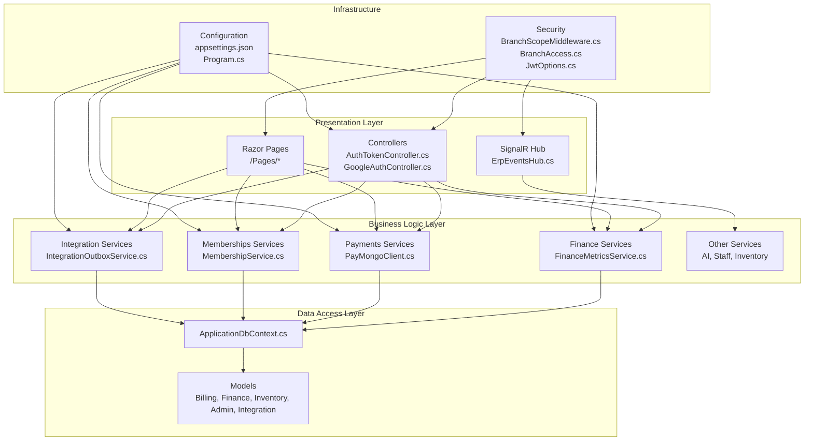
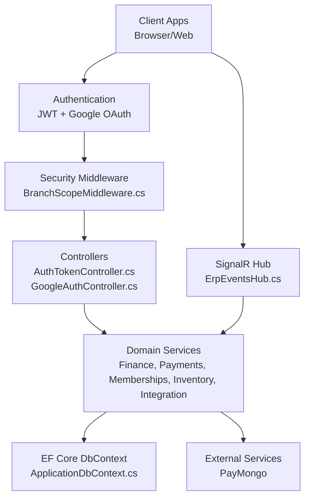
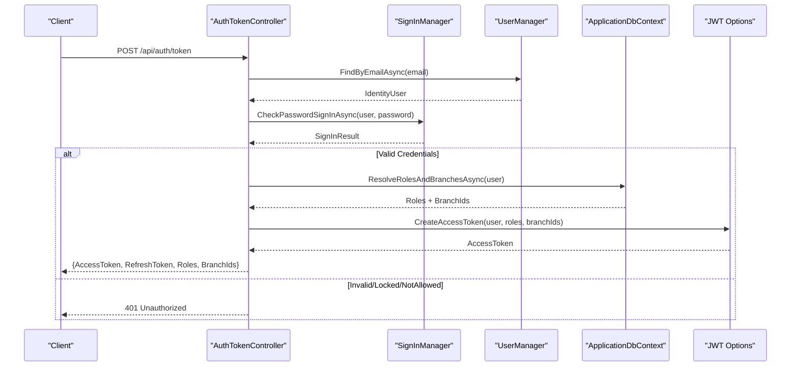
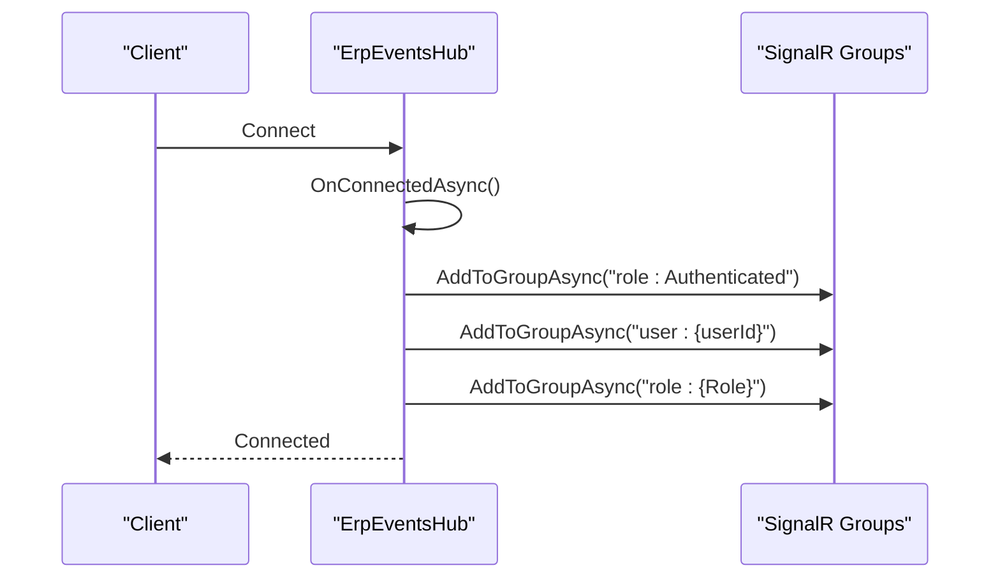
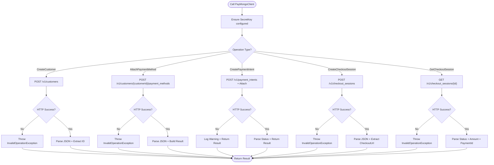
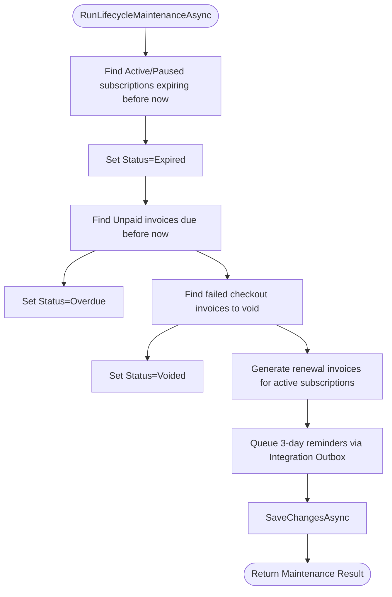
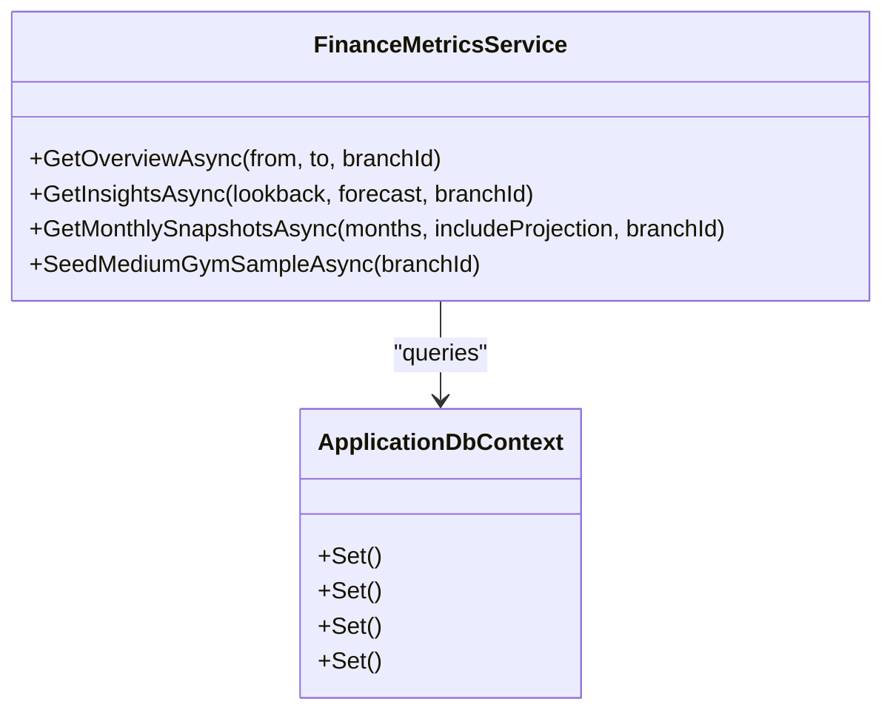
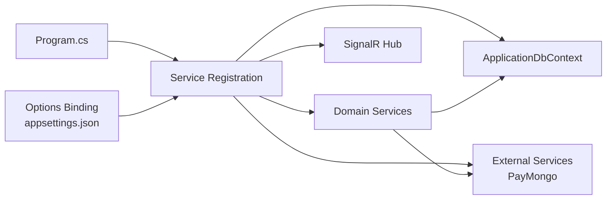

# Architecture Overview

<cite>
**Referenced Files in This Document**
- [Program.cs](file://Program.cs)
- [appsettings.json](file://appsettings.json)
- [README.md](file://README.md)
- [ApplicationDbContext.cs](file://Data/ApplicationDbContext.cs)
- [AuthTokenController.cs](file://Controllers/AuthTokenController.cs)
- [GoogleAuthController.cs](file://Controllers/GoogleAuthController.cs)
- [ErpEventsHub.cs](file://Hubs/ErpEventsHub.cs)
- [BranchScopeMiddleware.cs](file://Security/BranchScopeMiddleware.cs)
- [BranchAccess.cs](file://Security/BranchAccess.cs)
- [JwtOptions.cs](file://Security/JwtOptions.cs)
- [PayMongoClient.cs](file://Services/Payments/PayMongoClient.cs)
- [MembershipService.cs](file://Services/Memberships/MembershipService.cs)
- [FinanceMetricsService.cs](file://Services/Finance/FinanceMetricsService.cs)
- [IntegrationOutboxService.cs](file://Services/Integration/IntegrationOutboxService.cs)
</cite>

## Table of Contents
1. [Introduction](#introduction)
2. [Project Structure](#project-structure)
3. [Core Components](#core-components)
4. [Architecture Overview](#architecture-overview)
5. [Detailed Component Analysis](#detailed-component-analysis)
6. [Dependency Analysis](#dependency-analysis)
7. [Performance Considerations](#performance-considerations)
8. [Troubleshooting Guide](#troubleshooting-guide)
9. [Conclusion](#conclusion)

## Introduction
This document presents the architecture of the EJC Fitness Gym system, a multi-branch ERP and gym management platform. It describes the layered architecture separating presentation, business logic, and data access, along with a modular service-based design for finance, payments, memberships, and inventory. It also documents the dependency injection container configuration, authentication and authorization mechanisms (JWT and Google OAuth), role-based access control with branch scoping, real-time communication via SignalR, and integration patterns with external services such as PayMongo. Cross-cutting concerns including security middleware, rate limiting, and forwarded headers configuration are addressed.

## Project Structure
The system follows a conventional ASP.NET Core project layout with clear separation of concerns:
- Presentation layer: Controllers and Razor Pages for web UI and API endpoints.
- Business logic layer: Services organized by domain (Finance, Payments, Memberships, Inventory, Integration, Realtime, AI, Staff).
- Data access layer: Entity Framework Core DbContext and models.
- Security and infrastructure: Middleware, JWT configuration, and SignalR hub.
- Configuration: appsettings.json and Program.cs for DI and pipeline setup.

**Diagram sources**
- [Program.cs:1-1075](file://Program.cs#L1-L1075)
- [appsettings.json:1-116](file://appsettings.json#L1-L116)
- [ApplicationDbContext.cs:1-414](file://Data/ApplicationDbContext.cs#L1-L414)
- [AuthTokenController.cs:1-597](file://Controllers/AuthTokenController.cs#L1-L597)
- [GoogleAuthController.cs:1-303](file://Controllers/GoogleAuthController.cs#L1-L303)
- [ErpEventsHub.cs:1-50](file://Hubs/ErpEventsHub.cs#L1-L50)
- [BranchScopeMiddleware.cs:1-73](file://Security/BranchScopeMiddleware.cs#L1-L73)
- [BranchAccess.cs:1-31](file://Security/BranchAccess.cs#L1-L31)
- [JwtOptions.cs:1-14](file://Security/JwtOptions.cs#L1-L14)
- [PayMongoClient.cs:1-717](file://Services/Payments/PayMongoClient.cs#L1-L717)
- [MembershipService.cs:1-597](file://Services/Memberships/MembershipService.cs#L1-L597)
- [FinanceMetricsService.cs:1-826](file://Services/Finance/FinanceMetricsService.cs#L1-L826)
- [IntegrationOutboxService.cs:1-94](file://Services/Integration/IntegrationOutboxService.cs#L1-L94)

**Section sources**
- [README.md:1-91](file://README.md#L1-L91)
- [Program.cs:1-1075](file://Program.cs#L1-L1075)
- [appsettings.json:1-116](file://appsettings.json#L1-L116)

## Core Components
- Dependency Injection Container and Pipeline
  - Program.cs configures services, authentication, authorization, CORS, rate limiting, forwarded headers, health checks, SignalR, and hosted workers. It registers domain services and configures options from appsettings.json.
- Authentication and Authorization
  - JWT bearer authentication with configurable signing key and audience/issuer. Google OAuth integration for external sign-in. Cookie policy and application cookie events for redirects and access denied. Role-based policies and branch-scoped claims enforcement.
- Data Access
  - ApplicationDbContext defines entity sets and EF model configurations, including precision for monetary fields and specialized indexes for performance.
- Real-time Communication
  - SignalR hub groups users by roles and user identifiers for targeted live updates.
- External Integrations
  - PayMongo client encapsulates payment intents, checkout sessions, and customer management with robust error handling and JSON parsing.
- Modular Services
  - FinanceMetricsService, MembershipService, PayMongoClient, IntegrationOutboxService, and others implement domain-specific logic with clear interfaces.

**Section sources**
- [Program.cs:56-473](file://Program.cs#L56-L473)
- [appsettings.json:45-53](file://appsettings.json#L45-L53)
- [ApplicationDbContext.cs:43-411](file://Data/ApplicationDbContext.cs#L43-L411)
- [ErpEventsHub.cs:7-48](file://Hubs/ErpEventsHub.cs#L7-L48)
- [PayMongoClient.cs:13-596](file://Services/Payments/PayMongoClient.cs#L13-L596)
- [FinanceMetricsService.cs:9-52](file://Services/Finance/FinanceMetricsService.cs#L9-L52)
- [MembershipService.cs:9-26](file://Services/Memberships/MembershipService.cs#L9-L26)
- [IntegrationOutboxService.cs:7-93](file://Services/Integration/IntegrationOutboxService.cs#L7-L93)

## Architecture Overview
The system employs a layered architecture:
- Presentation: Controllers and SignalR hub handle requests and real-time events.
- Business Logic: Domain services encapsulate workflows for finance, memberships, payments, inventory, and integration.
- Data Access: DbContext and strongly-typed entity sets with optimized indexes.
- Infrastructure: Security middleware, JWT configuration, CORS, rate limiting, and health checks.

**Diagram sources**
- [Program.cs:199-363](file://Program.cs#L199-L363)
- [AuthTokenController.cs:18-47](file://Controllers/AuthTokenController.cs#L18-L47)
- [GoogleAuthController.cs:19-39](file://Controllers/GoogleAuthController.cs#L19-L39)
- [ErpEventsHub.cs:8-48](file://Hubs/ErpEventsHub.cs#L8-L48)
- [ApplicationDbContext.cs:12-42](file://Data/ApplicationDbContext.cs#L12-L42)
- [PayMongoClient.cs:13-24](file://Services/Payments/PayMongoClient.cs#L13-L24)

## Detailed Component Analysis

### Authentication and Authorization Architecture
- JWT Token-Based Authentication
  - Program.cs configures JWT bearer authentication with issuer, audience, and symmetric key. Tokens carry user identity, roles, and branch scopes. Controllers issue, refresh, revoke, and expose current identity with rate limiting applied.
- Google OAuth Integration
  - GoogleAuthController validates Google credentials, ensures verified email, creates/assigns roles to members, and enforces CSRF protection via cookies.
- Role-Based Access Control with Branch Scoping
  - Authorization policies enforce role membership and require branch scope for back-office areas. BranchScopeMiddleware enforces branch assignment for authenticated back-office users.

**Diagram sources**
- [AuthTokenController.cs:50-117](file://Controllers/AuthTokenController.cs#L50-L117)
- [Program.cs:199-257](file://Program.cs#L199-L257)
- [JwtOptions.cs:3-12](file://Security/JwtOptions.cs#L3-L12)

**Section sources**
- [Program.cs:199-343](file://Program.cs#L199-L343)
- [AuthTokenController.cs:18-259](file://Controllers/AuthTokenController.cs#L18-L259)
- [GoogleAuthController.cs:41-138](file://Controllers/GoogleAuthController.cs#L41-L138)
- [BranchScopeMiddleware.cs:14-53](file://Security/BranchScopeMiddleware.cs#L14-L53)
- [BranchAccess.cs:5-29](file://Security/BranchAccess.cs#L5-L29)

### Real-Time Communication with SignalR
- ErpEventsHub groups connected clients by authentication state, user ID, and roles. This enables targeted live updates for dashboards and notifications.

**Diagram sources**
- [ErpEventsHub.cs:12-47](file://Hubs/ErpEventsHub.cs#L12-L47)

**Section sources**
- [ErpEventsHub.cs:7-48](file://Hubs/ErpEventsHub.cs#L7-L48)
- [Program.cs:395](file://Program.cs#L395)

### External Payment Integration with PayMongo
- PayMongoClient encapsulates customer creation, payment method attachment, payment intent creation, and checkout session lookup. It validates configuration, constructs Basic auth headers, parses JSON responses, and normalizes statuses.

**Diagram sources**
- [PayMongoClient.cs:29-449](file://Services/Payments/PayMongoClient.cs#L29-L449)

**Section sources**
- [PayMongoClient.cs:13-596](file://Services/Payments/PayMongoClient.cs#L13-L596)
- [Program.cs:364-365](file://Program.cs#L364-L365)

### Membership Lifecycle and Billing Service
- MembershipService orchestrates subscription activation/resume, lifecycle maintenance (expire subscriptions, mark overdue invoices, void failed checkout invoices), renewal invoice generation, and reminder queuing via integration outbox.

**Diagram sources**
- [MembershipService.cs:248-460](file://Services/Memberships/MembershipService.cs#L248-L460)

**Section sources**
- [MembershipService.cs:9-597](file://Services/Memberships/MembershipService.cs#L9-L597)
- [IntegrationOutboxService.cs:18-58](file://Services/Integration/IntegrationOutboxService.cs#L18-L58)

### Finance Metrics and Insights
- FinanceMetricsService computes revenue, expenses, equipment depreciation, forecasts, and anomaly detection across branch-scoped datasets. It supports monthly snapshots and equipment seeding.

**Diagram sources**
- [FinanceMetricsService.cs:9-52](file://Services/Finance/FinanceMetricsService.cs#L9-L52)
- [ApplicationDbContext.cs:19-41](file://Data/ApplicationDbContext.cs#L19-L41)

**Section sources**
- [FinanceMetricsService.cs:54-285](file://Services/Finance/FinanceMetricsService.cs#L54-L285)
- [ApplicationDbContext.cs:43-411](file://Data/ApplicationDbContext.cs#L43-L411)

## Dependency Analysis
- Service Registration Patterns
  - Scoped services for domain logic (e.g., IFinanceMetricsService, IMembershipService, IIntegrationOutbox).
  - Singleton for startup initialization state.
  - Hosted services for workers (integration dispatcher, membership lifecycle, finance alert evaluator, staff attendance auto-close, auto billing).
  - HTTP client registered for PayMongoClient.
- External Dependencies
  - PayMongo SDK via HttpClient and custom client wrapper.
  - SignalR for real-time updates.
  - Entity Framework Core for ORM and migrations.
- Configuration-Driven Behavior
  - Options pattern for JWT, PayMongo, finance alerts, membership lifecycle worker, integration outbox, operational health, staff attendance, auto billing, forwarded headers, and rate limiting.

**Diagram sources**
- [Program.cs:354-386](file://Program.cs#L354-L386)
- [appsettings.json:45-107](file://appsettings.json#L45-L107)

**Section sources**
- [Program.cs:354-407](file://Program.cs#L354-L407)
- [appsettings.json:1-116](file://appsettings.json#L1-L116)

## Performance Considerations
- Database Indexes and Precision
  - Monetary fields use precision-aware decimal types; specialized indexes optimize queries for invoices, payments, and branch-scoped filters.
- Query Efficiency
  - Use of AsNoTracking for read-only queries, projection to DTOs, and batching operations to reduce memory overhead.
- Background Workers
  - Hosted services schedule periodic tasks (e.g., membership lifecycle maintenance, auto billing) to offload work from request threads.
- Rate Limiting
  - Fixed window limiter applied to API endpoints to mitigate abuse and protect downstream systems.

[No sources needed since this section provides general guidance]

## Troubleshooting Guide
- JWT Signing Key Missing
  - Program.cs throws an error if JWT signing key is missing in production; development fallback is used otherwise.
- Google OAuth Secrets
  - Program.cs validates Google client secrets in production; missing secrets disable JWT bearer auth if not configured.
- Branch Assignment Required
  - BranchScopeMiddleware returns 403 for authenticated back-office users without branch scope; ensure user claims include branch_id.
- PayMongo Configuration
  - PayMongoClient enforces secret key presence; webhook signature requirement depends on environment and configuration.
- Health Checks
  - Health endpoints report readiness and liveness; use for monitoring operational status.

**Section sources**
- [Program.cs:92-105](file://Program.cs#L92-L105)
- [Program.cs:221-224](file://Program.cs#L221-L224)
- [BranchScopeMiddleware.cs:35-50](file://Security/BranchScopeMiddleware.cs#L35-L50)
- [PayMongoClient.cs:583-589](file://Services/Payments/PayMongoClient.cs#L583-L589)
- [Program.cs:386-394](file://Program.cs#L386-L394)

## Conclusion
The EJC Fitness Gym system is architected with clear separation of concerns, modular domain services, and robust infrastructure for authentication, authorization, real-time updates, and external integrations. The dependency injection container centralizes configuration and service lifetimes, while security middleware and branch-scoped claims ensure controlled access. The design supports scalability across multiple branches and integrates seamlessly with PayMongo for payments, SignalR for live updates, and EF Core for data persistence.