# Authentication and Authorization

<cite>
**Referenced Files in This Document**
- [Program.cs](file://Program.cs)
- [appsettings.json](file://appsettings.json)
- [JwtOptions.cs](file://Security/JwtOptions.cs)
- [BranchAccess.cs](file://Security/BranchAccess.cs)
- [BranchScopeMiddleware.cs](file://Security/BranchScopeMiddleware.cs)
- [AuthTokenController.cs](file://Controllers/AuthTokenController.cs)
- [UserBranchesController.cs](file://Controllers/UserBranchesController.cs)
- [Login.cshtml.cs](file://Areas/Identity/Pages/Account/Login.cshtml.cs)
- [BackOfficeLogin.cshtml.cs](file://Areas/Identity/Pages/Account/BackOfficeLogin.cshtml.cs)
- [AccountFlowHelper.cs](file://Areas/Identity/Pages/Account/AccountFlowHelper.cs)
</cite>

## Table of Contents
1. [Introduction](#introduction)
2. [Project Structure](#project-structure)
3. [Core Components](#core-components)
4. [Architecture Overview](#architecture-overview)
5. [Detailed Component Analysis](#detailed-component-analysis)
6. [Dependency Analysis](#dependency-analysis)
7. [Performance Considerations](#performance-considerations)
8. [Troubleshooting Guide](#troubleshooting-guide)
9. [Conclusion](#conclusion)

## Introduction
This document explains the dual authentication and authorization architecture used by the application. It covers:
- A unified authentication scheme that automatically selects between JWT bearer tokens and cookie-based Identity authentication based on incoming request headers.
- Role-based access control (RBAC) with roles Member, Staff, Finance, Admin, and SuperAdmin.
- A branch scoping mechanism ensuring users can only access data from their assigned branch.
- Authorization policies, claims-based authorization, and the BranchScopeMiddleware implementation.
- Security considerations, token validation, and CORS configuration.

## Project Structure
The authentication and authorization system spans several areas:
- Startup and DI registration in the application host.
- Security helpers for branch scoping and JWT options.
- Controllers implementing token issuance and branch assignment.
- Identity pages coordinating login flows and role-aware routing.
- Configuration for JWT, CORS, cookies, and forwarded headers.

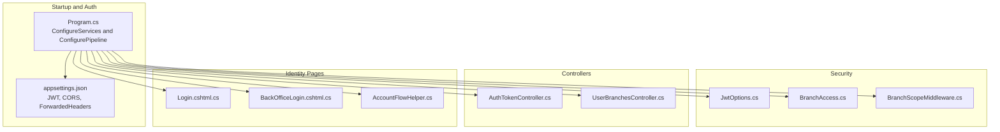

**Diagram sources**
- [Program.cs:199-352](file://Program.cs#L199-L352)
- [appsettings.json:45-53](file://appsettings.json#L45-L53)
- [JwtOptions.cs:1-14](file://Security/JwtOptions.cs#L1-L14)
- [BranchAccess.cs:1-31](file://Security/BranchAccess.cs#L1-L31)
- [BranchScopeMiddleware.cs:1-73](file://Security/BranchScopeMiddleware.cs#L1-L73)
- [AuthTokenController.cs:16-47](file://Controllers/AuthTokenController.cs#L16-L47)
- [UserBranchesController.cs:11-44](file://Controllers/UserBranchesController.cs#L11-L44)
- [Login.cshtml.cs:10-204](file://Areas/Identity/Pages/Account/Login.cshtml.cs#L10-L204)
- [BackOfficeLogin.cshtml.cs:10-126](file://Areas/Identity/Pages/Account/BackOfficeLogin.cshtml.cs#L10-L126)
- [AccountFlowHelper.cs:5-197](file://Areas/Identity/Pages/Account/AccountFlowHelper.cs#L5-L197)

**Section sources**
- [Program.cs:199-352](file://Program.cs#L199-L352)
- [appsettings.json:45-53](file://appsettings.json#L45-L53)

## Core Components
- Dual authentication scheme “IdentityOrJwt” that forwards to either JWT bearer or cookie-based Identity depending on the Authorization header.
- JWT configuration and validation parameters.
- Branch scoping utilities and middleware enforcing branch visibility.
- Token controller issuing and refreshing JWTs with roles and branch claims.
- Branch assignment controller enabling SuperAdmin to assign branches to users.
- Identity login pages coordinating role-aware redirection and access checks.
- Authorization policies requiring roles and branch scope assertions.

**Section sources**
- [Program.cs:199-257](file://Program.cs#L199-L257)
- [Program.cs:315-343](file://Program.cs#L315-L343)
- [JwtOptions.cs:1-14](file://Security/JwtOptions.cs#L1-L14)
- [BranchAccess.cs:1-31](file://Security/BranchAccess.cs#L1-L31)
- [BranchScopeMiddleware.cs:1-73](file://Security/BranchScopeMiddleware.cs#L1-L73)
- [AuthTokenController.cs:16-47](file://Controllers/AuthTokenController.cs#L16-L47)
- [UserBranchesController.cs:11-44](file://Controllers/UserBranchesController.cs#L11-L44)
- [Login.cshtml.cs:10-204](file://Areas/Identity/Pages/Account/Login.cshtml.cs#L10-L204)
- [BackOfficeLogin.cshtml.cs:10-126](file://Areas/Identity/Pages/Account/BackOfficeLogin.cshtml.cs#L10-L126)
- [AccountFlowHelper.cs:5-197](file://Areas/Identity/Pages/Account/AccountFlowHelper.cs#L5-L197)

## Architecture Overview
The authentication pipeline:
- Uses a custom policy scheme “IdentityOrJwt” that inspects the Authorization header to choose JWT or cookie authentication.
- Applies application cookie settings and redirects for login/access denied.
- Registers authorization policies that combine role requirements and branch scope assertions.
- Enforces branch scope via middleware after authentication and authorization.

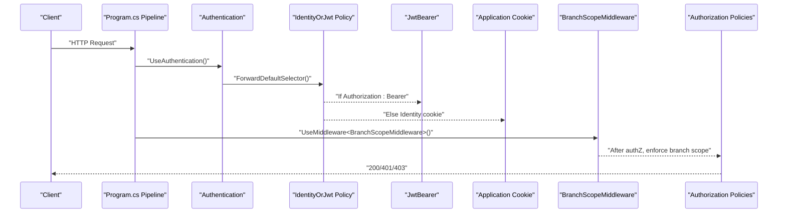

**Diagram sources**
- [Program.cs:199-257](file://Program.cs#L199-L257)
- [Program.cs:704-708](file://Program.cs#L704-L708)
- [BranchScopeMiddleware.cs:14-53](file://Security/BranchScopeMiddleware.cs#L14-L53)

**Section sources**
- [Program.cs:199-257](file://Program.cs#L199-L257)
- [Program.cs:704-708](file://Program.cs#L704-L708)

## Detailed Component Analysis

### Dual Authentication Scheme: IdentityOrJwt
- Default scheme is set to “IdentityOrJwt”.
- The forward selector chooses JWT bearer when the Authorization header starts with “Bearer ”; otherwise it uses the application cookie scheme.
- JWT bearer authentication is configured with issuer, audience, signing key, and lifetime validation.
- Application cookie settings enforce HTTPS and SameSite behavior, with custom redirects for API and back-office login paths.

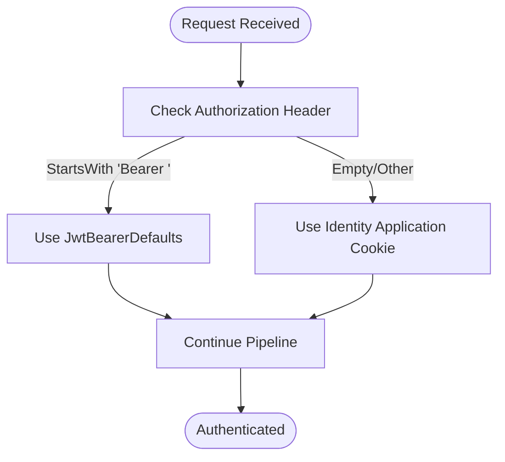

**Diagram sources**
- [Program.cs:226-240](file://Program.cs#L226-L240)
- [Program.cs:241-256](file://Program.cs#L241-L256)
- [Program.cs:271-313](file://Program.cs#L271-L313)

**Section sources**
- [Program.cs:199-257](file://Program.cs#L199-L257)
- [Program.cs:271-313](file://Program.cs#L271-L313)

### JWT Options and Validation
- JWT options include issuer, audience, signing key, access token minutes, refresh token days, and limits.
- Token validation enforces issuer, audience, signing key, lifetime, and clock skew.
- The signing key is resolved from configuration or development fallback.

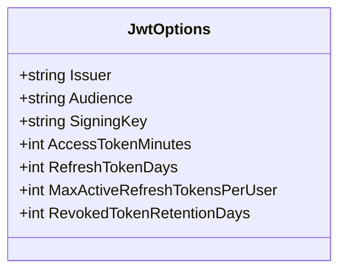

**Diagram sources**
- [JwtOptions.cs:1-14](file://Security/JwtOptions.cs#L1-L14)

**Section sources**
- [JwtOptions.cs:1-14](file://Security/JwtOptions.cs#L1-L14)
- [Program.cs:241-256](file://Program.cs#L241-L256)
- [AuthTokenController.cs:515-538](file://Controllers/AuthTokenController.cs#L515-L538)

### Branch Scoping Utilities
- BranchAccess exposes a constant claim type “branch_id” and extension methods to read and validate branch scope for a user.
- SuperAdmin bypasses branch scope checks.

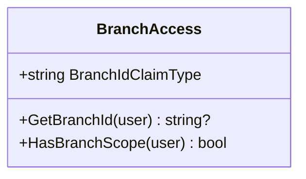

**Diagram sources**
- [BranchAccess.cs:1-31](file://Security/BranchAccess.cs#L1-L31)

**Section sources**
- [BranchAccess.cs:1-31](file://Security/BranchAccess.cs#L1-L31)

### BranchScopeMiddleware
- Intercepts requests targeting back-office routes and enforces branch scope for authenticated users with roles Staff, Admin, Finance, or SuperAdmin.
- Returns 403 with JSON body for API routes and plain text for UI routes when branch scope is missing.
- Exempts certain administrative paths under UserBranches.

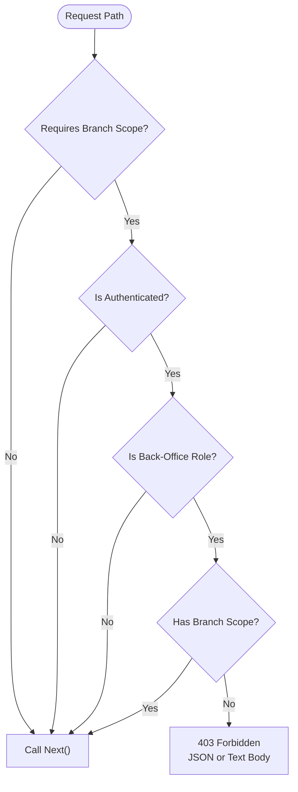

**Diagram sources**
- [BranchScopeMiddleware.cs:14-70](file://Security/BranchScopeMiddleware.cs#L14-L70)

**Section sources**
- [BranchScopeMiddleware.cs:1-73](file://Security/BranchScopeMiddleware.cs#L1-L73)

### Token Controller (JWT Issuance and Refresh)
- Issues access tokens containing user ID, email, roles, and branch claims.
- Issues long-lived refresh tokens stored hashed in the database with metadata.
- Validates required roles for token issuance and refresh.
- Supports revocation of refresh tokens.

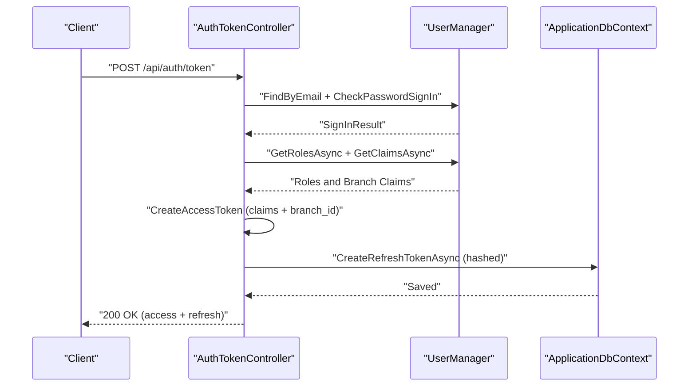

**Diagram sources**
- [AuthTokenController.cs:49-117](file://Controllers/AuthTokenController.cs#L49-L117)
- [AuthTokenController.cs:261-279](file://Controllers/AuthTokenController.cs#L261-L279)
- [AuthTokenController.cs:291-346](file://Controllers/AuthTokenController.cs#L291-L346)
- [AuthTokenController.cs:348-379](file://Controllers/AuthTokenController.cs#L348-L379)

**Section sources**
- [AuthTokenController.cs:16-47](file://Controllers/AuthTokenController.cs#L16-L47)
- [AuthTokenController.cs:49-201](file://Controllers/AuthTokenController.cs#L49-L201)
- [AuthTokenController.cs:261-346](file://Controllers/AuthTokenController.cs#L261-L346)

### Branch Assignment Controller (SuperAdmin)
- Allows SuperAdmin to create branches, toggle statuses, and assign branches to eligible users.
- Removes existing branch claims before adding a new one.
- Refreshes sign-in for the user if the current session is the one being modified.

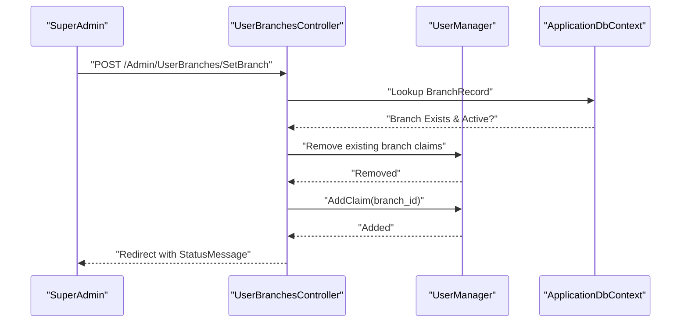

**Diagram sources**
- [UserBranchesController.cs:259-340](file://Controllers/UserBranchesController.cs#L259-L340)

**Section sources**
- [UserBranchesController.cs:11-44](file://Controllers/UserBranchesController.cs#L11-L44)
- [UserBranchesController.cs:259-340](file://Controllers/UserBranchesController.cs#L259-L340)

### Identity Login Pages and Role-Aware Routing
- Standard login page normalizes return URLs and redirects back-office users to the appropriate login page.
- Back-office login validates presence of back-office roles and records last login time.
- AccountFlowHelper defines back-office roles and path restrictions to guide routing and access checks.

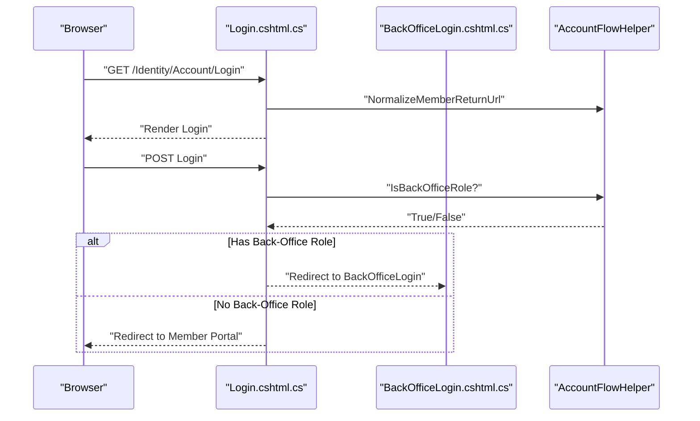

**Diagram sources**
- [Login.cshtml.cs:45-81](file://Areas/Identity/Pages/Account/Login.cshtml.cs#L45-L81)
- [Login.cshtml.cs:134-142](file://Areas/Identity/Pages/Account/Login.cshtml.cs#L134-L142)
- [BackOfficeLogin.cshtml.cs:52-104](file://Areas/Identity/Pages/Account/BackOfficeLogin.cshtml.cs#L52-L104)
- [AccountFlowHelper.cs:54-94](file://Areas/Identity/Pages/Account/AccountFlowHelper.cs#L54-L94)

**Section sources**
- [Login.cshtml.cs:10-204](file://Areas/Identity/Pages/Account/Login.cshtml.cs#L10-L204)
- [BackOfficeLogin.cshtml.cs:10-126](file://Areas/Identity/Pages/Account/BackOfficeLogin.cshtml.cs#L10-L126)
- [AccountFlowHelper.cs:5-197](file://Areas/Identity/Pages/Account/AccountFlowHelper.cs#L5-L197)

### Authorization Policies and RBAC
- Policies define role sets and require branch scope assertions for back-office contexts.
- Razor Pages folders are authorized per policy; Member folder is protected by MemberAccess.
- API endpoints rely on Authorize attributes and branch enforcement via middleware.

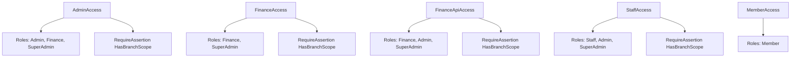

**Diagram sources**
- [Program.cs:315-343](file://Program.cs#L315-L343)

**Section sources**
- [Program.cs:315-343](file://Program.cs#L315-L343)
- [Program.cs:345-352](file://Program.cs#L345-L352)

## Dependency Analysis
- Program.cs registers the dual authentication scheme, JWT validation, application cookie, authorization policies, and middleware pipeline.
- Controllers depend on UserManager, SignInManager, and DbContext for claims, roles, and branch assignments.
- Middleware depends on BranchAccess helpers to evaluate branch scope.

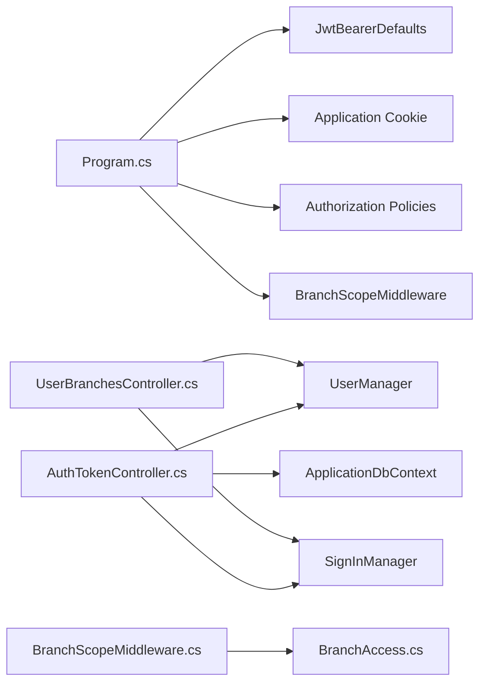

**Diagram sources**
- [Program.cs:199-352](file://Program.cs#L199-L352)
- [AuthTokenController.cs:26-47](file://Controllers/AuthTokenController.cs#L26-L47)
- [UserBranchesController.cs:32-44](file://Controllers/UserBranchesController.cs#L32-L44)
- [BranchScopeMiddleware.cs:14-53](file://Security/BranchScopeMiddleware.cs#L14-L53)
- [BranchAccess.cs:1-31](file://Security/BranchAccess.cs#L1-L31)

**Section sources**
- [Program.cs:199-352](file://Program.cs#L199-L352)
- [AuthTokenController.cs:26-47](file://Controllers/AuthTokenController.cs#L26-L47)
- [UserBranchesController.cs:32-44](file://Controllers/UserBranchesController.cs#L32-L44)
- [BranchScopeMiddleware.cs:14-53](file://Security/BranchScopeMiddleware.cs#L14-L53)
- [BranchAccess.cs:1-31](file://Security/BranchAccess.cs#L1-L31)

## Performance Considerations
- JWT signing and hashing operations occur during token issuance and refresh; ensure the signing key is configured in production to avoid runtime fallbacks.
- Refresh token pruning keeps the token table bounded by max active tokens and retention days.
- Branch scope checks are O(1) per request using claims; keep claim counts minimal for performance.

[No sources needed since this section provides general guidance]

## Troubleshooting Guide
Common issues and resolutions:
- Missing JWT signing key in production: The application throws an error if the signing key is not configured. Configure Jwt:SigningKey in appsettings or use the development fallback only in non-production environments.
- Branch assignment required for back-office access: Users without a branch claim receive 403. Assign a branch via the branch assignment controller for Staff/Admin/Finance roles.
- API vs UI redirects on authentication failures: Application cookie events customize redirects for API endpoints (401/403) versus UI pages.
- CORS configuration: In development, any origin is allowed; in production, configure App:PublicBaseUrl to restrict origins and enable credentials.

**Section sources**
- [Program.cs:92-105](file://Program.cs#L92-L105)
- [Program.cs:279-312](file://Program.cs#L279-L312)
- [BranchScopeMiddleware.cs:41-52](file://Security/BranchScopeMiddleware.cs#L41-L52)
- [Program.cs:419-437](file://Program.cs#L419-L437)

## Conclusion
The system combines cookie-based Identity and JWT bearer authentication under a single “IdentityOrJwt” scheme, with robust authorization policies and a branch scoping middleware to enforce data isolation. SuperAdmin can manage branch assignments, while role-based policies ensure appropriate access to admin, finance, staff, and member resources. Proper configuration of JWT signing keys, CORS, and forwarded headers is essential for secure operation.