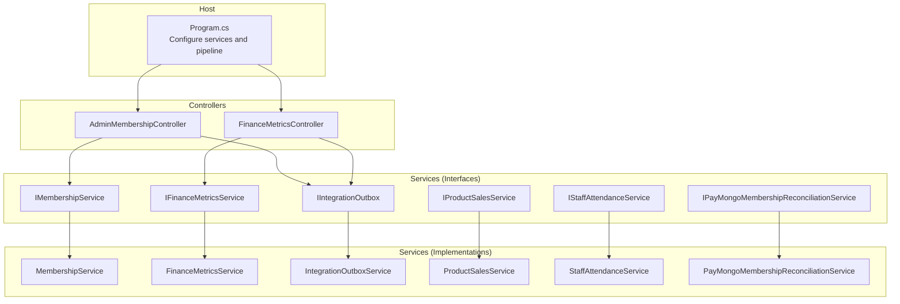
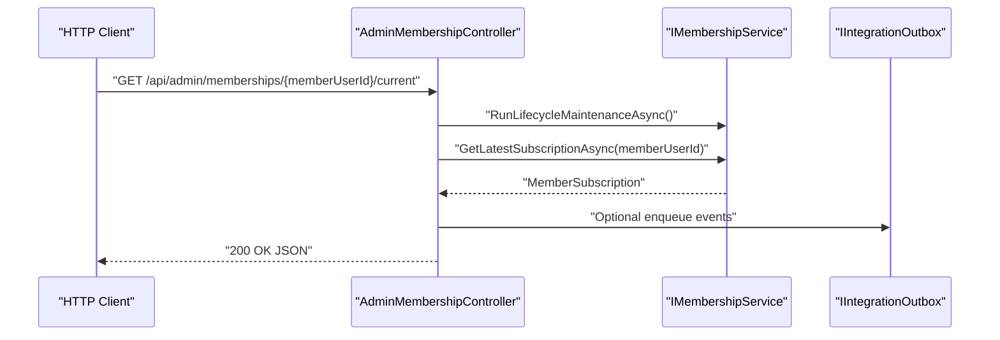
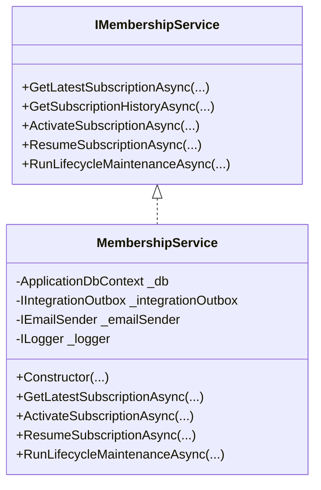
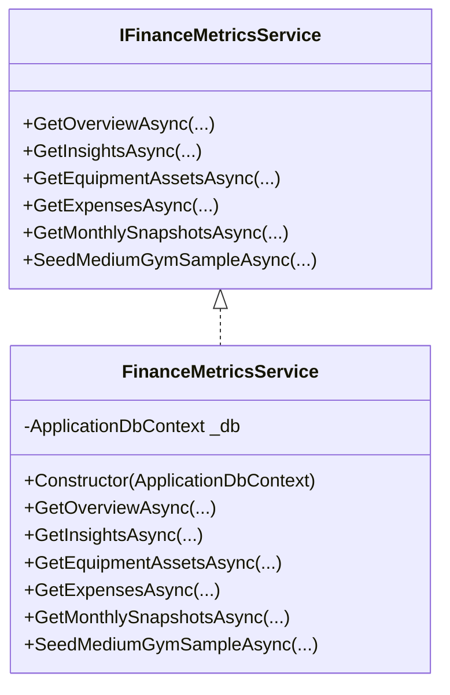
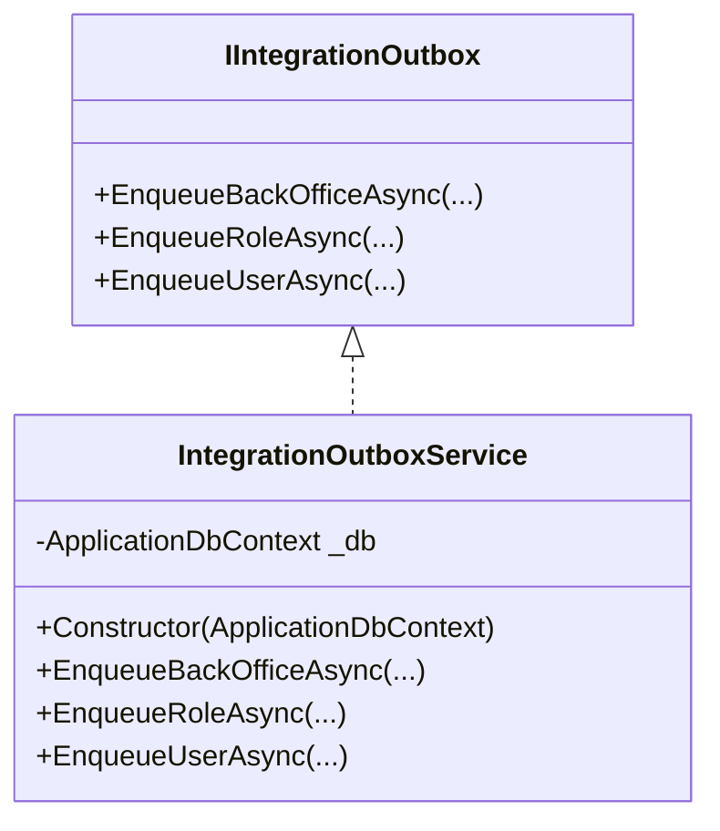
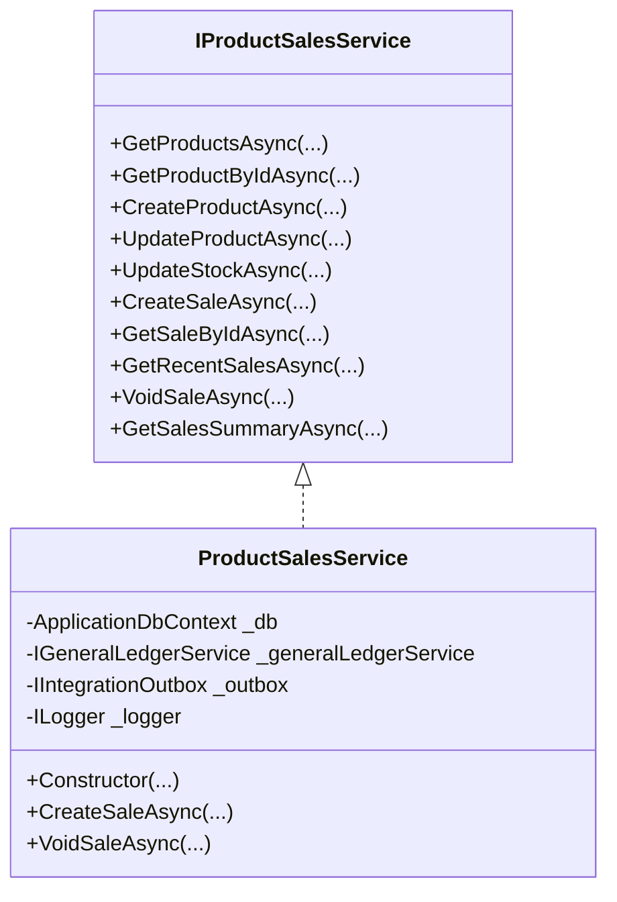
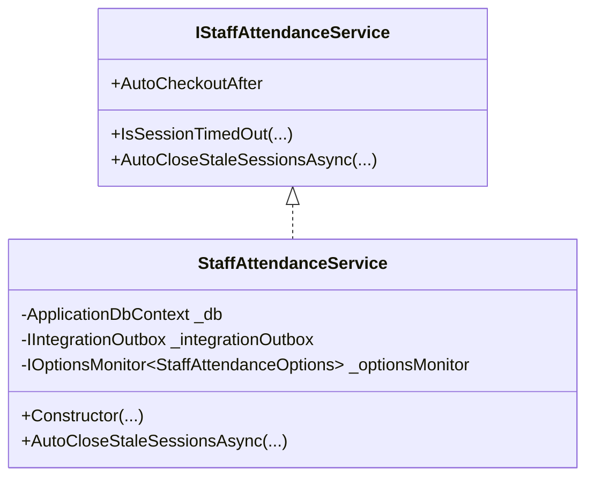
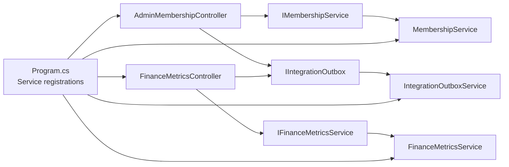

# Dependency Injection Container

<cite>
**Referenced Files in This Document**
- [Program.cs](file://Program.cs)
- [AdminMembershipController.cs](file://Controllers/AdminMembershipController.cs)
- [FinanceMetricsController.cs](file://Controllers/FinanceMetricsController.cs)
- [IMembershipService.cs](file://Services/Memberships/IMembershipService.cs)
- [MembershipService.cs](file://Services/Memberships/MembershipService.cs)
- [IPayMongoMembershipReconciliationService.cs](file://Services/Payments/IPayMongoMembershipReconciliationService.cs)
- [IFinanceMetricsService.cs](file://Services/Finance/IFinanceMetricsService.cs)
- [FinanceMetricsService.cs](file://Services/Finance/FinanceMetricsService.cs)
- [IIntegrationOutbox.cs](file://Services/Integration/IIntegrationOutbox.cs)
- [IntegrationOutboxService.cs](file://Services/Integration/IntegrationOutboxService.cs)
- [IProductSalesService.cs](file://Services/Inventory/IProductSalesService.cs)
- [ProductSalesService.cs](file://Services/Inventory/ProductSalesService.cs)
- [IStaffAttendanceService.cs](file://Services/Staff/IStaffAttendanceService.cs)
- [StaffAttendanceService.cs](file://Services/Staff/StaffAttendanceService.cs)
</cite>

## Table of Contents
1. [Introduction](#introduction)
2. [Project Structure](#project-structure)
3. [Core Components](#core-components)
4. [Architecture Overview](#architecture-overview)
5. [Detailed Component Analysis](#detailed-component-analysis)
6. [Dependency Analysis](#dependency-analysis)
7. [Performance Considerations](#performance-considerations)
8. [Troubleshooting Guide](#troubleshooting-guide)
9. [Conclusion](#conclusion)

## Introduction
This document explains how the application configures and uses the ASP.NET Core dependency injection (DI) container. It focuses on service registration patterns, the service interface pattern that enables testability and loose coupling, and how different lifetimes (scoped, singleton, transient) are applied across domain areas such as finance, payments, memberships, inventory, and staff management. It also covers service resolution, constructor injection, and the rationale behind choosing AddScoped, AddSingleton, or AddTransient for various service types.

## Project Structure
The DI configuration is centralized in the application’s entry point, where services are registered via extension methods on IServiceCollection. Controllers consume services through constructor injection, and services often depend on other services, repositories, and infrastructure components.

**Diagram sources**
- [Program.cs:363-385](file://Program.cs#L363-L385)
- [AdminMembershipController.cs:15-29](file://Controllers/AdminMembershipController.cs#L15-L29)
- [FinanceMetricsController.cs:15-41](file://Controllers/FinanceMetricsController.cs#L15-L41)

**Section sources**
- [Program.cs:56-407](file://Program.cs#L56-L407)

## Core Components
- Service interface pattern: Each domain capability is defined by an interface (e.g., IMembershipService, IFinanceMetricsService, IIntegrationOutbox) and implemented by a concrete class. This enables substitutability, test doubles, and clean separation of concerns.
- Constructor injection: Controllers and services accept dependencies through constructors, ensuring required collaborators are available and making dependencies explicit.
- Hosted services: Background workers are registered as hosted services to run continuously or periodically.

Examples of registrations and resolutions:
- Scoped services (domain services): IMembershipService -> MembershipService, IFinanceMetricsService -> FinanceMetricsService, IIntegrationOutbox -> IntegrationOutboxService, IProductSalesService -> ProductSalesService, IStaffAttendanceService -> StaffAttendanceService, IPayMongoMembershipReconciliationService -> PayMongoMembershipReconciliationService.
- Singleton: StartupInitializationState.
- Transient: IEmailSender (SmtpEmailSender or LoggingEmailSender depending on configuration).
- Hosted services: IntegrationOutboxDispatcherWorker, MembershipLifecycleWorker, FinanceAlertEvaluatorWorker, StaffAttendanceAutoCloseWorker, AutoBillingWorker.

**Section sources**
- [Program.cs:363-385](file://Program.cs#L363-L385)
- [Program.cs:363](file://Program.cs#L363)
- [Program.cs:400-405](file://Program.cs#L400-L405)
- [Program.cs:370-374](file://Program.cs#L370-L374)

## Architecture Overview
The DI architecture follows a layered approach:
- Entry point registers framework services, domain services, and infrastructure integrations.
- Controllers depend on service interfaces and resolve them from the container.
- Services encapsulate domain logic and coordinate with repositories/data contexts and other services.
- Background workers are hosted services that operate independently of HTTP requests.

**Diagram sources**
- [AdminMembershipController.cs:31-63](file://Controllers/AdminMembershipController.cs#L31-L63)
- [IMembershipService.cs:23-25](file://Services/Memberships/IMembershipService.cs#L23-L25)
- [MembershipService.cs:248-460](file://Services/Memberships/MembershipService.cs#L248-L460)

## Detailed Component Analysis

### Membership Management Services
- Interface: IMembershipService defines operations for retrieving subscriptions, activating/resuming subscriptions, and running lifecycle maintenance.
- Implementation: MembershipService orchestrates persistence, calculates renewal dates, generates invoices, and coordinates outbox notifications and optional email sending.
- Registration: Scoped lifetime ensures per-request or per-operation isolation of domain logic and database context usage.

**Diagram sources**
- [IMembershipService.cs:5-36](file://Services/Memberships/IMembershipService.cs#L5-L36)
- [MembershipService.cs:9-26](file://Services/Memberships/MembershipService.cs#L9-L26)

**Section sources**
- [IMembershipService.cs:5-36](file://Services/Memberships/IMembershipService.cs#L5-L36)
- [MembershipService.cs:9-26](file://Services/Memberships/MembershipService.cs#L9-L26)

### Finance Metrics Services
- Interface: IFinanceMetricsService exposes methods for financial overviews, insights, equipment assets, expenses, monthly snapshots, and sample data seeding.
- Implementation: FinanceMetricsService performs aggregations, forecasting, anomaly detection, and branch-scoped queries using the data context.
- Registration: Scoped lifetime aligns with per-request analytics and reporting.

**Diagram sources**
- [IFinanceMetricsService.cs:5-114](file://Services/Finance/IFinanceMetricsService.cs#L5-L114)
- [FinanceMetricsService.cs:9-52](file://Services/Finance/FinanceMetricsService.cs#L9-L52)

**Section sources**
- [IFinanceMetricsService.cs:5-114](file://Services/Finance/IFinanceMetricsService.cs#L5-L114)
- [FinanceMetricsService.cs:9-52](file://Services/Finance/FinanceMetricsService.cs#L9-L52)

### Integration Outbox Service
- Interface: IIntegrationOutbox defines enqueue methods for back-office, role-based, and user-targeted events.
- Implementation: IntegrationOutboxService persists messages to the outbox table for eventual delivery.
- Registration: Scoped lifetime matches domain operations that enqueue events during request processing.

**Diagram sources**
- [IIntegrationOutbox.cs](file://Services/Integration/IIntegrationOutbox.cs)
- [IntegrationOutboxService.cs:7-16](file://Services/Integration/IntegrationOutboxService.cs#L7-L16)

**Section sources**
- [IIntegrationOutbox.cs](file://Services/Integration/IIntegrationOutbox.cs)
- [IntegrationOutboxService.cs:7-16](file://Services/Integration/IntegrationOutboxService.cs#L7-L16)

### Inventory Sales Service
- Interface: IProductSalesService manages retail product catalogs, sales creation, stock updates, and summaries.
- Implementation: ProductSalesService coordinates product lookup, stock validation, sale creation, ledger posting, and outbox notifications.
- Registration: Scoped lifetime supports per-request POS operations and inventory consistency.

**Diagram sources**
- [IProductSalesService.cs](file://Services/Inventory/IProductSalesService.cs)
- [ProductSalesService.cs:9-27](file://Services/Inventory/ProductSalesService.cs#L9-L27)

**Section sources**
- [IProductSalesService.cs](file://Services/Inventory/IProductSalesService.cs)
- [ProductSalesService.cs:9-27](file://Services/Inventory/ProductSalesService.cs#L9-L27)

### Staff Attendance Service
- Interface: IStaffAttendanceService exposes auto-checkout configuration and stale session management.
- Implementation: StaffAttendanceService reads runtime options and enqueues attendance events for auto-checkout.
- Registration: Scoped lifetime fits per-request or periodic maintenance tasks.

**Diagram sources**
- [IStaffAttendanceService.cs](file://Services/Staff/IStaffAttendanceService.cs)
- [StaffAttendanceService.cs:9-23](file://Services/Staff/StaffAttendanceService.cs#L9-L23)

**Section sources**
- [IStaffAttendanceService.cs](file://Services/Staff/IStaffAttendanceService.cs)
- [StaffAttendanceService.cs:9-23](file://Services/Staff/StaffAttendanceService.cs#L9-L23)

### Payments Reconciliation Service
- Interface: IPayMongoMembershipReconciliationService defines reconciliation operations for pending member payments.
- Registration: Scoped lifetime aligns with request-scoped reconciliation runs.

**Section sources**
- [IPayMongoMembershipReconciliationService.cs:3-8](file://Services/Payments/IPayMongoMembershipReconciliationService.cs#L3-L8)
- [Program.cs:365](file://Program.cs#L365)

### Controller Constructor Injection Examples
- AdminMembershipController depends on IMembershipService and IIntegrationOutbox to manage membership operations and event publishing.
- FinanceMetricsController depends on multiple finance-related services for reporting and alerts.

**Section sources**
- [AdminMembershipController.cs:15-29](file://Controllers/AdminMembershipController.cs#L15-L29)
- [FinanceMetricsController.cs:15-41](file://Controllers/FinanceMetricsController.cs#L15-L41)

## Dependency Analysis
The DI graph emphasizes domain services as central collaborators for controllers and other services. The following diagram highlights key dependencies among controllers and services:

**Diagram sources**
- [Program.cs:363-385](file://Program.cs#L363-L385)
- [AdminMembershipController.cs:17-28](file://Controllers/AdminMembershipController.cs#L17-L28)
- [FinanceMetricsController.cs:17-40](file://Controllers/FinanceMetricsController.cs#L17-L40)

**Section sources**
- [Program.cs:363-385](file://Program.cs#L363-L385)

## Performance Considerations
- Prefer scoped services for domain logic and data access to avoid cross-request state leakage and to keep database contexts aligned with request lifetimes.
- Use hosted services for long-running tasks to prevent blocking HTTP requests.
- Keep transient services lightweight; avoid heavy initialization in constructors.
- Centralize configuration via strongly-typed options to minimize repeated reads and improve startup performance.

## Troubleshooting Guide
- Missing service registrations: If a controller constructor requires a service not registered, the application fails at startup with a dependency resolution error. Verify the corresponding AddScoped/AddSingleton/AddTransient registration in the entry point.
- Incorrect lifetime choices: Using singleton for services that hold per-request state (e.g., DbContext) leads to concurrency issues. Ensure scoped lifetimes for request-bound collaborators.
- Email sender selection: The email sender is registered as transient based on configuration. If emails are not sent, confirm SMTP settings and fallback logging sender behavior.
- Hosted service startup: If background workers do not run, check AddHostedService registrations and ensure the worker implementations are correctly configured.

**Section sources**
- [Program.cs:363-385](file://Program.cs#L363-L385)
- [Program.cs:400-405](file://Program.cs#L400-L405)

## Conclusion
The application employs a clean service interface pattern with constructor injection and a disciplined DI configuration. Scoped lifetimes dominate for domain services and data access, while singleton and transient registrations serve specialized needs. This design improves testability, maintainability, and operational reliability across finance, payments, memberships, inventory, and staff management domains.