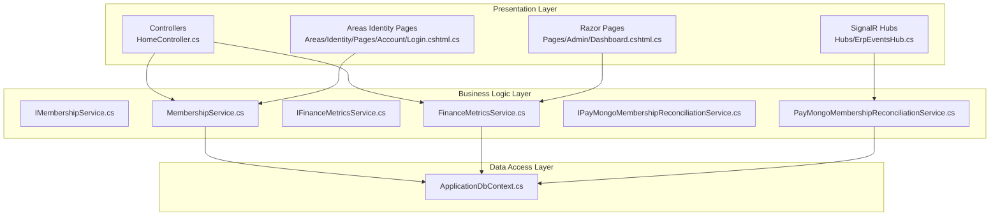
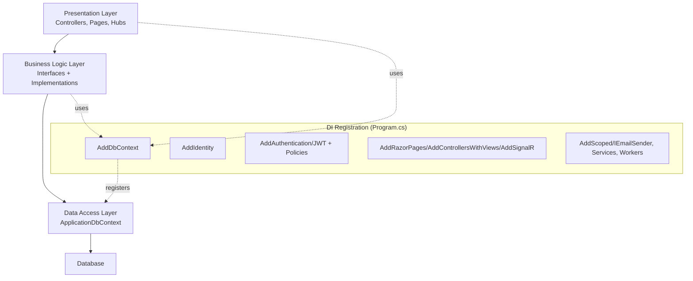
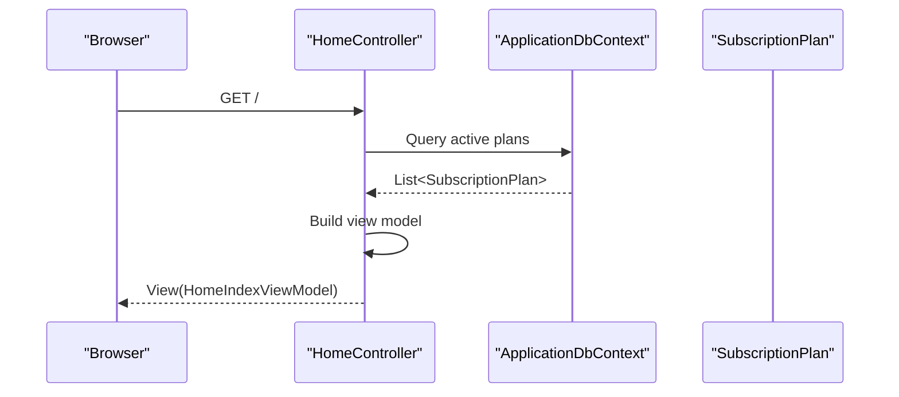
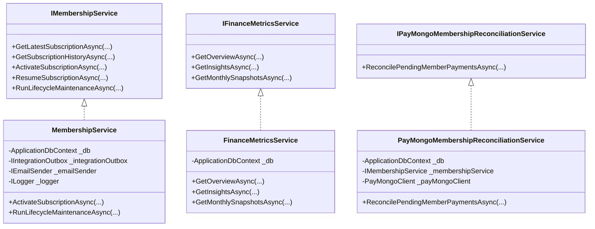
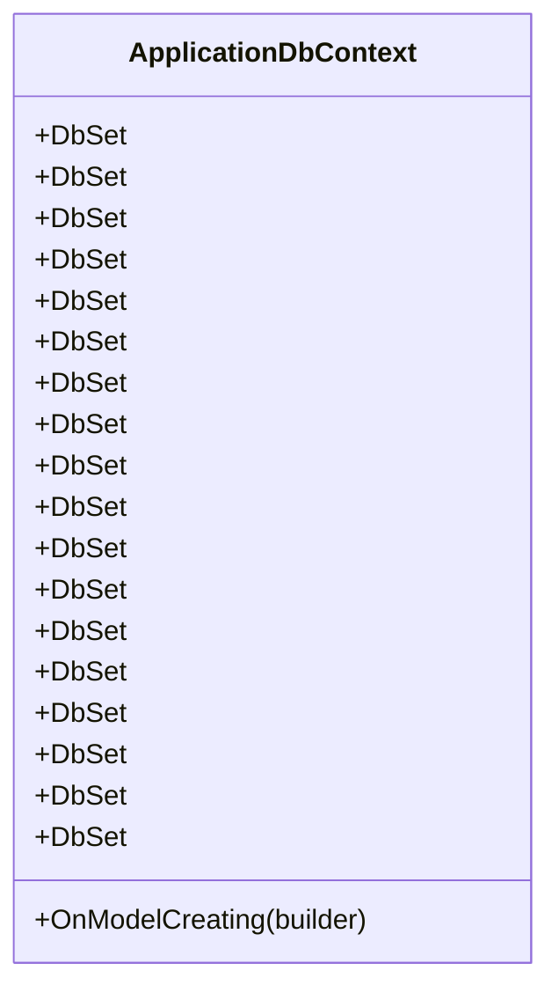
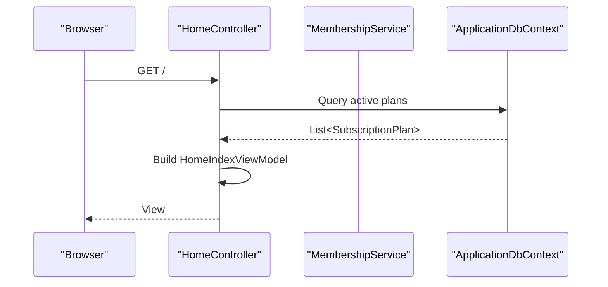
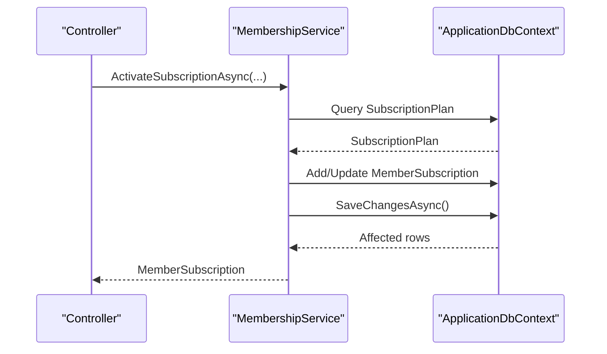
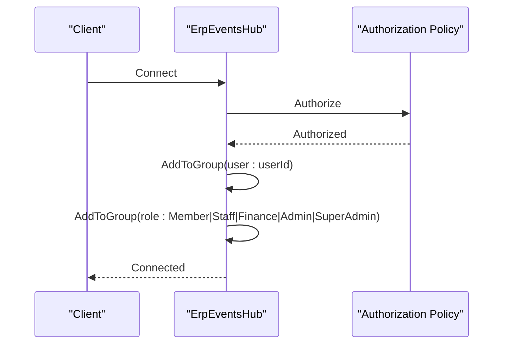
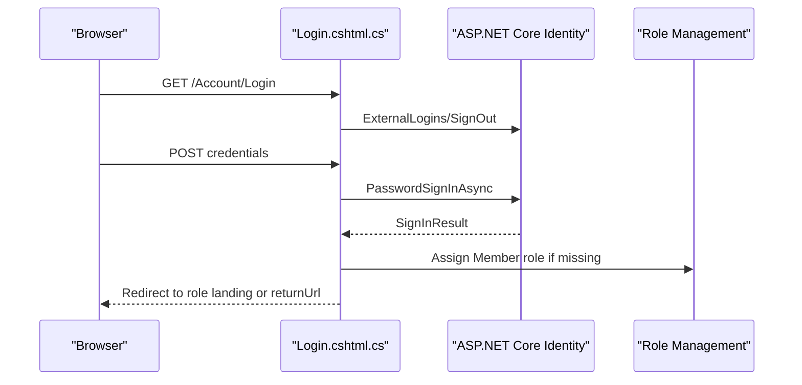
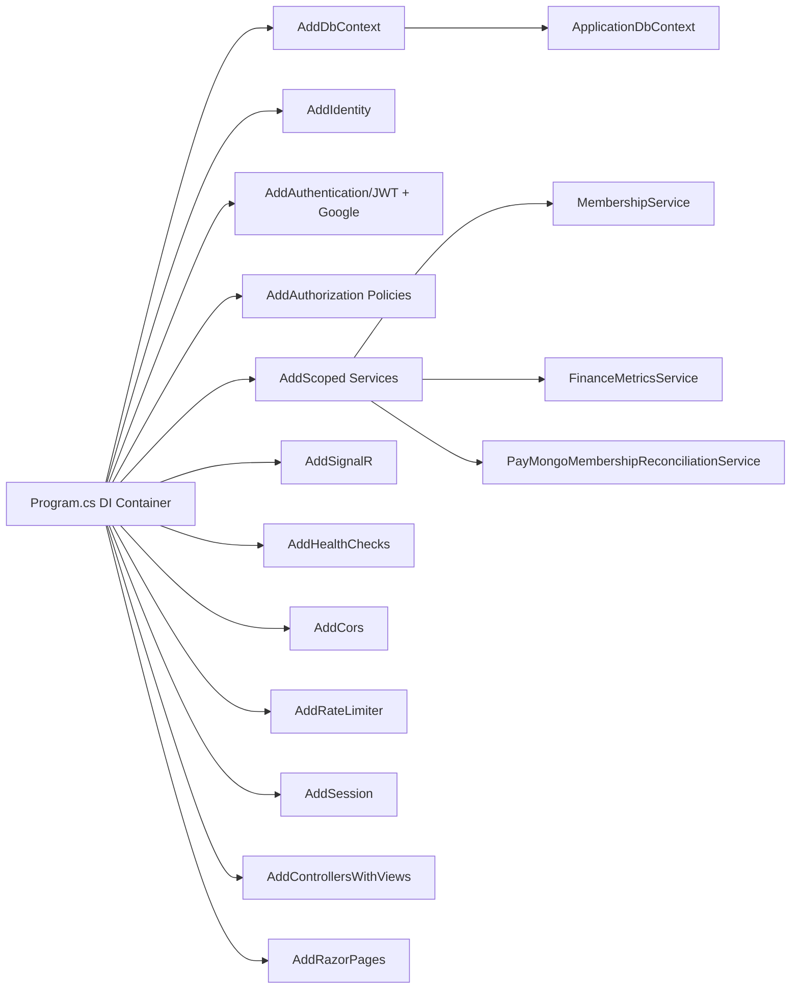

# Layered Architecture

<cite>
**Referenced Files in This Document**
- [Program.cs](file://Program.cs)
- [ApplicationDbContext.cs](file://Data/ApplicationDbContext.cs)
- [IMembershipService.cs](file://Services/Memberships/IMembershipService.cs)
- [MembershipService.cs](file://Services/Memberships/MembershipService.cs)
- [IFinanceMetricsService.cs](file://Services/Finance/IFinanceMetricsService.cs)
- [FinanceMetricsService.cs](file://Services/Finance/FinanceMetricsService.cs)
- [IPayMongoMembershipReconciliationService.cs](file://Services/Payments/IPayMongoMembershipReconciliationService.cs)
- [PayMongoMembershipReconciliationService.cs](file://Services/Payments/PayMongoMembershipReconciliationService.cs)
- [HomeController.cs](file://Controllers/HomeController.cs)
- [Dashboard.cshtml.cs](file://Pages/Admin/Dashboard.cshtml.cs)
- [ErpEventsHub.cs](file://Hubs/ErpEventsHub.cs)
- [Login.cshtml.cs](file://Areas/Identity/Pages/Account/Login.cshtml.cs)
</cite>

## Table of Contents
1. [Introduction](#introduction)
2. [Project Structure](#project-structure)
3. [Core Components](#core-components)
4. [Architecture Overview](#architecture-overview)
5. [Detailed Component Analysis](#detailed-component-analysis)
6. [Dependency Analysis](#dependency-analysis)
7. [Performance Considerations](#performance-considerations)
8. [Troubleshooting Guide](#troubleshooting-guide)
9. [Conclusion](#conclusion)

## Introduction
This document explains the layered architecture of the EJC Fitness Gym system, focusing on the clear separation between:
- Presentation layer: Razor Pages, MVC Controllers, and SignalR Hubs
- Business logic layer: Service interfaces and implementations
- Data access layer: Entity Framework DbContext

It documents how each layer communicates through well-defined interfaces and dependency injection, details service registration patterns in Program.cs, and illustrates typical request flows from HTTP requests through controllers to services and repositories. Finally, it highlights the benefits of this architecture for maintainability, testability, and scalability.

## Project Structure
The solution follows a conventional ASP.NET Core project layout with clear boundaries:
- Presentation: Controllers, Razor Pages, and SignalR Hubs under top-level folders
- Business logic: Services under Services/<Domain>/ with interfaces and implementations
- Data access: Entity Framework DbContext under Data/
- Models: Domain models under Models/ and view models under Pages/Models or per-area

**Diagram sources**
- [HomeController.cs:12-23](file://Controllers/HomeController.cs#L12-L23)
- [Dashboard.cshtml.cs:7-18](file://Pages/Admin/Dashboard.cshtml.cs#L7-L18)
- [ErpEventsHub.cs:7-47](file://Hubs/ErpEventsHub.cs#L7-L47)
- [Login.cshtml.cs:10-19](file://Areas/Identity/Pages/Account/Login.cshtml.cs#L10-L19)
- [IMembershipService.cs:5-26](file://Services/Memberships/IMembershipService.cs#L5-L26)
- [MembershipService.cs:9-26](file://Services/Memberships/MembershipService.cs#L9-L26)
- [IFinanceMetricsService.cs:5-38](file://Services/Finance/IFinanceMetricsService.cs#L5-L38)
- [FinanceMetricsService.cs:9-52](file://Services/Finance/FinanceMetricsService.cs#L9-L52)
- [IPayMongoMembershipReconciliationService.cs:3-8](file://Services/Payments/IPayMongoMembershipReconciliationService.cs#L3-L8)
- [PayMongoMembershipReconciliationService.cs:10-32](file://Services/Payments/PayMongoMembershipReconciliationService.cs#L10-L32)
- [ApplicationDbContext.cs:12-17](file://Data/ApplicationDbContext.cs#L12-L17)

**Section sources**
- [Program.cs:56-407](file://Program.cs#L56-L407)
- [ApplicationDbContext.cs:12-42](file://Data/ApplicationDbContext.cs#L12-L42)

## Core Components
- Presentation layer
  - MVC Controllers: Handle HTTP requests, orchestrate services, and return views or JSON
  - Razor Pages: PageModel classes handle page-specific logic and authorization attributes
  - SignalR Hubs: Real-time communication with role-based grouping
  - Areas Identity Pages: Authentication flows leveraging ASP.NET Core Identity
- Business logic layer
  - Interfaces define contracts for services (e.g., IMembershipService, IFinanceMetricsService)
  - Implementations encapsulate domain logic, coordinate repositories, and integrate external systems
- Data access layer
  - ApplicationDbContext: Entity Framework DbContext exposing strongly-typed DbSets and configuration

These components communicate through dependency injection and explicit interfaces, ensuring loose coupling and testability.

**Section sources**
- [HomeController.cs:12-50](file://Controllers/HomeController.cs#L12-L50)
- [Dashboard.cshtml.cs:7-18](file://Pages/Admin/Dashboard.cshtml.cs#L7-L18)
- [ErpEventsHub.cs:7-47](file://Hubs/ErpEventsHub.cs#L7-L47)
- [Login.cshtml.cs:10-19](file://Areas/Identity/Pages/Account/Login.cshtml.cs#L10-L19)
- [IMembershipService.cs:5-26](file://Services/Memberships/IMembershipService.cs#L5-L26)
- [IFinanceMetricsService.cs:5-38](file://Services/Finance/IFinanceMetricsService.cs#L5-L38)
- [IPayMongoMembershipReconciliationService.cs:3-8](file://Services/Payments/IPayMongoMembershipReconciliationService.cs#L3-L8)
- [ApplicationDbContext.cs:19-41](file://Data/ApplicationDbContext.cs#L19-L41)

## Architecture Overview
The system enforces a clean layered architecture:
- Presentation depends on business logic interfaces
- Business logic depends on data access abstractions and external clients
- Data access depends on Entity Framework and database connectivity
- Dependency injection registers interfaces to implementations and configures cross-cutting concerns

**Diagram sources**
- [Program.cs:56-407](file://Program.cs#L56-L407)
- [ApplicationDbContext.cs:12-17](file://Data/ApplicationDbContext.cs#L12-L17)

## Detailed Component Analysis

### Presentation Layer Components
- MVC Controllers
  - Example: HomeController retrieves active subscription plans and renders a view model
  - Demonstrates minimal logic in controllers, delegating data access to repositories via injected DbContext
- Razor Pages
  - Example: Admin Dashboard page model applies authorization policies and redirects based on roles
- SignalR Hubs
  - Example: ErpEventsHub groups connected clients by roles and user identifiers for targeted real-time updates
- Areas Identity Pages
  - Example: Login page model manages authentication flows, role-aware redirection, and external login integration

**Diagram sources**
- [HomeController.cs:25-50](file://Controllers/HomeController.cs#L25-L50)
- [ApplicationDbContext.cs:19-20](file://Data/ApplicationDbContext.cs#L19-L20)

**Section sources**
- [HomeController.cs:12-50](file://Controllers/HomeController.cs#L12-L50)
- [Dashboard.cshtml.cs:7-18](file://Pages/Admin/Dashboard.cshtml.cs#L7-L18)
- [ErpEventsHub.cs:12-47](file://Hubs/ErpEventsHub.cs#L12-L47)
- [Login.cshtml.cs:45-81](file://Areas/Identity/Pages/Account/Login.cshtml.cs#L45-L81)

### Business Logic Layer Components
- Service interfaces
  - IMembershipService: Defines subscription lifecycle operations
  - IFinanceMetricsService: Defines financial analytics operations
  - IPayMongoMembershipReconciliationService: Defines reconciliation operations
- Service implementations
  - MembershipService: Orchestrates subscription activation, resumption, lifecycle maintenance, and integrates with email and integration outbox
  - FinanceMetricsService: Computes financial overviews, insights, monthly snapshots, and equipment seeding
  - PayMongoMembershipReconciliationService: Reconciles pending PayMongo payments, updates invoices, and triggers membership lifecycle maintenance

**Diagram sources**
- [IMembershipService.cs:5-26](file://Services/Memberships/IMembershipService.cs#L5-L26)
- [MembershipService.cs:9-26](file://Services/Memberships/MembershipService.cs#L9-L26)
- [IFinanceMetricsService.cs:5-38](file://Services/Finance/IFinanceMetricsService.cs#L5-L38)
- [FinanceMetricsService.cs:9-52](file://Services/Finance/FinanceMetricsService.cs#L9-L52)
- [IPayMongoMembershipReconciliationService.cs:3-8](file://Services/Payments/IPayMongoMembershipReconciliationService.cs#L3-L8)
- [PayMongoMembershipReconciliationService.cs:10-32](file://Services/Payments/PayMongoMembershipReconciliationService.cs#L10-L32)

**Section sources**
- [IMembershipService.cs:5-36](file://Services/Memberships/IMembershipService.cs#L5-L36)
- [MembershipService.cs:9-460](file://Services/Memberships/MembershipService.cs#L9-L460)
- [IFinanceMetricsService.cs:5-114](file://Services/Finance/IFinanceMetricsService.cs#L5-L114)
- [FinanceMetricsService.cs:9-800](file://Services/Finance/FinanceMetricsService.cs#L9-L800)
- [IPayMongoMembershipReconciliationService.cs:3-8](file://Services/Payments/IPayMongoMembershipReconciliationService.cs#L3-L8)
- [PayMongoMembershipReconciliationService.cs:10-146](file://Services/Payments/PayMongoMembershipReconciliationService.cs#L10-L146)

### Data Access Layer Component
- ApplicationDbContext
  - Inherits from IdentityDbContext
  - Exposes strongly-typed DbSets for domain entities
  - Configures entity relationships, indexes, and precision constraints

**Diagram sources**
- [ApplicationDbContext.cs:12-42](file://Data/ApplicationDbContext.cs#L12-L42)
- [ApplicationDbContext.cs:43-411](file://Data/ApplicationDbContext.cs#L43-L411)

**Section sources**
- [ApplicationDbContext.cs:12-411](file://Data/ApplicationDbContext.cs#L12-L411)

### Typical Request Flows and Layer Interactions

#### MVC Controller to Service to Repository

**Diagram sources**
- [HomeController.cs:25-50](file://Controllers/HomeController.cs#L25-L50)
- [ApplicationDbContext.cs:19-20](file://Data/ApplicationDbContext.cs#L19-L20)

#### Service Implementation Using DbContext

**Diagram sources**
- [HomeController.cs:12-23](file://Controllers/HomeController.cs#L12-L23)
- [MembershipService.cs:72-197](file://Services/Memberships/MembershipService.cs#L72-L197)
- [ApplicationDbContext.cs:12-17](file://Data/ApplicationDbContext.cs#L12-L17)

#### SignalR Hub Grouping and Authorization

**Diagram sources**
- [ErpEventsHub.cs:12-47](file://Hubs/ErpEventsHub.cs#L12-L47)

#### Authentication Flow Using Areas Identity Pages

**Diagram sources**
- [Login.cshtml.cs:45-81](file://Areas/Identity/Pages/Account/Login.cshtml.cs#L45-L81)
- [Login.cshtml.cs:83-202](file://Areas/Identity/Pages/Account/Login.cshtml.cs#L83-L202)

## Dependency Analysis
- Dependency Injection registrations in Program.cs
  - DbContext registration with SQL Server provider and auditing interceptor
  - Identity setup with roles and entity framework stores
  - Authentication with JWT bearer and Google external login
  - Authorization policies for roles and branch scoping
  - Service registrations for scoped services, hosted workers, SignalR, CORS, rate limiting, sessions, and health checks
- Coupling and cohesion
  - Controllers depend on service interfaces, not implementations
  - Services depend on DbContext and external clients via interfaces
  - DbContext encapsulates persistence concerns
- External dependencies
  - PayMongo client for payment reconciliation
  - Email sender abstraction supporting SMTP or logging fallback
  - SignalR for real-time events

**Diagram sources**
- [Program.cs:56-407](file://Program.cs#L56-L407)

**Section sources**
- [Program.cs:56-407](file://Program.cs#L56-L407)

## Performance Considerations
- Use AsNoTracking for read-only queries in services to reduce change tracking overhead
- Prefer projection queries to minimize data transfer
- Batch operations and transactions where appropriate to reduce round-trips
- Leverage indexes defined in ApplicationDbContext for filtered and joined queries
- Use hosted services for background tasks (e.g., lifecycle maintenance, alert evaluation) to offload request processing
- Enable response caching for static assets and non-sensitive data where applicable

## Troubleshooting Guide
- Authentication and authorization
  - Verify JWT signing key configuration and audience/issuer settings
  - Ensure role assignments and branch scope claims are present for back-office users
- Database migrations and seed data
  - Confirm migrations are applied during startup and default branch and GL accounts are seeded
- Email delivery
  - Switch between SMTP and logging email sender based on configuration and environment
- SignalR connectivity
  - Ensure hubs are authorized and clients connect with proper credentials
- Background workers
  - Monitor hosted services for scheduled tasks (e.g., membership lifecycle, finance alerts, integration dispatchers)

**Section sources**
- [Program.cs:34-105](file://Program.cs#L34-L105)
- [Program.cs:710-799](file://Program.cs#L710-L799)
- [Program.cs:397-405](file://Program.cs#L397-L405)
- [ErpEventsHub.cs:12-47](file://Hubs/ErpEventsHub.cs#L12-L47)

## Conclusion
The EJC Fitness Gym system employs a clean layered architecture with explicit interfaces and dependency injection. This design yields:
- Maintainability: Clear separation of concerns and single-responsibility services
- Testability: Interfaces enable mocking and unit testing
- Scalability: Background workers and modular services support asynchronous and distributed workloads
- Security: Centralized authentication, authorization policies, and branch scoping
- Reliability: DbContext encapsulation and transactional service methods