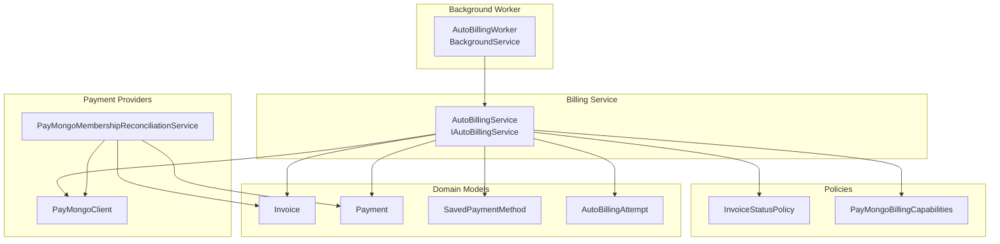
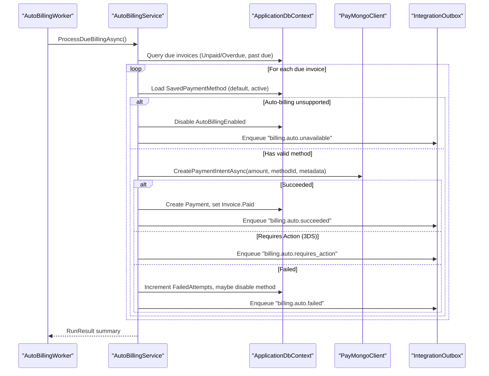
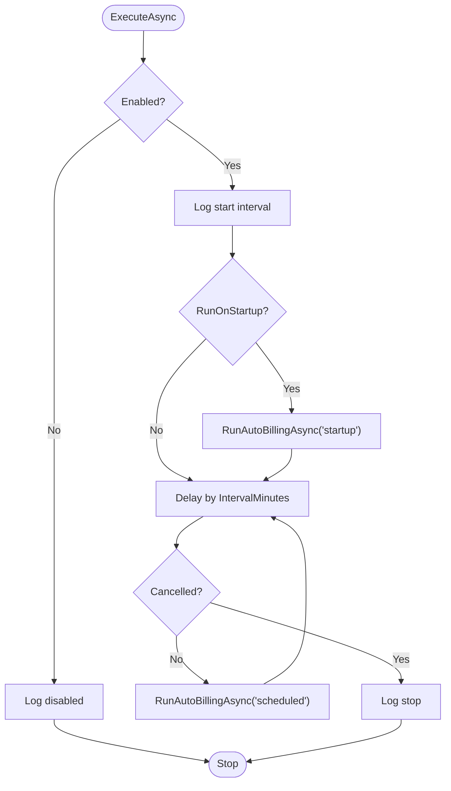
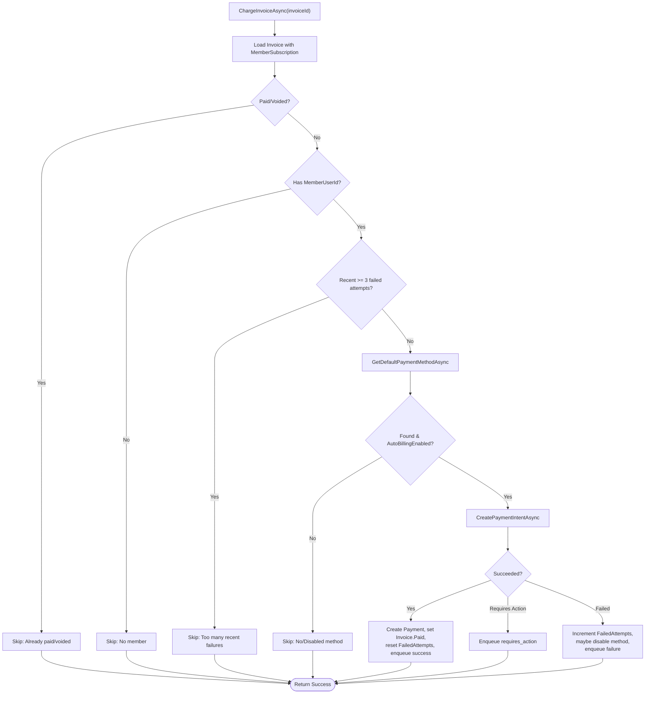
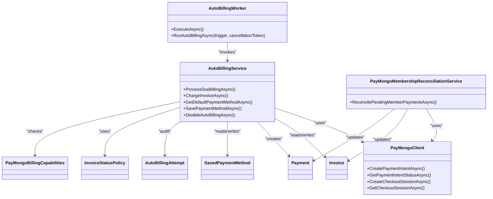

# Auto Billing Worker

<cite>
**Referenced Files in This Document**
- [AutoBillingWorker.cs](file://Services/Payments/AutoBillingWorker.cs)
- [AutoBillingService.cs](file://Services/Payments/AutoBillingService.cs)
- [PayMongoClient.cs](file://Services/Payments/PayMongoClient.cs)
- [PayMongoMembershipReconciliationService.cs](file://Services/Payments/PayMongoMembershipReconciliationService.cs)
- [PayMongoBillingCapabilities.cs](file://Services/Payments/PayMongoBillingCapabilities.cs)
- [InvoiceStatusPolicy.cs](file://Services/Payments/InvoiceStatusPolicy.cs)
- [PayMongoOptions.cs](file://Services/Payments/PayMongoOptions.cs)
- [PayMongoWebhookController.cs](file://Controllers/PayMongoWebhookController.cs)
- [Invoice.cs](file://Models/Billing/Invoice.cs)
- [Payment.cs](file://Models/Billing/Payment.cs)
- [SavedPaymentMethod.cs](file://Models/Billing/SavedPaymentMethod.cs)
- [AutoBillingAttempt.cs](file://Models/Billing/AutoBillingAttempt.cs)
- [BillingEnums.cs](file://Models/Billing/BillingEnums.cs)
- [AutoBillingServiceTests.cs](file://EJCFitnessGym.Tests/AutoBillingServiceTests.cs)
</cite>

## Table of Contents
1. [Introduction](#introduction)
2. [Project Structure](#project-structure)
3. [Core Components](#core-components)
4. [Architecture Overview](#architecture-overview)
5. [Detailed Component Analysis](#detailed-component-analysis)
6. [Dependency Analysis](#dependency-analysis)
7. [Performance Considerations](#performance-considerations)
8. [Troubleshooting Guide](#troubleshooting-guide)
9. [Conclusion](#conclusion)
10. [Appendices](#appendices)

## Introduction
This document explains the auto billing worker background service responsible for automating invoice generation and payment collection. It covers the scheduled billing cycles, payment processing automation via PayMongo, reconciliation services, invoice status management, retry mechanisms, error handling, monitoring, and scaling considerations. The worker integrates tightly with PayMongo for off-session payment intents and with reconciliation services to align internal records with PayMongo’s checkout sessions.

## Project Structure
The auto billing system spans several services and models:
- Background worker orchestrating periodic runs
- Business logic for billing runs and per-invoice charging
- PayMongo client for payment intents and checkout session lookups
- Reconciliation service for aligning PayMongo checkout outcomes with invoices
- Models representing invoices, payments, subscriptions, saved payment methods, and billing attempts
- Policies governing invoice status transitions

**Diagram sources**
- [AutoBillingWorker.cs:34-121](file://Services/Payments/AutoBillingWorker.cs#L34-L121)
- [AutoBillingService.cs:44-463](file://Services/Payments/AutoBillingService.cs#L44-L463)
- [PayMongoClient.cs:13-717](file://Services/Payments/PayMongoClient.cs#L13-L717)
- [PayMongoMembershipReconciliationService.cs:10-423](file://Services/Payments/PayMongoMembershipReconciliationService.cs#L10-L423)
- [Invoice.cs:5-39](file://Models/Billing/Invoice.cs#L5-L39)
- [Payment.cs:5-38](file://Models/Billing/Payment.cs#L5-L38)
- [SavedPaymentMethod.cs:8-88](file://Models/Billing/SavedPaymentMethod.cs#L8-L88)
- [AutoBillingAttempt.cs:8-66](file://Models/Billing/AutoBillingAttempt.cs#L8-L66)
- [InvoiceStatusPolicy.cs:5-58](file://Services/Payments/InvoiceStatusPolicy.cs#L5-L58)
- [PayMongoBillingCapabilities.cs:3-17](file://Services/Payments/PayMongoBillingCapabilities.cs#L3-L17)

**Section sources**
- [AutoBillingWorker.cs:34-121](file://Services/Payments/AutoBillingWorker.cs#L34-L121)
- [AutoBillingService.cs:44-463](file://Services/Payments/AutoBillingService.cs#L44-L463)
- [PayMongoClient.cs:13-717](file://Services/Payments/PayMongoClient.cs#L13-L717)
- [PayMongoMembershipReconciliationService.cs:10-423](file://Services/Payments/PayMongoMembershipReconciliationService.cs#L10-L423)
- [Invoice.cs:5-39](file://Models/Billing/Invoice.cs#L5-L39)
- [Payment.cs:5-38](file://Models/Billing/Payment.cs#L5-L38)
- [SavedPaymentMethod.cs:8-88](file://Models/Billing/SavedPaymentMethod.cs#L8-L88)
- [AutoBillingAttempt.cs:8-66](file://Models/Billing/AutoBillingAttempt.cs#L8-L66)
- [InvoiceStatusPolicy.cs:5-58](file://Services/Payments/InvoiceStatusPolicy.cs#L5-L58)
- [PayMongoBillingCapabilities.cs:3-17](file://Services/Payments/PayMongoBillingCapabilities.cs#L3-L17)

## Core Components
- AutoBillingWorker: Background service that schedules and executes billing runs at configurable intervals, optionally on startup, and logs run summaries.
- AutoBillingService: Orchestrates finding due invoices, validating eligibility, retrieving saved payment methods, creating PayMongo payment intents, updating statuses, and emitting notifications.
- PayMongoClient: Encapsulates PayMongo API interactions for payment intents, attaching payment methods, and checkout session lookups.
- PayMongoMembershipReconciliationService: Reconciles pending PayMongo payments by checking checkout session states and applying updates to invoices and payments.
- Models: Invoice, Payment, SavedPaymentMethod, AutoBillingAttempt define the domain state for billing operations.
- Policies: InvoiceStatusPolicy governs invoice status transitions based on paid totals and due dates; PayMongoBillingCapabilities reflects current PayMongo integration limitations.

**Section sources**
- [AutoBillingWorker.cs:34-121](file://Services/Payments/AutoBillingWorker.cs#L34-L121)
- [AutoBillingService.cs:44-463](file://Services/Payments/AutoBillingService.cs#L44-L463)
- [PayMongoClient.cs:13-717](file://Services/Payments/PayMongoClient.cs#L13-L717)
- [PayMongoMembershipReconciliationService.cs:10-423](file://Services/Payments/PayMongoMembershipReconciliationService.cs#L10-L423)
- [Invoice.cs:5-39](file://Models/Billing/Invoice.cs#L5-L39)
- [Payment.cs:5-38](file://Models/Billing/Payment.cs#L5-L38)
- [SavedPaymentMethod.cs:8-88](file://Models/Billing/SavedPaymentMethod.cs#L8-L88)
- [AutoBillingAttempt.cs:8-66](file://Models/Billing/AutoBillingAttempt.cs#L8-L66)
- [InvoiceStatusPolicy.cs:5-58](file://Services/Payments/InvoiceStatusPolicy.cs#L5-L58)
- [PayMongoBillingCapabilities.cs:3-17](file://Services/Payments/PayMongoBillingCapabilities.cs#L3-L17)

## Architecture Overview
The auto billing worker follows a background job pattern:
- On startup or at configured intervals, the worker invokes the billing service to process due invoices.
- For each eligible invoice, the service retrieves the member’s saved PayMongo payment method, creates a payment intent, and evaluates the outcome.
- Successful payments update invoice status and persist a payment record; failures increment failure counters and may disable the payment method.
- Notifications are enqueued for user and back-office systems.
- Reconciliation services periodically reconcile pending PayMongo checkout sessions against invoices and payments.

**Diagram sources**
- [AutoBillingWorker.cs:84-119](file://Services/Payments/AutoBillingWorker.cs#L84-L119)
- [AutoBillingService.cs:69-124](file://Services/Payments/AutoBillingService.cs#L69-L124)
- [AutoBillingService.cs:126-377](file://Services/Payments/AutoBillingService.cs#L126-L377)
- [PayMongoClient.cs:137-245](file://Services/Payments/PayMongoClient.cs#L137-L245)
- [PayMongoMembershipReconciliationService.cs:34-146](file://Services/Payments/PayMongoMembershipReconciliationService.cs#L34-L146)

## Detailed Component Analysis

### AutoBillingWorker
- Purpose: Periodic background job that triggers billing runs.
- Configuration:
  - Enabled: toggles the worker
  - IntervalMinutes: delay between runs (clamped to a minimum/maximum range)
  - RunOnStartup: optional immediate run at service start
  - PreferredHourUtc: scheduling preference for the optimal run hour
  - MaxInvoicesPerRun: batch limit for processing throughput control
- Behavior:
  - Validates Enabled flag and logs start/stop
  - Optionally runs immediately on startup
  - Waits for the configured interval and repeats until cancellation
  - Executes RunAutoBillingAsync and logs results

**Diagram sources**
- [AutoBillingWorker.cs:50-82](file://Services/Payments/AutoBillingWorker.cs#L50-L82)
- [AutoBillingWorker.cs:84-119](file://Services/Payments/AutoBillingWorker.cs#L84-L119)

**Section sources**
- [AutoBillingWorker.cs:5-32](file://Services/Payments/AutoBillingWorker.cs#L5-L32)
- [AutoBillingWorker.cs:34-121](file://Services/Payments/AutoBillingWorker.cs#L34-L121)

### AutoBillingService
- Responsibilities:
  - ProcessDueBillingAsync: finds due invoices, batches them, and processes each
  - ChargeInvoiceAsync: validates invoice state, checks recent failed attempts, loads saved payment method, creates PayMongo payment intent, updates statuses, persists outcomes, and enqueues notifications
  - Payment method management: GetDefaultPaymentMethodAsync, SavePaymentMethodAsync, DisableAutoBillingAsync
- Retry and throttling:
  - Recent failed attempts threshold prevents aggressive retries
  - MaxFailedAttempts disables a payment method after repeated failures
  - Grace period after due date before charging
- PayMongo integration:
  - Uses CreatePaymentIntentAsync with metadata including invoice_id, invoice_number, member_user_id, and auto_billing flag
  - Handles requires_action (3DS) vs failed vs succeeded outcomes
- Notifications:
  - Enqueues user notifications for success, requires_action, and failure via IntegrationOutbox
- Results:
  - AutoBillingRunResult and AutoBillingChargeResult track counts and amounts processed

**Diagram sources**
- [AutoBillingService.cs:126-377](file://Services/Payments/AutoBillingService.cs#L126-L377)
- [PayMongoClient.cs:137-245](file://Services/Payments/PayMongoClient.cs#L137-L245)
- [PayMongoBillingCapabilities.cs:3-17](file://Services/Payments/PayMongoBillingCapabilities.cs#L3-L17)

**Section sources**
- [AutoBillingService.cs:69-124](file://Services/Payments/AutoBillingService.cs#L69-L124)
- [AutoBillingService.cs:126-377](file://Services/Payments/AutoBillingService.cs#L126-L377)
- [AutoBillingService.cs:379-462](file://Services/Payments/AutoBillingService.cs#L379-L462)
- [AutoBillingService.cs:465-491](file://Services/Payments/AutoBillingService.cs#L465-L491)

### PayMongoClient
- Capabilities:
  - CreateCustomerAsync, AttachPaymentMethodToCustomerAsync
  - CreatePaymentIntentAsync: creates a payment intent and attaches the saved payment method to trigger an off-session charge
  - GetPaymentIntentStatusAsync
  - CreateCheckoutSessionAsync, GetCheckoutSessionAsync
- Error handling:
  - Throws descriptive exceptions on HTTP failures
  - Returns structured results indicating success, requires_action, or failure
- Integration notes:
  - Supports automatic 3D Secure requests
  - Emits requires_action when 3DS is required (cannot auto-charge)

**Section sources**
- [PayMongoClient.cs:137-245](file://Services/Payments/PayMongoClient.cs#L137-L245)
- [PayMongoClient.cs:250-281](file://Services/Payments/PayMongoClient.cs#L250-L281)
- [PayMongoClient.cs:283-449](file://Services/Payments/PayMongoClient.cs#L283-L449)

### PayMongoMembershipReconciliationService
- Purpose: Align internal payments/invoices with PayMongo checkout session states.
- Workflow:
  - For a given member, fetch pending/failed online gateway payments with reference numbers
  - Lookup checkout session status via GetCheckoutSessionAsync
  - ApplyPaidReconciliationAsync: update payment and invoice to succeeded, adjust amounts, and activate membership if conditions are met
  - ApplyFailedReconciliationAsync: mark payment and invoice as failed/expired
  - Trigger membership lifecycle maintenance post-reconciliation
- Safety:
  - Uses transactions to ensure atomic updates
  - Ignores duplicates and mismatches within tolerance

**Section sources**
- [PayMongoMembershipReconciliationService.cs:34-146](file://Services/Payments/PayMongoMembershipReconciliationService.cs#L34-L146)
- [PayMongoMembershipReconciliationService.cs:148-298](file://Services/Payments/PayMongoMembershipReconciliationService.cs#L148-L298)
- [PayMongoMembershipReconciliationService.cs:300-387](file://Services/Payments/PayMongoMembershipReconciliationService.cs#L300-L387)

### Models and Policies
- Invoice: encapsulates due date, amount, status, and links to payments and subscriptions
- Payment: stores gateway provider, payment id, amount, status, and reference number
- SavedPaymentMethod: tracks default method, auto-billing enablement, failure counters, and activity
- AutoBillingAttempt: audit trail for each charge attempt with gateway status and errors
- InvoiceStatusPolicy: resolves invoice status after successful/failed checkout attempts with tolerance and due-date logic

**Section sources**
- [Invoice.cs:5-39](file://Models/Billing/Invoice.cs#L5-L39)
- [Payment.cs:5-38](file://Models/Billing/Payment.cs#L5-L38)
- [SavedPaymentMethod.cs:8-88](file://Models/Billing/SavedPaymentMethod.cs#L8-L88)
- [AutoBillingAttempt.cs:8-66](file://Models/Billing/AutoBillingAttempt.cs#L8-L66)
- [InvoiceStatusPolicy.cs:5-58](file://Services/Payments/InvoiceStatusPolicy.cs#L5-L58)

### Billing Schedule Configuration and Retry Mechanisms
- Schedule:
  - AutoBillingWorkerOptions defines Enabled, IntervalMinutes, RunOnStartup, PreferredHourUtc, and MaxInvoicesPerRun
  - Interval is clamped to a sensible range to prevent excessive load
- Retry and throttling:
  - ChargeInvoiceAsync enforces a 24-hour window for recent failed attempts (threshold: 3)
  - MaxFailedAttempts (3) disables a payment method to prevent repeated failures
  - GracePeriodHours (1) ensures invoices are overdue before attempting auto-charge
- Outcome handling:
  - Success: payment recorded, invoice set to Paid, method counters reset
  - Requires Action: notifies user to complete 3DS manually
  - Failure: increments failure counters and may disable method

**Section sources**
- [AutoBillingWorker.cs:5-32](file://Services/Payments/AutoBillingWorker.cs#L5-L32)
- [AutoBillingService.cs:51-56](file://Services/Payments/AutoBillingService.cs#L51-L56)
- [AutoBillingService.cs:148-160](file://Services/Payments/AutoBillingService.cs#L148-L160)
- [AutoBillingService.cs:205-208](file://Services/Payments/AutoBillingService.cs#L205-L208)

### Error Handling for Payment Failures
- ChargeInvoiceAsync wraps payment intent creation and updates in try/catch, logging errors and incrementing failure counters
- AutoBillingRunResult aggregates totals for reporting
- Notifications are enqueued for user visibility regardless of outcome

**Section sources**
- [AutoBillingService.cs:116-121](file://Services/Payments/AutoBillingService.cs#L116-L121)
- [AutoBillingService.cs:367-376](file://Services/Payments/AutoBillingService.cs#L367-L376)
- [AutoBillingService.cs:465-473](file://Services/Payments/AutoBillingService.cs#L465-L473)

### Monitoring Approaches
- Logging:
  - Worker logs run summaries with counts and totals
  - Service logs successes, failures, skips, and exceptions
- Notifications:
  - IntegrationOutbox emits user and back-office events for auto-billing outcomes
- Reconciliation:
  - PayMongoMembershipReconciliationService updates statuses and triggers lifecycle maintenance, aiding reconciliation monitoring
- Webhook monitoring:
  - PayMongoWebhookController verifies signatures, deduplicates events, and records receipts for inbound webhooks

**Section sources**
- [AutoBillingWorker.cs:95-109](file://Services/Payments/AutoBillingWorker.cs#L95-L109)
- [AutoBillingService.cs:273-289](file://Services/Payments/AutoBillingService.cs#L273-L289)
- [AutoBillingService.cs:307-322](file://Services/Payments/AutoBillingService.cs#L307-L322)
- [AutoBillingService.cs:346-362](file://Services/Payments/AutoBillingService.cs#L346-L362)
- [PayMongoMembershipReconciliationService.cs:130-143](file://Services/Payments/PayMongoMembershipReconciliationService.cs#L130-L143)
- [PayMongoWebhookController.cs:133-186](file://Controllers/PayMongoWebhookController.cs#L133-L186)

### Scaling Considerations for High-Volume Billing
- Concurrency:
  - BackgroundService is single-threaded; consider partitioning by branch or member segments if horizontal scaling is needed
- Batch sizing:
  - MaxInvoicesPerRun and Take(100) in ProcessDueBillingAsync control per-run throughput
- Retry windows:
  - Recent attempt throttling and MaxFailedAttempts reduce churn on failing methods
- Idempotency:
  - IntegrationOutbox and InboundWebhookReceipts support idempotent processing
- Database contention:
  - Use transactions for reconciliation and consider optimistic concurrency with row versioning if extending models

[No sources needed since this section provides general guidance]

### Integration with PayMongo and Reconciliation
- Off-session auto-billing:
  - PayMongoBillingCapabilities indicates current integration limitations; the worker disables auto-billing when unsupported and notifies users accordingly
- Checkout sessions:
  - PayMongoMembershipReconciliationService reconciles paid and failed/expired sessions, updating invoice and payment states and activating memberships when applicable
- Webhooks:
  - PayMongoWebhookController validates signatures, deduplicates events, and applies real-time updates to payments and invoices

**Section sources**
- [PayMongoBillingCapabilities.cs:3-17](file://Services/Payments/PayMongoBillingCapabilities.cs#L3-L17)
- [PayMongoMembershipReconciliationService.cs:34-146](file://Services/Payments/PayMongoMembershipReconciliationService.cs#L34-L146)
- [PayMongoWebhookController.cs:624-682](file://Controllers/PayMongoWebhookController.cs#L624-L682)

## Dependency Analysis

**Diagram sources**
- [AutoBillingWorker.cs:34-121](file://Services/Payments/AutoBillingWorker.cs#L34-L121)
- [AutoBillingService.cs:44-463](file://Services/Payments/AutoBillingService.cs#L44-L463)
- [PayMongoClient.cs:13-717](file://Services/Payments/PayMongoClient.cs#L13-L717)
- [PayMongoMembershipReconciliationService.cs:10-423](file://Services/Payments/PayMongoMembershipReconciliationService.cs#L10-L423)
- [Invoice.cs:5-39](file://Models/Billing/Invoice.cs#L5-L39)
- [Payment.cs:5-38](file://Models/Billing/Payment.cs#L5-L38)
- [SavedPaymentMethod.cs:8-88](file://Models/Billing/SavedPaymentMethod.cs#L8-L88)
- [AutoBillingAttempt.cs:8-66](file://Models/Billing/AutoBillingAttempt.cs#L8-L66)
- [InvoiceStatusPolicy.cs:5-58](file://Services/Payments/InvoiceStatusPolicy.cs#L5-L58)
- [PayMongoBillingCapabilities.cs:3-17](file://Services/Payments/PayMongoBillingCapabilities.cs#L3-L17)

**Section sources**
- [AutoBillingWorker.cs:34-121](file://Services/Payments/AutoBillingWorker.cs#L34-L121)
- [AutoBillingService.cs:44-463](file://Services/Payments/AutoBillingService.cs#L44-L463)
- [PayMongoClient.cs:13-717](file://Services/Payments/PayMongoClient.cs#L13-L717)
- [PayMongoMembershipReconciliationService.cs:10-423](file://Services/Payments/PayMongoMembershipReconciliationService.cs#L10-L423)
- [Invoice.cs:5-39](file://Models/Billing/Invoice.cs#L5-L39)
- [Payment.cs:5-38](file://Models/Billing/Payment.cs#L5-L38)
- [SavedPaymentMethod.cs:8-88](file://Models/Billing/SavedPaymentMethod.cs#L8-L88)
- [AutoBillingAttempt.cs:8-66](file://Models/Billing/AutoBillingAttempt.cs#L8-L66)
- [InvoiceStatusPolicy.cs:5-58](file://Services/Payments/InvoiceStatusPolicy.cs#L5-L58)
- [PayMongoBillingCapabilities.cs:3-17](file://Services/Payments/PayMongoBillingCapabilities.cs#L3-L17)

## Performance Considerations
- Batch limits: ProcessDueBillingAsync takes a fixed number of invoices per run to bound CPU and IO
- Retry throttling: Prevents hot-looping on failing methods
- Transactions: Reconciliation uses transactions to minimize partial writes
- Idempotency: Deduplication in webhook controller and outbox patterns reduce redundant work
- Database indexing: Ensure appropriate indexes on invoices (DueDateUtc, Status), payments (ReferenceNumber, Status), and saved payment methods (MemberUserId, IsDefault)

[No sources needed since this section provides general guidance]

## Troubleshooting Guide
- Worker not running:
  - Verify Enabled and IntervalMinutes; check logs for start/stop messages
- No due invoices found:
  - Confirm invoice statuses and due dates; ensure grace period logic aligns with expectations
- Payment method disabled:
  - Review MaxFailedAttempts and recent failures; re-enable only after member updates method
- 3DS required:
  - User notification is enqueued; instruct members to complete payment manually
- Reconciliation not updating:
  - Ensure PayMongo options are configured and reconciliation runs for the member
- Webhook issues:
  - Validate signature verification and event deduplication; inspect inbound webhook receipts

**Section sources**
- [AutoBillingWorker.cs:50-82](file://Services/Payments/AutoBillingWorker.cs#L50-L82)
- [AutoBillingService.cs:148-160](file://Services/Payments/AutoBillingService.cs#L148-L160)
- [AutoBillingService.cs:205-208](file://Services/Payments/AutoBillingService.cs#L205-L208)
- [PayMongoMembershipReconciliationService.cs:34-146](file://Services/Payments/PayMongoMembershipReconciliationService.cs#L34-L146)
- [PayMongoWebhookController.cs:624-682](file://Controllers/PayMongoWebhookController.cs#L624-L682)

## Conclusion
The auto billing worker automates invoice collection by integrating with PayMongo for off-session payment intents, enforcing retry and throttling policies, and maintaining accurate invoice states. Reconciliation services and webhooks ensure eventual consistency with PayMongo’s checkout sessions. Monitoring and notifications provide observability for billing events. For high-volume scenarios, consider partitioning, batch tuning, and idempotent processing to scale reliably.

## Appendices

### Configuration Options
- AutoBillingWorkerOptions:
  - Enabled: enables/disables the worker
  - IntervalMinutes: run interval (clamped)
  - RunOnStartup: optional immediate run
  - PreferredHourUtc: preferred UTC hour for runs
  - MaxInvoicesPerRun: batch size cap
- PayMongoOptions:
  - SecretKey, PublicKey, SuccessUrl, CancelUrl, WebhookSecret, RequireWebhookSignature, WebhookSignatureToleranceSeconds

**Section sources**
- [AutoBillingWorker.cs:5-32](file://Services/Payments/AutoBillingWorker.cs#L5-L32)
- [PayMongoOptions.cs:3-13](file://Services/Payments/PayMongoOptions.cs#L3-L13)

### Test Evidence
- AutoBillingServiceTests demonstrates that unsupported PayMongo auto-billing disables the payment method and skips charging, verifying expected behavior under current integration constraints.

**Section sources**
- [AutoBillingServiceTests.cs:14-62](file://EJCFitnessGym.Tests/AutoBillingServiceTests.cs#L14-L62)