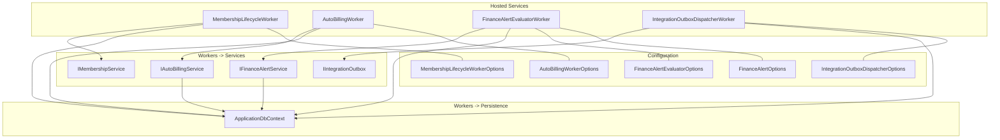
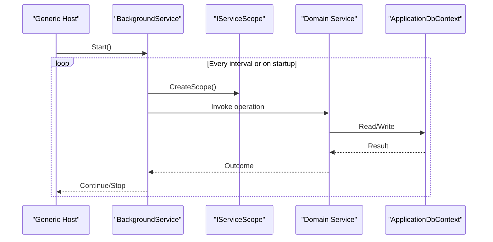
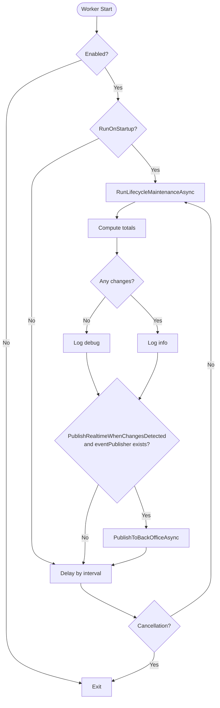
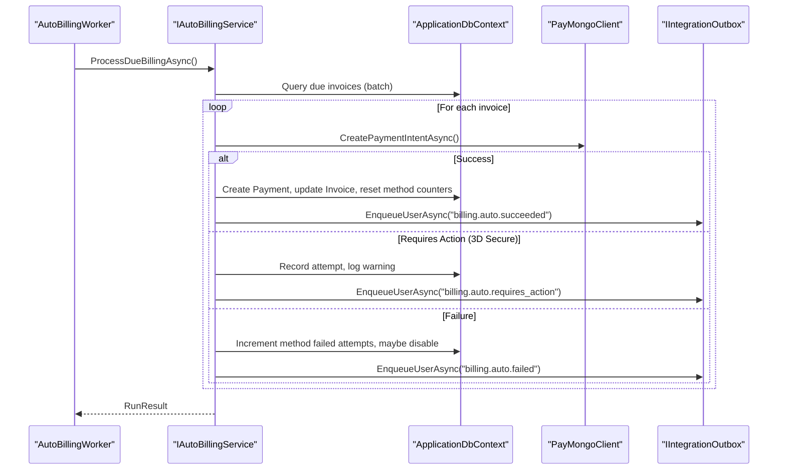
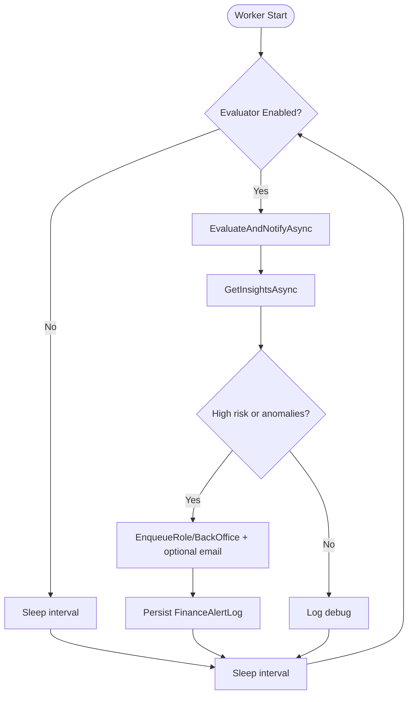
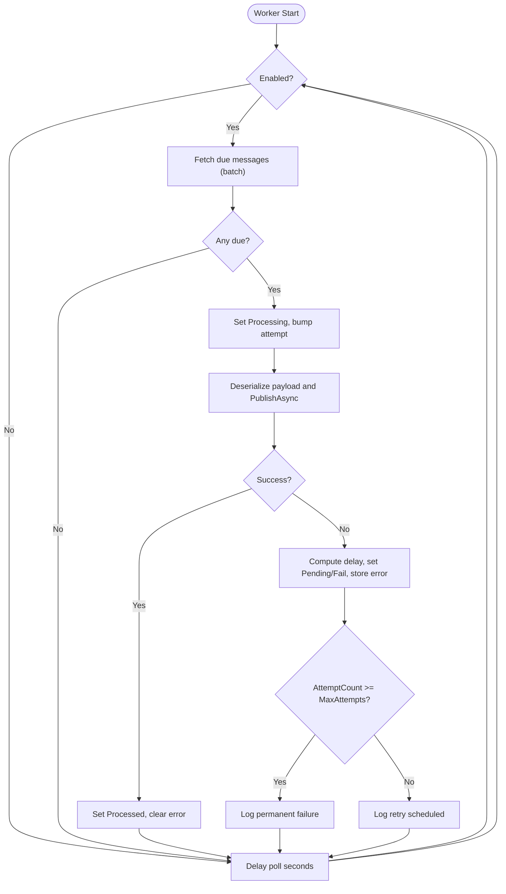
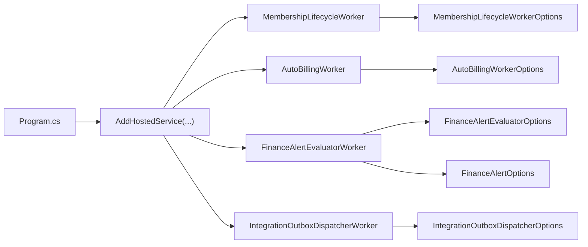

# Background Services and Workers

<cite>
**Referenced Files in This Document**
- [Program.cs](file://Program.cs)
- [MembershipLifecycleWorker.cs](file://Services/Memberships/MembershipLifecycleWorker.cs)
- [MembershipLifecycleWorkerOptions.cs](file://Services/Memberships/MembershipLifecycleWorkerOptions.cs)
- [IMembershipService.cs](file://Services/Memberships/IMembershipService.cs)
- [AutoBillingWorker.cs](file://Services/Payments/AutoBillingWorker.cs)
- [AutoBillingService.cs](file://Services/Payments/AutoBillingService.cs)
- [AutoBillingAttempt.cs](file://Models/Billing/AutoBillingAttempt.cs)
- [FinanceAlertEvaluatorWorker.cs](file://Services/Finance/FinanceAlertEvaluatorWorker.cs)
- [FinanceAlertEvaluatorOptions.cs](file://Services/Finance/FinanceAlertEvaluatorOptions.cs)
- [FinanceAlertOptions.cs](file://Services/Finance/FinanceAlertOptions.cs)
- [FinanceAlertService.cs](file://Services/Finance/FinanceAlertService.cs)
- [FinanceAlertLog.cs](file://Models/Finance/FinanceAlertLog.cs)
- [IFinanceAlertService.cs](file://Services/Finance/IFinanceAlertService.cs)
- [IntegrationOutboxDispatcherWorker.cs](file://Services/Integration/IntegrationOutboxDispatcherWorker.cs)
- [IntegrationOutboxDispatcherOptions.cs](file://Services/Integration/IntegrationOutboxDispatcherOptions.cs)
- [IntegrationOutboxService.cs](file://Services/Integration/IntegrationOutboxService.cs)
- [IntegrationOutboxMessage.cs](file://Models/Integration/IntegrationOutboxMessage.cs)
</cite>

## Table of Contents
1. [Introduction](#introduction)
2. [Project Structure](#project-structure)
3. [Core Components](#core-components)
4. [Architecture Overview](#architecture-overview)
5. [Detailed Component Analysis](#detailed-component-analysis)
6. [Dependency Analysis](#dependency-analysis)
7. [Performance Considerations](#performance-considerations)
8. [Troubleshooting Guide](#troubleshooting-guide)
9. [Conclusion](#conclusion)
10. [Appendices](#appendices)

## Introduction
This document explains the background services and workers that keep the EJC Fitness Gym system operational. It covers:
- Membership lifecycle worker: automated membership status transitions, renewal processing, and expiration handling
- Auto billing worker: scheduled invoice generation and payment processing automation
- Finance alert evaluator worker: monitoring financial thresholds and triggering alerts
- Integration outbox dispatcher worker: reliable event processing and webhook delivery
It also documents configuration, scheduling, error handling, monitoring/logging, scaling, and hosting/service discovery patterns.

## Project Structure
The workers are hosted services registered in the application’s composition root and orchestrated by the .NET Generic Host. Each worker encapsulates a specific domain concern and interacts with services and persistence layers.

**Diagram sources**
- [Program.cs:370-374](file://Program.cs#L370-L374)
- [MembershipLifecycleWorker.cs:12-20](file://Services/Memberships/MembershipLifecycleWorker.cs#L12-L20)
- [AutoBillingWorker.cs:40-48](file://Services/Payments/AutoBillingWorker.cs#L40-L48)
- [FinanceAlertEvaluatorWorker.cs:11-19](file://Services/Finance/FinanceAlertEvaluatorWorker.cs#L11-L19)
- [IntegrationOutboxDispatcherWorker.cs:16-24](file://Services/Integration/IntegrationOutboxDispatcherWorker.cs#L16-L24)
- [MembershipLifecycleWorkerOptions.cs:3-9](file://Services/Memberships/MembershipLifecycleWorkerOptions.cs#L3-L9)
- [FinanceAlertEvaluatorOptions.cs:3-8](file://Services/Finance/FinanceAlertEvaluatorOptions.cs#L3-L8)
- [FinanceAlertOptions.cs:3-12](file://Services/Finance/FinanceAlertOptions.cs#L3-L12)
- [IntegrationOutboxDispatcherOptions.cs:3-10](file://Services/Integration/IntegrationOutboxDispatcherOptions.cs#L3-L10)

**Section sources**
- [Program.cs:355-374](file://Program.cs#L355-L374)

## Core Components
- MembershipLifecycleWorker: Periodically runs lifecycle maintenance to expire subscriptions, mark overdue invoices, generate renewals, and queue reminders. Publishes real-time events when changes are detected.
- AutoBillingWorker: Periodically processes due invoices via a payment provider, tracks attempts, and enqueues notifications through the integration outbox.
- FinanceAlertEvaluatorWorker: Periodically evaluates financial metrics, sends alerts to roles/users/back office, and emails when configured.
- IntegrationOutboxDispatcherWorker: Polls the integration outbox for pending messages, publishes them to real-time channels, and retries with exponential backoff until exhausted.

**Section sources**
- [MembershipLifecycleWorker.cs:22-49](file://Services/Memberships/MembershipLifecycleWorker.cs#L22-L49)
- [AutoBillingWorker.cs:50-82](file://Services/Payments/AutoBillingWorker.cs#L50-L82)
- [FinanceAlertEvaluatorWorker.cs:21-48](file://Services/Finance/FinanceAlertEvaluatorWorker.cs#L21-L48)
- [IntegrationOutboxDispatcherWorker.cs:26-56](file://Services/Integration/IntegrationOutboxDispatcherWorker.cs#L26-L56)

## Architecture Overview
The workers are hosted as BackgroundService instances and use scoped services resolved from the DI container. They rely on:
- Options for configuration
- Domain services for business logic
- DbContext for persistence
- Real-time publisher for live updates
- Integration outbox for reliable event delivery

**Diagram sources**
- [Program.cs:370-374](file://Program.cs#L370-L374)
- [MembershipLifecycleWorker.cs:51-108](file://Services/Memberships/MembershipLifecycleWorker.cs#L51-L108)
- [AutoBillingWorker.cs:84-119](file://Services/Payments/AutoBillingWorker.cs#L84-L119)
- [FinanceAlertEvaluatorWorker.cs:50-104](file://Services/Finance/FinanceAlertEvaluatorWorker.cs#L50-L104)
- [IntegrationOutboxDispatcherWorker.cs:58-133](file://Services/Integration/IntegrationOutboxDispatcherWorker.cs#L58-L133)

## Detailed Component Analysis

### Membership Lifecycle Worker
Responsibilities:
- On startup or schedule, runs lifecycle maintenance through the membership service
- Updates expired subscriptions, overdue invoices, generates renewal invoices, and queues reminders
- Optionally publishes a real-time event to the back office when changes occur

Configuration:
- Enable/disable, run-on-startup, interval minutes, and real-time publish flag

Processing logic:
- Validates options, delays by normalized interval, executes maintenance in a scoped service, logs outcomes, and handles cancellation gracefully

**Diagram sources**
- [MembershipLifecycleWorker.cs:22-108](file://Services/Memberships/MembershipLifecycleWorker.cs#L22-L108)
- [IMembershipService.cs:23-25](file://Services/Memberships/IMembershipService.cs#L23-L25)

**Section sources**
- [MembershipLifecycleWorker.cs:22-108](file://Services/Memberships/MembershipLifecycleWorker.cs#L22-L108)
- [MembershipLifecycleWorkerOptions.cs:3-9](file://Services/Memberships/MembershipLifecycleWorkerOptions.cs#L3-L9)
- [IMembershipService.cs:23-25](file://Services/Memberships/IMembershipService.cs#L23-L25)

### Auto Billing Worker
Responsibilities:
- On startup or schedule, processes due invoices up to a configurable batch size
- Charges invoices using saved payment methods and records attempts
- Enqueues user notifications for successes, failures, and manual actions

Processing logic:
- Validates options, delays by clamped interval, executes billing run in a scoped service, logs outcomes, and handles cancellation gracefully

**Diagram sources**
- [AutoBillingWorker.cs:84-119](file://Services/Payments/AutoBillingWorker.cs#L84-L119)
- [AutoBillingService.cs:69-124](file://Services/Payments/AutoBillingService.cs#L69-L124)
- [AutoBillingService.cs:126-377](file://Services/Payments/AutoBillingService.cs#L126-L377)
- [AutoBillingAttempt.cs:8-65](file://Models/Billing/AutoBillingAttempt.cs#L8-L65)

**Section sources**
- [AutoBillingWorker.cs:50-119](file://Services/Payments/AutoBillingWorker.cs#L50-L119)
- [AutoBillingService.cs:69-377](file://Services/Payments/AutoBillingService.cs#L69-L377)
- [AutoBillingAttempt.cs:8-65](file://Models/Billing/AutoBillingAttempt.cs#L8-L65)

### Finance Alert Evaluator Worker
Responsibilities:
- On startup or schedule, evaluates financial insights and sends alerts to roles/back office and optionally emails
- Respects cooldown periods and persists alert logs with lifecycle state

Processing logic:
- Validates options, delays by normalized interval, executes evaluation and AI assistant dispatch, logs outcomes, and handles cancellation gracefully

**Diagram sources**
- [FinanceAlertEvaluatorWorker.cs:21-104](file://Services/Finance/FinanceAlertEvaluatorWorker.cs#L21-L104)
- [FinanceAlertService.cs:36-155](file://Services/Finance/FinanceAlertService.cs#L36-L155)
- [FinanceAlertOptions.cs:3-12](file://Services/Finance/FinanceAlertOptions.cs#L3-L12)
- [FinanceAlertLog.cs:13-58](file://Models/Finance/FinanceAlertLog.cs#L13-L58)

**Section sources**
- [FinanceAlertEvaluatorWorker.cs:21-104](file://Services/Finance/FinanceAlertEvaluatorWorker.cs#L21-L104)
- [FinanceAlertService.cs:36-257](file://Services/Finance/FinanceAlertService.cs#L36-L257)
- [FinanceAlertOptions.cs:3-12](file://Services/Finance/FinanceAlertOptions.cs#L3-L12)
- [FinanceAlertLog.cs:13-58](file://Models/Finance/FinanceAlertLog.cs#L13-L58)

### Integration Outbox Dispatcher Worker
Responsibilities:
- Polls the integration outbox for pending or processing messages due now
- Marks messages as processing, deserializes payload, publishes to real-time targets (back office, role, user), and updates status
- Implements exponential backoff with max attempts and logs transient vs permanent failures

Processing logic:
- Infinite loop with enabled check, clamped poll interval, fetch batch, process each with retry, and handle exhaustion

**Diagram sources**
- [IntegrationOutboxDispatcherWorker.cs:26-133](file://Services/Integration/IntegrationOutboxDispatcherWorker.cs#L26-L133)
- [IntegrationOutboxMessage.cs:5-56](file://Models/Integration/IntegrationOutboxMessage.cs#L5-L56)
- [IntegrationOutboxService.cs:18-58](file://Services/Integration/IntegrationOutboxService.cs#L18-L58)

**Section sources**
- [IntegrationOutboxDispatcherWorker.cs:26-194](file://Services/Integration/IntegrationOutboxDispatcherWorker.cs#L26-L194)
- [IntegrationOutboxDispatcherOptions.cs:3-10](file://Services/Integration/IntegrationOutboxDispatcherOptions.cs#L3-L10)
- [IntegrationOutboxMessage.cs:5-56](file://Models/Integration/IntegrationOutboxMessage.cs#L5-L56)
- [IntegrationOutboxService.cs:18-94](file://Services/Integration/IntegrationOutboxService.cs#L18-L94)

## Dependency Analysis
- Registration: Workers are registered as hosted services in the application builder.
- Scoping: Each worker creates a service scope to resolve domain services and persistence.
- Options: Each worker binds to strongly-typed configuration sections.
- Persistence: Workers and services use ApplicationDbContext for reads/writes.
- Real-time: Workers publish to a real-time publisher when configured.

**Diagram sources**
- [Program.cs:355-374](file://Program.cs#L355-L374)

**Section sources**
- [Program.cs:355-374](file://Program.cs#L355-L374)

## Performance Considerations
- Clamping intervals: Workers clamp intervals to safe ranges to prevent excessive polling or long gaps.
- Batching: Auto billing and outbox dispatcher limit batch sizes to control throughput.
- Exponential backoff: Outbox dispatcher uses capped exponential backoff to avoid thundering herds.
- Graceful shutdown: Workers honor cancellation tokens to minimize abrupt termination.
- Database queries: Workers and services use targeted queries and limits to reduce load.

[No sources needed since this section provides general guidance]

## Troubleshooting Guide
Common issues and diagnostics:
- Worker disabled: Check configuration flags for each worker’s options.
- Frequent retries: Review outbox message statuses and last errors; confirm exponential backoff behavior.
- Missing notifications: Verify integration outbox enqueue calls and real-time publisher availability.
- Auto billing failures: Inspect payment method capabilities, recent failed attempts, and gateway responses captured in attempt records.
- Financial alerts not sent: Confirm alert options (enabled, cooldown, recipients) and evaluate insight generation errors.

**Section sources**
- [IntegrationOutboxDispatcherWorker.cs:100-131](file://Services/Integration/IntegrationOutboxDispatcherWorker.cs#L100-L131)
- [AutoBillingService.cs:148-208](file://Services/Payments/AutoBillingService.cs#L148-L208)
- [FinanceAlertService.cs:157-257](file://Services/Finance/FinanceAlertService.cs#L157-L257)

## Conclusion
The background workers provide robust automation for memberships, payments, financial monitoring, and event delivery. Their design emphasizes configurability, resilience, and observability, enabling reliable operations across multiple instances.

[No sources needed since this section summarizes without analyzing specific files]

## Appendices

### Worker Configuration and Scheduling
- MembershipLifecycleWorkerOptions: Enable/disable, run-on-startup, interval minutes, and real-time publish toggle
- AutoBillingWorkerOptions: Enable/disable, interval minutes, run-on-startup, preferred hour, and max invoices per run
- FinanceAlertEvaluatorOptions: Enable/disable, run-on-startup, interval minutes
- FinanceAlertOptions: Enable/disable, email enablement, recipients, cooldown minutes, lookback/forecast windows, anomaly threshold
- IntegrationOutboxDispatcherOptions: Enable/disable, poll interval seconds, batch size, max attempts, base retry delay seconds

**Section sources**
- [MembershipLifecycleWorkerOptions.cs:3-9](file://Services/Memberships/MembershipLifecycleWorkerOptions.cs#L3-L9)
- [AutoBillingWorker.cs:5-32](file://Services/Payments/AutoBillingWorker.cs#L5-L32)
- [FinanceAlertEvaluatorOptions.cs:3-8](file://Services/Finance/FinanceAlertEvaluatorOptions.cs#L3-L8)
- [FinanceAlertOptions.cs:3-12](file://Services/Finance/FinanceAlertOptions.cs#L3-L12)
- [IntegrationOutboxDispatcherOptions.cs:3-10](file://Services/Integration/IntegrationOutboxDispatcherOptions.cs#L3-L10)

### Monitoring and Logging
- Workers log at appropriate levels (debug/info/warning/error) and include contextual details such as counts, triggers, and timestamps.
- Real-time publishing: Membership lifecycle worker can publish updates to the back office when changes are detected.
- Health checks: Application registers operational readiness and self-health checks.

**Section sources**
- [MembershipLifecycleWorker.cs:65-98](file://Services/Memberships/MembershipLifecycleWorker.cs#L65-L98)
- [AutoBillingWorker.cs:95-109](file://Services/Payments/AutoBillingWorker.cs#L95-L109)
- [FinanceAlertEvaluatorWorker.cs:74-94](file://Services/Finance/FinanceAlertEvaluatorWorker.cs#L74-L94)
- [Program.cs:386-395](file://Program.cs#L386-L395)

### Scaling and Load Balancing
- Horizontal scaling: Multiple instances can safely run the same workers; each instance operates independently with its own scheduling and retries.
- Database contention: Workers use bounded batches and clamped intervals; ensure database connection pooling and index coverage for queried tables.
- Idempotency: Integration outbox messages track status, attempt count, and next attempt time to tolerate duplicates.

**Section sources**
- [IntegrationOutboxDispatcherWorker.cs:66-73](file://Services/Integration/IntegrationOutboxDispatcherWorker.cs#L66-L73)
- [IntegrationOutboxMessage.cs:24-39](file://Models/Integration/IntegrationOutboxMessage.cs#L24-L39)

### Hosting Environment and Service Discovery
- The application configures forwarded headers, CORS, rate limiting, and health checks suitable for cloud-hosted deployments.
- Service registration occurs in the application builder; workers are added as hosted services.

**Section sources**
- [Program.cs:180-189](file://Program.cs#L180-L189)
- [Program.cs:419-437](file://Program.cs#L419-L437)
- [Program.cs:386-395](file://Program.cs#L386-L395)