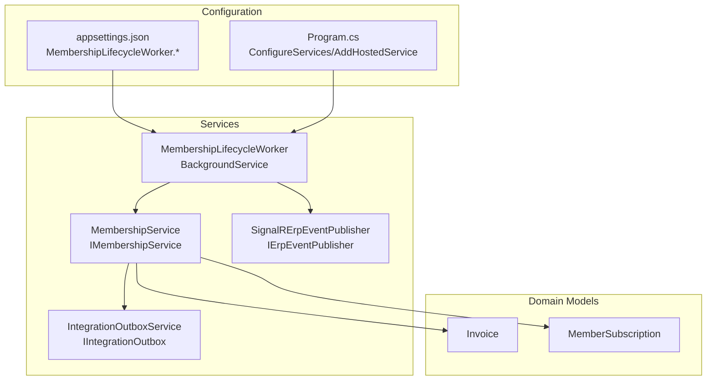
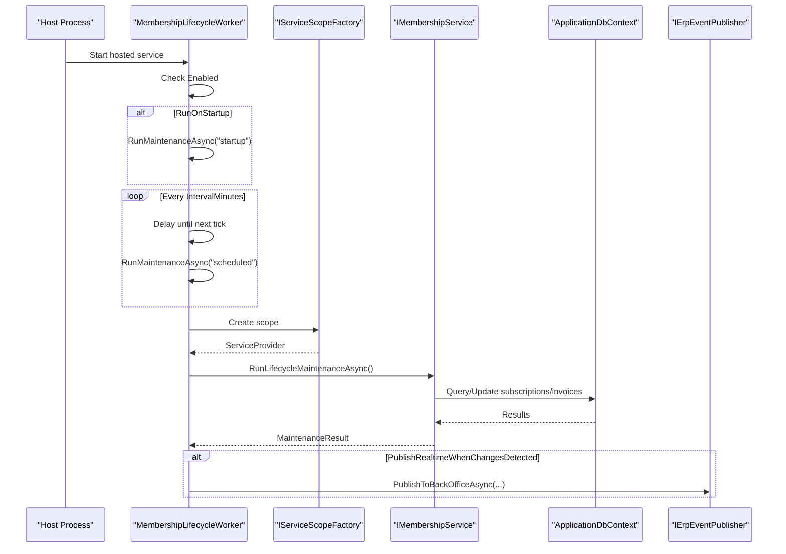
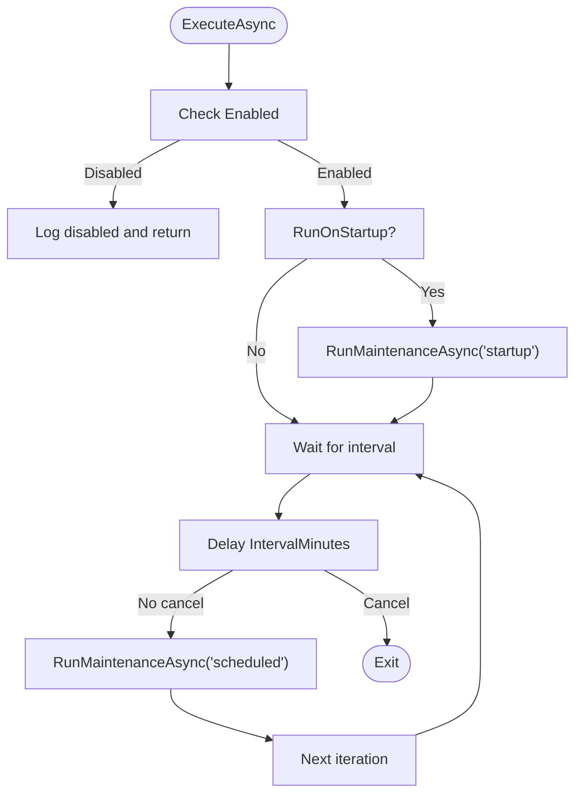
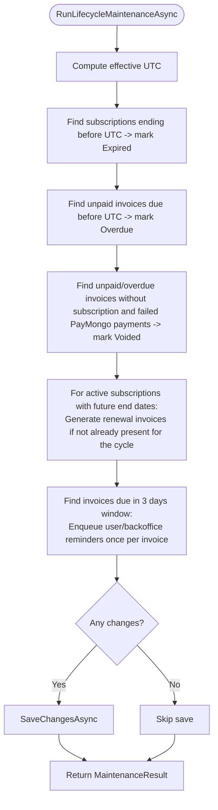
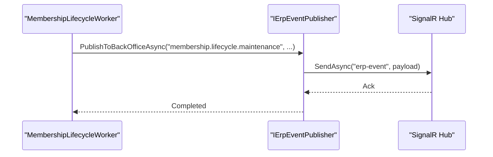
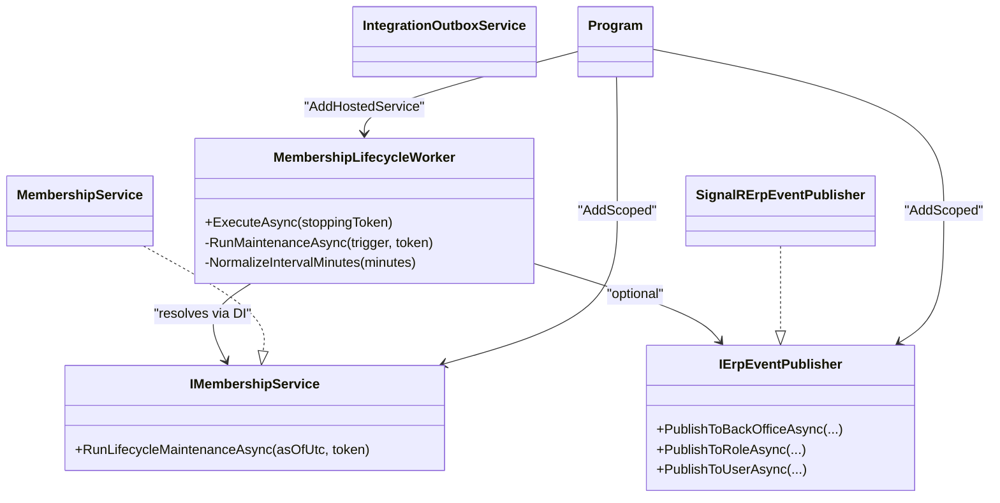

# Membership Lifecycle Worker

<cite>
**Referenced Files in This Document**
- [MembershipLifecycleWorker.cs](file://Services/Memberships/MembershipLifecycleWorker.cs)
- [MembershipLifecycleWorkerOptions.cs](file://Services/Memberships/MembershipLifecycleWorkerOptions.cs)
- [IMembershipService.cs](file://Services/Memberships/IMembershipService.cs)
- [MembershipService.cs](file://Services/Memberships/MembershipService.cs)
- [IErpEventPublisher.cs](file://Services/Realtime/IErpEventPublisher.cs)
- [SignalRErpEventPublisher.cs](file://Services/Realtime/SignalRErpEventPublisher.cs)
- [appsettings.json](file://appsettings.json)
- [Program.cs](file://Program.cs)
- [MembershipServiceBillingTests.cs](file://EJCFitnessGym.Tests/MembershipServiceBillingTests.cs)
- [IntegrationOutboxService.cs](file://Services/Integration/IntegrationOutboxService.cs)
</cite>

## Table of Contents
1. [Introduction](#introduction)
2. [Project Structure](#project-structure)
3. [Core Components](#core-components)
4. [Architecture Overview](#architecture-overview)
5. [Detailed Component Analysis](#detailed-component-analysis)
6. [Dependency Analysis](#dependency-analysis)
7. [Performance Considerations](#performance-considerations)
8. [Troubleshooting Guide](#troubleshooting-guide)
9. [Conclusion](#conclusion)
10. [Appendices](#appendices)

## Introduction
This document describes the Membership Lifecycle Worker background service responsible for automating membership status transitions, handling subscription renewals, processing overdue invoices, and managing reminders for upcoming due dates. It documents the worker’s scheduling mechanism, configuration options (enablement, run-on-startup, interval, and real-time publishing), maintenance cycle execution, integration with IMembershipService for business logic, and integration with IErpEventPublisher for real-time notifications. It also covers logging patterns, error handling, graceful shutdown, configuration examples, and monitoring approaches.

## Project Structure
The Membership Lifecycle Worker is implemented as a hosted background service and integrates with the DI container, configuration system, and real-time notification infrastructure.

**Diagram sources**
- [MembershipLifecycleWorker.cs:1-116](file://Services/Memberships/MembershipLifecycleWorker.cs#L1-L116)
- [MembershipService.cs:1-597](file://Services/Memberships/MembershipService.cs#L1-L597)
- [SignalRErpEventPublisher.cs:1-101](file://Services/Realtime/SignalRErpEventPublisher.cs#L1-L101)
- [IntegrationOutboxService.cs:1-94](file://Services/Integration/IntegrationOutboxService.cs#L1-L94)
- [appsettings.json:70-75](file://appsettings.json#L70-L75)
- [Program.cs:357-380](file://Program.cs#L357-L380)

**Section sources**
- [MembershipLifecycleWorker.cs:1-116](file://Services/Memberships/MembershipLifecycleWorker.cs#L1-L116)
- [appsettings.json:70-75](file://appsettings.json#L70-L75)
- [Program.cs:357-380](file://Program.cs#L357-L380)

## Core Components
- MembershipLifecycleWorker: Hosted background service that schedules and executes lifecycle maintenance.
- MembershipService: Implements lifecycle maintenance logic (expire subscriptions, mark invoices overdue, generate renewal invoices, queue reminders).
- IMembershipService: Defines the contract for membership lifecycle operations.
- IErpEventPublisher and SignalRErpEventPublisher: Real-time event publishing to connected clients.
- IntegrationOutboxService: Queues outbound events/messages for asynchronous delivery.
- Configuration: MembershipLifecycleWorkerOptions and appsettings.json keys.

Key responsibilities:
- Periodic execution with configurable intervals and optional startup run.
- Business logic encapsulated in IMembershipService.RunLifecycleMaintenanceAsync.
- Optional real-time notifications via IErpEventPublisher.
- Robust logging for startup vs scheduled runs and error conditions.
- Graceful shutdown handling via cancellation tokens.

**Section sources**
- [MembershipLifecycleWorker.cs:22-116](file://Services/Memberships/MembershipLifecycleWorker.cs#L22-L116)
- [IMembershipService.cs:23-25](file://Services/Memberships/IMembershipService.cs#L23-L25)
- [MembershipService.cs:248-460](file://Services/Memberships/MembershipService.cs#L248-L460)
- [IErpEventPublisher.cs:1-26](file://Services/Realtime/IErpEventPublisher.cs#L1-L26)
- [SignalRErpEventPublisher.cs:6-101](file://Services/Realtime/SignalRErpEventPublisher.cs#L6-L101)
- [IntegrationOutboxService.cs:7-94](file://Services/Integration/IntegrationOutboxService.cs#L7-L94)
- [MembershipLifecycleWorkerOptions.cs:1-11](file://Services/Memberships/MembershipLifecycleWorkerOptions.cs#L1-L11)
- [appsettings.json:70-75](file://appsettings.json#L70-L75)

## Architecture Overview
The Membership Lifecycle Worker orchestrates lifecycle maintenance through a loop that respects configuration and cancellation. It delegates business logic to IMembershipService and optionally publishes real-time updates.

**Diagram sources**
- [MembershipLifecycleWorker.cs:22-116](file://Services/Memberships/MembershipLifecycleWorker.cs#L22-L116)
- [MembershipService.cs:248-460](file://Services/Memberships/MembershipService.cs#L248-L460)
- [IErpEventPublisher.cs:5-24](file://Services/Realtime/IErpEventPublisher.cs#L5-L24)
- [SignalRErpEventPublisher.cs:19-90](file://Services/Realtime/SignalRErpEventPublisher.cs#L19-L90)

## Detailed Component Analysis

### MembershipLifecycleWorker
- Purpose: Background service that periodically runs membership lifecycle maintenance.
- Scheduling:
  - Checks Enabled flag; if disabled, logs and exits.
  - Optionally runs immediately on startup if RunOnStartup is true.
  - Repeats on a normalized interval clamp between 5 and 24 hours.
- Execution:
  - Creates a scoped service provider to resolve IMembershipService and IErpEventPublisher.
  - Calls RunLifecycleMaintenanceAsync and aggregates counts.
  - Logs debug when no changes; logs informational summary when changes occur.
  - Conditionally publishes real-time event if PublishRealtimeWhenChangesDetected is true.
- Error handling:
  - Catches OperationCanceledException during delay/shutdown gracefully.
  - Catches other exceptions and logs error with trigger context.
- Graceful shutdown:
  - Uses cancellation token to exit loops and suppress noisy logs on shutdown.

**Diagram sources**
- [MembershipLifecycleWorker.cs:22-116](file://Services/Memberships/MembershipLifecycleWorker.cs#L22-L116)

**Section sources**
- [MembershipLifecycleWorker.cs:22-116](file://Services/Memberships/MembershipLifecycleWorker.cs#L22-L116)

### MembershipLifecycleWorkerOptions
- Enabled: Enables or disables the worker.
- RunOnStartup: Runs maintenance immediately on service start.
- IntervalMinutes: Polling interval in minutes, normalized to [5, 1440].
- PublishRealtimeWhenChangesDetected: Publishes real-time events when changes are detected.

**Section sources**
- [MembershipLifecycleWorkerOptions.cs:1-11](file://Services/Memberships/MembershipLifecycleWorkerOptions.cs#L1-L11)
- [appsettings.json:70-75](file://appsettings.json#L70-L75)

### IMembershipService and MembershipService
- IMembershipService defines:
  - GetLatestSubscriptionAsync
  - GetSubscriptionHistoryAsync
  - ActivateSubscriptionAsync
  - ResumeSubscriptionAsync
  - RunLifecycleMaintenanceAsync
- MembershipService.RunLifecycleMaintenanceAsync performs:
  - Expire subscriptions whose end date is in the past.
  - Mark unpaid invoices overdue if due date is in the past.
  - Void failed PayMongo checkout invoices with no successful payments.
  - Generate renewal invoices for active subscriptions due for renewal (deduplicated by cycle key).
  - Queue 3-day billing reminders for invoices due within the next day (only once per invoice).
  - Save changes only when there are actual modifications.
  - Returns a MaintenanceResult with counts and effective UTC timestamp.

**Diagram sources**
- [MembershipService.cs:248-460](file://Services/Memberships/MembershipService.cs#L248-L460)

**Section sources**
- [IMembershipService.cs:23-25](file://Services/Memberships/IMembershipService.cs#L23-L25)
- [MembershipService.cs:248-460](file://Services/Memberships/MembershipService.cs#L248-L460)

### Real-time Notifications via IErpEventPublisher
- MembershipLifecycleWorker conditionally publishes a membership lifecycle maintenance event to the back office when changes are detected.
- SignalRErpEventPublisher sends the event to SignalR clients subscribed to the appropriate groups.

**Diagram sources**
- [MembershipLifecycleWorker.cs:83-98](file://Services/Memberships/MembershipLifecycleWorker.cs#L83-L98)
- [SignalRErpEventPublisher.cs:19-90](file://Services/Realtime/SignalRErpEventPublisher.cs#L19-L90)

**Section sources**
- [IErpEventPublisher.cs:5-24](file://Services/Realtime/IErpEventPublisher.cs#L5-L24)
- [SignalRErpEventPublisher.cs:6-101](file://Services/Realtime/SignalRErpEventPublisher.cs#L6-L101)

### Integration with IntegrationOutboxService
- During lifecycle maintenance, reminders are queued for both the user and the back office via IntegrationOutboxService.
- This enables asynchronous delivery and idempotent processing elsewhere in the system.

**Section sources**
- [MembershipService.cs:405-437](file://Services/Memberships/MembershipService.cs#L405-L437)
- [IntegrationOutboxService.cs:18-58](file://Services/Integration/IntegrationOutboxService.cs#L18-L58)

## Dependency Analysis
- DI Registration:
  - IMembershipService is registered as MembershipService.
  - IErpEventPublisher is registered as SignalRErpEventPublisher.
  - MembershipLifecycleWorker is registered as a hosted service.
  - MembershipLifecycleWorkerOptions is bound from configuration.
- Coupling:
  - Worker depends on IMembershipService and IErpEventPublisher.
  - MembershipService depends on ApplicationDbContext and optional IIntegrationOutbox/IEmailSender.
  - Real-time publisher depends on SignalR hub context.

**Diagram sources**
- [MembershipLifecycleWorker.cs:6-20](file://Services/Memberships/MembershipLifecycleWorker.cs#L6-L20)
- [IMembershipService.cs:5-26](file://Services/Memberships/IMembershipService.cs#L5-L26)
- [MembershipService.cs:9-26](file://Services/Memberships/MembershipService.cs#L9-L26)
- [IErpEventPublisher.cs:3-24](file://Services/Realtime/IErpEventPublisher.cs#L3-L24)
- [SignalRErpEventPublisher.cs:6-17](file://Services/Realtime/SignalRErpEventPublisher.cs#L6-L17)
- [Program.cs:366-380](file://Program.cs#L366-L380)

**Section sources**
- [Program.cs:357-380](file://Program.cs#L357-L380)

## Performance Considerations
- Interval normalization: The worker clamps the interval to a minimum of 5 minutes and a maximum of 1440 minutes (24 hours) to prevent excessive or minimal polling.
- Minimal writes: Changes are saved only when there are actual modifications, reducing database overhead.
- Deduplication: Renewal invoice generation is deduplicated by a cycle key built from subscription ID and due date ticks.
- Reminder deduplication: A marker is appended to invoice notes to avoid queuing reminders multiple times for the same due date.
- Batched queries: The service fetches collections in bulk and applies in-memory checks to reduce round trips.

[No sources needed since this section provides general guidance]

## Troubleshooting Guide
- Worker disabled:
  - Verify Enabled is true in configuration.
  - Check logs for “disabled” message.
- No changes observed:
  - Startup logs show “completed with no changes” when no subscriptions/expirations/invoices are affected.
  - Scheduled logs show similar messages after delays.
- Real-time notifications not received:
  - Ensure PublishRealtimeWhenChangesDetected is true.
  - Confirm IErpEventPublisher is registered and SignalR hub is mapped.
- Errors during maintenance:
  - Worker logs errors with the trigger context; inspect logs around the scheduled time.
- Graceful shutdown:
  - On shutdown, the worker exits the loop gracefully without noisy logs.

Monitoring approaches:
- Application logs: Filter by MembershipLifecycleWorker and membership lifecycle maintenance entries.
- Health checks: Use operational health checks to monitor readiness and liveness.
- Database metrics: Track changes to MemberSubscriptions and Invoices around maintenance windows.
- Real-time dashboards: Subscribe to ERP events to observe membership lifecycle updates.

**Section sources**
- [MembershipLifecycleWorker.cs:65-107](file://Services/Memberships/MembershipLifecycleWorker.cs#L65-L107)
- [appsettings.json:70-75](file://appsettings.json#L70-L75)
- [Program.cs:386-395](file://Program.cs#L386-L395)

## Conclusion
The Membership Lifecycle Worker provides a robust, configurable, and resilient automation layer for membership lifecycle operations. It integrates cleanly with the DI container, configuration system, and real-time notification infrastructure. Its design emphasizes safety (graceful shutdown, normalized intervals), observability (logging patterns, health checks), and correctness (deduplication, conditional saves).

[No sources needed since this section summarizes without analyzing specific files]

## Appendices

### Configuration Examples
- MembershipLifecycleWorker section in appsettings.json:
  - Enabled: Enable/disable the worker.
  - RunOnStartup: Run maintenance on startup.
  - IntervalMinutes: Polling interval in minutes (normalized to 5–1440).
  - PublishRealtimeWhenChangesDetected: Publish real-time events when changes are detected.

**Section sources**
- [appsettings.json:70-75](file://appsettings.json#L70-L75)

### Logging Patterns
- Startup vs scheduled:
  - Startup runs log with trigger “startup”.
  - Scheduled runs log with trigger “scheduled”.
- Change detection:
  - Debug logs when no changes are detected.
  - Informational logs with counts when changes occur.
- Errors:
  - Error logs include the trigger and exception details.

**Section sources**
- [MembershipLifecycleWorker.cs:65-107](file://Services/Memberships/MembershipLifecycleWorker.cs#L65-L107)

### Tests and Behavior Validation
- Renewal invoice creation and deduplication.
- 3-day reminder queuing only once per invoice.
- Voiding failed PayMongo checkout invoices when no successful payments exist.

**Section sources**
- [MembershipServiceBillingTests.cs:13-146](file://EJCFitnessGym.Tests/MembershipServiceBillingTests.cs#L13-L146)