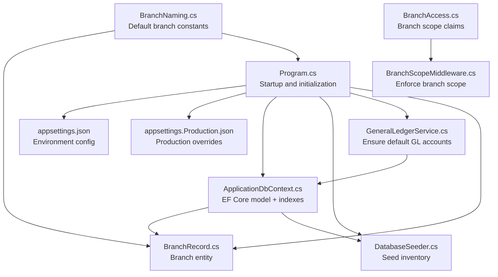
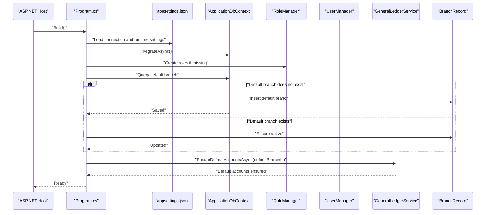
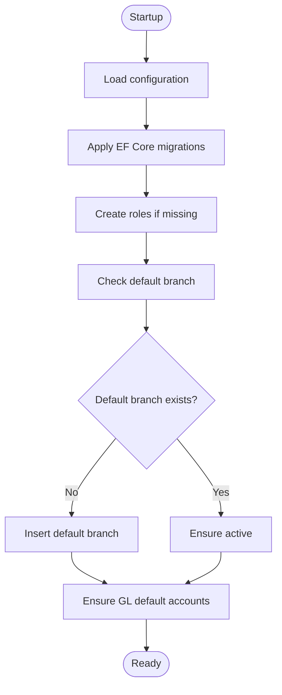
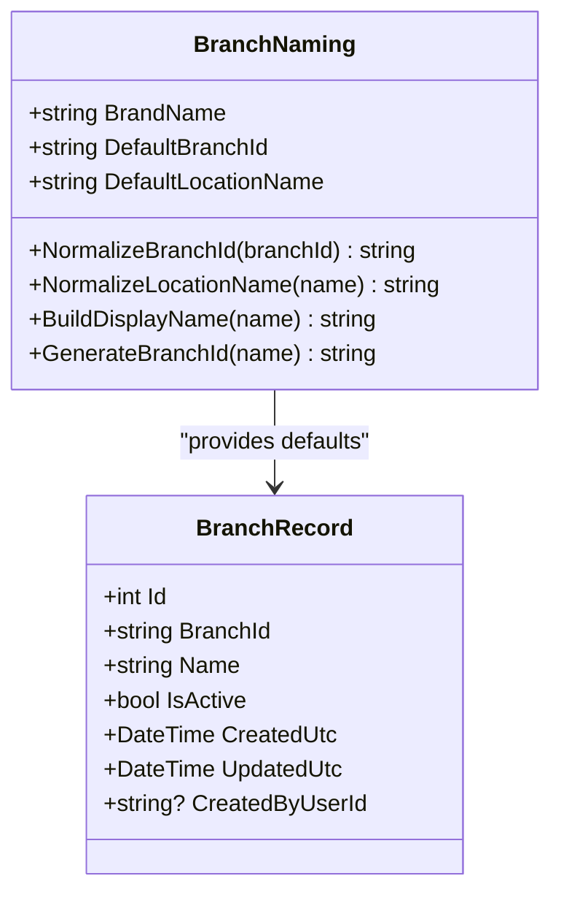
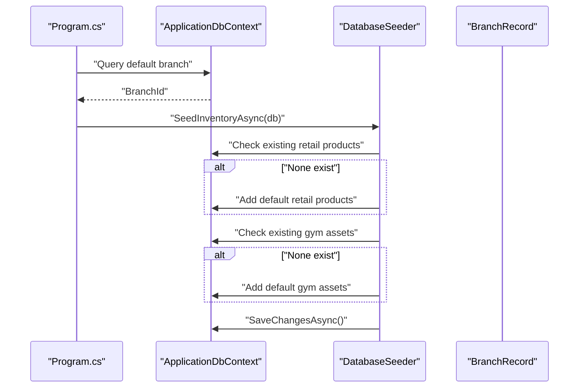
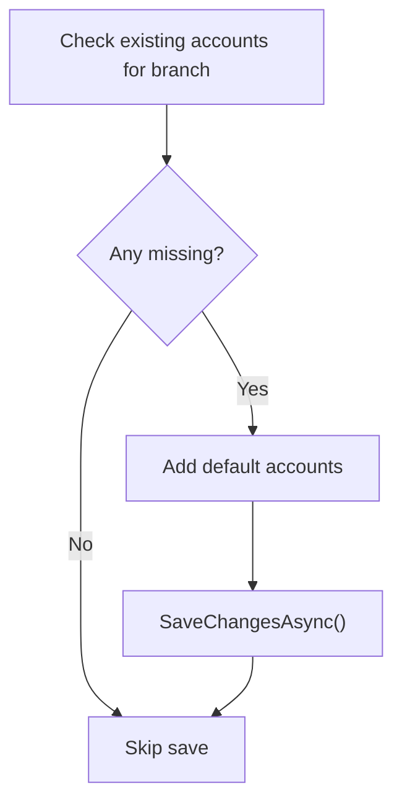
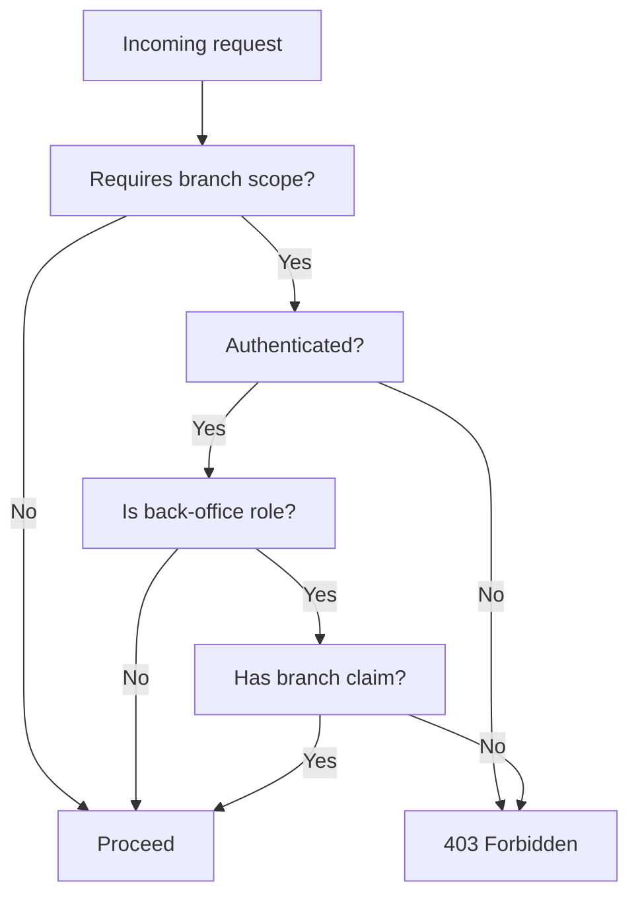
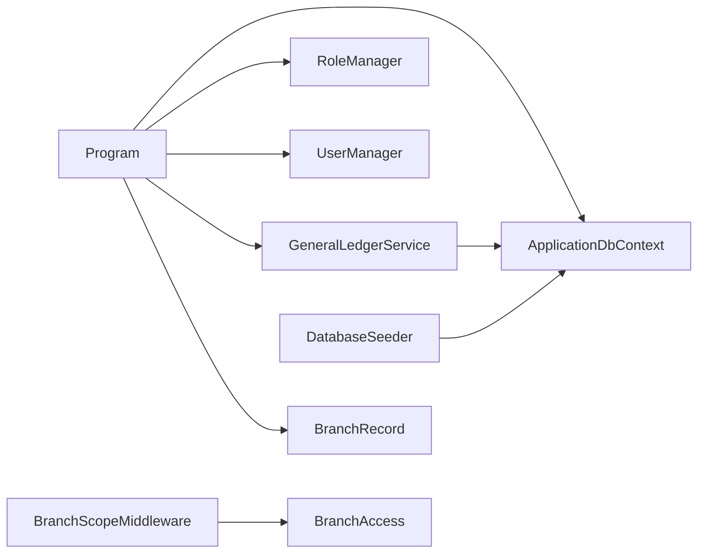

# Data Seeding and System Initialization

<cite>
**Referenced Files in This Document**
- [Program.cs](file://Program.cs)
- [ApplicationDbContext.cs](file://Data/ApplicationDbContext.cs)
- [DatabaseSeeder.cs](file://Data/DatabaseSeeder.cs)
- [appsettings.json](file://appsettings.json)
- [appsettings.Production.json](file://appsettings.Production.json)
- [BranchRecord.cs](file://Models/Admin/BranchRecord.cs)
- [BranchNaming.cs](file://Models/Admin/BranchNaming.cs)
- [GeneralLedgerService.cs](file://Services/Finance/GeneralLedgerService.cs)
- [BranchAccess.cs](file://Security/BranchAccess.cs)
- [BranchScopeMiddleware.cs](file://Security/BranchScopeMiddleware.cs)
</cite>

## Table of Contents
1. [Introduction](#introduction)
2. [Project Structure](#project-structure)
3. [Core Components](#core-components)
4. [Architecture Overview](#architecture-overview)
5. [Detailed Component Analysis](#detailed-component-analysis)
6. [Dependency Analysis](#dependency-analysis)
7. [Performance Considerations](#performance-considerations)
8. [Troubleshooting Guide](#troubleshooting-guide)
9. [Conclusion](#conclusion)
10. [Appendices](#appendices)

## Introduction
This document explains how the EJC Fitness Gym system seeds and initializes data at startup. It covers the default branch registry, basic inventory assets and retail products, and the initialization of roles and branch-scoped access. It also documents the relationship between the seeding process and application startup configuration, validation and error handling, retry-like idempotency, and operational guidance for development and production. Finally, it outlines best practices for managing seed data updates and ensuring consistency across deployments.

## Project Structure
The seeding and initialization logic spans several areas:
- Application startup and orchestration
- Database context and EF Core model configuration
- Seed data providers for inventory
- Default branch and naming utilities
- Financial general ledger defaults
- Role-based access and branch scoping enforcement

**Diagram sources**
- [Program.cs:710-800](file://Program.cs#L710-L800)
- [appsettings.json:1-126](file://appsettings.json#L1-L126)
- [appsettings.Production.json:1-33](file://appsettings.Production.json#L1-L33)
- [ApplicationDbContext.cs:12-414](file://Data/ApplicationDbContext.cs#L12-L414)
- [DatabaseSeeder.cs:8-116](file://Data/DatabaseSeeder.cs#L8-L116)
- [GeneralLedgerService.cs:47-91](file://Services/Finance/GeneralLedgerService.cs#L47-L91)
- [BranchRecord.cs:3-19](file://Models/Admin/BranchRecord.cs#L3-L19)
- [BranchNaming.cs:5-69](file://Models/Admin/BranchNaming.cs#L5-L69)
- [BranchAccess.cs:5-31](file://Security/BranchAccess.cs#L5-L31)
- [BranchScopeMiddleware.cs:5-73](file://Security/BranchScopeMiddleware.cs#L5-L73)

**Section sources**
- [Program.cs:710-800](file://Program.cs#L710-L800)
- [appsettings.json:1-126](file://appsettings.json#L1-L126)
- [appsettings.Production.json:1-33](file://appsettings.Production.json#L1-L33)
- [ApplicationDbContext.cs:12-414](file://Data/ApplicationDbContext.cs#L12-L414)

## Core Components
- Startup initialization sequence validates configuration, runs migrations, creates roles, ensures the default branch exists, and seeds general ledger defaults.
- DatabaseSeeder provides initial inventory and gym equipment assets for the default branch.
- BranchNaming defines the default branch identifier and normalization helpers.
- GeneralLedgerService ensures default chart-of-accounts exist per branch.
- BranchAccess and BranchScopeMiddleware enforce branch-scoped access for back-office roles.

**Section sources**
- [Program.cs:710-800](file://Program.cs#L710-L800)
- [DatabaseSeeder.cs:8-116](file://Data/DatabaseSeeder.cs#L8-L116)
- [BranchNaming.cs:5-69](file://Models/Admin/BranchNaming.cs#L5-L69)
- [GeneralLedgerService.cs:47-91](file://Services/Finance/GeneralLedgerService.cs#L47-L91)
- [BranchAccess.cs:5-31](file://Security/BranchAccess.cs#L5-L31)
- [BranchScopeMiddleware.cs:5-73](file://Security/BranchScopeMiddleware.cs#L5-L73)

## Architecture Overview
The initialization flow integrates configuration loading, EF Core migrations, role provisioning, branch registration, and optional financial defaults. The flow is idempotent where possible to support repeatable deployments.

**Diagram sources**
- [Program.cs:710-800](file://Program.cs#L710-L800)
- [GeneralLedgerService.cs:47-91](file://Services/Finance/GeneralLedgerService.cs#L47-L91)
- [BranchRecord.cs:3-19](file://Models/Admin/BranchRecord.cs#L3-L19)

## Detailed Component Analysis

### Startup Initialization Sequence
- Loads configuration and environment-specific settings.
- Applies EF Core migrations.
- Creates Identity roles if absent.
- Ensures the default branch record exists and is active.
- Seeds general ledger default accounts for the default branch.
- Enforces branch-scoped access via middleware and claims.

**Diagram sources**
- [Program.cs:710-800](file://Program.cs#L710-L800)
- [GeneralLedgerService.cs:47-91](file://Services/Finance/GeneralLedgerService.cs#L47-L91)

**Section sources**
- [Program.cs:710-800](file://Program.cs#L710-L800)

### Default Branch Registry and Naming
- Default branch identifier and name are defined centrally.
- Normalization utilities ensure consistent branch identifiers and display names.
- The initializer inserts the default branch if it does not exist.

**Diagram sources**
- [BranchNaming.cs:5-69](file://Models/Admin/BranchNaming.cs#L5-L69)
- [BranchRecord.cs:3-19](file://Models/Admin/BranchRecord.cs#L3-L19)

**Section sources**
- [BranchNaming.cs:5-69](file://Models/Admin/BranchNaming.cs#L5-L69)
- [BranchRecord.cs:3-19](file://Models/Admin/BranchRecord.cs#L3-L19)
- [Program.cs:744-764](file://Program.cs#L744-L764)

### Inventory and Equipment Seed Data
- Seeds retail products and gym equipment assets for the default branch.
- Uses branch identifier normalization to target the default branch.
- Saves changes after seeding.

**Diagram sources**
- [Program.cs:710-800](file://Program.cs#L710-L800)
- [DatabaseSeeder.cs:8-116](file://Data/DatabaseSeeder.cs#L8-L116)
- [BranchRecord.cs:3-19](file://Models/Admin/BranchRecord.cs#L3-L19)

**Section sources**
- [DatabaseSeeder.cs:8-116](file://Data/DatabaseSeeder.cs#L8-L116)
- [Program.cs:710-800](file://Program.cs#L710-L800)

### General Ledger Defaults
- Ensures default chart-of-accounts exist per branch.
- Adds missing accounts and persists only when needed.
- Used during initialization to prepare GL features.

**Diagram sources**
- [GeneralLedgerService.cs:47-91](file://Services/Finance/GeneralLedgerService.cs#L47-L91)

**Section sources**
- [GeneralLedgerService.cs:47-91](file://Services/Finance/GeneralLedgerService.cs#L47-L91)
- [Program.cs:766-775](file://Program.cs#L766-L775)

### Branch Scope Enforcement
- Claims-based branch scoping for back-office roles.
- Middleware enforces branch assignment for protected routes.
- SuperAdmin bypasses branch scope checks.

**Diagram sources**
- [BranchScopeMiddleware.cs:5-73](file://Security/BranchScopeMiddleware.cs#L5-L73)
- [BranchAccess.cs:5-31](file://Security/BranchAccess.cs#L5-L31)

**Section sources**
- [BranchScopeMiddleware.cs:5-73](file://Security/BranchScopeMiddleware.cs#L5-L73)
- [BranchAccess.cs:5-31](file://Security/BranchAccess.cs#L5-L31)

## Dependency Analysis
- Program orchestrates migrations, role creation, branch registry, and GL defaults.
- DatabaseSeeder depends on the default branch identifier and DbContext.
- GeneralLedgerService depends on ApplicationDbContext and branch scoping.
- BranchAccess and BranchScopeMiddleware depend on ASP.NET Core authentication and authorization.

**Diagram sources**
- [Program.cs:710-800](file://Program.cs#L710-L800)
- [ApplicationDbContext.cs:12-414](file://Data/ApplicationDbContext.cs#L12-L414)
- [DatabaseSeeder.cs:8-116](file://Data/DatabaseSeeder.cs#L8-L116)
- [GeneralLedgerService.cs:47-91](file://Services/Finance/GeneralLedgerService.cs#L47-L91)
- [BranchScopeMiddleware.cs:5-73](file://Security/BranchScopeMiddleware.cs#L5-L73)
- [BranchAccess.cs:5-31](file://Security/BranchAccess.cs#L5-L31)

**Section sources**
- [Program.cs:710-800](file://Program.cs#L710-L800)
- [ApplicationDbContext.cs:12-414](file://Data/ApplicationDbContext.cs#L12-L414)

## Performance Considerations
- Idempotent seeding: queries check for existence before inserting to avoid duplicates.
- Minimal writes: GL defaults are only saved when adding new accounts.
- Batched saves: inventory seeding performs a single save after adds.
- Migration-first approach reduces runtime errors by ensuring schema readiness.

[No sources needed since this section provides general guidance]

## Troubleshooting Guide
- Migration failures at startup: The host throws a clear error when migrations fail. Verify connection strings and permissions.
- Missing JWT signing key in production: Startup enforces a valid signing key; configure Jwt:SigningKey in production.
- Missing PayMongo webhook secret outside development: Configure PayMongo:WebhookSecret when enabled.
- Branch scope violations: Back-office requests without a branch claim receive 403; ensure user claims include the branch.
- GL defaults not applied: Ensure migrations are applied; GL defaults seeding logs a warning if features are not yet enabled.

**Section sources**
- [Program.cs:720-727](file://Program.cs#L720-L727)
- [Program.cs:92-105](file://Program.cs#L92-L105)
- [Program.cs:194-197](file://Program.cs#L194-L197)
- [Program.cs:770-775](file://Program.cs#L770-L775)
- [BranchScopeMiddleware.cs:35-53](file://Security/BranchScopeMiddleware.cs#L35-L53)

## Conclusion
The system’s initialization process is designed to be robust and idempotent. It establishes roles, registers a default branch, seeds essential inventory and equipment, and prepares general ledger defaults. Branch-scoped access is enforced through claims and middleware. Configuration is environment-aware, with development-friendly defaults and strict production requirements. Following the best practices below will help maintain consistency and reliability across deployments.

[No sources needed since this section summarizes without analyzing specific files]

## Appendices

### Seed Data Structure and Relationships
- Default branch: Central branch record with a fixed identifier and name.
- Inventory: Retail products with pricing, stock, and reorder levels.
- Equipment: Gym assets with cost, useful life, and quantity.
- General Ledger: Default chart-of-accounts seeded per branch.

**Section sources**
- [BranchRecord.cs:3-19](file://Models/Admin/BranchRecord.cs#L3-L19)
- [DatabaseSeeder.cs:10-116](file://Data/DatabaseSeeder.cs#L10-L116)
- [GeneralLedgerService.cs:26-36](file://Services/Finance/GeneralLedgerService.cs#L26-L36)

### Environment-Specific Initialization
- Development: LocalDB connection, relaxed JWT and rate limiting, developer pages enabled.
- Production: Strict security settings, explicit secrets, and hardened logging.

**Section sources**
- [appsettings.json:1-126](file://appsettings.json#L1-L126)
- [appsettings.Production.json:1-33](file://appsettings.Production.json#L1-L33)

### Best Practices for Seed Data Updates
- Keep seed data minimal and deterministic; avoid personal data.
- Use idempotency checks before inserts; rely on uniqueness constraints.
- Version control seed scripts and migrations; document rationale for changes.
- Prefer migrations for structural changes; use seeders for small reference data.
- Validate seed data after migrations; monitor warnings and exceptions.
- For multi-branch deployments, ensure branch identifiers are normalized consistently.

[No sources needed since this section provides general guidance]