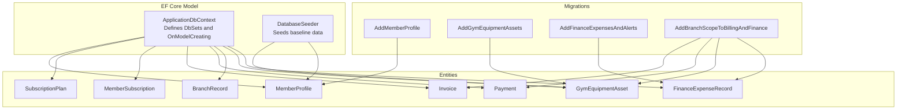
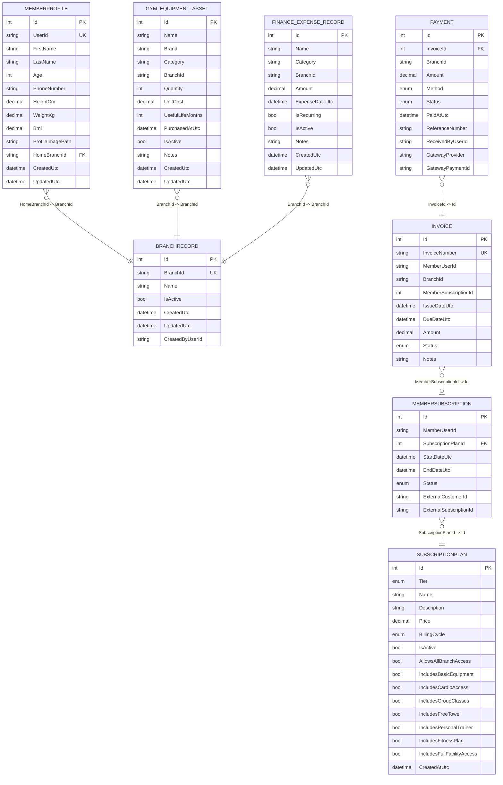
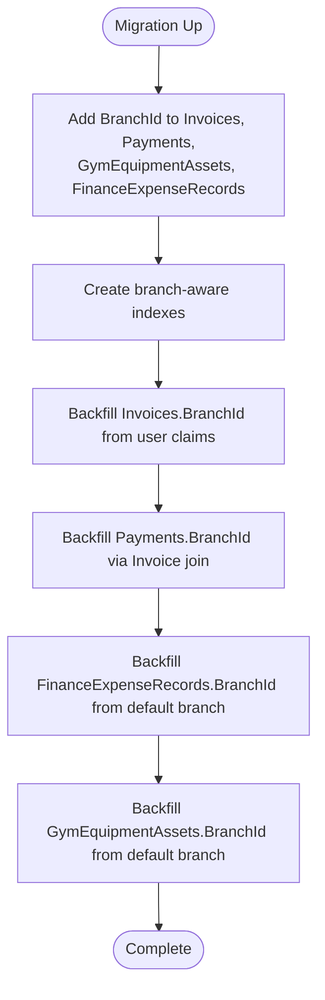
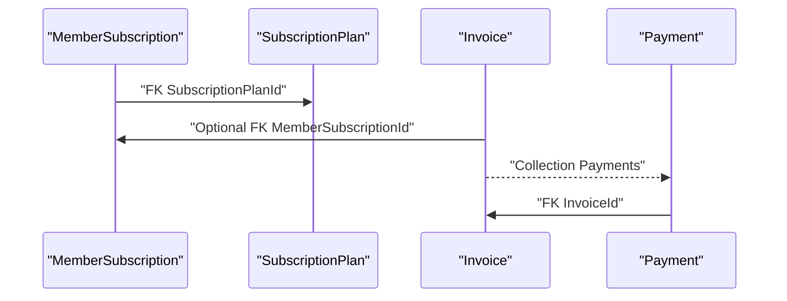
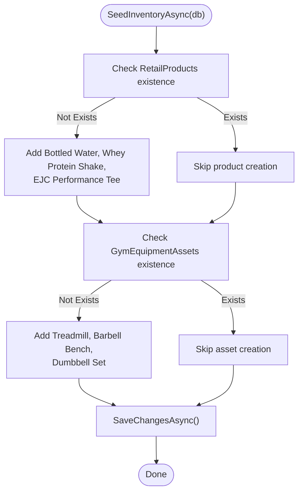
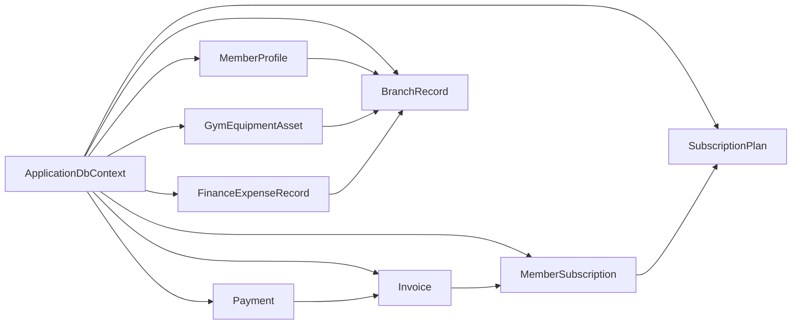

# Database Design

<cite>
**Referenced Files in This Document**
- [ApplicationDbContext.cs](file://Data/ApplicationDbContext.cs)
- [DatabaseSeeder.cs](file://Data/DatabaseSeeder.cs)
- [20260218030505_AddBranchScopeToBillingAndFinance.cs](file://Data/Migrations/20260218030505_AddBranchScopeToBillingAndFinance.cs)
- [20260211170305_AddMemberProfile.cs](file://Data/Migrations/20260211170305_AddMemberProfile.cs)
- [20260215104214_AddGymEquipmentAssets.cs](file://Data/Migrations/20260215104214_AddGymEquipmentAssets.cs)
- [20260215105822_AddFinanceExpensesAndAlerts.cs](file://Data/Migrations/20260215105822_AddFinanceExpensesAndAlerts.cs)
- [MemberProfile.cs](file://Models/MemberProfile.cs)
- [SubscriptionPlan.cs](file://Models/Billing/SubscriptionPlan.cs)
- [Invoice.cs](file://Models/Billing/Invoice.cs)
- [Payment.cs](file://Models/Billing/Payment.cs)
- [MemberSubscription.cs](file://Models/Billing/MemberSubscription.cs)
- [GymEquipmentAsset.cs](file://Models/Finance/GymEquipmentAsset.cs)
- [FinanceExpenseRecord.cs](file://Models/Finance/FinanceExpenseRecord.cs)
- [BranchRecord.cs](file://Models/Admin/BranchRecord.cs)
</cite>

## Table of Contents
1. [Introduction](#introduction)
2. [Project Structure](#project-structure)
3. [Core Components](#core-components)
4. [Architecture Overview](#architecture-overview)
5. [Detailed Component Analysis](#detailed-component-analysis)
6. [Dependency Analysis](#dependency-analysis)
7. [Performance Considerations](#performance-considerations)
8. [Troubleshooting Guide](#troubleshooting-guide)
9. [Conclusion](#conclusion)
10. [Appendices](#appendices)

## Introduction
This document describes the database design and data model for the EJC Fitness Gym system. It covers entity relationships among members, subscriptions, invoices, payments, staff, branches, and inventory; primary and foreign key relationships; indexes and constraints; branch-scoped data model and isolation; field definitions for core entities; schema evolution via migrations; seeding of initial data; validation rules and referential integrity; and performance considerations.

## Project Structure
The database layer is implemented using Entity Framework Core with a central application context that defines entity sets and their configuration. Migrations define the evolving schema, while a seeder initializes baseline inventory and equipment assets.



**Diagram sources**
- [ApplicationDbContext.cs:43-411](file://Data/ApplicationDbContext.cs#L43-L411)
- [DatabaseSeeder.cs:8-115](file://Data/DatabaseSeeder.cs#L8-L115)
- [20260211170305_AddMemberProfile.cs:12-46](file://Data/Migrations/20260211170305_AddMemberProfile.cs#L12-L46)
- [20260215104214_AddGymEquipmentAssets.cs:12-48](file://Data/Migrations/20260215104214_AddGymEquipmentAssets.cs#L12-L48)
- [20260215105822_AddFinanceExpensesAndAlerts.cs:12-75](file://Data/Migrations/20260215105822_AddFinanceExpensesAndAlerts.cs#L12-L75)
- [20260218030505_AddBranchScopeToBillingAndFinance.cs:11-146](file://Data/Migrations/20260218030505_AddBranchScopeToBillingAndFinance.cs#L11-L146)

**Section sources**
- [ApplicationDbContext.cs:12-42](file://Data/ApplicationDbContext.cs#L12-L42)
- [ApplicationDbContext.cs:43-411](file://Data/ApplicationDbContext.cs#L43-L411)
- [DatabaseSeeder.cs:8-115](file://Data/DatabaseSeeder.cs#L8-L115)

## Core Components
This section outlines the core entities and their roles in the system, focusing on membership billing, finance, equipment, and branch administration.

- MemberProfile: Stores personal and health metrics linked to a user account and home branch.
- SubscriptionPlan: Defines membership plans with pricing and feature entitlements.
- MemberSubscription: Tracks individual memberships tied to a plan and member.
- Invoice: Represents billing events with amount, due date, and status, optionally linked to a subscription.
- Payment: Records payment transactions against invoices, including gateway metadata.
- BranchRecord: Registry of gyms/branches with identifiers and activity flags.
- GymEquipmentAsset: Asset inventory scoped per branch with cost and lifecycle attributes.
- FinanceExpenseRecord: Operating expense entries scoped per branch with category and recurrence.

**Section sources**
- [MemberProfile.cs:5-44](file://Models/MemberProfile.cs#L5-L44)
- [SubscriptionPlan.cs:5-53](file://Models/Billing/SubscriptionPlan.cs#L5-L53)
- [MemberSubscription.cs:5-30](file://Models/Billing/MemberSubscription.cs#L5-L30)
- [Invoice.cs:5-39](file://Models/Billing/Invoice.cs#L5-L39)
- [Payment.cs:5-38](file://Models/Billing/Payment.cs#L5-L38)
- [BranchRecord.cs:3-20](file://Models/Admin/BranchRecord.cs#L3-L20)
- [GymEquipmentAsset.cs:5-44](file://Models/Finance/GymEquipmentAsset.cs#L5-L44)
- [FinanceExpenseRecord.cs:5-37](file://Models/Finance/FinanceExpenseRecord.cs#L5-L37)

## Architecture Overview
The database architecture centers around a branch-scoped model to enforce data isolation across multiple gym locations. Billing and finance entities are extended with a BranchId field and supporting indexes. The application context configures precision for monetary fields, uniqueness constraints for gateway identifiers, and cascading rules where appropriate.



**Diagram sources**
- [ApplicationDbContext.cs:47-411](file://Data/ApplicationDbContext.cs#L47-L411)
- [MemberProfile.cs:7-43](file://Models/MemberProfile.cs#L7-L43)
- [SubscriptionPlan.cs:7-51](file://Models/Billing/SubscriptionPlan.cs#L7-L51)
- [MemberSubscription.cs:7-28](file://Models/Billing/MemberSubscription.cs#L7-L28)
- [Invoice.cs:7-37](file://Models/Billing/Invoice.cs#L7-L37)
- [Payment.cs:7-36](file://Models/Billing/Payment.cs#L7-L36)
- [GymEquipmentAsset.cs:7-42](file://Models/Finance/GymEquipmentAsset.cs#L7-L42)
- [FinanceExpenseRecord.cs:7-35](file://Models/Finance/FinanceExpenseRecord.cs#L7-L35)
- [BranchRecord.cs:5-18](file://Models/Admin/BranchRecord.cs#L5-L18)

## Detailed Component Analysis

### Branch-Scoped Data Model and Isolation
- BranchId is introduced on Billing (Invoices, Payments) and Finance (GymEquipmentAssets, FinanceExpenseRecords) entities via a dedicated migration.
- Indexes are added to support branch-aware queries on due dates, statuses, paid timestamps, and expense categories.
- Data seeding and migration scripts backfill BranchId for existing records using user claims and default branch selection.



**Diagram sources**
- [20260218030505_AddBranchScopeToBillingAndFinance.cs:11-146](file://Data/Migrations/20260218030505_AddBranchScopeToBillingAndFinance.cs#L11-L146)

**Section sources**
- [20260218030505_AddBranchScopeToBillingAndFinance.cs:11-146](file://Data/Migrations/20260218030505_AddBranchScopeToBillingAndFinance.cs#L11-L146)
- [ApplicationDbContext.cs:55-85](file://Data/ApplicationDbContext.cs#L55-L85)
- [ApplicationDbContext.cs:128-154](file://Data/ApplicationDbContext.cs#L128-L154)

### Entity Relationships and Referential Integrity
- MemberSubscription references SubscriptionPlan with a restrict delete behavior to prevent accidental plan removal.
- Invoice optionally references MemberSubscription; cascade deletion is configured on the Payments collection.
- Payment belongs to Invoice; unique indexes on gateway provider fields ensure idempotency and deduplication.
- MemberProfile links to BranchRecord via HomeBranchId; uniqueness enforced on UserId.



**Diagram sources**
- [ApplicationDbContext.cs:93-103](file://Data/ApplicationDbContext.cs#L93-L103)
- [ApplicationDbContext.cs:87-91](file://Data/ApplicationDbContext.cs#L87-L91)
- [ApplicationDbContext.cs:67-75](file://Data/ApplicationDbContext.cs#L67-L75)

**Section sources**
- [ApplicationDbContext.cs:93-103](file://Data/ApplicationDbContext.cs#L93-L103)
- [ApplicationDbContext.cs:87-91](file://Data/ApplicationDbContext.cs#L87-L91)
- [ApplicationDbContext.cs:67-75](file://Data/ApplicationDbContext.cs#L67-L75)

### Field Definitions for Core Entities
- MemberProfile
  - Keys: Id (PK)
  - Identifiers: UserId (unique), HomeBranchId
  - Personal: FirstName, LastName, Age, PhoneNumber, ProfileImagePath
  - Health: HeightCm, WeightKg, Bmi (precision 5,2)
  - Timestamps: CreatedUtc, UpdatedUtc
  - Constraints: MaxLengths, Range validations on numeric fields

- SubscriptionPlan
  - Keys: Id (PK)
  - Attributes: Tier, Name, Description, Price (precision 18,2), BillingCycle, IsActive
  - Entitlement flags: AllowsAllBranchAccess, IncludesBasicEquipment, etc.
  - Timestamp: CreatedAtUtc

- MemberSubscription
  - Keys: Id (PK)
  - Identifiers: MemberUserId, SubscriptionPlanId
  - Period: StartDateUtc, EndDateUtc
  - Status: Status
  - External IDs: ExternalCustomerId, ExternalSubscriptionId

- Invoice
  - Keys: Id (PK)
  - Identifiers: InvoiceNumber (unique), MemberUserId, BranchId
  - Amount: Amount (precision 18,2)
  - Timeline: IssueDateUtc, DueDateUtc
  - Status: Status
  - Optional FK: MemberSubscriptionId
  - Notes: Notes

- Payment
  - Keys: Id (PK)
  - Identifiers: InvoiceId (FK), BranchId
  - Amount: Amount (precision 18,2)
  - Method/Status: Method, Status
  - Timestamp: PaidAtUtc
  - Gateway: GatewayProvider, GatewayPaymentId
  - Reference: ReferenceNumber
  - Personnel: ReceivedByUserId

- GymEquipmentAsset
  - Keys: Id (PK)
  - Identifiers: Name, Brand, Category, BranchId
  - Quantities: Quantity, UnitCost (precision 18,2), UsefulLifeMonths
  - Lifecycle: PurchasedAtUtc, IsActive, Notes
  - Timestamps: CreatedUtc, UpdatedUtc

- FinanceExpenseRecord
  - Keys: Id (PK)
  - Identifiers: Name, Category, BranchId
  - Amount: Amount (precision 18,2)
  - Date/Flags: ExpenseDateUtc, IsRecurring, IsActive
  - Notes: Notes
  - Timestamps: CreatedUtc, UpdatedUtc

**Section sources**
- [MemberProfile.cs:5-44](file://Models/MemberProfile.cs#L5-L44)
- [SubscriptionPlan.cs:5-53](file://Models/Billing/SubscriptionPlan.cs#L5-L53)
- [MemberSubscription.cs:5-30](file://Models/Billing/MemberSubscription.cs#L5-L30)
- [Invoice.cs:5-39](file://Models/Billing/Invoice.cs#L5-L39)
- [Payment.cs:5-38](file://Models/Billing/Payment.cs#L5-L38)
- [GymEquipmentAsset.cs:5-44](file://Models/Finance/GymEquipmentAsset.cs#L5-L44)
- [FinanceExpenseRecord.cs:5-37](file://Models/Finance/FinanceExpenseRecord.cs#L5-L37)

### Database Schema Evolution Through Migrations
- Initial entities: MemberProfile, GymEquipmentAssets, FinanceExpenseRecords introduced via dedicated migrations.
- Branch scoping: AddBranchScopeToBillingAndFinance introduces BranchId and indexes, backfills historical data, and maintains referential integrity.

```mermaid
timeline
title Schema Evolution
section Initial Entities
2026-02-11_17:03:05
"AddMemberProfile.migration"
"Creates MemberProfiles table with unique UserId index"
2026-02-15_10:42:14
"AddGymEquipmentAssets.migration"
"Creates GymEquipmentAssets table with composite index"
2026-02-15_10:58:22
"AddFinanceExpensesAndAlerts.migration"
"Creates FinanceExpenseRecords and FinanceAlertLogs tables"
section Branch Scoping
2026-02-18_03:05:05
"AddBranchScopeToBillingAndFinance.migration"
"Adds BranchId to Invoices, Payments, Assets, Expenses"
"Backfills BranchId from claims/default branch"
"Creates branch-aware indexes"
```

**Diagram sources**
- [20260211170305_AddMemberProfile.cs:12-46](file://Data/Migrations/20260211170305_AddMemberProfile.cs#L12-L46)
- [20260215104214_AddGymEquipmentAssets.cs:12-48](file://Data/Migrations/20260215104214_AddGymEquipmentAssets.cs#L12-L48)
- [20260215105822_AddFinanceExpensesAndAlerts.cs:12-75](file://Data/Migrations/20260215105822_AddFinanceExpensesAndAlerts.cs#L12-L75)
- [20260218030505_AddBranchScopeToBillingAndFinance.cs:11-146](file://Data/Migrations/20260218030505_AddBranchScopeToBillingAndFinance.cs#L11-L146)

**Section sources**
- [20260211170305_AddMemberProfile.cs:12-46](file://Data/Migrations/20260211170305_AddMemberProfile.cs#L12-L46)
- [20260215104214_AddGymEquipmentAssets.cs:12-48](file://Data/Migrations/20260215104214_AddGymEquipmentAssets.cs#L12-L48)
- [20260215105822_AddFinanceExpensesAndAlerts.cs:12-75](file://Data/Migrations/20260215105822_AddFinanceExpensesAndAlerts.cs#L12-L75)
- [20260218030505_AddBranchScopeToBillingAndFinance.cs:11-146](file://Data/Migrations/20260218030505_AddBranchScopeToBillingAndFinance.cs#L11-L146)

### Seeding Process for Initial Data
- DatabaseSeeder seeds baseline retail products and gym equipment assets under a default branch identifier.
- It ensures idempotency by checking existence before insertion and persists changes.



**Diagram sources**
- [DatabaseSeeder.cs:10-115](file://Data/DatabaseSeeder.cs#L10-L115)

**Section sources**
- [DatabaseSeeder.cs:10-115](file://Data/DatabaseSeeder.cs#L10-L115)

## Dependency Analysis
The application context orchestrates entity configuration and indexes. Migrations define schema changes and data backfills. Entities depend on each other through foreign keys, and branch scoping is enforced via shared BranchId fields and branch-aware indexes.



**Diagram sources**
- [ApplicationDbContext.cs:19-41](file://Data/ApplicationDbContext.cs#L19-L41)
- [ApplicationDbContext.cs:93-103](file://Data/ApplicationDbContext.cs#L93-L103)
- [ApplicationDbContext.cs:87-91](file://Data/ApplicationDbContext.cs#L87-L91)

**Section sources**
- [ApplicationDbContext.cs:19-41](file://Data/ApplicationDbContext.cs#L19-L41)
- [ApplicationDbContext.cs:93-103](file://Data/ApplicationDbContext.cs#L93-L103)
- [ApplicationDbContext.cs:87-91](file://Data/ApplicationDbContext.cs#L87-L91)

## Performance Considerations
- Monetary precision: Price, Amount, UnitCost, and related fields use decimal precision (18,2) to avoid floating-point errors in financial computations.
- Unique constraints: Payment gateway provider+reference and provider+gateway ID combinations prevent duplicates and enable fast lookups.
- Branch-aware indexes: Composite indexes on BranchId with status/due date, paid timestamps, and expense date/category improve filtering and reporting performance.
- Cascade and restrict deletes: Cascades on Payments and restrict on MemberSubscription ensure referential integrity while controlling deletion behavior.
- Index coverage: Unique indexes on InvoiceNumber and BranchRecord.BranchId, and filtered unique indexes on gateway fields reduce write conflicts and improve lookup reliability.

**Section sources**
- [ApplicationDbContext.cs:47-49](file://Data/ApplicationDbContext.cs#L47-L49)
- [ApplicationDbContext.cs:51-61](file://Data/ApplicationDbContext.cs#L51-L61)
- [ApplicationDbContext.cs:67-75](file://Data/ApplicationDbContext.cs#L67-L75)
- [ApplicationDbContext.cs:77-85](file://Data/ApplicationDbContext.cs#L77-L85)
- [ApplicationDbContext.cs:128-154](file://Data/ApplicationDbContext.cs#L128-L154)
- [ApplicationDbContext.cs:162-187](file://Data/ApplicationDbContext.cs#L162-L187)
- [ApplicationDbContext.cs:212-224](file://Data/ApplicationDbContext.cs#L212-L224)
- [ApplicationDbContext.cs:225-242](file://Data/ApplicationDbContext.cs#L225-L242)
- [ApplicationDbContext.cs:244-268](file://Data/ApplicationDbContext.cs#L244-L268)
- [ApplicationDbContext.cs:290-309](file://Data/ApplicationDbContext.cs#L290-L309)
- [ApplicationDbContext.cs:311-334](file://Data/ApplicationDbContext.cs#L311-L334)
- [ApplicationDbContext.cs:335-353](file://Data/ApplicationDbContext.cs#L335-L353)
- [ApplicationDbContext.cs:355-374](file://Data/ApplicationDbContext.cs#L355-L374)
- [ApplicationDbContext.cs:375-384](file://Data/ApplicationDbContext.cs#L375-L384)
- [ApplicationDbContext.cs:386-410](file://Data/ApplicationDbContext.cs#L386-L410)

## Troubleshooting Guide
- Duplicate payment detection: Use unique indexes on gateway provider+reference number and provider+gateway ID to detect and prevent duplicate payments.
- Branch scoping issues: Ensure BranchId is populated for all Billing and Finance entities; re-run migration if backfill did not apply.
- Invoice lookup failures: Verify unique InvoiceNumber and branch-aware filters when querying unpaid or overdue invoices.
- Equipment and expense visibility: Confirm branch-aware indexes are present and that BranchId is set for existing records.
- Validation errors: Review model-level validations for lengths, ranges, and required fields before inserts/updates.

**Section sources**
- [ApplicationDbContext.cs:67-75](file://Data/ApplicationDbContext.cs#L67-L75)
- [ApplicationDbContext.cs:77-85](file://Data/ApplicationDbContext.cs#L77-L85)
- [ApplicationDbContext.cs:128-154](file://Data/ApplicationDbContext.cs#L128-L154)
- [20260218030505_AddBranchScopeToBillingAndFinance.cs:61-109](file://Data/Migrations/20260218030505_AddBranchScopeToBillingAndFinance.cs#L61-L109)

## Conclusion
The EJC Fitness Gym database design leverages a branch-scoped model to isolate data across multiple gym locations, with robust indexes and constraints ensuring integrity and performance. The schema evolution through migrations and the seeding process establish a solid foundation for membership billing, finance, equipment, and inventory operations.

## Appendices
- Additional entities and indexes exist for integration outbox, inbound webhook receipts, replacement requests, member segment snapshots, retention actions, retail products, supply requests, saved payment methods, and auto billing attempts, all configured in the application context and supported by migrations.