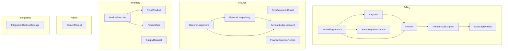
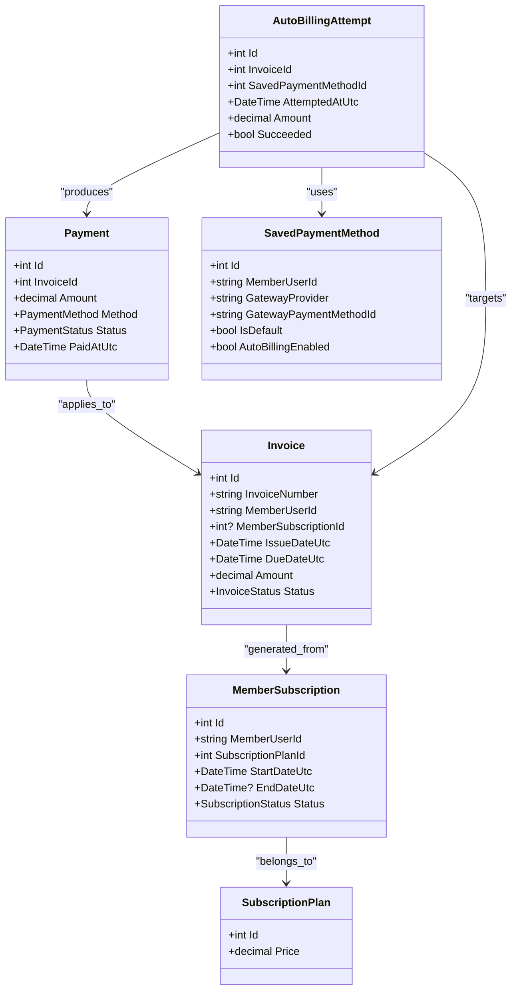
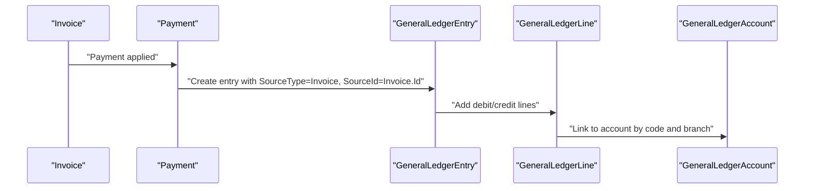
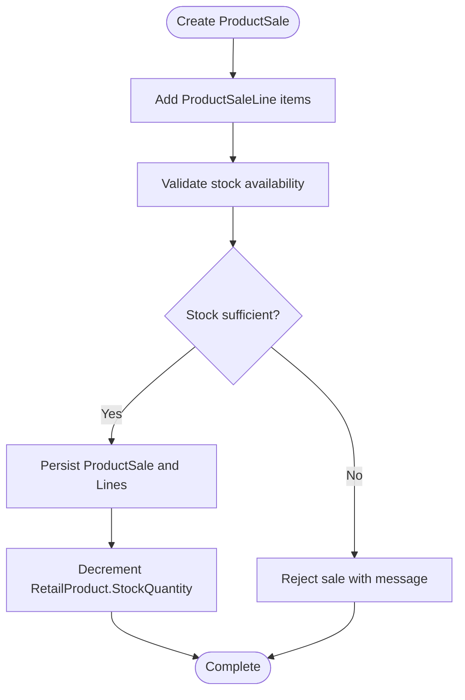
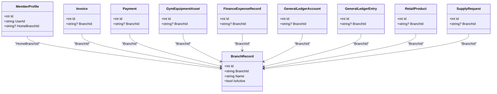
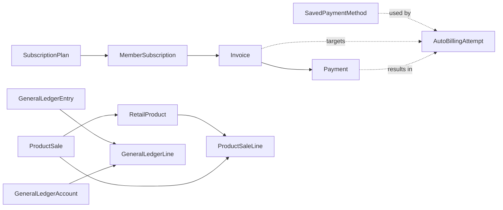

# Entity Relationships and Schema

<cite>
**Referenced Files in This Document**
- [ApplicationDbContext.cs](file://Data/ApplicationDbContext.cs)
- [Invoice.cs](file://Models/Billing/Invoice.cs)
- [MemberSubscription.cs](file://Models/Billing/MemberSubscription.cs)
- [SubscriptionPlan.cs](file://Models/Billing/SubscriptionPlan.cs)
- [Payment.cs](file://Models/Billing/Payment.cs)
- [SavedPaymentMethod.cs](file://Models/Billing/SavedPaymentMethod.cs)
- [AutoBillingAttempt.cs](file://Models/Billing/AutoBillingAttempt.cs)
- [MemberProfile.cs](file://Models/MemberProfile.cs)
- [GymEquipmentAsset.cs](file://Models/Finance/GymEquipmentAsset.cs)
- [FinanceExpenseRecord.cs](file://Models/Finance/FinanceExpenseRecord.cs)
- [GeneralLedgerAccount.cs](file://Models/Finance/GeneralLedgerAccount.cs)
- [GeneralLedgerEntry.cs](file://Models/Finance/GeneralLedgerEntry.cs)
- [BranchRecord.cs](file://Models/Admin/BranchRecord.cs)
- [RetailProduct.cs](file://Models/Inventory/RetailProduct.cs)
- [ProductSale.cs](file://Models/Inventory/ProductSale.cs)
- [SupplyRequest.cs](file://Models/Inventory/SupplyRequest.cs)
- [IntegrationOutboxMessage.cs](file://Models/Integration/IntegrationOutboxMessage.cs)
</cite>

## Table of Contents
1. [Introduction](#introduction)
2. [Project Structure](#project-structure)
3. [Core Components](#core-components)
4. [Architecture Overview](#architecture-overview)
5. [Detailed Component Analysis](#detailed-component-analysis)
6. [Dependency Analysis](#dependency-analysis)
7. [Performance Considerations](#performance-considerations)
8. [Troubleshooting Guide](#troubleshooting-guide)
9. [Conclusion](#conclusion)

## Introduction
This document describes the EJC Fitness Gym database schema with a focus on entity relationships, primary and foreign keys, cascade behaviors, referential integrity constraints, branch-scoped design, billing domain flows, financial transactions, and inventory management. It also documents validation rules, business constraints, and data consistency mechanisms enforced via model definitions and EF Core fluent configurations.

## Project Structure
The schema spans multiple domains:
- Billing: MemberSubscription, SubscriptionPlan, Invoice, Payment, SavedPaymentMethod, AutoBillingAttempt
- Finance: GymEquipmentAsset, FinanceExpenseRecord, GeneralLedgerAccount, GeneralLedgerEntry
- Inventory: RetailProduct, ProductSale, ProductSaleLine, SupplyRequest
- Administration: BranchRecord
- Integration: IntegrationOutboxMessage



**Diagram sources**
- [ApplicationDbContext.cs:43-411](file://Data/ApplicationDbContext.cs#L43-L411)
- [Invoice.cs:5-38](file://Models/Billing/Invoice.cs#L5-L38)
- [MemberSubscription.cs:5-29](file://Models/Billing/MemberSubscription.cs#L5-L29)
- [SubscriptionPlan.cs:5-53](file://Models/Billing/SubscriptionPlan.cs#L5-L53)
- [Payment.cs:5-38](file://Models/Billing/Payment.cs#L5-L38)
- [SavedPaymentMethod.cs:8-88](file://Models/Billing/SavedPaymentMethod.cs#L8-L88)
- [AutoBillingAttempt.cs:8-66](file://Models/Billing/AutoBillingAttempt.cs#L8-L66)
- [GymEquipmentAsset.cs:5-44](file://Models/Finance/GymEquipmentAsset.cs#L5-L44)
- [FinanceExpenseRecord.cs:5-37](file://Models/Finance/FinanceExpenseRecord.cs#L5-L37)
- [GeneralLedgerAccount.cs:14-39](file://Models/Finance/GeneralLedgerAccount.cs#L14-L39)
- [GeneralLedgerEntry.cs:5-58](file://Models/Finance/GeneralLedgerEntry.cs#L5-L58)
- [RetailProduct.cs:5-42](file://Models/Inventory/RetailProduct.cs#L5-L42)
- [ProductSale.cs:5-81](file://Models/Inventory/ProductSale.cs#L5-L81)
- [SupplyRequest.cs:5-79](file://Models/Inventory/SupplyRequest.cs#L5-L79)
- [BranchRecord.cs:3-20](file://Models/Admin/BranchRecord.cs#L3-L20)
- [IntegrationOutboxMessage.cs:5-57](file://Models/Integration/IntegrationOutboxMessage.cs#L5-L57)

**Section sources**
- [ApplicationDbContext.cs:19-42](file://Data/ApplicationDbContext.cs#L19-L42)
- [Invoice.cs:5-38](file://Models/Billing/Invoice.cs#L5-L38)
- [MemberSubscription.cs:5-29](file://Models/Billing/MemberSubscription.cs#L5-L29)
- [SubscriptionPlan.cs:5-53](file://Models/Billing/SubscriptionPlan.cs#L5-L53)
- [Payment.cs:5-38](file://Models/Billing/Payment.cs#L5-L38)
- [SavedPaymentMethod.cs:8-88](file://Models/Billing/SavedPaymentMethod.cs#L8-L88)
- [AutoBillingAttempt.cs:8-66](file://Models/Billing/AutoBillingAttempt.cs#L8-L66)
- [GymEquipmentAsset.cs:5-44](file://Models/Finance/GymEquipmentAsset.cs#L5-L44)
- [FinanceExpenseRecord.cs:5-37](file://Models/Finance/FinanceExpenseRecord.cs#L5-L37)
- [GeneralLedgerAccount.cs:14-39](file://Models/Finance/GeneralLedgerAccount.cs#L14-L39)
- [GeneralLedgerEntry.cs:5-58](file://Models/Finance/GeneralLedgerEntry.cs#L5-L58)
- [RetailProduct.cs:5-42](file://Models/Inventory/RetailProduct.cs#L5-L42)
- [ProductSale.cs:5-81](file://Models/Inventory/ProductSale.cs#L5-L81)
- [SupplyRequest.cs:5-79](file://Models/Inventory/SupplyRequest.cs#L5-L79)
- [BranchRecord.cs:3-20](file://Models/Admin/BranchRecord.cs#L3-L20)
- [IntegrationOutboxMessage.cs:5-57](file://Models/Integration/IntegrationOutboxMessage.cs#L5-L57)

## Core Components
This section outlines primary keys, foreign keys, cascade behaviors, and constraints for the core entities.

- MemberProfile
  - Primary key: Id
  - Unique index: UserId
  - Additional indexes: HomeBranchId
  - Validation: Length and range attributes on multiple fields
  - Business constraint: HomeBranchId scoped to branch identifier length

- MemberSubscription
  - Primary key: Id
  - Foreign key: SubscriptionPlanId -> SubscriptionPlan.Id
  - Cascade: Restrict on plan deletion
  - Validation: Required MemberUserId, date ranges, status enum
  - Business constraint: External identifiers optional per provider

- SubscriptionPlan
  - Primary key: Id
  - Precision: Price stored with 18 digits, scale 2
  - Validation: String lengths, numeric ranges, booleans for included features
  - Business constraint: Tier, cycle, and feature flags define plan capabilities

- Invoice
  - Primary key: Id
  - Unique indexes: InvoiceNumber, BranchId+Status+DueDateUtc
  - Foreign keys: MemberSubscriptionId -> MemberSubscription.Id (Set null on delete)
  - Precision: Amount with 18 digits, scale 2
  - Validation: Required fields, amount range, status enum, optional BranchId
  - Business constraint: IssueDateUtc defaults to current UTC

- Payment
  - Primary key: Id
  - Unique indexes: (GatewayProvider, ReferenceNumber), (GatewayProvider, GatewayPaymentId)
  - Foreign key: InvoiceId -> Invoice.Id
  - Precision: Amount with 18 digits, scale 2
  - Validation: Amount range, method/status enums, optional BranchId
  - Business constraint: PaidAtUtc defaults to current UTC

- SavedPaymentMethod
  - Primary key: Id
  - Unique indexes: MemberUserId+IsDefault+IsActive, GatewayProvider+GatewayPaymentMethodId
  - Validation: Required fields, string lengths, booleans, counters
  - Business constraint: AutoBillingEnabled flag and failure counters

- AutoBillingAttempt
  - Primary key: Id
  - Foreign keys: InvoiceId -> Invoice.Id, SavedPaymentMethodId -> SavedPaymentMethod.Id, PaymentId -> Payment.Id
  - Precision: Amount with 18 digits, scale 2
  - Validation: Amount range, timestamps, optional gateway identifiers
  - Cascade: No action on parent deletions

- GymEquipmentAsset
  - Primary key: Id
  - Precision: UnitCost with 18 digits, scale 2
  - Indexes: (Name, Brand, Category), (BranchId, Category, Name)
  - Validation: String lengths, quantity and useful life ranges, booleans
  - Business constraint: BranchId scope and activity flag

- FinanceExpenseRecord
  - Primary key: Id
  - Precision: Amount with 18 digits, scale 2
  - Indexes: ExpenseDateUtc+Category, BranchId+ExpenseDateUtc+Category
  - Validation: String lengths, amount range, booleans
  - Business constraint: BranchId scope and recurring flag

- GeneralLedgerAccount
  - Primary key: Id
  - Unique index: BranchId+Code
  - Indexes: BranchId+AccountType+IsActive
  - Validation: String lengths, account type enum, booleans
  - Business constraint: BranchId scope and uniqueness of account code per branch

- GeneralLedgerEntry
  - Primary key: Id
  - Unique index: EntryNumber
  - Indexes: BranchId+EntryDateUtc, BranchId+SourceType+SourceId
  - Validation: String lengths, dates, booleans
  - Business constraint: SourceType/SourceId pair for origin tracking

- GeneralLedgerLine
  - Primary key: Id
  - Foreign keys: EntryId -> GeneralLedgerEntry.Id (Cascade), AccountId -> GeneralLedgerAccount.Id (Restrict)
  - Precision: Debit/Credit with 18 digits, scale 2
  - Indexes: EntryId+AccountId
  - Validation: Amount ranges, optional memo

- RetailProduct
  - Primary key: Id
  - Precision: UnitPrice/CostPrice with 18 digits, scale 2
  - Indexes: BranchId+Category+IsActive, Sku (unique with filter)
  - Validation: String lengths, numeric ranges, reorder level
  - Business constraint: BranchId scope and SKU uniqueness

- ProductSale
  - Primary key: Id
  - Unique index: ReceiptNumber
  - Indexes: BranchId+SaleDateUtc+Status
  - Precision: Subtotal/VatAmount/TotalAmount with 18 digits, scale 2
  - Validation: String lengths, amount ranges, status enum
  - Business constraint: BranchId scope and sale timestamps

- ProductSaleLine
  - Primary key: Id
  - Foreign keys: ProductSaleId -> ProductSale.Id (Cascade), RetailProductId -> RetailProduct.Id (Restrict)
  - Precision: UnitPrice/LineTotal with 18 digits, scale 2
  - Validation: Numeric ranges, string lengths

- SupplyRequest
  - Primary key: Id
  - Unique index: RequestNumber
  - Indexes: BranchId+Stage+CreatedAtUtc
  - Precision: EstimatedUnitCost/ActualUnitCost with 18 digits, scale 2
  - Validation: String lengths, numeric ranges, stage enum, timestamps
  - Business constraint: BranchId scope and lifecycle stages

- BranchRecord
  - Primary key: Id
  - Unique index: BranchId
  - Validation: String lengths, booleans, timestamps
  - Business constraint: Branch scoping and activation

- IntegrationOutboxMessage
  - Primary key: Id
  - Indexes: Status+NextAttemptUtc, CreatedUtc
  - Validation: String lengths, enums, counters, timestamps
  - Business constraint: Delivery retries and idempotency support

**Section sources**
- [ApplicationDbContext.cs:43-411](file://Data/ApplicationDbContext.cs#L43-L411)
- [MemberProfile.cs:5-44](file://Models/MemberProfile.cs#L5-L44)
- [MemberSubscription.cs:5-29](file://Models/Billing/MemberSubscription.cs#L5-L29)
- [SubscriptionPlan.cs:5-53](file://Models/Billing/SubscriptionPlan.cs#L5-L53)
- [Invoice.cs:5-38](file://Models/Billing/Invoice.cs#L5-L38)
- [Payment.cs:5-38](file://Models/Billing/Payment.cs#L5-L38)
- [SavedPaymentMethod.cs:8-88](file://Models/Billing/SavedPaymentMethod.cs#L8-L88)
- [AutoBillingAttempt.cs:8-66](file://Models/Billing/AutoBillingAttempt.cs#L8-L66)
- [GymEquipmentAsset.cs:5-44](file://Models/Finance/GymEquipmentAsset.cs#L5-L44)
- [FinanceExpenseRecord.cs:5-37](file://Models/Finance/FinanceExpenseRecord.cs#L5-L37)
- [GeneralLedgerAccount.cs:14-39](file://Models/Finance/GeneralLedgerAccount.cs#L14-L39)
- [GeneralLedgerEntry.cs:5-58](file://Models/Finance/GeneralLedgerEntry.cs#L5-L58)
- [GeneralLedgerEntry.cs:36-56](file://Models/Finance/GeneralLedgerEntry.cs#L36-L56)
- [RetailProduct.cs:5-42](file://Models/Inventory/RetailProduct.cs#L5-L42)
- [ProductSale.cs:5-81](file://Models/Inventory/ProductSale.cs#L5-L81)
- [ProductSale.cs:41-61](file://Models/Inventory/ProductSale.cs#L41-L61)
- [SupplyRequest.cs:5-79](file://Models/Inventory/SupplyRequest.cs#L5-L79)
- [BranchRecord.cs:3-20](file://Models/Admin/BranchRecord.cs#L3-L20)
- [IntegrationOutboxMessage.cs:5-57](file://Models/Integration/IntegrationOutboxMessage.cs#L5-L57)

## Architecture Overview
The schema follows a branch-scoped design pattern to isolate data across gym locations. Keys and indexes frequently include BranchId to ensure queries and constraints remain scoped to a single branch. Financial and billing entities consistently carry BranchId, and several indexes enforce uniqueness and efficient filtering within a branch context.

```mermaid
erDiagram
SUBSCRIPTION_PLAN ||--o{ MEMBER_SUBSCRIPTION : "plans"
MEMBER_SUBSCRIPTION ||--o{ INVOICE : "generates"
INVOICE ||--o{ PAYMENT : "payments"
SAVED_PAYMENT_METHOD ||--o{ AUTO_BILLING_ATTEMPT : "used_by"
INVOICE ||--o{ AUTO_BILLING_ATTEMPT : "targets"
PAYMENT ||--o{ AUTO_BILLING_ATTEMPT : "results_in"
RETAIL_PRODUCT ||--o{ PRODUCT_SALE_LINE : "sold_as"
PRODUCT_SALE ||--o{ PRODUCT_SALE_LINE : "contains"
PRODUCT_SALE ||}o--o{ RETAIL_PRODUCT : "inventory"
GENERAL_LEDGER_ACCOUNT ||--o{ GENERAL_LEDGER_LINE : "lines"
GENERAL_LEDGER_ENTRY ||--o{ GENERAL_LEDGER_LINE : "lines"
GYM_EQUIPMENT_ASSET ||--|| BRANCH_RECORD : "located_in"
FINANCE_EXPENSE_RECORD ||--|| BRANCH_RECORD : "recorded_in"
GENERAL_LEDGER_ACCOUNT ||--|| BRANCH_RECORD : "defined_in"
GENERAL_LEDGER_ENTRY ||--|| BRANCH_RECORD : "posted_in"
RETAIL_PRODUCT ||--|| BRANCH_RECORD : "managed_in"
SUPPLY_REQUEST ||--|| BRANCH_RECORD : "requested_in"
INTEGRATION_OUTBOX_MESSAGE ||--|| BRANCH_RECORD : "scoped_by"
```

**Diagram sources**
- [ApplicationDbContext.cs:87-411](file://Data/ApplicationDbContext.cs#L87-L411)
- [Invoice.cs:5-38](file://Models/Billing/Invoice.cs#L5-L38)
- [MemberSubscription.cs:5-29](file://Models/Billing/MemberSubscription.cs#L5-L29)
- [SubscriptionPlan.cs:5-53](file://Models/Billing/SubscriptionPlan.cs#L5-L53)
- [Payment.cs:5-38](file://Models/Billing/Payment.cs#L5-L38)
- [SavedPaymentMethod.cs:8-88](file://Models/Billing/SavedPaymentMethod.cs#L8-L88)
- [AutoBillingAttempt.cs:8-66](file://Models/Billing/AutoBillingAttempt.cs#L8-L66)
- [GymEquipmentAsset.cs:5-44](file://Models/Finance/GymEquipmentAsset.cs#L5-L44)
- [FinanceExpenseRecord.cs:5-37](file://Models/Finance/FinanceExpenseRecord.cs#L5-L37)
- [GeneralLedgerAccount.cs:14-39](file://Models/Finance/GeneralLedgerAccount.cs#L14-L39)
- [GeneralLedgerEntry.cs:5-58](file://Models/Finance/GeneralLedgerEntry.cs#L5-L58)
- [RetailProduct.cs:5-42](file://Models/Inventory/RetailProduct.cs#L5-L42)
- [ProductSale.cs:5-81](file://Models/Inventory/ProductSale.cs#L5-L81)
- [SupplyRequest.cs:5-79](file://Models/Inventory/SupplyRequest.cs#L5-L79)
- [BranchRecord.cs:3-20](file://Models/Admin/BranchRecord.cs#L3-L20)
- [IntegrationOutboxMessage.cs:5-57](file://Models/Integration/IntegrationOutboxMessage.cs#L5-L57)

## Detailed Component Analysis

### Billing Domain Entities
- MemberSubscription
  - Cardinality: One SubscriptionPlan to many MemberSubscriptions
  - Cascade: Restrict on plan deletion to prevent orphaning subscriptions
  - Business constraint: Status and date boundaries define lifecycle

- Invoice
  - Cardinality: One MemberSubscription to many Invoices (via optional FK)
  - Cascade: SetNull on subscription deletion to preserve invoices
  - Uniqueness: InvoiceNumber unique; BranchId+Status+DueDateUtc indexed for reporting

- Payment
  - Cardinality: One Invoice to many Payments
  - Uniqueness: Composite unique indexes on gateway identifiers
  - Cascade: None on invoice deletion; payments persist for audit

- SavedPaymentMethod and AutoBillingAttempt
  - Cardinality: Many-to-many via junction-like usage
  - Audit trail: Attempts capture gateway status and errors
  - Cascade: No action to avoid breaking referential chains



**Diagram sources**
- [MemberSubscription.cs:5-29](file://Models/Billing/MemberSubscription.cs#L5-L29)
- [SubscriptionPlan.cs:5-53](file://Models/Billing/SubscriptionPlan.cs#L5-L53)
- [Invoice.cs:5-38](file://Models/Billing/Invoice.cs#L5-L38)
- [Payment.cs:5-38](file://Models/Billing/Payment.cs#L5-L38)
- [SavedPaymentMethod.cs:8-88](file://Models/Billing/SavedPaymentMethod.cs#L8-L88)
- [AutoBillingAttempt.cs:8-66](file://Models/Billing/AutoBillingAttempt.cs#L8-L66)

**Section sources**
- [ApplicationDbContext.cs:87-104](file://Data/ApplicationDbContext.cs#L87-L104)
- [Invoice.cs:5-38](file://Models/Billing/Invoice.cs#L5-L38)
- [Payment.cs:5-38](file://Models/Billing/Payment.cs#L5-L38)
- [SavedPaymentMethod.cs:8-88](file://Models/Billing/SavedPaymentMethod.cs#L8-L88)
- [AutoBillingAttempt.cs:8-66](file://Models/Billing/AutoBillingAttempt.cs#L8-L66)

### Financial Transaction Flow
- GeneralLedgerEntry
  - Primary key: Id
  - Unique index: EntryNumber
  - Indexes: BranchId+EntryDateUtc, BranchId+SourceType+SourceId
  - Business constraint: SourceType/SourceId tie entries to originating records

- GeneralLedgerLine
  - Primary key: Id
  - Foreign keys: EntryId (Cascade), AccountId (Restrict)
  - Precision: Debit/Credit with 18 digits, scale 2
  - Indexes: EntryId+AccountId

- GeneralLedgerAccount
  - Primary key: Id
  - Unique index: BranchId+Code
  - Indexes: BranchId+AccountType+IsActive
  - Business constraint: Branch scoping and account code uniqueness



**Diagram sources**
- [ApplicationDbContext.cs:173-211](file://Data/ApplicationDbContext.cs#L173-L211)
- [GeneralLedgerEntry.cs:5-58](file://Models/Finance/GeneralLedgerEntry.cs#L5-L58)
- [GeneralLedgerEntry.cs:36-56](file://Models/Finance/GeneralLedgerEntry.cs#L36-L56)
- [GeneralLedgerAccount.cs:14-39](file://Models/Finance/GeneralLedgerAccount.cs#L14-L39)

**Section sources**
- [ApplicationDbContext.cs:162-211](file://Data/ApplicationDbContext.cs#L162-L211)
- [GeneralLedgerEntry.cs:5-58](file://Models/Finance/GeneralLedgerEntry.cs#L5-L58)
- [GeneralLedgerAccount.cs:14-39](file://Models/Finance/GeneralLedgerAccount.cs#L14-L39)

### Inventory Management Connections
- RetailProduct
  - Primary key: Id
  - Unique index: Sku (with filter)
  - Indexes: BranchId+Category+IsActive

- ProductSale
  - Primary key: Id
  - Unique index: ReceiptNumber
  - Indexes: BranchId+SaleDateUtc+Status

- ProductSaleLine
  - Primary key: Id
  - Foreign keys: ProductSaleId (Cascade), RetailProductId (Restrict)
  - Precision: UnitPrice/LineTotal with 18 digits, scale 2

- SupplyRequest
  - Primary key: Id
  - Unique index: RequestNumber
  - Indexes: BranchId+Stage+CreatedAtUtc



**Diagram sources**
- [ApplicationDbContext.cs:311-354](file://Data/ApplicationDbContext.cs#L311-L354)
- [ProductSale.cs:5-81](file://Models/Inventory/ProductSale.cs#L5-L81)
- [ProductSale.cs:41-61](file://Models/Inventory/ProductSale.cs#L41-L61)
- [RetailProduct.cs:5-42](file://Models/Inventory/RetailProduct.cs#L5-L42)
- [SupplyRequest.cs:5-79](file://Models/Inventory/SupplyRequest.cs#L5-L79)

**Section sources**
- [ApplicationDbContext.cs:290-354](file://Data/ApplicationDbContext.cs#L290-L354)
- [ProductSale.cs:5-81](file://Models/Inventory/ProductSale.cs#L5-L81)
- [RetailProduct.cs:5-42](file://Models/Inventory/RetailProduct.cs#L5-L42)
- [SupplyRequest.cs:5-79](file://Models/Inventory/SupplyRequest.cs#L5-L79)

### Branch-Scoped Design and Data Isolation
- BranchRecord
  - Primary key: Id
  - Unique index: BranchId
  - Business constraint: Branch scoping across entities

- Scoping enforcement across entities:
  - Invoice.BranchId, Payment.BranchId
  - GymEquipmentAsset.BranchId, FinanceExpenseRecord.BranchId
  - GeneralLedgerAccount.BranchId, GeneralLedgerEntry.BranchId
  - RetailProduct.BranchId, SupplyRequest.BranchId
  - MemberProfile.HomeBranchId
  - Several composite indexes include BranchId for isolation and performance



**Diagram sources**
- [BranchRecord.cs:3-20](file://Models/Admin/BranchRecord.cs#L3-L20)
- [MemberProfile.cs:5-44](file://Models/MemberProfile.cs#L5-L44)
- [Invoice.cs:5-38](file://Models/Billing/Invoice.cs#L5-L38)
- [Payment.cs:5-38](file://Models/Billing/Payment.cs#L5-L38)
- [GymEquipmentAsset.cs:5-44](file://Models/Finance/GymEquipmentAsset.cs#L5-L44)
- [FinanceExpenseRecord.cs:5-37](file://Models/Finance/FinanceExpenseRecord.cs#L5-L37)
- [GeneralLedgerAccount.cs:14-39](file://Models/Finance/GeneralLedgerAccount.cs#L14-L39)
- [GeneralLedgerEntry.cs:5-58](file://Models/Finance/GeneralLedgerEntry.cs#L5-L58)
- [RetailProduct.cs:5-42](file://Models/Inventory/RetailProduct.cs#L5-L42)
- [SupplyRequest.cs:5-79](file://Models/Inventory/SupplyRequest.cs#L5-L79)

**Section sources**
- [ApplicationDbContext.cs:55-86](file://Data/ApplicationDbContext.cs#L55-L86)
- [ApplicationDbContext.cs:128-155](file://Data/ApplicationDbContext.cs#L128-L155)
- [ApplicationDbContext.cs:162-187](file://Data/ApplicationDbContext.cs#L162-L187)
- [ApplicationDbContext.cs:290-334](file://Data/ApplicationDbContext.cs#L290-L334)
- [ApplicationDbContext.cs:355-374](file://Data/ApplicationDbContext.cs#L355-L374)
- [BranchRecord.cs:3-20](file://Models/Admin/BranchRecord.cs#L3-L20)

## Dependency Analysis
The following diagram maps key dependencies among entities and their relationships as configured in the DbContext.



**Diagram sources**
- [ApplicationDbContext.cs:87-411](file://Data/ApplicationDbContext.cs#L87-L411)
- [Invoice.cs:5-38](file://Models/Billing/Invoice.cs#L5-L38)
- [Payment.cs:5-38](file://Models/Billing/Payment.cs#L5-L38)
- [SavedPaymentMethod.cs:8-88](file://Models/Billing/SavedPaymentMethod.cs#L8-L88)
- [AutoBillingAttempt.cs:8-66](file://Models/Billing/AutoBillingAttempt.cs#L8-L66)
- [ProductSale.cs:5-81](file://Models/Inventory/ProductSale.cs#L5-L81)
- [ProductSale.cs:41-61](file://Models/Inventory/ProductSale.cs#L41-L61)
- [RetailProduct.cs:5-42](file://Models/Inventory/RetailProduct.cs#L5-L42)
- [GeneralLedgerEntry.cs:5-58](file://Models/Finance/GeneralLedgerEntry.cs#L5-L58)
- [GeneralLedgerEntry.cs:36-56](file://Models/Finance/GeneralLedgerEntry.cs#L36-L56)
- [GeneralLedgerAccount.cs:14-39](file://Models/Finance/GeneralLedgerAccount.cs#L14-L39)

**Section sources**
- [ApplicationDbContext.cs:87-411](file://Data/ApplicationDbContext.cs#L87-L411)

## Performance Considerations
- Decimal precision
  - Price, Amount, UnitPrice, CostPrice, UnitCost, Subtotal, VatAmount, TotalAmount, Debit, Credit are defined with 18 digits and scale 2 to support financial accuracy.

- Indexes for branch-scoped queries
  - Composite indexes on BranchId with other filters improve query performance for reports and analytics while maintaining isolation.

- Unique constraints
  - Unique indexes on InvoiceNumber, GatewayProvider+ReferenceNumber, GatewayProvider+GatewayPaymentId, EntryNumber, Sku, RequestNumber, and BranchId+Code reduce duplicates and speed up lookups.

- Cascade behaviors
  - Carefully chosen cascade actions balance referential integrity with operational safety (e.g., SetNull for invoices, Restrict for plans, Cascade for child lines).

[No sources needed since this section provides general guidance]

## Troubleshooting Guide
- Duplicate payment detection
  - Unique indexes on (GatewayProvider, ReferenceNumber) and (GatewayProvider, GatewayPaymentId) prevent duplicate payments for the same gateway transaction.

- Invoice number conflicts
  - Unique index on InvoiceNumber prevents duplicate invoice numbering.

- Ledger integrity
  - Unique index on EntryNumber and SourceType+SourceId ensures each posting has a distinct identity and origin linkage.

- Branch scoping violations
  - Missing or incorrect BranchId values can cause cross-branch data leakage; ensure all branch-scoped entities include BranchId and use branch-aware queries.

- Audit trails
  - AutoBillingAttempt captures gateway status and errors for failed attempts; review AttemptedAtUtc and GatewayStatus for diagnostics.

**Section sources**
- [ApplicationDbContext.cs:67-86](file://Data/ApplicationDbContext.cs#L67-L86)
- [ApplicationDbContext.cs:177-187](file://Data/ApplicationDbContext.cs#L177-L187)
- [ApplicationDbContext.cs:307-309](file://Data/ApplicationDbContext.cs#L307-L309)
- [AutoBillingAttempt.cs:8-66](file://Models/Billing/AutoBillingAttempt.cs#L8-L66)

## Conclusion
The EJC Fitness Gym schema integrates billing, finance, inventory, and administrative domains with a robust branch-scoped design. Primary and foreign keys, cascade behaviors, and extensive indexing ensure referential integrity and performance. Financial and billing flows are traceable through ledger entries and payment records, while inventory operations maintain stock integrity via product sales and supply requests. Validation rules and business constraints embedded in models and EF Core configurations enforce data consistency across the system.