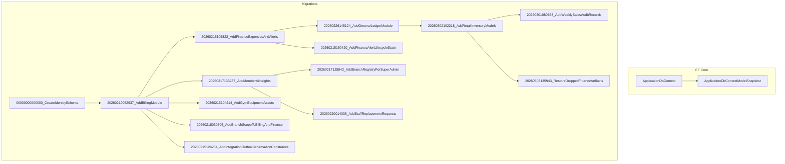
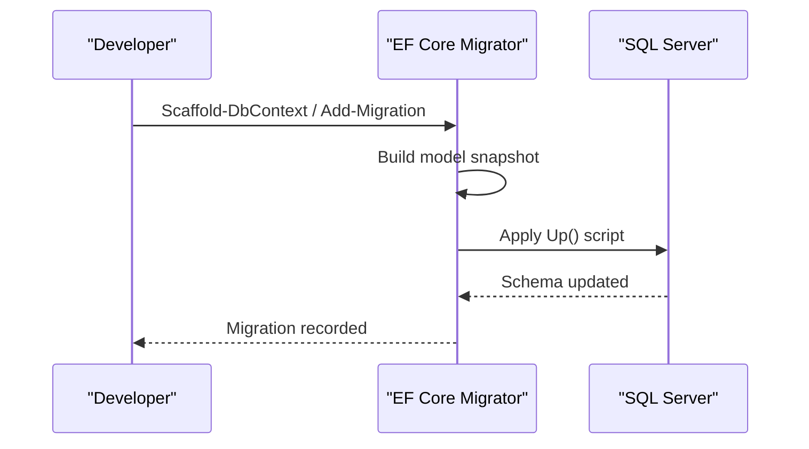
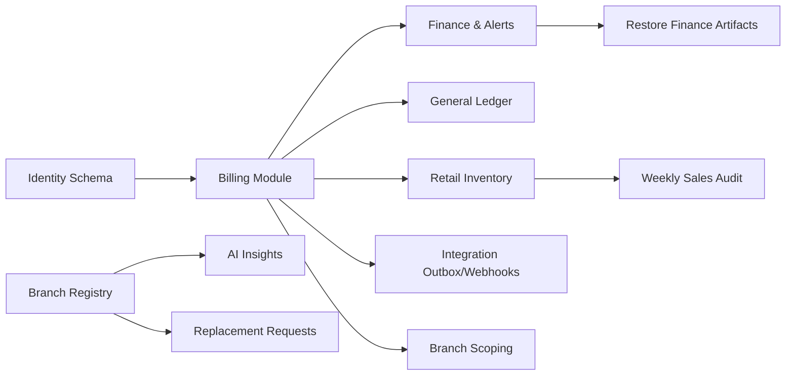
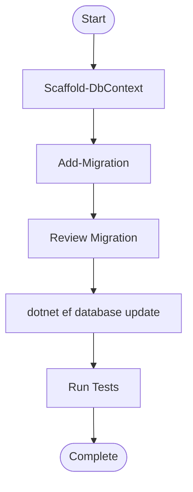

# Migration Management and Schema Evolution

<cite>
**Referenced Files in This Document**
- [ApplicationDbContextModelSnapshot.cs](file://Data/Migrations/ApplicationDbContextModelSnapshot.cs)
- [ApplicationDbContext.cs](file://Data/ApplicationDbContext.cs)
- [00000000000000_CreateIdentitySchema.cs](file://Data/Migrations/00000000000000_CreateIdentitySchema.cs)
- [20260210062937_AddBillingModule.cs](file://Data/Migrations/20260210062937_AddBillingModule.cs)
- [20260211170305_AddMemberProfile.cs](file://Data/Migrations/20260211170305_AddMemberProfile.cs)
- [20260211170636_AddMemberHealthMetrics.cs](file://Data/Migrations/20260211170636_AddMemberHealthMetrics.cs)
- [20260215104214_AddGymEquipmentAssets.cs](file://Data/Migrations/20260215104214_AddGymEquipmentAssets.cs)
- [20260215105822_AddFinanceExpensesAndAlerts.cs](file://Data/Migrations/20260215105822_AddFinanceExpensesAndAlerts.cs)
- [20260215121348_AddIntegrationOutboxAndWebhookIdempotency.cs](file://Data/Migrations/20260215121348_AddIntegrationOutboxAndWebhookIdempotency.cs)
- [20260215124234_AddIntegrationOutboxSchemaAndConstraints.cs](file://Data/Migrations/20260215124234_AddIntegrationOutboxSchemaAndConstraints.cs)
- [20260215150420_AddFinanceAlertLifecycleState.cs](file://Data/Migrations/20260215150420_AddFinanceAlertLifecycleState.cs)
- [20260217125542_AddBranchRegistryForSuperAdmin.cs](file://Data/Migrations/20260217125542_AddBranchRegistryForSuperAdmin.cs)
- [20260217133237_AddMemberAiInsights.cs](file://Data/Migrations/20260217133237_AddMemberAiInsights.cs)
- [20260218030505_AddBranchScopeToBillingAndFinance.cs](file://Data/Migrations/20260218030505_AddBranchScopeToBillingAndFinance.cs)
- [20260220014036_AddStaffReplacementRequests.cs](file://Data/Migrations/20260220014036_AddStaffReplacementRequests.cs)
- [20260226145124_AddGeneralLedgerModule.cs](file://Data/Migrations/20260226145124_AddGeneralLedgerModule.cs)
- [20260301080653_AddWeeklySalesAuditRecords.cs](file://Data/Migrations/20260301080653_AddWeeklySalesAuditRecords.cs)
- [20260302054246_AddLinkedEquipmentToReplacementRequests.cs](file://Data/Migrations/20260302054246_AddLinkedEquipmentToReplacementRequests.cs)
- [20260302102218_AddRetailInventoryModels.cs](file://Data/Migrations/20260302102218_AddRetailInventoryModels.cs)
- [20260302111813_AddAutoBillingTables.cs](file://Data/Migrations/20260302111813_AddAutoBillingTables.cs)
- [20260303135943_RestoreDroppedFinanceArtifacts.cs](file://Data/Migrations/20260303135943_RestoreDroppedFinanceArtifacts.cs)
- [20260307011411_AddHomeBranchAndPlanEntitlements.cs](file://Data/Migrations/20260307011411_AddHomeBranchAndPlanEntitlements.cs)
</cite>

## Table of Contents
1. [Introduction](#introduction)
2. [Project Structure](#project-structure)
3. [Core Components](#core-components)
4. [Architecture Overview](#architecture-overview)
5. [Detailed Component Analysis](#detailed-component-analysis)
6. [Dependency Analysis](#dependency-analysis)
7. [Performance Considerations](#performance-considerations)
8. [Troubleshooting Guide](#troubleshooting-guide)
9. [Conclusion](#conclusion)
10. [Appendices](#appendices)

## Introduction
This document explains the migration management and schema evolution of the EJC Fitness Gym system. It covers the complete migration history from the initial identity schema to the current multi-module architecture, including billing, finance, general ledger, retail inventory, integration outbox/webhooks, staff replacement requests, and AI insights. It also documents the migration workflow, model snapshot mechanism, best practices, conflict resolution, production deployment considerations, and testing/validation strategies.

## Project Structure
The migrations reside under Data/Migrations and are named with a timestamp prefix followed by a descriptive label. The ApplicationDbContext orchestrates EF Core model building and indexes, while ApplicationDbContextModelSnapshot.cs captures the current model state for comparison and generation of future migrations.

**Diagram sources**
- [ApplicationDbContext.cs:43-411](file://Data/ApplicationDbContext.cs#L43-L411)
- [ApplicationDbContextModelSnapshot.cs:16-800](file://Data/Migrations/ApplicationDbContextModelSnapshot.cs#L16-L800)
- [00000000000000_CreateIdentitySchema.cs:9-221](file://Data/Migrations/00000000000000_CreateIdentitySchema.cs#L9-L221)
- [20260210062937_AddBillingModule.cs:12-149](file://Data/Migrations/20260210062937_AddBillingModule.cs#L12-L149)
- [20260215105822_AddFinanceExpensesAndAlerts.cs:12-78](file://Data/Migrations/20260215105822_AddFinanceExpensesAndAlerts.cs#L12-L78)
- [20260226145124_AddGeneralLedgerModule.cs:12-137](file://Data/Migrations/20260226145124_AddGeneralLedgerModule.cs#L12-L137)
- [20260302102218_AddRetailInventoryModels.cs:12-285](file://Data/Migrations/20260302102218_AddRetailInventoryModels.cs#L12-L285)
- [20260218030505_AddBranchScopeToBillingAndFinance.cs:11-149](file://Data/Migrations/20260218030505_AddBranchScopeToBillingAndFinance.cs#L11-L149)
- [20260217133237_AddMemberAiInsights.cs:12-91](file://Data/Migrations/20260217133237_AddMemberAiInsights.cs#L12-L91)
- [20260215104214_AddGymEquipmentAssets.cs:12-51](file://Data/Migrations/20260215104214_AddGymEquipmentAssets.cs#L12-L51)
- [20260217125542_AddBranchRegistryForSuperAdmin.cs:12-52](file://Data/Migrations/20260217125542_AddBranchRegistryForSuperAdmin.cs#L12-L52)
- [20260220014036_AddStaffReplacementRequests.cs:12-64](file://Data/Migrations/20260220014036_AddStaffReplacementRequests.cs#L12-L64)
- [20260215124234_AddIntegrationOutboxSchemaAndConstraints.cs:12-172](file://Data/Migrations/20260215124234_AddIntegrationOutboxSchemaAndConstraints.cs#L12-L172)
- [20260215150420_AddFinanceAlertLifecycleState.cs:12-103](file://Data/Migrations/20260215150420_AddFinanceAlertLifecycleState.cs#L12-L103)
- [20260301080653_AddWeeklySalesAuditRecords.cs:12-105](file://Data/Migrations/20260301080653_AddWeeklySalesAuditRecords.cs#L12-L105)
- [20260303135943_RestoreDroppedFinanceArtifacts.cs:11-134](file://Data/Migrations/20260303135943_RestoreDroppedFinanceArtifacts.cs#L11-L134)

**Section sources**
- [ApplicationDbContext.cs:12-411](file://Data/ApplicationDbContext.cs#L12-L411)
- [ApplicationDbContextModelSnapshot.cs:16-800](file://Data/Migrations/ApplicationDbContextModelSnapshot.cs#L16-L800)

## Core Components
- ApplicationDbContext: Defines DbSet<T> sets and fluent configurations for entities, indexes, and relationships. It centralizes precision and index definitions for billing, finance, general ledger, retail inventory, and integration artifacts.
- ApplicationDbContextModelSnapshot: Captures the current model state for EF Core to compare against and generate incremental migrations.
- Migrations: Timestamped migration files that evolve the schema progressively, adding modules and refining constraints.

Key modules and their migrations:
- Identity schema: Initial AspNet* tables.
- Billing: Subscription plans, subscriptions, invoices, payments, saved payment methods, auto billing attempts.
- Finance: Expenses, alerts, budgeting, weekly sales audit records.
- General Ledger: Accounts, entries, lines.
- Retail Inventory: Products, sales, sale lines, supply requests.
- Integration: Outbox messages and inbound webhook receipts.
- Branch registry and staff replacement requests.
- Member AI insights and health metrics.
- Branch scoping for cross-module data isolation.

**Section sources**
- [ApplicationDbContext.cs:19-42](file://Data/ApplicationDbContext.cs#L19-L42)
- [ApplicationDbContext.cs:43-411](file://Data/ApplicationDbContext.cs#L43-L411)
- [ApplicationDbContextModelSnapshot.cs:16-800](file://Data/Migrations/ApplicationDbContextModelSnapshot.cs#L16-L800)

## Architecture Overview
The migration architecture follows EF Core’s design-time model snapshot and runtime migration execution. The model snapshot ensures deterministic comparisons. Migrations are applied in timestamp order, with explicit Up/Down methods and SQL scripts for data backfill and schema adjustments.

**Diagram sources**
- [ApplicationDbContextModelSnapshot.cs:16-800](file://Data/Migrations/ApplicationDbContextModelSnapshot.cs#L16-L800)
- [00000000000000_CreateIdentitySchema.cs:9-221](file://Data/Migrations/00000000000000_CreateIdentitySchema.cs#L9-L221)

## Detailed Component Analysis

### Identity Schema Migration
- Purpose: Establishes ASP.NET Core Identity tables and indexes.
- Impact: Foundation for roles, users, claims, logins, roles, and tokens.
- Rollback: Drops all Identity tables in reverse dependency order.

**Section sources**
- [00000000000000_CreateIdentitySchema.cs:9-221](file://Data/Migrations/00000000000000_CreateIdentitySchema.cs#L9-L221)

### Billing Module Migration
- Purpose: Adds subscription plans, member subscriptions, invoices, and payments.
- Impact: Enables recurring billing, invoicing, and payment tracking.
- Rollback: Removes all billing-related tables and foreign keys.

**Section sources**
- [20260210062937_AddBillingModule.cs:12-149](file://Data/Migrations/20260210062937_AddBillingModule.cs#L12-L149)

### Finance Expenses and Alerts Migration
- Purpose: Adds finance alert logs and expense records.
- Impact: Introduces lifecycle state and auditing for financial alerts.
- Rollback: Drops alert logs and expense records.

**Section sources**
- [20260215105822_AddFinanceExpensesAndAlerts.cs:12-78](file://Data/Migrations/20260215105822_AddFinanceExpensesAndAlerts.cs#L12-L78)
- [20260215150420_AddFinanceAlertLifecycleState.cs:12-103](file://Data/Migrations/20260215150420_AddFinanceAlertLifecycleState.cs#L12-L103)

### General Ledger Module Migration
- Purpose: Adds general ledger accounts, entries, and lines.
- Impact: Supports branch-scoped accounting entries with debit/credit lines.
- Rollback: Removes GL tables and constraints.

**Section sources**
- [20260226145124_AddGeneralLedgerModule.cs:12-137](file://Data/Migrations/20260226145124_AddGeneralLedgerModule.cs#L12-L137)

### Retail Inventory Models Migration
- Purpose: Adds retail products, product sales, sale lines, and supply requests.
- Impact: Enables POS-like retail operations and supply chain tracking.
- Rollback: Restores previous budgeting and weekly audit tables.

**Section sources**
- [20260302102218_AddRetailInventoryModels.cs:12-285](file://Data/Migrations/20260302102218_AddRetailInventoryModels.cs#L12-L285)
- [20260301080653_AddWeeklySalesAuditRecords.cs:12-105](file://Data/Migrations/20260301080653_AddWeeklySalesAuditRecords.cs#L12-L105)
- [20260303135943_RestoreDroppedFinanceArtifacts.cs:11-134](file://Data/Migrations/20260303135943_RestoreDroppedFinanceArtifacts.cs#L11-L134)

### Integration Outbox and Webhook Idempotency
- Purpose: Adds outbox message table and inbound webhook receipts with uniqueness constraints.
- Impact: Enables reliable asynchronous integration and idempotent webhook processing.
- Rollback: Drops outbox and inbound webhook tables and reverts payment provider/index changes.

**Section sources**
- [20260215124234_AddIntegrationOutboxSchemaAndConstraints.cs:12-172](file://Data/Migrations/20260215124234_AddIntegrationOutboxSchemaAndConstraints.cs#L12-L172)
- [20260215121348_AddIntegrationOutboxAndWebhookIdempotency.cs:8-23](file://Data/Migrations/20260215121348_AddIntegrationOutboxAndWebhookIdempotency.cs#L8-L23)

### Branch Registry and Scope Enhancements
- Purpose: Adds branch registry and scopes billing, finance, and equipment assets by branch.
- Impact: Multi-branch data isolation and reporting.
- Rollback: Removes branch columns and indexes; backfills default branch where applicable.

**Section sources**
- [20260217125542_AddBranchRegistryForSuperAdmin.cs:12-52](file://Data/Migrations/20260217125542_AddBranchRegistryForSuperAdmin.cs#L12-L52)
- [20260218030505_AddBranchScopeToBillingAndFinance.cs:11-149](file://Data/Migrations/20260218030505_AddBranchScopeToBillingAndFinance.cs#L11-L149)

### Staff Replacement Requests and Member AI Insights
- Purpose: Adds staff replacement requests and member retention/action snapshots.
- Impact: Operational resource planning and AI-driven member insights.
- Rollback: Drops tables and indexes.

**Section sources**
- [20260220014036_AddStaffReplacementRequests.cs:12-64](file://Data/Migrations/20260220014036_AddStaffReplacementRequests.cs#L12-L64)
- [20260217133237_AddMemberAiInsights.cs:12-91](file://Data/Migrations/20260217133237_AddMemberAiInsights.cs#L12-L91)

### Gym Equipment Assets
- Purpose: Adds gym equipment asset tracking with cost and useful life.
- Impact: Asset lifecycle and depreciation-ready structure.
- Rollback: Drops equipment assets table.

**Section sources**
- [20260215104214_AddGymEquipmentAssets.cs:12-51](file://Data/Migrations/20260215104214_AddGymEquipmentAssets.cs#L12-L51)

### Auto Billing and Additional Artifacts
- Purpose: Adds auto billing attempt tracking and restores dropped finance artifacts.
- Impact: Improved billing automation and historical artifact continuity.
- Rollback: Drops auto billing attempts and restores original artifacts.

**Section sources**
- [20260302111813_AddAutoBillingTables.cs:1-200](file://Data/Migrations/20260302111813_AddAutoBillingTables.cs)
- [20260303135943_RestoreDroppedFinanceArtifacts.cs:11-134](file://Data/Migrations/20260303135943_RestoreDroppedFinanceArtifacts.cs#L11-L134)

### Member Profile and Health Metrics
- Purpose: Adds member profile and health metrics entities.
- Impact: Enhanced member-centric data model.
- Rollback: Drops profile and health metrics tables.

**Section sources**
- [20260211170305_AddMemberProfile.cs:12-49](file://Data/Migrations/20260211170305_AddMemberProfile.cs#L12-L49)
- [20260211170636_AddMemberHealthMetrics.cs:1-200](file://Data/Migrations/20260211170636_AddMemberHealthMetrics.cs)

### Home Branch and Plan Entitlements
- Purpose: Adds home branch and plan entitlements for members.
- Impact: Personalized membership and branch assignment.
- Rollback: Drops related columns and indexes.

**Section sources**
- [20260307011411_AddHomeBranchAndPlanEntitlements.cs:1-200](file://Data/Migrations/20260307011411_AddHomeBranchAndPlanEntitlements.cs)

## Dependency Analysis
Migrations are ordered by timestamp and often depend on prior modules. For example:
- Identity schema precedes billing and finance.
- Billing module introduces invoices and payments, which later gain branch scoping.
- Finance and general ledger modules extend billing with alerts, GL, and retail inventory.
- Integration outbox depends on payment uniqueness constraints.
- Branch scoping propagates across billing, finance, and equipment tables.
- AI insights and replacement requests rely on branch registry.

**Diagram sources**
- [00000000000000_CreateIdentitySchema.cs:9-221](file://Data/Migrations/00000000000000_CreateIdentitySchema.cs#L9-L221)
- [20260210062937_AddBillingModule.cs:12-149](file://Data/Migrations/20260210062937_AddBillingModule.cs#L12-L149)
- [20260215105822_AddFinanceExpensesAndAlerts.cs:12-78](file://Data/Migrations/20260215105822_AddFinanceExpensesAndAlerts.cs#L12-L78)
- [20260226145124_AddGeneralLedgerModule.cs:12-137](file://Data/Migrations/20260226145124_AddGeneralLedgerModule.cs#L12-L137)
- [20260302102218_AddRetailInventoryModels.cs:12-285](file://Data/Migrations/20260302102218_AddRetailInventoryModels.cs#L12-L285)
- [20260215124234_AddIntegrationOutboxSchemaAndConstraints.cs:12-172](file://Data/Migrations/20260215124234_AddIntegrationOutboxSchemaAndConstraints.cs#L12-L172)
- [20260218030505_AddBranchScopeToBillingAndFinance.cs:11-149](file://Data/Migrations/20260218030505_AddBranchScopeToBillingAndFinance.cs#L11-L149)
- [20260217125542_AddBranchRegistryForSuperAdmin.cs:12-52](file://Data/Migrations/20260217125542_AddBranchRegistryForSuperAdmin.cs#L12-L52)
- [20260217133237_AddMemberAiInsights.cs:12-91](file://Data/Migrations/20260217133237_AddMemberAiInsights.cs#L12-L91)
- [20260220014036_AddStaffReplacementRequests.cs:12-64](file://Data/Migrations/20260220014036_AddStaffReplacementRequests.cs#L12-L64)
- [20260303135943_RestoreDroppedFinanceArtifacts.cs:11-134](file://Data/Migrations/20260303135943_RestoreDroppedFinanceArtifacts.cs#L11-L134)
- [20260301080653_AddWeeklySalesAuditRecords.cs:12-105](file://Data/Migrations/20260301080653_AddWeeklySalesAuditRecords.cs#L12-L105)

## Performance Considerations
- Index selection: Migrations introduce targeted indexes on frequently filtered/sorted columns (e.g., invoice number, branch+status+due date, payment gateway/provider combinations).
- Precision: Monetary fields use decimal precision to avoid floating-point errors.
- Unique constraints: Uniqueness on composite keys reduces duplicate processing and improves join performance.
- Data backfill: Branch scoping migrations include SQL updates to populate historical data, minimizing application-level overhead.

[No sources needed since this section provides general guidance]

## Troubleshooting Guide
Common migration issues and resolutions:
- Conflicts due to overlapping timestamps: Ensure unique timestamps and re-order migrations if necessary.
- Data loss risk during schema changes: Use Down methods and SQL backfills; test on staging first.
- Unique constraint violations: Adjust Down migrations to restore previous indexes or constraints.
- Production rollbacks: Prefer additive migrations with Down methods; avoid destructive changes in production.

**Section sources**
- [20260218030505_AddBranchScopeToBillingAndFinance.cs:11-149](file://Data/Migrations/20260218030505_AddBranchScopeToBillingAndFinance.cs#L11-L149)
- [20260215124234_AddIntegrationOutboxSchemaAndConstraints.cs:12-172](file://Data/Migrations/20260215124234_AddIntegrationOutboxSchemaAndConstraints.cs#L12-L172)

## Conclusion
The EJC Fitness Gym migration strategy demonstrates a disciplined, module-driven evolution of the database schema. By leveraging EF Core’s model snapshot, timestamped migrations, and careful index/precision definitions, the system supports robust billing, finance, general ledger, retail operations, integration, and analytics. Adhering to best practices and thorough testing ensures safe evolution across environments.

[No sources needed since this section summarizes without analyzing specific files]

## Appendices

### Migration Workflow: Creation, Execution, and Rollback
- Creation: Scaffold-DbContext to capture existing schema; Add-Migration to generate a new migration file.
- Execution: dotnet ef database update applies Up() scripts in timestamp order.
- Rollback: dotnet ef database update -TargetMigration to revert to a previous migration; Down() scripts remove changes.
- Validation: Compare model snapshot with current model; run tests to verify referential integrity and indexes.

[No sources needed since this diagram shows conceptual workflow, not actual code structure]

### Model Snapshot Mechanism
- ApplicationDbContextModelSnapshot captures the current model state and is used by EF Core to detect differences and generate new migrations.
- It includes entity annotations, indexes, and value conversions for accurate comparison.

**Section sources**
- [ApplicationDbContextModelSnapshot.cs:16-800](file://Data/Migrations/ApplicationDbContextModelSnapshot.cs#L16-L800)

### Best Practices and Naming Conventions
- Use timestamp prefixes for deterministic ordering.
- Descriptive migration names reflect functional scope (e.g., AddBillingModule, AddGeneralLedgerModule).
- Keep migrations small and focused; group related changes.
- Always include Down methods for reversible changes.
- Use SQL scripts for data backfills and index additions where necessary.

[No sources needed since this section provides general guidance]

### Version Control and Production Deployment
- Treat migrations as code; review in pull requests.
- Apply migrations in CI/CD pipelines after schema checks.
- Use environment-specific appsettings to target databases.
- Document breaking changes and communicate with stakeholders.

[No sources needed since this section provides general guidance]

### Testing Strategies and Validation
- Unit/integration tests validate entity configurations and indexes in ApplicationDbContext.
- End-to-end tests exercise billing, finance, and general ledger flows.
- Health checks and readiness probes ensure database connectivity post-migration.
- Regression tests confirm backward compatibility after restoring artifacts.

[No sources needed since this section provides general guidance]