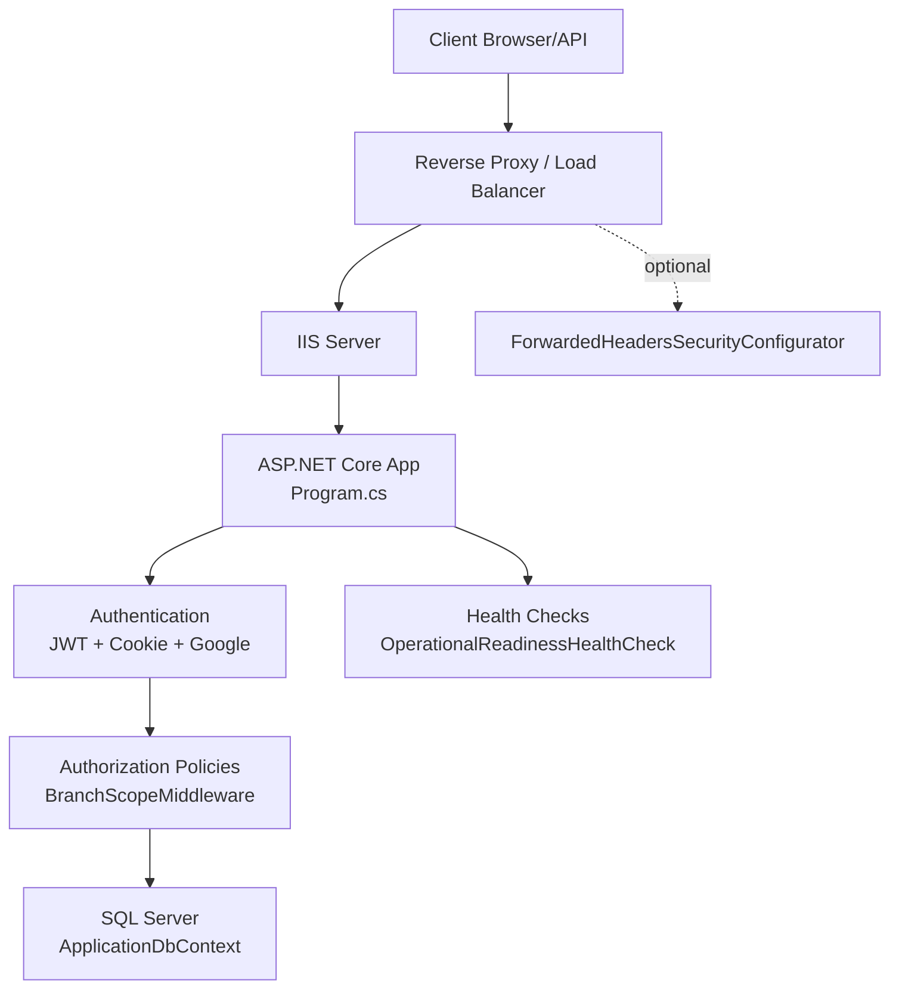
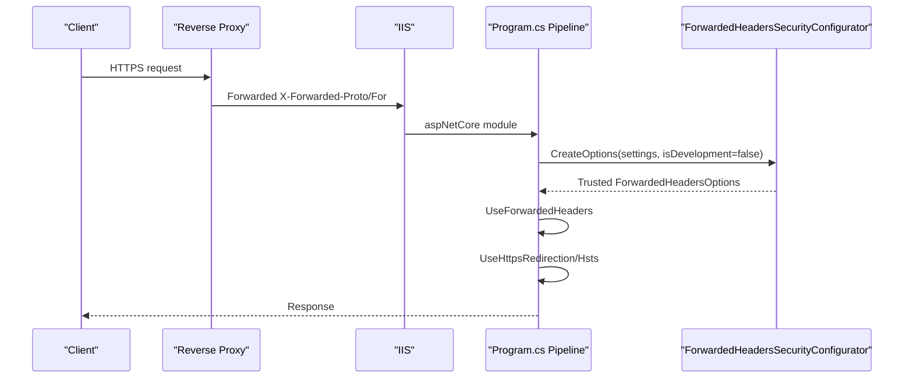
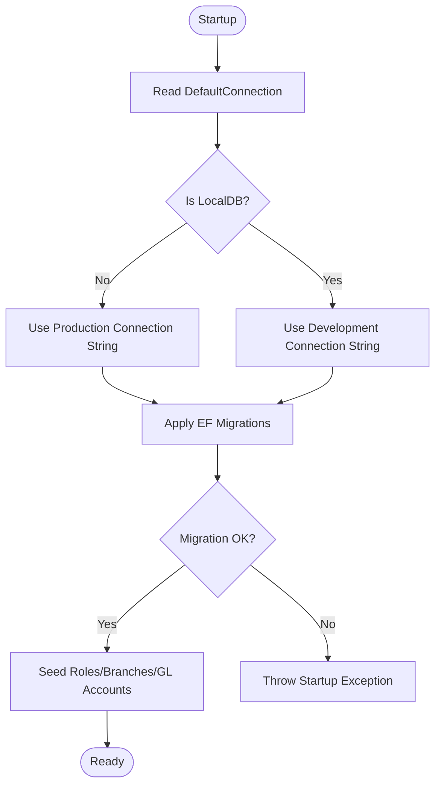
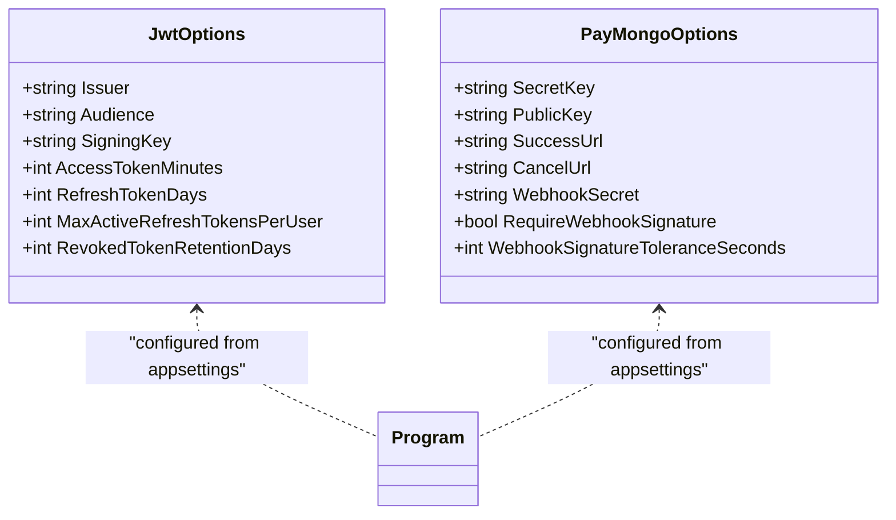
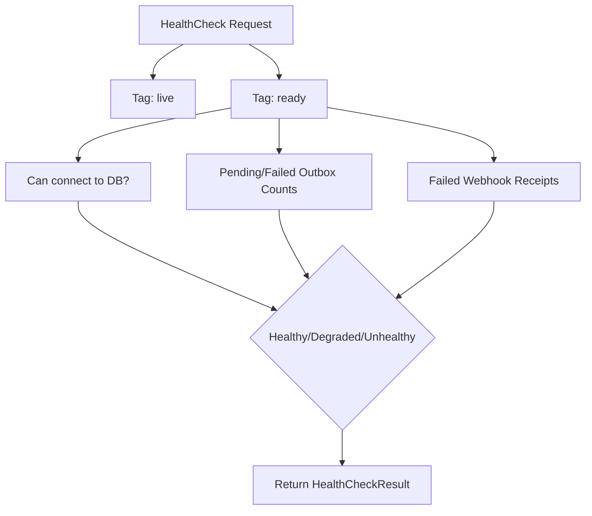
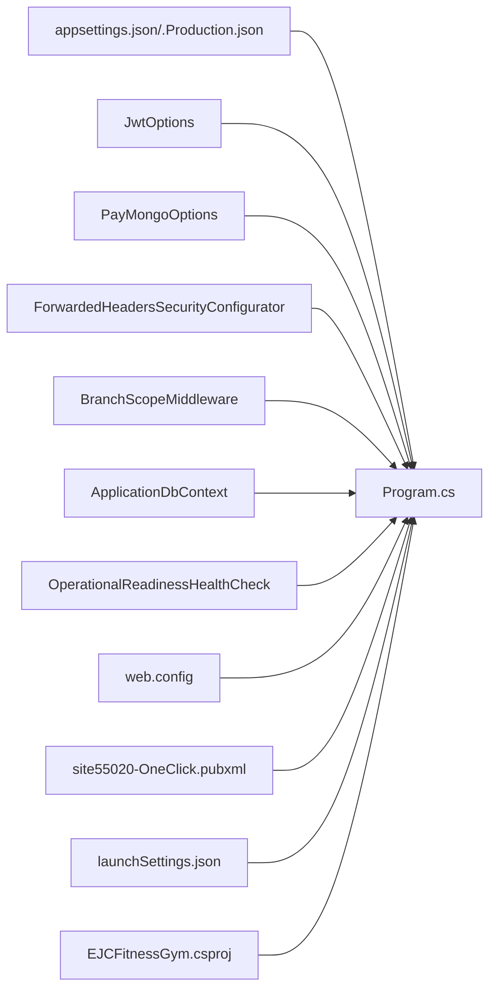

# Deployment and Configuration

<cite>
**Referenced Files in This Document**
- [appsettings.json](file://appsettings.json)
- [appsettings.Production.json](file://appsettings.Production.json)
- [Program.cs](file://Program.cs)
- [web.config](file://web.config)
- [Properties/launchSettings.json](file://Properties/launchSettings.json)
- [Security/JwtOptions.cs](file://Security/JwtOptions.cs)
- [Services/Payments/PayMongoOptions.cs](file://Services/Payments/PayMongoOptions.cs)
- [Data/ApplicationDbContext.cs](file://Data/ApplicationDbContext.cs)
- [Services/Monitoring/ForwardedHeadersSecurityConfigurator.cs](file://Services/Monitoring/ForwardedHeadersSecurityConfigurator.cs)
- [Services/Monitoring/OperationalReadinessHealthCheck.cs](file://Services/Monitoring/OperationalReadinessHealthCheck.cs)
- [Services/Monitoring/OperationalHealthOptions.cs](file://Services/Monitoring/OperationalHealthOptions.cs)
- [Security/BranchScopeMiddleware.cs](file://Security/BranchScopeMiddleware.cs)
- [Properties/PublishProfiles/site55020-OneClick.pubxml](file://Properties/PublishProfiles/site55020-OneClick.pubxml)
- [EJCFitnessGym.csproj](file://EJCFitnessGym.csproj)
</cite>

## Table of Contents
1. [Introduction](#introduction)
2. [Project Structure](#project-structure)
3. [Core Components](#core-components)
4. [Architecture Overview](#architecture-overview)
5. [Detailed Component Analysis](#detailed-component-analysis)
6. [Dependency Analysis](#dependency-analysis)
7. [Performance Considerations](#performance-considerations)
8. [Troubleshooting Guide](#troubleshooting-guide)
9. [Conclusion](#conclusion)
10. [Appendices](#appendices)

## Introduction
This document provides comprehensive deployment and configuration guidance for the EJC Fitness Gym system. It covers environment configuration management across development, staging, and production, production deployment via IIS and reverse proxies, SSL/TLS certificate management, database connection and migration strategies, application settings (authentication keys, external service credentials, feature flags), health checks and monitoring, performance optimization, security hardening, and backup/disaster recovery procedures.

## Project Structure
The application is a .NET 8 Web Application using ASP.NET Core. Key configuration and deployment artifacts include:
- Environment-specific JSON configuration files for settings and secrets
- Program.cs for runtime configuration, middleware, authentication, CORS, rate limiting, health checks, and migrations
- web.config for IIS hosting with AspNetCoreModuleV2
- Launch settings for local development profiles
- Project file defining target framework and package references
- Publish profile for automated IIS publishing

```mermaid
graph TB
subgraph "Runtime"
ProgramCS["Program.cs"]
DbContext["ApplicationDbContext.cs"]
HealthCheck["OperationalReadinessHealthCheck.cs"]
FwdCfg["ForwardedHeadersSecurityConfigurator.cs"]
BranchScope["BranchScopeMiddleware.cs"]
end
subgraph "Configuration"
AppDev["appsettings.json"]
AppProd["appsettings.Production.json"]
JwtOpts["Security/JwtOptions.cs"]
PayOpts["Services/Payments/PayMongoOptions.cs"]
PubProf["Properties/PublishProfiles/site55020-OneClick.pubxml"]
Launch["Properties/launchSettings.json"]
Proj["EJCFitnessGym.csproj"]
WebCfg["web.config"]
end
AppDev --> ProgramCS
AppProd --> ProgramCS
JwtOpts --> ProgramCS
PayOpts --> ProgramCS
FwdCfg --> ProgramCS
BranchScope --> ProgramCS
HealthCheck --> ProgramCS
DbContext --> ProgramCS
Proj --> ProgramCS
WebCfg --> ProgramCS
Launch --> ProgramCS
PubProf --> ProgramCS
```

**Diagram sources**
- [Program.cs:32-473](file://Program.cs#L32-L473)
- [appsettings.json:1-126](file://appsettings.json#L1-L126)
- [appsettings.Production.json:1-33](file://appsettings.Production.json#L1-L33)
- [Security/JwtOptions.cs:1-14](file://Security/JwtOptions.cs#L1-L14)
- [Services/Payments/PayMongoOptions.cs:1-14](file://Services/Payments/PayMongoOptions.cs#L1-L14)
- [Services/Monitoring/ForwardedHeadersSecurityConfigurator.cs:1-97](file://Services/Monitoring/ForwardedHeadersSecurityConfigurator.cs#L1-L97)
- [Security/BranchScopeMiddleware.cs:1-73](file://Security/BranchScopeMiddleware.cs#L1-L73)
- [Services/Monitoring/OperationalReadinessHealthCheck.cs:1-130](file://Services/Monitoring/OperationalReadinessHealthCheck.cs#L1-L130)
- [Data/ApplicationDbContext.cs:1-414](file://Data/ApplicationDbContext.cs#L1-L414)
- [Properties/PublishProfiles/site55020-OneClick.pubxml:1-26](file://Properties/PublishProfiles/site55020-OneClick.pubxml#L1-L26)
- [Properties/launchSettings.json:1-39](file://Properties/launchSettings.json#L1-L39)
- [EJCFitnessGym.csproj:1-37](file://EJCFitnessGym.csproj#L1-L37)
- [web.config:1-11](file://web.config#L1-L11)

**Section sources**
- [Program.cs:32-473](file://Program.cs#L32-L473)
- [appsettings.json:1-126](file://appsettings.json#L1-L126)
- [appsettings.Production.json:1-33](file://appsettings.Production.json#L1-L33)
- [Properties/launchSettings.json:1-39](file://Properties/launchSettings.json#L1-L39)
- [EJCFitnessGym.csproj:1-37](file://EJCFitnessGym.csproj#L1-L37)
- [web.config:1-11](file://web.config#L1-L11)
- [Properties/PublishProfiles/site55020-OneClick.pubxml:1-26](file://Properties/PublishProfiles/site55020-OneClick.pubxml#L1-L26)

## Core Components
- Environment configuration management
  - appsettings.json defines defaults for development and shared settings
  - appsettings.Production.json overrides production-sensitive values
  - Program.cs reads configuration and conditionally configures services based on environment
- Authentication and authorization
  - JWT bearer and cookie-based authentication
  - Google OAuth integration
  - Role-based authorization policies and branch-scoped access enforcement
- Reverse proxy and forwarded headers security
  - ForwardedHeadersSecurityConfigurator validates and applies trusted proxy/network lists
- Health checks and monitoring
  - Built-in health checks plus OperationalReadinessHealthCheck for operational thresholds
- Database connectivity and migrations
  - SQL Server provider and EF Core migrations executed at startup
- IIS hosting and publishing
  - web.config with AspNetCoreModuleV2 and process path
  - Publish profile for MSDeploy to IIS

**Section sources**
- [appsettings.json:1-126](file://appsettings.json#L1-L126)
- [appsettings.Production.json:1-33](file://appsettings.Production.json#L1-L33)
- [Program.cs:57-105](file://Program.cs#L57-L105)
- [Security/JwtOptions.cs:1-14](file://Security/JwtOptions.cs#L1-L14)
- [Services/Payments/PayMongoOptions.cs:1-14](file://Services/Payments/PayMongoOptions.cs#L1-L14)
- [Services/Monitoring/ForwardedHeadersSecurityConfigurator.cs:9-73](file://Services/Monitoring/ForwardedHeadersSecurityConfigurator.cs#L9-L73)
- [Services/Monitoring/OperationalReadinessHealthCheck.cs:25-127](file://Services/Monitoring/OperationalReadinessHealthCheck.cs#L25-L127)
- [Data/ApplicationDbContext.cs:14-16](file://Data/ApplicationDbContext.cs#L14-L16)
- [web.config:1-11](file://web.config#L1-L11)
- [Properties/PublishProfiles/site55020-OneClick.pubxml:4-24](file://Properties/PublishProfiles/site55020-OneClick.pubxml#L4-L24)

## Architecture Overview
The deployment architecture centers around ASP.NET Core hosted in IIS with AspNetCoreModuleV2. Requests pass through optional reverse proxies/load balancers and are validated via ForwardedHeadersSecurityConfigurator. Authentication integrates JWT bearer and cookie schemes, with Google OAuth. Authorization enforces branch-scoped access via BranchScopeMiddleware. Operational health is monitored through built-in and custom health checks.

**Diagram sources**
- [Program.cs:668-708](file://Program.cs#L668-L708)
- [Services/Monitoring/ForwardedHeadersSecurityConfigurator.cs:9-73](file://Services/Monitoring/ForwardedHeadersSecurityConfigurator.cs#L9-L73)
- [Security/BranchScopeMiddleware.cs:14-53](file://Security/BranchScopeMiddleware.cs#L14-L53)
- [Data/ApplicationDbContext.cs:14-16](file://Data/ApplicationDbContext.cs#L14-L16)
- [Services/Monitoring/OperationalReadinessHealthCheck.cs:25-127](file://Services/Monitoring/OperationalReadinessHealthCheck.cs#L25-L127)

## Detailed Component Analysis

### Environment Configuration Management
- Development
  - Local database connection string and default SMTP settings
  - Identity requires confirmed email only when SMTP is configured
  - Allowed hosts wildcard for local development
- Staging
  - Override production-sensitive settings (e.g., connection string, security cookies)
- Production
  - Secure cookies enabled
  - Google OAuth client credentials required
  - PayMongo webhook signature required
  - ForwardedHeaders enabled with explicit trusted proxies/networks
  - Logging level reduced to warnings

Recommended practice:
- Use separate appsettings.{Environment}.json files for each environment
- Store secrets in environment variables or Azure Key Vault during deployment
- Validate configuration at startup (Program.cs enforces required values)

**Section sources**
- [appsettings.json:1-126](file://appsettings.json#L1-L126)
- [appsettings.Production.json:1-33](file://appsettings.Production.json#L1-L33)
- [Program.cs:40-54](file://Program.cs#L40-L54)
- [Program.cs:114-142](file://Program.cs#L114-L142)
- [Program.cs:171-179](file://Program.cs#L171-L179)

### Production Deployment Process (IIS, Reverse Proxy, SSL)
- IIS hosting
  - web.config configures AspNetCoreModuleV2, process path, and stdout logging
  - Hosting model is in-process
- Reverse proxy setup
  - ForwardedHeadersSecurityConfigurator creates ForwardedHeadersOptions with KnownProxies/KnownNetworks
  - Outside development, at least one trusted proxy or network must be configured
- SSL/TLS
  - HTTPS redirection is enabled in non-development
  - HSTS is enabled in non-development
  - Use a managed certificate or wildcard certificate for the domain
  - Enforce TLS 1.2+ on the load balancer/IIS

**Diagram sources**
- [web.config:1-11](file://web.config#L1-L11)
- [Program.cs:668-682](file://Program.cs#L668-L682)
- [Services/Monitoring/ForwardedHeadersSecurityConfigurator.cs:9-73](file://Services/Monitoring/ForwardedHeadersSecurityConfigurator.cs#L9-L73)

**Section sources**
- [web.config:1-11](file://web.config#L1-L11)
- [Program.cs:184-189](file://Program.cs#L184-L189)
- [Services/Monitoring/ForwardedHeadersSecurityConfigurator.cs:59-70](file://Services/Monitoring/ForwardedHeadersSecurityConfigurator.cs#L59-L70)

### Database Connection Configuration and Migration Strategies
- Connection string
  - Default connection string targets local SQL Server LocalDB
  - Production connection string must be provided via appsettings.Production.json or environment variable
- Migrations
  - At startup, the application migrates the database automatically
  - During migration failures, startup throws an exception to prevent unsafe operation
- Recommendations
  - Use dedicated production SQL Server instances or managed SQL DB
  - Enable connection pooling and appropriate timeouts
  - Use least-privilege accounts for application connections

**Diagram sources**
- [Program.cs:718-727](file://Program.cs#L718-L727)
- [Data/ApplicationDbContext.cs:14-16](file://Data/ApplicationDbContext.cs#L14-L16)

**Section sources**
- [appsettings.json:2-4](file://appsettings.json#L2-L4)
- [appsettings.Production.json:2-4](file://appsettings.Production.json#L2-L4)
- [Program.cs:57-61](file://Program.cs#L57-L61)
- [Program.cs:718-727](file://Program.cs#L718-L727)
- [Data/ApplicationDbContext.cs:14-16](file://Data/ApplicationDbContext.cs#L14-L16)

### Application Settings: Authentication Keys, External Credentials, Feature Flags
- JWT
  - Issuer, Audience, SigningKey, token lifetimes, refresh token limits
  - In production, signing key must be configured; otherwise startup fails
- Google OAuth
  - ClientId and ClientSecret required in production
  - Falls back to development settings when using LocalDB
- PayMongo
  - SecretKey, PublicKey, SuccessUrl, CancelUrl, WebhookSecret
  - Webhook signature required outside development unless explicitly disabled
- Feature flags
  - Finance alerts, alert evaluator, membership lifecycle worker, staff attendance, integration outbox, auto billing
  - Operational health thresholds for outbox and webhook failures

**Diagram sources**
- [Security/JwtOptions.cs:1-14](file://Security/JwtOptions.cs#L1-L14)
- [Services/Payments/PayMongoOptions.cs:1-14](file://Services/Payments/PayMongoOptions.cs#L1-L14)
- [Program.cs:87-91](file://Program.cs#L87-L91)
- [Program.cs:175-179](file://Program.cs#L175-L179)

**Section sources**
- [Security/JwtOptions.cs:1-14](file://Security/JwtOptions.cs#L1-L14)
- [Services/Payments/PayMongoOptions.cs:1-14](file://Services/Payments/PayMongoOptions.cs#L1-L14)
- [Program.cs:87-105](file://Program.cs#L87-L105)
- [Program.cs:114-169](file://Program.cs#L114-L169)
- [Program.cs:175-197](file://Program.cs#L175-L197)
- [appsettings.json:37-117](file://appsettings.json#L37-L117)
- [appsettings.Production.json:11-20](file://appsettings.Production.json#L11-L20)

### Health Check Configuration and Monitoring Setup
- Built-in health checks
  - Self-health check tagged as live
  - Operational readiness health check tagged as ready
- Operational readiness thresholds
  - Pending outbox counts and age
  - Failed outbox and inbound webhook receipt counts
- Health check response writer
  - JSON response writer is registered for health checks
- Monitoring recommendations
  - Expose /health endpoint behind a firewall or internal network
  - Integrate with load balancer health probes using the ready/live tags
  - Alert on degraded/unhealthy states

**Diagram sources**
- [Program.cs:386-394](file://Program.cs#L386-L394)
- [Services/Monitoring/OperationalReadinessHealthCheck.cs:25-127](file://Services/Monitoring/OperationalReadinessHealthCheck.cs#L25-L127)
- [Services/Monitoring/OperationalHealthOptions.cs:1-22](file://Services/Monitoring/OperationalHealthOptions.cs#L1-L22)

**Section sources**
- [Program.cs:386-394](file://Program.cs#L386-L394)
- [Services/Monitoring/OperationalReadinessHealthCheck.cs:25-127](file://Services/Monitoring/OperationalReadinessHealthCheck.cs#L25-L127)
- [Services/Monitoring/OperationalHealthOptions.cs:1-22](file://Services/Monitoring/OperationalHealthOptions.cs#L1-L22)

### Security Hardening for Production
- Cookies and sessions
  - Secure cookies enabled outside development
  - Strict SameSite for application cookie; Lax for session cookie
- Authentication
  - JWT issuer/audience validation and HTTPS metadata requirement outside development
  - Google OAuth enforced in production when enabled
- Authorization
  - BranchScopeMiddleware enforces branch assignment for back-office routes
  - Authorization policies scoped by roles and branch claims
- Forwarded headers
  - Explicit KnownProxies/KnownNetworks required outside development
- Content Security Policy
  - CSP header applied globally to restrict resources and frames
- Allowed hosts
  - Configure AllowedHosts appropriately for production domains

**Section sources**
- [Program.cs:271-313](file://Program.cs#L271-L313)
- [Program.cs:459-466](file://Program.cs#L459-L466)
- [Program.cs:686-698](file://Program.cs#L686-L698)
- [Program.cs:184-189](file://Program.cs#L184-L189)
- [Security/BranchScopeMiddleware.cs:14-53](file://Security/BranchScopeMiddleware.cs#L14-L53)
- [appsettings.json:124-126](file://appsettings.json#L124-L126)

### Backup and Disaster Recovery Procedures
- Database backups
  - Schedule regular full and transaction log backups for the SQL Server instance
  - Test restore procedures periodically
- Application artifacts
  - Preserve web.config, published binaries, and configuration files
  - Maintain a recent working deployment package
- Recovery steps
  - Restore database from latest backup
  - Deploy latest package and run migrations
  - Validate health checks and core functionality
  - Re-apply any missing configuration overrides

[No sources needed since this section provides general guidance]

## Dependency Analysis
The runtime depends on configuration-driven services, middleware, and database initialization. The following diagram highlights key dependencies among configuration, runtime, and infrastructure components.

**Diagram sources**
- [Program.cs:32-473](file://Program.cs#L32-L473)
- [appsettings.json:1-126](file://appsettings.json#L1-L126)
- [appsettings.Production.json:1-33](file://appsettings.Production.json#L1-L33)
- [Security/JwtOptions.cs:1-14](file://Security/JwtOptions.cs#L1-L14)
- [Services/Payments/PayMongoOptions.cs:1-14](file://Services/Payments/PayMongoOptions.cs#L1-L14)
- [Services/Monitoring/ForwardedHeadersSecurityConfigurator.cs:1-97](file://Services/Monitoring/ForwardedHeadersSecurityConfigurator.cs#L1-L97)
- [Security/BranchScopeMiddleware.cs:1-73](file://Security/BranchScopeMiddleware.cs#L1-L73)
- [Services/Monitoring/OperationalReadinessHealthCheck.cs:1-130](file://Services/Monitoring/OperationalReadinessHealthCheck.cs#L1-L130)
- [Data/ApplicationDbContext.cs:1-414](file://Data/ApplicationDbContext.cs#L1-L414)
- [web.config:1-11](file://web.config#L1-L11)
- [Properties/PublishProfiles/site55020-OneClick.pubxml:1-26](file://Properties/PublishProfiles/site55020-OneClick.pubxml#L1-L26)
- [Properties/launchSettings.json:1-39](file://Properties/launchSettings.json#L1-L39)
- [EJCFitnessGym.csproj:1-37](file://EJCFitnessGym.csproj#L1-L37)

**Section sources**
- [Program.cs:32-473](file://Program.cs#L32-L473)
- [web.config:1-11](file://web.config#L1-L11)
- [Properties/PublishProfiles/site55020-OneClick.pubxml:1-26](file://Properties/PublishProfiles/site55020-OneClick.pubxml#L1-L26)

## Performance Considerations
- Database
  - Use appropriate indexes defined in ApplicationDbContext
  - Monitor slow queries and consider query plan tuning
- Caching
  - Consider distributed cache for cross-instance coordination (e.g., session state)
- Concurrency and workers
  - Review hosted service intervals (auto billing, membership lifecycle, staff attendance)
- Network
  - Place CDN in front of static assets
  - Use compression (gzip/Brotli) at the load balancer/IIS level
- Observability
  - Enable structured logging and metrics collection
  - Monitor health check thresholds and adjust operational limits

[No sources needed since this section provides general guidance]

## Troubleshooting Guide
- Startup migration failure
  - Symptom: Application fails to start after database changes
  - Action: Review logs, fix migration errors, rerun migrations
- Missing JWT signing key in production
  - Symptom: Startup throws exception requiring signing key
  - Action: Provide Jwt:SigningKey in configuration
- Missing PayMongo webhook secret outside development
  - Symptom: Startup throws exception requiring webhook secret
  - Action: Provide PayMongo:WebhookSecret in configuration
- Forwarded headers not trusted
  - Symptom: Incorrect client IPs or scheme detection
  - Action: Configure ForwardedHeaders:KnownProxies or KnownNetworks
- Branch scope forbidden
  - Symptom: 403 Forbidden for back-office routes
  - Action: Assign branch scope to user or disable branch enforcement for the route
- Health check unhealthy/degraded
  - Symptom: Operational readiness health check reports critical/warning
  - Action: Inspect outbox/webhook statuses and resolve backlog

**Section sources**
- [Program.cs:718-727](file://Program.cs#L718-L727)
- [Program.cs:92-105](file://Program.cs#L92-L105)
- [Program.cs:194-197](file://Program.cs#L194-L197)
- [Services/Monitoring/ForwardedHeadersSecurityConfigurator.cs:59-70](file://Services/Monitoring/ForwardedHeadersSecurityConfigurator.cs#L59-L70)
- [Security/BranchScopeMiddleware.cs:35-53](file://Security/BranchScopeMiddleware.cs#L35-L53)
- [Services/Monitoring/OperationalReadinessHealthCheck.cs:73-127](file://Services/Monitoring/OperationalReadinessHealthCheck.cs#L73-L127)

## Conclusion
This guide consolidates environment configuration, deployment, security, and operations for the EJC Fitness Gym system. By validating configuration at startup, enforcing secure headers and authentication, maintaining robust health checks, and following sound backup and recovery practices, teams can operate a reliable and secure production environment.

## Appendices

### A. Environment Configuration Reference
- Development
  - LocalDB connection string, default SMTP, wildcard allowed hosts
- Staging
  - Override production-sensitive settings
- Production
  - Secure cookies, Google OAuth credentials, PayMongo webhook secret, forwarded headers trusted proxies/networks

**Section sources**
- [appsettings.json:1-126](file://appsettings.json#L1-L126)
- [appsettings.Production.json:1-33](file://appsettings.Production.json#L1-L33)

### B. IIS Publishing Checklist
- Build Release configuration
- Update site55020-OneClick.pubxml with correct credentials and target URL
- Ensure web.config is present and correct
- Verify application settings overrides for production
- Test deployment and run health checks

**Section sources**
- [Properties/PublishProfiles/site55020-OneClick.pubxml:1-26](file://Properties/PublishProfiles/site55020-OneClick.pubxml#L1-L26)
- [web.config:1-11](file://web.config#L1-L11)
- [Program.cs:668-682](file://Program.cs#L668-L682)