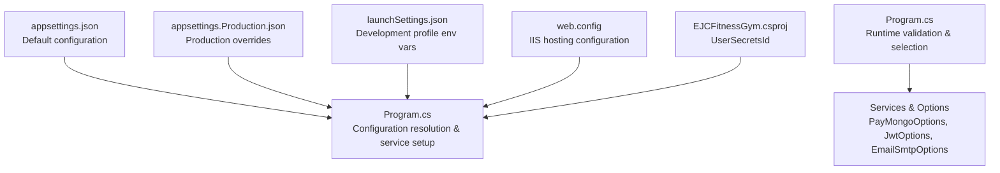
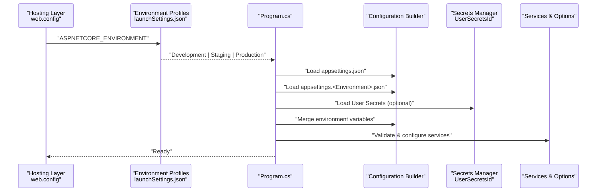
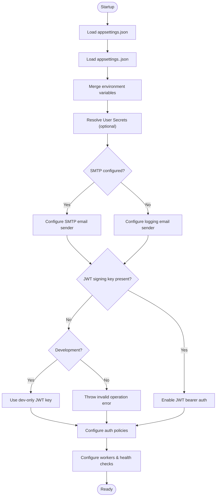
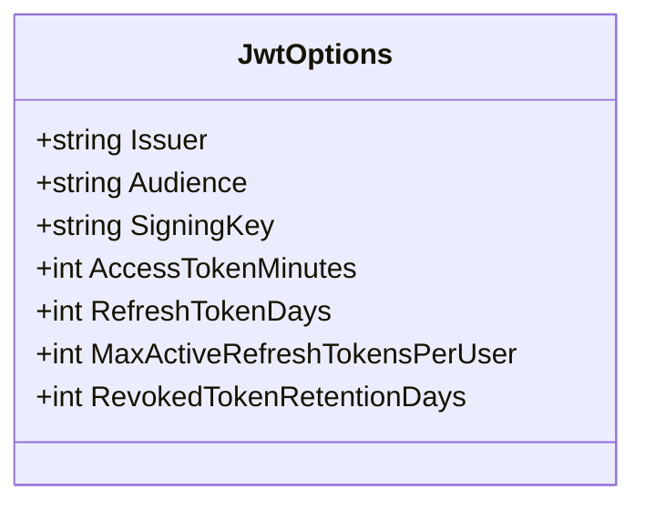
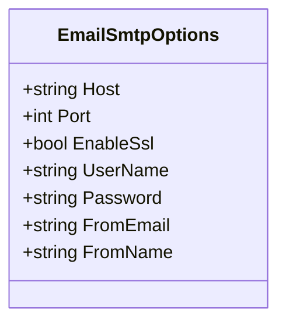
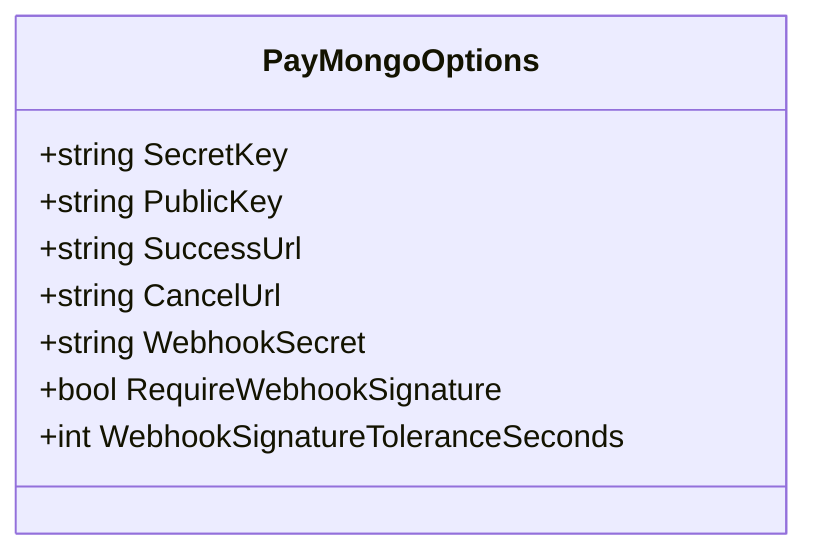
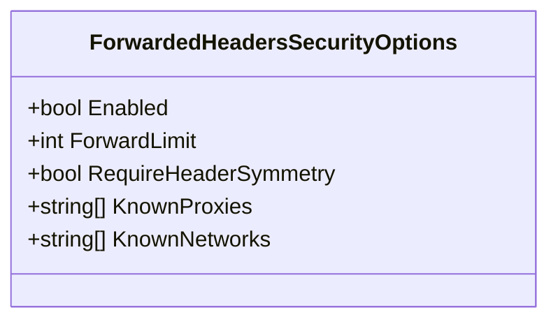
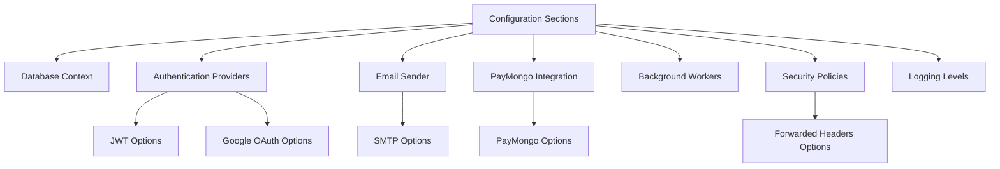

# Environment Configuration

<cite>
**Referenced Files in This Document**
- [appsettings.json](file://appsettings.json)
- [appsettings.Production.json](file://appsettings.Production.json)
- [Program.cs](file://Program.cs)
- [JwtOptions.cs](file://Security/JwtOptions.cs)
- [PayMongoOptions.cs](file://Services/Payments/PayMongoOptions.cs)
- [EmailSmtpOptions.cs](file://Services/Identity/EmailSmtpOptions.cs)
- [ForwardedHeadersSecurityOptions.cs](file://Services/Monitoring/ForwardedHeadersSecurityOptions.cs)
- [launchSettings.json](file://Properties/launchSettings.json)
- [web.config](file://web.config)
- [EJCFitnessGym.csproj](file://EJCFitnessGym.csproj)
</cite>

## Table of Contents
1. [Introduction](#introduction)
2. [Project Structure](#project-structure)
3. [Core Components](#core-components)
4. [Architecture Overview](#architecture-overview)
5. [Detailed Component Analysis](#detailed-component-analysis)
6. [Dependency Analysis](#dependency-analysis)
7. [Performance Considerations](#performance-considerations)
8. [Troubleshooting Guide](#troubleshooting-guide)
9. [Conclusion](#conclusion)

## Introduction
This document provides comprehensive environment configuration guidance for the EJC Fitness Gym system. It explains how configuration is organized across environments (development, staging, production), how appsettings.json defines connection strings, authentication, email, and service integrations, and how environment-specific overrides and secrets management are applied. It also documents logging, security settings, and operational health monitoring, along with best practices for managing sensitive configuration data and environment variable substitution.

## Project Structure
The configuration system centers on JSON-based settings files and runtime configuration resolution. Key elements:
- Root configuration: appsettings.json defines defaults for connections, identity, email, authentication providers, payment gateway, JWT, workers, and logging.
- Environment overrides: appsettings.Production.json provides production-specific values and stricter security defaults.
- Runtime composition: Program.cs reads configuration sections, applies environment-aware defaults, validates required secrets, and configures services accordingly.
- Supporting models: strongly typed option classes define the shape of configuration sections for PayMongo, JWT, SMTP, and forwarded headers.

**Diagram sources**
- [appsettings.json](file://appsettings.json)
- [appsettings.Production.json](file://appsettings.Production.json)
- [Program.cs](file://Program.cs)
- [launchSettings.json](file://Properties/launchSettings.json)
- [web.config](file://web.config)
- [EJCFitnessGym.csproj](file://EJCFitnessGym.csproj)

**Section sources**
- [appsettings.json](file://appsettings.json)
- [appsettings.Production.json](file://appsettings.Production.json)
- [Program.cs](file://Program.cs)
- [launchSettings.json](file://Properties/launchSettings.json)
- [web.config](file://web.config)
- [EJCFitnessGym.csproj](file://EJCFitnessGym.csproj)

## Core Components
This section outlines the primary configuration areas and their roles across environments.

- Connection strings
  - Default connection string targets a local SQL Server instance.
  - Production override replaces the default with a production database connection string.

- Application base URL
  - Public base URL is required in production for generating correct email links and redirects.

- Forwarded headers security
  - Controls trust and limits for proxies and networks; enabled by default in production.

- Identity and email
  - Require confirmed email behavior is environment-aware and depends on SMTP configuration.
  - SMTP settings define host, port, SSL, credentials, and sender identity.

- Authentication
  - Google OAuth: client ID and secret are environment-specific and validated in production.
  - JWT: issuer, audience, signing key, and token lifetimes are configurable; signing key is mandatory in production.

- Payment gateway (PayMongo)
  - Secret and public keys are required; webhook signature verification is enforced outside development.
  - Success and cancel URLs are configurable for hosted checkout flows.

- Workers and background tasks
  - Finance alerts evaluator, membership lifecycle worker, staff attendance auto-close, and auto billing are configured via dedicated sections.

- Operational health monitoring
  - Thresholds for pending and failed outbox items and webhook failures are defined for alerting.

- Logging
  - Default log level is informational; production reduces verbosity.

- Allowed hosts
  - Wildcard allowed by default; adjust per environment as needed.

**Section sources**
- [appsettings.json](file://appsettings.json)
- [appsettings.Production.json](file://appsettings.Production.json)

## Architecture Overview
The configuration architecture composes environment-specific settings at runtime, validates required secrets, and wires them into services and middleware.

**Diagram sources**
- [Program.cs](file://Program.cs)
- [launchSettings.json](file://Properties/launchSettings.json)
- [web.config](file://web.config)
- [EJCFitnessGym.csproj](file://EJCFitnessGym.csproj)

## Detailed Component Analysis

### Configuration Loading and Environment Resolution
- Default configuration is loaded from appsettings.json.
- Environment-specific overrides are loaded from appsettings.Production.json (and similar files for other environments).
- User secrets and environment variables can override values during development and production.
- Program.cs performs conditional logic to:
  - Select Google OAuth client secrets from development overrides when running against a local database.
  - Select PayMongo keys similarly for local development.
  - Enforce production requirements for JWT signing key, Google OAuth secrets, and PayMongo webhook signature.
  - Configure forwarded headers security based on environment and options.
  - Choose email sender implementation based on SMTP configuration presence.

**Diagram sources**
- [Program.cs](file://Program.cs)
- [appsettings.json](file://appsettings.json)
- [appsettings.Production.json](file://appsettings.Production.json)

**Section sources**
- [Program.cs](file://Program.cs)
- [appsettings.json](file://appsettings.json)
- [appsettings.Production.json](file://appsettings.Production.json)

### Connection Strings
- Default connection targets a local SQL Server instance.
- Production override replaces the default with a production database connection string.
- Ensure the connection string is updated per environment and secured appropriately.

**Section sources**
- [appsettings.json](file://appsettings.json)
- [appsettings.Production.json](file://appsettings.Production.json)

### Authentication Settings
- Google OAuth
  - Enabled by default; client ID and secret are required in production.
  - During development with a local database, client secrets can be resolved from development overrides.
- JWT
  - Issuer and audience are configurable; signing key is mandatory in production.
  - Program.cs enforces production requirements and falls back to a development-only key in development.

**Diagram sources**
- [JwtOptions.cs](file://Security/JwtOptions.cs)

**Section sources**
- [appsettings.json](file://appsettings.json)
- [appsettings.Production.json](file://appsettings.Production.json)
- [Program.cs](file://Program.cs)
- [JwtOptions.cs](file://Security/JwtOptions.cs)

### Email Configuration (SMTP)
- SMTP host, port, SSL, credentials, and sender identity are defined under Email.Smtp.
- Program.cs detects SMTP configuration and selects either an SMTP-based sender or a logging sender for development.
- App:PublicBaseUrl is required in production to generate correct links in emails.

**Diagram sources**
- [EmailSmtpOptions.cs](file://Services/Identity/EmailSmtpOptions.cs)

**Section sources**
- [appsettings.json](file://appsettings.json)
- [Program.cs](file://Program.cs)
- [EmailSmtpOptions.cs](file://Services/Identity/EmailSmtpOptions.cs)

### Service Integrations (PayMongo)
- PayMongo secret and public keys are required; webhook signature verification is enforced outside development.
- Success and cancel URLs are configurable for hosted checkout.
- Program.cs merges development overrides for PayMongo keys when using a local database and validates webhook signature requirements.

**Diagram sources**
- [PayMongoOptions.cs](file://Services/Payments/PayMongoOptions.cs)

**Section sources**
- [appsettings.json](file://appsettings.json)
- [appsettings.Production.json](file://appsettings.Production.json)
- [Program.cs](file://Program.cs)
- [PayMongoOptions.cs](file://Services/Payments/PayMongoOptions.cs)

### Logging Configuration
- Default log level is Information; Microsoft.AspNetCore logs are set to Warning.
- Production reduces default level to Warning and Microsoft.AspNetCore to Error.

**Section sources**
- [appsettings.json](file://appsettings.json)
- [appsettings.Production.json](file://appsettings.Production.json)

### Security Settings
- Forwarded headers security is configurable and enabled by default; production sets stricter defaults.
- Secure cookies behavior is environment-aware and enabled in production.
- CORS policy is configured based on the public base URL; development allows any origin while production restricts to the configured origin with credentials.

**Diagram sources**
- [ForwardedHeadersSecurityOptions.cs](file://Services/Monitoring/ForwardedHeadersSecurityOptions.cs)

**Section sources**
- [appsettings.json](file://appsettings.json)
- [appsettings.Production.json](file://appsettings.Production.json)
- [Program.cs](file://Program.cs)
- [ForwardedHeadersSecurityOptions.cs](file://Services/Monitoring/ForwardedHeadersSecurityOptions.cs)

### Feature Flags and Worker Management
- Finance alerts, evaluator, membership lifecycle worker, staff attendance auto-close, and auto billing are controlled via dedicated configuration sections.
- Each section includes toggles, scheduling intervals, and operational thresholds.

**Section sources**
- [appsettings.json](file://appsettings.json)

### Environment-Specific Overrides and Secrets Management
- appsettings.Production.json provides production overrides for connection strings, security, Google OAuth, PayMongo webhook signature enforcement, and logging verbosity.
- UserSecretsId in the project file enables local development secrets management.
- Environment variables and User Secrets can override values at runtime.

**Section sources**
- [appsettings.Production.json](file://appsettings.Production.json)
- [EJCFitnessGym.csproj](file://EJCFitnessGym.csproj)
- [Program.cs](file://Program.cs)

## Dependency Analysis
Configuration dependencies and their impact on services:

**Diagram sources**
- [Program.cs](file://Program.cs)
- [JwtOptions.cs](file://Security/JwtOptions.cs)
- [PayMongoOptions.cs](file://Services/Payments/PayMongoOptions.cs)
- [EmailSmtpOptions.cs](file://Services/Identity/EmailSmtpOptions.cs)
- [ForwardedHeadersSecurityOptions.cs](file://Services/Monitoring/ForwardedHeadersSecurityOptions.cs)

**Section sources**
- [Program.cs](file://Program.cs)

## Performance Considerations
- Keep logging levels appropriate for the environment to avoid excessive I/O.
- Use environment-specific connection strings and limit retries for background workers to prevent resource contention.
- Validate configuration early in startup to fail fast and reduce runtime overhead.

## Troubleshooting Guide
Common configuration issues and resolutions:
- Missing JWT signing key in production
  - Ensure Jwt:SigningKey is configured; otherwise, startup throws an invalid operation error.
- Google OAuth not working in production
  - Verify Authentication:Google:ClientId and Authentication:Google:ClientSecret are set in production.
- PayMongo webhook signature errors
  - Set PayMongo:WebhookSecret and ensure RequireWebhookSignature is enabled outside development.
- SMTP not sending emails
  - Confirm Email:Smtp:Host, UserName, Password, and FromEmail are configured; otherwise, a logging sender is used in development.
- Incorrect email links in production
  - Set App:PublicBaseUrl to a valid HTTPS URL to generate correct links.

**Section sources**
- [Program.cs](file://Program.cs)
- [appsettings.json](file://appsettings.json)
- [appsettings.Production.json](file://appsettings.Production.json)

## Conclusion
The EJC Fitness Gym configuration model leverages layered JSON settings with environment-specific overrides, runtime validation, and strong typing for critical options. By following the outlined practices—securing secrets, validating production requirements, and aligning logging and security settings—you can maintain reliable and secure deployments across development, staging, and production environments.