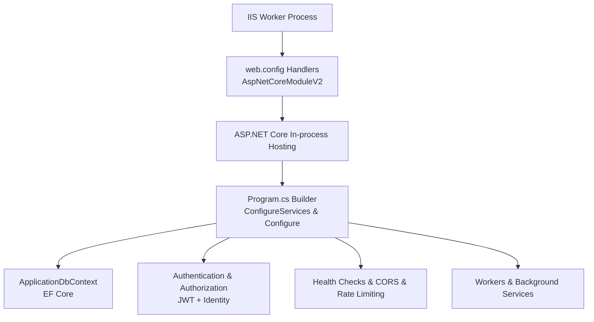
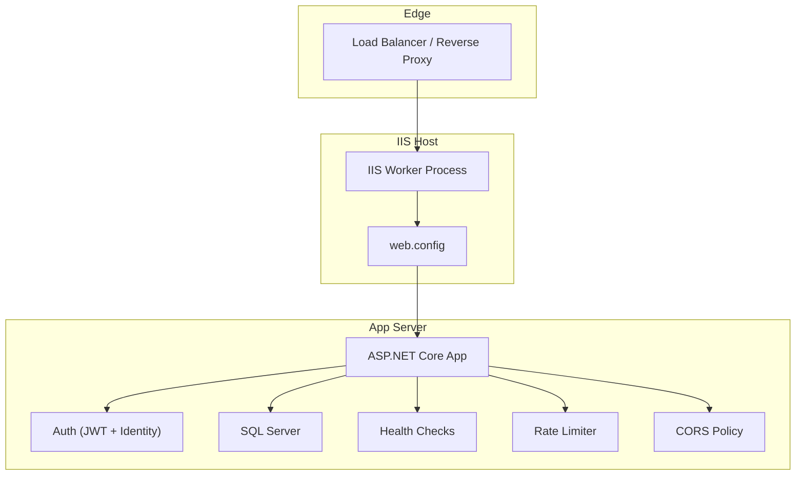
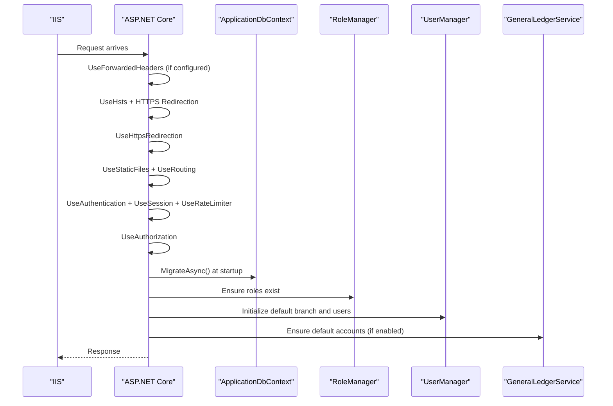
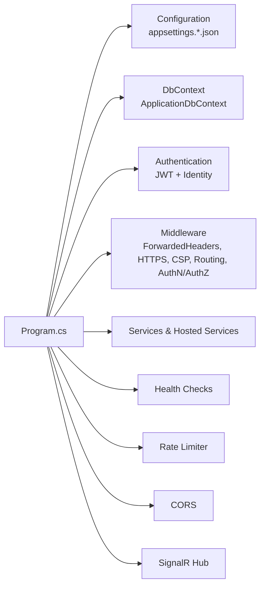

# Production Deployment

<cite>
**Referenced Files in This Document**
- [Program.cs](file://Program.cs)
- [web.config](file://web.config)
- [appsettings.json](file://appsettings.json)
- [appsettings.Production.json](file://appsettings.Production.json)
- [EJCFitnessGym.csproj](file://EJCFitnessGym.csproj)
- [site55020-OneClick.pubxml](file://Properties/PublishProfiles/site55020-OneClick.pubxml)
- [ApplicationDbContext.cs](file://Data/ApplicationDbContext.cs)
- [BranchScopeMiddleware.cs](file://Security/BranchScopeMiddleware.cs)
- [ForwardedHeadersSecurityConfigurator.cs](file://Services/Monitoring/ForwardedHeadersSecurityConfigurator.cs)
- [JwtOptions.cs](file://Security/JwtOptions.cs)
- [PayMongoOptions.cs](file://Services/Payments/PayMongoOptions.cs)
- [DatabaseSeeder.cs](file://Data/DatabaseSeeder.cs)
</cite>

## Table of Contents
1. [Introduction](#introduction)
2. [Project Structure](#project-structure)
3. [Core Components](#core-components)
4. [Architecture Overview](#architecture-overview)
5. [Detailed Component Analysis](#detailed-component-analysis)
6. [Dependency Analysis](#dependency-analysis)
7. [Performance Considerations](#performance-considerations)
8. [Troubleshooting Guide](#troubleshooting-guide)
9. [Conclusion](#conclusion)
10. [Appendices](#appendices)

## Introduction
This document provides end-to-end production deployment guidance for the EJC Fitness Gym system. It covers IIS deployment with web.config, application pool and virtual directory setup, reverse proxy configuration for load balancing and SSL termination, SSL certificate management and HTTPS enforcement, database deployment strategy including connection strings and migrations, publish profile configuration and automated deployment processes, and application startup configuration, service registration, and dependency injection setup for production environments.

## Project Structure
The application is a .NET 8 ASP.NET Core web application. Key deployment-related artifacts include:
- Application entry and DI configuration in Program.cs
- IIS hosting configuration via web.config
- Environment-specific configuration in appsettings.json and appsettings.Production.json
- Project metadata and package references in EJCFitnessGym.csproj
- One-click publish profile in Properties/PublishProfiles/site55020-OneClick.pubxml
- Database model and migrations under Data/
- Reverse proxy and forwarded headers support under Services/Monitoring and Security

**Diagram sources**
- [web.config:1-11](file://web.config#L1-L11)
- [Program.cs:32-473](file://Program.cs#L32-L473)
- [ApplicationDbContext.cs:12-414](file://Data/ApplicationDbContext.cs#L12-L414)

**Section sources**
- [web.config:1-11](file://web.config#L1-L11)
- [Program.cs:32-473](file://Program.cs#L32-L473)
- [EJCFitnessGym.csproj:1-37](file://EJCFitnessGym.csproj#L1-L37)

## Core Components
- IIS hosting and runtime: web.config configures AspNetCoreModuleV2 with in-process hosting and stdout logging.
- Configuration: appsettings.json defines defaults; appsettings.Production.json overrides production-sensitive values.
- Authentication: JWT bearer and external provider (Google) with cookie fallback; cookie security controlled by environment.
- Database: EF Core with SQL Server; migrations executed at startup; indexes and precision configured in ApplicationDbContext.
- Reverse proxy and HTTPS: forwarded headers handling and HTTPS redirection enforced in production.
- Workers and services: hosted services for billing, integrations, alerts, and attendance; SignalR hub registered.

**Section sources**
- [web.config:1-11](file://web.config#L1-L11)
- [appsettings.json:1-126](file://appsettings.json#L1-L126)
- [appsettings.Production.json:1-33](file://appsettings.Production.json#L1-L33)
- [Program.cs:56-407](file://Program.cs#L56-L407)
- [ApplicationDbContext.cs:43-411](file://Data/ApplicationDbContext.cs#L43-L411)

## Architecture Overview
The production runtime stack integrates IIS, ASP.NET Core, and SQL Server. Reverse proxies terminate TLS and forward client and protocol headers, which the application trusts via ForwardedHeaders middleware. Authentication supports JWT and cookie-based flows, with strict cookie policies in production. Background workers handle recurring tasks, and health checks expose operational readiness.

**Diagram sources**
- [web.config:1-11](file://web.config#L1-L11)
- [Program.cs:668-710](file://Program.cs#L668-L710)
- [ApplicationDbContext.cs:12-17](file://Data/ApplicationDbContext.cs#L12-L17)

## Detailed Component Analysis

### IIS Deployment and web.config
- Hosting model: in-process hosting with AspNetCoreModuleV2.
- Process path: dotnet with the built DLL.
- Logging: stdout log enabled with a logs directory.
- Handler: aspNetCore handles all requests.

Recommended IIS steps:
- Install ASP.NET Core Module.
- Create application pool targeting .NET 8.
- Enable “Load user profile” only if required by your environment.
- Set physical path to the published output folder.
- Bind site to HTTPS with a valid certificate.
- Ensure handler mapping includes the aspNetCore module.

**Section sources**
- [web.config:1-11](file://web.config#L1-L11)
- [EJCFitnessGym.csproj:4](file://EJCFitnessGym.csproj#L4)

### Application Pool and Virtual Directory Setup
- Application pool identity: use a dedicated identity with minimal permissions.
- Managed pipeline mode: integrated.
- .NET CLR version: No Managed Code (hosting is handled by AspNetCoreModuleV2).
- Load user profile: disable unless email delivery requires it.
- Preload enabled: optional, depending on cold-start tolerance.
- Virtual directory: point to the published application folder.

[No sources needed since this section provides general guidance]

### Reverse Proxy, Load Balancing, and SSL Termination
- ForwardedHeaders: enabled in production with KnownProxies/KnownNetworks configured to trust upstream proxies.
- HTTPS enforcement: UseHsts and HTTPS redirection are applied in non-development environments.
- Cookie security: Secure cookies enabled in production via configuration.

Operational notes:
- Configure the reverse proxy to append X-Forwarded-Proto and X-Forwarded-For.
- Whitelist only trusted proxy IPs/CIDRs in KnownProxies/KnownNetworks.
- Ensure the proxy does not rewrite or drop these headers.

**Section sources**
- [appsettings.Production.json:21-26](file://appsettings.Production.json#L21-L26)
- [ForwardedHeadersSecurityConfigurator.cs:9-73](file://Services/Monitoring/ForwardedHeadersSecurityConfigurator.cs#L9-L73)
- [Program.cs:668-684](file://Program.cs#L668-L684)

### SSL Certificate Management and HTTPS Enforcement
- HTTPS redirection is enabled in production.
- HSTS is enabled in production.
- Cookie SecurePolicy is set to Always in production.
- Configure IIS bindings to HTTPS with a trusted certificate.

Best practices:
- Use a certificate issued by a public CA or enterprise PKI.
- Enforce TLS 1.2+.
- Disable insecure protocols and ciphers.
- Renew certificates before expiry and automate renewal.

**Section sources**
- [appsettings.Production.json:5-7](file://appsettings.Production.json#L5-L7)
- [Program.cs:271-278](file://Program.cs#L271-L278)
- [Program.cs:684](file://Program.cs#L684)

### Database Deployment Strategy
- Connection string: configured via DefaultConnection; replace with production SQL Server connection string.
- EF Core: DbContext registered with SQL Server provider and auditing interceptor.
- Migrations: executed automatically at startup in Program.cs.
- Indexes and precision: configured in ApplicationDbContext for financial and audit fields.
- Optional seed data: inventory and equipment assets seeded during initialization.

Deployment steps:
- Provision SQL Server (on-premises or managed).
- Create database and credentials.
- Replace DefaultConnection with a connection string pointing to the production database.
- Ensure the application identity has permissions to connect and alter schema.
- Run migrations (they execute at startup; alternatively, run ef migrations locally and deploy).

**Section sources**
- [appsettings.Production.json:2-4](file://appsettings.Production.json#L2-L4)
- [Program.cs:57-61](file://Program.cs#L57-L61)
- [Program.cs:720-727](file://Program.cs#L720-L727)
- [ApplicationDbContext.cs:43-411](file://Data/ApplicationDbContext.cs#L43-L411)
- [DatabaseSeeder.cs:10-113](file://Data/DatabaseSeeder.cs#L10-L113)

### Publish Profiles and Automated Deployment
- One-click publish profile: site55020-OneClick.pubxml uses MSDeploy with WMSVC and app offline mode.
- Target framework: net8.0.
- Self-contained: false.
- Launch after publish: enabled.

Automated deployment approaches:
- Azure DevOps or GitHub Actions: define build and release pipelines to publish to IIS.
- PowerShell or CLI: msdeploy or dotnet publish with appropriate parameters.
- Blue/green deployments: deploy to a staging site, validate, switch DNS/IIS binding, then recycle the previous site.

**Section sources**
- [site55020-OneClick.pubxml:1-26](file://Properties/PublishProfiles/site55020-OneClick.pubxml#L1-L26)
- [EJCFitnessGym.csproj:4](file://EJCFitnessGym.csproj#L4)

### Application Startup, Service Registration, and Dependency Injection
- Environment-aware logging: suppress Windows Event Log writes in production if the hosting identity cannot write.
- Authentication:
  - JWT bearer enabled when signing key is present; otherwise cookie-based sign-in remains available.
  - Google OAuth supported when client ID/secret are configured.
- Authorization: role-based policies with branch-scoped assertions.
- CORS: configured per environment; production allows credentials for the configured public base URL.
- Rate limiting: fixed window policies for authenticated and anonymous clients.
- Sessions: distributed memory cache with session state for POS cart.
- Health checks: self-health and operational readiness check.
- Workers: hosted services for integration dispatch, membership lifecycle, finance alert evaluation, staff attendance auto-close, and auto billing.
- SignalR hub: real-time ERP events publisher.

**Diagram sources**
- [Program.cs:668-776](file://Program.cs#L668-L776)
- [ApplicationDbContext.cs:12-17](file://Data/ApplicationDbContext.cs#L12-L17)

**Section sources**
- [Program.cs:34-38](file://Program.cs#L34-L38)
- [Program.cs:87-105](file://Program.cs#L87-L105)
- [Program.cs:114-169](file://Program.cs#L114-L169)
- [Program.cs:199-270](file://Program.cs#L199-L270)
- [Program.cs:315-343](file://Program.cs#L315-L343)
- [Program.cs:409-437](file://Program.cs#L409-L437)
- [Program.cs:439-456](file://Program.cs#L439-L456)
- [Program.cs:459-466](file://Program.cs#L459-L466)
- [Program.cs:386-395](file://Program.cs#L386-L395)
- [Program.cs:370-374](file://Program.cs#L370-L374)
- [Program.cs:395](file://Program.cs#L395)

### Branch Scope Middleware and Access Control
- Middleware enforces branch assignment for back-office routes.
- Returns JSON error for API requests and plain text for page requests when missing scope.
- Exempts specific paths (e.g., user branch assignment).

**Section sources**
- [BranchScopeMiddleware.cs:14-53](file://Security/BranchScopeMiddleware.cs#L14-L53)

### JWT and External Authentication Options
- JwtOptions: issuer, audience, signing key, token durations, refresh token limits.
- PayMongoOptions: secret/public keys, webhook secret, signature requirements.

**Section sources**
- [JwtOptions.cs:3-12](file://Security/JwtOptions.cs#L3-L12)
- [PayMongoOptions.cs:3-12](file://Services/Payments/PayMongoOptions.cs#L3-L12)

## Dependency Analysis
The application registers services and middleware in a specific order. The following diagram shows key dependencies among startup components.

**Diagram sources**
- [Program.cs:56-407](file://Program.cs#L56-L407)
- [ApplicationDbContext.cs:12-17](file://Data/ApplicationDbContext.cs#L12-L17)

**Section sources**
- [Program.cs:56-407](file://Program.cs#L56-L407)

## Performance Considerations
- Use in-process hosting with AspNetCoreModuleV2 for lower latency.
- Enable gzip/deflate compression at the reverse proxy or IIS level.
- Configure application warm-up to reduce first-request latency.
- Use a dedicated application pool with minimal worker processes for predictable performance.
- Monitor database queries and indexes; ensure proper indexing for high-volume endpoints.
- Tune rate limiter windows and queue limits based on traffic patterns.
- Use distributed cache for session state and shared caches where applicable.

[No sources needed since this section provides general guidance]

## Troubleshooting Guide
Common production issues and resolutions:
- HTTPS and cookies not working behind a proxy:
  - Verify X-Forwarded-Proto/X-Forwarded-For are set by the proxy.
  - Configure KnownProxies/KnownNetworks appropriately.
  - Ensure UseHsts and HTTPS redirection are active in production.
- Database migration errors:
  - Check connectivity and permissions for the application identity.
  - Review startup logs for migration exceptions.
- Authentication failures:
  - Confirm JWT signing key is configured in production.
  - Validate Google OAuth client ID/secret if enabled.
- CORS errors:
  - Ensure the configured public base URL matches the origin used by the SPA.
- Reverse proxy header misconfiguration:
  - If redirects loop, review header symmetry and trusted networks.

**Section sources**
- [Program.cs:668-684](file://Program.cs#L668-L684)
- [ForwardedHeadersSecurityConfigurator.cs:29-73](file://Services/Monitoring/ForwardedHeadersSecurityConfigurator.cs#L29-L73)
- [Program.cs:720-727](file://Program.cs#L720-L727)
- [appsettings.Production.json:17-20](file://appsettings.Production.json#L17-L20)

## Conclusion
This guide outlines a robust production deployment for EJC Fitness Gym, covering IIS hosting, reverse proxy and SSL configuration, database strategy, publishing, and runtime setup. By following the outlined steps—especially around forwarded headers, HTTPS enforcement, and service registration—you can achieve a secure, scalable, and maintainable deployment.

[No sources needed since this section summarizes without analyzing specific files]

## Appendices

### Configuration Reference
- ConnectionStrings.DefaultConnection: Replace with production SQL Server connection string.
- App.PublicBaseUrl: Must be set in production for correct email links and redirects.
- Security.UseSecureCookies: Enable in production.
- Identity.RequireConfirmedEmail: Enable in production.
- Authentication.Google: Provide ClientId and ClientSecret in production.
- PayMongo: Provide SecretKey, PublicKey, and WebhookSecret in production; RequireWebhookSignature recommended.
- ForwardedHeaders: Configure KnownProxies/KnownNetworks to trust your reverse proxy.

**Section sources**
- [appsettings.json:2-4, 5-7, 16-18, 37-44, 45-53, 108-117:2-53](file://appsettings.json#L2-L53)
- [appsettings.Production.json:2-4, 5-7, 8-10, 11-20, 21-26:2-33](file://appsettings.Production.json#L2-L33)