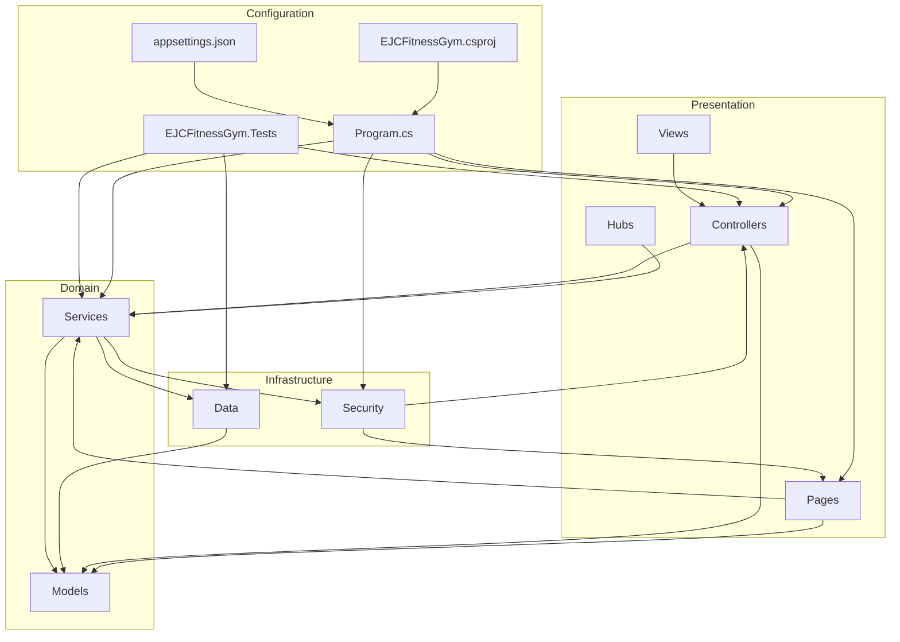
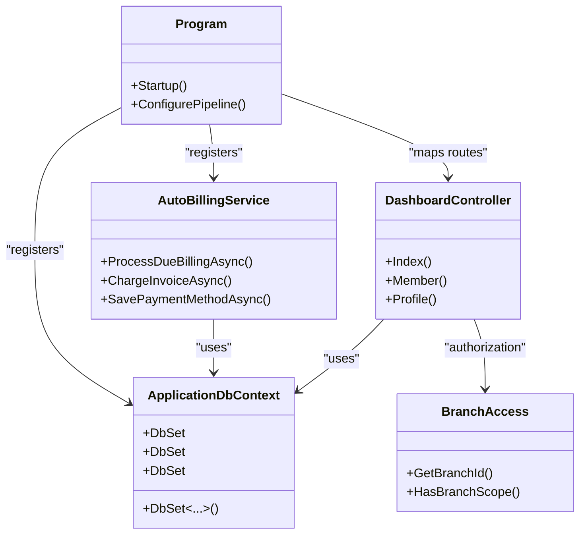
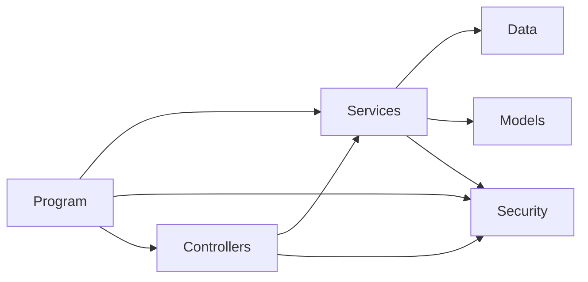

# Development Guidelines

<cite>
**Referenced Files in This Document**
- [README.md](file://README.md)
- [EJCFitnessGym.csproj](file://EJCFitnessGym.csproj)
- [Program.cs](file://Program.cs)
- [appsettings.json](file://appsettings.json)
- [AGENTS.md](file://AGENTS.md)
- [EJCFitnessGym.Tests/EJCFitnessGym.Tests.csproj](file://EJCFitnessGym.Tests/EJCFitnessGym.Tests.csproj)
- [Data/ApplicationDbContext.cs](file://Data/ApplicationDbContext.cs)
- [Services/Payments/AutoBillingService.cs](file://Services/Payments/AutoBillingService.cs)
- [Services/Monitoring/OperationalReadinessHealthCheck.cs](file://Services/Monitoring/OperationalReadinessHealthCheck.cs)
- [Security/BranchAccess.cs](file://Security/BranchAccess.cs)
- [Models/Billing/Invoice.cs](file://Models/Billing/Invoice.cs)
- [Controllers/DashboardController.cs](file://Controllers/DashboardController.cs)
- [Properties/launchSettings.json](file://Properties/launchSettings.json)
</cite>

## Table of Contents
1. [Introduction](#introduction)
2. [Project Structure](#project-structure)
3. [Core Components](#core-components)
4. [Architecture Overview](#architecture-overview)
5. [Detailed Component Analysis](#detailed-component-analysis)
6. [Dependency Analysis](#dependency-analysis)
7. [Performance Considerations](#performance-considerations)
8. [Troubleshooting Guide](#troubleshooting-guide)
9. [Conclusion](#conclusion)
10. [Appendices](#appendices)

## Introduction
This document defines comprehensive development guidelines for the EJC Fitness Gym system. It consolidates coding standards, architectural patterns, testing practices, contribution workflows, dependency management, debugging and local setup, code quality tooling, and release management. The system is an enterprise-grade ASP.NET Core 8.0 application integrating Identity, JWT, SignalR, PayMongo, and Entity Framework Core with a layered architecture and multi-branch scoping.

## Project Structure
The repository follows a feature-layered organization with clear separation of concerns:
- Areas/Identity: Identity UI and pages
- Controllers: MVC controllers and API endpoints
- Data: DbContext, migrations, and seeders
- Models: Entities and view models
- Pages: Razor Pages for UI
- Services: Business logic modules (Finance, Inventory, Payments, Monitoring, AI, Staff, etc.)
- Security: Authentication, authorization, and middleware
- Hubs: SignalR hubs for real-time events
- EJCFitnessGym.Tests: xUnit test suite
- wwwroot: Static assets
- Root configuration: Program.cs, appsettings.json, project file, AGENTS.md

**Diagram sources**
- [Program.cs:32-473](file://Program.cs#L32-L473)
- [EJCFitnessGym.csproj:1-37](file://EJCFitnessGym.csproj#L1-L37)
- [appsettings.json:1-126](file://appsettings.json#L1-L126)

**Section sources**
- [README.md:77-87](file://README.md#L77-L87)
- [Program.cs:32-473](file://Program.cs#L32-L473)
- [EJCFitnessGym.csproj:1-37](file://EJCFitnessGym.csproj#L1-L37)
- [appsettings.json:1-126](file://appsettings.json#L1-L126)

## Core Components
- Application startup and DI registration are centralized in Program.cs, including authentication (JWT and Google), authorization policies, CORS, rate limiting, SignalR, hosted services, health checks, and session management.
- Data access is encapsulated in ApplicationDbContext with strongly typed entity sets and precision/index configurations.
- Services implement domain capabilities such as auto-billing, finance alerts, inventory, staff attendance, and AI insights.
- Controllers orchestrate user interactions, enforce authorization, and delegate to services and repositories.
- Security utilities provide branch-scoped access checks and middleware integration.
- Configuration is managed via strongly typed options and appsettings.json.

**Section sources**
- [Program.cs:56-473](file://Program.cs#L56-L473)
- [Data/ApplicationDbContext.cs:12-414](file://Data/ApplicationDbContext.cs#L12-L414)
- [Services/Payments/AutoBillingService.cs:44-463](file://Services/Payments/AutoBillingService.cs#L44-L463)
- [Controllers/DashboardController.cs:22-52](file://Controllers/DashboardController.cs#L22-L52)
- [Security/BranchAccess.cs:5-31](file://Security/BranchAccess.cs#L5-L31)
- [appsettings.json:1-126](file://appsettings.json#L1-L126)

## Architecture Overview
The system employs a layered architecture:
- Presentation: Controllers and Pages
- Domain: Models and Services
- Infrastructure: Data (EF Core) and Security
- Configuration: Program.cs and appsettings.json

**Diagram sources**
- [Program.cs:32-473](file://Program.cs#L32-L473)
- [Data/ApplicationDbContext.cs:12-41](file://Data/ApplicationDbContext.cs#L12-L41)
- [Services/Payments/AutoBillingService.cs:44-67](file://Services/Payments/AutoBillingService.cs#L44-L67)
- [Controllers/DashboardController.cs:38-52](file://Controllers/DashboardController.cs#L38-L52)
- [Security/BranchAccess.cs:9-28](file://Security/BranchAccess.cs#L9-L28)

## Detailed Component Analysis

### Coding Standards and Conventions
- Naming conventions:
  - Classes, methods, properties: PascalCase
  - Private fields: camelCase prefixed with underscore
  - Constants: PascalCase
  - Files: match class name exactly
- Using directives:
  - Group system, external, internal namespaces with blank lines
  - EJCFitnessGym.* namespaces at the bottom
  - Enable nullable globally per AGENTS.md
- Async/await:
  - Methods ending with Async suffix
  - CancellationToken with default value
  - Prefer Task/T as return types
- Error handling:
  - Try-catch around external calls
  - Use ILogger for logging
  - Return meaningful responses/API errors
  - Use Result patterns or exceptions appropriately
- Entity Framework:
  - Async database operations
  - AsNoTracking for read-only
  - Include for eager loading when needed
  - IQueryable for composability
- Security:
  - Authorize attributes on endpoints
  - Role-based authorization with policies
  - JWT for API auth
  - Validate inputs
  - HTTPS in production
- Configuration:
  - IOptions<T> for configuration objects
  - Strongly typed configuration classes
  - Secrets via user secrets/environment variables
  - Configuration sections for related settings

**Section sources**
- [AGENTS.md:76-130](file://AGENTS.md#L76-L130)

### Project Structure Guidelines and Folder Organization
- Keep related files together (e.g., Services, Models, Pages for the same feature)
- Namespaces should align with folder structure
- Tests reside under EJCFitnessGym.Tests with project reference to main project
- Partial classes are acceptable for large page models

**Section sources**
- [AGENTS.md:201-208](file://AGENTS.md#L201-L208)
- [EJCFitnessGym.Tests/EJCFitnessGym.Tests.csproj:21-27](file://EJCFitnessGym.Tests/EJCFitnessGym.Tests.csproj#L21-L27)

### Testing Best Practices
- Framework: xUnit
- Unit vs integration:
  - Use in-memory database for EF Core tests
  - Mock external dependencies (HTTP clients, services)
- Test naming:
  - Use descriptive fact names indicating scenario and expected outcome
  - Example patterns: [Feature]_[Scenario]_[ExpectedOutcome]
- Execution:
  - Run all tests, filter by class, watch mode
  - Collect coverage via XPlat Code Coverage
- Test examples:
  - Controller redirection tests demonstrate Arrange-Act-Assert pattern
  - Service tests validate business logic and error conditions

**Section sources**
- [EJCFitnessGym.Tests/EJCFitnessGym.Tests.csproj:10-19](file://EJCFitnessGym.Tests/EJCFitnessGym.Tests.csproj#L10-L19)
- [AGENTS.md:124-130](file://AGENTS.md#L124-L130)
- [EJCFitnessGym.Tests/DashboardControllerTests.cs:11-31](file://EJCFitnessGym.Tests/DashboardControllerTests.cs#L11-L31)

### Contribution Guidelines
- Branching strategy:
  - Feature branches per task
  - Rebase or merge with main before pull requests
- Commit messages:
  - Imperative mood, concise subject line
  - Reference issue numbers when applicable
- Code review:
  - Enforce style and architecture consistency
  - Verify tests pass and coverage maintained
- Pull requests:
  - Include testing plan and impact assessment
  - Ensure build succeeds and migrations are up-to-date

[No sources needed since this section provides general guidance]

### Dependency Management and Version Compatibility
- Target framework: net8.0
- ASP.NET Core packages aligned to 8.0.23
- Entity Framework Core SQL Server provider
- Identity, diagnostics, SignalR, ML, OpenAI integrations
- Exclude test assemblies from main build output
- Package versions pinned for stability

**Section sources**
- [EJCFitnessGym.csproj:3-22](file://EJCFitnessGym.csproj#L3-L22)
- [EJCFitnessGym.csproj:24-34](file://EJCFitnessGym.csproj#L24-L34)

### Debugging Techniques and Local Development Setup
- Launch profiles:
  - http, https, and IIS Express profiles with environment variable for Development
- Startup behavior:
  - Automatic migrations on startup
  - Seed roles, default branch, and GL accounts during initialization
  - Health checks and operational readiness monitoring
- Bulk repair argument:
  - Command-line argument to repair PayMongo reconciliation issues
- Environment-specific behavior:
  - Event log filtering in non-Dev Windows environments
  - Secure cookies and forwarded headers configuration
- Rate limiting and security headers:
  - Fixed window limiter policies
  - Content-Security-Policy header applied

**Section sources**
- [Properties/launchSettings.json:11-38](file://Properties/launchSettings.json#L11-L38)
- [Program.cs:710-799](file://Program.cs#L710-L799)
- [Program.cs:481-665](file://Program.cs#L481-L665)
- [Program.cs:673-708](file://Program.cs#L673-L708)
- [Program.cs:439-456](file://Program.cs#L439-L456)
- [Program.cs:686-698](file://Program.cs#L686-L698)

### Code Quality Tools and Static Analysis
- Recommended tools:
  - EditorConfig and IDE analyzers for style enforcement
  - SonarQube or Azure DevOps for static analysis
  - Coverlet for test coverage collection
- Configuration:
  - Use nullable enable and consistent async patterns
  - Maintain strong typing for configuration via IOptions<T>

**Section sources**
- [AGENTS.md:86-91](file://AGENTS.md#L86-L91)
- [EJCFitnessGym.Tests/EJCFitnessGym.Tests.csproj:11-18](file://EJCFitnessGym.Tests/EJCFitnessGym.Tests.csproj#L11-L18)

### Continuous Integration Requirements
- CI pipeline should:
  - Restore dependencies
  - Build project for net8.0
  - Run tests with coverage collection
  - Validate migrations and database connectivity
  - Publish artifacts and run health checks

**Section sources**
- [AGENTS.md:28-41](file://AGENTS.md#L28-L41)

### Release Management and Versioning
- Versioning strategy:
  - Semantic versioning (MAJOR.MINOR.PATCH)
  - MAJOR for breaking changes, MINOR for features, PATCH for fixes
- Release process:
  - Tag releases on main branch
  - Publish artifacts and update changelog
  - Validate production configuration and secrets

**Section sources**
- [README.md:1-91](file://README.md#L1-L91)

## Dependency Analysis
The system exhibits low coupling and high cohesion:
- Controllers depend on services and models
- Services depend on DbContext and external clients
- Security utilities are injected into middleware and controllers
- Health checks monitor operational readiness

**Diagram sources**
- [Program.cs:363-385](file://Program.cs#L363-L385)
- [Controllers/DashboardController.cs:38-52](file://Controllers/DashboardController.cs#L38-L52)
- [Data/ApplicationDbContext.cs:12-41](file://Data/ApplicationDbContext.cs#L12-L41)
- [Security/BranchAccess.cs:5-31](file://Security/BranchAccess.cs#L5-L31)

**Section sources**
- [Program.cs:363-385](file://Program.cs#L363-L385)
- [Controllers/DashboardController.cs:38-52](file://Controllers/DashboardController.cs#L38-L52)
- [Data/ApplicationDbContext.cs:12-41](file://Data/ApplicationDbContext.cs#L12-L41)
- [Security/BranchAccess.cs:5-31](file://Security/BranchAccess.cs#L5-L31)

## Performance Considerations
- Use async database operations and AsNoTracking for read-heavy queries
- Leverage indexes defined in ApplicationDbContext for efficient filtering
- Batch processing for auto-billing and integration outbox
- Minimize payload sizes and enable compression
- Monitor health checks and alert thresholds for operational readiness

**Section sources**
- [Data/ApplicationDbContext.cs:77-85](file://Data/ApplicationDbContext.cs#L77-L85)
- [Services/Payments/AutoBillingService.cs:69-84](file://Services/Payments/AutoBillingService.cs#L69-L84)
- [Services/Monitoring/OperationalReadinessHealthCheck.cs:51-77](file://Services/Monitoring/OperationalReadinessHealthCheck.cs#L51-L77)

## Troubleshooting Guide
- Startup failures:
  - Review logs for migration failures and initialization errors
  - Ensure database connectivity and correct connection string
- Authentication issues:
  - Verify JWT signing key and audience/issuer configuration
  - Confirm Google OAuth client credentials for non-Dev environments
- PayMongo reconciliation:
  - Use the bulk repair argument to reconcile pending payments and unpaid invoices
- Operational readiness:
  - Inspect health check results for database connectivity, outbox counts, and webhook receipts
- CORS and cookies:
  - Validate PublicBaseUrl and cookie security settings for production

**Section sources**
- [Program.cs:716-727](file://Program.cs#L716-L727)
- [Program.cs:107-105](file://Program.cs#L107-L105)
- [Program.cs:171-197](file://Program.cs#L171-L197)
- [Program.cs:481-665](file://Program.cs#L481-L665)
- [Services/Monitoring/OperationalReadinessHealthCheck.cs:25-127](file://Services/Monitoring/OperationalReadinessHealthCheck.cs#L25-L127)
- [appsettings.json:45-53](file://appsettings.json#L45-L53)

## Conclusion
These guidelines establish a consistent, scalable development process for the EJC Fitness Gym system. By adhering to the documented conventions, testing practices, and operational procedures, contributors can maintain code quality, reliability, and alignment with the enterprise-grade architecture.

## Appendices
- Build and development commands:
  - Restore, build, run, EF database update, EF migrations
- Testing commands:
  - Run all tests, run with coverage, filter by class, watch mode
- Database commands:
  - Update, drop, manual seeding via initialization

**Section sources**
- [AGENTS.md:5-54](file://AGENTS.md#L5-L54)