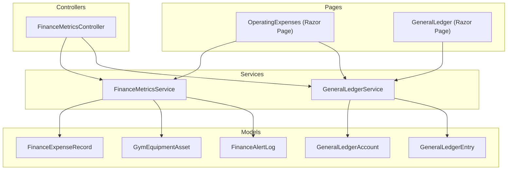
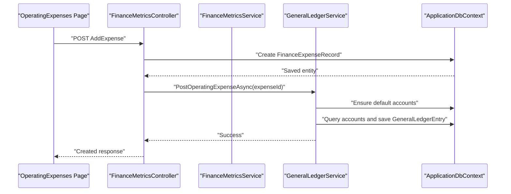
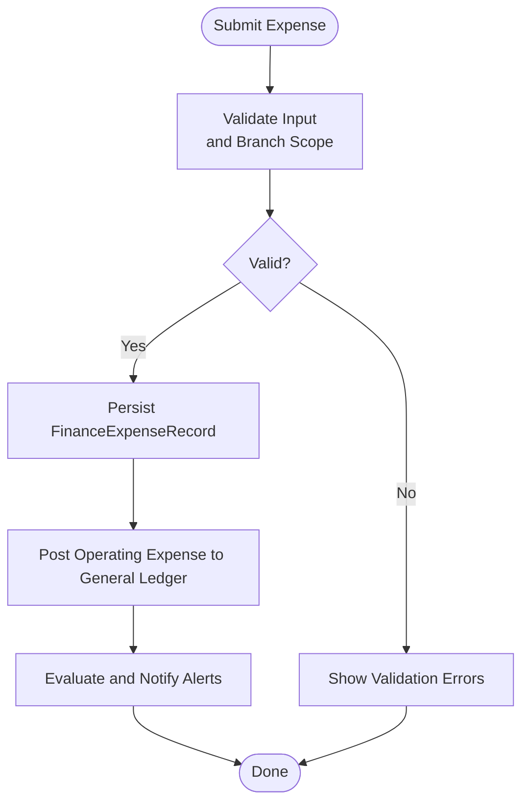
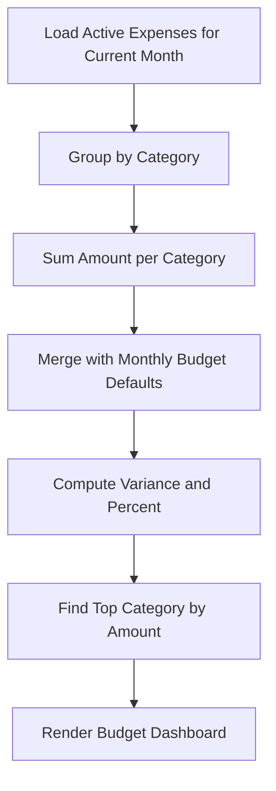
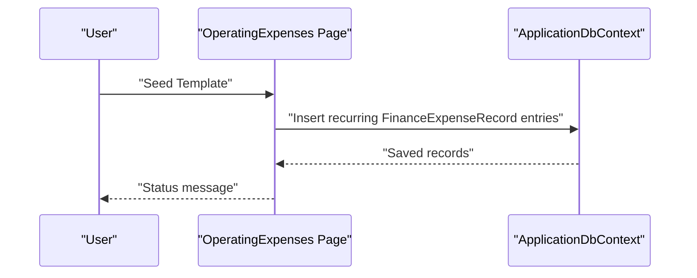
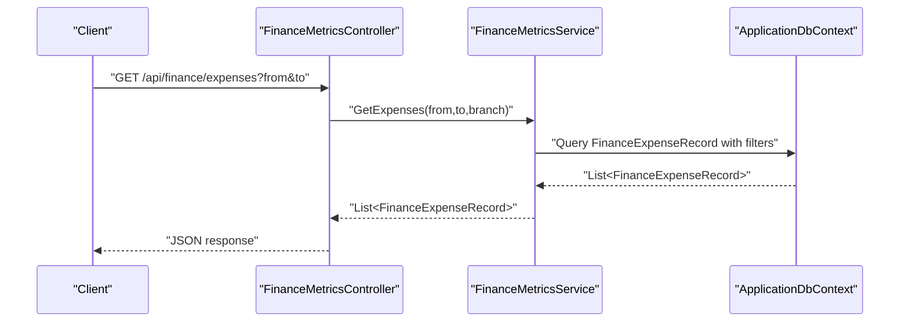
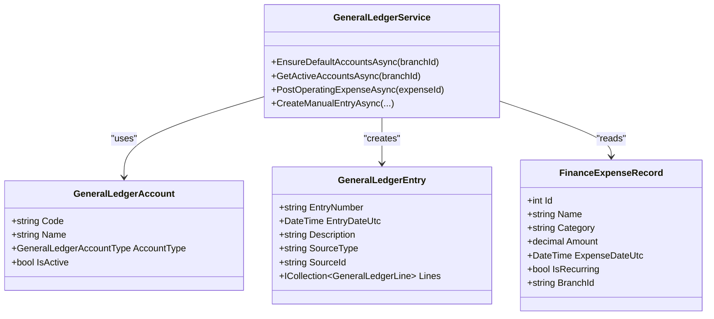
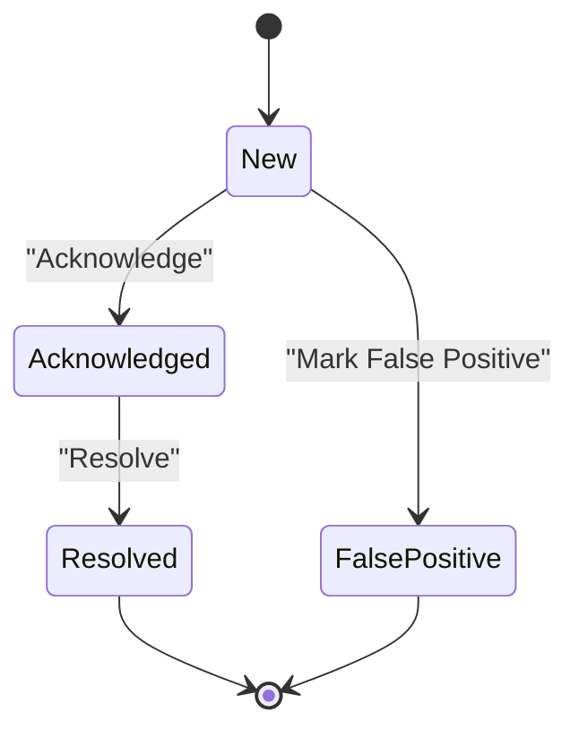
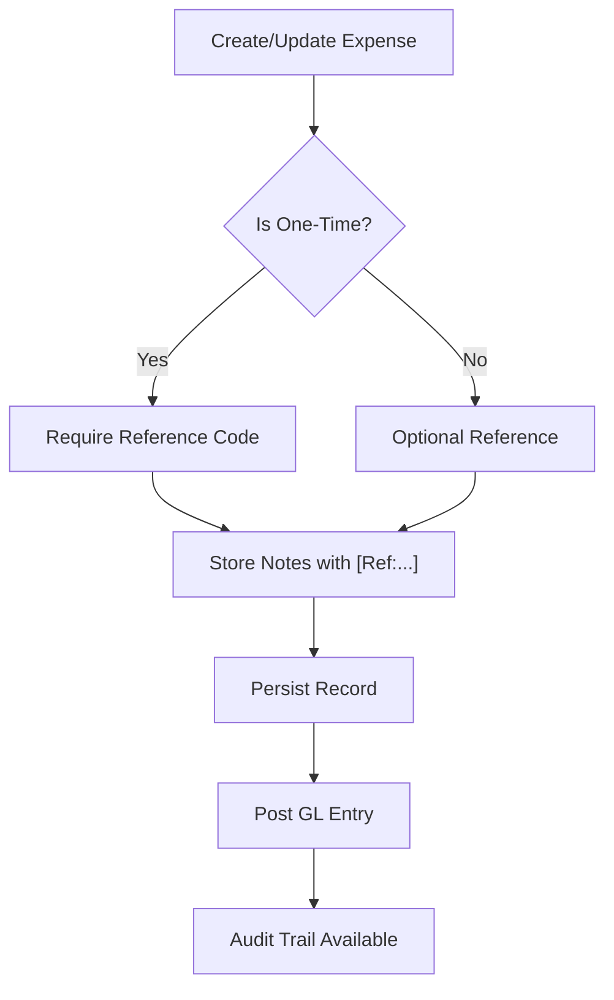
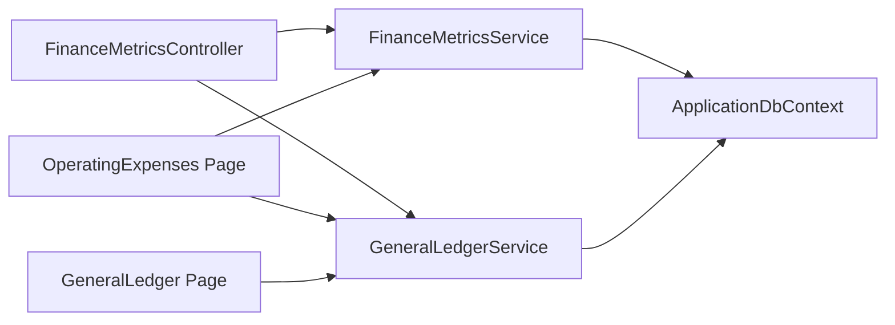

# Expense Tracking System

<cite>
**Referenced Files in This Document**
- [FinanceExpenseRecord.cs](file://Models/Finance/FinanceExpenseRecord.cs)
- [GeneralLedgerAccount.cs](file://Models/Finance/GeneralLedgerAccount.cs)
- [GeneralLedgerEntry.cs](file://Models/Finance/GeneralLedgerEntry.cs)
- [OperatingExpenses.cshtml.cs](file://Pages/Finance/OperatingExpenses.cshtml.cs)
- [GeneralLedger.cshtml.cs](file://Pages/Finance/GeneralLedger.cshtml.cs)
- [FinanceMetricsController.cs](file://Controllers/FinanceMetricsController.cs)
- [FinanceMetricsService.cs](file://Services/Finance/FinanceMetricsService.cs)
- [GeneralLedgerService.cs](file://Services/Finance/GeneralLedgerService.cs)
- [FinanceAlertLog.cs](file://Models/Finance/FinanceAlertLog.cs)
- [GymEquipmentAsset.cs](file://Models/Finance/GymEquipmentAsset.cs)
</cite>

## Table of Contents
1. [Introduction](#introduction)
2. [Project Structure](#project-structure)
3. [Core Components](#core-components)
4. [Architecture Overview](#architecture-overview)
5. [Detailed Component Analysis](#detailed-component-analysis)
6. [Dependency Analysis](#dependency-analysis)
7. [Performance Considerations](#performance-considerations)
8. [Troubleshooting Guide](#troubleshooting-guide)
9. [Conclusion](#conclusion)

## Introduction
This document describes the comprehensive expense tracking system within the fitness gym ERP. It covers expense categorization, recording workflows, recurring expense tracking, reporting capabilities, integration with the general ledger, approval and budget monitoring features, and audit/compliance support. The system supports operating expenses, equipment-related costs, and integrates with the general ledger for automated accounting entries.

## Project Structure
The expense tracking system spans models, services, controllers, and Razor pages under the Finance domain. Key areas:
- Models define the persisted entities for expenses, general ledger accounts and entries, alerts, and equipment assets.
- Services encapsulate business logic for metrics, general ledger posting, and alert lifecycle management.
- Controllers expose APIs for expense creation and alert management.
- Razor pages provide UI for creating, viewing, and managing operating expenses and general ledger views.

**Diagram sources**
- [FinanceExpenseRecord.cs:1-37](file://Models/Finance/FinanceExpenseRecord.cs#L1-L37)
- [GeneralLedgerAccount.cs:1-40](file://Models/Finance/GeneralLedgerAccount.cs#L1-L40)
- [GeneralLedgerEntry.cs:1-58](file://Models/Finance/GeneralLedgerEntry.cs#L1-L58)
- [FinanceMetricsService.cs:1-826](file://Services/Finance/FinanceMetricsService.cs#L1-L826)
- [GeneralLedgerService.cs:1-616](file://Services/Finance/GeneralLedgerService.cs#L1-L616)
- [FinanceMetricsController.cs:1-693](file://Controllers/FinanceMetricsController.cs#L1-L693)
- [OperatingExpenses.cshtml.cs:1-574](file://Pages/Finance/OperatingExpenses.cshtml.cs#L1-L574)
- [GeneralLedger.cshtml.cs:1-406](file://Pages/Finance/GeneralLedger.cshtml.cs#L1-L406)
- [FinanceAlertLog.cs:1-60](file://Models/Finance/FinanceAlertLog.cs#L1-L60)
- [GymEquipmentAsset.cs:1-44](file://Models/Finance/GymEquipmentAsset.cs#L1-L44)

**Section sources**
- [FinanceExpenseRecord.cs:1-37](file://Models/Finance/FinanceExpenseRecord.cs#L1-L37)
- [GeneralLedgerService.cs:1-616](file://Services/Finance/GeneralLedgerService.cs#L1-L616)
- [FinanceMetricsService.cs:1-826](file://Services/Finance/FinanceMetricsService.cs#L1-L826)
- [FinanceMetricsController.cs:1-693](file://Controllers/FinanceMetricsController.cs#L1-L693)
- [OperatingExpenses.cshtml.cs:1-574](file://Pages/Finance/OperatingExpenses.cshtml.cs#L1-L574)
- [GeneralLedger.cshtml.cs:1-406](file://Pages/Finance/GeneralLedger.cshtml.cs#L1-L406)

## Core Components
- Expense model: Stores name, category, amount, date, recurrence flag, branch scoping, and audit timestamps.
- General ledger models: Accounts, entries, and lines with standardized chart of accounts and posting semantics.
- Metrics service: Computes expense summaries, trends, anomalies, and monthly snapshots.
- General ledger service: Posts operating expenses and other transactions, ensures default accounts, and prevents duplicate postings.
- Controllers and pages: Expose APIs and UI for creating expenses, viewing general ledger, and managing alerts.

**Section sources**
- [FinanceExpenseRecord.cs:1-37](file://Models/Finance/FinanceExpenseRecord.cs#L1-L37)
- [GeneralLedgerAccount.cs:1-40](file://Models/Finance/GeneralLedgerAccount.cs#L1-L40)
- [GeneralLedgerEntry.cs:1-58](file://Models/Finance/GeneralLedgerEntry.cs#L1-L58)
- [FinanceMetricsService.cs:287-328](file://Services/Finance/FinanceMetricsService.cs#L287-L328)
- [GeneralLedgerService.cs:215-295](file://Services/Finance/GeneralLedgerService.cs#L215-L295)
- [FinanceMetricsController.cs:323-384](file://Controllers/FinanceMetricsController.cs#L323-L384)
- [OperatingExpenses.cshtml.cs:125-225](file://Pages/Finance/OperatingExpenses.cshtml.cs#L125-L225)

## Architecture Overview
The system follows a layered architecture:
- Presentation: Razor pages for operating expenses and general ledger.
- Application: Controllers and services for business operations.
- Domain/Data: Entity models and EF Core queries for persistence.

**Diagram sources**
- [OperatingExpenses.cshtml.cs:125-225](file://Pages/Finance/OperatingExpenses.cshtml.cs#L125-L225)
- [FinanceMetricsController.cs:323-384](file://Controllers/FinanceMetricsController.cs#L323-L384)
- [GeneralLedgerService.cs:215-295](file://Services/Finance/GeneralLedgerService.cs#L215-L295)
- [FinanceMetricsService.cs:299-328](file://Services/Finance/FinanceMetricsService.cs#L299-L328)

## Detailed Component Analysis

### Expense Recording Workflow
- Creation: Users submit an expense via the operating expenses page or API controller. Validation enforces required fields and branch scoping.
- Persistence: The expense record is saved with branch ID, category, amount, date, and recurrence flag.
- Accounting: The general ledger service posts an operating expense entry, mapping to predefined accounts and preventing duplicates.
- Notifications: After creation/update, alert evaluation triggers notifications.

**Diagram sources**
- [OperatingExpenses.cshtml.cs:125-225](file://Pages/Finance/OperatingExpenses.cshtml.cs#L125-L225)
- [FinanceMetricsController.cs:323-384](file://Controllers/FinanceMetricsController.cs#L323-L384)
- [GeneralLedgerService.cs:215-295](file://Services/Finance/GeneralLedgerService.cs#L215-L295)

**Section sources**
- [OperatingExpenses.cshtml.cs:125-225](file://Pages/Finance/OperatingExpenses.cshtml.cs#L125-L225)
- [FinanceMetricsController.cs:323-384](file://Controllers/FinanceMetricsController.cs#L323-L384)
- [GeneralLedgerService.cs:215-295](file://Services/Finance/GeneralLedgerService.cs#L215-L295)

### Expense Categories and Budget Monitoring
- Categories: The operating expenses page defines default categories and monthly budget defaults. Actual vs. budget variance is computed per category.
- Budget rows: Aggregated per category with budget, actual, variance, and variance percentage.
- Top category: Determined by highest current-month expense amount.

**Diagram sources**
- [OperatingExpenses.cshtml.cs:331-409](file://Pages/Finance/OperatingExpenses.cshtml.cs#L331-L409)

**Section sources**
- [OperatingExpenses.cshtml.cs:19-46](file://Pages/Finance/OperatingExpenses.cshtml.cs#L19-L46)
- [OperatingExpenses.cshtml.cs:331-409](file://Pages/Finance/OperatingExpenses.cshtml.cs#L331-L409)

### Recurring Expense Tracking and Automatic Recognition
- Recurrence flag: Stored on the expense record to mark recurring vs. one-time.
- Template seeding: The operating expenses page supports seeding recurring templates across recent months to prepopulate standard operating expenses.
- Reporting: Monthly snapshots separate direct costs and operating expenses, enabling trend analysis.

**Diagram sources**
- [OperatingExpenses.cshtml.cs:256-329](file://Pages/Finance/OperatingExpenses.cshtml.cs#L256-L329)

**Section sources**
- [OperatingExpenses.cshtml.cs:256-329](file://Pages/Finance/OperatingExpenses.cshtml.cs#L256-L329)
- [FinanceMetricsService.cs:370-391](file://Services/Finance/FinanceMetricsService.cs#L370-L391)

### Expense Reporting Capabilities
- API endpoints: Retrieve expenses filtered by date range and branch-scoped.
- UI dashboard: Shows totals for last 30 days, current month, recurring vs. one-time, and top category.
- Filtering: Front-end and API support date ranges, categories, and amounts.

**Diagram sources**
- [FinanceMetricsController.cs:145-171](file://Controllers/FinanceMetricsController.cs#L145-L171)
- [FinanceMetricsService.cs:299-328](file://Services/Finance/FinanceMetricsService.cs#L299-L328)

**Section sources**
- [FinanceMetricsController.cs:145-171](file://Controllers/FinanceMetricsController.cs#L145-L171)
- [FinanceMetricsService.cs:299-328](file://Services/Finance/FinanceMetricsService.cs#L299-L328)
- [OperatingExpenses.cshtml.cs:331-377](file://Pages/Finance/OperatingExpenses.cshtml.cs#L331-L377)

### General Ledger Integration and Automated Entries
- Chart of accounts: Default accounts include cash, receivables, revenue, and operating expense.
- Posting: Operating expense posting debits operating expense and credits cash-in-bank or cash-on-hand depending on payment method.
- Duplicate prevention: Checks source type and source ID to avoid re-posting.
- Manual entries: UI allows manual journal entries with validation.

**Diagram sources**
- [GeneralLedgerService.cs:11-616](file://Services/Finance/GeneralLedgerService.cs#L11-L616)
- [GeneralLedgerAccount.cs:14-38](file://Models/Finance/GeneralLedgerAccount.cs#L14-L38)
- [GeneralLedgerEntry.cs:5-34](file://Models/Finance/GeneralLedgerEntry.cs#L5-L34)
- [FinanceExpenseRecord.cs:5-35](file://Models/Finance/FinanceExpenseRecord.cs#L5-L35)

**Section sources**
- [GeneralLedgerService.cs:215-295](file://Services/Finance/GeneralLedgerService.cs#L215-L295)
- [GeneralLedger.cshtml.cs:84-140](file://Pages/Finance/GeneralLedger.cshtml.cs#L84-L140)

### Approval Workflows and Budget Monitoring
- Approval lifecycle: Alerts support acknowledgment and resolution states with optional false-positive designation and resolution notes.
- Budget monitoring: The operating expenses page computes totals and variance against monthly budgets, surfacing potential overruns.

**Diagram sources**
- [FinanceAlertLog.cs:5-11](file://Models/Finance/FinanceAlertLog.cs#L5-L11)

**Section sources**
- [FinanceAlertLog.cs:1-60](file://Models/Finance/FinanceAlertLog.cs#L1-L60)
- [OperatingExpenses.cshtml.cs:386-409](file://Pages/Finance/OperatingExpenses.cshtml.cs#L386-L409)

### Audit Trails and Compliance Reporting
- Audit fields: Each expense record tracks created/updated timestamps and branch scoping.
- Reference code: One-time expenses require a reference code for audit traceability; stored in notes with structured formatting.
- General ledger entries: Immutable journal entries with source type/id, description, and created-by metadata.

**Diagram sources**
- [OperatingExpenses.cshtml.cs:147-152](file://Pages/Finance/OperatingExpenses.cshtml.cs#L147-L152)
- [OperatingExpenses.cshtml.cs:460-526](file://Pages/Finance/OperatingExpenses.cshtml.cs#L460-L526)
- [GeneralLedgerService.cs:215-295](file://Services/Finance/GeneralLedgerService.cs#L215-L295)

**Section sources**
- [OperatingExpenses.cshtml.cs:147-152](file://Pages/Finance/OperatingExpenses.cshtml.cs#L147-L152)
- [OperatingExpenses.cshtml.cs:460-526](file://Pages/Finance/OperatingExpenses.cshtml.cs#L460-L526)
- [FinanceExpenseRecord.cs:1-37](file://Models/Finance/FinanceExpenseRecord.cs#L1-L37)

## Dependency Analysis
- Controllers depend on services for metrics and general ledger operations.
- Pages depend on services for data loading and posting.
- Services depend on EF Core for querying and saving entities.
- General ledger service depends on default account provisioning and duplicate detection.

**Diagram sources**
- [FinanceMetricsController.cs:1-693](file://Controllers/FinanceMetricsController.cs#L1-L693)
- [FinanceMetricsService.cs:1-826](file://Services/Finance/FinanceMetricsService.cs#L1-L826)
- [GeneralLedgerService.cs:1-616](file://Services/Finance/GeneralLedgerService.cs#L1-L616)
- [OperatingExpenses.cshtml.cs:1-574](file://Pages/Finance/OperatingExpenses.cshtml.cs#L1-L574)
- [GeneralLedger.cshtml.cs:1-406](file://Pages/Finance/GeneralLedger.cshtml.cs#L1-L406)

**Section sources**
- [FinanceMetricsController.cs:1-693](file://Controllers/FinanceMetricsController.cs#L1-L693)
- [FinanceMetricsService.cs:1-826](file://Services/Finance/FinanceMetricsService.cs#L1-L826)
- [GeneralLedgerService.cs:1-616](file://Services/Finance/GeneralLedgerService.cs#L1-L616)
- [OperatingExpenses.cshtml.cs:1-574](file://Pages/Finance/OperatingExpenses.cshtml.cs#L1-L574)
- [GeneralLedger.cshtml.cs:1-406](file://Pages/Finance/GeneralLedger.cshtml.cs#L1-L406)

## Performance Considerations
- Use AsNoTracking for read-heavy reports to reduce change tracking overhead.
- Batch insertions for seeding templates to minimize round-trips.
- Indexes on branch-scoped fields and date ranges to optimize expense queries.
- Avoid excessive grouping operations; precompute aggregates where feasible.

## Troubleshooting Guide
- General Ledger schema missing: The general ledger page detects missing tables and displays a warning; apply migrations first.
- Duplicate posting prevention: If a posting fails due to duplicate source entry, the service handles gracefully and logs warnings.
- Validation errors: UI and API validate inputs; ensure branch scope and required fields are present.

**Section sources**
- [GeneralLedger.cshtml.cs:58-82](file://Pages/Finance/GeneralLedger.cshtml.cs#L58-L82)
- [GeneralLedger.cshtml.cs:133-139](file://Pages/Finance/GeneralLedger.cshtml.cs#L133-L139)
- [GeneralLedgerService.cs:539-579](file://Services/Finance/GeneralLedgerService.cs#L539-L579)

## Conclusion
The expense tracking system provides robust expense recording, categorization, reporting, and general ledger integration. It supports recurring expense templates, budget monitoring, alert-driven approvals, and strong audit trails. The modular design enables extension for additional expense types and integration points.