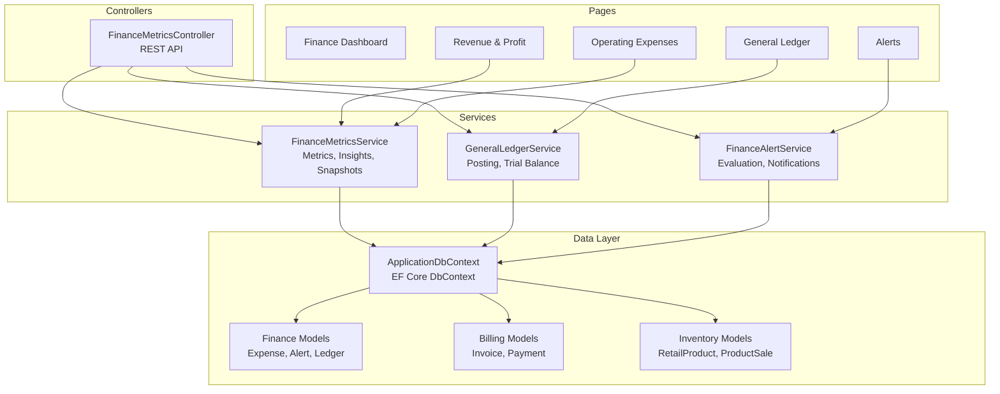
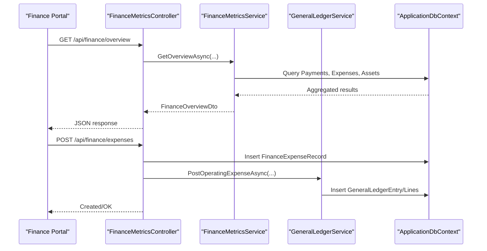
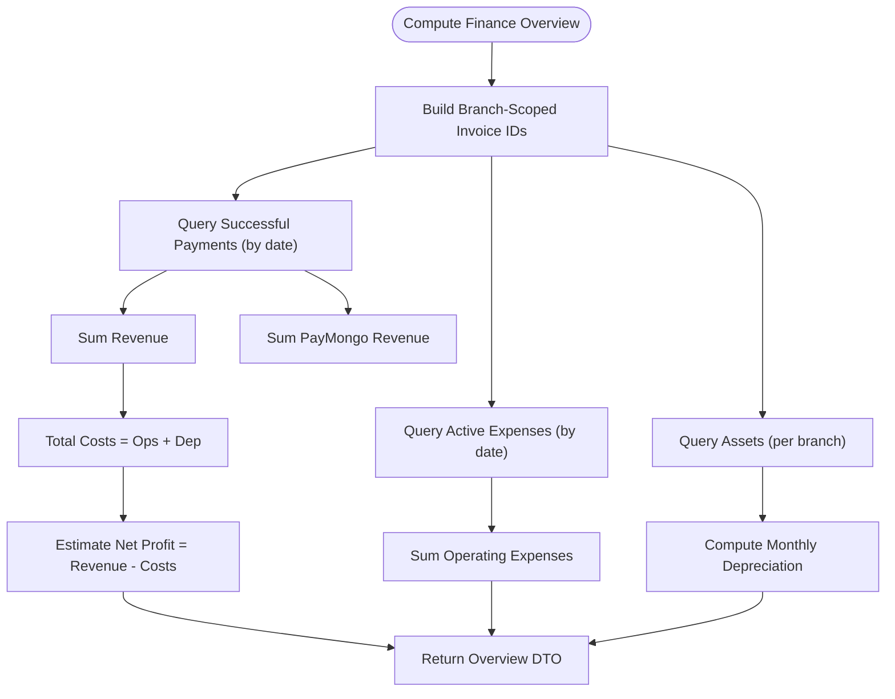
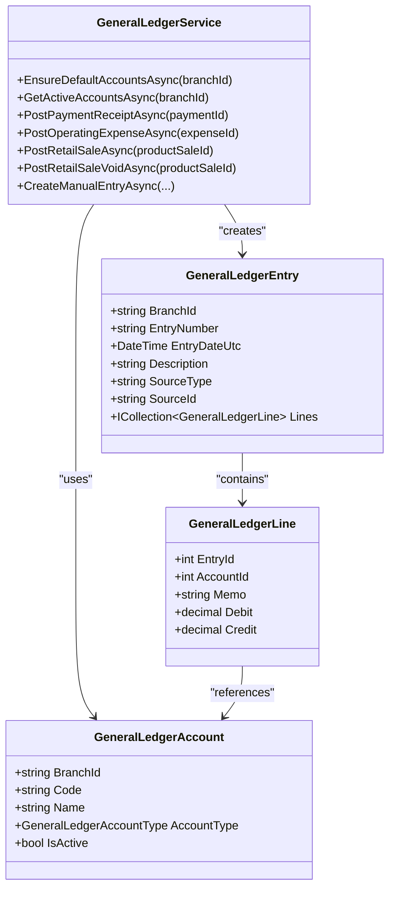
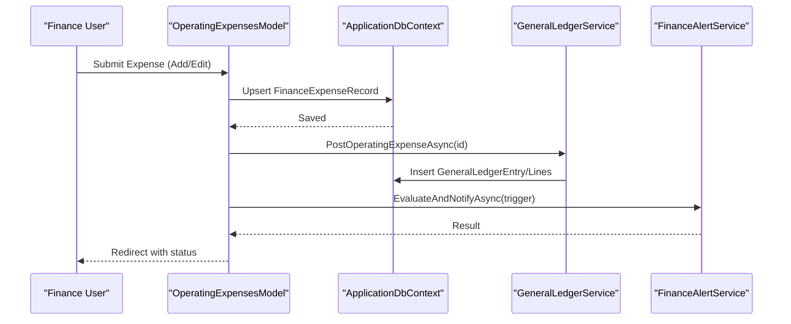
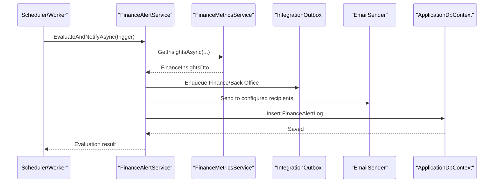
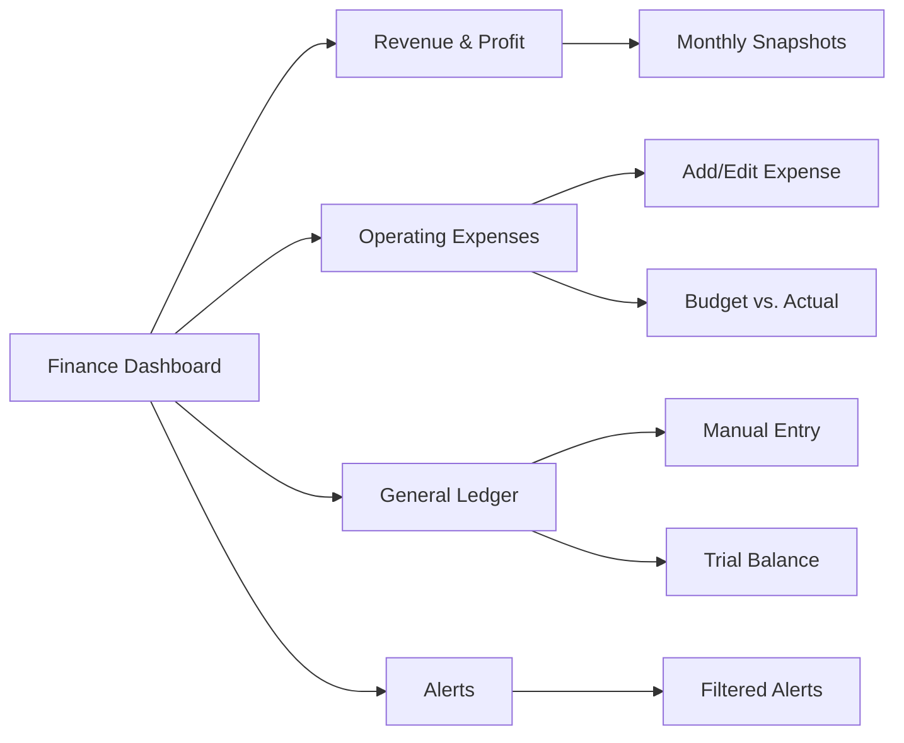
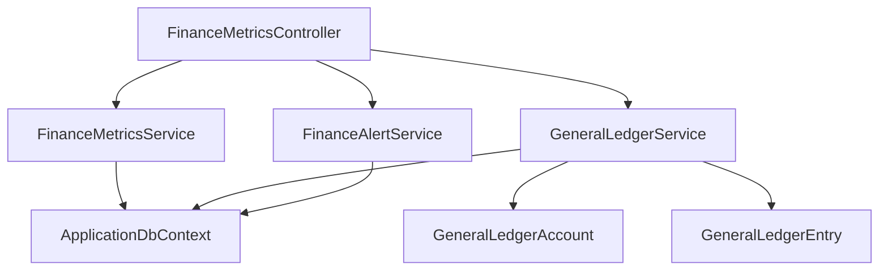

# Financial Management

<cite>
**Referenced Files in This Document**
- [ApplicationDbContext.cs](file://Data/ApplicationDbContext.cs)
- [FinanceMetricsService.cs](file://Services/Finance/FinanceMetricsService.cs)
- [GeneralLedgerService.cs](file://Services/Finance/GeneralLedgerService.cs)
- [FinanceAlertService.cs](file://Services/Finance/FinanceAlertService.cs)
- [FinanceMetricsController.cs](file://Controllers/FinanceMetricsController.cs)
- [FinanceAlertLog.cs](file://Models/Finance/FinanceAlertLog.cs)
- [FinanceExpenseRecord.cs](file://Models/Finance/FinanceExpenseRecord.cs)
- [GeneralLedgerAccount.cs](file://Models/Finance/GeneralLedgerAccount.cs)
- [GeneralLedgerEntry.cs](file://Models/Finance/GeneralLedgerEntry.cs)
- [Dashboard.cshtml.cs](file://Pages/Finance/Dashboard.cshtml.cs)
- [RevenueProfit.cshtml.cs](file://Pages/Finance/RevenueProfit.cshtml.cs)
- [OperatingExpenses.cshtml.cs](file://Pages/Finance/OperatingExpenses.cshtml.cs)
- [GeneralLedger.cshtml.cs](file://Pages/Finance/GeneralLedger.cshtml.cs)
- [Alerts.cshtml.cs](file://Pages/Finance/Alerts.cshtml.cs)
</cite>

## Table of Contents
1. [Introduction](#introduction)
2. [Project Structure](#project-structure)
3. [Core Components](#core-components)
4. [Architecture Overview](#architecture-overview)
5. [Detailed Component Analysis](#detailed-component-analysis)
6. [Dependency Analysis](#dependency-analysis)
7. [Performance Considerations](#performance-considerations)
8. [Troubleshooting Guide](#troubleshooting-guide)
9. [Conclusion](#conclusion)
10. [Appendices](#appendices)

## Introduction
This document explains the financial management system for EJC Fitness Gym, covering revenue tracking, profit calculations, dashboard analytics, general ledger integration, expense tracking, financial alerts, and audit/compliance capabilities. It also describes how billing, inventory, and finance systems integrate to provide accurate financial tracking across business operations.

## Project Structure
The financial domain spans data models, services, controllers, and Razor pages:
- Data layer: Entity definitions and EF Core configuration for invoices, payments, expenses, general ledger, and alerts.
- Services: Business logic for financial metrics, general ledger posting, and alert evaluation.
- Controllers: API endpoints for financial dashboards and administrative actions.
- Pages: Finance dashboards and forms for operating expenses, general ledger, alerts, and revenue/profit reporting.



**Diagram sources**
- [ApplicationDbContext.cs:12-411](file://Data/ApplicationDbContext.cs#L12-L411)
- [FinanceMetricsService.cs:9-52](file://Services/Finance/FinanceMetricsService.cs#L9-L52)
- [GeneralLedgerService.cs:11-45](file://Services/Finance/GeneralLedgerService.cs#L11-L45)
- [FinanceAlertService.cs:11-34](file://Services/Finance/FinanceAlertService.cs#L11-L34)
- [FinanceMetricsController.cs:15-41](file://Controllers/FinanceMetricsController.cs#L15-L41)

**Section sources**
- [ApplicationDbContext.cs:12-411](file://Data/ApplicationDbContext.cs#L12-L411)
- [FinanceMetricsService.cs:9-52](file://Services/Finance/FinanceMetricsService.cs#L9-L52)
- [GeneralLedgerService.cs:11-45](file://Services/Finance/GeneralLedgerService.cs#L11-L45)
- [FinanceAlertService.cs:11-34](file://Services/Finance/FinanceAlertService.cs#L11-L34)
- [FinanceMetricsController.cs:15-41](file://Controllers/FinanceMetricsController.cs#L15-L41)

## Core Components
- Financial metrics engine: Computes revenue, costs, profit, trends, forecasts, and anomalies.
- General ledger integration: Automated posting from payments, expenses, retail sales, and manual entries; trial balance computation.
- Expense tracking: Operating expenses with categories, budgets, recurring flags, and audit notes.
- Financial alerts: Risk and anomaly detection with lifecycle tracking and notifications.
- Dashboards: Role-specific views for finance users to monitor revenue/profit, expenses, ledger, and alerts.

**Section sources**
- [FinanceMetricsService.cs:54-141](file://Services/Finance/FinanceMetricsService.cs#L54-L141)
- [GeneralLedgerService.cs:117-213](file://Services/Finance/GeneralLedgerService.cs#L117-L213)
- [FinanceExpenseRecord.cs:5-37](file://Models/Finance/FinanceExpenseRecord.cs#L5-L37)
- [FinanceAlertLog.cs:13-59](file://Models/Finance/FinanceAlertLog.cs#L13-L59)

## Architecture Overview
The financial system follows a layered architecture:
- API layer: REST endpoints expose financial metrics and administrative actions.
- Service layer: Encapsulates business rules for metrics, ledger posting, and alerting.
- Data layer: EF Core models and indexes for fast queries across billing, finance, and inventory domains.
- UI layer: Finance-focused Razor pages for dashboards and forms.



**Diagram sources**
- [FinanceMetricsController.cs:43-171](file://Controllers/FinanceMetricsController.cs#L43-L171)
- [FinanceMetricsService.cs:54-141](file://Services/Finance/FinanceMetricsService.cs#L54-L141)
- [GeneralLedgerService.cs:215-295](file://Services/Finance/GeneralLedgerService.cs#L215-L295)
- [ApplicationDbContext.cs:25-41](file://Data/ApplicationDbContext.cs#L25-L41)

## Detailed Component Analysis

### Financial Metrics Engine
Responsibilities:
- Revenue tracking: Sum of successful payments within a date range, segmented by gateway provider.
- Cost modeling: Operating expenses plus monthly equipment depreciation.
- Profit calculation: Revenue minus total costs.
- Insights and forecasting: Daily series, linear regression, forecast windows, risk signals, and anomaly detection.
- Monthly snapshots: Revenue, cost of services, gross profit, operating expenses, net profit, invoice states, and projections.

Key implementation highlights:
- Branch scoping via invoice-based filtering to ensure per-branch financial isolation.
- Robust anomaly detection using MAD and Z-scores; risk scoring based on forecast net change and anomaly counts.
- Projection engine builds next-period estimates using linear regression on historical series.



**Diagram sources**
- [FinanceMetricsService.cs:54-141](file://Services/Finance/FinanceMetricsService.cs#L54-L141)
- [ApplicationDbContext.cs:69-91](file://Data/ApplicationDbContext.cs#L69-L91)

**Section sources**
- [FinanceMetricsService.cs:54-141](file://Services/Finance/FinanceMetricsService.cs#L54-L141)
- [FinanceMetricsService.cs:143-285](file://Services/Finance/FinanceMetricsService.cs#L143-L285)
- [FinanceMetricsService.cs:330-473](file://Services/Finance/FinanceMetricsService.cs#L330-L473)

### General Ledger Integration
Automated posting triggers:
- Payment receipts: Debit Cash/Cash in Bank, Credit Membership Revenue.
- Operating expenses: Debit Operating Expense, Credit Cash in Bank.
- Retail sales: Debit Cash/Cash in Bank/Accounts Receivable, Credit Retail Sales Revenue.
- Retail sale reversals: Reverse retail sale entries.
- Manual entries: Create journal entries with validated accounts.

Features:
- Default chart of accounts per branch.
- Source tracking to prevent duplicate postings.
- Entry numbering and UTC normalization.
- Trial balance computation filtered by date range.



**Diagram sources**
- [GeneralLedgerService.cs:11-615](file://Services/Finance/GeneralLedgerService.cs#L11-L615)
- [GeneralLedgerAccount.cs:14-38](file://Models/Finance/GeneralLedgerAccount.cs#L14-L38)
- [GeneralLedgerEntry.cs:5-57](file://Models/Finance/GeneralLedgerEntry.cs#L5-L57)

**Section sources**
- [GeneralLedgerService.cs:47-115](file://Services/Finance/GeneralLedgerService.cs#L47-L115)
- [GeneralLedgerService.cs:117-295](file://Services/Finance/GeneralLedgerService.cs#L117-L295)
- [GeneralLedgerService.cs:297-456](file://Services/Finance/GeneralLedgerService.cs#L297-L456)
- [GeneralLedgerService.cs:458-537](file://Services/Finance/GeneralLedgerService.cs#L458-L537)
- [GeneralLedgerAccount.cs:14-38](file://Models/Finance/GeneralLedgerAccount.cs#L14-L38)
- [GeneralLedgerEntry.cs:5-57](file://Models/Finance/GeneralLedgerEntry.cs#L5-L57)

### Expense Tracking and Approval Workflow
Components:
- Expense records: Name, category, amount, date, recurring flag, activity toggle, notes with audit reference code.
- Budgeting: Per-category monthly budgets with variance computation.
- Approval workflow: UI supports adding/updating, toggling active state, seeding templates, and evaluating alerts.

Operational controls:
- One-time expenses require a reference code for auditability.
- Templates seed recurring expenses across multiple months.
- Posting to general ledger occurs after saving.



**Diagram sources**
- [OperatingExpenses.cshtml.cs:125-225](file://Pages/Finance/OperatingExpenses.cshtml.cs#L125-L225)
- [GeneralLedgerService.cs:215-295](file://Services/Finance/GeneralLedgerService.cs#L215-L295)
- [FinanceAlertService.cs:36-155](file://Services/Finance/FinanceAlertService.cs#L36-L155)

**Section sources**
- [OperatingExpenses.cshtml.cs:19-47](file://Pages/Finance/OperatingExpenses.cshtml.cs#L19-L47)
- [OperatingExpenses.cshtml.cs:125-225](file://Pages/Finance/OperatingExpenses.cshtml.cs#L125-L225)
- [OperatingExpenses.cshtml.cs:256-329](file://Pages/Finance/OperatingExpenses.cshtml.cs#L256-L329)
- [FinanceExpenseRecord.cs:5-37](file://Models/Finance/FinanceExpenseRecord.cs#L5-L37)

### Financial Alert System
Capabilities:
- Evaluation: Periodic or manual evaluation of financial risk and anomalies.
- Thresholds: Risk level computed from forecast net change and anomaly counts; minimum high-severity threshold configurable.
- Notifications: Enqueues real-time events and emails to Finance and Back Office roles.
- Lifecycle: Acknowledge, resolve (with optional false-positive flag), reopen; tracked with timestamps and actors.



**Diagram sources**
- [FinanceAlertService.cs:36-155](file://Services/Finance/FinanceAlertService.cs#L36-L155)
- [FinanceAlertLog.cs:13-59](file://Models/Finance/FinanceAlertLog.cs#L13-L59)

**Section sources**
- [FinanceAlertService.cs:36-155](file://Services/Finance/FinanceAlertService.cs#L36-L155)
- [FinanceAlertLog.cs:5-59](file://Models/Finance/FinanceAlertLog.cs#L5-L59)

### Financial Dashboard Components
- Finance dashboard: Entry point for finance users.
- Revenue & profit: Monthly snapshots with trend badges and margin computations.
- Operating expenses: Forms for adding/editing, toggling active state, budget vs. actual, and seeding templates.
- General ledger: Manual entry form, recent entries, and trial balance by account.
- Alerts: Filtered list with lifecycle actions (acknowledge, resolve, reopen).



**Diagram sources**
- [Dashboard.cshtml.cs:7-12](file://Pages/Finance/Dashboard.cshtml.cs#L7-L12)
- [RevenueProfit.cshtml.cs:36-70](file://Pages/Finance/RevenueProfit.cshtml.cs#L36-L70)
- [OperatingExpenses.cshtml.cs:106-123](file://Pages/Finance/OperatingExpenses.cshtml.cs#L106-L123)
- [GeneralLedger.cshtml.cs:58-82](file://Pages/Finance/GeneralLedger.cshtml.cs#L58-L82)
- [Alerts.cshtml.cs:62-65](file://Pages/Finance/Alerts.cshtml.cs#L62-L65)

**Section sources**
- [RevenueProfit.cshtml.cs:18-35](file://Pages/Finance/RevenueProfit.cshtml.cs#L18-L35)
- [OperatingExpenses.cshtml.cs:331-409](file://Pages/Finance/OperatingExpenses.cshtml.cs#L331-L409)
- [GeneralLedger.cshtml.cs:142-260](file://Pages/Finance/GeneralLedger.cshtml.cs#L142-L260)
- [Alerts.cshtml.cs:101-200](file://Pages/Finance/Alerts.cshtml.cs#L101-L200)

### API Exposure and Authorization
- REST endpoints under /api/finance expose financial metrics, equipment, expenses, alerts, and AI insights.
- Access policies restrict endpoints to authorized finance users.
- Branch scoping enforced via user claims.

**Section sources**
- [FinanceMetricsController.cs:13-41](file://Controllers/FinanceMetricsController.cs#L13-L41)
- [FinanceMetricsController.cs:43-115](file://Controllers/FinanceMetricsController.cs#L43-L115)
- [FinanceMetricsController.cs:173-322](file://Controllers/FinanceMetricsController.cs#L173-L322)

## Dependency Analysis
- Controllers depend on services for business logic and on the database context for persistence.
- Services encapsulate EF Core queries and maintain branch-scoped scopes.
- General ledger depends on chart-of-accounts defaults and validates account existence before posting.
- Alerts depend on metrics for insights and integration outbox/email for notifications.



**Diagram sources**
- [FinanceMetricsController.cs:17-41](file://Controllers/FinanceMetricsController.cs#L17-L41)
- [FinanceMetricsService.cs:9-52](file://Services/Finance/FinanceMetricsService.cs#L9-L52)
- [GeneralLedgerService.cs:11-45](file://Services/Finance/GeneralLedgerService.cs#L11-L45)
- [FinanceAlertService.cs:11-34](file://Services/Finance/FinanceAlertService.cs#L11-L34)
- [ApplicationDbContext.cs:25-29](file://Data/ApplicationDbContext.cs#L25-L29)

**Section sources**
- [FinanceMetricsController.cs:17-41](file://Controllers/FinanceMetricsController.cs#L17-L41)
- [FinanceMetricsService.cs:9-52](file://Services/Finance/FinanceMetricsService.cs#L9-L52)
- [GeneralLedgerService.cs:11-45](file://Services/Finance/GeneralLedgerService.cs#L11-L45)
- [FinanceAlertService.cs:11-34](file://Services/Finance/FinanceAlertService.cs#L11-L34)

## Performance Considerations
- Use AsNoTracking for read-heavy computations to reduce change tracking overhead.
- Leverage indexed properties for branch scoping and date-range filtering.
- Batch operations for seeding templates and projections to minimize round-trips.
- Avoid N+1 queries by preloading related data and using joins/group-bys in services.
- Consider caching for frequently accessed default account lists per branch.

[No sources needed since this section provides general guidance]

## Troubleshooting Guide
Common scenarios:
- General Ledger tables missing: Ensure migrations applied; UI surfaces helpful messages when tables are absent.
- Duplicate postings: Source tracking prevents re-posting for the same source type/id.
- Invalid account selection: Manual entries validate account existence and uniqueness.
- Alert cooldown: Alerts respect a configurable cooldown window to avoid spam.
- Audit trail: Alerts capture payload previews and lifecycle state changes.

**Section sources**
- [GeneralLedger.cshtml.cs:300-324](file://Pages/Finance/GeneralLedger.cshtml.cs#L300-L324)
- [GeneralLedgerService.cs:539-579](file://Services/Finance/GeneralLedgerService.cs#L539-L579)
- [FinanceAlertService.cs:157-257](file://Services/Finance/FinanceAlertService.cs#L157-L257)
- [FinanceAlertLog.cs:13-59](file://Models/Finance/FinanceAlertLog.cs#L13-L59)

## Conclusion
The EJC Fitness Gym financial management system integrates billing, inventory, and finance to deliver robust revenue tracking, profit calculations, automated general ledger posting, and actionable financial insights. The alert system monitors risks and anomalies, while dashboards provide role-specific visibility. Branch scoping and audit trails support compliance and transparency across multi-location operations.

[No sources needed since this section summarizes without analyzing specific files]

## Appendices

### Financial Data Model Overview
```mermaid
erDiagram
PAYMENT ||--o{ INVOICE : "belongs to"
INVOICE ||--o{ PAYMENT : "has many"
PAYMENT {
int Id PK
int InvoiceId FK
string GatewayProvider
string ReferenceNumber
string GatewayPaymentId
decimal Amount
datetime PaidAtUtc
enum Status
string BranchId
}
INVOICE {
int Id PK
int? MemberSubscriptionId FK
string InvoiceNumber
enum Status
datetime DueDateUtc
datetime IssueDateUtc
string BranchId
}
FINANCE_EXPENSE_RECORD {
int Id PK
string Name
string Category
string BranchId
decimal Amount
datetime ExpenseDateUtc
bool IsRecurring
bool IsActive
string Notes
}
GENERAL_LEDGER_ACCOUNT {
int Id PK
string BranchId
string Code
string Name
enum AccountType
bool IsActive
}
GENERAL_LEDGER_ENTRY {
int Id PK
string BranchId
string EntryNumber
datetime EntryDateUtc
string Description
string SourceType
string SourceId
string CreatedByUserId
}
GENERAL_LEDGER_LINE {
int Id PK
int EntryId FK
int AccountId FK
decimal Debit
decimal Credit
string Memo
}
GENERAL_LEDGER_ENTRY ||--o{ GENERAL_LEDGER_LINE : "contains"
GENERAL_LEDGER_ACCOUNT ||--o{ GENERAL_LEDGER_LINE : "referenced by"
```

**Diagram sources**
- [ApplicationDbContext.cs:19-41](file://Data/ApplicationDbContext.cs#L19-L41)
- [GeneralLedgerEntry.cs:5-34](file://Models/Finance/GeneralLedgerEntry.cs#L5-L34)
- [GeneralLedgerAccount.cs:14-38](file://Models/Finance/GeneralLedgerAccount.cs#L14-L38)