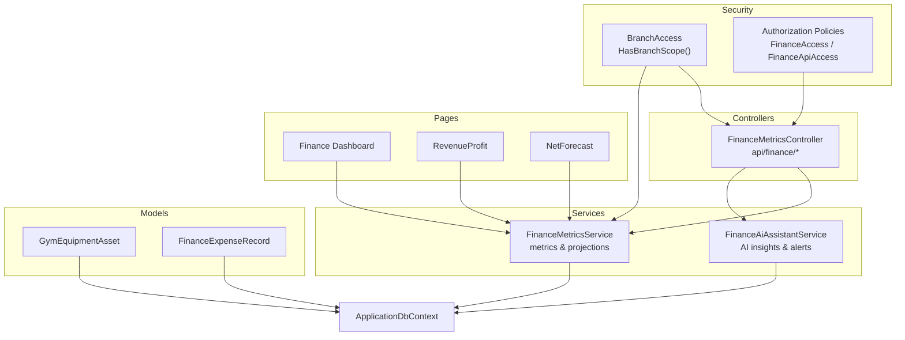
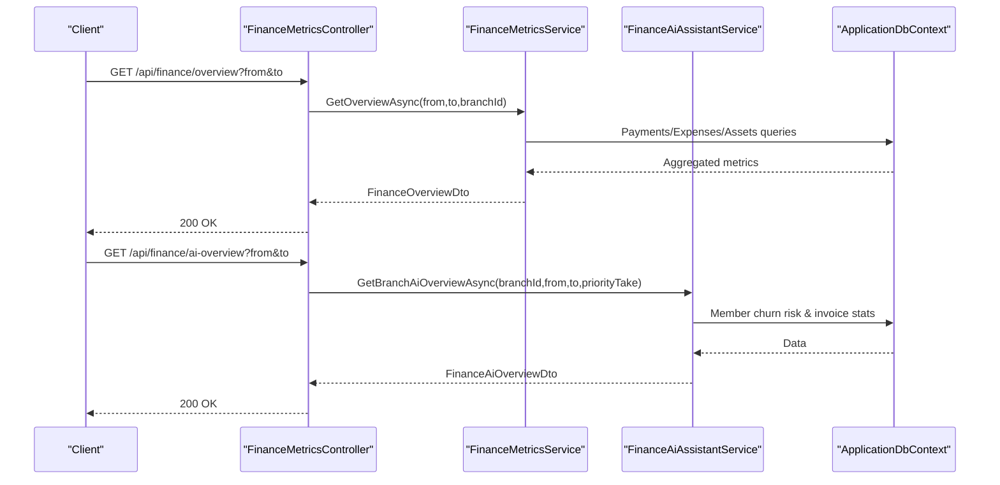
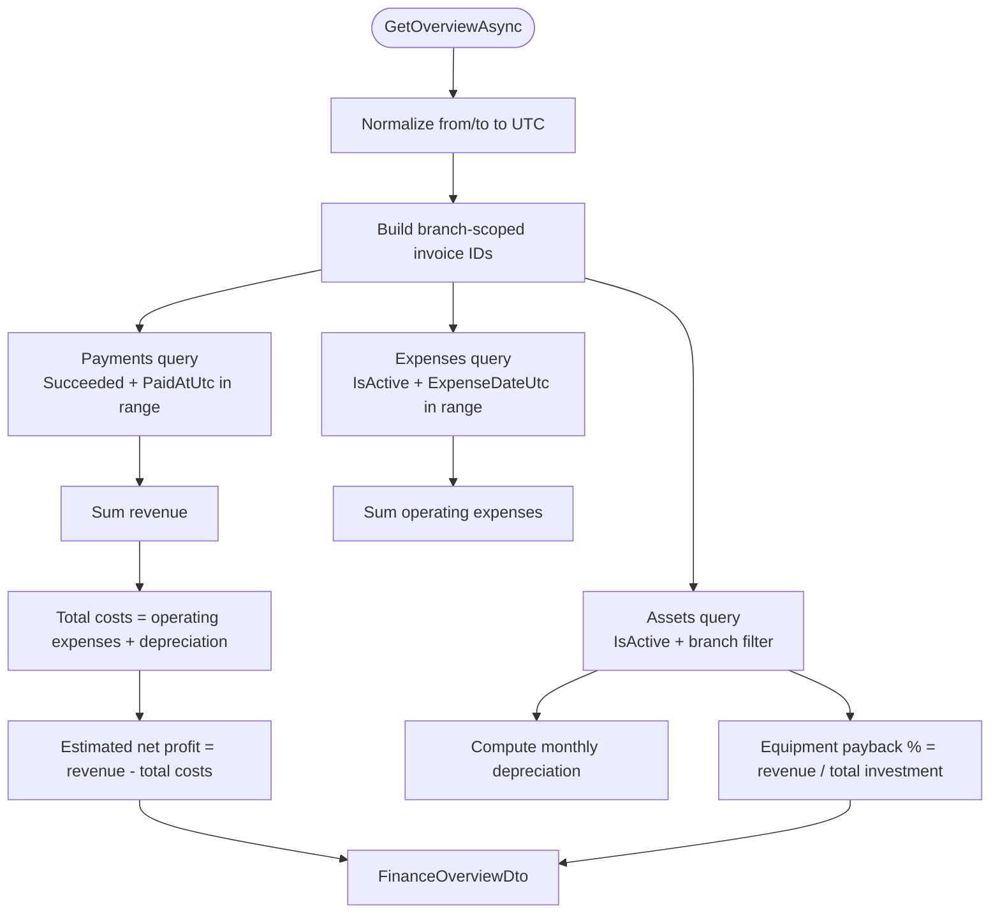
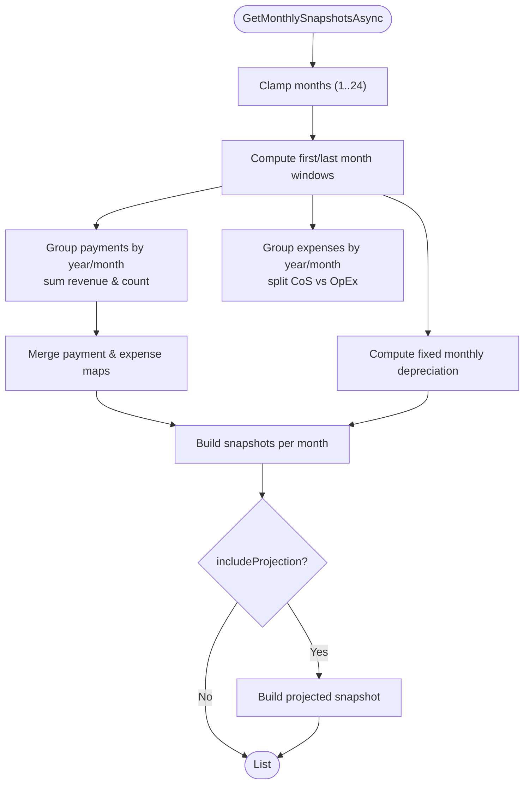
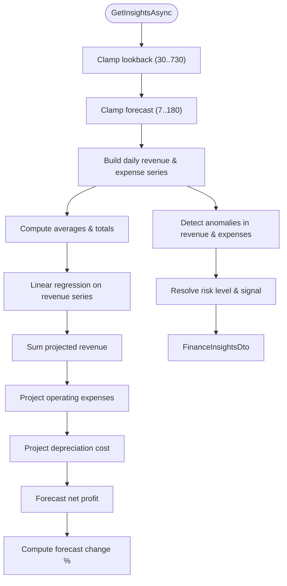
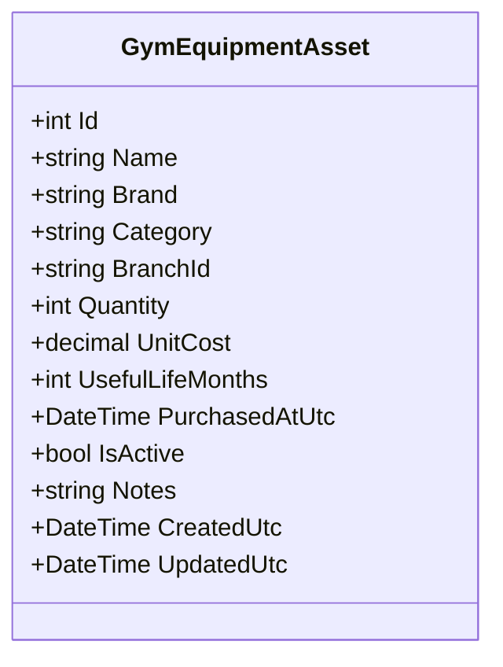
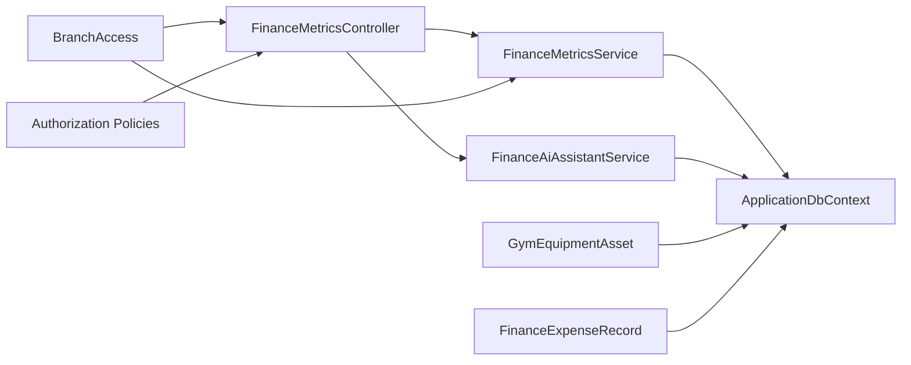

# Financial Metrics and Analytics

<cite>
**Referenced Files in This Document**
- [FinanceMetricsController.cs](file://Controllers/FinanceMetricsController.cs)
- [FinanceMetricsService.cs](file://Services/Finance/FinanceMetricsService.cs)
- [IFinanceMetricsService.cs](file://Services/Finance/IFinanceMetricsService.cs)
- [GymEquipmentAsset.cs](file://Models/Finance/GymEquipmentAsset.cs)
- [FinanceExpenseRecord.cs](file://Models/Finance/FinanceExpenseRecord.cs)
- [IFinanceAiAssistantService.cs](file://Services/Finance/IFinanceAiAssistantService.cs)
- [FinanceAiAssistantService.cs](file://Services/Finance/FinanceAiAssistantService.cs)
- [Dashboard.cshtml.cs](file://Pages/Finance/Dashboard.cshtml.cs)
- [RevenueProfit.cshtml.cs](file://Pages/Finance/RevenueProfit.cshtml.cs)
- [NetForecast.cshtml.cs](file://Pages/Finance/NetForecast.cshtml.cs)
- [BranchAccess.cs](file://Security/BranchAccess.cs)
- [Program.cs](file://Program.cs)
</cite>

## Table of Contents
1. [Introduction](#introduction)
2. [Project Structure](#project-structure)
3. [Core Components](#core-components)
4. [Architecture Overview](#architecture-overview)
5. [Detailed Component Analysis](#detailed-component-analysis)
6. [Dependency Analysis](#dependency-analysis)
7. [Performance Considerations](#performance-considerations)
8. [Troubleshooting Guide](#troubleshooting-guide)
9. [Conclusion](#conclusion)

## Introduction
This document describes the financial metrics and analytics system for EJCFitnessGym. It covers:
- The financial overview dashboard aggregating revenue, profit margins, and key performance indicators
- Monthly financial snapshots including revenue tracking, cost of services, gross profit, operating expenses, depreciation, and net profit analysis
- AI-powered financial insights providing predictive analytics and trend forecasting
- Equipment asset valuation and straight-line depreciation calculations
- API endpoints for retrieving financial data with authentication and filtering
- Data aggregation methods, time-range queries, and projection algorithms used for forecasting

## Project Structure
The financial analytics system spans controllers, services, models, pages, and security policies:
- Controllers expose REST endpoints under api/finance with role-based authorization
- Services encapsulate data aggregation, forecasting, and AI-driven insights
- Models define equipment assets and operating expenses
- Pages render dashboards for revenue/profit and net profit forecasts
- Security enforces branch-scoped access via claims and authorization policies

**Diagram sources**
- [FinanceMetricsController.cs:12-41](file://Controllers/FinanceMetricsController.cs#L12-L41)
- [FinanceMetricsService.cs:9-52](file://Services/Finance/FinanceMetricsService.cs#L9-L52)
- [FinanceAiAssistantService.cs:14-38](file://Services/Finance/FinanceAiAssistantService.cs#L14-L38)
- [GymEquipmentAsset.cs:5-42](file://Models/Finance/GymEquipmentAsset.cs#L5-L42)
- [FinanceExpenseRecord.cs:5-35](file://Models/Finance/FinanceExpenseRecord.cs#L5-L35)
- [Dashboard.cshtml.cs:6-12](file://Pages/Finance/Dashboard.cshtml.cs#L6-L12)
- [RevenueProfit.cshtml.cs:8-16](file://Pages/Finance/RevenueProfit.cshtml.cs#L8-L16)
- [NetForecast.cshtml.cs:8-15](file://Pages/Finance/NetForecast.cshtml.cs#L8-L15)
- [BranchAccess.cs:5-28](file://Security/BranchAccess.cs#L5-L28)
- [Program.cs:315-343](file://Program.cs#L315-L343)

**Section sources**
- [FinanceMetricsController.cs:12-41](file://Controllers/FinanceMetricsController.cs#L12-L41)
- [FinanceMetricsService.cs:9-52](file://Services/Finance/FinanceMetricsService.cs#L9-L52)
- [IFinanceMetricsService.cs:5-38](file://Services/Finance/IFinanceMetricsService.cs#L5-L38)
- [GymEquipmentAsset.cs:5-42](file://Models/Finance/GymEquipmentAsset.cs#L5-L42)
- [FinanceExpenseRecord.cs:5-35](file://Models/Finance/FinanceExpenseRecord.cs#L5-L35)
- [Dashboard.cshtml.cs:6-12](file://Pages/Finance/Dashboard.cshtml.cs#L6-L12)
- [RevenueProfit.cshtml.cs:8-16](file://Pages/Finance/RevenueProfit.cshtml.cs#L8-L16)
- [NetForecast.cshtml.cs:8-15](file://Pages/Finance/NetForecast.cshtml.cs#L8-L15)
- [BranchAccess.cs:5-28](file://Security/BranchAccess.cs#L5-L28)
- [Program.cs:315-343](file://Program.cs#L315-L343)

## Core Components
- FinanceMetricsController: Exposes REST endpoints for financial overview, AI overview, insights, monthly snapshots, equipment, expenses, and alert management. Enforces FinanceApiAccess policy and branch scoping.
- FinanceMetricsService: Implements financial computations, including revenue, operating expenses, equipment depreciation, monthly snapshots, anomaly detection, linear regression forecasting, and risk scoring.
- FinanceAiAssistantService: Provides AI-driven financial insights, churn risk evaluation, and alert dispatching for high-risk members.
- Models: GymEquipmentAsset and FinanceExpenseRecord define equipment and expense entities with branch scoping and lifecycle timestamps.
- Pages: Razor Page models for Finance dashboard, RevenueProfit, and NetForecast dashboards.
- Security: BranchAccess helpers and authorization policies enforce role and branch scope checks.

**Section sources**
- [FinanceMetricsController.cs:43-115](file://Controllers/FinanceMetricsController.cs#L43-L115)
- [FinanceMetricsService.cs:54-141](file://Services/Finance/FinanceMetricsService.cs#L54-L141)
- [IFinanceAiAssistantService.cs:3-17](file://Services/Finance/IFinanceAiAssistantService.cs#L3-L17)
- [FinanceAiAssistantService.cs:40-55](file://Services/Finance/FinanceAiAssistantService.cs#L40-L55)
- [GymEquipmentAsset.cs:5-42](file://Models/Finance/GymEquipmentAsset.cs#L5-L42)
- [FinanceExpenseRecord.cs:5-35](file://Models/Finance/FinanceExpenseRecord.cs#L5-L35)
- [RevenueProfit.cshtml.cs:18-70](file://Pages/Finance/RevenueProfit.cshtml.cs#L18-L70)
- [NetForecast.cshtml.cs:26-43](file://Pages/Finance/NetForecast.cshtml.cs#L26-L43)
- [BranchAccess.cs:9-28](file://Security/BranchAccess.cs#L9-L28)
- [Program.cs:329-333](file://Program.cs#L329-L333)

## Architecture Overview
The system follows a layered architecture:
- Presentation: Controllers and Pages
- Application: Services for metrics, AI insights, and alert lifecycle
- Domain/Data: Models and DbContext queries
- Security: Authorization policies and branch-scoped claims

**Diagram sources**
- [FinanceMetricsController.cs:43-71](file://Controllers/FinanceMetricsController.cs#L43-L71)
- [FinanceMetricsService.cs:54-141](file://Services/Finance/FinanceMetricsService.cs#L54-L141)
- [IFinanceAiAssistantService.cs:5-10](file://Services/Finance/IFinanceAiAssistantService.cs#L5-L10)
- [FinanceAiAssistantService.cs:40-55](file://Services/Finance/FinanceAiAssistantService.cs#L40-L55)

## Detailed Component Analysis

### Financial Overview Dashboard
The overview endpoint aggregates:
- Revenue from successful payments within a UTC time window
- PayMongo-specific revenue
- Operating expenses filtered by branch and date
- Equipment asset counts, units, total investment, and monthly depreciation
- Estimated net profit and equipment payback percent

**Diagram sources**
- [FinanceMetricsService.cs:54-141](file://Services/Finance/FinanceMetricsService.cs#L54-L141)

**Section sources**
- [FinanceMetricsService.cs:54-141](file://Services/Finance/FinanceMetricsService.cs#L54-L141)
- [IFinanceMetricsService.cs:40-56](file://Services/Finance/IFinanceMetricsService.cs#L40-L56)

### Monthly Financial Snapshots
The monthly snapshots endpoint:
- Computes monthly revenue from successful payments
- Segregates cost of services vs operating expenses by category
- Calculates gross profit and net profit after fixed monthly depreciation
- Includes invoice state counts (Draft, Unpaid, Overdue, Paid)
- Optionally projects the next month using linear regression projections

**Diagram sources**
- [FinanceMetricsService.cs:330-473](file://Services/Finance/FinanceMetricsService.cs#L330-L473)

**Section sources**
- [FinanceMetricsService.cs:330-473](file://Services/Finance/FinanceMetricsService.cs#L330-L473)
- [IFinanceMetricsService.cs:29-33](file://Services/Finance/IFinanceMetricsService.cs#L29-L33)

### AI-Powered Financial Insights and Predictions
The insights endpoint:
- Builds daily revenue and expense series over a configurable lookback window
- Computes average daily revenue and expenses
- Uses linear regression to project future revenue over forecast days
- Projects operating expenses and depreciation costs
- Computes forecast net profit and change percentage
- Flags anomalies in revenue and expenses using robust statistics
- Determines risk level and gain/loss signal

**Diagram sources**
- [FinanceMetricsService.cs:143-285](file://Services/Finance/FinanceMetricsService.cs#L143-L285)

**Section sources**
- [FinanceMetricsService.cs:143-285](file://Services/Finance/FinanceMetricsService.cs#L143-L285)
- [IFinanceMetricsService.cs:65-85](file://Services/Finance/IFinanceMetricsService.cs#L65-L85)

### Equipment Asset Valuation and Depreciation
Equipment assets are tracked per branch with:
- Name, brand, category, quantity, unit cost, useful life (months)
- Purchase date, activity flag, notes, and timestamps
- Monthly depreciation computed as straight-line: (quantity × unit cost) / usefulLifeMonths
- Aggregations include total units, total investment, and monthly depreciation across assets

**Diagram sources**
- [GymEquipmentAsset.cs:5-42](file://Models/Finance/GymEquipmentAsset.cs#L5-L42)

**Section sources**
- [GymEquipmentAsset.cs:5-42](file://Models/Finance/GymEquipmentAsset.cs#L5-L42)
- [FinanceMetricsService.cs:97-118](file://Services/Finance/FinanceMetricsService.cs#L97-L118)
- [FinanceMetricsService.cs:230-240](file://Services/Finance/FinanceMetricsService.cs#L230-L240)

### Operating Expenses Tracking
Operating expenses are recorded with:
- Name, category, amount, expense date, recurring flag, activity flag
- Optional notes and timestamps
- Queries support branch scoping and optional date filters

**Section sources**
- [FinanceExpenseRecord.cs:5-35](file://Models/Finance/FinanceExpenseRecord.cs#L5-L35)
- [FinanceMetricsService.cs:299-328](file://Services/Finance/FinanceMetricsService.cs#L299-L328)

### API Endpoints and Authentication
Endpoints under api/finance:
- GET overview: Financial overview with time window
- GET ai-overview: AI-driven branch overview with churn risk and exposure
- GET insights: Forecast and anomaly insights
- GET monthly: Monthly snapshots with optional projection
- GET equipment: Equipment assets with branch scoping
- GET expenses: Operating expenses with date filters
- GET alerts: Filterable alert logs with pagination
- POST alerts/{id}/ack, resolve, reopen: Alert lifecycle actions
- POST expenses: Create expense with ledger posting and alert evaluation
- POST alerts/evaluate: Manual evaluation and churn alert dispatch
- GET equipment/{id}: Retrieve single asset by ID
- POST equipment: Create asset with alert evaluation
- POST equipment/seed-medium-gym: Seed sample assets

Authentication and authorization:
- Policy FinanceApiAccess requires Finance/Admin/SuperAdmin roles and branch scope
- Branch scoping enforced via claims and helper methods
- Controllers and pages apply authorization policies

**Section sources**
- [FinanceMetricsController.cs:43-115](file://Controllers/FinanceMetricsController.cs#L43-L115)
- [FinanceMetricsController.cs:173-283](file://Controllers/FinanceMetricsController.cs#L173-L283)
- [FinanceMetricsController.cs:285-321](file://Controllers/FinanceMetricsController.cs#L285-L321)
- [FinanceMetricsController.cs:323-384](file://Controllers/FinanceMetricsController.cs#L323-L384)
- [FinanceMetricsController.cs:386-399](file://Controllers/FinanceMetricsController.cs#L386-L399)
- [FinanceMetricsController.cs:401-437](file://Controllers/FinanceMetricsController.cs#L401-L437)
- [FinanceMetricsController.cs:439-495](file://Controllers/FinanceMetricsController.cs#L439-L495)
- [FinanceMetricsController.cs:497-514](file://Controllers/FinanceMetricsController.cs#L497-L514)
- [Program.cs:329-333](file://Program.cs#L329-L333)
- [BranchAccess.cs:9-28](file://Security/BranchAccess.cs#L9-L28)

### Dashboards and UI Integration
- Finance Dashboard page: Protected by FinanceAccess policy
- RevenueProfit page: Renders monthly snapshots with trends and margin calculations
- NetForecast page: Renders insights and supporting snapshots with clamped lookback/forecast parameters

**Section sources**
- [Dashboard.cshtml.cs:6-12](file://Pages/Finance/Dashboard.cshtml.cs#L6-L12)
- [RevenueProfit.cshtml.cs:18-70](file://Pages/Finance/RevenueProfit.cshtml.cs#L18-L70)
- [RevenueProfit.cshtml.cs:72-118](file://Pages/Finance/RevenueProfit.cshtml.cs#L72-L118)
- [NetForecast.cshtml.cs:26-43](file://Pages/Finance/NetForecast.cshtml.cs#L26-L43)

## Dependency Analysis
- Controllers depend on FinanceMetricsService, FinanceAiAssistantService, FinanceAlert services, and GeneralLedgerService
- Services depend on ApplicationDbContext for queries and projections
- Models define entity relationships and constraints
- Security policies and branch access helpers govern access
- Pages depend on services for rendering dashboards

**Diagram sources**
- [FinanceMetricsController.cs:17-41](file://Controllers/FinanceMetricsController.cs#L17-L41)
- [FinanceMetricsService.cs:49-52](file://Services/Finance/FinanceMetricsService.cs#L49-L52)
- [FinanceAiAssistantService.cs:24-38](file://Services/Finance/FinanceAiAssistantService.cs#L24-L38)
- [GymEquipmentAsset.cs:5-42](file://Models/Finance/GymEquipmentAsset.cs#L5-L42)
- [FinanceExpenseRecord.cs:5-35](file://Models/Finance/FinanceExpenseRecord.cs#L5-L35)
- [BranchAccess.cs:9-28](file://Security/BranchAccess.cs#L9-L28)
- [Program.cs:329-333](file://Program.cs#L329-L333)

**Section sources**
- [FinanceMetricsController.cs:17-41](file://Controllers/FinanceMetricsController.cs#L17-L41)
- [FinanceMetricsService.cs:49-52](file://Services/Finance/FinanceMetricsService.cs#L49-L52)
- [FinanceAiAssistantService.cs:24-38](file://Services/Finance/FinanceAiAssistantService.cs#L24-L38)
- [GymEquipmentAsset.cs:5-42](file://Models/Finance/GymEquipmentAsset.cs#L5-L42)
- [FinanceExpenseRecord.cs:5-35](file://Models/Finance/FinanceExpenseRecord.cs#L5-L35)
- [BranchAccess.cs:9-28](file://Security/BranchAccess.cs#L9-L28)
- [Program.cs:329-333](file://Program.cs#L329-L333)

## Performance Considerations
- Prefer AsNoTracking for read-heavy queries to reduce change tracking overhead
- Use AsQueryable and server-side grouping to minimize client-side aggregation
- Clamp time windows and pagination parameters to prevent excessive loads
- Use branch-scoped invoice IDs to limit dataset sizes early
- Consider indexing on PaidAtUtc, ExpenseDateUtc, and BranchId for improved query performance

## Troubleshooting Guide
Common issues and resolutions:
- Unauthorized or forbidden responses: Verify FinanceApiAccess policy and branch scope claims
- Empty or unexpected results: Confirm time window normalization and branch scoping
- Alert lifecycle conflicts: Review state transitions and validation messages
- Ledger posting failures: Inspect logs for general ledger exceptions during expense creation

**Section sources**
- [Program.cs:329-333](file://Program.cs#L329-L333)
- [BranchAccess.cs:9-28](file://Security/BranchAccess.cs#L9-L28)
- [FinanceMetricsController.cs:364-370](file://Controllers/FinanceMetricsController.cs#L364-L370)
- [FinanceMetricsController.cs:647-670](file://Controllers/FinanceMetricsController.cs#L647-L670)

## Conclusion
The financial metrics and analytics system provides comprehensive financial visibility through:
- Real-time financial overview with revenue, expenses, and equipment depreciation
- Historical and projected monthly snapshots
- AI-driven insights and anomaly detection with risk signals
- Secure, branch-scoped APIs with robust filtering and alert lifecycle management
- Straightforward dashboards for revenue/profit and net profit forecasting