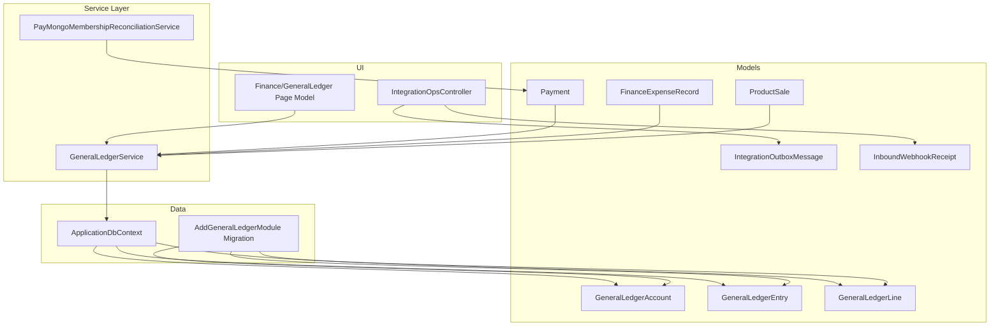
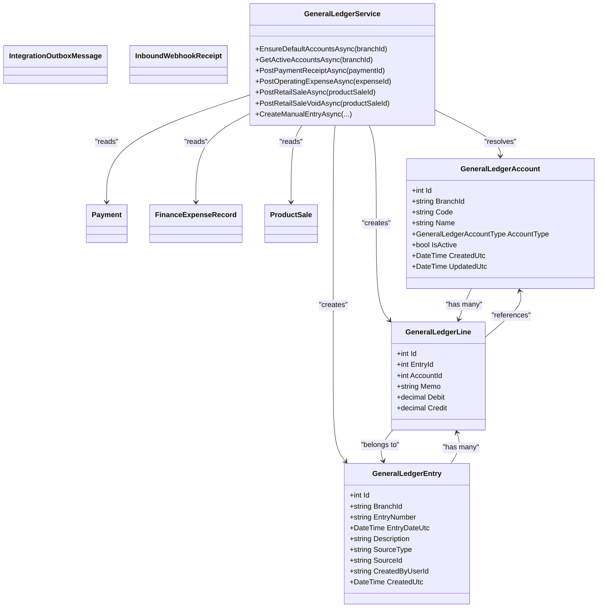
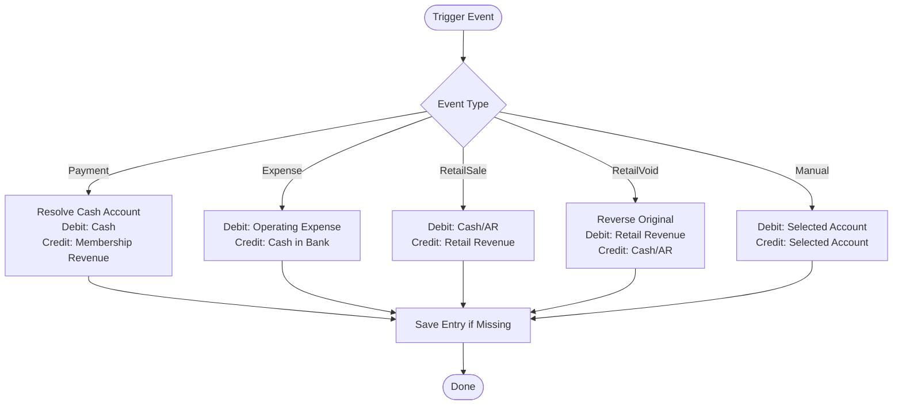
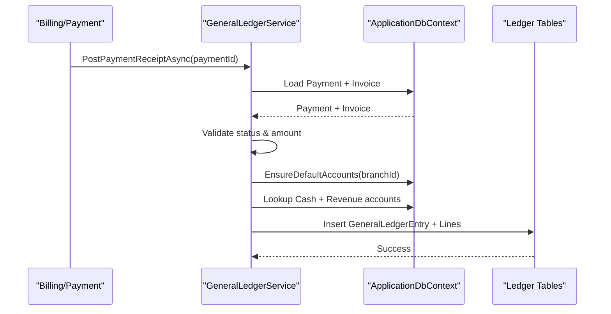
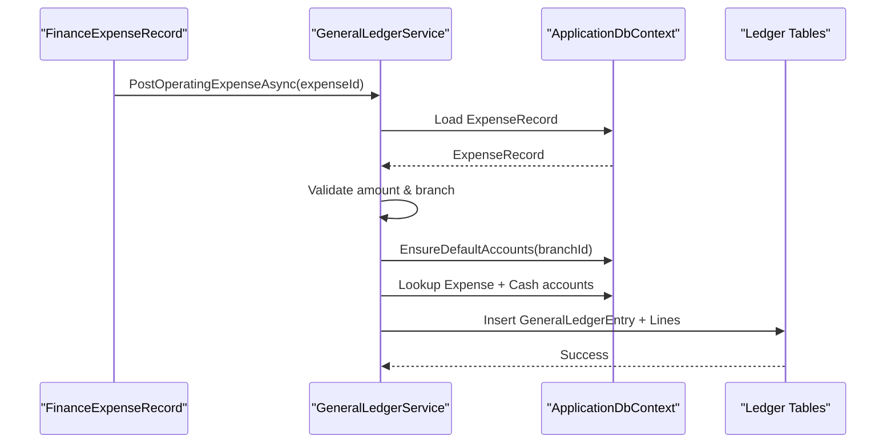
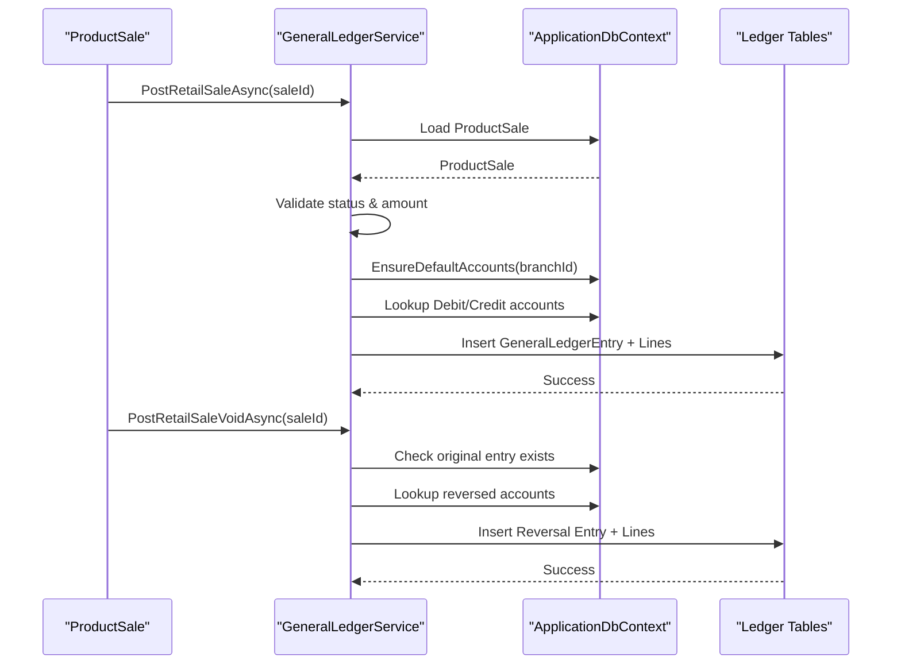
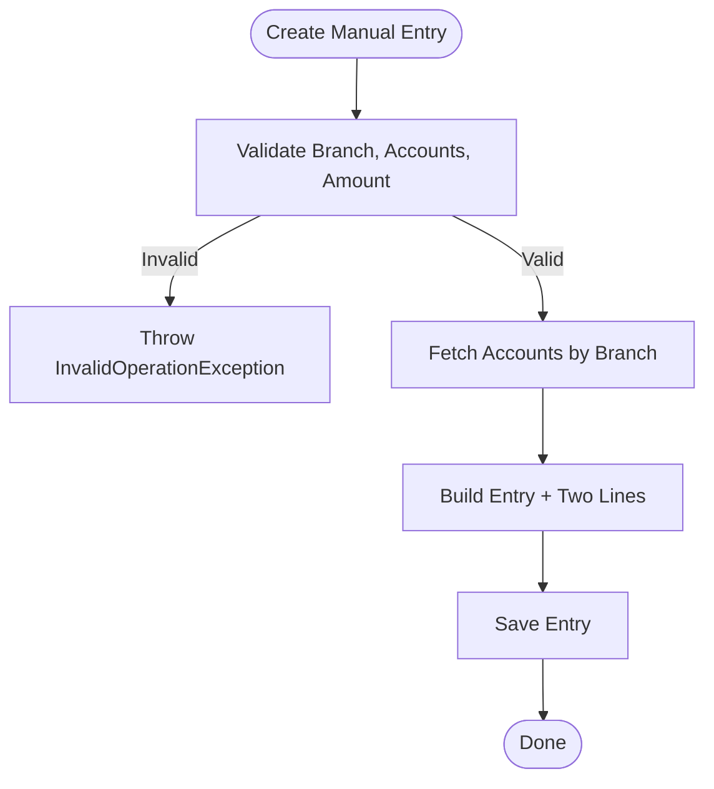
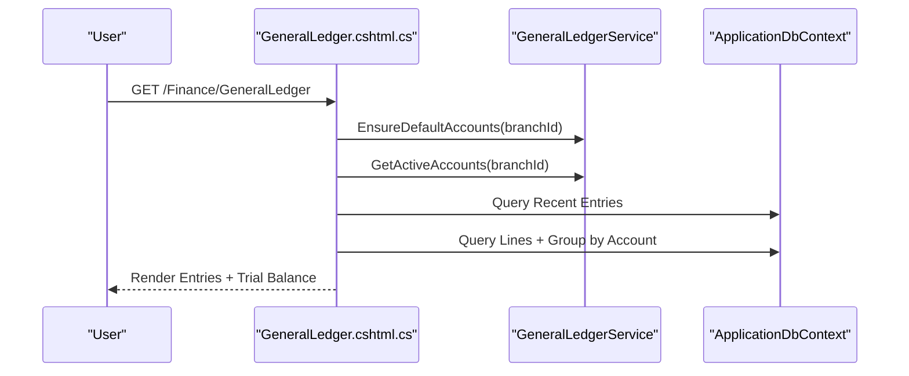
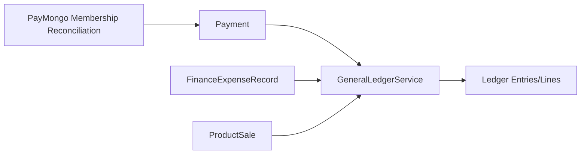
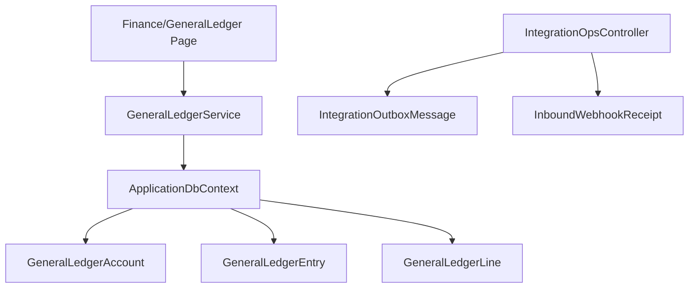

# General Ledger System

<cite>
**Referenced Files in This Document**
- [AddGeneralLedgerModule.cs](file://Data/Migrations/20260226145124_AddGeneralLedgerModule.cs)
- [GeneralLedgerAccount.cs](file://Models/Finance/GeneralLedgerAccount.cs)
- [GeneralLedgerEntry.cs](file://Models/Finance/GeneralLedgerEntry.cs)
- [GeneralLedgerService.cs](file://Services/Finance/GeneralLedgerService.cs)
- [IGeneralLedgerService.cs](file://Services/Finance/IGeneralLedgerService.cs)
- [ApplicationDbContext.cs](file://Data/ApplicationDbContext.cs)
- [GeneralLedger.cshtml.cs](file://Pages/Finance/GeneralLedger.cshtml.cs)
- [IntegrationOpsController.cs](file://Controllers/IntegrationOpsController.cs)
- [PayMongoMembershipReconciliationService.cs](file://Services/Payments/PayMongoMembershipReconciliationService.cs)
- [Payment.cs](file://Models/Billing/Payment.cs)
- [FinanceExpenseRecord.cs](file://Models/Finance/FinanceExpenseRecord.cs)
- [ProductSale.cs](file://Models/Inventory/ProductSale.cs)
- [IntegrationOutboxMessage.cs](file://Models/Integration/IntegrationOutboxMessage.cs)
- [InboundWebhookReceipt.cs](file://Models/Integration/InboundWebhookReceipt.cs)
</cite>

## Table of Contents
1. [Introduction](#introduction)
2. [Project Structure](#project-structure)
3. [Core Components](#core-components)
4. [Architecture Overview](#architecture-overview)
5. [Detailed Component Analysis](#detailed-component-analysis)
6. [Dependency Analysis](#dependency-analysis)
7. [Performance Considerations](#performance-considerations)
8. [Troubleshooting Guide](#troubleshooting-guide)
9. [Conclusion](#conclusion)
10. [Appendices](#appendices)

## Introduction
This document describes the general ledger accounting system integrated into the fitness gym management platform. It explains how financial transactions from billing, expenses, and inventory are automatically posted to the ledger using double-entry accounting principles. It documents the chart of accounts structure, ledger entry generation for invoices, payments, equipment purchases, and operating expenses, as well as reconciliation, audit trails, and reporting capabilities.

## Project Structure
The general ledger module is implemented as a cohesive set of models, a service layer, database migrations, and UI pages. Supporting services integrate external systems (e.g., payment reconciliation) and maintain idempotent integration outboxes for reliable event delivery.

**Diagram sources**
- [GeneralLedgerAccount.cs:14-38](file://Models/Finance/GeneralLedgerAccount.cs#L14-L38)
- [GeneralLedgerEntry.cs:5-56](file://Models/Finance/GeneralLedgerEntry.cs#L5-L56)
- [GeneralLedgerService.cs:11-616](file://Services/Finance/GeneralLedgerService.cs#L11-L616)
- [ApplicationDbContext.cs:27-411](file://Data/ApplicationDbContext.cs#L27-L411)
- [AddGeneralLedgerModule.cs:12-136](file://Data/Migrations/20260226145124_AddGeneralLedgerModule.cs#L12-L136)
- [GeneralLedger.cshtml.cs:14-406](file://Pages/Finance/GeneralLedger.cshtml.cs#L14-L406)
- [IntegrationOpsController.cs:14-541](file://Controllers/IntegrationOpsController.cs#L14-L541)
- [PayMongoMembershipReconciliationService.cs:10-423](file://Services/Payments/PayMongoMembershipReconciliationService.cs#L10-L423)
- [Payment.cs:5-37](file://Models/Billing/Payment.cs#L5-L37)
- [FinanceExpenseRecord.cs:5-36](file://Models/Finance/FinanceExpenseRecord.cs#L5-L36)
- [ProductSale.cs:5-81](file://Models/Inventory/ProductSale.cs#L5-L81)
- [IntegrationOutboxMessage.cs:5-57](file://Models/Integration/IntegrationOutboxMessage.cs#L5-L57)
- [InboundWebhookReceipt.cs:5-43](file://Models/Integration/InboundWebhookReceipt.cs#L5-L43)

**Section sources**
- [AddGeneralLedgerModule.cs:12-136](file://Data/Migrations/20260226145124_AddGeneralLedgerModule.cs#L12-L136)
- [ApplicationDbContext.cs:27-411](file://Data/ApplicationDbContext.cs#L27-L411)
- [GeneralLedgerService.cs:11-616](file://Services/Finance/GeneralLedgerService.cs#L11-L616)
- [GeneralLedger.cshtml.cs:14-406](file://Pages/Finance/GeneralLedger.cshtml.cs#L14-L406)
- [IntegrationOpsController.cs:14-541](file://Controllers/IntegrationOpsController.cs#L14-L541)

## Core Components
- GeneralLedgerAccount: Defines chart of accounts entries with type, code, name, branch scoping, and activity flag.
- GeneralLedgerEntry and GeneralLedgerLine: Represent ledger entries and their debits/credits, linked to accounts and source transactions.
- GeneralLedgerService: Implements automatic posting of billing, expense, and inventory revenue transactions; supports manual entries and idempotent creation.
- ApplicationDbContext: Provides EF Core entity sets and indexes for ledger, billing, inventory, and integration artifacts.
- Finance/GeneralLedger Page: Renders recent entries, trial balance, and allows manual journal entries.
- IntegrationOpsController: Operates integration outbox and inbound webhook receipts for replay and diagnostics.
- Supporting models: Payment, FinanceExpenseRecord, ProductSale, IntegrationOutboxMessage, InboundWebhookReceipt.

**Section sources**
- [GeneralLedgerAccount.cs:14-38](file://Models/Finance/GeneralLedgerAccount.cs#L14-L38)
- [GeneralLedgerEntry.cs:5-56](file://Models/Finance/GeneralLedgerEntry.cs#L5-L56)
- [GeneralLedgerService.cs:11-616](file://Services/Finance/GeneralLedgerService.cs#L11-L616)
- [ApplicationDbContext.cs:27-411](file://Data/ApplicationDbContext.cs#L27-L411)
- [GeneralLedger.cshtml.cs:14-406](file://Pages/Finance/GeneralLedger.cshtml.cs#L14-L406)
- [IntegrationOpsController.cs:14-541](file://Controllers/IntegrationOpsController.cs#L14-L541)
- [Payment.cs:5-37](file://Models/Billing/Payment.cs#L5-L37)
- [FinanceExpenseRecord.cs:5-36](file://Models/Finance/FinanceExpenseRecord.cs#L5-L36)
- [ProductSale.cs:5-81](file://Models/Inventory/ProductSale.cs#L5-L81)
- [IntegrationOutboxMessage.cs:5-57](file://Models/Integration/IntegrationOutboxMessage.cs#L5-L57)
- [InboundWebhookReceipt.cs:5-43](file://Models/Integration/InboundWebhookReceipt.cs#L5-L43)

## Architecture Overview
The system follows a layered architecture:
- Data layer: Entity models and DbContext define ledger, billing, inventory, and integration entities with indexes for performance and uniqueness.
- Service layer: GeneralLedgerService orchestrates posting of financial events into the ledger, ensuring double-entry balance and idempotency.
- UI layer: Finance/GeneralLedger page exposes ledger browsing, trial balance, and manual entry creation.
- Integration layer: Outbox pattern and webhook receipts support reliable event delivery and replay.

**Diagram sources**
- [GeneralLedgerAccount.cs:14-38](file://Models/Finance/GeneralLedgerAccount.cs#L14-L38)
- [GeneralLedgerEntry.cs:5-56](file://Models/Finance/GeneralLedgerEntry.cs#L5-L56)
- [GeneralLedgerService.cs:11-616](file://Services/Finance/GeneralLedgerService.cs#L11-L616)
- [Payment.cs:5-37](file://Models/Billing/Payment.cs#L5-L37)
- [FinanceExpenseRecord.cs:5-36](file://Models/Finance/FinanceExpenseRecord.cs#L5-L36)
- [ProductSale.cs:5-81](file://Models/Inventory/ProductSale.cs#L5-L81)

## Detailed Component Analysis

### Chart of Accounts and Posting Rules
- Account types: Asset, Liability, Equity, Revenue, Expense.
- Default accounts per branch include Cash on Hand, Cash in Bank, Accounts Receivable, Accounts Payable, Owner Equity, Membership Revenue, Retail Sales Revenue, Operating Expense.
- Posting rules:
  - Membership payments: Debit Cash (Cash on Hand or Cash in Bank) and Credit Membership Revenue.
  - Operating expenses: Debit Operating Expense and Credit Cash in Bank.
  - Retail sales: Debit Cash (Cash on Hand, Cash in Bank, or Accounts Receivable depending on payment method) and Credit Retail Sales Revenue.
  - Retail sale reversals: Reverse the original sale with opposite entries.
  - Manual entries: Allow arbitrary debits/credits within branch scope.

**Diagram sources**
- [GeneralLedgerService.cs:117-213](file://Services/Finance/GeneralLedgerService.cs#L117-L213)
- [GeneralLedgerService.cs:215-295](file://Services/Finance/GeneralLedgerService.cs#L215-L295)
- [GeneralLedgerService.cs:297-372](file://Services/Finance/GeneralLedgerService.cs#L297-L372)
- [GeneralLedgerService.cs:374-456](file://Services/Finance/GeneralLedgerService.cs#L374-L456)
- [GeneralLedgerService.cs:458-537](file://Services/Finance/GeneralLedgerService.cs#L458-L537)

**Section sources**
- [GeneralLedgerAccount.cs:5-12](file://Models/Finance/GeneralLedgerAccount.cs#L5-L12)
- [GeneralLedgerService.cs:26-36](file://Services/Finance/GeneralLedgerService.cs#L26-L36)
- [GeneralLedgerService.cs:117-213](file://Services/Finance/GeneralLedgerService.cs#L117-L213)
- [GeneralLedgerService.cs:215-295](file://Services/Finance/GeneralLedgerService.cs#L215-L295)
- [GeneralLedgerService.cs:297-372](file://Services/Finance/GeneralLedgerService.cs#L297-L372)
- [GeneralLedgerService.cs:374-456](file://Services/Finance/GeneralLedgerService.cs#L374-L456)
- [GeneralLedgerService.cs:458-537](file://Services/Finance/GeneralLedgerService.cs#L458-L537)

### Ledger Entry Generation Workflows

#### Payment Receipt Posting
- Reads Payment and associated Invoice.
- Validates payment success and positive amount.
- Ensures default accounts exist for the branch.
- Resolves Cash account based on payment method.
- Creates two lines: Debit Cash and Credit Membership Revenue.
- Uses SourceType/SourceId to prevent duplicate postings.

**Diagram sources**
- [GeneralLedgerService.cs:117-213](file://Services/Finance/GeneralLedgerService.cs#L117-L213)
- [Payment.cs:5-37](file://Models/Billing/Payment.cs#L5-L37)

**Section sources**
- [GeneralLedgerService.cs:117-213](file://Services/Finance/GeneralLedgerService.cs#L117-L213)
- [Payment.cs:5-37](file://Models/Billing/Payment.cs#L5-L37)

#### Operating Expense Posting
- Reads FinanceExpenseRecord.
- Validates positive amount and branch presence.
- Ensures default accounts exist for the branch.
- Debit Operating Expense and Credit Cash in Bank.
- Uses SourceType/SourceId to prevent duplicates.

**Diagram sources**
- [GeneralLedgerService.cs:215-295](file://Services/Finance/GeneralLedgerService.cs#L215-L295)
- [FinanceExpenseRecord.cs:5-36](file://Models/Finance/FinanceExpenseRecord.cs#L5-L36)

**Section sources**
- [GeneralLedgerService.cs:215-295](file://Services/Finance/GeneralLedgerService.cs#L215-L295)
- [FinanceExpenseRecord.cs:5-36](file://Models/Finance/FinanceExpenseRecord.cs#L5-L36)

#### Retail Sale and Void Posting
- Reads ProductSale and validates completion/void status and amount.
- Resolves debit account based on payment method (Cash on Hand, Cash in Bank, Accounts Receivable).
- Credits Retail Sales Revenue.
- Void reverses prior sale lines.

**Diagram sources**
- [GeneralLedgerService.cs:297-372](file://Services/Finance/GeneralLedgerService.cs#L297-L372)
- [GeneralLedgerService.cs:374-456](file://Services/Finance/GeneralLedgerService.cs#L374-L456)
- [ProductSale.cs:5-81](file://Models/Inventory/ProductSale.cs#L5-L81)

**Section sources**
- [GeneralLedgerService.cs:297-372](file://Services/Finance/GeneralLedgerService.cs#L297-L372)
- [GeneralLedgerService.cs:374-456](file://Services/Finance/GeneralLedgerService.cs#L374-L456)
- [ProductSale.cs:5-81](file://Models/Inventory/ProductSale.cs#L5-L81)

#### Manual Journal Entry
- Validates branch scope, distinct debit/credit accounts, and positive amount.
- Resolves accounts by branch and activity.
- Creates a single entry with two lines.

**Diagram sources**
- [GeneralLedgerService.cs:458-537](file://Services/Finance/GeneralLedgerService.cs#L458-L537)

**Section sources**
- [GeneralLedgerService.cs:458-537](file://Services/Finance/GeneralLedgerService.cs#L458-L537)

### Double-Entry Accounting and Transaction Posting Mechanisms
- Each posting creates at least two lines: one debit and one credit.
- Debit and credit amounts are stored separately per line; totals must balance.
- Idempotency: Entries are keyed by BranchId + SourceType + SourceId to avoid duplicates.
- Unique EntryNumber ensures traceability.

**Section sources**
- [GeneralLedgerEntry.cs:5-34](file://Models/Finance/GeneralLedgerEntry.cs#L5-L34)
- [GeneralLedgerEntry.cs:36-56](file://Models/Finance/GeneralLedgerEntry.cs#L36-L56)
- [GeneralLedgerService.cs:539-579](file://Services/Finance/GeneralLedgerService.cs#L539-L579)
- [GeneralLedgerService.cs:600-603](file://Services/Finance/GeneralLedgerService.cs#L600-L603)

### Ledger Display and Trial Balance
- The Finance/GeneralLedger page loads recent entries and builds a trial balance grouped by account.
- Filters by date range and branch.
- Computes totals and balances per account.

**Diagram sources**
- [GeneralLedger.cshtml.cs:58-260](file://Pages/Finance/GeneralLedger.cshtml.cs#L58-L260)

**Section sources**
- [GeneralLedger.cshtml.cs:58-260](file://Pages/Finance/GeneralLedger.cshtml.cs#L58-L260)

### Automated Bookkeeping Integration
- Billing: Payment receipts trigger automatic ledger entries via the GeneralLedgerService.
- Expenses: Operating expense records trigger entries.
- Inventory: Retail sales and voids trigger entries.
- Payment reconciliation: PayMongoMembershipReconciliationService updates Payment and Invoice statuses and can activate memberships, indirectly enabling accurate revenue recognition.

**Diagram sources**
- [PayMongoMembershipReconciliationService.cs:148-298](file://Services/Payments/PayMongoMembershipReconciliationService.cs#L148-L298)
- [Payment.cs:5-37](file://Models/Billing/Payment.cs#L5-L37)
- [FinanceExpenseRecord.cs:5-36](file://Models/Finance/FinanceExpenseRecord.cs#L5-L36)
- [ProductSale.cs:5-81](file://Models/Inventory/ProductSale.cs#L5-L81)
- [GeneralLedgerService.cs:117-213](file://Services/Finance/GeneralLedgerService.cs#L117-L213)

**Section sources**
- [PayMongoMembershipReconciliationService.cs:148-298](file://Services/Payments/PayMongoMembershipReconciliationService.cs#L148-L298)
- [GeneralLedgerService.cs:117-213](file://Services/Finance/GeneralLedgerService.cs#L117-L213)

### Audit Trail and Compliance
- Source tracking: Each entry stores SourceType and SourceId to link back to originating records.
- Actor attribution: CreatedByUserId captures who initiated manual entries.
- Timestamps: CreatedUtc and EntryDateUtc enable chronological auditing.
- Unique identifiers: EntryNumber and database primary keys support traceability.
- Webhook receipts and outbox: InboundWebhookReceipt and IntegrationOutboxMessage track integration events and retries for compliance monitoring.

**Section sources**
- [GeneralLedgerEntry.cs:12-31](file://Models/Finance/GeneralLedgerEntry.cs#L12-L31)
- [GeneralLedgerService.cs:183-192](file://Services/Finance/GeneralLedgerService.cs#L183-L192)
- [GeneralLedgerService.cs:539-579](file://Services/Finance/GeneralLedgerService.cs#L539-L579)
- [InboundWebhookReceipt.cs:5-43](file://Models/Integration/InboundWebhookReceipt.cs#L5-L43)
- [IntegrationOutboxMessage.cs:5-57](file://Models/Integration/IntegrationOutboxMessage.cs#L5-L57)

## Dependency Analysis
- GeneralLedgerService depends on ApplicationDbContext for entity access and logging.
- Entities are indexed for performance and uniqueness (e.g., EntryNumber, SourceType+SourceId, Account Code).
- UI page depends on GeneralLedgerService for rendering and manual entry submission.
- Integration controller coordinates outbox and webhook receipts for operational oversight.

**Diagram sources**
- [GeneralLedgerService.cs:38-45](file://Services/Finance/GeneralLedgerService.cs#L38-L45)
- [ApplicationDbContext.cs:27-411](file://Data/ApplicationDbContext.cs#L27-L411)
- [GeneralLedger.cshtml.cs:17-26](file://Pages/Finance/GeneralLedger.cshtml.cs#L17-L26)
- [IntegrationOpsController.cs:27-36](file://Controllers/IntegrationOpsController.cs#L27-L36)

**Section sources**
- [GeneralLedgerService.cs:38-45](file://Services/Finance/GeneralLedgerService.cs#L38-L45)
- [ApplicationDbContext.cs:27-411](file://Data/ApplicationDbContext.cs#L27-L411)
- [GeneralLedger.cshtml.cs:17-26](file://Pages/Finance/GeneralLedger.cshtml.cs#L17-L26)
- [IntegrationOpsController.cs:27-36](file://Controllers/IntegrationOpsController.cs#L27-L36)

## Performance Considerations
- Indexes on BranchId + date/type filters improve query performance for entries and lines.
- Unique indexes on EntryNumber, SourceType+SourceId, and Account Code reduce duplication and speed lookups.
- Decimal precision 18,2 ensures monetary accuracy across ledger lines.
- Batched queries for recent entries and trial balance minimize round trips.

[No sources needed since this section provides general guidance]

## Troubleshooting Guide
- Schema not applied: The UI page detects missing GeneralLedger tables and prompts to apply migrations.
- Duplicate posting prevention: If a SourceType/SourceId combination already exists, posting is skipped.
- Manual entry validation: Throws exceptions for invalid branch scope, identical debit/credit accounts, or non-positive amounts.
- Integration replay: IntegrationOpsController supports retrying failed outbox messages and replaying webhook events for diagnostics.

**Section sources**
- [GeneralLedger.cshtml.cs:70-81](file://Pages/Finance/GeneralLedger.cshtml.cs#L70-L81)
- [GeneralLedger.cshtml.cs:127-140](file://Pages/Finance/GeneralLedger.cshtml.cs#L127-L140)
- [GeneralLedgerService.cs:539-579](file://Services/Finance/GeneralLedgerService.cs#L539-L579)
- [IntegrationOpsController.cs:77-107](file://Controllers/IntegrationOpsController.cs#L77-L107)
- [IntegrationOpsController.cs:232-427](file://Controllers/IntegrationOpsController.cs#L232-L427)

## Conclusion
The general ledger system integrates billing, expenses, and inventory into a unified double-entry framework with robust idempotency, auditability, and reporting. It supports automated posting, manual entries, and operational integration controls, laying a foundation for financial reporting and compliance.

[No sources needed since this section summarizes without analyzing specific files]

## Appendices

### Database Schema Overview
- GeneralLedgerAccounts: Account definitions with branch scoping and type.
- GeneralLedgerEntries: Journal entries with unique EntryNumber and Source tracking.
- GeneralLedgerLines: Debit/Credit line items linking entries to accounts.

**Section sources**
- [AddGeneralLedgerModule.cs:14-121](file://Data/Migrations/20260226145124_AddGeneralLedgerModule.cs#L14-L121)
- [ApplicationDbContext.cs:162-211](file://Data/ApplicationDbContext.cs#L162-L211)