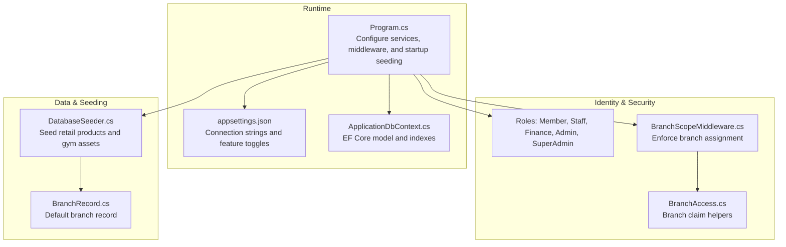
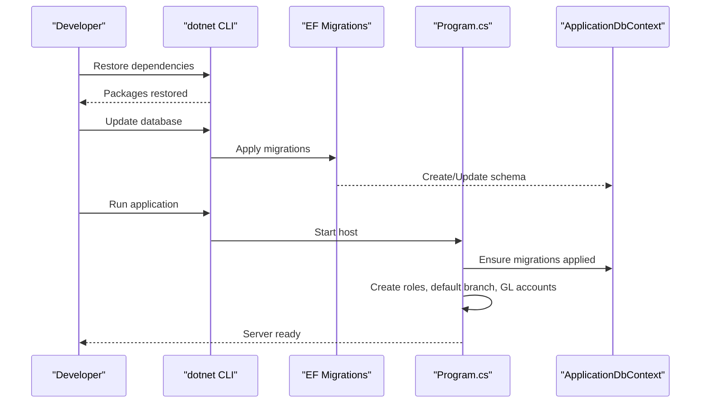
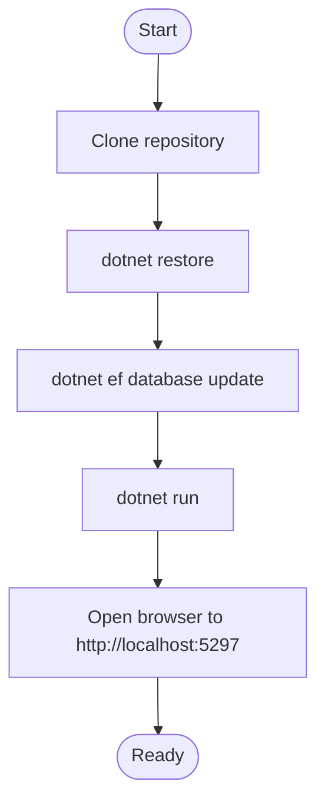
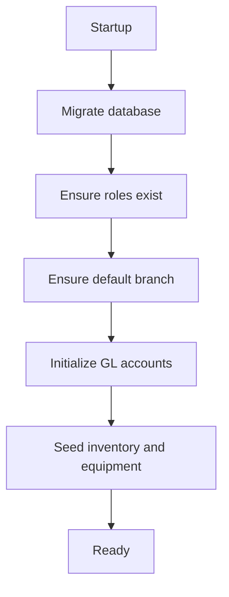
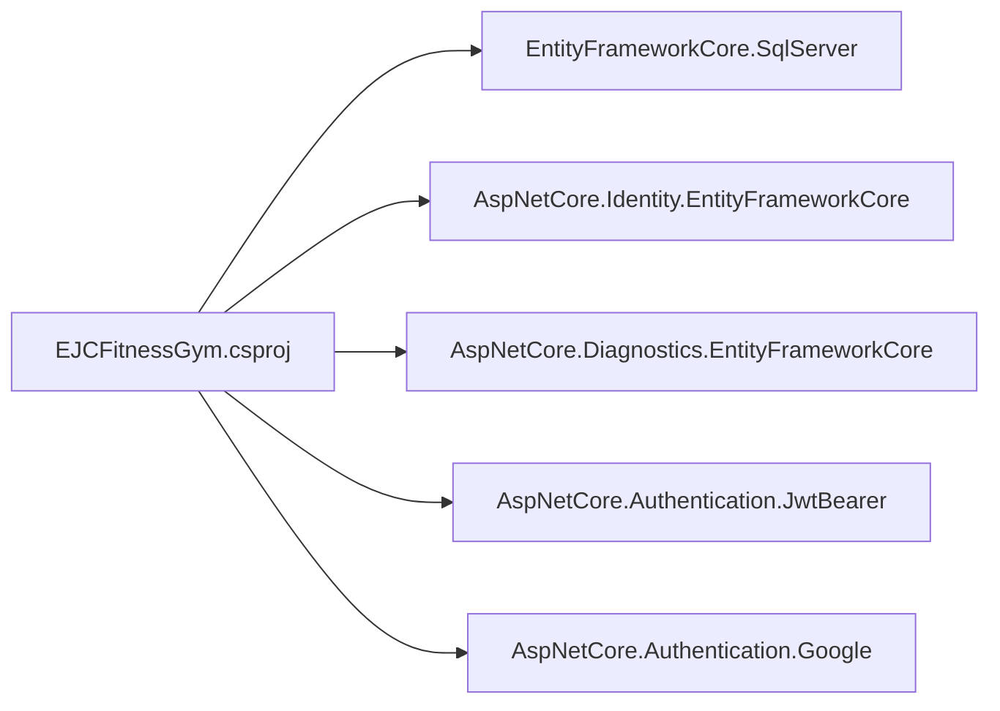
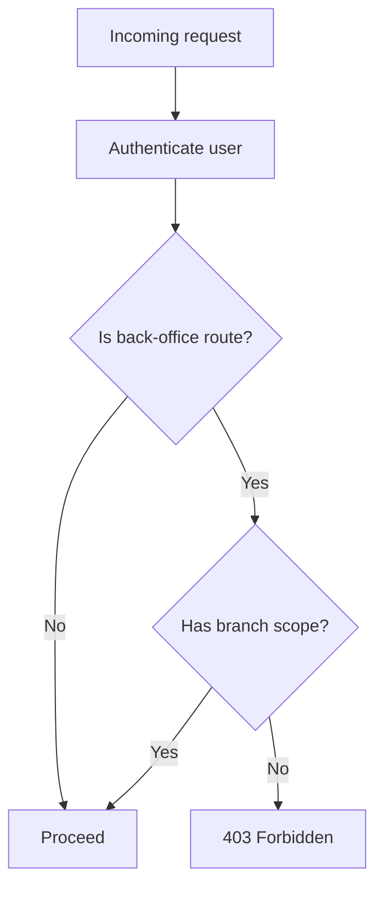

# Getting Started

<cite>
**Referenced Files in This Document**
- [README.md](file://README.md)
- [EJCFitnessGym.csproj](file://EJCFitnessGym.csproj)
- [appsettings.json](file://appsettings.json)
- [Program.cs](file://Program.cs)
- [ApplicationDbContext.cs](file://Data/ApplicationDbContext.cs)
- [DatabaseSeeder.cs](file://Data/DatabaseSeeder.cs)
- [launchSettings.json](file://Properties/launchSettings.json)
- [BranchScopeMiddleware.cs](file://Security/BranchScopeMiddleware.cs)
- [BranchAccess.cs](file://Security/BranchAccess.cs)
- [BranchRecord.cs](file://Models/Admin/BranchRecord.cs)
- [SubscriptionPlan.cs](file://Models/Billing/SubscriptionPlan.cs)
- [PayMongoOptions.cs](file://Services/Payments/PayMongoOptions.cs)
- [reset_branch_finance_data.sql](file://Scripts/reset_branch_finance_data.sql)
</cite>

## Table of Contents
1. [Introduction](#introduction)
2. [Project Structure](#project-structure)
3. [Core Components](#core-components)
4. [Architecture Overview](#architecture-overview)
5. [Detailed Component Analysis](#detailed-component-analysis)
6. [Dependency Analysis](#dependency-analysis)
7. [Performance Considerations](#performance-considerations)
8. [Troubleshooting Guide](#troubleshooting-guide)
9. [Conclusion](#conclusion)
10. [Appendices](#appendices)

## Introduction
This guide helps you install, configure, and run the EJC Fitness Gym system locally for the first time. It covers prerequisites, step-by-step installation, database setup, environment configuration, initial seeding, default credentials, and verification steps. It also explains the default user roles and how branch scoping works to control access.

## Project Structure
The system is an ASP.NET Core 8.0 web application with:
- Identity-based authentication and roles
- Entity Framework Core migrations for SQL Server
- Modular services for payments, finance, inventory, memberships, and integrations
- Razor Pages UI organized by functional areas (Admin, Finance, Staff, Member, Public)
- A comprehensive test suite

**Diagram sources**
- [Program.cs](file://Program.cs)
- [appsettings.json](file://appsettings.json)
- [ApplicationDbContext.cs](file://Data/ApplicationDbContext.cs)
- [BranchScopeMiddleware.cs](file://Security/BranchScopeMiddleware.cs)
- [BranchAccess.cs](file://Security/BranchAccess.cs)
- [DatabaseSeeder.cs](file://Data/DatabaseSeeder.cs)
- [BranchRecord.cs](file://Models/Admin/BranchRecord.cs)

**Section sources**
- [README.md](file://README.md)
- [EJCFitnessGym.csproj](file://EJCFitnessGym.csproj)

## Core Components
- Application entry and configuration: Program.cs sets up authentication, authorization, CORS, rate limiting, SignalR, hosted services, health checks, and runs migrations and seeding on startup.
- Database: ApplicationDbContext defines EF Core models and indexes for billing, finance, inventory, integrations, and admin entities.
- Identity and roles: ASP.NET Core Identity with roles and policies; branch-scoped access enforced by middleware and claims.
- Automatic seeding: First-run seeding creates default branch, roles, GL accounts, and sample inventory/equipment.

**Section sources**
- [Program.cs](file://Program.cs)
- [ApplicationDbContext.cs](file://Data/ApplicationDbContext.cs)
- [DatabaseSeeder.cs](file://Data/DatabaseSeeder.cs)

## Architecture Overview
The runtime pipeline applies forwarded headers, HTTPS redirection, CSP, routing, authentication, session, rate limiting, branch scope enforcement, authorization, and SignalR. Startup seeding ensures database readiness and default data.

**Diagram sources**
- [Program.cs](file://Program.cs)
- [ApplicationDbContext.cs](file://Data/ApplicationDbContext.cs)

## Detailed Component Analysis

### Prerequisites
- .NET 8.0 SDK
- SQL Server or LocalDB connection string configured in appsettings.json
- Optional: Google OAuth and PayMongo keys for development scenarios

**Section sources**
- [README.md](file://README.md)
- [EJCFitnessGym.csproj](file://EJCFitnessGym.csproj)
- [appsettings.json](file://appsettings.json)

### Step-by-Step Installation
1. Clone the repository and open the solution.
2. Restore dependencies.
3. Apply database migrations.
4. Run the application.

**Diagram sources**
- [README.md](file://README.md)

**Section sources**
- [README.md](file://README.md)

### Initial Setup: Database Configuration
- Connection string: The default connection targets LocalDB. Ensure SQL Server or LocalDB is installed and accessible.
- Migration: The application migrates the database on startup. Alternatively, apply migrations via the CLI.

**Section sources**
- [appsettings.json](file://appsettings.json)
- [Program.cs](file://Program.cs)

### Environment Variables and Configuration
- ConnectionStrings.DefaultConnection: Set your SQL Server instance.
- App.PublicBaseUrl: Required in production for correct links and redirects.
- Identity.RequireConfirmedEmail: Controls whether email confirmation is required.
- Email.Smtp: Configure SMTP for sending emails.
- Authentication.Google: Enable and configure Google OAuth client credentials.
- PayMongo: Configure secret/public keys and webhook secret for production.
- Jwt.SigningKey: Required in production; auto-generated in development.

Note: The application reads configuration from appsettings.json and merges development-specific overrides when using LocalDB.

**Section sources**
- [appsettings.json](file://appsettings.json)
- [Program.cs](file://Program.cs)

### First-Time Initialization and Automatic Seeding
On first run, the application:
- Applies migrations
- Creates roles: Member, Staff, Finance, Admin, SuperAdmin
- Ensures a default branch exists
- Initializes General Ledger default accounts
- Seeds retail inventory and gym equipment assets

**Diagram sources**
- [Program.cs](file://Program.cs)
- [DatabaseSeeder.cs](file://Data/DatabaseSeeder.cs)

**Section sources**
- [Program.cs](file://Program.cs)
- [DatabaseSeeder.cs](file://Data/DatabaseSeeder.cs)

### Default Credentials and Roles
Use the following default emails to log in. The standard password is typically configured via environment variables or development settings. After logging in, navigate to the appropriate portal based on your role.

- Super Admin: superadmin@ejcfit.local
- Admin: admin@ejcfit.local
- Finance: finance@ejcfit.local
- Staff: staff@ejcfit.local
- Member: member@ejcfit.local

Role-based access:
- Member: Access to personal dashboards and subscriptions
- Staff, Admin, Finance: Access to respective back-office areas
- SuperAdmin: Elevated privileges across branches

Branch scoping:
- Back-office users must be assigned to a branch (via claims). SuperAdmin bypasses branch scope.

**Section sources**
- [README.md](file://README.md)
- [Program.cs](file://Program.cs)
- [BranchScopeMiddleware.cs](file://Security/BranchScopeMiddleware.cs)
- [BranchAccess.cs](file://Security/BranchAccess.cs)

### Accessing the System for the First Time
- Launch the application using the configured profile (HTTP or HTTPS).
- Open the browser to the configured URL.
- Navigate to the appropriate area based on your role:
  - Member portal, Staff dashboard, Finance reports, Admin settings, or Public pricing pages.

**Section sources**
- [launchSettings.json](file://Properties/launchSettings.json)
- [Program.cs](file://Program.cs)

## Dependency Analysis
The project targets .NET 8.0 and uses Entity Framework Core with SQL Server. Key packages include ASP.NET Core Identity, JWT bearer authentication, diagnostics, and various domain services.

**Diagram sources**
- [EJCFitnessGym.csproj](file://EJCFitnessGym.csproj)

**Section sources**
- [EJCFitnessGym.csproj](file://EJCFitnessGym.csproj)

## Performance Considerations
- Use LocalDB for development; switch to SQL Server for performance testing.
- Keep indexes aligned with queries (EF model indexes are preconfigured).
- Monitor hosted services (e.g., Auto Billing, Finance Alert Evaluator) via operational health checks.

[No sources needed since this section provides general guidance]

## Troubleshooting Guide
Common setup issues and resolutions:
- SQL Server connection fails
  - Verify the connection string in appsettings.json points to a reachable SQL Server or LocalDB instance.
  - Ensure SQL Server is running and allows the specified authentication mode.
- Migration errors on startup
  - Run migrations manually using the CLI to inspect detailed errors.
  - Confirm the target database exists and is accessible.
- JWT signing key missing in production
  - Set Jwt:SigningKey in configuration; otherwise, startup throws an error.
- Google OAuth not working in development
  - If using LocalDB, the application attempts to load Google client secrets from a development configuration file. Ensure the values are present or configure them in appsettings.json.
- PayMongo webhook security
  - In production or when enabled, configure PayMongo:WebhookSecret; otherwise, startup validation will fail.
- Branch assignment required for back-office access
  - Back-office users receive 403 if they lack a branch assignment. Assign a branch to the user or use SuperAdmin.

Verification steps:
- Confirm migrations applied and database initialized.
- Log in with default credentials and navigate to your role’s portal.
- Check health checks endpoint for operational status.
- For finance-related resets during development, use the provided SQL script to clean branch data without affecting users or plans.

**Section sources**
- [Program.cs](file://Program.cs)
- [appsettings.json](file://appsettings.json)
- [reset_branch_finance_data.sql](file://Scripts/reset_branch_finance_data.sql)

## Conclusion
You now have the steps to install, configure, seed, and access the EJC Fitness Gym system locally. Use the default credentials to explore the portals, and rely on branch scoping and role policies to enforce access controls. For ongoing development, leverage the provided scripts and configuration options to tailor the environment to your needs.

[No sources needed since this section summarizes without analyzing specific files]

## Appendices

### Appendix A: Default Role Access Levels
- Member: Personal dashboards, subscription management, payment methods
- Staff: Attendance, POS, supplies, reports within assigned branch
- Admin: Member/staff accounts, subscription plans, branch settings within assigned branch
- Finance: Finance dashboards, alerts, equipment assets, general ledger, operating expenses, revenue/profit, weekly sales audit
- SuperAdmin: Full access across branches and elevated administrative capabilities

**Section sources**
- [Program.cs](file://Program.cs)
- [BranchScopeMiddleware.cs](file://Security/BranchScopeMiddleware.cs)

### Appendix B: Branch Scoping Mechanism
- Users in roles Staff, Admin, Finance must have a branch assignment claim.
- SuperAdmin bypasses branch scope.
- Middleware enforces branch scope for Admin, Finance, Staff, and related API routes.

**Diagram sources**
- [BranchScopeMiddleware.cs](file://Security/BranchScopeMiddleware.cs)
- [BranchAccess.cs](file://Security/BranchAccess.cs)