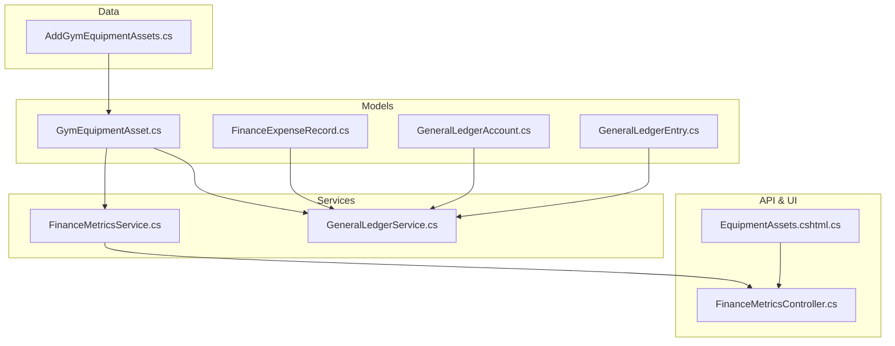
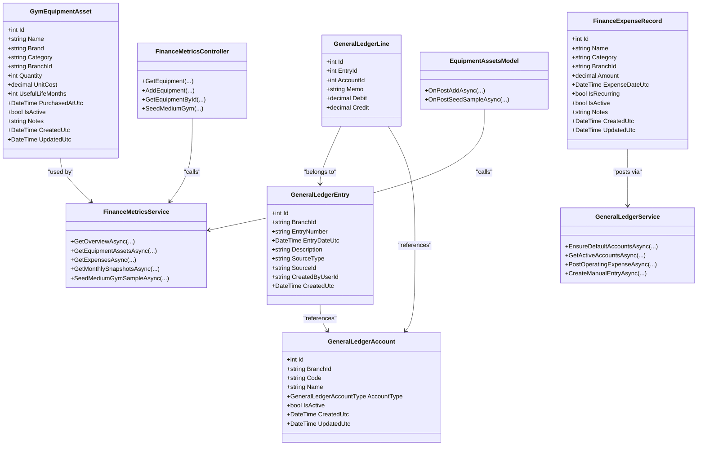
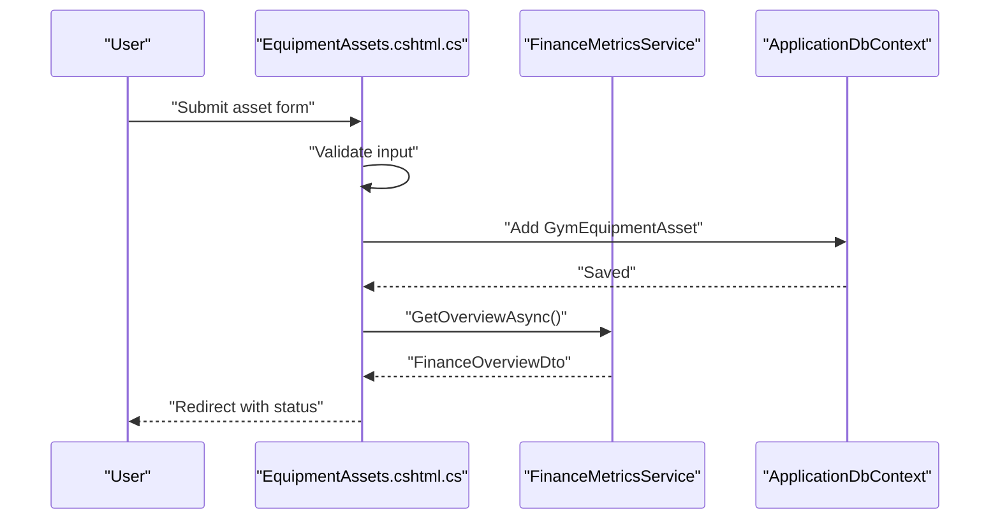
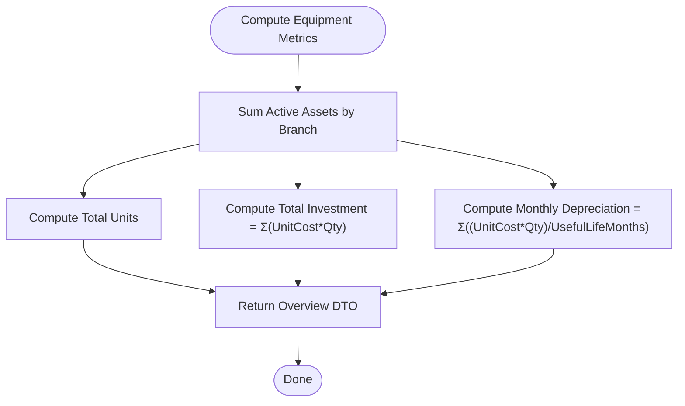
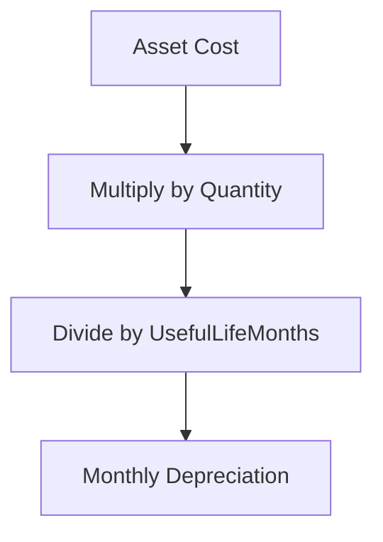
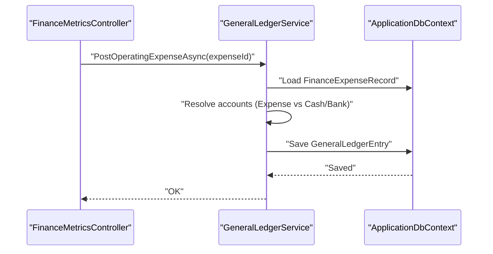
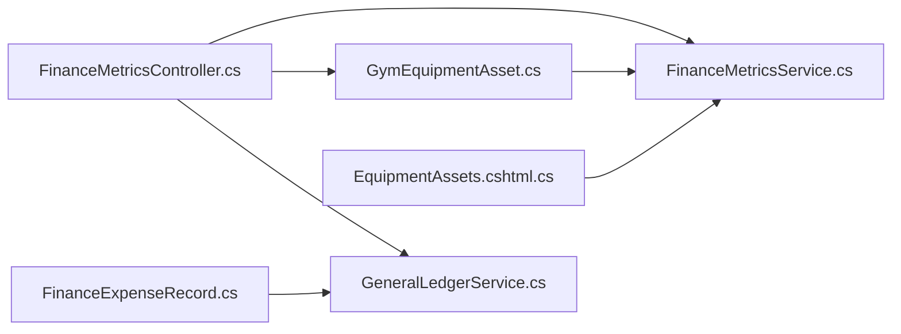

# Gym Equipment Asset Tracking

<cite>
**Referenced Files in This Document**
- [GymEquipmentAsset.cs](file://Models/Finance/GymEquipmentAsset.cs)
- [AddGymEquipmentAssets.cs](file://Data/Migrations/20260215104214_AddGymEquipmentAssets.cs)
- [GeneralLedgerAccount.cs](file://Models/Finance/GeneralLedgerAccount.cs)
- [GeneralLedgerEntry.cs](file://Models/Finance/GeneralLedgerEntry.cs)
- [GeneralLedgerService.cs](file://Services/Finance/GeneralLedgerService.cs)
- [FinanceMetricsService.cs](file://Services/Finance/FinanceMetricsService.cs)
- [FinanceMetricsController.cs](file://Controllers/FinanceMetricsController.cs)
- [EquipmentAssets.cshtml.cs](file://Pages/Finance/EquipmentAssets.cshtml.cs)
- [FinanceExpenseRecord.cs](file://Models/Finance/FinanceExpenseRecord.cs)
</cite>

## Table of Contents
1. [Introduction](#introduction)
2. [Project Structure](#project-structure)
3. [Core Components](#core-components)
4. [Architecture Overview](#architecture-overview)
5. [Detailed Component Analysis](#detailed-component-analysis)
6. [Dependency Analysis](#dependency-analysis)
7. [Performance Considerations](#performance-considerations)
8. [Troubleshooting Guide](#troubleshooting-guide)
9. [Conclusion](#conclusion)
10. [Appendices](#appendices)

## Introduction
This document explains the gym equipment asset tracking system implemented in the fitness management platform. It covers equipment registration, categorization, lifecycle management, purchase tracking, depreciation calculation, asset valuation in the general ledger, maintenance and inspection tracking, utilization reporting, branch allocation, transfers, retirement and disposal, and financial impact documentation. It also provides examples of equipment setup, maintenance workflows, and reporting dashboards.

## Project Structure
The asset tracking system spans models, migrations, services, controllers, and pages:
- Data model defines the equipment asset entity and related general ledger constructs.
- Migrations create and index the equipment asset table.
- Services compute financial metrics, including depreciation and valuation.
- Controllers expose APIs for equipment CRUD and reporting.
- Pages provide UI for adding and viewing equipment assets.
- General Ledger integrates financial postings for equipment-related transactions.



**Diagram sources**
- [GymEquipmentAsset.cs:1-44](file://Models/Finance/GymEquipmentAsset.cs#L1-L44)
- [GeneralLedgerAccount.cs:1-40](file://Models/Finance/GeneralLedgerAccount.cs#L1-L40)
- [GeneralLedgerEntry.cs:1-58](file://Models/Finance/GeneralLedgerEntry.cs#L1-L58)
- [FinanceExpenseRecord.cs:1-37](file://Models/Finance/FinanceExpenseRecord.cs#L1-L37)
- [AddGymEquipmentAssets.cs:1-51](file://Data/Migrations/20260215104214_AddGymEquipmentAssets.cs#L1-L51)
- [FinanceMetricsService.cs:1-826](file://Services/Finance/FinanceMetricsService.cs#L1-L826)
- [GeneralLedgerService.cs:1-616](file://Services/Finance/GeneralLedgerService.cs#L1-L616)
- [FinanceMetricsController.cs:1-693](file://Controllers/FinanceMetricsController.cs#L1-L693)
- [EquipmentAssets.cshtml.cs:1-136](file://Pages/Finance/EquipmentAssets.cshtml.cs#L1-L136)

**Section sources**
- [GymEquipmentAsset.cs:1-44](file://Models/Finance/GymEquipmentAsset.cs#L1-L44)
- [AddGymEquipmentAssets.cs:1-51](file://Data/Migrations/20260215104214_AddGymEquipmentAssets.cs#L1-L51)

## Core Components
- GymEquipmentAsset: Core asset entity with identity, descriptive attributes, branch scoping, quantity, unit cost, useful life, purchase date, activity flag, and notes.
- FinanceMetricsService: Computes equipment totals, monthly depreciation, and integrates with financial summaries.
- GeneralLedgerService: Posts financial entries for expenses and supports manual entries; integrates with equipment via operational expense postings.
- FinanceMetricsController: Exposes REST endpoints for equipment CRUD, reporting, and analytics.
- EquipmentAssets page: UI for adding assets and viewing overview and assets.

**Section sources**
- [GymEquipmentAsset.cs:1-44](file://Models/Finance/GymEquipmentAsset.cs#L1-L44)
- [FinanceMetricsService.cs:9-141](file://Services/Finance/FinanceMetricsService.cs#L9-L141)
- [GeneralLedgerService.cs:11-115](file://Services/Finance/GeneralLedgerService.cs#L11-L115)
- [FinanceMetricsController.cs:117-143](file://Controllers/FinanceMetricsController.cs#L117-L143)
- [EquipmentAssets.cshtml.cs:12-33](file://Pages/Finance/EquipmentAssets.cshtml.cs#L12-L33)

## Architecture Overview
The system follows a layered architecture:
- Presentation: Razor Page for equipment assets and API controller for backend operations.
- Application: Services encapsulate business logic for financial metrics and general ledger integration.
- Data: Entity models and migrations define persistence and indexing.



**Diagram sources**
- [GymEquipmentAsset.cs:5-42](file://Models/Finance/GymEquipmentAsset.cs#L5-L42)
- [GeneralLedgerAccount.cs:14-38](file://Models/Finance/GeneralLedgerAccount.cs#L14-L38)
- [GeneralLedgerEntry.cs:5-34](file://Models/Finance/GeneralLedgerEntry.cs#L5-L34)
- [FinanceExpenseRecord.cs:5-35](file://Models/Finance/FinanceExpenseRecord.cs#L5-L35)
- [FinanceMetricsService.cs:9-534](file://Services/Finance/FinanceMetricsService.cs#L9-L534)
- [GeneralLedgerService.cs:11-537](file://Services/Finance/GeneralLedgerService.cs#L11-L537)
- [FinanceMetricsController.cs:117-495](file://Controllers/FinanceMetricsController.cs#L117-L495)
- [EquipmentAssets.cshtml.cs:12-99](file://Pages/Finance/EquipmentAssets.cshtml.cs#L12-L99)

## Detailed Component Analysis

### GymEquipmentAsset Model
- Purpose: Represents gym equipment with branch scoping, quantity, unit cost, useful life, purchase date, and activity flag.
- Lifecycle: Assets are created inactive by default and activated upon registration; they support soft-deactivation for retirement/disposal.
- Branch allocation: BranchId enables per-branch visibility and aggregation.
- Purchase tracking: PurchasedAtUtc captures acquisition date; combined with UnitCost and Quantity for total cost computation.
- Depreciation: UsefulLifeMonths drives straight-line monthly depreciation in financial computations.

```mermaid
erDiagram
GYM_EQUIPMENT_ASSET {
int Id PK
string Name
string Brand
string Category
string BranchId
int Quantity
decimal UnitCost
int UsefulLifeMonths
datetime UTC PurchasedAtUtc
bool IsActive
string Notes
datetime UTC CreatedUtc
datetime UTC UpdatedUtc
}
```

**Diagram sources**
- [GymEquipmentAsset.cs:5-42](file://Models/Finance/GymEquipmentAsset.cs#L5-L42)

**Section sources**
- [GymEquipmentAsset.cs:1-44](file://Models/Finance/GymEquipmentAsset.cs#L1-L44)
- [AddGymEquipmentAssets.cs:14-40](file://Data/Migrations/20260215104214_AddGymEquipmentAssets.cs#L14-L40)

### Equipment Registration and Categorization
- Registration UI: EquipmentAssets page accepts asset inputs and persists to database.
- Categorization: Category field supports grouping across cardio, strength machines, free weights, and functional categories.
- Validation: Inputs enforce length limits, ranges, and required fields.



**Diagram sources**
- [EquipmentAssets.cshtml.cs:52-99](file://Pages/Finance/EquipmentAssets.cshtml.cs#L52-L99)
- [FinanceMetricsService.cs:54-141](file://Services/Finance/FinanceMetricsService.cs#L54-L141)

**Section sources**
- [EquipmentAssets.cshtml.cs:24-99](file://Pages/Finance/EquipmentAssets.cshtml.cs#L24-L99)

### Equipment Purchase Tracking and Asset Valuation
- Purchase tracking: PurchasedAtUtc, UnitCost, Quantity, and Category capture acquisition details.
- Asset valuation: Total cost computed as UnitCost × Quantity; monthly depreciation computed as Σ((Quantity × UnitCost) / UsefulLifeMonths) across active assets.
- Financial integration: Equipment data contributes to financial overviews and monthly snapshots.



**Diagram sources**
- [FinanceMetricsService.cs:97-122](file://Services/Finance/FinanceMetricsService.cs#L97-L122)

**Section sources**
- [FinanceMetricsService.cs:94-141](file://Services/Finance/FinanceMetricsService.cs#L94-L141)

### Depreciation Calculation Methods
- Straight-line method: Monthly depreciation equals (Cost − Salvage Value) / Useful Life (months). The system currently computes monthly depreciation as (UnitCost × Quantity) / UsefulLifeMonths without explicit salvage value adjustments.
- Monthly snapshots: Depreciation is included in monthly net profit calculations.



**Diagram sources**
- [FinanceMetricsService.cs:108-111](file://Services/Finance/FinanceMetricsService.cs#L108-L111)

**Section sources**
- [FinanceMetricsService.cs:108-111](file://Services/Finance/FinanceMetricsService.cs#L108-L111)

### General Ledger Integration for Equipment
- Scope: GeneralLedgerService operates per branch; accounts are ensured per branch.
- Posting: Equipment-related expenses are posted as operating expenses; manual entries supported for adjustments.
- Journal entries: Entries include debits/credits mapped to appropriate accounts and memo/reference metadata.



**Diagram sources**
- [FinanceMetricsController.cs:358-373](file://Controllers/FinanceMetricsController.cs#L358-L373)
- [GeneralLedgerService.cs:215-295](file://Services/Finance/GeneralLedgerService.cs#L215-L295)

**Section sources**
- [GeneralLedgerService.cs:47-115](file://Services/Finance/GeneralLedgerService.cs#L47-L115)
- [GeneralLedgerService.cs:215-295](file://Services/Finance/GeneralLedgerService.cs#L215-L295)
- [FinanceExpenseRecord.cs:1-37](file://Models/Finance/FinanceExpenseRecord.cs#L1-L37)

### Equipment Maintenance Scheduling, Inspection Records, and Service History
- Current state: The codebase does not include dedicated maintenance scheduling, inspection records, or service history tracking entities or workflows.
- Recommendation: Introduce a MaintenanceSchedule entity linked to GymEquipmentAsset with fields for scheduled date, type, assigned staff, and status. Add MaintenanceRecord with completion date, parts used, labor hours, and inspector notes.

[No sources needed since this section identifies absence of specific files and proposes future enhancements conceptually]

### Equipment Utilization Reporting
- Current state: No dedicated utilization metrics or reporting endpoints for equipment usage are present in the codebase.
- Recommendation: Track utilization via check-in/check-out events or membership usage logs associated with equipment, aggregating counts per asset and time windows.

[No sources needed since this section identifies absence of specific files and proposes future enhancements conceptually]

### Branch Allocation Tracking and Asset Transfer Procedures
- Branch allocation: BranchId on GymEquipmentAsset scopes assets to branches; queries filter by BranchId for branch-specific views.
- Transfers: No explicit transfer entity or workflow exists; recommend adding a TransferRecord linking source and destination branches with approval and audit fields.

**Section sources**
- [GymEquipmentAsset.cs:20-21](file://Models/Finance/GymEquipmentAsset.cs#L20-L21)
- [FinanceMetricsService.cs:287-297](file://Services/Finance/FinanceMetricsService.cs#L287-L297)

### Equipment Retirement and Disposal Processes
- Current state: No retirement/disposal entities or workflows are implemented.
- Recommendation: Add a DisposalRecord with asset linkage, disposal date, method, salvage value, and financial impact posting to general ledger.

[No sources needed since this section identifies absence of specific files and proposes future enhancements conceptually]

### Examples

#### Equipment Setup Example
- Steps:
  - Navigate to the Equipment Assets page.
  - Fill in asset details: name, brand, category, quantity, unit cost, useful life in months, purchase date, and notes.
  - Submit; the system validates and persists the asset and updates the financial overview.

**Section sources**
- [EquipmentAssets.cshtml.cs:52-88](file://Pages/Finance/EquipmentAssets.cshtml.cs#L52-L88)

#### Maintenance Workflow Example
- Recommended process:
  - Create a MaintenanceSchedule entry against an asset with scheduled date and type.
  - On completion, create a MaintenanceRecord with parts/labor and inspector notes.
  - Update asset status to reflect maintenance cycle.

[No sources needed since this section proposes a conceptual workflow]

#### Reporting Dashboard Example
- API endpoints:
  - GET api/finance/equipment for asset inventory.
  - GET api/finance/monthly for monthly snapshots including depreciation costs.
  - GET api/finance/overview for consolidated financial metrics including equipment totals and monthly depreciation.

**Section sources**
- [FinanceMetricsController.cs:117-143](file://Controllers/FinanceMetricsController.cs#L117-L143)
- [FinanceMetricsController.cs:145-171](file://Controllers/FinanceMetricsController.cs#L145-L171)
- [FinanceMetricsController.cs:43-55](file://Controllers/FinanceMetricsController.cs#L43-L55)

## Dependency Analysis
- GymEquipmentAsset depends on branch scoping and is consumed by FinanceMetricsService for financial computations.
- FinanceMetricsController orchestrates equipment CRUD and reporting; delegates to FinanceMetricsService for data retrieval.
- GeneralLedgerService posts financial entries for expenses; equipment-related expenses integrate via controller calls.
- EquipmentAssets page coordinates UI actions with service-driven overview.



**Diagram sources**
- [GymEquipmentAsset.cs:5-42](file://Models/Finance/GymEquipmentAsset.cs#L5-L42)
- [FinanceMetricsService.cs:9-534](file://Services/Finance/FinanceMetricsService.cs#L9-L534)
- [FinanceMetricsController.cs:117-495](file://Controllers/FinanceMetricsController.cs#L117-L495)
- [EquipmentAssets.cshtml.cs:12-99](file://Pages/Finance/EquipmentAssets.cshtml.cs#L12-L99)
- [FinanceExpenseRecord.cs:5-35](file://Models/Finance/FinanceExpenseRecord.cs#L5-L35)
- [GeneralLedgerService.cs:11-115](file://Services/Finance/GeneralLedgerService.cs#L11-L115)

**Section sources**
- [FinanceMetricsController.cs:17-41](file://Controllers/FinanceMetricsController.cs#L17-L41)
- [FinanceMetricsService.cs:9-52](file://Services/Finance/FinanceMetricsService.cs#L9-L52)

## Performance Considerations
- Query filtering: Use BranchId and IsActive to limit scans for branch-scoped views.
- Aggregation efficiency: Grouped queries for equipment totals and monthly depreciation reduce per-row processing.
- Indexing: Composite index on Name, Brand, Category supports efficient asset discovery and deduplication during seeding.

**Section sources**
- [AddGymEquipmentAssets.cs:37-40](file://Data/Migrations/20260215104214_AddGymEquipmentAssets.cs#L37-L40)
- [FinanceMetricsService.cs:97-122](file://Services/Finance/FinanceMetricsService.cs#L97-L122)

## Troubleshooting Guide
- Equipment not appearing in reports:
  - Verify IsActive flag and BranchId match the current branch.
  - Confirm PurchasedAtUtc and UsefulLifeMonths are set appropriately.
- Depreciation not reflected:
  - Ensure assets are active and UsefulLifeMonths > 0.
  - Confirm monthly snapshots include depreciation in net profit calculations.
- General ledger posting failures:
  - Check required accounts exist per branch and are active.
  - Review posting conditions and source entry existence checks.

**Section sources**
- [FinanceMetricsService.cs:94-141](file://Services/Finance/FinanceMetricsService.cs#L94-L141)
- [GeneralLedgerService.cs:47-115](file://Services/Finance/GeneralLedgerService.cs#L47-L115)
- [GeneralLedgerService.cs:539-579](file://Services/Finance/GeneralLedgerService.cs#L539-L579)

## Conclusion
The gym equipment asset tracking system provides robust asset registration, categorization, branch scoping, and financial integration through general ledger posting. Depreciation is computed via straight-line monthly charges and integrated into financial overviews and monthly snapshots. Future enhancements should introduce maintenance scheduling, inspection records, utilization reporting, transfer procedures, and retirement/disposal workflows to complete the lifecycle management.

## Appendices

### API Definitions
- GET api/finance/equipment
  - Returns equipment list with computed total cost and useful life.
- POST api/finance/equipment
  - Creates a new equipment asset; triggers alerts.
- GET api/finance/monthly
  - Returns monthly snapshots including depreciation costs.
- GET api/finance/overview
  - Returns consolidated financial metrics including equipment totals and monthly depreciation.

**Section sources**
- [FinanceMetricsController.cs:117-143](file://Controllers/FinanceMetricsController.cs#L117-L143)
- [FinanceMetricsController.cs:43-55](file://Controllers/FinanceMetricsController.cs#L43-L55)
- [FinanceMetricsController.cs:87-115](file://Controllers/FinanceMetricsController.cs#L87-L115)
- [FinanceMetricsController.cs:439-495](file://Controllers/FinanceMetricsController.cs#L439-L495)