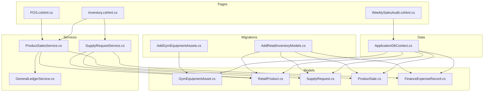
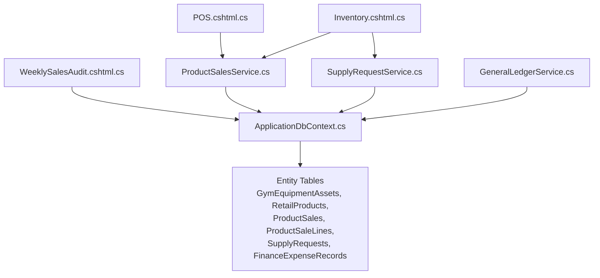
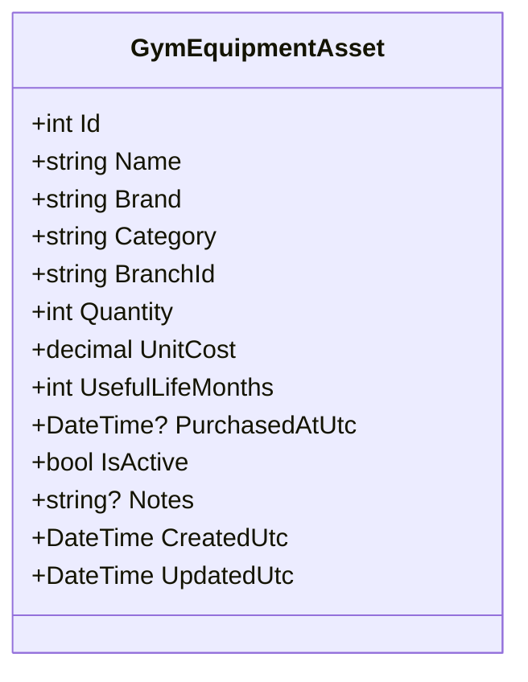
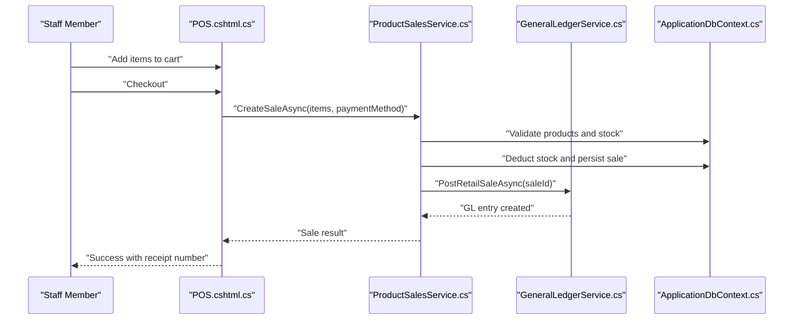
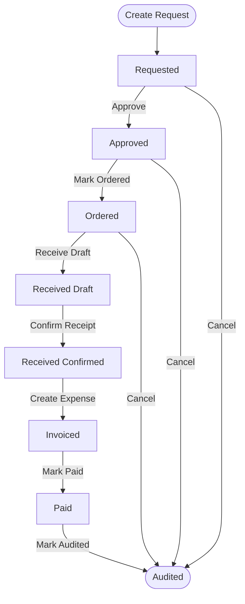
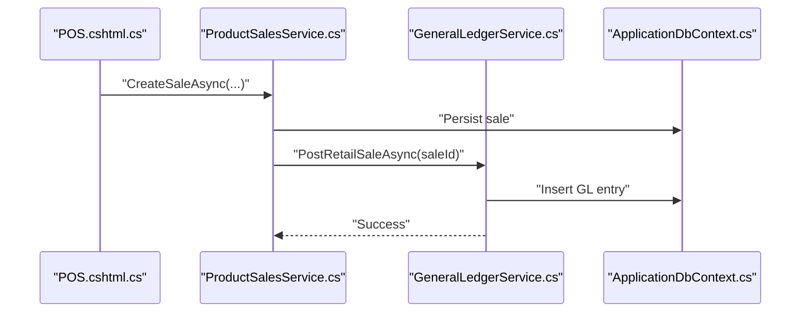
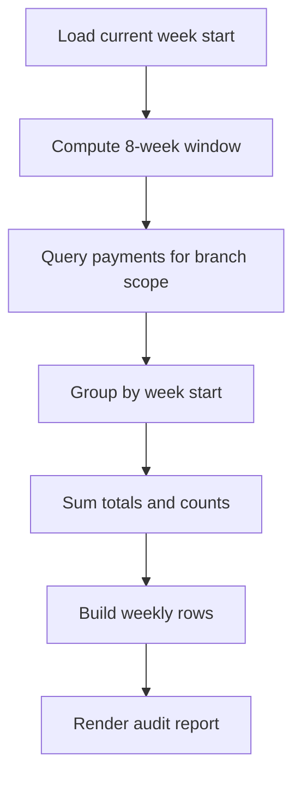
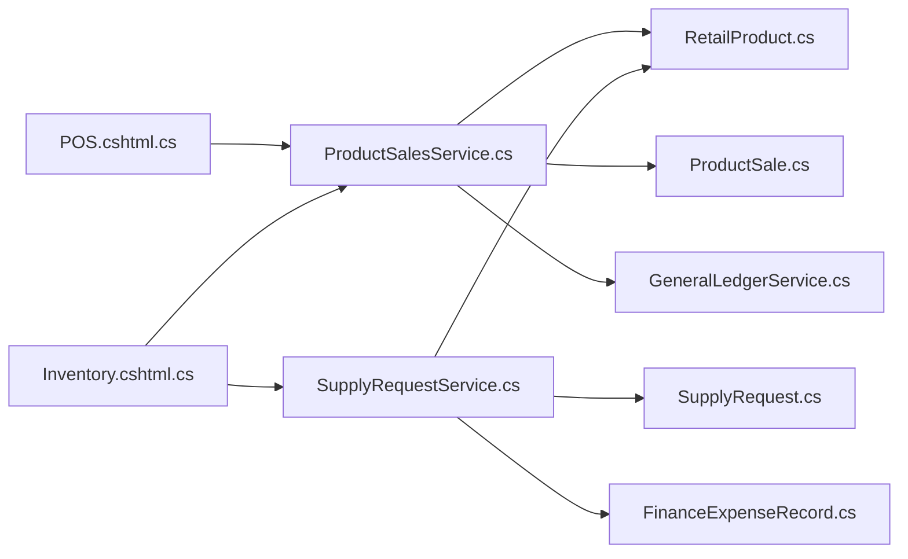

# Inventory and Asset Management

<cite>
**Referenced Files in This Document**
- [AddGymEquipmentAssets.cs](file://Data/Migrations/20260215104214_AddGymEquipmentAssets.cs)
- [AddRetailInventoryModels.cs](file://Data/Migrations/20260302102218_AddRetailInventoryModels.cs)
- [GymEquipmentAsset.cs](file://Models/Finance/GymEquipmentAsset.cs)
- [RetailProduct.cs](file://Models/Inventory/RetailProduct.cs)
- [SupplyRequest.cs](file://Models/Inventory/SupplyRequest.cs)
- [ProductSale.cs](file://Models/Inventory/ProductSale.cs)
- [ProductSalesService.cs](file://Services/Inventory/ProductSalesService.cs)
- [SupplyRequestService.cs](file://Services/Inventory/SupplyRequestService.cs)
- [GeneralLedgerService.cs](file://Services/Finance/GeneralLedgerService.cs)
- [ApplicationDbContext.cs](file://Data/ApplicationDbContext.cs)
- [POS.cshtml.cs](file://Pages/Staff/POS.cshtml.cs)
- [Inventory.cshtml.cs](file://Pages/Admin/Inventory.cshtml.cs)
- [WeeklySalesAudit.cshtml.cs](file://Pages/Finance/WeeklySalesAudit.cshtml.cs)
- [FinanceExpenseRecord.cs](file://Models/Finance/FinanceExpenseRecord.cs)
</cite>

## Table of Contents
1. [Introduction](#introduction)
2. [Project Structure](#project-structure)
3. [Core Components](#core-components)
4. [Architecture Overview](#architecture-overview)
5. [Detailed Component Analysis](#detailed-component-analysis)
6. [Dependency Analysis](#dependency-analysis)
7. [Performance Considerations](#performance-considerations)
8. [Troubleshooting Guide](#troubleshooting-guide)
9. [Conclusion](#conclusion)

## Introduction
This document provides a comprehensive guide to the EJC Fitness Gym inventory and asset management system. It covers equipment asset tracking, retail product management, supply request workflows, POS sales processing, financial integration, and operational controls such as stock alerts and audit reporting. The system integrates retail sales with the general ledger and automates supply chain stages while maintaining branch-scoped visibility and audit readiness.

## Project Structure
The inventory and asset management functionality spans models, migrations, services, pages, and database contexts:
- Equipment assets: models and migrations define gym equipment records and indexing.
- Retail inventory: models and migrations define products, sales, and supply requests.
- Services: business logic for POS sales and supply request lifecycle.
- Pages: UI surfaces for POS and administrative inventory management.
- Financial integration: general ledger posting for retail sales and expenses.
- Data context: entity configurations and indexes.

**Diagram sources**
- [AddGymEquipmentAssets.cs:12-41](file://Data/Migrations/20260215104214_AddGymEquipmentAssets.cs#L12-L41)
- [AddRetailInventoryModels.cs:12-190](file://Data/Migrations/20260302102218_AddRetailInventoryModels.cs#L12-L190)
- [GymEquipmentAsset.cs:5-42](file://Models/Finance/GymEquipmentAsset.cs#L5-L42)
- [RetailProduct.cs:5-41](file://Models/Inventory/RetailProduct.cs#L5-L41)
- [SupplyRequest.cs:5-78](file://Models/Inventory/SupplyRequest.cs#L5-L78)
- [ProductSale.cs:5-80](file://Models/Inventory/ProductSale.cs#L5-L80)
- [FinanceExpenseRecord.cs:5-36](file://Models/Finance/FinanceExpenseRecord.cs#L5-L36)
- [ProductSalesService.cs:9-362](file://Services/Inventory/ProductSalesService.cs#L9-L362)
- [SupplyRequestService.cs:9-429](file://Services/Inventory/SupplyRequestService.cs#L9-L429)
- [GeneralLedgerService.cs:11-615](file://Services/Finance/GeneralLedgerService.cs#L11-L615)
- [ApplicationDbContext.cs:24-411](file://Data/ApplicationDbContext.cs#L24-L411)
- [POS.cshtml.cs:14-209](file://Pages/Staff/POS.cshtml.cs#L14-L209)
- [Inventory.cshtml.cs:13-347](file://Pages/Admin/Inventory.cshtml.cs#L13-L347)
- [WeeklySalesAudit.cshtml.cs:11-151](file://Pages/Finance/WeeklySalesAudit.cshtml.cs#L11-L151)

**Section sources**
- [AddGymEquipmentAssets.cs:12-41](file://Data/Migrations/20260215104214_AddGymEquipmentAssets.cs#L12-L41)
- [AddRetailInventoryModels.cs:12-190](file://Data/Migrations/20260302102218_AddRetailInventoryModels.cs#L12-L190)
- [ApplicationDbContext.cs:24-411](file://Data/ApplicationDbContext.cs#L24-L411)

## Core Components
- Equipment Asset Tracking
  - Gym equipment assets are tracked per branch with attributes for name, brand, category, quantity, unit cost, useful life, purchase date, and lifecycle flags. Indexes support efficient filtering and reporting.
  - Reference: [GymEquipmentAsset.cs:5-42](file://Models/Finance/GymEquipmentAsset.cs#L5-L42), [AddGymEquipmentAssets.cs:14-40](file://Data/Migrations/20260215104214_AddGymEquipmentAssets.cs#L14-L40)

- Retail Product Management
  - Products include SKU, category, unit, pricing, stock levels, reorder thresholds, and branch scoping. Indexes enable fast queries by branch, category, and SKU.
  - Reference: [RetailProduct.cs:5-41](file://Models/Inventory/RetailProduct.cs#L5-L41), [AddRetailInventoryModels.cs:52-74](file://Data/Migrations/20260302102218_AddRetailInventoryModels.cs#L52-L74)

- Supply Request Workflow
  - Requests progress through stages: Requested, Approved, Ordered, Received Draft, Received Confirmed, Invoiced, Paid, Audited, Cancelled. Inventory synchronization occurs upon receipt confirmation.
  - Reference: [SupplyRequest.cs:5-78](file://Models/Inventory/SupplyRequest.cs#L5-L78), [SupplyRequestService.cs:86-248](file://Services/Inventory/SupplyRequestService.cs#L86-L248)

- Point-of-Sale (POS) Sales
  - POS captures customer details, payment method, and cart items. Stock is reduced on successful sale; VAT is calculated at 12%. Completed sales post to the general ledger and enqueue back-office notifications.
  - Reference: [POS.cshtml.cs:14-209](file://Pages/Staff/POS.cshtml.cs#L14-L209), [ProductSalesService.cs:106-218](file://Services/Inventory/ProductSalesService.cs#L106-L218)

- Financial Integration
  - General ledger posts retail sales and expense entries, mapping payment methods to appropriate accounts. Duplicate entries are prevented via source tracking.
  - Reference: [GeneralLedgerService.cs:297-456](file://Services/Finance/GeneralLedgerService.cs#L297-L456), [FinanceExpenseRecord.cs:5-36](file://Models/Finance/FinanceExpenseRecord.cs#L5-L36)

**Section sources**
- [GymEquipmentAsset.cs:5-42](file://Models/Finance/GymEquipmentAsset.cs#L5-L42)
- [RetailProduct.cs:5-41](file://Models/Inventory/RetailProduct.cs#L5-L41)
- [SupplyRequest.cs:5-78](file://Models/Inventory/SupplyRequest.cs#L5-L78)
- [ProductSalesService.cs:106-218](file://Services/Inventory/ProductSalesService.cs#L106-L218)
- [GeneralLedgerService.cs:297-456](file://Services/Finance/GeneralLedgerService.cs#L297-L456)

## Architecture Overview
The system follows a layered architecture:
- Data layer: Entity models and EF Core context with configured indexes.
- Services layer: Business logic for POS sales and supply requests, plus financial posting.
- Presentation layer: Razor Pages for POS and administrative inventory management.
- Integration: Outbox pattern for asynchronous back-office notifications.

**Diagram sources**
- [POS.cshtml.cs:14-209](file://Pages/Staff/POS.cshtml.cs#L14-L209)
- [Inventory.cshtml.cs:13-347](file://Pages/Admin/Inventory.cshtml.cs#L13-L347)
- [WeeklySalesAudit.cshtml.cs:11-151](file://Pages/Finance/WeeklySalesAudit.cshtml.cs#L11-L151)
- [ProductSalesService.cs:9-362](file://Services/Inventory/ProductSalesService.cs#L9-L362)
- [SupplyRequestService.cs:9-429](file://Services/Inventory/SupplyRequestService.cs#L9-L429)
- [GeneralLedgerService.cs:11-615](file://Services/Finance/GeneralLedgerService.cs#L11-L615)
- [ApplicationDbContext.cs:24-411](file://Data/ApplicationDbContext.cs#L24-L411)

## Detailed Component Analysis

### Equipment Asset Tracking
- Purpose: Record gym equipment per branch, track acquisition and lifecycle.
- Key attributes: Name, Brand, Category, Quantity, UnitCost, UsefulLifeMonths, PurchasedAtUtc, IsActive, Notes, CreatedUtc, UpdatedUtc.
- Lifecycle: Assets are branch-scoped and indexed for efficient reporting.

**Diagram sources**
- [GymEquipmentAsset.cs:5-42](file://Models/Finance/GymEquipmentAsset.cs#L5-L42)

**Section sources**
- [GymEquipmentAsset.cs:5-42](file://Models/Finance/GymEquipmentAsset.cs#L5-L42)
- [AddGymEquipmentAssets.cs:14-40](file://Data/Migrations/20260215104214_AddGymEquipmentAssets.cs#L14-L40)

### Retail Product Catalog and POS Sales
- Product catalog: SKU, category, unit, unit price, cost price, stock quantity, reorder level, branch scoping, active flag.
- POS workflow: Add to cart, update quantities, checkout, reduce stock, compute totals with VAT, post to ledger, enqueue notifications.
- Stock alerts: Low stock and out-of-stock indicators derived from stock quantity vs reorder level.

**Diagram sources**
- [POS.cshtml.cs:132-186](file://Pages/Staff/POS.cshtml.cs#L132-L186)
- [ProductSalesService.cs:106-218](file://Services/Inventory/ProductSalesService.cs#L106-L218)
- [GeneralLedgerService.cs:297-372](file://Services/Finance/GeneralLedgerService.cs#L297-L372)
- [ApplicationDbContext.cs:311-354](file://Data/ApplicationDbContext.cs#L311-L354)

**Section sources**
- [RetailProduct.cs:5-41](file://Models/Inventory/RetailProduct.cs#L5-L41)
- [ProductSale.cs:5-80](file://Models/Inventory/ProductSale.cs#L5-L80)
- [POS.cshtml.cs:132-186](file://Pages/Staff/POS.cshtml.cs#L132-L186)
- [ProductSalesService.cs:106-218](file://Services/Inventory/ProductSalesService.cs#L106-L218)
- [Inventory.cshtml.cs:240-245](file://Pages/Admin/Inventory.cshtml.cs#L240-L245)

### Supply Request Workflow and Procurement Tracking
- Workflow stages: Requested → Approved → Ordered → Received Draft → Received Confirmed → Invoiced → Paid → Audited → Complete.
- Inventory sync: When a request reaches “Received Confirmed,” stock increases and cost price is updated if provided.
- Expense creation: Upon confirmation, an expense record is created and linked to the request.

**Diagram sources**
- [SupplyRequest.cs:66-78](file://Models/Inventory/SupplyRequest.cs#L66-L78)
- [SupplyRequestService.cs:86-248](file://Services/Inventory/SupplyRequestService.cs#L86-L248)

**Section sources**
- [SupplyRequest.cs:5-78](file://Models/Inventory/SupplyRequest.cs#L5-L78)
- [SupplyRequestService.cs:86-248](file://Services/Inventory/SupplyRequestService.cs#L86-L248)
- [SupplyRequestService.cs:320-410](file://Services/Inventory/SupplyRequestService.cs#L320-L410)

### Financial Integration and General Ledger Posting
- Retail sales: Debit cash/bank or accounts receivable, credit retail revenue; reversals supported for voided sales.
- Expenses: Debit operating expense, credit cash/bank; posted from supply request workflow.
- Duplicate prevention: Source tracking ensures one-way posting per source.

**Diagram sources**
- [ProductSalesService.cs:188-215](file://Services/Inventory/ProductSalesService.cs#L188-L215)
- [GeneralLedgerService.cs:297-372](file://Services/Finance/GeneralLedgerService.cs#L297-L372)

**Section sources**
- [GeneralLedgerService.cs:297-456](file://Services/Finance/GeneralLedgerService.cs#L297-L456)
- [FinanceExpenseRecord.cs:5-36](file://Models/Finance/FinanceExpenseRecord.cs#L5-L36)

### Inventory Auditing and Reporting
- Weekly sales audit: Aggregates payments by week, separating staff-collected vs gateway sales for the last four weeks.
- Branch scoping: Queries restrict results to authorized branches via claims or explicit branch IDs.

**Diagram sources**
- [WeeklySalesAudit.cshtml.cs:28-103](file://Pages/Finance/WeeklySalesAudit.cshtml.cs#L28-L103)

**Section sources**
- [WeeklySalesAudit.cshtml.cs:28-103](file://Pages/Finance/WeeklySalesAudit.cshtml.cs#L28-L103)

## Dependency Analysis
- Entities and indexes
  - Equipment assets, retail products, supply requests, product sales, and finance expense records are defined with precision and index configurations for performance and uniqueness.
- Service-to-model relationships
  - ProductSalesService depends on RetailProduct and ProductSale entities and coordinates with GeneralLedgerService and the integration outbox.
  - SupplyRequestService depends on SupplyRequest, RetailProduct, and FinanceExpenseRecord, orchestrating inventory updates and expense creation.
- UI-to-service bindings
  - POS page delegates to ProductSalesService; Admin Inventory page delegates to both ProductSalesService and SupplyRequestService.

**Diagram sources**
- [ProductSalesService.cs:9-362](file://Services/Inventory/ProductSalesService.cs#L9-L362)
- [SupplyRequestService.cs:9-429](file://Services/Inventory/SupplyRequestService.cs#L9-L429)
- [POS.cshtml.cs:14-209](file://Pages/Staff/POS.cshtml.cs#L14-L209)
- [Inventory.cshtml.cs:13-347](file://Pages/Admin/Inventory.cshtml.cs#L13-L347)

**Section sources**
- [ApplicationDbContext.cs:24-411](file://Data/ApplicationDbContext.cs#L24-L411)
- [ProductSalesService.cs:9-362](file://Services/Inventory/ProductSalesService.cs#L9-L362)
- [SupplyRequestService.cs:9-429](file://Services/Inventory/SupplyRequestService.cs#L9-L429)

## Performance Considerations
- Indexes
  - Equipment assets indexed by name, brand, category; retail products indexed by branch, category, and SKU; supply requests indexed by branch, stage, and created date; product sales indexed by branch, date, and status.
- Precision
  - Monetary fields use 18-digit precision with two decimals for accuracy across calculations and ledger postings.
- Asynchronous notifications
  - Outbox pattern prevents blocking during POS completion and supply request transitions.

[No sources needed since this section provides general guidance]

## Troubleshooting Guide
- POS sale errors
  - Insufficient stock: thrown when requested quantity exceeds available stock.
  - Empty cart or invalid items: validation prevents checkout with invalid selections.
  - Ledger posting failures: warnings logged but do not block sale completion.
  - References: [ProductSalesService.cs:155-158](file://Services/Inventory/ProductSalesService.cs#L155-L158), [ProductSalesService.cs:116-124](file://Services/Inventory/ProductSalesService.cs#L116-L124), [ProductSalesService.cs:208-214](file://Services/Inventory/ProductSalesService.cs#L208-L214)

- Supply request stage transitions
  - Invalid transitions: exceptions raised if attempting to move to a stage out of order.
  - Inventory sync: skipped if quantity is not positive; logs warning.
  - References: [SupplyRequestService.cs:91-94](file://Services/Inventory/SupplyRequestService.cs#L91-L94), [SupplyRequestService.cs:133-136](file://Services/Inventory/SupplyRequestService.cs#L133-L136), [SupplyRequestService.cs:334-337](file://Services/Inventory/SupplyRequestService.cs#L334-L337)

- Financial posting anomalies
  - Missing accounts: posting skipped with warning when required accounts are absent; ensure default accounts are created per branch.
  - Duplicate entries: posting ignored if a matching source entry exists.
  - References: [GeneralLedgerService.cs:171-176](file://Services/Finance/GeneralLedgerService.cs#L171-L176), [GeneralLedgerService.cs:539-579](file://Services/Finance/GeneralLedgerService.cs#L539-L579)

**Section sources**
- [ProductSalesService.cs:116-158](file://Services/Inventory/ProductSalesService.cs#L116-L158)
- [ProductSalesService.cs:208-214](file://Services/Inventory/ProductSalesService.cs#L208-L214)
- [SupplyRequestService.cs:91-94](file://Services/Inventory/SupplyRequestService.cs#L91-L94)
- [SupplyRequestService.cs:334-337](file://Services/Inventory/SupplyRequestService.cs#L334-L337)
- [GeneralLedgerService.cs:171-176](file://Services/Finance/GeneralLedgerService.cs#L171-L176)
- [GeneralLedgerService.cs:539-579](file://Services/Finance/GeneralLedgerService.cs#L539-L579)

## Conclusion
The EJC Fitness Gym inventory and asset management system provides robust capabilities for equipment tracking, retail product management, supply request workflows, and POS sales processing integrated with financial ledger posting. Branch-scoped entities, indexes, and stage-gated workflows ensure accurate asset valuation, cost tracking, and audit readiness. Administrators can monitor stock status and supply pipeline, while staff can process sales efficiently with automatic inventory updates and financial reconciliation.