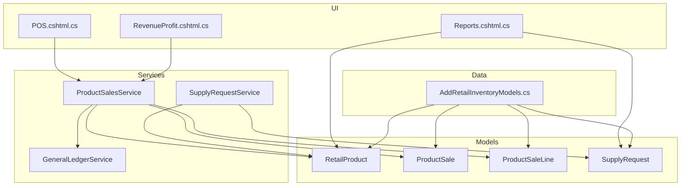
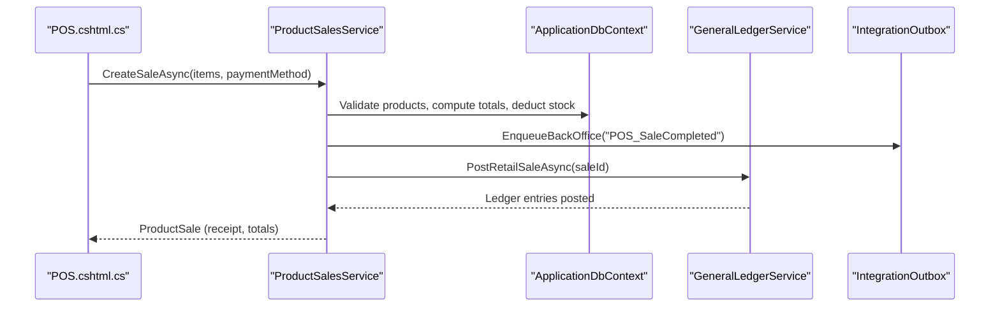
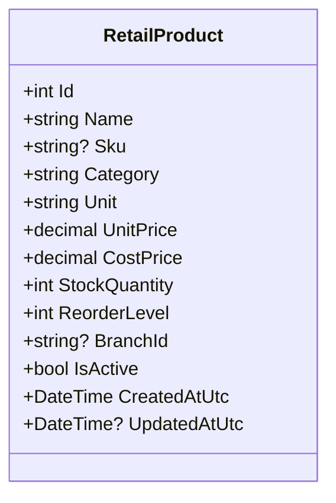
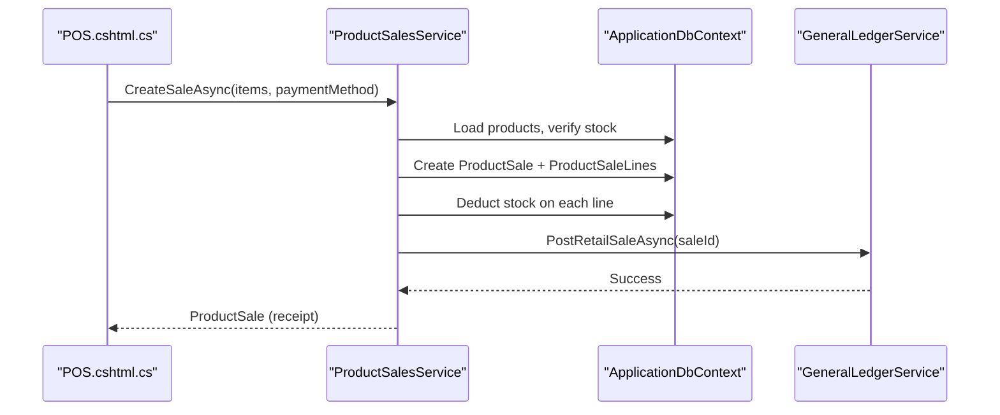
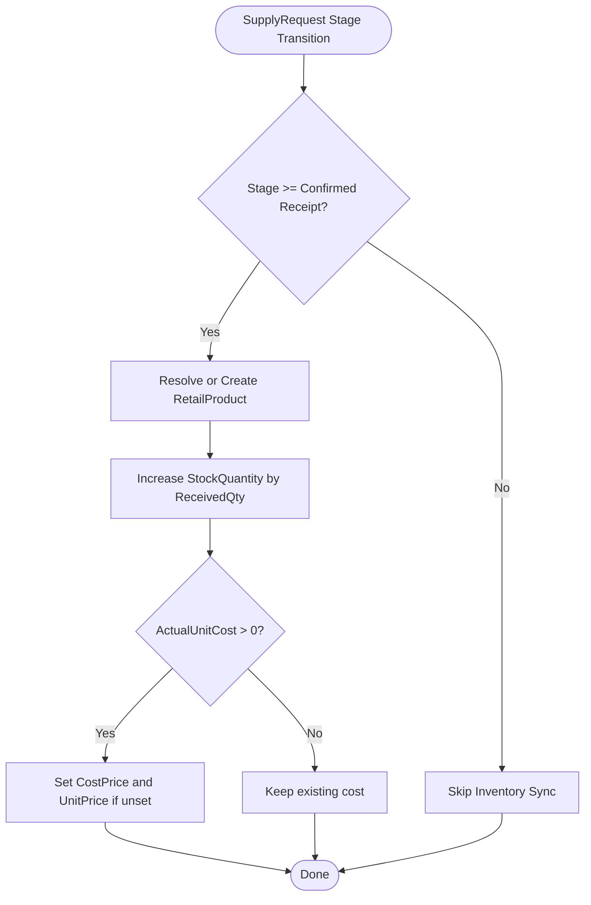
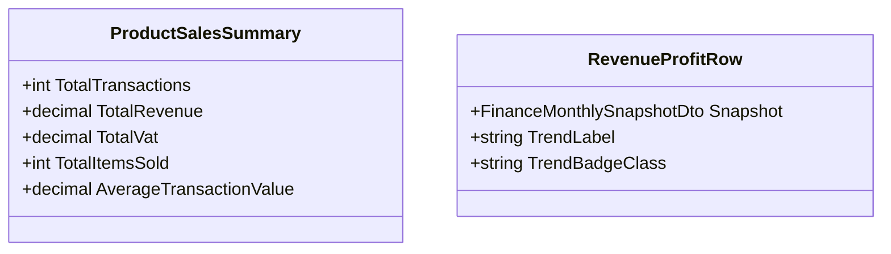
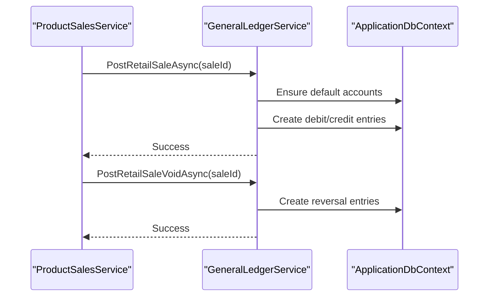
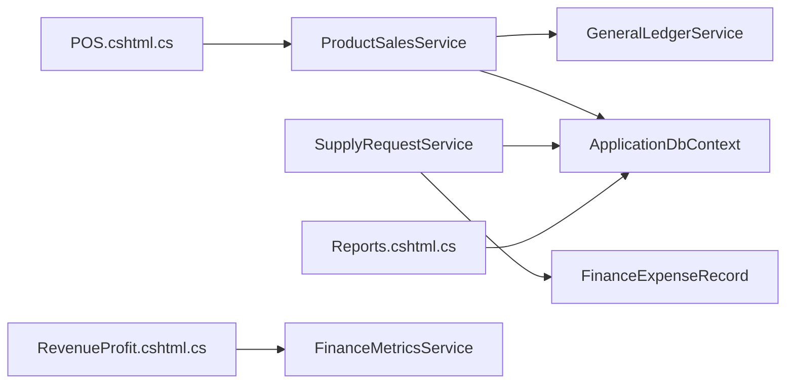

# Retail Product Management

<cite>
**Referenced Files in This Document**
- [RetailProduct.cs](file://Models/Inventory/RetailProduct.cs)
- [ProductSale.cs](file://Models/Inventory/ProductSale.cs)
- [SupplyRequest.cs](file://Models/Inventory/SupplyRequest.cs)
- [AddRetailInventoryModels.cs](file://Data/Migrations/20260302102218_AddRetailInventoryModels.cs)
- [ProductSalesService.cs](file://Services/Inventory/ProductSalesService.cs)
- [IProductSalesService.cs](file://Services/Inventory/IProductSalesService.cs)
- [SupplyRequestService.cs](file://Services/Inventory/SupplyRequestService.cs)
- [GeneralLedgerService.cs](file://Services/Finance/GeneralLedgerService.cs)
- [POS.cshtml.cs](file://Pages/Staff/POS.cshtml.cs)
- [RevenueProfit.cshtml.cs](file://Pages/Finance/RevenueProfit.cshtml.cs)
- [Reports.cshtml.cs](file://Pages/Admin/Reports.cshtml.cs)
</cite>

## Table of Contents
1. [Introduction](#introduction)
2. [Project Structure](#project-structure)
3. [Core Components](#core-components)
4. [Architecture Overview](#architecture-overview)
5. [Detailed Component Analysis](#detailed-component-analysis)
6. [Dependency Analysis](#dependency-analysis)
7. [Performance Considerations](#performance-considerations)
8. [Troubleshooting Guide](#troubleshooting-guide)
9. [Conclusion](#conclusion)
10. [Appendices](#appendices)

## Introduction
This document describes the retail product management system within the EJC Fitness Gym ERP. It covers the RetailProduct model and catalog management, pricing and supplier integration via SupplyRequest, POS sales processing, real-time inventory updates, categorization and SKU management, sales analytics, revenue tracking, profit margin calculations, and integration with the general ledger for accurate revenue recognition and cost of goods sold tracking. It also outlines supply chain stages, expense linkage, and reporting dashboards.

## Project Structure
The retail module spans models, migrations, services, pages, and finance integration:
- Models define domain entities: RetailProduct, ProductSale, ProductSaleLine, SupplyRequest, and enums for statuses and payment methods.
- Migrations establish database schema for retail inventory, sales, and supply requests.
- Services encapsulate business logic for sales processing, supply request lifecycle, and general ledger posting.
- Pages implement the POS UI and reporting dashboards.
- Finance services integrate retail sales with the general ledger.

**Diagram sources**
- [RetailProduct.cs:1-42](file://Models/Inventory/RetailProduct.cs#L1-L42)
- [ProductSale.cs:1-81](file://Models/Inventory/ProductSale.cs#L1-L81)
- [SupplyRequest.cs:1-79](file://Models/Inventory/SupplyRequest.cs#L1-L79)
- [ProductSalesService.cs:1-363](file://Services/Inventory/ProductSalesService.cs#L1-L363)
- [SupplyRequestService.cs:1-430](file://Services/Inventory/SupplyRequestService.cs#L1-L430)
- [GeneralLedgerService.cs:1-616](file://Services/Finance/GeneralLedgerService.cs#L1-L616)
- [POS.cshtml.cs:1-210](file://Pages/Staff/POS.cshtml.cs#L1-L210)
- [Reports.cshtml.cs:1-110](file://Pages/Admin/Reports.cshtml.cs#L1-L110)
- [RevenueProfit.cshtml.cs:1-120](file://Pages/Finance/RevenueProfit.cshtml.cs#L1-L120)
- [AddRetailInventoryModels.cs:1-285](file://Data/Migrations/20260302102218_AddRetailInventoryModels.cs#L1-L285)

**Section sources**
- [RetailProduct.cs:1-42](file://Models/Inventory/RetailProduct.cs#L1-L42)
- [ProductSale.cs:1-81](file://Models/Inventory/ProductSale.cs#L1-L81)
- [SupplyRequest.cs:1-79](file://Models/Inventory/SupplyRequest.cs#L1-L79)
- [AddRetailInventoryModels.cs:1-285](file://Data/Migrations/20260302102218_AddRetailInventoryModels.cs#L1-L285)

## Core Components
- RetailProduct: Core entity for retail items with name, SKU, category, unit, pricing, stock, reorder level, branch scoping, and activity flag.
- ProductSale and ProductSaleLine: Sales records and per-item lines with totals, VAT, payment method, and status.
- SupplyRequest: Supplier/purchase request lifecycle with stages, quantities, costs, and timestamps.
- ProductSalesService: Handles product CRUD, stock adjustments, sale creation, totals computation, receipts, and integration hooks.
- SupplyRequestService: Manages supply request stages, auto-creation/sync of RetailProduct, expense linkage, and summaries.
- GeneralLedgerService: Posts retail sales and reversals to the general ledger with appropriate accounts by payment method.
- POS page: Session-backed cart, checkout, and sale submission.
- Reporting pages: Admin dashboard metrics and Finance revenue/profit views.

**Section sources**
- [RetailProduct.cs:1-42](file://Models/Inventory/RetailProduct.cs#L1-L42)
- [ProductSale.cs:1-81](file://Models/Inventory/ProductSale.cs#L1-L81)
- [SupplyRequest.cs:1-79](file://Models/Inventory/SupplyRequest.cs#L1-L79)
- [ProductSalesService.cs:1-363](file://Services/Inventory/ProductSalesService.cs#L1-L363)
- [SupplyRequestService.cs:1-430](file://Services/Inventory/SupplyRequestService.cs#L1-L430)
- [GeneralLedgerService.cs:1-616](file://Services/Finance/GeneralLedgerService.cs#L1-L616)
- [POS.cshtml.cs:1-210](file://Pages/Staff/POS.cshtml.cs#L1-L210)
- [Reports.cshtml.cs:1-110](file://Pages/Admin/Reports.cshtml.cs#L1-L110)
- [RevenueProfit.cshtml.cs:1-120](file://Pages/Finance/RevenueProfit.cshtml.cs#L1-L120)

## Architecture Overview
The system follows layered architecture:
- UI layer (Razor Pages) orchestrates POS and reporting.
- Service layer implements business rules for sales, supply, and accounting.
- Data layer persists entities and enforces constraints via migrations.
- Integration layer emits outbox events for back-office notifications.

**Diagram sources**
- [POS.cshtml.cs:132-186](file://Pages/Staff/POS.cshtml.cs#L132-L186)
- [ProductSalesService.cs:106-218](file://Services/Inventory/ProductSalesService.cs#L106-L218)
- [GeneralLedgerService.cs:297-372](file://Services/Finance/GeneralLedgerService.cs#L297-L372)

## Detailed Component Analysis

### RetailProduct Model and Catalog Management
- Fields include identifiers, name, SKU, category, unit, pricing (unit and cost), stock, reorder level, branch scoping, activity flag, and audit timestamps.
- Unique SKU constraint ensures SKU integrity; branch-scoped filtering supports multi-location catalogs.
- Default category and unit provide sensible defaults; IsActive enables soft-deactivation.

**Diagram sources**
- [RetailProduct.cs:5-40](file://Models/Inventory/RetailProduct.cs#L5-L40)

**Section sources**
- [RetailProduct.cs:1-42](file://Models/Inventory/RetailProduct.cs#L1-L42)
- [AddRetailInventoryModels.cs:52-74](file://Data/Migrations/20260302102218_AddRetailInventoryModels.cs#L52-L74)
- [AddRetailInventoryModels.cs:168-178](file://Data/Migrations/20260302102218_AddRetailInventoryModels.cs#L168-L178)

### POS Sales Processing and Real-Time Inventory Updates
- The POS page maintains a session-backed cart and validates stock availability before adding items.
- Checkout aggregates totals, computes VAT, and delegates sale creation to ProductSalesService.
- ProductSalesService:
  - Validates items, checks stock, constructs lines, computes subtotal/VAT/total.
  - Deducts stock immediately upon completion.
  - Emits outbox event and posts to general ledger for completed sales.
  - Supports voiding with stock restoration and ledger reversal.

**Diagram sources**
- [POS.cshtml.cs:132-186](file://Pages/Staff/POS.cshtml.cs#L132-L186)
- [ProductSalesService.cs:106-218](file://Services/Inventory/ProductSalesService.cs#L106-L218)
- [GeneralLedgerService.cs:297-372](file://Services/Finance/GeneralLedgerService.cs#L297-L372)

**Section sources**
- [POS.cshtml.cs:1-210](file://Pages/Staff/POS.cshtml.cs#L1-L210)
- [ProductSalesService.cs:106-218](file://Services/Inventory/ProductSalesService.cs#L106-L218)
- [ProductSale.cs:1-81](file://Models/Inventory/ProductSale.cs#L1-L81)

### Pricing Strategies and Supplier Integration
- Pricing:
  - UnitPrice and CostPrice stored per product; initial cost/unit price may be derived from supply requests.
  - VAT computed at 12% during sale creation.
- Supplier Integration:
  - SupplyRequest tracks requested/received quantities, estimated/actual unit costs, and lifecycle stages.
  - SupplyRequestService:
    - Auto-creates or reactivates RetailProduct on receipt confirmation.
    - Synchronizes stock increases and cost price updates on confirmed receipt.
    - Links to FinanceExpenseRecord upon invoicing for COGS tracking.

**Diagram sources**
- [SupplyRequestService.cs:320-360](file://Services/Inventory/SupplyRequestService.cs#L320-L360)
- [SupplyRequestService.cs:362-410](file://Services/Inventory/SupplyRequestService.cs#L362-L410)

**Section sources**
- [SupplyRequest.cs:1-79](file://Models/Inventory/SupplyRequest.cs#L1-L79)
- [SupplyRequestService.cs:1-430](file://Services/Inventory/SupplyRequestService.cs#L1-L430)
- [RetailProduct.cs:1-42](file://Models/Inventory/RetailProduct.cs#L1-L42)

### Inventory Tracking and Reorder Management
- StockQuantity is decremented at sale creation and incremented on confirmed receipt.
- ReorderLevel triggers low-stock alerts in reporting dashboards.
- BranchId scoping allows per-branch visibility and control.

**Section sources**
- [ProductSalesService.cs:87-104](file://Services/Inventory/ProductSalesService.cs#L87-L104)
- [SupplyRequestService.cs:320-360](file://Services/Inventory/SupplyRequestService.cs#L320-L360)
- [Reports.cshtml.cs:71-81](file://Pages/Admin/Reports.cshtml.cs#L71-L81)

### Sales Analytics, Revenue Tracking, and Profitability
- ProductSalesService provides:
  - Sales summary with transaction counts, revenue, VAT, total items sold, and average transaction value.
- Finance RevenueProfit dashboard computes:
  - Gross and net margin percentages from monthly snapshots.
- Reporting page aggregates:
  - Revenue, successful/failed payments, pending/overdue invoices, low stock products, open supply and replacement requests.

**Diagram sources**
- [IProductSalesService.cs:34-40](file://Services/Inventory/IProductSalesService.cs#L34-L40)
- [RevenueProfit.cshtml.cs:114-118](file://Pages/Finance/RevenueProfit.cshtml.cs#L114-L118)

**Section sources**
- [ProductSalesService.cs:296-349](file://Services/Inventory/ProductSalesService.cs#L296-L349)
- [RevenueProfit.cshtml.cs:1-120](file://Pages/Finance/RevenueProfit.cshtml.cs#L1-L120)
- [Reports.cshtml.cs:1-110](file://Pages/Admin/Reports.cshtml.cs#L1-L110)

### General Ledger Integration for Revenue Recognition and COGS
- GeneralLedgerService posts retail sales to:
  - Cash on Hand or Cash in Bank (depending on payment method) and Retail Sales Revenue.
- Reversal entries are created for voided sales.
- SupplyRequestService links confirmed receipts to FinanceExpenseRecord for COGS tracking.

**Diagram sources**
- [GeneralLedgerService.cs:297-372](file://Services/Finance/GeneralLedgerService.cs#L297-L372)
- [GeneralLedgerService.cs:374-456](file://Services/Finance/GeneralLedgerService.cs#L374-L456)
- [SupplyRequestService.cs:168-210](file://Services/Inventory/SupplyRequestService.cs#L168-L210)

**Section sources**
- [GeneralLedgerService.cs:1-616](file://Services/Finance/GeneralLedgerService.cs#L1-L616)
- [ProductSale.cs:63-79](file://Models/Inventory/ProductSale.cs#L63-L79)

### Product Categorization, SKU Management, and Batch Tracking
- Categorization:
  - Category field on RetailProduct; filtered and indexed for branch and category.
- SKU Management:
  - Auto-generation when not provided; unique constraint enforced.
- Batch Tracking:
  - No explicit expiry/batch fields in current models; batch tracking would require extension (e.g., batch number, expiry date) to the RetailProduct or a related entity.

**Section sources**
- [RetailProduct.cs:16-17](file://Models/Inventory/RetailProduct.cs#L16-L17)
- [RetailProduct.cs:13-14](file://Models/Inventory/RetailProduct.cs#L13-L14)
- [AddRetailInventoryModels.cs:168-178](file://Data/Migrations/20260302102218_AddRetailInventoryModels.cs#L168-L178)

### Promotional Pricing and Seasonal Inventory Management
- No dedicated promotional pricing or seasonal inventory features are present in the current codebase.
- Recommendations:
  - Extend RetailProduct with discount fields or introduce a separate pricing rule engine.
  - Introduce seasonal tags/categories and demand forecasting integrations.

[No sources needed since this section provides general guidance]

### Barcode Scanning Functionality
- No barcode scanning implementation was identified in the provided files.
- Recommendations:
  - Integrate a client-side QR/Barcode scanner library and wire it to the POS page for product lookup and add-to-cart actions.

[No sources needed since this section provides general guidance]

## Dependency Analysis
- ProductSalesService depends on ApplicationDbContext, GeneralLedgerService, and IntegrationOutbox for outbox events.
- SupplyRequestService depends on ApplicationDbContext and IntegrationOutbox; it also creates FinanceExpenseRecord instances.
- GeneralLedgerService depends on ApplicationDbContext and uses branch-scoped account codes.
- POS page depends on ProductSalesService and session storage for cart persistence.
- Reporting pages depend on ApplicationDbContext for aggregations.

**Diagram sources**
- [POS.cshtml.cs:1-210](file://Pages/Staff/POS.cshtml.cs#L1-L210)
- [ProductSalesService.cs:1-363](file://Services/Inventory/ProductSalesService.cs#L1-L363)
- [SupplyRequestService.cs:1-430](file://Services/Inventory/SupplyRequestService.cs#L1-L430)
- [Reports.cshtml.cs:1-110](file://Pages/Admin/Reports.cshtml.cs#L1-L110)
- [RevenueProfit.cshtml.cs:1-120](file://Pages/Finance/RevenueProfit.cshtml.cs#L1-L120)

**Section sources**
- [ProductSalesService.cs:1-363](file://Services/Inventory/ProductSalesService.cs#L1-L363)
- [SupplyRequestService.cs:1-430](file://Services/Inventory/SupplyRequestService.cs#L1-L430)
- [GeneralLedgerService.cs:1-616](file://Services/Finance/GeneralLedgerService.cs#L1-L616)

## Performance Considerations
- Use of AsNoTracking for read-heavy queries improves query performance for product lists and reporting.
- Indexes on branch/category/active filters and on receipt numbers and sale date/status enhance retrieval performance.
- Consider partitioning or materialized summaries for high-volume sales analytics.
- Batch updates for stock synchronization on supply receipt confirmations reduce individual round-trips.

[No sources needed since this section provides general guidance]

## Troubleshooting Guide
- Insufficient stock errors occur when requested quantity exceeds available stock during sale creation.
- Voiding a sale restores stock and posts a reversal ledger entry; ensure ledger posting exceptions are logged.
- Supply request stages enforce workflow transitions; attempting invalid transitions raises exceptions.
- Low stock alerts are computed via ReorderLevel; verify thresholds and branch scoping in reporting.

**Section sources**
- [ProductSalesService.cs:155-158](file://Services/Inventory/ProductSalesService.cs#L155-L158)
- [ProductSalesService.cs:244-294](file://Services/Inventory/ProductSalesService.cs#L244-L294)
- [SupplyRequestService.cs:86-121](file://Services/Inventory/SupplyRequestService.cs#L86-L121)
- [Reports.cshtml.cs:79-81](file://Pages/Admin/Reports.cshtml.cs#L79-L81)

## Conclusion
The retail product management system provides a robust foundation for product catalog, pricing, POS sales, real-time inventory updates, supplier lifecycle, and general ledger integration. Enhancements such as barcode scanning, promotional pricing, batch tracking, and seasonal inventory controls would further strengthen the system for comprehensive retail operations.

## Appendices

### Database Schema Highlights
- RetailProducts: primary table for retail items with unique SKU and branch indexing.
- ProductSales: sales header with totals, VAT, payment method, and status.
- ProductSaleLines: line items linking to RetailProducts and ProductSales.
- SupplyRequests: supplier request lifecycle with stage transitions and timestamps.

**Section sources**
- [AddRetailInventoryModels.cs:28-140](file://Data/Migrations/20260302102218_AddRetailInventoryModels.cs#L28-L140)
- [AddRetailInventoryModels.cs:142-190](file://Data/Migrations/20260302102218_AddRetailInventoryModels.cs#L142-L190)