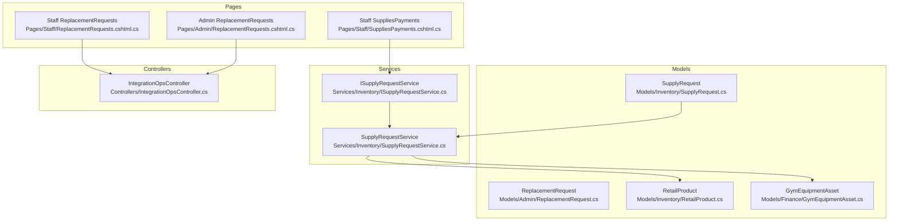
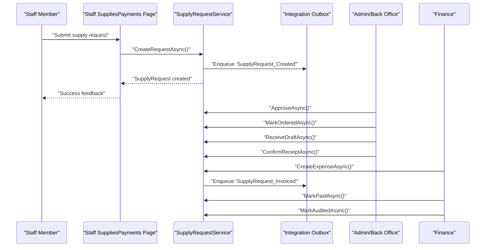
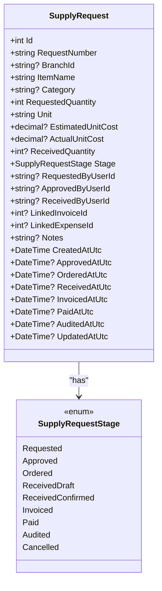
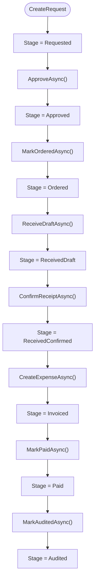
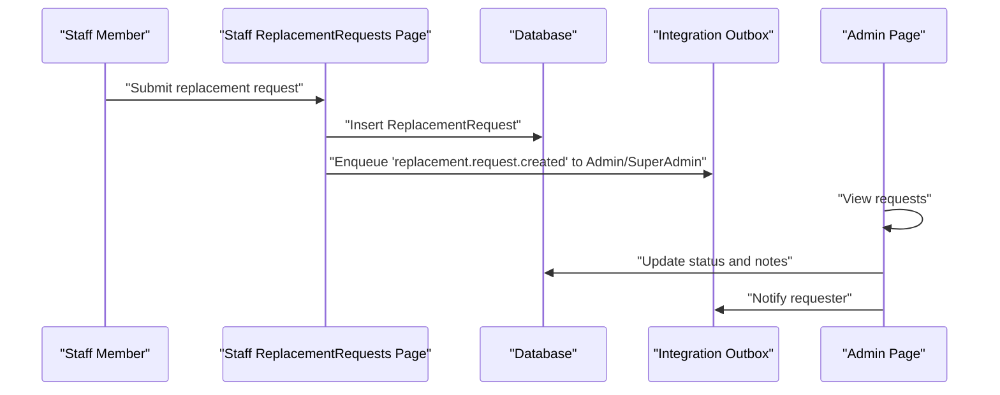
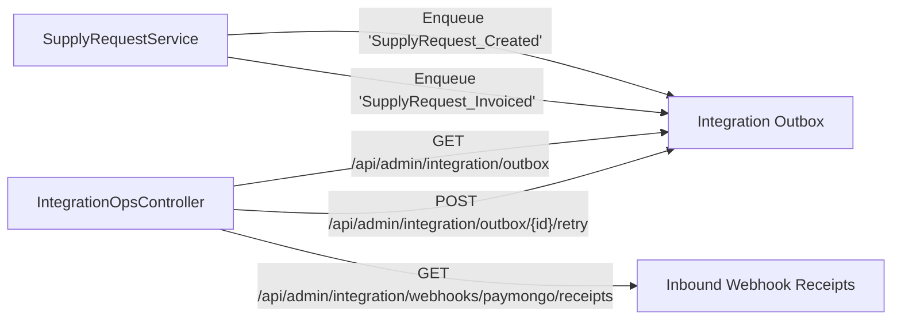
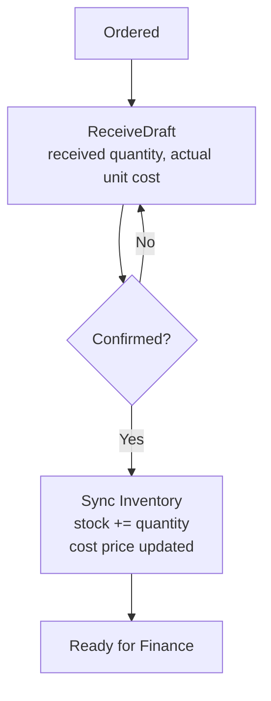
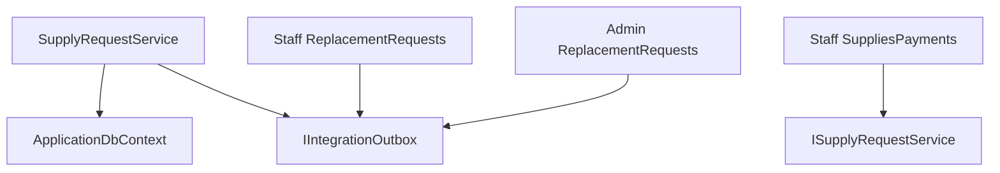

# Supply Request Workflow

<cite>
**Referenced Files in This Document**
- [SupplyRequest.cs](file://Models/Inventory/SupplyRequest.cs)
- [ReplacementRequest.cs](file://Models/Admin/ReplacementRequest.cs)
- [ISupplyRequestService.cs](file://Services/Inventory/ISupplyRequestService.cs)
- [SupplyRequestService.cs](file://Services/Inventory/SupplyRequestService.cs)
- [20260220014036_AddStaffReplacementRequests.cs](file://Data/Migrations/20260220014036_AddStaffReplacementRequests.cs)
- [20260302054246_AddLinkedEquipmentToReplacementRequests.cs](file://Data/Migrations/20260302054246_AddLinkedEquipmentToReplacementRequests.cs)
- [ReplacementRequests.cshtml.cs (Staff)](file://Pages/Staff/ReplacementRequests.cshtml.cs)
- [ReplacementRequests.cshtml.cs (Admin)](file://Pages/Admin/ReplacementRequests.cshtml.cs)
- [SuppliesPayments.cshtml.cs](file://Pages/Staff/SuppliesPayments.cshtml.cs)
- [GymEquipmentAsset.cs](file://Models/Finance/GymEquipmentAsset.cs)
- [RetailProduct.cs](file://Models/Inventory/RetailProduct.cs)
- [IntegrationOpsController.cs](file://Controllers/IntegrationOpsController.cs)
</cite>

## Table of Contents
1. [Introduction](#introduction)
2. [Project Structure](#project-structure)
3. [Core Components](#core-components)
4. [Architecture Overview](#architecture-overview)
5. [Detailed Component Analysis](#detailed-component-analysis)
6. [Dependency Analysis](#dependency-analysis)
7. [Performance Considerations](#performance-considerations)
8. [Troubleshooting Guide](#troubleshooting-guide)
9. [Conclusion](#conclusion)
10. [Appendices](#appendices)

## Introduction
This document explains the supply request workflow system, covering:
- SupplyRequest lifecycle: submission, approvals, ordering, receipt, invoicing, payment, auditing, and cancellation
- Equipment replacement requests: creation, linking equipment, review, approval, and completion
- Supply chain integration via asynchronous outbox events and webhook receipts
- Procurement tracking and inventory updates upon receipt confirmation
- Reporting and dashboards for supply utilization and branch metrics
- Examples of request templates, approval chains, and automation scenarios

## Project Structure
The supply request workflow spans models, services, pages, and controllers:
- Models define domain entities for supply requests, replacement requests, retail products, and equipment assets
- Services encapsulate workflow transitions and integration with the outbox
- Pages expose UI flows for staff to submit supply requests and replacement requests, and for admins to manage replacements
- Controllers support integration operations and webhook reconciliation

**Diagram sources**
- [SupplyRequest.cs:1-79](file://Models/Inventory/SupplyRequest.cs#L1-L79)
- [ReplacementRequest.cs:1-75](file://Models/Admin/ReplacementRequest.cs#L1-L75)
- [RetailProduct.cs:1-42](file://Models/Inventory/RetailProduct.cs#L1-L42)
- [GymEquipmentAsset.cs:1-44](file://Models/Finance/GymEquipmentAsset.cs#L1-L44)
- [ISupplyRequestService.cs:1-47](file://Services/Inventory/ISupplyRequestService.cs#L1-L47)
- [SupplyRequestService.cs:1-430](file://Services/Inventory/SupplyRequestService.cs#L1-L430)
- [ReplacementRequests.cshtml.cs (Staff):1-364](file://Pages/Staff/ReplacementRequests.cshtml.cs#L1-L364)
- [ReplacementRequests.cshtml.cs (Admin):1-229](file://Pages/Admin/ReplacementRequests.cshtml.cs#L1-L229)
- [SuppliesPayments.cshtml.cs:1-364](file://Pages/Staff/SuppliesPayments.cshtml.cs#L1-L364)
- [IntegrationOpsController.cs:1-541](file://Controllers/IntegrationOpsController.cs#L1-L541)

**Section sources**
- [SupplyRequest.cs:1-79](file://Models/Inventory/SupplyRequest.cs#L1-L79)
- [ReplacementRequest.cs:1-75](file://Models/Admin/ReplacementRequest.cs#L1-L75)
- [RetailProduct.cs:1-42](file://Models/Inventory/RetailProduct.cs#L1-L42)
- [GymEquipmentAsset.cs:1-44](file://Models/Finance/GymEquipmentAsset.cs#L1-L44)
- [ISupplyRequestService.cs:1-47](file://Services/Inventory/ISupplyRequestService.cs#L1-L47)
- [SupplyRequestService.cs:1-430](file://Services/Inventory/SupplyRequestService.cs#L1-L430)
- [ReplacementRequests.cshtml.cs (Staff):1-364](file://Pages/Staff/ReplacementRequests.cshtml.cs#L1-L364)
- [ReplacementRequests.cshtml.cs (Admin):1-229](file://Pages/Admin/ReplacementRequests.cshtml.cs#L1-L229)
- [SuppliesPayments.cshtml.cs:1-364](file://Pages/Staff/SuppliesPayments.cshtml.cs#L1-L364)
- [IntegrationOpsController.cs:1-541](file://Controllers/IntegrationOpsController.cs#L1-L541)

## Core Components
- SupplyRequest: Tracks supply requests from creation to audit, including quantities, costs, stages, and timestamps
- SupplyRequestService: Implements workflow transitions, inventory synchronization, and finance linkage
- ReplacementRequest: Supports equipment and supplies replacement requests with statuses and priorities
- Pages for Staff and Admin: Provide UI for creating replacement requests and managing their lifecycle
- RetailProduct and GymEquipmentAsset: Underpin inventory and asset tracking

**Section sources**
- [SupplyRequest.cs:1-79](file://Models/Inventory/SupplyRequest.cs#L1-L79)
- [ISupplyRequestService.cs:1-47](file://Services/Inventory/ISupplyRequestService.cs#L1-L47)
- [SupplyRequestService.cs:1-430](file://Services/Inventory/SupplyRequestService.cs#L1-L430)
- [ReplacementRequest.cs:1-75](file://Models/Admin/ReplacementRequest.cs#L1-L75)
- [ReplacementRequests.cshtml.cs (Staff):1-364](file://Pages/Staff/ReplacementRequests.cshtml.cs#L1-L364)
- [ReplacementRequests.cshtml.cs (Admin):1-229](file://Pages/Admin/ReplacementRequests.cshtml.cs#L1-L229)
- [RetailProduct.cs:1-42](file://Models/Inventory/RetailProduct.cs#L1-L42)
- [GymEquipmentAsset.cs:1-44](file://Models/Finance/GymEquipmentAsset.cs#L1-L44)

## Architecture Overview
The system separates concerns across models, services, and presentation layers. Workflows are enforced by service methods that validate stage transitions and update inventory and finance records accordingly. Integration events are queued asynchronously to decouple systems.

**Diagram sources**
- [SuppliesPayments.cshtml.cs:223-248](file://Pages/Staff/SuppliesPayments.cshtml.cs#L223-L248)
- [SupplyRequestService.cs:25-46](file://Services/Inventory/SupplyRequestService.cs#L25-L46)
- [SupplyRequestService.cs:86-103](file://Services/Inventory/SupplyRequestService.cs#L86-L103)
- [SupplyRequestService.cs:105-121](file://Services/Inventory/SupplyRequestService.cs#L105-L121)
- [SupplyRequestService.cs:123-147](file://Services/Inventory/SupplyRequestService.cs#L123-L147)
- [SupplyRequestService.cs:149-166](file://Services/Inventory/SupplyRequestService.cs#L149-L166)
- [SupplyRequestService.cs:168-210](file://Services/Inventory/SupplyRequestService.cs#L168-L210)
- [SupplyRequestService.cs:212-230](file://Services/Inventory/SupplyRequestService.cs#L212-L230)
- [SupplyRequestService.cs:232-248](file://Services/Inventory/SupplyRequestService.cs#L232-L248)

## Detailed Component Analysis

### SupplyRequest Model and Lifecycle
SupplyRequest captures request metadata, quantities, costs, and lifecycle timestamps. Its stage enumeration defines the workflow progression.

**Diagram sources**
- [SupplyRequest.cs:5-77](file://Models/Inventory/SupplyRequest.cs#L5-L77)

**Section sources**
- [SupplyRequest.cs:1-79](file://Models/Inventory/SupplyRequest.cs#L1-L79)

### SupplyRequestService: Workflow Transitions and Inventory Sync
The service enforces stage transitions and performs:
- Creation with generated request number and initial stage
- Approval, ordering, draft receipt, and confirmation
- Expense creation and linking to a finance record
- Payment and audit transitions
- Inventory synchronization when crossing receipt confirmation threshold
- Summary computation for dashboard metrics

**Diagram sources**
- [SupplyRequestService.cs:25-46](file://Services/Inventory/SupplyRequestService.cs#L25-L46)
- [SupplyRequestService.cs:86-103](file://Services/Inventory/SupplyRequestService.cs#L86-L103)
- [SupplyRequestService.cs:105-121](file://Services/Inventory/SupplyRequestService.cs#L105-L121)
- [SupplyRequestService.cs:123-147](file://Services/Inventory/SupplyRequestService.cs#L123-L147)
- [SupplyRequestService.cs:149-166](file://Services/Inventory/SupplyRequestService.cs#L149-L166)
- [SupplyRequestService.cs:168-210](file://Services/Inventory/SupplyRequestService.cs#L168-L210)
- [SupplyRequestService.cs:212-230](file://Services/Inventory/SupplyRequestService.cs#L212-L230)
- [SupplyRequestService.cs:232-248](file://Services/Inventory/SupplyRequestService.cs#L232-L248)

**Section sources**
- [ISupplyRequestService.cs:1-47](file://Services/Inventory/ISupplyRequestService.cs#L1-L47)
- [SupplyRequestService.cs:1-430](file://Services/Inventory/SupplyRequestService.cs#L1-L430)

### Equipment Replacement Request Process
ReplacementRequest supports equipment and supplies replacement with types, priorities, and statuses. Staff can create requests; Admin reviews and updates status.

**Diagram sources**
- [ReplacementRequests.cshtml.cs (Staff):68-139](file://Pages/Staff/ReplacementRequests.cshtml.cs#L68-L139)
- [ReplacementRequests.cshtml.cs (Admin):59-118](file://Pages/Admin/ReplacementRequests.cshtml.cs#L59-L118)
- [20260220014036_AddStaffReplacementRequests.cs:14-37](file://Data/Migrations/20260220014036_AddStaffReplacementRequests.cs#L14-L37)
- [20260302054246_AddLinkedEquipmentToReplacementRequests.cs:13-17](file://Data/Migrations/20260302054246_AddLinkedEquipmentToReplacementRequests.cs#L13-L17)

**Section sources**
- [ReplacementRequest.cs:1-75](file://Models/Admin/ReplacementRequest.cs#L1-L75)
- [ReplacementRequests.cshtml.cs (Staff):1-364](file://Pages/Staff/ReplacementRequests.cshtml.cs#L1-L364)
- [ReplacementRequests.cshtml.cs (Admin):1-229](file://Pages/Admin/ReplacementRequests.cshtml.cs#L1-L229)
- [20260220014036_AddStaffReplacementRequests.cs:1-64](file://Data/Migrations/20260220014036_AddStaffReplacementRequests.cs#L1-L64)
- [20260302054246_AddLinkedEquipmentToReplacementRequests.cs:1-29](file://Data/Migrations/20260302054246_AddLinkedEquipmentToReplacementRequests.cs#L1-L29)

### Supply Chain Integration and Procurement Tracking
- Outgoing events: SupplyRequestService enqueues “SupplyRequest_Created” and “SupplyRequest_Invoiced”
- Integration operations: IntegrationOpsController exposes endpoints to inspect, retry, and dead-letter outbox messages
- Webhook receipts: IntegrationOpsController supports PayMongo webhook replay and classification

**Diagram sources**
- [SupplyRequestService.cs:34-43](file://Services/Inventory/SupplyRequestService.cs#L34-L43)
- [SupplyRequestService.cs:197-210](file://Services/Inventory/SupplyRequestService.cs#L197-L210)
- [IntegrationOpsController.cs:38-75](file://Controllers/IntegrationOpsController.cs#L38-L75)
- [IntegrationOpsController.cs:77-107](file://Controllers/IntegrationOpsController.cs#L77-L107)
- [IntegrationOpsController.cs:183-230](file://Controllers/IntegrationOpsController.cs#L183-L230)

**Section sources**
- [SupplyRequestService.cs:1-430](file://Services/Inventory/SupplyRequestService.cs#L1-L430)
- [IntegrationOpsController.cs:1-541](file://Controllers/IntegrationOpsController.cs#L1-L541)

### Budget Validation and Spending Limit Enforcement
- SupplyRequestService computes estimated spend per month using received or requested quantities and unit costs
- The summary aggregates pending, awaiting approval, in transit, ready for finance, total this month, and estimated monthly spend
- No explicit budget cap logic is present in the analyzed files; enforcement would require extension of the service or middleware

**Section sources**
- [ISupplyRequestService.cs:36-46](file://Services/Inventory/ISupplyRequestService.cs#L36-L46)
- [SupplyRequestService.cs:268-313](file://Services/Inventory/SupplyRequestService.cs#L268-L313)

### Supply Tracking from Request to Delivery and Receipt Verification
- Stage ownership and next owner are mapped in the Staff SuppliesPayments page to guide handoffs
- Draft receipt captures received quantity and actual unit cost; confirmation advances to “Received Confirmed”
- Inventory increases only after crossing the confirmed receipt threshold

**Diagram sources**
- [SuppliesPayments.cshtml.cs:274-294](file://Pages/Staff/SuppliesPayments.cshtml.cs#L274-L294)
- [SupplyRequestService.cs:149-166](file://Services/Inventory/SupplyRequestService.cs#L149-L166)
- [SupplyRequestService.cs:320-360](file://Services/Inventory/SupplyRequestService.cs#L320-L360)

**Section sources**
- [SuppliesPayments.cshtml.cs:274-294](file://Pages/Staff/SuppliesPayments.cshtml.cs#L274-L294)
- [SupplyRequestService.cs:123-166](file://Services/Inventory/SupplyRequestService.cs#L123-L166)
- [SupplyRequestService.cs:320-360](file://Services/Inventory/SupplyRequestService.cs#L320-L360)

### Reporting on Supply Utilization, Vendor Performance, and Cost Center Allocation
- SupplyRequestService provides a summary with counts and estimated spend for dashboards
- RetailProduct tracks unit price, cost price, and reorder level for utilization insights
- Equipment assets track purchase date, useful life, and branch for cost center allocation

**Section sources**
- [ISupplyRequestService.cs:36-46](file://Services/Inventory/ISupplyRequestService.cs#L36-L46)
- [SupplyRequestService.cs:268-313](file://Services/Inventory/SupplyRequestService.cs#L268-L313)
- [RetailProduct.cs:1-42](file://Models/Inventory/RetailProduct.cs#L1-L42)
- [GymEquipmentAsset.cs:1-44](file://Models/Finance/GymEquipmentAsset.cs#L1-L44)

### Examples and Templates
- Supply request template fields: item name, category, requested quantity, unit, estimated unit cost, branch, and requester
- Replacement request template fields: subject, description, type, priority, status, branch, requester, reviewer, admin notes
- Stage ownership template: “Current Owner” and “Next Owner” badges guide handoffs across roles

**Section sources**
- [SuppliesPayments.cshtml.cs:223-248](file://Pages/Staff/SuppliesPayments.cshtml.cs#L223-L248)
- [ReplacementRequests.cshtml.cs (Staff):332-347](file://Pages/Staff/ReplacementRequests.cshtml.cs#L332-L347)
- [ReplacementRequests.cshtml.cs (Admin):211-226](file://Pages/Admin/ReplacementRequests.cshtml.cs#L211-L226)
- [SuppliesPayments.cshtml.cs:274-294](file://Pages/Staff/SuppliesPayments.cshtml.cs#L274-L294)

## Dependency Analysis
- SupplyRequestService depends on ApplicationDbContext, IIntegrationOutbox, and logging
- Pages depend on services and identity for scoping and user context
- ReplacementRequests migration adds a linked equipment asset column for future linking

**Diagram sources**
- [SupplyRequestService.cs:11-23](file://Services/Inventory/SupplyRequestService.cs#L11-L23)
- [SuppliesPayments.cshtml.cs:15-31](file://Pages/Staff/SuppliesPayments.cshtml.cs#L15-L31)
- [ReplacementRequests.cshtml.cs (Staff):19-31](file://Pages/Staff/ReplacementRequests.cshtml.cs#L19-L31)
- [ReplacementRequests.cshtml.cs (Admin):16-28](file://Pages/Admin/ReplacementRequests.cshtml.cs#L16-L28)
- [20260302054246_AddLinkedEquipmentToReplacementRequests.cs:13-17](file://Data/Migrations/20260302054246_AddLinkedEquipmentToReplacementRequests.cs#L13-L17)

**Section sources**
- [SupplyRequestService.cs:1-430](file://Services/Inventory/SupplyRequestService.cs#L1-L430)
- [SuppliesPayments.cshtml.cs:1-364](file://Pages/Staff/SuppliesPayments.cshtml.cs#L1-L364)
- [ReplacementRequests.cshtml.cs (Staff):1-364](file://Pages/Staff/ReplacementRequests.cshtml.cs#L1-L364)
- [ReplacementRequests.cshtml.cs (Admin):1-229](file://Pages/Admin/ReplacementRequests.cshtml.cs#L1-L229)
- [20260302054246_AddLinkedEquipmentToReplacementRequests.cs:1-29](file://Data/Migrations/20260302054246_AddLinkedEquipmentToReplacementRequests.cs#L1-L29)

## Performance Considerations
- Asynchronous outbox pattern reduces coupling and improves resilience for integration events
- Summary queries filter by branch and time range to keep computations efficient
- Inventory updates occur only on confirmed receipt to avoid premature stock adjustments

[No sources needed since this section provides general guidance]

## Troubleshooting Guide
- Outbox message inspection and retries: use GET and POST endpoints to inspect, retry, and dead-letter outbox messages
- Webhook receipts: query PayMongo receipts and replay events for reconciliation
- Stage transition errors: ensure requests are in the expected stage before invoking transitions (e.g., approve requires “Requested”, confirm requires “Ordered” or “ReceivedDraft”)

**Section sources**
- [IntegrationOpsController.cs:38-75](file://Controllers/IntegrationOpsController.cs#L38-L75)
- [IntegrationOpsController.cs:77-107](file://Controllers/IntegrationOpsController.cs#L77-L107)
- [IntegrationOpsController.cs:183-230](file://Controllers/IntegrationOpsController.cs#L183-L230)
- [SupplyRequestService.cs:86-103](file://Services/Inventory/SupplyRequestService.cs#L86-L103)
- [SupplyRequestService.cs:149-166](file://Services/Inventory/SupplyRequestService.cs#L149-L166)

## Conclusion
The supply request workflow integrates request submission, approvals, procurement, receipt verification, and finance reconciliation with robust stage transitions and inventory synchronization. Replacement requests complement supply workflows with equipment-specific tracking. Integration endpoints enable monitoring and recovery of outbox and webhook events. Extending budget controls and vendor performance metrics would further strengthen the system.

[No sources needed since this section summarizes without analyzing specific files]

## Appendices
- Example request templates:
  - Supply request: item name, category, quantity, unit, estimated unit cost, branch, requester
  - Replacement request: subject, description, type, priority, branch, requester, reviewer, admin notes
- Approval chains:
  - Supply: Staff → Admin → Finance
  - Replacement: Staff → Admin → Staff/Finance (depending on resolution)
- Automation scenarios:
  - Automatic inventory sync on receipt confirmation
  - Outgoing events for created and invoiced supply requests
  - Webhook replay and classification for payment reconciliation

[No sources needed since this section provides general guidance]