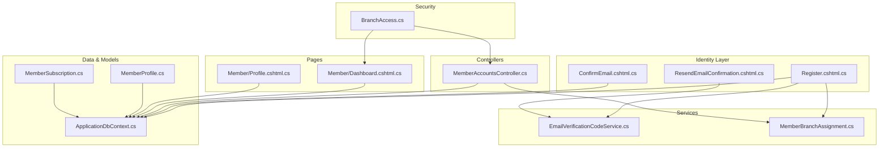
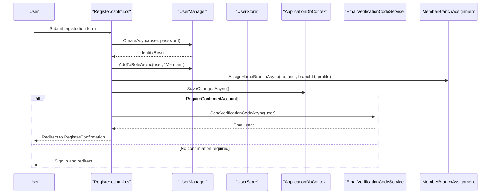
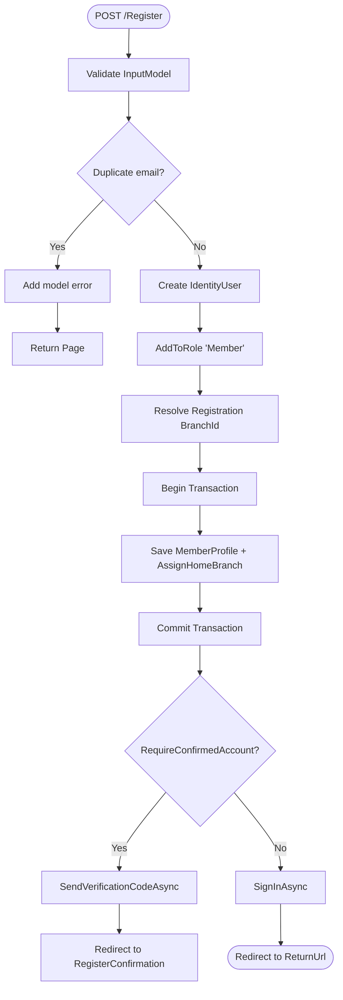
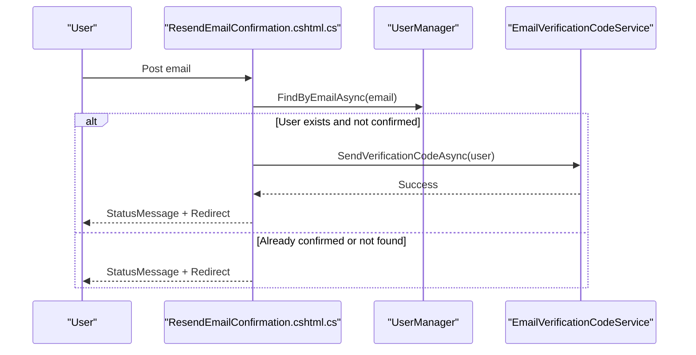
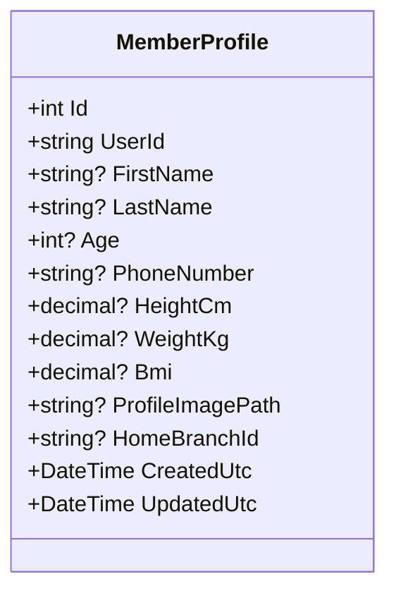
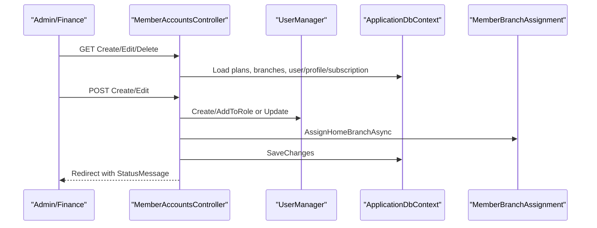
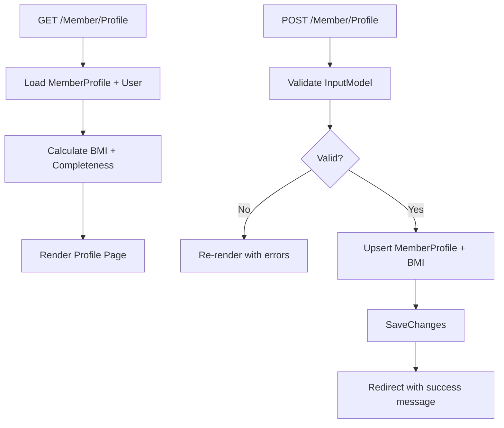
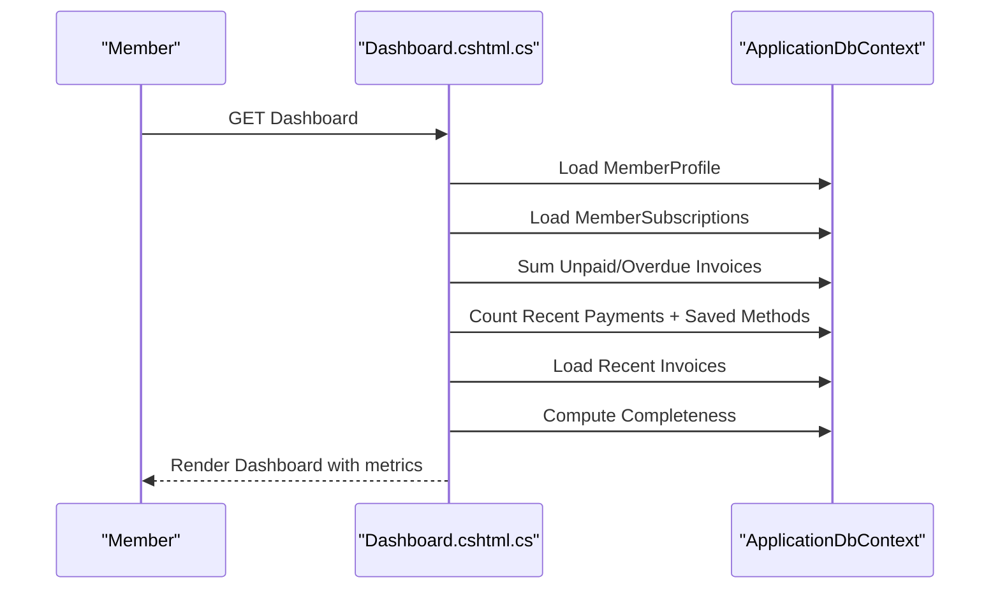
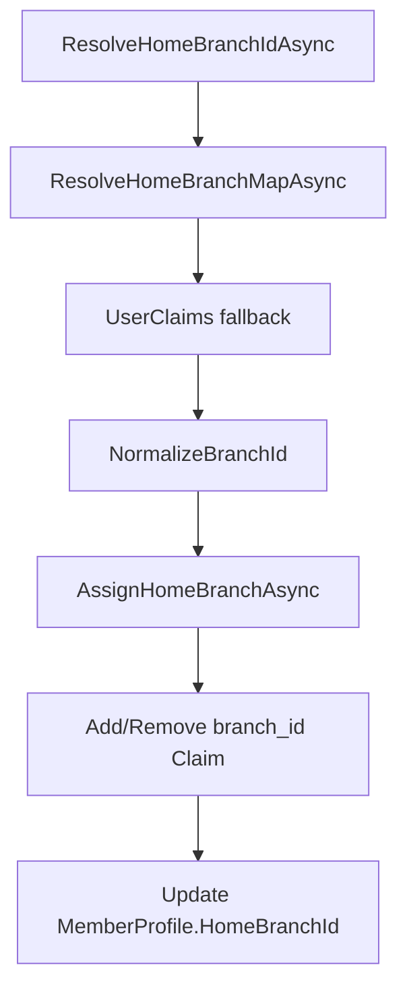
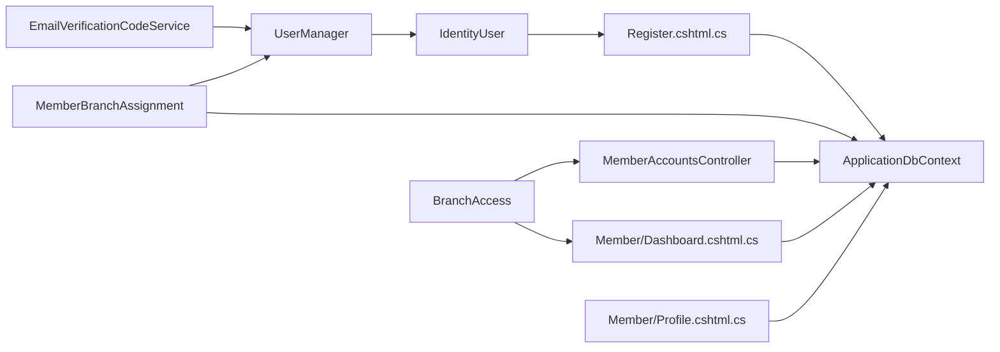

# Member Accounts Management

<cite>
**Referenced Files in This Document**
- [Register.cshtml.cs](file://Areas/Identity/Pages/Account/Register.cshtml.cs)
- [ConfirmEmail.cshtml.cs](file://Areas/Identity/Pages/Account/ConfirmEmail.cshtml.cs)
- [ResendEmailConfirmation.cshtml.cs](file://Areas/Identity/Pages/Account/ResendEmailConfirmation.cshtml.cs)
- [MemberAccountsController.cs](file://Controllers/MemberAccountsController.cs)
- [MemberProfile.cs](file://Models/MemberProfile.cs)
- [ApplicationDbContext.cs](file://Data/ApplicationDbContext.cs)
- [Dashboard.cshtml.cs](file://Pages/Member/Dashboard.cshtml.cs)
- [Profile.cshtml.cs](file://Pages/Member/Profile.cshtml.cs)
- [EmailVerificationCodeService.cs](file://Services/Identity/EmailVerificationCodeService.cs)
- [MemberBranchAssignment.cs](file://Services/Memberships/MemberBranchAssignment.cs)
- [MemberAccountViewModels.cs](file://Models/Admin/MemberAccountViewModels.cs)
- [_MemberForm.cshtml](file://Views/MemberAccounts/_MemberForm.cshtml)
- [BranchAccess.cs](file://Security/BranchAccess.cs)
- [MemberSubscription.cs](file://Models/Billing/MemberSubscription.cs)
</cite>

## Table of Contents
1. [Introduction](#introduction)
2. [Project Structure](#project-structure)
3. [Core Components](#core-components)
4. [Architecture Overview](#architecture-overview)
5. [Detailed Component Analysis](#detailed-component-analysis)
6. [Dependency Analysis](#dependency-analysis)
7. [Performance Considerations](#performance-considerations)
8. [Troubleshooting Guide](#troubleshooting-guide)
9. [Conclusion](#conclusion)

## Introduction
This document describes the member accounts management system for EJCFitnessGym. It covers the complete lifecycle from member registration and email verification to profile completion, membership administration, and dashboard insights. It also documents the integration with the ASP.NET Core Identity system for authentication, password management, and email verification, along with branch assignment and data privacy controls.

## Project Structure
The member accounts system spans several layers:
- Identity pages for registration, email verification, and resending confirmations
- Controllers for administrative member account management
- Models for member profiles and subscriptions
- Services for identity verification and branch assignment
- Pages for member self-service dashboards and profile editing
- Security helpers for branch scoping and access control

**Diagram sources**
- [Register.cshtml.cs:1-354](file://Areas/Identity/Pages/Account/Register.cshtml.cs#L1-L354)
- [ConfirmEmail.cshtml.cs:1-63](file://Areas/Identity/Pages/Account/ConfirmEmail.cshtml.cs#L1-L63)
- [ResendEmailConfirmation.cshtml.cs:1-78](file://Areas/Identity/Pages/Account/ResendEmailConfirmation.cshtml.cs#L1-L78)
- [MemberAccountsController.cs:1-900](file://Controllers/MemberAccountsController.cs#L1-L900)
- [MemberProfile.cs:1-44](file://Models/MemberProfile.cs#L1-L44)
- [ApplicationDbContext.cs:1-414](file://Data/ApplicationDbContext.cs#L1-L414)
- [EmailVerificationCodeService.cs:1-179](file://Services/Identity/EmailVerificationCodeService.cs#L1-L179)
- [MemberBranchAssignment.cs:1-156](file://Services/Memberships/MemberBranchAssignment.cs#L1-L156)
- [BranchAccess.cs:1-31](file://Security/BranchAccess.cs#L1-L31)
- [MemberSubscription.cs:1-30](file://Models/Billing/MemberSubscription.cs#L1-L30)

**Section sources**
- [Register.cshtml.cs:1-354](file://Areas/Identity/Pages/Account/Register.cshtml.cs#L1-L354)
- [MemberAccountsController.cs:1-900](file://Controllers/MemberAccountsController.cs#L1-L900)
- [MemberProfile.cs:1-44](file://Models/MemberProfile.cs#L1-L44)
- [ApplicationDbContext.cs:1-414](file://Data/ApplicationDbContext.cs#L1-L414)
- [EmailVerificationCodeService.cs:1-179](file://Services/Identity/EmailVerificationCodeService.cs#L1-L179)
- [MemberBranchAssignment.cs:1-156](file://Services/Memberships/MemberBranchAssignment.cs#L1-L156)
- [BranchAccess.cs:1-31](file://Security/BranchAccess.cs#L1-L31)
- [MemberSubscription.cs:1-30](file://Models/Billing/MemberSubscription.cs#L1-L30)

## Core Components
- Member registration pipeline with Identity integration, role assignment, and branch assignment
- Email verification via time-bound codes with rate limiting and secure comparison
- Administrative member CRUD operations with validation and branch scoping
- Member self-service profile management with BMI calculation and completeness scoring
- Member dashboard with subscription status, billing metrics, and profile completion indicators
- Branch assignment and access control for multi-branch environments

**Section sources**
- [Register.cshtml.cs:114-259](file://Areas/Identity/Pages/Account/Register.cshtml.cs#L114-L259)
- [EmailVerificationCodeService.cs:32-131](file://Services/Identity/EmailVerificationCodeService.cs#L32-L131)
- [MemberAccountsController.cs:320-650](file://Controllers/MemberAccountsController.cs#L320-L650)
- [Profile.cshtml.cs:118-175](file://Pages/Member/Profile.cshtml.cs#L118-L175)
- [Dashboard.cshtml.cs:50-200](file://Pages/Member/Dashboard.cshtml.cs#L50-L200)
- [MemberBranchAssignment.cs:95-147](file://Services/Memberships/MemberBranchAssignment.cs#L95-L147)

## Architecture Overview
The system integrates ASP.NET Core Identity for authentication and authorization, with custom services for email verification and branch assignment. Data persistence uses Entity Framework with dedicated models for profiles and subscriptions. Administrative views leverage strongly-typed view models, while member-facing pages provide self-service capabilities.

**Diagram sources**
- [Register.cshtml.cs:141-249](file://Areas/Identity/Pages/Account/Register.cshtml.cs#L141-L249)
- [EmailVerificationCodeService.cs:32-51](file://Services/Identity/EmailVerificationCodeService.cs#L32-L51)
- [MemberBranchAssignment.cs:95-147](file://Services/Memberships/MemberBranchAssignment.cs#L95-L147)

## Detailed Component Analysis

### Member Registration Workflow
- Input validation ensures required fields, phone formatting, password length, and terms acceptance
- User creation, role assignment, and profile initialization occur within a transaction
- Branch resolution prioritizes configuration, active branches, fallbacks, and claims; creates default branch if needed
- Optional email verification sends a time-limited code and redirects accordingly

**Diagram sources**
- [Register.cshtml.cs:114-259](file://Areas/Identity/Pages/Account/Register.cshtml.cs#L114-L259)
- [Register.cshtml.cs:262-330](file://Areas/Identity/Pages/Account/Register.cshtml.cs#L262-L330)
- [EmailVerificationCodeService.cs:32-51](file://Services/Identity/EmailVerificationCodeService.cs#L32-L51)

**Section sources**
- [Register.cshtml.cs:114-259](file://Areas/Identity/Pages/Account/Register.cshtml.cs#L114-L259)
- [Register.cshtml.cs:262-330](file://Areas/Identity/Pages/Account/Register.cshtml.cs#L262-L330)

### Email Verification and Resend
- Verification service generates a 6-digit code, stores a hashed token with expiry and attempt count, and emails the code
- Verification compares the submitted code against the stored hash using constant-time comparison
- Resend endpoint validates email, checks existence and confirmation status, and triggers a new code send

**Diagram sources**
- [ResendEmailConfirmation.cshtml.cs:46-76](file://Areas/Identity/Pages/Account/ResendEmailConfirmation.cshtml.cs#L46-L76)
- [EmailVerificationCodeService.cs:32-51](file://Services/Identity/EmailVerificationCodeService.cs#L32-L51)

**Section sources**
- [EmailVerificationCodeService.cs:32-131](file://Services/Identity/EmailVerificationCodeService.cs#L32-L131)
- [ResendEmailConfirmation.cshtml.cs:46-76](file://Areas/Identity/Pages/Account/ResendEmailConfirmation.cshtml.cs#L46-L76)

### Member Profile Model
- Stores personal info (names, phone), health metrics (age, height, weight, BMI), profile image path, and home branch association
- Enforces field lengths and ranges via attributes
- Includes audit timestamps for creation and updates

**Diagram sources**
- [MemberProfile.cs:5-44](file://Models/MemberProfile.cs#L5-L44)

**Section sources**
- [MemberProfile.cs:5-44](file://Models/MemberProfile.cs#L5-L44)
- [ApplicationDbContext.cs:105-127](file://Data/ApplicationDbContext.cs#L105-L127)

### Administrative Member CRUD Operations
- Index lists members with branch scoping for non-super admins
- Create validates branch activity, plan availability, and uniqueness; assigns role and profile
- Edit updates user details, optional password reset, profile, and subscription; enforces branch validity
- Delete removes user, subscriptions, and profile with cascading safety

**Diagram sources**
- [MemberAccountsController.cs:320-650](file://Controllers/MemberAccountsController.cs#L320-L650)
- [MemberBranchAssignment.cs:95-147](file://Services/Memberships/MemberBranchAssignment.cs#L95-L147)

**Section sources**
- [MemberAccountsController.cs:41-318](file://Controllers/MemberAccountsController.cs#L41-L318)
- [MemberAccountsController.cs:320-650](file://Controllers/MemberAccountsController.cs#L320-L650)
- [MemberAccountViewModels.cs:60-142](file://Models/Admin/MemberAccountViewModels.cs#L60-L142)
- [_MemberForm.cshtml:1-72](file://Views/MemberAccounts/_MemberForm.cshtml#L1-L72)

### Member Self-Service Profile Management
- GET loads current profile data and calculates BMI category and profile completeness
- POST validates input, updates profile fields, recalculates BMI, and persists changes
- Provides subscription sidebar context for member navigation

**Diagram sources**
- [Profile.cshtml.cs:75-175](file://Pages/Member/Profile.cshtml.cs#L75-L175)

**Section sources**
- [Profile.cshtml.cs:75-175](file://Pages/Member/Profile.cshtml.cs#L75-L175)

### Member Dashboard Functionality
- Displays subscription status, days remaining, outstanding balances, and recent invoices
- Computes profile completeness percentage and highlights missing items
- Provides badge classes for subscription and invoice statuses
- Loads overdue counts for notifications

**Diagram sources**
- [Dashboard.cshtml.cs:50-154](file://Pages/Member/Dashboard.cshtml.cs#L50-L154)

**Section sources**
- [Dashboard.cshtml.cs:50-200](file://Pages/Member/Dashboard.cshtml.cs#L50-L200)

### Branch Assignment and Access Control
- MemberBranchAssignment resolves and normalizes branch IDs, assigns claims, and updates profiles
- BranchAccess provides extension methods to extract branch claims and enforce scope
- Controllers and pages use branch-aware queries and authorization policies

**Diagram sources**
- [MemberBranchAssignment.cs:12-147](file://Services/Memberships/MemberBranchAssignment.cs#L12-L147)
- [BranchAccess.cs:9-28](file://Security/BranchAccess.cs#L9-L28)

**Section sources**
- [MemberBranchAssignment.cs:12-147](file://Services/Memberships/MemberBranchAssignment.cs#L12-L147)
- [BranchAccess.cs:9-28](file://Security/BranchAccess.cs#L9-L28)

## Dependency Analysis
- Identity integration: UserManager, SignInManager, IdentityUser, and authentication tokens
- Data access: ApplicationDbContext with strongly-typed DbSets for profiles, subscriptions, invoices, payments
- Services: EmailVerificationCodeService for secure code delivery and verification; MemberBranchAssignment for branch scoping
- Security: BranchAccess for claim-based branch scoping; authorization policies for member access

**Diagram sources**
- [Register.cshtml.cs:24-51](file://Areas/Identity/Pages/Account/Register.cshtml.cs#L24-L51)
- [MemberAccountsController.cs:21-39](file://Controllers/MemberAccountsController.cs#L21-L39)
- [Dashboard.cshtml.cs:16](file://Pages/Member/Dashboard.cshtml.cs#L16)
- [Profile.cshtml.cs:16-23](file://Pages/Member/Profile.cshtml.cs#L16-L23)
- [EmailVerificationCodeService.cs:18-30](file://Services/Identity/EmailVerificationCodeService.cs#L18-L30)
- [MemberBranchAssignment.cs:8-101](file://Services/Memberships/MemberBranchAssignment.cs#L8-L101)
- [BranchAccess.cs:5-28](file://Security/BranchAccess.cs#L5-L28)

**Section sources**
- [ApplicationDbContext.cs:19-42](file://Data/ApplicationDbContext.cs#L19-L42)
- [MemberSubscription.cs:5-28](file://Models/Billing/MemberSubscription.cs#L5-L28)

## Performance Considerations
- Use AsNoTracking for read-only queries in controllers and pages to reduce change tracking overhead
- Batch database operations within transactions to minimize round trips
- Leverage indexed columns (e.g., MemberProfile.UserId, BranchRecord.BranchId) for efficient lookups
- Avoid unnecessary projections and limit result sets (e.g., Take(5) for recent invoices)
- Cache frequently accessed configuration values (e.g., default branch) when appropriate

## Troubleshooting Guide
Common issues and resolutions:
- Duplicate email during registration: The controller adds a model error and returns the page; ensure unique emails are used
- Branch configuration missing: Registration fails if no branch is configured; verify configuration or seed default branch
- Email verification failures: Check logs for exceptions, verify SMTP configuration, and ensure codes are not expired or exceeded attempts
- Authorization failures: Non-super admins require a branch scope; verify claims and branch assignments
- Validation errors in admin forms: Review model state errors for invalid branch selection, plan availability, or date constraints

**Section sources**
- [Register.cshtml.cs:134-139](file://Areas/Identity/Pages/Account/Register.cshtml.cs#L134-L139)
- [Register.cshtml.cs:166-172](file://Areas/Identity/Pages/Account/Register.cshtml.cs#L166-L172)
- [EmailVerificationCodeService.cs:53-131](file://Services/Identity/EmailVerificationCodeService.cs#L53-L131)
- [MemberAccountsController.cs:364-367](file://Controllers/MemberAccountsController.cs#L364-L367)
- [MemberAccountsController.cs:537-551](file://Controllers/MemberAccountsController.cs#L537-L551)

## Conclusion
The member accounts management system provides a robust foundation for onboarding, verification, profile maintenance, and administrative oversight. It leverages ASP.NET Core Identity for authentication and authorization, integrates secure email verification, and supports multi-branch operations through claim-based scoping. The dashboard and self-service profile features enhance user engagement and data completeness, while administrative controllers offer comprehensive CRUD capabilities with strong validation and branch-aware access control.