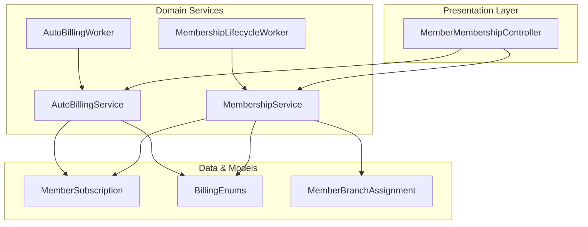
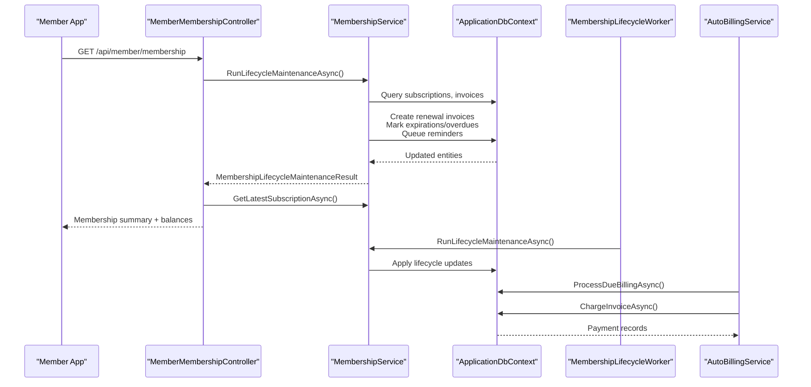
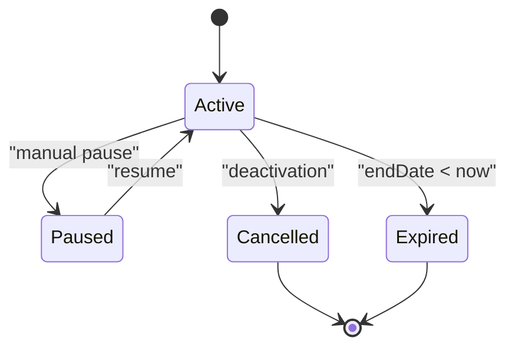
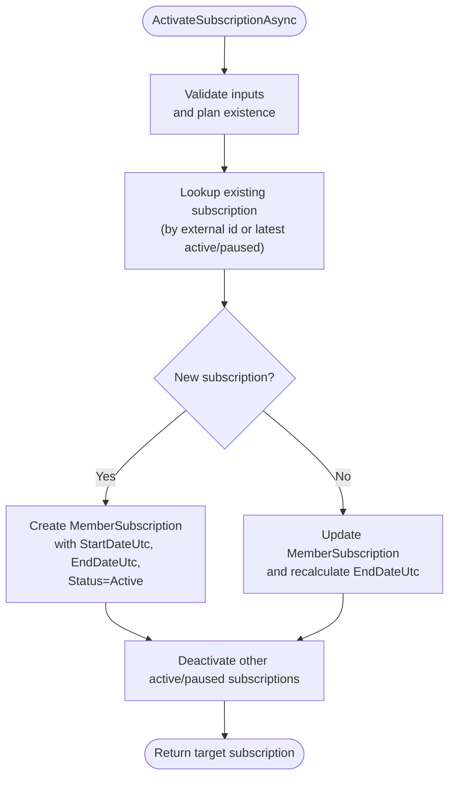
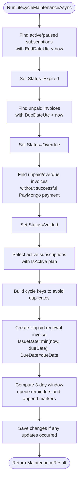
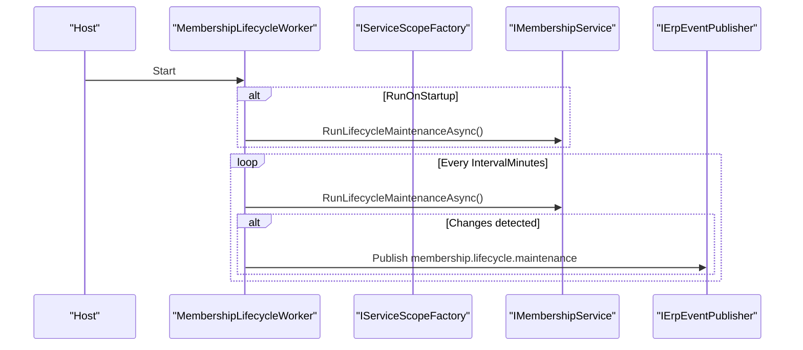
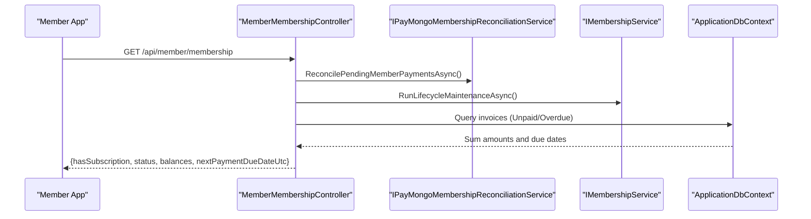
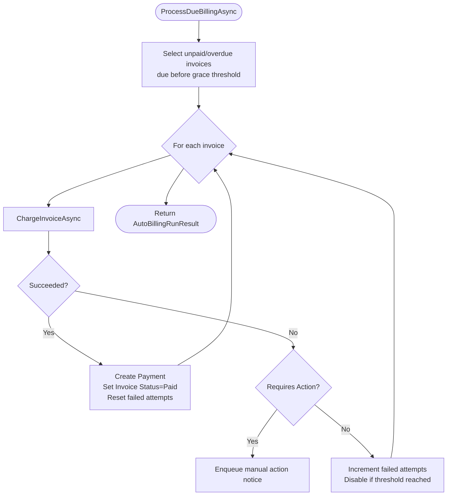
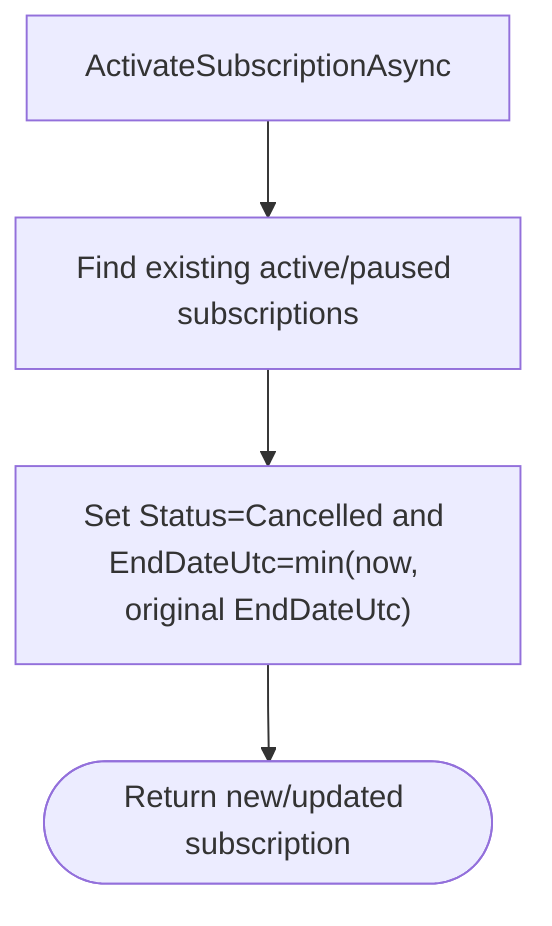
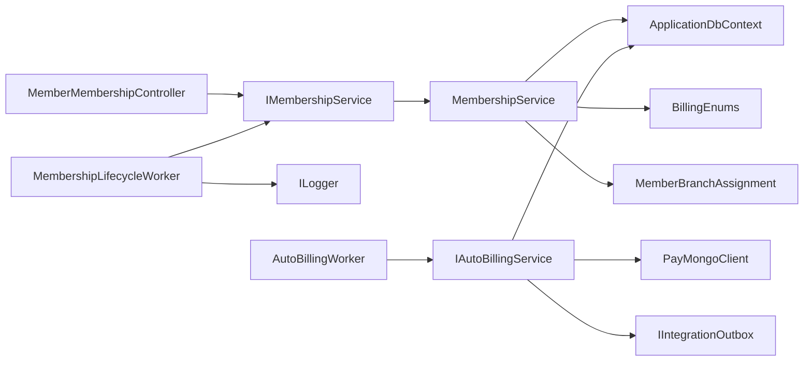

# Membership Lifecycle Management

<cite>
**Referenced Files in This Document**
- [MembershipService.cs](file://Services/Memberships/MembershipService.cs)
- [IMembershipService.cs](file://Services/Memberships/IMembershipService.cs)
- [MembershipLifecycleWorker.cs](file://Services/Memberships/MembershipLifecycleWorker.cs)
- [MembershipLifecycleWorkerOptions.cs](file://Services/Memberships/MembershipLifecycleWorkerOptions.cs)
- [MemberMembershipController.cs](file://Controllers/MemberMembershipController.cs)
- [MemberBranchAssignment.cs](file://Services/Memberships/MemberBranchAssignment.cs)
- [MemberSubscription.cs](file://Models/Billing/MemberSubscription.cs)
- [BillingEnums.cs](file://Models/Billing/BillingEnums.cs)
- [AutoBillingService.cs](file://Services/Payments/AutoBillingService.cs)
- [AutoBillingWorker.cs](file://Services/Payments/AutoBillingWorker.cs)
- [MembershipServiceBillingTests.cs](file://EJCFitnessGym.Tests/MembershipServiceBillingTests.cs)
</cite>

## Table of Contents
1. [Introduction](#introduction)
2. [Project Structure](#project-structure)
3. [Core Components](#core-components)
4. [Architecture Overview](#architecture-overview)
5. [Detailed Component Analysis](#detailed-component-analysis)
6. [Dependency Analysis](#dependency-analysis)
7. [Performance Considerations](#performance-considerations)
8. [Troubleshooting Guide](#troubleshooting-guide)
9. [Conclusion](#conclusion)
10. [Appendices](#appendices)

## Introduction
This document describes the membership lifecycle management system that governs the complete journey of gym memberships: enrollment, renewal processing, expiration detection, and cancellation handling. It explains membership status transitions (Active, Paused, Cancelled, Expired), the automated lifecycle worker, the membership service orchestration, grace period configurations, renewal reminders, and integration with the automated billing system. It also provides examples of state changes, renewal workflows, cancellation procedures, and operational insights.

## Project Structure
The membership lifecycle spans several layers:
- Controllers expose member-facing APIs for retrieving membership status, plans, and history.
- Services encapsulate business logic for activation, resumption, lifecycle maintenance, and branch assignment.
- Models define membership, subscription, invoices, and statuses.
- Workers automate lifecycle maintenance and auto-billing runs.
- Tests validate lifecycle behaviors and edge cases.

**Diagram sources**
- [MemberMembershipController.cs:1-204](file://Controllers/MemberMembershipController.cs#L1-L204)
- [MembershipService.cs:1-597](file://Services/Memberships/MembershipService.cs#L1-L597)
- [AutoBillingService.cs:1-493](file://Services/Payments/AutoBillingService.cs#L1-L493)
- [MembershipLifecycleWorker.cs:1-116](file://Services/Memberships/MembershipLifecycleWorker.cs#L1-L116)
- [AutoBillingWorker.cs:1-122](file://Services/Payments/AutoBillingWorker.cs#L1-L122)
- [MemberSubscription.cs:1-30](file://Models/Billing/MemberSubscription.cs#L1-L30)
- [BillingEnums.cs:1-51](file://Models/Billing/BillingEnums.cs#L1-L51)
- [MemberBranchAssignment.cs:1-156](file://Services/Memberships/MemberBranchAssignment.cs#L1-L156)

**Section sources**
- [MemberMembershipController.cs:1-204](file://Controllers/MemberMembershipController.cs#L1-L204)
- [MembershipService.cs:1-597](file://Services/Memberships/MembershipService.cs#L1-L597)
- [AutoBillingService.cs:1-493](file://Services/Payments/AutoBillingService.cs#L1-L493)
- [MembershipLifecycleWorker.cs:1-116](file://Services/Memberships/MembershipLifecycleWorker.cs#L1-L116)
- [AutoBillingWorker.cs:1-122](file://Services/Payments/AutoBillingWorker.cs#L1-L122)
- [MemberSubscription.cs:1-30](file://Models/Billing/MemberSubscription.cs#L1-L30)
- [BillingEnums.cs:1-51](file://Models/Billing/BillingEnums.cs#L1-L51)
- [MemberBranchAssignment.cs:1-156](file://Services/Memberships/MemberBranchAssignment.cs#L1-L156)

## Core Components
- MembershipService orchestrates membership activation, resumption, and lifecycle maintenance. It creates renewal invoices, marks expirations, updates overdue invoices, queues reminders, and voids failed checkout invoices.
- MembershipLifecycleWorker is a background service that periodically triggers lifecycle maintenance and optionally publishes real-time events.
- MemberMembershipController exposes member APIs that reconcile pending payments, run lifecycle maintenance, and compute balances and due dates.
- AutoBillingService and AutoBillingWorker handle off-session auto-charging of due invoices, manage payment methods, and notify members of successes/failures.
- MemberBranchAssignment resolves home branch information for invoicing and analytics.
- BillingEnums define subscription and invoice statuses, payment methods, and cycles.

**Section sources**
- [IMembershipService.cs:1-37](file://Services/Memberships/IMembershipService.cs#L1-L37)
- [MembershipService.cs:1-597](file://Services/Memberships/MembershipService.cs#L1-L597)
- [MembershipLifecycleWorker.cs:1-116](file://Services/Memberships/MembershipLifecycleWorker.cs#L1-L116)
- [MemberMembershipController.cs:1-204](file://Controllers/MemberMembershipController.cs#L1-L204)
- [AutoBillingService.cs:1-493](file://Services/Payments/AutoBillingService.cs#L1-L493)
- [AutoBillingWorker.cs:1-122](file://Services/Payments/AutoBillingWorker.cs#L1-L122)
- [MemberBranchAssignment.cs:1-156](file://Services/Memberships/MemberBranchAssignment.cs#L1-L156)
- [BillingEnums.cs:1-51](file://Models/Billing/BillingEnums.cs#L1-L51)

## Architecture Overview
The membership lifecycle integrates member requests, subscription state management, invoice generation, and automated billing.

**Diagram sources**
- [MemberMembershipController.cs:34-109](file://Controllers/MemberMembershipController.cs#L34-L109)
- [MembershipService.cs:248-460](file://Services/Memberships/MembershipService.cs#L248-L460)
- [MembershipLifecycleWorker.cs:51-108](file://Services/Memberships/MembershipLifecycleWorker.cs#L51-L108)
- [AutoBillingService.cs:69-124](file://Services/Payments/AutoBillingService.cs#L69-L124)

## Detailed Component Analysis

### Membership Status Model and Transitions
Membership status transitions are governed by explicit rules:
- Active: Subscription is currently active; renewal invoices are generated at cycle end.
- Paused: Subscription is paused; lifecycle maintenance does not generate renewals until resumed.
- Cancelled: Subscription is cancelled; lifecycle maintenance does not generate renewals.
- Expired: Subscription end-date passed without renewal; marked expired.

**Diagram sources**
- [BillingEnums.cs:17-23](file://Models/Billing/BillingEnums.cs#L17-L23)

**Section sources**
- [BillingEnums.cs:17-23](file://Models/Billing/BillingEnums.cs#L17-L23)
- [MembershipService.cs:248-460](file://Services/Memberships/MembershipService.cs#L248-L460)

### Membership Activation and Renewal Workflow
Activation supports external references and reactivates existing subscriptions when applicable. Renewal is anchored to the subscription’s end date or a provided start date.

**Diagram sources**
- [MembershipService.cs:72-197](file://Services/Memberships/MembershipService.cs#L72-L197)

**Section sources**
- [MembershipService.cs:72-197](file://Services/Memberships/MembershipService.cs#L72-L197)

### Lifecycle Maintenance: Expiration, Renewal, Reminders, and Voids
Lifecycle maintenance performs four primary tasks:
- Mark expired subscriptions whose end date is in the past.
- Mark unpaid invoices overdue if due date is in the past.
- Void failed checkout invoices when no successful payment exists.
- Generate renewal invoices for active subscriptions whose cycle end date matches the run window.
- Queue 3-day reminders for upcoming due dates and append markers to prevent duplicates.

**Diagram sources**
- [MembershipService.cs:248-460](file://Services/Memberships/MembershipService.cs#L248-L460)

**Section sources**
- [MembershipService.cs:248-460](file://Services/Memberships/MembershipService.cs#L248-L460)
- [MembershipServiceBillingTests.cs:13-59](file://EJCFitnessGym.Tests/MembershipServiceBillingTests.cs#L13-L59)
- [MembershipServiceBillingTests.cs:62-107](file://EJCFitnessGym.Tests/MembershipServiceBillingTests.cs#L62-L107)
- [MembershipServiceBillingTests.cs:110-146](file://EJCFitnessGym.Tests/MembershipServiceBillingTests.cs#L110-L146)

### Automated Membership Lifecycle Worker
The MembershipLifecycleWorker runs on startup and on schedule, invoking lifecycle maintenance and publishing real-time events when changes occur.

**Diagram sources**
- [MembershipLifecycleWorker.cs:22-108](file://Services/Memberships/MembershipLifecycleWorker.cs#L22-L108)
- [MembershipLifecycleWorkerOptions.cs:1-11](file://Services/Memberships/MembershipLifecycleWorkerOptions.cs#L1-L11)

**Section sources**
- [MembershipLifecycleWorker.cs:1-116](file://Services/Memberships/MembershipLifecycleWorker.cs#L1-L116)
- [MembershipLifecycleWorkerOptions.cs:1-11](file://Services/Memberships/MembershipLifecycleWorkerOptions.cs#L1-L11)

### Member Portal Integration and Balances
MemberMembershipController reconciles pending payments, runs lifecycle maintenance, and computes balances:
- Outstanding balance: Overdue plus unpaid invoices due now or earlier.
- Scheduled balance: Unpaid invoices due after now.
- Next payment due date: Earliest unpaid/overdue due date or subscription end date fallback.

**Diagram sources**
- [MemberMembershipController.cs:34-109](file://Controllers/MemberMembershipController.cs#L34-L109)

**Section sources**
- [MemberMembershipController.cs:34-109](file://Controllers/MemberMembershipController.cs#L34-L109)

### Automated Billing Integration
AutoBillingService charges due invoices using saved payment methods, tracks attempts, and disables methods after repeated failures. AutoBillingWorker schedules periodic runs.

**Diagram sources**
- [AutoBillingService.cs:69-377](file://Services/Payments/AutoBillingService.cs#L69-L377)
- [AutoBillingWorker.cs:84-119](file://Services/Payments/AutoBillingWorker.cs#L84-L119)

**Section sources**
- [AutoBillingService.cs:1-493](file://Services/Payments/AutoBillingService.cs#L1-L493)
- [AutoBillingWorker.cs:1-122](file://Services/Payments/AutoBillingWorker.cs#L1-L122)

### Grace Period and Late Fees
- Grace period: Auto-billing avoids charging invoices up to one hour past due date to allow manual payment completion.
- Late fees: Not implemented in the reviewed code; renewal invoices reflect plan prices without additional late charges.

Operational implications:
- Members have a short grace window to pay manually without auto-charging.
- If auto-billing fails due to requiring 3D Secure authentication, members receive notifications to complete payment manually.

**Section sources**
- [AutoBillingService.cs:54-55](file://Services/Payments/AutoBillingService.cs#L54-L55)
- [AutoBillingService.cs:297-325](file://Services/Payments/AutoBillingService.cs#L297-L325)

### Cancellation Handling
Cancellation is handled by deactivating overlapping active/paused subscriptions upon activation of a new subscription. Cancelled subscriptions remain inactive and do not generate renewals.

**Diagram sources**
- [MembershipService.cs:180-196](file://Services/Memberships/MembershipService.cs#L180-L196)

**Section sources**
- [MembershipService.cs:180-196](file://Services/Memberships/MembershipService.cs#L180-L196)

### Renewal Reminders and Notifications
- 3-day reminders are queued when an invoice’s due date falls within a daily window around the due date.
- Reminders are deduplicated by appending a marker to invoice notes.
- Integration outbox messages are enqueued for both the member and back office.

**Section sources**
- [MembershipService.cs:388-441](file://Services/Memberships/MembershipService.cs#L388-L441)
- [MembershipServiceBillingTests.cs:62-107](file://EJCFitnessGym.Tests/MembershipServiceBillingTests.cs#L62-L107)

### Branch Assignment for Invoicing
MemberBranchAssignment resolves home branch information for invoices and analytics, falling back from profile to claims when needed.

**Section sources**
- [MemberBranchAssignment.cs:28-93](file://Services/Memberships/MemberBranchAssignment.cs#L28-L93)

## Dependency Analysis
- MembershipService depends on ApplicationDbContext, optional integration outbox/email sender, and logs.
- MemberMembershipController depends on IMembershipService and optional reconciliation service.
- MembershipLifecycleWorker depends on IMembershipService and optional real-time publisher.
- AutoBillingService depends on ApplicationDbContext, PayMongo client, integration outbox, and logs.
- AutoBillingWorker depends on IAutoBillingService.

**Diagram sources**
- [MemberMembershipController.cs:17-32](file://Controllers/MemberMembershipController.cs#L17-L32)
- [MembershipService.cs:9-26](file://Services/Memberships/MembershipService.cs#L9-L26)
- [MembershipLifecycleWorker.cs:8-20](file://Services/Memberships/MembershipLifecycleWorker.cs#L8-L20)
- [AutoBillingService.cs:44-67](file://Services/Payments/AutoBillingService.cs#L44-L67)
- [AutoBillingWorker.cs:36-48](file://Services/Payments/AutoBillingWorker.cs#L36-L48)

**Section sources**
- [MemberMembershipController.cs:17-32](file://Controllers/MemberMembershipController.cs#L17-L32)
- [MembershipService.cs:9-26](file://Services/Memberships/MembershipService.cs#L9-L26)
- [MembershipLifecycleWorker.cs:8-20](file://Services/Memberships/MembershipLifecycleWorker.cs#L8-L20)
- [AutoBillingService.cs:44-67](file://Services/Payments/AutoBillingService.cs#L44-L67)
- [AutoBillingWorker.cs:36-48](file://Services/Payments/AutoBillingWorker.cs#L36-L48)

## Performance Considerations
- Batch processing: MembershipService caps renewal invoice generation and deduplicates cycles to minimize redundant work.
- AutoBillingService limits batch size and recent attempt checks to avoid excessive retries.
- Worker intervals: Both workers clamp intervals to reasonable ranges to prevent overly frequent operations.
- Logging: Debug-level logs are used for idle runs; info/warning logs capture meaningful changes.

[No sources needed since this section provides general guidance]

## Troubleshooting Guide
Common scenarios and diagnostics:
- Renewal invoice not generated: Verify subscription is Active, EndDateUtc is approaching, and no duplicate invoice exists for the cycle key.
- Reminder not sent: Confirm due date falls within the 3-day window and the reminder marker is not already present.
- Failed checkout invoice not voided: Ensure no successful PayMongo payment exists for the invoice.
- Auto-billing skipped: Check payment method availability, auto-billing enabled flag, and recent failed attempts threshold.
- Real-time events not published: Confirm MembershipLifecycleWorker publish option is enabled.

**Section sources**
- [MembershipService.cs:332-386](file://Services/Memberships/MembershipService.cs#L332-L386)
- [MembershipService.cs:390-441](file://Services/Memberships/MembershipService.cs#L390-L441)
- [MembershipService.cs:280-305](file://Services/Memberships/MembershipService.cs#L280-L305)
- [AutoBillingService.cs:148-160](file://Services/Payments/AutoBillingService.cs#L148-L160)
- [MembershipLifecycleWorker.cs:83-98](file://Services/Memberships/MembershipLifecycleWorker.cs#L83-L98)

## Conclusion
The membership lifecycle system provides a robust, automated pipeline for managing subscriptions from enrollment to renewal and expiration. It leverages background workers, lifecycle maintenance, and integration with automated billing to minimize manual intervention while ensuring accurate state transitions and timely reminders. The design cleanly separates concerns between membership orchestration, billing automation, and member portal integration.

[No sources needed since this section summarizes without analyzing specific files]

## Appendices

### Membership Status Definitions
- Active: Currently entitled to membership benefits.
- Paused: Temporarily suspended; resumes at a future date.
- Cancelled: Terminated; no further renewals.
- Expired: Past end date without renewal.

**Section sources**
- [BillingEnums.cs:17-23](file://Models/Billing/BillingEnums.cs#L17-L23)

### Example Scenarios
- Renewal invoice creation: An Active subscription with an expiring cycle generates a single Unpaid invoice for the plan price.
- 3-day reminder: On the due date window, a reminder is queued and a marker appended to notes to prevent duplicates.
- Voiding failed checkout: An invoice with “Subscription purchase” notes and no successful PayMongo payment is voided.

**Section sources**
- [MembershipServiceBillingTests.cs:13-59](file://EJCFitnessGym.Tests/MembershipServiceBillingTests.cs#L13-L59)
- [MembershipServiceBillingTests.cs:62-107](file://EJCFitnessGym.Tests/MembershipServiceBillingTests.cs#L62-L107)
- [MembershipServiceBillingTests.cs:110-146](file://EJCFitnessGym.Tests/MembershipServiceBillingTests.cs#L110-L146)