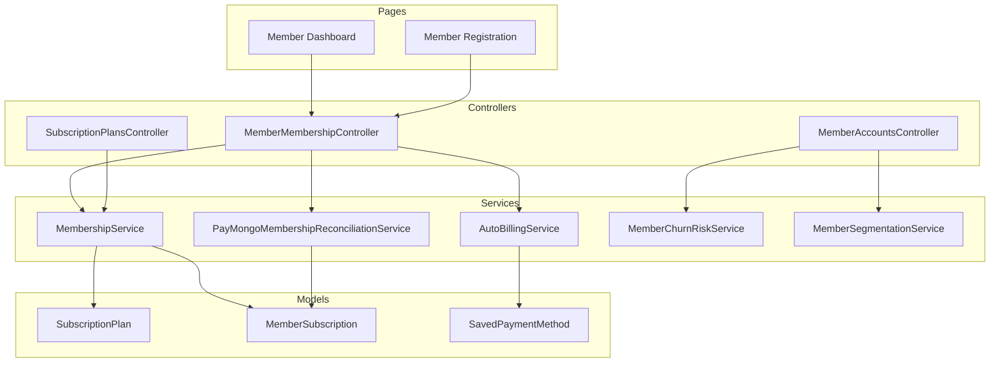
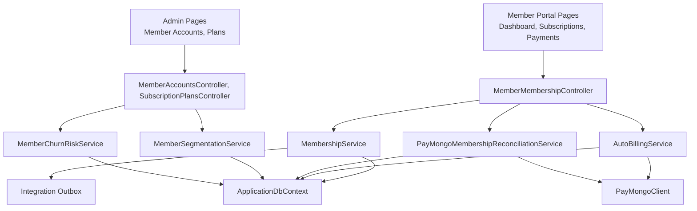
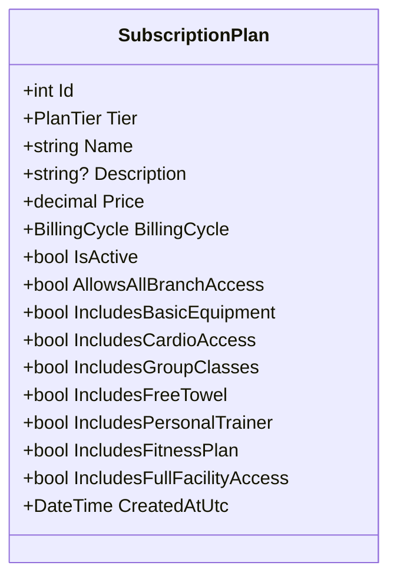
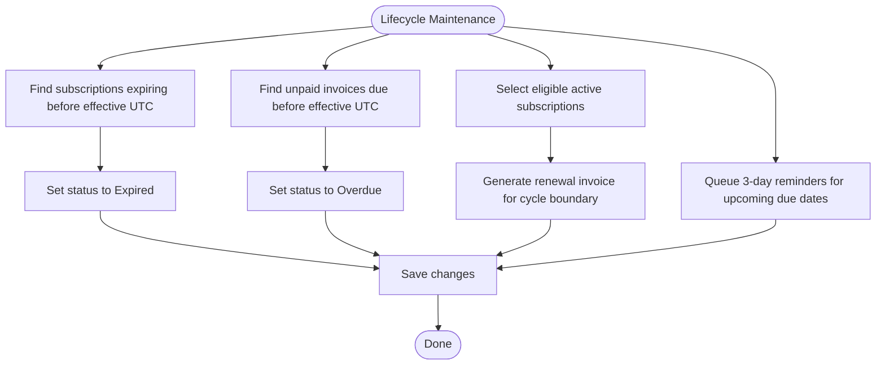
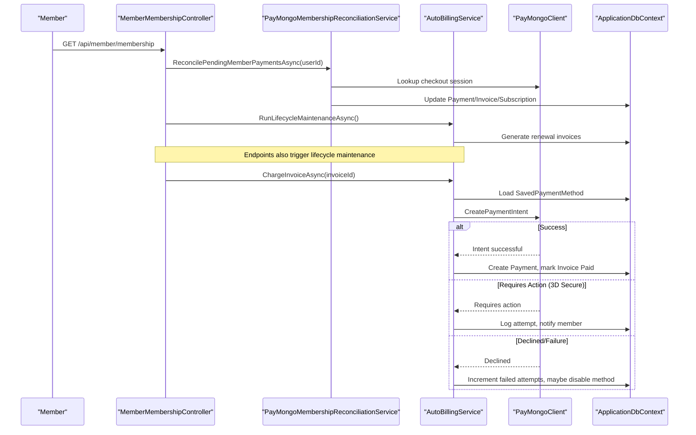
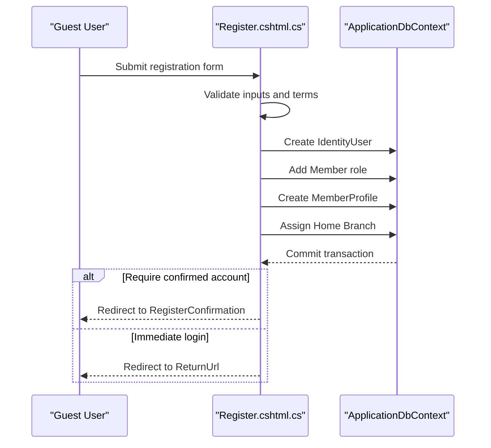
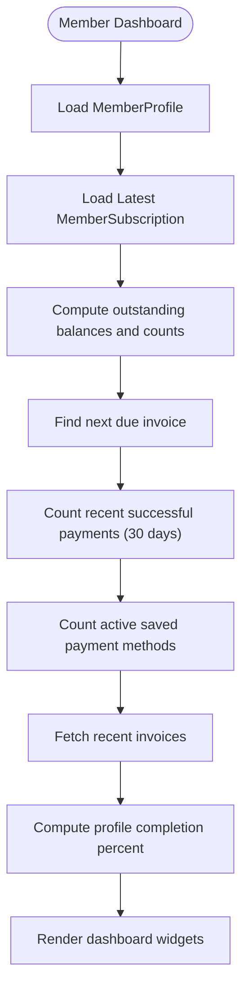
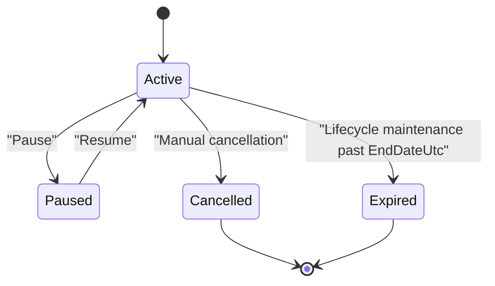
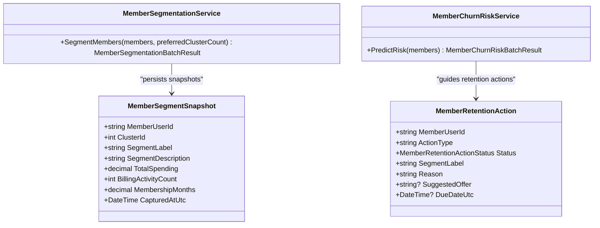
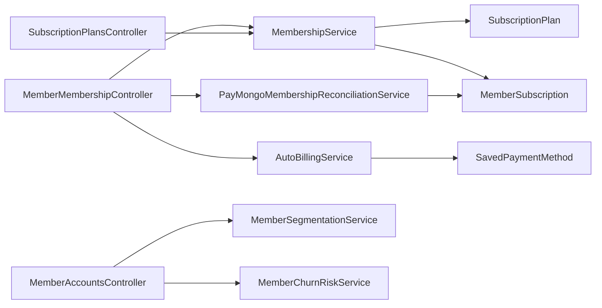

# Membership Management System

<cite>
**Referenced Files in This Document**
- [MemberMembershipController.cs](file://Controllers/MemberMembershipController.cs)
- [SubscriptionPlansController.cs](file://Controllers/SubscriptionPlansController.cs)
- [MemberAccountsController.cs](file://Controllers/MemberAccountsController.cs)
- [MembershipService.cs](file://Services/Memberships/MembershipService.cs)
- [IMembershipService.cs](file://Services/Memberships/IMembershipService.cs)
- [AutoBillingService.cs](file://Services/Payments/AutoBillingService.cs)
- [PayMongoMembershipReconciliationService.cs](file://Services/Payments/PayMongoMembershipReconciliationService.cs)
- [SubscriptionPlan.cs](file://Models/Billing/SubscriptionPlan.cs)
- [MemberSubscription.cs](file://Models/Billing/MemberSubscription.cs)
- [SavedPaymentMethod.cs](file://Models/Billing/SavedPaymentMethod.cs)
- [MemberChurnRiskService.cs](file://Services/AI/MemberChurnRiskService.cs)
- [MemberSegmentationService.cs](file://Services/AI/MemberSegmentationService.cs)
- [MemberAiInsights.cs](file://Models/Admin/MemberAiInsights.cs)
- [Register.cshtml.cs](file://Areas/Identity/Pages/Account/Register.cshtml.cs)
- [Dashboard.cshtml.cs](file://Pages/Member/Dashboard.cshtml.cs)
</cite>

## Table of Contents
1. [Introduction](#introduction)
2. [Project Structure](#project-structure)
3. [Core Components](#core-components)
4. [Architecture Overview](#architecture-overview)
5. [Detailed Component Analysis](#detailed-component-analysis)
6. [Dependency Analysis](#dependency-analysis)
7. [Performance Considerations](#performance-considerations)
8. [Troubleshooting Guide](#troubleshooting-guide)
9. [Conclusion](#conclusion)
10. [Appendices](#appendices)

## Introduction
This document describes the membership management system for EJC Fitness Gym. It covers subscription plan management, member registration and profile completion, membership lifecycle automation (renewals, cancellations, status transitions), payment method management integrated with automated billing, the member portal capabilities, business rules around membership states and retention strategies, and integrations with AI services for member insights and churn prediction.

## Project Structure
The membership system spans controllers, services, models, pages, and AI services:
- Controllers expose APIs and UI endpoints for membership, plans, and member accounts.
- Services encapsulate business logic for membership lifecycle, auto-billing, reconciliation, and AI-driven insights.
- Models define subscription plans, memberships, invoices, payments, and saved payment methods.
- Pages power the member portal dashboards and account management UI.
- AI services provide segmentation and churn risk scoring.

**Diagram sources**
- [MemberMembershipController.cs:12-32](file://Controllers/MemberMembershipController.cs#L12-L32)
- [SubscriptionPlansController.cs:11-19](file://Controllers/SubscriptionPlansController.cs#L11-L19)
- [MemberAccountsController.cs:17-39](file://Controllers/MemberAccountsController.cs#L17-L39)
- [MembershipService.cs:9-26](file://Services/Memberships/MembershipService.cs#L9-L26)
- [AutoBillingService.cs:44-67](file://Services/Payments/AutoBillingService.cs#L44-L67)
- [PayMongoMembershipReconciliationService.cs:10-32](file://Services/Payments/PayMongoMembershipReconciliationService.cs#L10-L32)
- [MemberChurnRiskService.cs:3-10](file://Services/AI/MemberChurnRiskService.cs#L3-L10)
- [MemberSegmentationService.cs:6-14](file://Services/AI/MemberSegmentationService.cs#L6-L14)
- [SubscriptionPlan.cs:5-51](file://Models/Billing/SubscriptionPlan.cs#L5-L51)
- [MemberSubscription.cs:5-28](file://Models/Billing/MemberSubscription.cs#L5-L28)
- [SavedPaymentMethod.cs:8-86](file://Models/Billing/SavedPaymentMethod.cs#L8-L86)
- [Dashboard.cshtml.cs:13-21](file://Pages/Member/Dashboard.cshtml.cs#L13-L21)
- [Register.cshtml.cs:22-51](file://Areas/Identity/Pages/Account/Register.cshtml.cs#L22-L51)

**Section sources**
- [MemberMembershipController.cs:12-32](file://Controllers/MemberMembershipController.cs#L12-L32)
- [SubscriptionPlansController.cs:11-19](file://Controllers/SubscriptionPlansController.cs#L11-L19)
- [MemberAccountsController.cs:17-39](file://Controllers/MemberAccountsController.cs#L17-L39)
- [MembershipService.cs:9-26](file://Services/Memberships/MembershipService.cs#L9-L26)
- [AutoBillingService.cs:44-67](file://Services/Payments/AutoBillingService.cs#L44-L67)
- [PayMongoMembershipReconciliationService.cs:10-32](file://Services/Payments/PayMongoMembershipReconciliationService.cs#L10-L32)
- [MemberChurnRiskService.cs:3-10](file://Services/AI/MemberChurnRiskService.cs#L3-L10)
- [MemberSegmentationService.cs:6-14](file://Services/AI/MemberSegmentationService.cs#L6-L14)
- [SubscriptionPlan.cs:5-51](file://Models/Billing/SubscriptionPlan.cs#L5-L51)
- [MemberSubscription.cs:5-28](file://Models/Billing/MemberSubscription.cs#L5-L28)
- [SavedPaymentMethod.cs:8-86](file://Models/Billing/SavedPaymentMethod.cs#L8-L86)
- [Dashboard.cshtml.cs:13-21](file://Pages/Member/Dashboard.cshtml.cs#L13-L21)
- [Register.cshtml.cs:22-51](file://Areas/Identity/Pages/Account/Register.cshtml.cs#L22-L51)

## Core Components
- Subscription Plans: Define tiers, pricing, billing cycles, and entitlements. Admins manage plan creation, editing, activation/deactivation, and defaults.
- Membership Lifecycle: Activation, renewal, expiration, pausing/resuming, and cancellation with automated invoice generation and reminders.
- Auto-Billing and Reconciliation: Automated charging of due invoices, saving and managing default payment methods, and reconciling PayMongo checkout sessions.
- Member Portal: Dashboard with subscription status, upcoming dues, payment history, and profile completeness metrics.
- AI Insights: Member segmentation and churn risk scoring to drive retention actions.
- Member Registration: End-to-end sign-up flow with profile creation and branch assignment.

**Section sources**
- [SubscriptionPlansController.cs:67-95](file://Controllers/SubscriptionPlansController.cs#L67-L95)
- [SubscriptionPlansController.cs:97-153](file://Controllers/SubscriptionPlansController.cs#L97-L153)
- [MembershipService.cs:28-70](file://Services/Memberships/MembershipService.cs#L28-L70)
- [MembershipService.cs:72-197](file://Services/Memberships/MembershipService.cs#L72-L197)
- [MembershipService.cs:248-460](file://Services/Memberships/MembershipService.cs#L248-L460)
- [AutoBillingService.cs:69-124](file://Services/Payments/AutoBillingService.cs#L69-L124)
- [AutoBillingService.cs:379-446](file://Services/Payments/AutoBillingService.cs#L379-L446)
- [PayMongoMembershipReconciliationService.cs:34-146](file://Services/Payments/PayMongoMembershipReconciliationService.cs#L34-L146)
- [Dashboard.cshtml.cs:50-154](file://Pages/Member/Dashboard.cshtml.cs#L50-L154)
- [MemberChurnRiskService.cs:5-34](file://Services/AI/MemberChurnRiskService.cs#L5-L34)
- [MemberSegmentationService.cs:47-175](file://Services/AI/MemberSegmentationService.cs#L47-L175)
- [Register.cshtml.cs:114-259](file://Areas/Identity/Pages/Account/Register.cshtml.cs#L114-L259)

## Architecture Overview
The system follows a layered architecture:
- Presentation: Controllers and Razor Pages for admin and member experiences.
- Application: Services orchestrate domain logic for membership, billing, and AI.
- Domain/Data: EF Core models and repositories for persistence.
- Integrations: PayMongo client and integration outbox for event-driven notifications.

**Diagram sources**
- [MemberMembershipController.cs:12-32](file://Controllers/MemberMembershipController.cs#L12-L32)
- [SubscriptionPlansController.cs:11-19](file://Controllers/SubscriptionPlansController.cs#L11-L19)
- [MemberAccountsController.cs:17-39](file://Controllers/MemberAccountsController.cs#L17-L39)
- [MembershipService.cs:9-26](file://Services/Memberships/MembershipService.cs#L9-L26)
- [AutoBillingService.cs:44-67](file://Services/Payments/AutoBillingService.cs#L44-L67)
- [PayMongoMembershipReconciliationService.cs:10-32](file://Services/Payments/PayMongoMembershipReconciliationService.cs#L10-L32)
- [MemberSegmentationService.cs:6-14](file://Services/AI/MemberSegmentationService.cs#L6-L14)
- [MemberChurnRiskService.cs:3-10](file://Services/AI/MemberChurnRiskService.cs#L3-L10)

## Detailed Component Analysis

### Subscription Plan Management
- Creation and Defaults: Admins can seed default plans per tier and create new plans with preset attributes applied.
- Editing: Updates preserve plan identity while allowing modifications to name, description, tier, pricing, billing cycle, and entitlement flags.
- Deactivation vs. Deletion: Deleting a plan with active assignments deactivates it instead of removing it.
- Catalog Utilities: Benefits and access summaries are derived from plan attributes for display and selection.

**Diagram sources**
- [SubscriptionPlan.cs:5-51](file://Models/Billing/SubscriptionPlan.cs#L5-L51)

**Section sources**
- [SubscriptionPlansController.cs:67-95](file://Controllers/SubscriptionPlansController.cs#L67-L95)
- [SubscriptionPlansController.cs:97-153](file://Controllers/SubscriptionPlansController.cs#L97-L153)
- [SubscriptionPlansController.cs:167-213](file://Controllers/SubscriptionPlansController.cs#L167-L213)
- [SubscriptionPlansController.cs:215-256](file://Controllers/SubscriptionPlansController.cs#L215-L256)
- [SubscriptionPlan.cs:5-51](file://Models/Billing/SubscriptionPlan.cs#L5-L51)

### Membership Lifecycle Automation
- Activation: Creates or reactivates a subscription for a member, normalizing dates and calculating end dates based on billing cycles.
- Renewal: Generates renewal invoices at cycle boundaries and enqueues reminders.
- Expiration and Overdue: Marks subscriptions as expired and invoices as overdue based on cutoffs.
- Pausing and Resuming: Transitions paused subscriptions back to active and recalculates end dates when resuming.
- Maintenance: Batch job-like maintenance routine runs lifecycle updates and reminder notifications.

**Diagram sources**
- [MembershipService.cs:248-460](file://Services/Memberships/MembershipService.cs#L248-L460)

**Section sources**
- [MembershipService.cs:72-197](file://Services/Memberships/MembershipService.cs#L72-L197)
- [MembershipService.cs:248-460](file://Services/Memberships/MembershipService.cs#L248-L460)
- [IMembershipService.cs:5-36](file://Services/Memberships/IMembershipService.cs#L5-L36)

### Payment Method Management and Automated Billing
- Default Payment Retrieval: Selects the most recent active PayMongo method marked as default.
- Saving Methods: Deactivates prior defaults, sets new default, and applies auto-billing capability based on gateway support.
- Auto-Charging: Processes due invoices within a grace window, tracks attempts, handles retries, and disables methods after failures.
- Failure Handling: Notifies members, updates payment method status, and marks invoices appropriately.
- Reconciliation: Validates PayMongo checkout sessions, updates payment/invoice statuses, and activates memberships when applicable.

**Diagram sources**
- [MemberMembershipController.cs:34-109](file://Controllers/MemberMembershipController.cs#L34-L109)
- [PayMongoMembershipReconciliationService.cs:34-146](file://Services/Payments/PayMongoMembershipReconciliationService.cs#L34-L146)
- [AutoBillingService.cs:69-124](file://Services/Payments/AutoBillingService.cs#L69-L124)
- [AutoBillingService.cs:126-377](file://Services/Payments/AutoBillingService.cs#L126-L377)

**Section sources**
- [AutoBillingService.cs:379-446](file://Services/Payments/AutoBillingService.cs#L379-L446)
- [AutoBillingService.cs:69-124](file://Services/Payments/AutoBillingService.cs#L69-L124)
- [AutoBillingService.cs:126-377](file://Services/Payments/AutoBillingService.cs#L126-L377)
- [PayMongoMembershipReconciliationService.cs:34-146](file://Services/Payments/PayMongoMembershipReconciliationService.cs#L34-L146)
- [SavedPaymentMethod.cs:8-86](file://Models/Billing/SavedPaymentMethod.cs#L8-L86)

### Member Registration and Profile Completion
- Registration Flow: Validates inputs, creates IdentityUser, assigns Member role, persists profile, assigns home branch, and optionally sends email verification.
- Return URL Handling: Redirects to pricing page when coming from a plan selection.
- Branch Resolution: Falls back to configuration, active branches, or bootstraps a default branch if needed.

**Diagram sources**
- [Register.cshtml.cs:114-259](file://Areas/Identity/Pages/Account/Register.cshtml.cs#L114-L259)

**Section sources**
- [Register.cshtml.cs:114-259](file://Areas/Identity/Pages/Account/Register.cshtml.cs#L114-L259)

### Member Portal Functionality
- Dashboard: Displays current subscription, days remaining, outstanding balance, upcoming due dates, recent payments, saved payment methods, and profile completeness.
- Navigation Shortcuts: Provides quick links to subscriptions, payments, and profile management.
- Automatic Renewal Availability: Reflects gateway capabilities for off-session auto-billing.

**Diagram sources**
- [Dashboard.cshtml.cs:50-154](file://Pages/Member/Dashboard.cshtml.cs#L50-L154)

**Section sources**
- [Dashboard.cshtml.cs:50-154](file://Pages/Member/Dashboard.cshtml.cs#L50-L154)

### Business Rules, States, and Retention Strategies
- Subscription States: Active, Paused, Cancelled, Expired with transitions governed by lifecycle maintenance and manual actions.
- Renewal and Grace: Renewal invoices generated at cycle end; reminders queued for 3 days prior; grace period before auto-charging.
- Expiration and Overdue: Subscriptions expire past EndDateUtc; invoices become Overdue after DueDateUtc.
- Retention Actions: Admins can create open or in-progress retention actions linked to segments and churn risk levels.

**Diagram sources**
- [MembershipService.cs:248-460](file://Services/Memberships/MembershipService.cs#L248-L460)
- [MemberAiInsights.cs:4-11](file://Models/Admin/MemberAiInsights.cs#L4-L11)

**Section sources**
- [MembershipService.cs:248-460](file://Services/Memberships/MembershipService.cs#L248-L460)
- [MemberAiInsights.cs:4-11](file://Models/Admin/MemberAiInsights.cs#L4-L11)

### AI Services for Member Insights and Churn Prediction
- Segmentation: Uses K-Means clustering on spending, billing activity, and membership months to derive segments and cluster labels.
- Churn Risk: Computes risk scores based on days since last payment, overdue invoice count, membership end horizon, activity, and spending thresholds.
- Integration: Admin views are enriched with AI cluster labels, risk levels, and retention action status.

**Diagram sources**
- [MemberSegmentationService.cs:6-14](file://Services/AI/MemberSegmentationService.cs#L6-L14)
- [MemberChurnRiskService.cs:3-10](file://Services/AI/MemberChurnRiskService.cs#L3-L10)
- [MemberAiInsights.cs:13-41](file://Models/Admin/MemberAiInsights.cs#L13-L41)
- [MemberAiInsights.cs:43-82](file://Models/Admin/MemberAiInsights.cs#L43-L82)

**Section sources**
- [MemberSegmentationService.cs:47-175](file://Services/AI/MemberSegmentationService.cs#L47-L175)
- [MemberChurnRiskService.cs:5-34](file://Services/AI/MemberChurnRiskService.cs#L5-L34)
- [MemberAiInsights.cs:13-82](file://Models/Admin/MemberAiInsights.cs#L13-L82)

## Dependency Analysis
- Controllers depend on services for membership, billing, and AI logic.
- Services depend on EF Core for persistence and optional integrations for emails/outbox.
- Models define the domain entities for plans, subscriptions, invoices, payments, and saved payment methods.
- Pages consume controllers and services to render member-facing dashboards.

**Diagram sources**
- [MemberMembershipController.cs:12-32](file://Controllers/MemberMembershipController.cs#L12-L32)
- [SubscriptionPlansController.cs:11-19](file://Controllers/SubscriptionPlansController.cs#L11-L19)
- [MemberAccountsController.cs:17-39](file://Controllers/MemberAccountsController.cs#L17-L39)
- [MembershipService.cs:9-26](file://Services/Memberships/MembershipService.cs#L9-L26)
- [AutoBillingService.cs:44-67](file://Services/Payments/AutoBillingService.cs#L44-L67)
- [PayMongoMembershipReconciliationService.cs:10-32](file://Services/Payments/PayMongoMembershipReconciliationService.cs#L10-L32)
- [MemberSegmentationService.cs:6-14](file://Services/AI/MemberSegmentationService.cs#L6-L14)
- [MemberChurnRiskService.cs:3-10](file://Services/AI/MemberChurnRiskService.cs#L3-L10)
- [SubscriptionPlan.cs:5-51](file://Models/Billing/SubscriptionPlan.cs#L5-L51)
- [MemberSubscription.cs:5-28](file://Models/Billing/MemberSubscription.cs#L5-L28)
- [SavedPaymentMethod.cs:8-86](file://Models/Billing/SavedPaymentMethod.cs#L8-L86)

**Section sources**
- [MemberMembershipController.cs:12-32](file://Controllers/MemberMembershipController.cs#L12-L32)
- [SubscriptionPlansController.cs:11-19](file://Controllers/SubscriptionPlansController.cs#L11-L19)
- [MemberAccountsController.cs:17-39](file://Controllers/MemberAccountsController.cs#L17-L39)
- [MembershipService.cs:9-26](file://Services/Memberships/MembershipService.cs#L9-L26)
- [AutoBillingService.cs:44-67](file://Services/Payments/AutoBillingService.cs#L44-L67)
- [PayMongoMembershipReconciliationService.cs:10-32](file://Services/Payments/PayMongoMembershipReconciliationService.cs#L10-L32)
- [MemberSegmentationService.cs:6-14](file://Services/AI/MemberSegmentationService.cs#L6-L14)
- [MemberChurnRiskService.cs:3-10](file://Services/AI/MemberChurnRiskService.cs#L3-L10)
- [SubscriptionPlan.cs:5-51](file://Models/Billing/SubscriptionPlan.cs#L5-L51)
- [MemberSubscription.cs:5-28](file://Models/Billing/MemberSubscription.cs#L5-L28)
- [SavedPaymentMethod.cs:8-86](file://Models/Billing/SavedPaymentMethod.cs#L8-L86)

## Performance Considerations
- Batching: Auto-billing limits batch size and applies rate limiting to avoid excessive load.
- Indexing and Queries: Controllers and services use AsNoTracking for read-heavy queries and targeted projections to reduce payload sizes.
- Grace Periods: A short grace period prevents immediate auto-charging right at due time, reducing race conditions.
- Maintenance Frequency: Lifecycle maintenance runs periodically; ensure scheduling aligns with expected renewal volumes.

[No sources needed since this section provides general guidance]

## Troubleshooting Guide
- Auto-billing Failures: Inspect failed attempt counts and disablement logic; review gateway responses and member notifications.
- Reconciliation Issues: Verify PayMongo secret key configuration and checkout session lookup results; confirm invoice/payment linkage.
- Membership Status Stuck: Trigger lifecycle maintenance to force state transitions and reminder enqueue.
- Payment Method Problems: Ensure default method selection criteria and gateway capability checks; confirm auto-billing toggles.

**Section sources**
- [AutoBillingService.cs:51-56](file://Services/Payments/AutoBillingService.cs#L51-L56)
- [AutoBillingService.cs:148-208](file://Services/Payments/AutoBillingService.cs#L148-L208)
- [PayMongoMembershipReconciliationService.cs:34-146](file://Services/Payments/PayMongoMembershipReconciliationService.cs#L34-L146)
- [MembershipService.cs:248-460](file://Services/Memberships/MembershipService.cs#L248-L460)

## Conclusion
The membership management system integrates plan catalogs, lifecycle automation, automated billing, and AI-driven insights to deliver a robust, scalable solution. It supports flexible subscription models, resilient payment processing, and actionable member insights to improve retention and operational efficiency.

[No sources needed since this section summarizes without analyzing specific files]

## Appendices
- Member Subscription Model: Encapsulates membership ownership, plan association, dates, status, and external identifiers.
- Saved Payment Method Model: Manages gateway-specific identifiers, defaults, auto-billing flags, and failure tracking.

**Section sources**
- [MemberSubscription.cs:5-28](file://Models/Billing/MemberSubscription.cs#L5-L28)
- [SavedPaymentMethod.cs:8-86](file://Models/Billing/SavedPaymentMethod.cs#L8-L86)