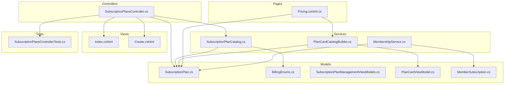
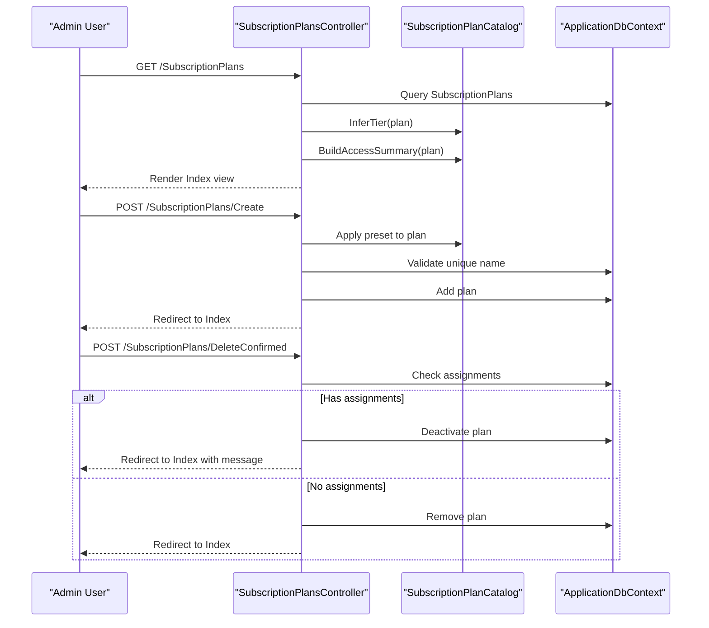
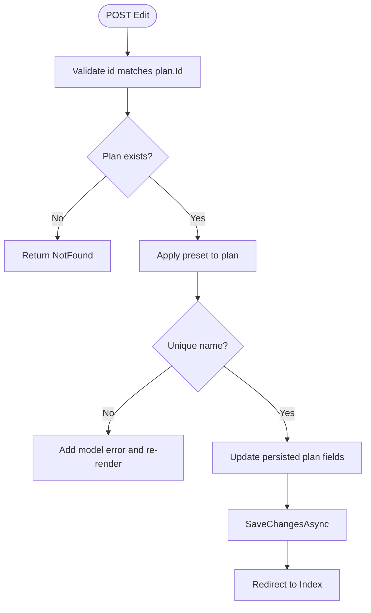
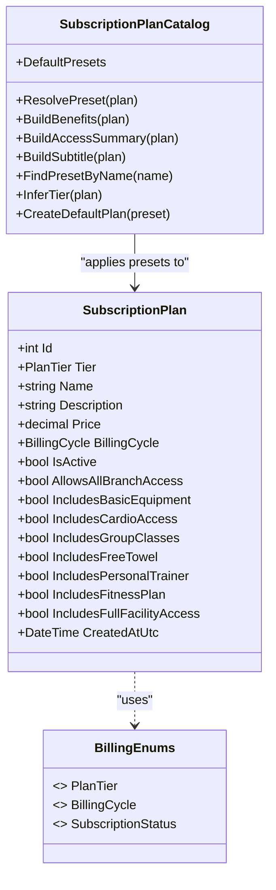
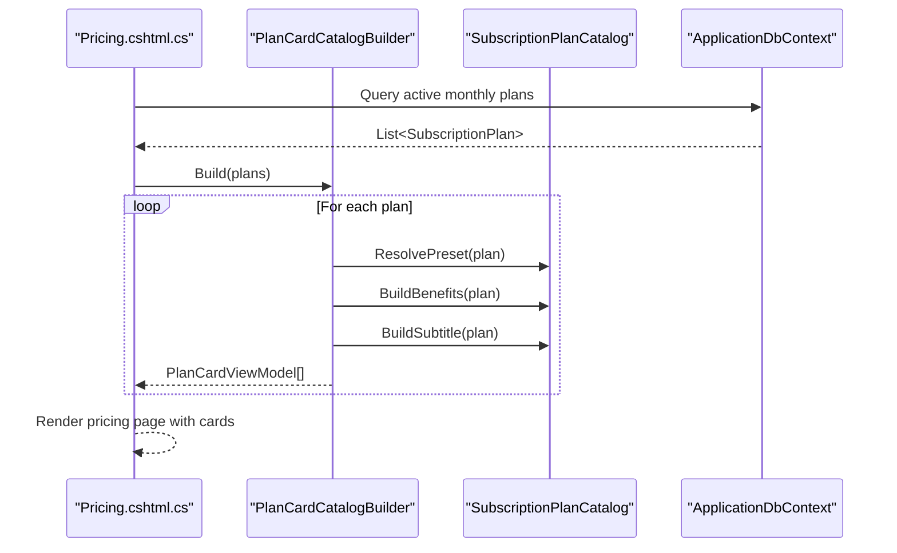
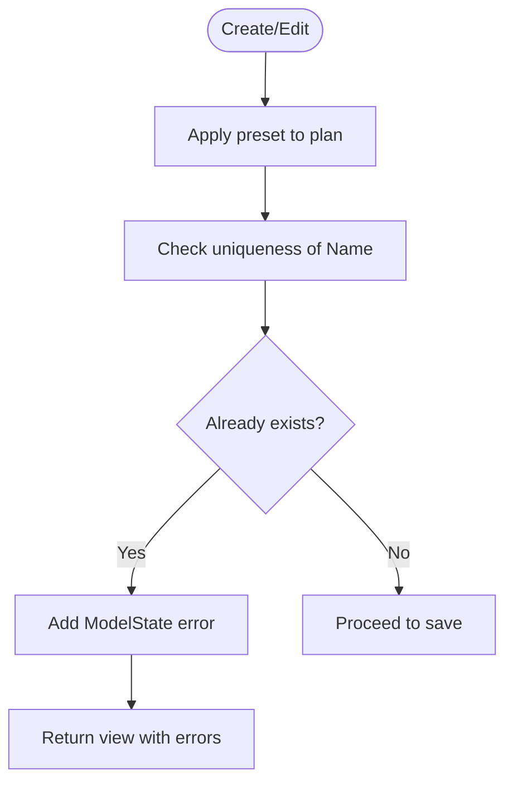
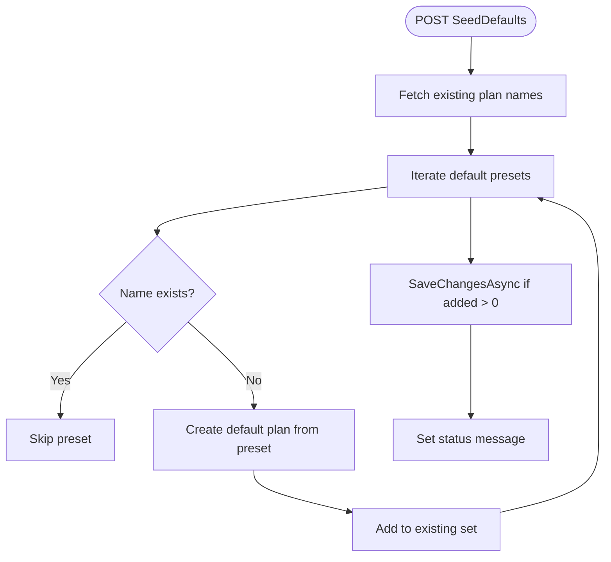
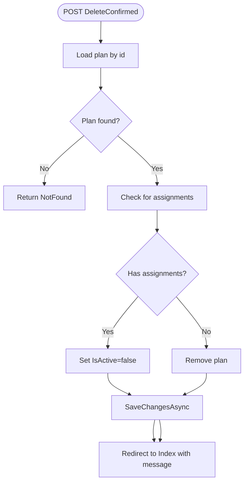
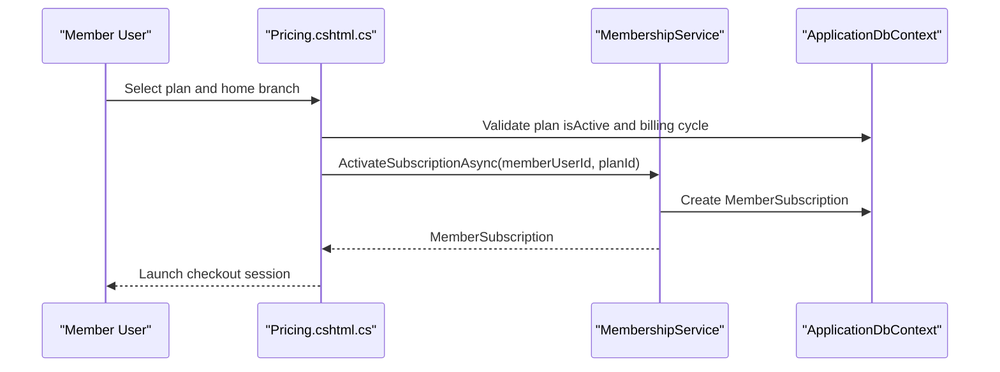
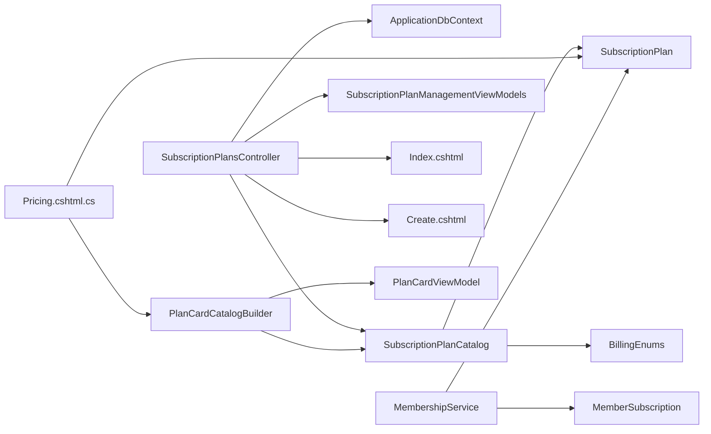

# Subscription Plans Management

<cite>
**Referenced Files in This Document**
- [SubscriptionPlansController.cs](file://Controllers/SubscriptionPlansController.cs)
- [SubscriptionPlan.cs](file://Models/Billing/SubscriptionPlan.cs)
- [SubscriptionPlanCatalog.cs](file://Services/Memberships/SubscriptionPlanCatalog.cs)
- [PlanCardCatalogBuilder.cs](file://Services/Memberships/PlanCardCatalogBuilder.cs)
- [BillingEnums.cs](file://Models/Billing/BillingEnums.cs)
- [PlanCardViewModel.cs](file://Models/Public/PlanCardViewModel.cs)
- [SubscriptionPlanManagementViewModels.cs](file://Models/Admin/SubscriptionPlanManagementViewModels.cs)
- [Index.cshtml](file://Views/SubscriptionPlans/Index.cshtml)
- [Create.cshtml](file://Views/SubscriptionPlans/Create.cshtml)
- [SubscriptionPlansControllerTests.cs](file://EJCFitnessGym.Tests/SubscriptionPlansControllerTests.cs)
- [Pricing.cshtml.cs](file://Pages/Public/Pricing.cshtml.cs)
- [MembershipService.cs](file://Services/Memberships/MembershipService.cs)
- [MemberSubscription.cs](file://Models/Billing/MemberSubscription.cs)
</cite>

## Table of Contents
1. [Introduction](#introduction)
2. [Project Structure](#project-structure)
3. [Core Components](#core-components)
4. [Architecture Overview](#architecture-overview)
5. [Detailed Component Analysis](#detailed-component-analysis)
6. [Dependency Analysis](#dependency-analysis)
7. [Performance Considerations](#performance-considerations)
8. [Troubleshooting Guide](#troubleshooting-guide)
9. [Conclusion](#conclusion)

## Introduction
This document provides comprehensive coverage of the subscription plans management functionality. It explains CRUD operations for subscription plans, the plan tier system (Basic, Silver, Gold, Platinum), plan preset catalog, plan validation rules, duplicate name prevention, and seed defaults. It also documents how plans integrate with branch access controls and membership entitlements, and how plan catalogs are built for the public pricing page.

## Project Structure
The subscription plans feature spans controllers, models, services, views, and tests:

- Controllers: manage CRUD operations and seeding
- Models: define plan entity, enums, and view models
- Services: provide plan catalog, preset resolution, and plan card building
- Views: admin UI for managing plans and public pricing page
- Tests: validate deletion behavior, seeding, and edit preservation

**Diagram sources**
- [SubscriptionPlansController.cs:1-290](file://Controllers/SubscriptionPlansController.cs#L1-L290)
- [SubscriptionPlan.cs:1-53](file://Models/Billing/SubscriptionPlan.cs#L1-L53)
- [SubscriptionPlanCatalog.cs:1-200](file://Services/Memberships/SubscriptionPlanCatalog.cs#L1-L200)
- [PlanCardCatalogBuilder.cs:1-48](file://Services/Memberships/PlanCardCatalogBuilder.cs#L1-L48)
- [BillingEnums.cs:1-51](file://Models/Billing/BillingEnums.cs#L1-L51)
- [PlanCardViewModel.cs:1-17](file://Models/Public/PlanCardViewModel.cs#L1-L17)
- [SubscriptionPlanManagementViewModels.cs:1-28](file://Models/Admin/SubscriptionPlanManagementViewModels.cs#L1-L28)
- [Index.cshtml:1-92](file://Views/SubscriptionPlans/Index.cshtml#L1-L92)
- [Create.cshtml:1-62](file://Views/SubscriptionPlans/Create.cshtml#L1-L62)
- [SubscriptionPlansControllerTests.cs:1-255](file://EJCFitnessGym.Tests/SubscriptionPlansControllerTests.cs#L1-L255)
- [Pricing.cshtml.cs:1-1025](file://Pages/Public/Pricing.cshtml.cs#L1-L1025)
- [MembershipService.cs:1-597](file://Services/Memberships/MembershipService.cs#L1-L597)
- [MemberSubscription.cs:1-30](file://Models/Billing/MemberSubscription.cs#L1-L30)

**Section sources**
- [SubscriptionPlansController.cs:1-290](file://Controllers/SubscriptionPlansController.cs#L1-L290)
- [SubscriptionPlan.cs:1-53](file://Models/Billing/SubscriptionPlan.cs#L1-L53)
- [SubscriptionPlanCatalog.cs:1-200](file://Services/Memberships/SubscriptionPlanCatalog.cs#L1-L200)
- [PlanCardCatalogBuilder.cs:1-48](file://Services/Memberships/PlanCardCatalogBuilder.cs#L1-L48)
- [BillingEnums.cs:1-51](file://Models/Billing/BillingEnums.cs#L1-L51)
- [PlanCardViewModel.cs:1-17](file://Models/Public/PlanCardViewModel.cs#L1-L17)
- [SubscriptionPlanManagementViewModels.cs:1-28](file://Models/Admin/SubscriptionPlanManagementViewModels.cs#L1-L28)
- [Index.cshtml:1-92](file://Views/SubscriptionPlans/Index.cshtml#L1-L92)
- [Create.cshtml:1-62](file://Views/SubscriptionPlans/Create.cshtml#L1-L62)
- [SubscriptionPlansControllerTests.cs:1-255](file://EJCFitnessGym.Tests/SubscriptionPlansControllerTests.cs#L1-L255)
- [Pricing.cshtml.cs:1-1025](file://Pages/Public/Pricing.cshtml.cs#L1-L1025)
- [MembershipService.cs:1-597](file://Services/Memberships/MembershipService.cs#L1-L597)
- [MemberSubscription.cs:1-30](file://Models/Billing/MemberSubscription.cs#L1-L30)

## Core Components
- SubscriptionPlan model defines plan attributes, including tier, name, price, billing cycle, activity status, and benefit flags.
- SubscriptionPlanCatalog provides default presets, preset resolution, benefit computation, access summary, subtitle derivation, tier inference, and default plan creation.
- PlanCardCatalogBuilder transforms active plans into public plan cards with tier badges and featured highlighting.
- SubscriptionPlansController orchestrates CRUD operations, applies preset rules, enforces duplicate name validation, handles deletion with safety checks, and seeds default plans.
- Pricing page integrates with plan catalog builder to render the public pricing page with plan cards.
- MembershipService ties plans to member subscriptions and lifecycle maintenance.

**Section sources**
- [SubscriptionPlan.cs:1-53](file://Models/Billing/SubscriptionPlan.cs#L1-L53)
- [SubscriptionPlanCatalog.cs:1-200](file://Services/Memberships/SubscriptionPlanCatalog.cs#L1-L200)
- [PlanCardCatalogBuilder.cs:1-48](file://Services/Memberships/PlanCardCatalogBuilder.cs#L1-L48)
- [SubscriptionPlansController.cs:1-290](file://Controllers/SubscriptionPlansController.cs#L1-L290)
- [Pricing.cshtml.cs:1-1025](file://Pages/Public/Pricing.cshtml.cs#L1-L1025)
- [MembershipService.cs:1-597](file://Services/Memberships/MembershipService.cs#L1-L597)

## Architecture Overview
The system separates concerns across controllers, services, and models. The controller delegates plan catalog operations to services and renders views. The public pricing page consumes the same catalog services to build plan cards.

**Diagram sources**
- [SubscriptionPlansController.cs:21-256](file://Controllers/SubscriptionPlansController.cs#L21-L256)
- [SubscriptionPlanCatalog.cs:50-183](file://Services/Memberships/SubscriptionPlanCatalog.cs#L50-L183)

**Section sources**
- [SubscriptionPlansController.cs:21-256](file://Controllers/SubscriptionPlansController.cs#L21-L256)
- [SubscriptionPlanCatalog.cs:50-183](file://Services/Memberships/SubscriptionPlanCatalog.cs#L50-L183)

## Detailed Component Analysis

### Subscription Plans CRUD Operations
- Index: Lists plans with assignment totals and active counts, infers tier, and builds access summaries.
- Create: Seeds a default plan based on Basic tier preset and renders the form.
- Edit: Applies preset rules, validates unique name (excluding current plan), updates attributes, and preserves creation timestamps.
- Details: Displays benefits computed from plan and preset.
- Delete: Checks for existing assignments; if present, deactivates instead of deleting; otherwise removes the plan.
- Seed Defaults: Adds default presets if names do not already exist, respecting special casing for Basic.

**Diagram sources**
- [SubscriptionPlansController.cs:97-153](file://Controllers/SubscriptionPlansController.cs#L97-L153)

**Section sources**
- [SubscriptionPlansController.cs:21-256](file://Controllers/SubscriptionPlansController.cs#L21-L256)
- [SubscriptionPlansControllerTests.cs:165-208](file://EJCFitnessGym.Tests/SubscriptionPlansControllerTests.cs#L165-L208)

### Plan Tier System and Preset Application
- Tiers: Basic, Pro, Elite.
- Preset application: When saving, the controller applies preset values for name, description, and benefit flags based on selected tier.
- Tier inference: Determines tier from plan attributes or name heuristics.
- Benefit computation: Builds human-readable benefits list from plan and preset.
- Access summary: Truncates benefits to three items for compact display.

**Diagram sources**
- [SubscriptionPlan.cs:1-53](file://Models/Billing/SubscriptionPlan.cs#L1-L53)
- [SubscriptionPlanCatalog.cs:1-200](file://Services/Memberships/SubscriptionPlanCatalog.cs#L1-L200)
- [BillingEnums.cs:1-51](file://Models/Billing/BillingEnums.cs#L1-L51)

**Section sources**
- [SubscriptionPlan.cs:1-53](file://Models/Billing/SubscriptionPlan.cs#L1-L53)
- [SubscriptionPlanCatalog.cs:50-183](file://Services/Memberships/SubscriptionPlanCatalog.cs#L50-L183)
- [BillingEnums.cs:1-51](file://Models/Billing/BillingEnums.cs#L1-L51)

### Plan Catalog Builder for Public Pricing
- Builds plan cards from active plans, resolving presets and computing benefits.
- Highlights a featured plan (Pro) or falls back to a recommended plan if none is marked.
- Uses tier badges ("Most Popular", "Full Access", "Recommended").

**Diagram sources**
- [Pricing.cshtml.cs:75-85](file://Pages/Public/Pricing.cshtml.cs#L75-L85)
- [PlanCardCatalogBuilder.cs:8-45](file://Services/Memberships/PlanCardCatalogBuilder.cs#L8-L45)
- [SubscriptionPlanCatalog.cs:50-114](file://Services/Memberships/SubscriptionPlanCatalog.cs#L50-L114)

**Section sources**
- [PlanCardCatalogBuilder.cs:1-48](file://Services/Memberships/PlanCardCatalogBuilder.cs#L1-L48)
- [Pricing.cshtml.cs:75-85](file://Pages/Public/Pricing.cshtml.cs#L75-L85)
- [SubscriptionPlanCatalog.cs:50-114](file://Services/Memberships/SubscriptionPlanCatalog.cs#L50-L114)

### Validation Rules and Duplicate Prevention
- Unique name validation: Ensures plan names are unique across records, excluding the current plan during edits.
- Anti-forgery protection: All mutation actions use anti-forgery tokens.
- Required fields: Name length limits and price range constraints enforced by model annotations.

**Diagram sources**
- [SubscriptionPlansController.cs:74-133](file://Controllers/SubscriptionPlansController.cs#L74-L133)
- [SubscriptionPlan.cs:12-20](file://Models/Billing/SubscriptionPlan.cs#L12-L20)

**Section sources**
- [SubscriptionPlansController.cs:74-133](file://Controllers/SubscriptionPlansController.cs#L74-L133)
- [SubscriptionPlan.cs:12-20](file://Models/Billing/SubscriptionPlan.cs#L12-L20)

### Seed Defaults Functionality
- Seeds default plans (Basic, Pro, Elite) if they do not exist.
- Handles special-case naming for Basic ("Starter").
- Prevents duplicates and reports added count.

**Diagram sources**
- [SubscriptionPlansController.cs:217-256](file://Controllers/SubscriptionPlansController.cs#L217-L256)
- [SubscriptionPlanCatalog.cs:7-48](file://Services/Memberships/SubscriptionPlanCatalog.cs#L7-L48)

**Section sources**
- [SubscriptionPlansController.cs:217-256](file://Controllers/SubscriptionPlansController.cs#L217-L256)
- [SubscriptionPlanCatalog.cs:7-48](file://Services/Memberships/SubscriptionPlanCatalog.cs#L7-L48)

### Deletion Safety and Business Logic
- If a plan has active or historical assignments, it is deactivated instead of deleted.
- Otherwise, the plan is removed from the database.
- Tests confirm deactivation vs. removal behavior.

**Diagram sources**
- [SubscriptionPlansController.cs:167-213](file://Controllers/SubscriptionPlansController.cs#L167-L213)
- [SubscriptionPlansControllerTests.cs:14-53](file://EJCFitnessGym.Tests/SubscriptionPlansControllerTests.cs#L14-L53)

**Section sources**
- [SubscriptionPlansController.cs:167-213](file://Controllers/SubscriptionPlansController.cs#L167-L213)
- [SubscriptionPlansControllerTests.cs:14-81](file://EJCFitnessGym.Tests/SubscriptionPlansControllerTests.cs#L14-L81)

### Integration with Branch Access Controls and Membership Entitlements
- Branch access: All plans allow access to every active branch by default.
- Membership entitlements: Activation and lifecycle maintenance are handled by the membership service, which creates member subscriptions linked to a chosen plan and branch.
- Pricing page: Requires a home branch selection for authenticated members before checkout.

**Diagram sources**
- [Pricing.cshtml.cs:182-213](file://Pages/Public/Pricing.cshtml.cs#L182-L213)
- [MembershipService.cs:72-197](file://Services/Memberships/MembershipService.cs#L72-L197)
- [MemberSubscription.cs:1-30](file://Models/Billing/MemberSubscription.cs#L1-L30)

**Section sources**
- [Pricing.cshtml.cs:182-213](file://Pages/Public/Pricing.cshtml.cs#L182-L213)
- [MembershipService.cs:72-197](file://Services/Memberships/MembershipService.cs#L72-L197)
- [MemberSubscription.cs:1-30](file://Models/Billing/MemberSubscription.cs#L1-L30)

## Dependency Analysis
- Controller depends on ApplicationDbContext, SubscriptionPlanCatalog, and view models.
- SubscriptionPlanCatalog depends on SubscriptionPlan and BillingEnums.
- PlanCardCatalogBuilder depends on SubscriptionPlanCatalog and produces PlanCardViewModel.
- Pricing page depends on PlanCardCatalogBuilder and SubscriptionPlan.
- MembershipService depends on ApplicationDbContext and links MemberSubscription to SubscriptionPlan.

**Diagram sources**
- [SubscriptionPlansController.cs:1-290](file://Controllers/SubscriptionPlansController.cs#L1-L290)
- [SubscriptionPlanCatalog.cs:1-200](file://Services/Memberships/SubscriptionPlanCatalog.cs#L1-L200)
- [PlanCardCatalogBuilder.cs:1-48](file://Services/Memberships/PlanCardCatalogBuilder.cs#L1-L48)
- [Pricing.cshtml.cs:1-1025](file://Pages/Public/Pricing.cshtml.cs#L1-L1025)
- [MembershipService.cs:1-597](file://Services/Memberships/MembershipService.cs#L1-L597)
- [SubscriptionPlanManagementViewModels.cs:1-28](file://Models/Admin/SubscriptionPlanManagementViewModels.cs#L1-L28)
- [PlanCardViewModel.cs:1-17](file://Models/Public/PlanCardViewModel.cs#L1-L17)
- [SubscriptionPlan.cs:1-53](file://Models/Billing/SubscriptionPlan.cs#L1-L53)
- [MemberSubscription.cs:1-30](file://Models/Billing/MemberSubscription.cs#L1-L30)
- [BillingEnums.cs:1-51](file://Models/Billing/BillingEnums.cs#L1-L51)

**Section sources**
- [SubscriptionPlansController.cs:1-290](file://Controllers/SubscriptionPlansController.cs#L1-L290)
- [SubscriptionPlanCatalog.cs:1-200](file://Services/Memberships/SubscriptionPlanCatalog.cs#L1-L200)
- [PlanCardCatalogBuilder.cs:1-48](file://Services/Memberships/PlanCardCatalogBuilder.cs#L1-L48)
- [Pricing.cshtml.cs:1-1025](file://Pages/Public/Pricing.cshtml.cs#L1-L1025)
- [MembershipService.cs:1-597](file://Services/Memberships/MembershipService.cs#L1-L597)

## Performance Considerations
- Index action performs grouped queries for assignment counts; ensure appropriate indexing on foreign keys for optimal performance.
- Seed defaults iterates presets and existing names; consider caching existing names for large datasets.
- Pricing page filters active monthly plans; ensure proper filtering and ordering for responsive rendering.

## Troubleshooting Guide
- Duplicate name error: Occurs when attempting to create or edit a plan with an existing name. Resolve by changing the plan name.
- Deletion blocked: If a plan has assignments, it will be deactivated instead of deleted. Verify assignment history and reactivate if needed.
- Seed defaults message: Indicates whether defaults were added or already existed.
- Edit preserves createdAtUtc: Ensure that creation timestamps remain unchanged after edits.

**Section sources**
- [SubscriptionPlansController.cs:80-83](file://Controllers/SubscriptionPlansController.cs#L80-L83)
- [SubscriptionPlansController.cs:196-206](file://Controllers/SubscriptionPlansController.cs#L196-L206)
- [SubscriptionPlansController.cs:245-253](file://Controllers/SubscriptionPlansController.cs#L245-L253)
- [SubscriptionPlansControllerTests.cs:165-208](file://EJCFitnessGym.Tests/SubscriptionPlansControllerTests.cs#L165-L208)

## Conclusion
The subscription plans management feature provides a robust foundation for defining, customizing, and publishing membership tiers. It enforces naming uniqueness, applies preset-driven benefit configurations, and ensures safe deletion practices. The plan catalog builder enables dynamic generation of public pricing cards, while integration with membership services supports branch-scoped access and lifecycle management.