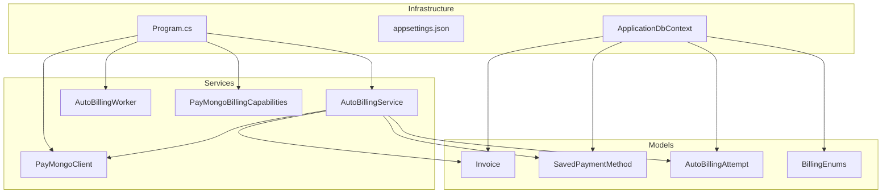
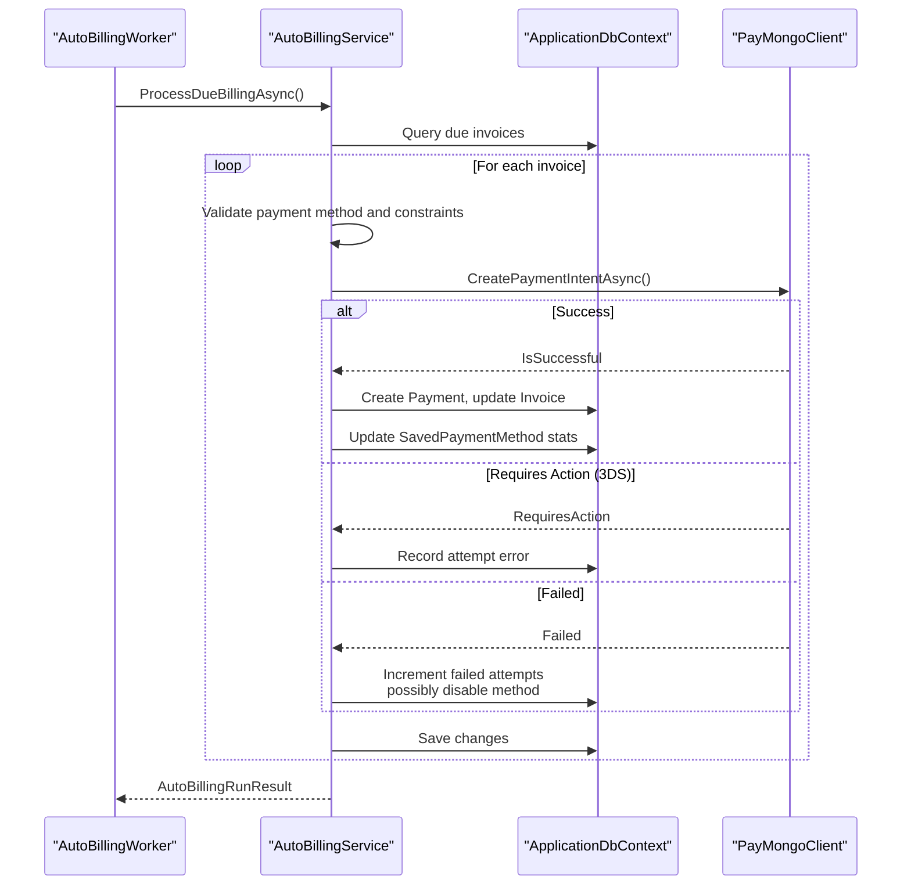
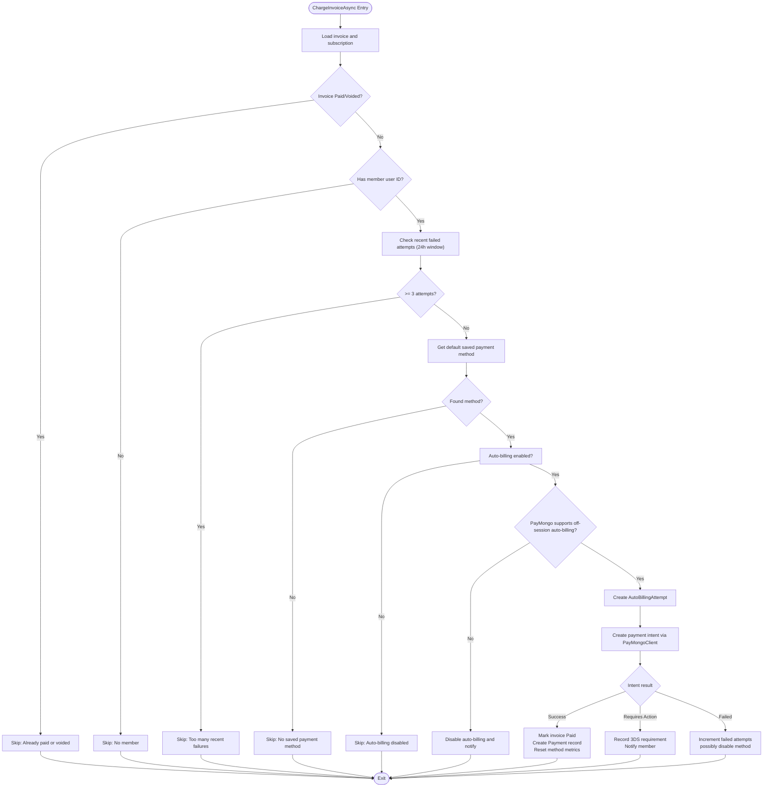
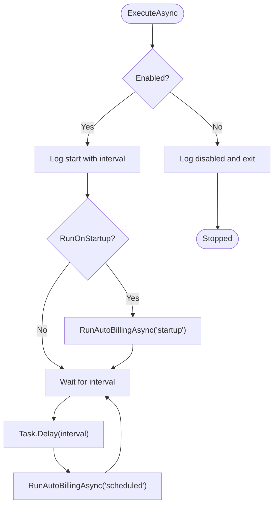
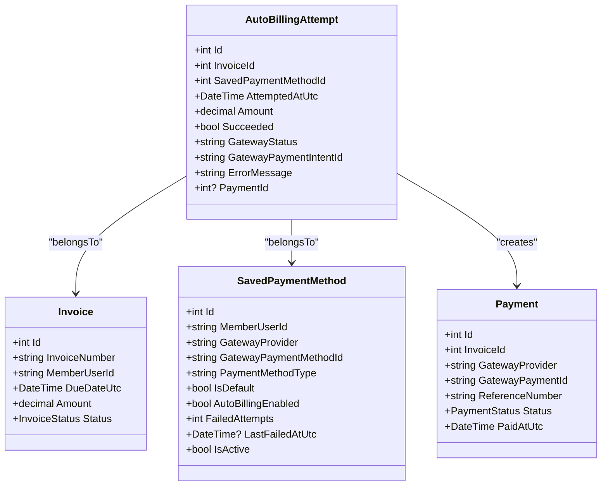
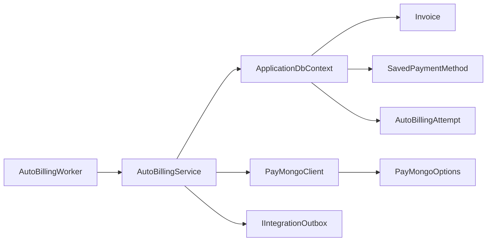
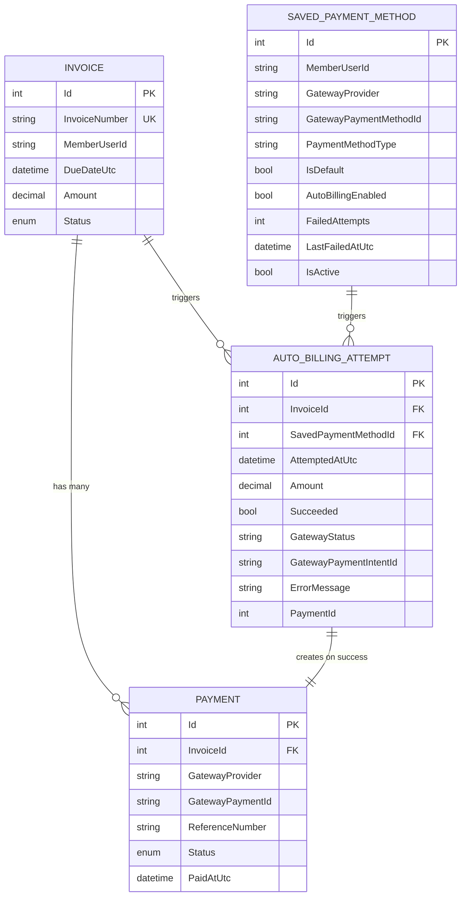

# Automated Billing System

<cite>
**Referenced Files in This Document**
- [AutoBillingService.cs](file://Services/Payments/AutoBillingService.cs)
- [AutoBillingWorker.cs](file://Services/Payments/AutoBillingWorker.cs)
- [AutoBillingAttempt.cs](file://Models/Billing/AutoBillingAttempt.cs)
- [BillingEnums.cs](file://Models/Billing/BillingEnums.cs)
- [Invoice.cs](file://Models/Billing/Invoice.cs)
- [SavedPaymentMethod.cs](file://Models/Billing/SavedPaymentMethod.cs)
- [PayMongoClient.cs](file://Services/Payments/PayMongoClient.cs)
- [PayMongoBillingCapabilities.cs](file://Services/Payments/PayMongoBillingCapabilities.cs)
- [PayMongoOptions.cs](file://Services/Payments/PayMongoOptions.cs)
- [Program.cs](file://Program.cs)
- [appsettings.json](file://appsettings.json)
- [AutoBillingServiceTests.cs](file://EJCFitnessGym.Tests/AutoBillingServiceTests.cs)
- [ApplicationDbContext.cs](file://Data/ApplicationDbContext.cs)
</cite>

## Table of Contents
1. [Introduction](#introduction)
2. [Project Structure](#project-structure)
3. [Core Components](#core-components)
4. [Architecture Overview](#architecture-overview)
5. [Detailed Component Analysis](#detailed-component-analysis)
6. [Dependency Analysis](#dependency-analysis)
7. [Performance Considerations](#performance-considerations)
8. [Troubleshooting Guide](#troubleshooting-guide)
9. [Conclusion](#conclusion)
10. [Appendices](#appendices)

## Introduction
This document describes the automated billing system responsible for recurring payments and subscription renewals. It covers the AutoBillingService implementation, the AutoBillingWorker background service, billing attempt tracking, retry logic, payment method validation, and integration with subscription lifecycle management and member account updates. Edge cases such as insufficient funds, expired cards, and payment method changes during billing cycles are addressed alongside configuration options for retry policies, grace periods, and notification thresholds.

## Project Structure
The automated billing system spans several layers:
- Services: AutoBillingService orchestrates billing operations; AutoBillingWorker schedules periodic runs; PayMongoClient integrates with the PayMongo gateway; PayMongoBillingCapabilities defines supported features.
- Models: Invoice, SavedPaymentMethod, AutoBillingAttempt, and enums define the domain entities and statuses.
- Infrastructure: Program.cs registers services and hosted workers; appsettings.json configures runtime behavior.

**Diagram sources**
- [Program.cs:362-374](file://Program.cs#L362-L374)
- [AutoBillingService.cs:44-463](file://Services/Payments/AutoBillingService.cs#L44-L463)
- [AutoBillingWorker.cs:34-121](file://Services/Payments/AutoBillingWorker.cs#L34-L121)
- [PayMongoClient.cs:13-596](file://Services/Payments/PayMongoClient.cs#L13-L596)
- [PayMongoBillingCapabilities.cs:3-16](file://Services/Payments/PayMongoBillingCapabilities.cs#L3-L16)
- [Invoice.cs:5-39](file://Models/Billing/Invoice.cs#L5-L39)
- [SavedPaymentMethod.cs:8-88](file://Models/Billing/SavedPaymentMethod.cs#L8-L88)
- [AutoBillingAttempt.cs:8-66](file://Models/Billing/AutoBillingAttempt.cs#L8-L66)
- [BillingEnums.cs:1-51](file://Models/Billing/BillingEnums.cs#L1-L51)
- [ApplicationDbContext.cs:19-42](file://Data/ApplicationDbContext.cs#L19-L42)

**Section sources**
- [Program.cs:362-374](file://Program.cs#L362-L374)
- [appsettings.json:101-107](file://appsettings.json#L101-L107)

## Core Components
- AutoBillingService: Implements scheduled billing attempts, retry logic, payment method validation, and audit logging via AutoBillingAttempt. It interacts with PayMongoClient to create payment intents and updates domain entities accordingly.
- AutoBillingWorker: Background service that periodically triggers AutoBillingService runs with configurable intervals and startup behavior.
- PayMongoClient: Encapsulates PayMongo API interactions for payment intents and status checks.
- PayMongoBillingCapabilities: Defines feature support and messaging for off-session auto-billing limitations.
- Domain Models: Invoice, SavedPaymentMethod, AutoBillingAttempt, and enums govern statuses and transitions.

**Section sources**
- [AutoBillingService.cs:44-463](file://Services/Payments/AutoBillingService.cs#L44-L463)
- [AutoBillingWorker.cs:34-121](file://Services/Payments/AutoBillingWorker.cs#L34-L121)
- [PayMongoClient.cs:13-596](file://Services/Payments/PayMongoClient.cs#L13-L596)
- [PayMongoBillingCapabilities.cs:3-16](file://Services/Payments/PayMongoBillingCapabilities.cs#L3-L16)
- [Invoice.cs:5-39](file://Models/Billing/Invoice.cs#L5-L39)
- [SavedPaymentMethod.cs:8-88](file://Models/Billing/SavedPaymentMethod.cs#L8-L88)
- [AutoBillingAttempt.cs:8-66](file://Models/Billing/AutoBillingAttempt.cs#L8-L66)
- [BillingEnums.cs:1-51](file://Models/Billing/BillingEnums.cs#L1-L51)

## Architecture Overview
The system operates as follows:
- AutoBillingWorker periodically invokes AutoBillingService.
- AutoBillingService identifies due invoices, validates payment methods, creates payment intents via PayMongoClient, and records outcomes in AutoBillingAttempt.
- Successful payments update Invoice status to Paid and create Payment records.
- Failure outcomes increment SavedPaymentMethod failed attempts and may disable auto-billing.
- Notifications are enqueued through the integration outbox for user events.

**Diagram sources**
- [AutoBillingWorker.cs:84-119](file://Services/Payments/AutoBillingWorker.cs#L84-L119)
- [AutoBillingService.cs:69-124](file://Services/Payments/AutoBillingService.cs#L69-L124)
- [AutoBillingService.cs:126-377](file://Services/Payments/AutoBillingService.cs#L126-L377)
- [PayMongoClient.cs:137-245](file://Services/Payments/PayMongoClient.cs#L137-L245)

## Detailed Component Analysis

### AutoBillingService
Responsibilities:
- Scheduled billing: Identifies unpaid/overdue invoices past a grace threshold and processes up to a batch size.
- Retry gating: Prevents excessive retries within a rolling window.
- Payment method validation: Selects default PayMongo method, verifies capability, and respects user-configured auto-billing flags.
- Payment intent orchestration: Uses PayMongoClient to create and attach payment methods to payment intents.
- Outcome handling: Updates invoice status, records payments, increments/decrements payment method metrics, and enqueues notifications.
- Audit logging: Persists AutoBillingAttempt entries with gateway status and errors.

Key behaviors:
- Grace period: Invoices must be past due by a defined number of hours before charging.
- Max retry attempts: Disables a payment method after a fixed number of consecutive failures.
- Capability checks: If off-session auto-billing is unsupported, disables auto-billing for the method and notifies the user.
- 3D Secure handling: If action is required, marks the attempt and notifies the member to complete payment manually.

**Diagram sources**
- [AutoBillingService.cs:126-377](file://Services/Payments/AutoBillingService.cs#L126-L377)
- [AutoBillingService.cs:51-56](file://Services/Payments/AutoBillingService.cs#L51-L56)
- [PayMongoBillingCapabilities.cs:3-16](file://Services/Payments/PayMongoBillingCapabilities.cs#L3-L16)
- [PayMongoClient.cs:137-245](file://Services/Payments/PayMongoClient.cs#L137-L245)

**Section sources**
- [AutoBillingService.cs:44-463](file://Services/Payments/AutoBillingService.cs#L44-L463)
- [AutoBillingService.cs:51-56](file://Services/Payments/AutoBillingService.cs#L51-L56)
- [AutoBillingService.cs:148-160](file://Services/Payments/AutoBillingService.cs#L148-L160)
- [AutoBillingService.cs:205-208](file://Services/Payments/AutoBillingService.cs#L205-L208)
- [AutoBillingService.cs:225-377](file://Services/Payments/AutoBillingService.cs#L225-L377)

### AutoBillingWorker
Responsibilities:
- Periodic execution: Runs AutoBillingService at configured intervals with bounds checking.
- Startup behavior: Optionally runs on startup.
- Error handling: Catches exceptions and logs failures without stopping the worker.
- Scope management: Creates a service scope per run to resolve IAutoBillingService.

Configuration:
- Enabled: Enables or disables the worker.
- IntervalMinutes: Minimum interval is clamped to a sensible range.
- RunOnStartup: Executes a run immediately on startup if enabled.
- PreferredHourUtc: Reserved for future prioritization logic.
- MaxInvoicesPerRun: Batch size limit enforced in service logic.

**Diagram sources**
- [AutoBillingWorker.cs:50-82](file://Services/Payments/AutoBillingWorker.cs#L50-L82)
- [AutoBillingWorker.cs:84-119](file://Services/Payments/AutoBillingWorker.cs#L84-L119)

**Section sources**
- [AutoBillingWorker.cs:34-121](file://Services/Payments/AutoBillingWorker.cs#L34-L121)
- [appsettings.json:101-107](file://appsettings.json#L101-L107)

### Billing Attempt Tracking (AutoBillingAttempt)
Purpose:
- Records each auto-billing attempt with outcome, gateway status, and error messages.
- Links to Invoice and SavedPaymentMethod for auditability.
- Supports post-mortem analysis and retry decisions.

Fields:
- AttemptedAtUtc, Amount, Succeeded, GatewayStatus, GatewayPaymentIntentId, ErrorMessage, PaymentId.
- Navigation properties to Invoice, SavedPaymentMethod, and Payment.

**Diagram sources**
- [AutoBillingAttempt.cs:8-66](file://Models/Billing/AutoBillingAttempt.cs#L8-L66)
- [Invoice.cs:5-39](file://Models/Billing/Invoice.cs#L5-L39)
- [SavedPaymentMethod.cs:8-88](file://Models/Billing/SavedPaymentMethod.cs#L8-L88)
- [ApplicationDbContext.cs:40-41](file://Data/ApplicationDbContext.cs#L40-L41)

**Section sources**
- [AutoBillingAttempt.cs:8-66](file://Models/Billing/AutoBillingAttempt.cs#L8-L66)
- [ApplicationDbContext.cs:40-41](file://Data/ApplicationDbContext.cs#L40-L41)

### Payment Method Validation and Retry Logic
- Validation:
  - Default method selection prioritizes default methods and recent usage.
  - Capability check: If off-session auto-billing is unsupported, auto-billing is disabled for the method and a notification is queued.
  - Auto-billing flag: Explicitly disabled methods are skipped.
- Retry gating:
  - Limits retries to a maximum within a rolling 24-hour window.
- Failure handling:
  - Increments FailedAttempts and records LastFailedAtUtc.
  - Disables the method and auto-billing after reaching the max failure threshold.
  - Notifies the member of failure and suggests manual payment.

**Section sources**
- [AutoBillingService.cs:162-209](file://Services/Payments/AutoBillingService.cs#L162-L209)
- [AutoBillingService.cs:148-160](file://Services/Payments/AutoBillingService.cs#L148-L160)
- [AutoBillingService.cs:330-340](file://Services/Payments/AutoBillingService.cs#L330-L340)
- [SavedPaymentMethod.cs:74-85](file://Models/Billing/SavedPaymentMethod.cs#L74-L85)

### Integration with Subscription Lifecycle Management and Member Accounts
- Invoice updates: Successful auto-charging sets Invoice status to Paid and creates Payment records.
- Payment method updates: On success, resets failed attempts and updates last-used timestamps; on failure, increments attempts and possibly deactivates the method.
- Notifications: Integration outbox enqueues user events for successes, failures, and required actions.
- Edge case handling:
  - Insufficient funds/expired cards: Treated as failures; retry gating and eventual disabling.
  - Payment method changes: New default methods become eligible for subsequent billing cycles.

**Section sources**
- [AutoBillingService.cs:248-271](file://Services/Payments/AutoBillingService.cs#L248-L271)
- [AutoBillingService.cs:330-340](file://Services/Payments/AutoBillingService.cs#L330-L340)
- [AutoBillingService.cs:274-289](file://Services/Payments/AutoBillingService.cs#L274-L289)
- [AutoBillingService.cs:347-362](file://Services/Payments/AutoBillingService.cs#L347-L362)

### Configuration Options
Runtime configuration keys under the "AutoBilling" section:
- Enabled: Boolean to enable/disable the worker.
- IntervalMinutes: Run interval in minutes (clamped to a minimum bound).
- RunOnStartup: Boolean to run on startup.
- PreferredHourUtc: Reserved for future prioritization logic.
- MaxInvoicesPerRun: Batch size limit enforced in service logic.

PayMongo configuration keys under the "PayMongo" section:
- SecretKey, PublicKey, SuccessUrl, CancelUrl, WebhookSecret, RequireWebhookSignature, WebhookSignatureToleranceSeconds.

**Section sources**
- [appsettings.json:101-107](file://appsettings.json#L101-L107)
- [appsettings.json:37-44](file://appsettings.json#L37-L44)
- [AutoBillingWorker.cs:5-32](file://Services/Payments/AutoBillingWorker.cs#L5-L32)
- [PayMongoOptions.cs:3-12](file://Services/Payments/PayMongoOptions.cs#L3-L12)

## Dependency Analysis
- AutoBillingWorker depends on IOptionsMonitor<AutoBillingWorkerOptions> and IAutoBillingService.
- AutoBillingService depends on ApplicationDbContext, PayMongoClient, IIntegrationOutbox, and ILogger.
- PayMongoClient depends on HttpClient and PayMongoOptions.
- Domain models are registered in ApplicationDbContext with appropriate indices and relationships.

**Diagram sources**
- [AutoBillingWorker.cs:34-121](file://Services/Payments/AutoBillingWorker.cs#L34-L121)
- [AutoBillingService.cs:44-493](file://Services/Payments/AutoBillingService.cs#L44-L493)
- [PayMongoClient.cs:13-24](file://Services/Payments/PayMongoClient.cs#L13-L24)
- [PayMongoOptions.cs:3-12](file://Services/Payments/PayMongoOptions.cs#L3-L12)
- [ApplicationDbContext.cs:19-42](file://Data/ApplicationDbContext.cs#L19-L42)

**Section sources**
- [Program.cs:362-374](file://Program.cs#L362-L374)
- [ApplicationDbContext.cs:19-42](file://Data/ApplicationDbContext.cs#L19-L42)

## Performance Considerations
- Batching: The service limits the number of invoices processed per run to manage load.
- Retry gating: Prevents thrashing by limiting recent failed attempts within a window.
- Database indexing: Proper indexes on Invoice and Payment entities improve query performance for due invoice retrieval and payment lookups.
- HTTP client reuse: PayMongoClient leverages a shared HttpClient registered in Program.cs.

[No sources needed since this section provides general guidance]

## Troubleshooting Guide
Common issues and resolutions:
- Auto-billing disabled for PayMongo: When off-session auto-billing is unsupported, the service disables auto-billing for the method and enqueues a notification. Verify PayMongoBillingCapabilities and reconfigure if necessary.
- Too many recent failures: After exceeding the max retry attempts, the payment method is disabled. Review AutoBillingAttempt entries and advise the member to update their payment method.
- 3D Secure required: If the gateway requires 3D Secure authentication, the service records the requirement and notifies the member to complete payment manually.
- Exceptions during processing: The service catches exceptions, increments failed attempts, and rethrows to surface errors; check logs for detailed context.

**Section sources**
- [AutoBillingService.cs:175-203](file://Services/Payments/AutoBillingService.cs#L175-L203)
- [AutoBillingService.cs:157-160](file://Services/Payments/AutoBillingService.cs#L157-L160)
- [AutoBillingService.cs:325-325](file://Services/Payments/AutoBillingService.cs#L325-L325)
- [AutoBillingService.cs:367-376](file://Services/Payments/AutoBillingService.cs#L367-L376)
- [AutoBillingServiceTests.cs:14-62](file://EJCFitnessGym.Tests/AutoBillingServiceTests.cs#L14-L62)

## Conclusion
The automated billing system provides a robust framework for recurring payments with built-in retry logic, capability-aware behavior, and comprehensive audit trails. Its modular design enables easy configuration and extension, while integration with subscription lifecycle management ensures accurate invoice and payment state updates. Proper monitoring and alerting around AutoBillingAttempt and integration outbox metrics will help maintain system reliability and visibility.

[No sources needed since this section summarizes without analyzing specific files]

## Appendices

### Data Model Overview

**Diagram sources**
- [Invoice.cs:5-39](file://Models/Billing/Invoice.cs#L5-L39)
- [SavedPaymentMethod.cs:8-88](file://Models/Billing/SavedPaymentMethod.cs#L8-L88)
- [AutoBillingAttempt.cs:8-66](file://Models/Billing/AutoBillingAttempt.cs#L8-L66)
- [ApplicationDbContext.cs:19-42](file://Data/ApplicationDbContext.cs#L19-L42)