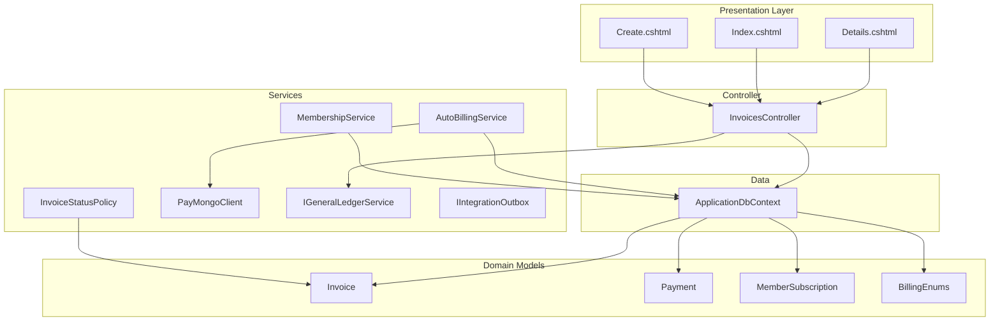
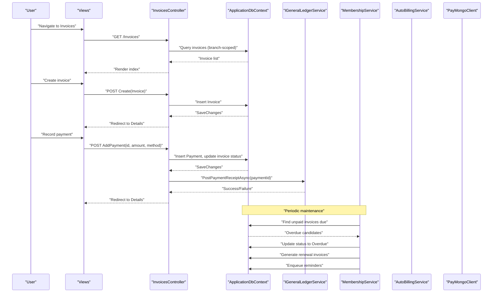
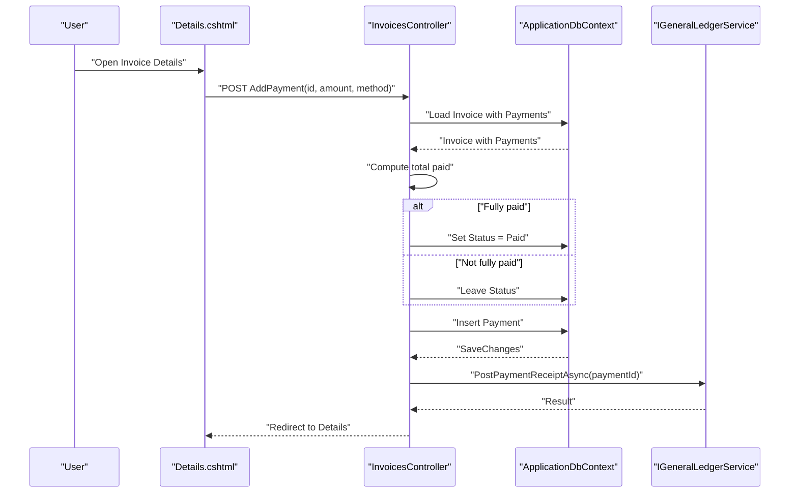
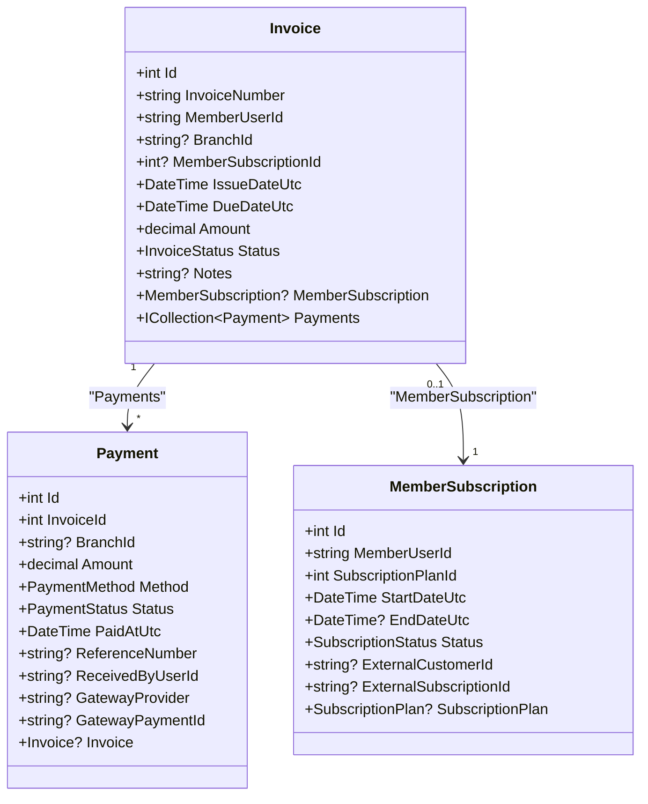
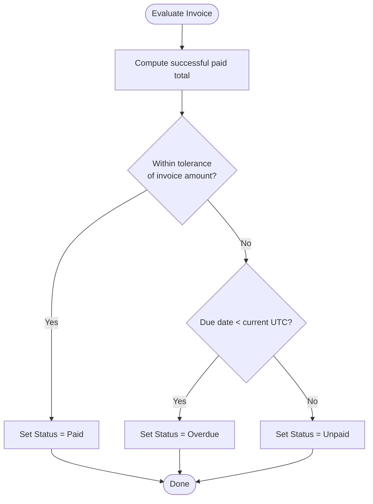
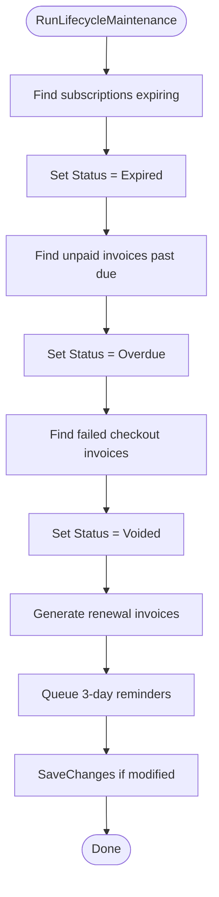
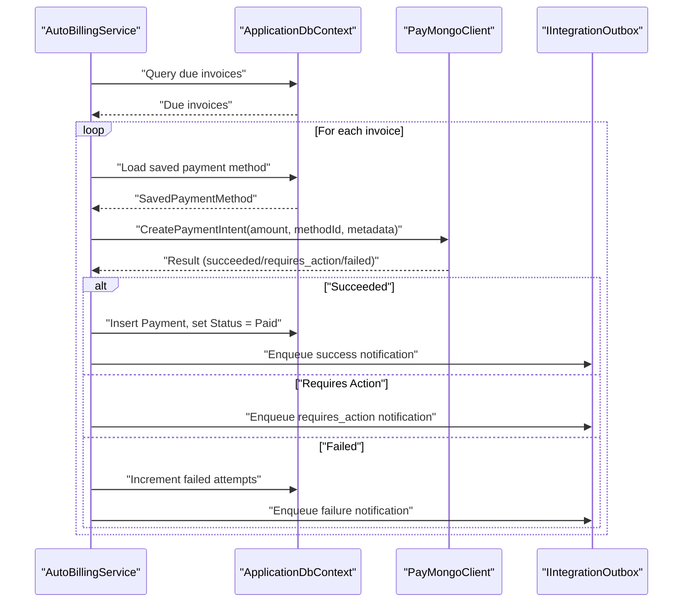
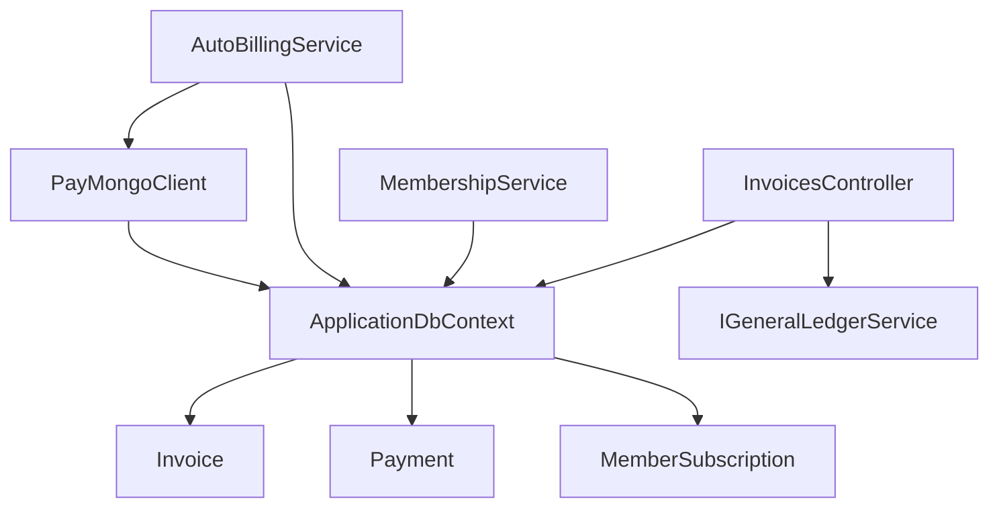

# Invoice Management

<cite>
**Referenced Files in This Document**
- [InvoicesController.cs](file://Controllers/InvoicesController.cs)
- [Invoice.cs](file://Models/Billing/Invoice.cs)
- [Payment.cs](file://Models/Billing/Payment.cs)
- [MemberSubscription.cs](file://Models/Billing/MemberSubscription.cs)
- [BillingEnums.cs](file://Models/Billing/BillingEnums.cs)
- [InvoiceStatusPolicy.cs](file://Services/Payments/InvoiceStatusPolicy.cs)
- [MembershipService.cs](file://Services/Memberships/MembershipService.cs)
- [AutoBillingService.cs](file://Services/Payments/AutoBillingService.cs)
- [PayMongoClient.cs](file://Services/Payments/PayMongoClient.cs)
- [ApplicationDbContext.cs](file://Data/ApplicationDbContext.cs)
- [Create.cshtml](file://Views/Invoices/Create.cshtml)
- [Index.cshtml](file://Views/Invoices/Index.cshtml)
- [Details.cshtml](file://Views/Invoices/Details.cshtml)
- [IGeneralLedgerService.cs](file://Services/Finance/IGeneralLedgerService.cs)
- [IIntegrationOutbox.cs](file://Services/Integration/IIntegrationOutbox.cs)
</cite>

## Table of Contents
1. [Introduction](#introduction)
2. [Project Structure](#project-structure)
3. [Core Components](#core-components)
4. [Architecture Overview](#architecture-overview)
5. [Detailed Component Analysis](#detailed-component-analysis)
6. [Dependency Analysis](#dependency-analysis)
7. [Performance Considerations](#performance-considerations)
8. [Troubleshooting Guide](#troubleshooting-guide)
9. [Conclusion](#conclusion)

## Introduction
This document describes the invoice management system for EJCFitnessGym, focusing on invoice creation, tracking, status updates, and integration with payment processing. It covers the InvoicesController implementation (including CRUD operations, bulk actions, and invoice generation workflows), the Invoice model and its relationships with payments and subscriptions, the InvoiceStatusPolicy governing status transitions, and the end-to-end payment collection pipeline using PayMongo. It also outlines reminders, overdue handling, and integration with general ledger and notifications.

## Project Structure
The invoice management system spans controllers, models, services, views, and database configuration:

- Controllers: InvoicesController handles user-facing invoice operations and manual payments.
- Models: Invoice, Payment, MemberSubscription define the core data structures and relationships.
- Services: MembershipService generates renewal invoices and sends reminders; AutoBillingService processes automatic charges; InvoiceStatusPolicy enforces status transitions; PayMongoClient integrates with the payment gateway; IGeneralLedgerService posts accounting entries; IIntegrationOutbox queues notifications.
- Views: Razor pages for listing, creating, and viewing invoices and recording payments.
- Data: ApplicationDbContext configures entity relationships and indexes.

**Diagram sources**
- [InvoicesController.cs:14-281](file://Controllers/InvoicesController.cs#L14-L281)
- [Invoice.cs:5-39](file://Models/Billing/Invoice.cs#L5-L39)
- [Payment.cs:5-38](file://Models/Billing/Payment.cs#L5-L38)
- [MemberSubscription.cs:5-30](file://Models/Billing/MemberSubscription.cs#L5-L30)
- [BillingEnums.cs:1-51](file://Models/Billing/BillingEnums.cs#L1-L51)
- [MembershipService.cs:1-597](file://Services/Memberships/MembershipService.cs#L1-L597)
- [AutoBillingService.cs:1-493](file://Services/Payments/AutoBillingService.cs#L1-L493)
- [InvoiceStatusPolicy.cs:5-58](file://Services/Payments/InvoiceStatusPolicy.cs#L5-L58)
- [PayMongoClient.cs:1-717](file://Services/Payments/PayMongoClient.cs#L1-L717)
- [IGeneralLedgerService.cs:5-45](file://Services/Finance/IGeneralLedgerService.cs#L5-L45)
- [IIntegrationOutbox.cs:3-26](file://Services/Integration/IIntegrationOutbox.cs#L3-L26)
- [ApplicationDbContext.cs:12-414](file://Data/ApplicationDbContext.cs#L12-L414)

**Section sources**
- [InvoicesController.cs:14-281](file://Controllers/InvoicesController.cs#L14-L281)
- [ApplicationDbContext.cs:12-414](file://Data/ApplicationDbContext.cs#L12-L414)

## Core Components
- InvoicesController: Provides listing, creation, details, and manual payment recording with branch-scoped access control.
- Invoice model: Represents invoices with amounts, dates, status, and relationships to payments and optional subscriptions.
- Payment model: Records payment transactions linked to invoices with method, status, and gateway identifiers.
- MembershipService: Generates renewal invoices, marks overdue invoices, voids failed checkout invoices, and sends reminders.
- AutoBillingService: Charges invoices automatically using saved payment methods, tracks attempts, and manages payment method failures.
- InvoiceStatusPolicy: Defines rules for determining fully paid, overdue, and voided states based on totals and timing.
- PayMongoClient: Integrates with PayMongo for payment intents, attaching payment methods, and status checks.
- General Ledger and Notifications: IGeneralLedgerService posts payment receipts; IIntegrationOutbox enqueues user/back-office notifications.

**Section sources**
- [InvoicesController.cs:14-281](file://Controllers/InvoicesController.cs#L14-L281)
- [Invoice.cs:5-39](file://Models/Billing/Invoice.cs#L5-L39)
- [Payment.cs:5-38](file://Models/Billing/Payment.cs#L5-L38)
- [MembershipService.cs:248-460](file://Services/Memberships/MembershipService.cs#L248-L460)
- [AutoBillingService.cs:69-124](file://Services/Payments/AutoBillingService.cs#L69-L124)
- [InvoiceStatusPolicy.cs:5-58](file://Services/Payments/InvoiceStatusPolicy.cs#L5-L58)
- [PayMongoClient.cs:137-245](file://Services/Payments/PayMongoClient.cs#L137-L245)
- [IGeneralLedgerService.cs:13-16](file://Services/Finance/IGeneralLedgerService.cs#L13-L16)
- [IIntegrationOutbox.cs:18-23](file://Services/Integration/IIntegrationOutbox.cs#L18-L23)

## Architecture Overview
The system follows a layered architecture:
- Presentation: MVC views for invoice management.
- Controller: InvoicesController orchestrates invoice operations and manual payments.
- Domain: Models encapsulate invoice, payment, and subscription entities.
- Services: Business logic for lifecycle maintenance, auto-billing, policy enforcement, and integrations.
- Data: Entity framework models and indexes for performance and referential integrity.

**Diagram sources**
- [InvoicesController.cs:34-190](file://Controllers/InvoicesController.cs#L34-L190)
- [MembershipService.cs:248-460](file://Services/Memberships/MembershipService.cs#L248-L460)
- [AutoBillingService.cs:69-124](file://Services/Payments/AutoBillingService.cs#L69-L124)
- [PayMongoClient.cs:137-245](file://Services/Payments/PayMongoClient.cs#L137-L245)
- [IGeneralLedgerService.cs:13-16](file://Services/Finance/IGeneralLedgerService.cs#L13-L16)
- [ApplicationDbContext.cs:12-414](file://Data/ApplicationDbContext.cs#L12-L414)

## Detailed Component Analysis

### InvoicesController
Responsibilities:
- Index: Lists invoices with optional status filter, branch-scoped, paginated.
- Create: GET/POST for issuing invoices to members within branch scope.
- Details: Displays invoice and payment history.
- AddPayment: Records manual payments, updates invoice status, posts to general ledger.

Key behaviors:
- Branch scoping ensures users only see invoices for their assigned branch or members under their branch via claims.
- Validation prevents cross-branch member selection and enforces required fields.
- Manual payments increment total paid and set status to Paid when fully settled.
- General ledger posting occurs asynchronously with logging on failure.

**Diagram sources**
- [InvoicesController.cs:122-190](file://Controllers/InvoicesController.cs#L122-L190)
- [IGeneralLedgerService.cs:13-16](file://Services/Finance/IGeneralLedgerService.cs#L13-L16)

**Section sources**
- [InvoicesController.cs:34-190](file://Controllers/InvoicesController.cs#L34-L190)
- [Index.cshtml:1-67](file://Views/Invoices/Index.cshtml#L1-L67)
- [Create.cshtml:1-56](file://Views/Invoices/Create.cshtml#L1-L56)
- [Details.cshtml:1-113](file://Views/Invoices/Details.cshtml#L1-L113)

### Invoice Model and Relationships
Invoice fields include identification, member association, branch, subscription linkage, dates, amount, status, and notes. It has a collection of Payment records and optionally links to MemberSubscription.

**Diagram sources**
- [Invoice.cs:5-39](file://Models/Billing/Invoice.cs#L5-L39)
- [Payment.cs:5-38](file://Models/Billing/Payment.cs#L5-L38)
- [MemberSubscription.cs:5-30](file://Models/Billing/MemberSubscription.cs#L5-L30)

**Section sources**
- [Invoice.cs:5-39](file://Models/Billing/Invoice.cs#L5-L39)
- [Payment.cs:5-38](file://Models/Billing/Payment.cs#L5-L38)
- [MemberSubscription.cs:5-30](file://Models/Billing/MemberSubscription.cs#L5-L30)
- [BillingEnums.cs:25-49](file://Models/Billing/BillingEnums.cs#L25-L49)

### InvoiceStatusPolicy
Defines business rules for status transitions:
- Fully paid detection allows small tolerance.
- After successful payment: Paid if fully paid; Overdue if past due; otherwise Unpaid.
- After failed checkout attempt: Paid if fully paid; Voided for subscription checkout invoices with no pending/succeeded payments; Overdue if past due; otherwise Unpaid.
- Subscription checkout detection uses a specific note prefix.

**Diagram sources**
- [InvoiceStatusPolicy.cs:10-28](file://Services/Payments/InvoiceStatusPolicy.cs#L10-L28)

**Section sources**
- [InvoiceStatusPolicy.cs:5-58](file://Services/Payments/InvoiceStatusPolicy.cs#L5-L58)

### MembershipService Lifecycle Maintenance
Automates invoice lifecycle:
- Marks invoices overdue if due date passed.
- Voids unpaid invoices without successful online payments when labeled as subscription checkout.
- Generates renewal invoices for active subscriptions at cycle end.
- Sends 3-day payment reminders via integration outbox and optional email.

**Diagram sources**
- [MembershipService.cs:248-460](file://Services/Memberships/MembershipService.cs#L248-L460)

**Section sources**
- [MembershipService.cs:248-460](file://Services/Memberships/MembershipService.cs#L248-L460)

### AutoBillingService and PayMongo Integration
Auto-charging pipeline:
- Identifies due invoices past grace threshold.
- Retrieves saved payment method and validates capabilities.
- Creates payment intent and attaches saved payment method.
- Handles success (payment created, invoice set to Paid), requires action (3D Secure), or failure (updates attempts and disables method if threshold reached).
- Posts user notifications via integration outbox.

**Diagram sources**
- [AutoBillingService.cs:126-377](file://Services/Payments/AutoBillingService.cs#L126-L377)
- [PayMongoClient.cs:137-245](file://Services/Payments/PayMongoClient.cs#L137-L245)

**Section sources**
- [AutoBillingService.cs:69-124](file://Services/Payments/AutoBillingService.cs#L69-L124)
- [AutoBillingService.cs:126-377](file://Services/Payments/AutoBillingService.cs#L126-L377)
- [PayMongoClient.cs:137-245](file://Services/Payments/PayMongoClient.cs#L137-L245)

### General Ledger and Notifications
- Manual payments trigger general ledger posting; failures are logged but do not block payment recording.
- Integration outbox enqueues user and back-office notifications for reminders, successes, failures, and requires-action scenarios.

**Section sources**
- [InvoicesController.cs:173-189](file://Controllers/InvoicesController.cs#L173-L189)
- [IGeneralLedgerService.cs:13-16](file://Services/Finance/IGeneralLedgerService.cs#L13-L16)
- [IIntegrationOutbox.cs:18-23](file://Services/Integration/IIntegrationOutbox.cs#L18-L23)
- [MembershipService.cs:405-437](file://Services/Memberships/MembershipService.cs#L405-L437)
- [AutoBillingService.cs:274-362](file://Services/Payments/AutoBillingService.cs#L274-L362)

## Dependency Analysis
- InvoicesController depends on ApplicationDbContext, UserManager, IGeneralLedgerService, and branch access helpers.
- MembershipService coordinates invoice generation, reminders, and overdue/voided transitions.
- AutoBillingService depends on ApplicationDbContext, PayMongoClient, and IIntegrationOutbox.
- PayMongoClient encapsulates HTTP interactions with PayMongo APIs.
- ApplicationDbContext defines entity relationships, indexes, and cascade behaviors.

**Diagram sources**
- [InvoicesController.cs:17-32](file://Controllers/InvoicesController.cs#L17-L32)
- [MembershipService.cs:16-26](file://Services/Memberships/MembershipService.cs#L16-L26)
- [AutoBillingService.cs:46-67](file://Services/Payments/AutoBillingService.cs#L46-L67)
- [PayMongoClient.cs:19-24](file://Services/Payments/PayMongoClient.cs#L19-L24)
- [ApplicationDbContext.cs:12-414](file://Data/ApplicationDbContext.cs#L12-L414)

**Section sources**
- [ApplicationDbContext.cs:87-104](file://Data/ApplicationDbContext.cs#L87-L104)

## Performance Considerations
- Indexes on Invoice.BranchId, Invoice.Status, Invoice.DueDateUtc and Payment.GatewayProvider/ReferenceNumber/GatewayPaymentId improve query performance for overdue marking, duplicate prevention, and lookup scenarios.
- Queries limit results (e.g., top 200 invoices) to prevent heavy loads.
- Auto-billing batches invoices and avoids repeated attempts within a window.
- Decimal precision for monetary fields ensures accurate accounting.

[No sources needed since this section provides general guidance]

## Troubleshooting Guide
Common issues and resolutions:
- Branch access denied: Users without branch assignments or outside their branch scope receive forbidden responses when creating invoices.
- Cross-branch member selection: Validation rejects members not belonging to the user’s branch.
- Manual payment errors: Non-positive amounts are rejected; ensure amount > 0.
- General ledger posting failures: Logged warnings indicate posting issues; payment remains recorded.
- Auto-billing failures: Repeated failures disable the payment method; check gateway logs and re-save a valid method.
- Requires 3D Secure: Auto-billing cannot proceed without user authentication; notify user to complete payment manually.
- Overdue and voided invoices: MembershipService periodically updates statuses; verify due dates and payment attempts.

**Section sources**
- [InvoicesController.cs:55-95](file://Controllers/InvoicesController.cs#L55-L95)
- [InvoicesController.cs:140-144](file://Controllers/InvoicesController.cs#L140-L144)
- [InvoicesController.cs:182-187](file://Controllers/InvoicesController.cs#L182-L187)
- [AutoBillingService.cs:205-208](file://Services/Payments/AutoBillingService.cs#L205-L208)
- [AutoBillingService.cs:300-325](file://Services/Payments/AutoBillingService.cs#L300-L325)
- [MembershipService.cs:269-278](file://Services/Memberships/MembershipService.cs#L269-L278)
- [MembershipService.cs:280-305](file://Services/Memberships/MembershipService.cs#L280-L305)

## Conclusion
The invoice management system provides robust invoice lifecycle support with branch-scoped access, manual payment recording, automated renewal invoicing, and integrated payment collection via PayMongo. Status transitions are enforced by policy rules, overdue handling is automated, and notifications keep stakeholders informed. General ledger integration ensures proper financial accounting for manual payments.