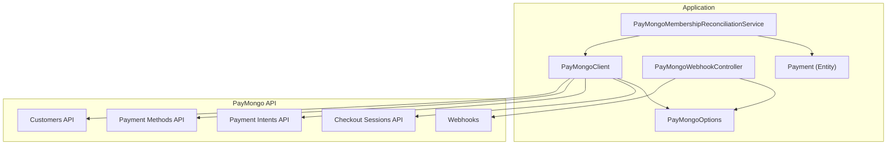
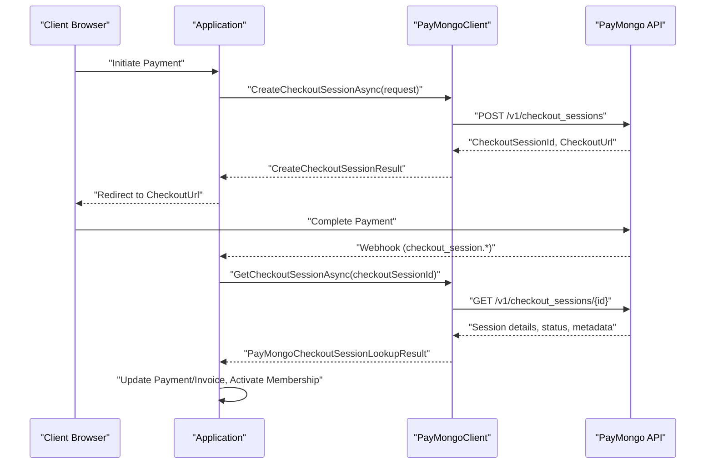
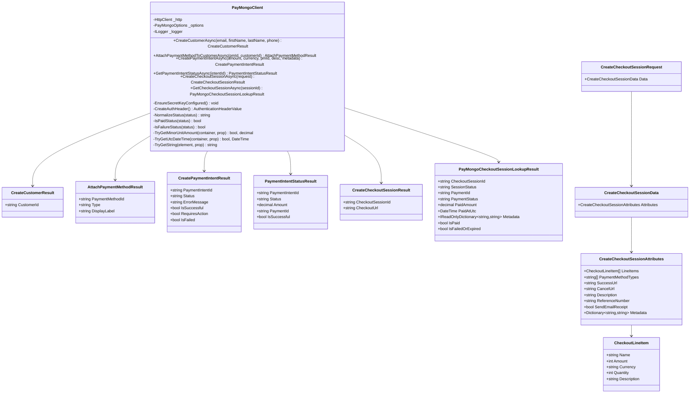
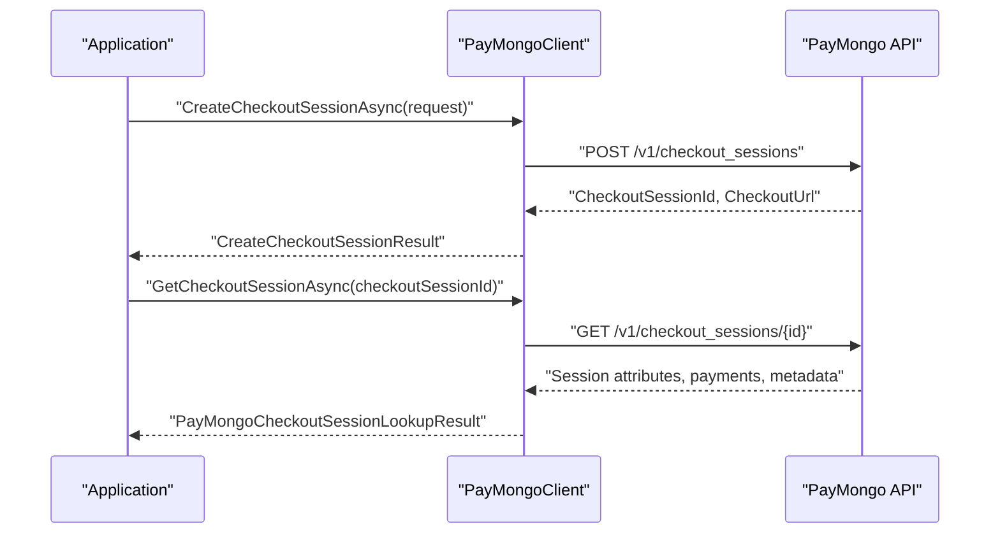
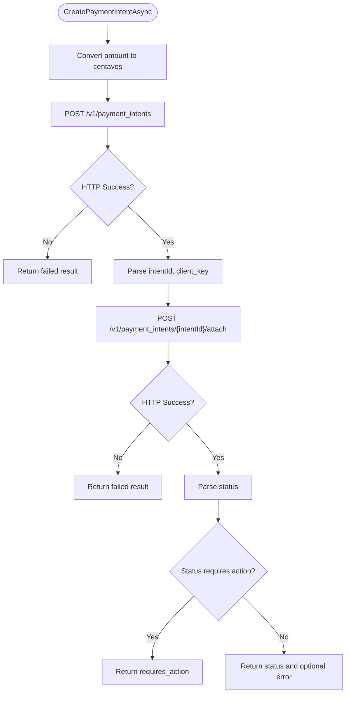
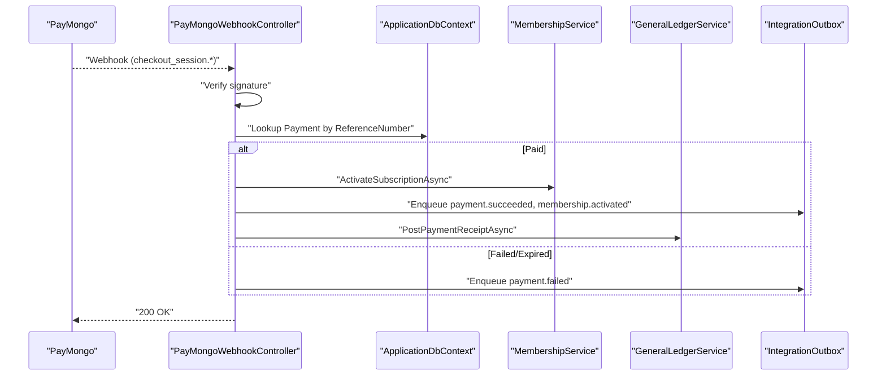
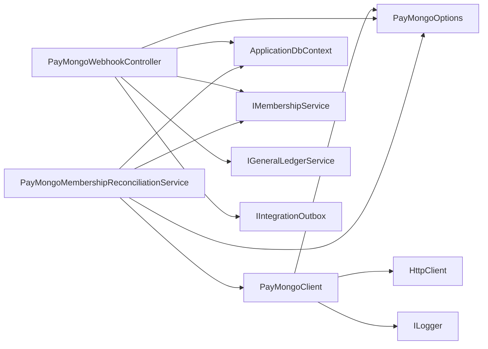

# PayMongo Integration

<cite>
**Referenced Files in This Document**
- [PayMongoClient.cs](file://Services/Payments/PayMongoClient.cs)
- [PayMongoOptions.cs](file://Services/Payments/PayMongoOptions.cs)
- [PayMongoWebhookController.cs](file://Controllers/PayMongoWebhookController.cs)
- [PayMongoMembershipReconciliationService.cs](file://Services/Payments/PayMongoMembershipReconciliationService.cs)
- [PayMongoBillingCapabilities.cs](file://Services/Payments/PayMongoBillingCapabilities.cs)
- [appsettings.json](file://appsettings.json)
- [appsettings.Production.json](file://appsettings.Production.json)
- [Payment.cs](file://Models/Billing/Payment.cs)
- [PayMongoWebhookIntegrationTests.cs](file://EJCFitnessGym.Tests/PayMongoWebhookIntegrationTests.cs)
</cite>

## Table of Contents
1. [Introduction](#introduction)
2. [Project Structure](#project-structure)
3. [Core Components](#core-components)
4. [Architecture Overview](#architecture-overview)
5. [Detailed Component Analysis](#detailed-component-analysis)
6. [Dependency Analysis](#dependency-analysis)
7. [Performance Considerations](#performance-considerations)
8. [Troubleshooting Guide](#troubleshooting-guide)
9. [Conclusion](#conclusion)
10. [Appendices](#appendices)

## Introduction
This document explains the PayMongo payment gateway integration in the EJC Fitness Gym application. It covers the PayMongoClient implementation for customer creation, payment method attachment, payment intent processing, and checkout session management. It also documents API configuration, authentication, error handling, 3D Secure authentication handling, amount conversion to centavos, metadata handling, result types and status codes, and security considerations for API keys and PCI compliance.

## Project Structure
The PayMongo integration spans several services and controllers:
- PayMongoClient: HTTP client wrapper for PayMongo APIs
- PayMongoOptions: configuration model for PayMongo credentials and webhook settings
- PayMongoWebhookController: inbound webhook endpoint with signature verification
- PayMongoMembershipReconciliationService: reconciliation of pending payments against PayMongo sessions
- PayMongoBillingCapabilities: feature capability flags for checkout and auto-billing
- Configuration: appsettings.json and appsettings.Production.json
- Models: Payment entity used for persistence and status tracking

**Diagram sources**
- [PayMongoClient.cs:13-596](file://Services/Payments/PayMongoClient.cs#L13-L596)
- [PayMongoWebhookController.cs:27-71](file://Controllers/PayMongoWebhookController.cs#L27-L71)
- [PayMongoMembershipReconciliationService.cs:10-32](file://Services/Payments/PayMongoMembershipReconciliationService.cs#L10-L32)
- [PayMongoOptions.cs:3-12](file://Services/Payments/PayMongoOptions.cs#L3-L12)
- [Payment.cs:5-36](file://Models/Billing/Payment.cs#L5-L36)

**Section sources**
- [PayMongoClient.cs:13-596](file://Services/Payments/PayMongoClient.cs#L13-L596)
- [PayMongoOptions.cs:3-12](file://Services/Payments/PayMongoOptions.cs#L3-L12)
- [PayMongoWebhookController.cs:27-71](file://Controllers/PayMongoWebhookController.cs#L27-L71)
- [PayMongoMembershipReconciliationService.cs:10-32](file://Services/Payments/PayMongoMembershipReconciliationService.cs#L10-L32)
- [PayMongoBillingCapabilities.cs:3-16](file://Services/Payments/PayMongoBillingCapabilities.cs#L3-L16)
- [appsettings.json:37-44](file://appsettings.json#L37-L44)
- [appsettings.Production.json:17-20](file://appsettings.Production.json#L17-L20)
- [Payment.cs:5-36](file://Models/Billing/Payment.cs#L5-L36)

## Core Components
- PayMongoClient: Provides methods to create customers, attach payment methods, create payment intents, check statuses, and manage checkout sessions. Handles authentication via Basic auth using SecretKey and includes robust JSON parsing helpers and status normalization.
- PayMongoOptions: Holds PayMongo credentials (SecretKey, PublicKey, SuccessUrl, CancelUrl), webhook secret, and signature verification settings.
- PayMongoWebhookController: Receives PayMongo webhooks, verifies signatures, deduplicates events, reconciles payments, updates invoices, triggers membership activation, and enqueues integration events.
- PayMongoMembershipReconciliationService: Scans pending payments and reconciles them against PayMongo checkout sessions, updating statuses and activating memberships when appropriate.
- PayMongoBillingCapabilities: Declares current limitations around checkout vaulting and off-session auto billing.

**Section sources**
- [PayMongoClient.cs:29-281](file://Services/Payments/PayMongoClient.cs#L29-L281)
- [PayMongoOptions.cs:3-12](file://Services/Payments/PayMongoOptions.cs#L3-L12)
- [PayMongoWebhookController.cs:73-187](file://Controllers/PayMongoWebhookController.cs#L73-L187)
- [PayMongoMembershipReconciliationService.cs:34-146](file://Services/Payments/PayMongoMembershipReconciliationService.cs#L34-L146)
- [PayMongoBillingCapabilities.cs:3-16](file://Services/Payments/PayMongoBillingCapabilities.cs#L3-L16)

## Architecture Overview
The integration follows a request-response pattern for PayMongo APIs and a webhook-driven reconciliation model for asynchronous payment outcomes.

**Diagram sources**
- [PayMongoClient.cs:283-313](file://Services/Payments/PayMongoClient.cs#L283-L313)
- [PayMongoClient.cs:315-449](file://Services/Payments/PayMongoClient.cs#L315-L449)
- [PayMongoWebhookController.cs:73-187](file://Controllers/PayMongoWebhookController.cs#L73-L187)

## Detailed Component Analysis

### PayMongoClient
- Responsibilities:
  - Customer creation with email and optional personal info
  - Payment method attachment to a customer
  - Payment intent creation with automatic capture and 3D Secure handling
  - Retrieval of payment intent status
  - Checkout session creation and lookup
  - Robust JSON parsing, status normalization, and metadata extraction
- Authentication:
  - Uses Basic auth derived from SecretKey for most endpoints
  - Uses Basic auth with SecretKey for checkout sessions
- Error handling:
  - Throws exceptions on HTTP failures
  - Returns structured results with status and messages for non-fatal conditions
- Amount handling:
  - Converts amounts to minor units (centavos) for PayMongo APIs
- Supported payment methods:
  - Card and GCash for payment intents
- 3D Secure:
  - Automatic request for card 3D Secure during payment intent creation
  - Detects requiring action status indicating 3D Secure flow

**Diagram sources**
- [PayMongoClient.cs:13-596](file://Services/Payments/PayMongoClient.cs#L13-L596)

**Section sources**
- [PayMongoClient.cs:29-281](file://Services/Payments/PayMongoClient.cs#L29-L281)
- [PayMongoClient.cs:598-716](file://Services/Payments/PayMongoClient.cs#L598-L716)

### Checkout Session Creation and Lookup
- CreateCheckoutSessionAsync:
  - Builds a request with line items, payment method types, URLs, description, reference number, email receipt preference, and metadata
  - Authenticates with Basic auth using SecretKey
  - Returns session identifier and checkout URL
- GetCheckoutSessionAsync:
  - Retrieves session details and normalizes status
  - Extracts payment status, amount, and timestamps
  - Reads metadata into a dictionary
  - Determines IsPaid and IsFailedOrExpired flags

**Diagram sources**
- [PayMongoClient.cs:283-313](file://Services/Payments/PayMongoClient.cs#L283-L313)
- [PayMongoClient.cs:315-449](file://Services/Payments/PayMongoClient.cs#L315-L449)

**Section sources**
- [PayMongoClient.cs:283-313](file://Services/Payments/PayMongoClient.cs#L283-L313)
- [PayMongoClient.cs:315-449](file://Services/Payments/PayMongoClient.cs#L315-L449)

### Payment Intent Processing and 3D Secure
- CreatePaymentIntentAsync:
  - Converts amount to centavos
  - Sets allowed payment methods to card and gcash
  - Requests automatic 3D Secure for cards
  - Creates payment intent and immediately attaches payment method
  - Returns status: succeeded, failed, requires_action, or awaiting_next_action
- GetPaymentIntentStatusAsync:
  - Fetches and parses payment intent status and associated payment ID

**Diagram sources**
- [PayMongoClient.cs:137-245](file://Services/Payments/PayMongoClient.cs#L137-L245)

**Section sources**
- [PayMongoClient.cs:137-245](file://Services/Payments/PayMongoClient.cs#L137-L245)
- [PayMongoClient.cs:250-281](file://Services/Payments/PayMongoClient.cs#L250-L281)

### Webhook Processing and Reconciliation
- PayMongoWebhookController:
  - Verifies webhook signature using PayMongo-Signature header
  - Deduplicates events using InboundWebhookReceipts
  - Handles paid and failed/expired events
  - Updates Payment and Invoice records, activates membership, enqueues integration events, and posts to general ledger
- PayMongoMembershipReconciliationService:
  - Scans pending PayMongo payments for a member
  - Queries checkout sessions and applies reconciliation (paid or failed/expired)
  - Activates membership when conditions are met

**Diagram sources**
- [PayMongoWebhookController.cs:73-187](file://Controllers/PayMongoWebhookController.cs#L73-L187)
- [PayMongoWebhookController.cs:320-539](file://Controllers/PayMongoWebhookController.cs#L320-L539)
- [PayMongoWebhookController.cs:541-622](file://Controllers/PayMongoWebhookController.cs#L541-L622)

**Section sources**
- [PayMongoWebhookController.cs:73-187](file://Controllers/PayMongoWebhookController.cs#L73-L187)
- [PayMongoWebhookController.cs:320-539](file://Controllers/PayMongoWebhookController.cs#L320-L539)
- [PayMongoWebhookController.cs:541-622](file://Controllers/PayMongoWebhookController.cs#L541-L622)
- [PayMongoMembershipReconciliationService.cs:34-146](file://Services/Payments/PayMongoMembershipReconciliationService.cs#L34-L146)

## Dependency Analysis
- PayMongoClient depends on:
  - HttpClient for HTTP requests
  - PayMongoOptions for credentials and settings
  - ILogger for logging
- PayMongoWebhookController depends on:
  - ApplicationDbContext for persistence
  - IMembershipService for membership activation
  - IGeneralLedgerService for accounting entries
  - IIntegrationOutbox for event publishing
  - PayMongoOptions for webhook verification
- PayMongoMembershipReconciliationService depends on:
  - ApplicationDbContext
  - IMembershipService
  - PayMongoClient
  - PayMongoOptions

**Diagram sources**
- [PayMongoClient.cs:19-24](file://Services/Payments/PayMongoClient.cs#L19-L24)
- [PayMongoWebhookController.cs:51-71](file://Controllers/PayMongoWebhookController.cs#L51-L71)
- [PayMongoMembershipReconciliationService.cs:20-32](file://Services/Payments/PayMongoMembershipReconciliationService.cs#L20-L32)

**Section sources**
- [PayMongoClient.cs:19-24](file://Services/Payments/PayMongoClient.cs#L19-L24)
- [PayMongoWebhookController.cs:51-71](file://Controllers/PayMongoWebhookController.cs#L51-L71)
- [PayMongoMembershipReconciliationService.cs:20-32](file://Services/Payments/PayMongoMembershipReconciliationService.cs#L20-L32)

## Performance Considerations
- Minimize HTTP calls by batching reconciliation queries and reusing HttpClient instances.
- Use idempotent webhook processing with InboundWebhookReceipts to avoid duplicate work.
- Cache frequently accessed configuration values from PayMongoOptions where appropriate.
- Monitor webhook signature verification latency and tune tolerance windows.

## Troubleshooting Guide
- Missing SecretKey:
  - Ensure PayMongo:SecretKey is configured in appsettings and loaded at runtime.
- Webhook signature verification failures:
  - Verify PayMongo-Signature header presence and format.
  - Confirm WebhookSecret configuration and tolerance window.
- Duplicate webhook processing:
  - InboundWebhookReceipts prevent concurrent or repeated processing attempts.
- Payment reconciliation mismatches:
  - Compare webhook paid amount with expected invoice amount and log warnings.
  - Membership activation requires valid member_user_id and plan_id metadata.

**Section sources**
- [PayMongoClient.cs:583-589](file://Services/Payments/PayMongoClient.cs#L583-L589)
- [PayMongoWebhookController.cs:624-682](file://Controllers/PayMongoWebhookController.cs#L624-L682)
- [PayMongoWebhookController.cs:189-257](file://Controllers/PayMongoWebhookController.cs#L189-L257)
- [PayMongoMembershipReconciliationService.cs:148-298](file://Services/Payments/PayMongoMembershipReconciliationService.cs#L148-L298)

## Conclusion
The PayMongo integration provides a robust foundation for checkout sessions, payment intents, and webhook-driven reconciliation. It supports card and GCash payments, handles 3D Secure automatically, and maintains strict reconciliation with internal invoices and memberships. Proper configuration of credentials and webhook security is essential for production readiness.

## Appendices

### API Configuration Requirements
- PayMongoOptions fields:
  - SecretKey: used for Basic auth on most endpoints
  - PublicKey: used for frontend integrations
  - SuccessUrl/CancelUrl: redirect URLs for checkout sessions
  - WebhookSecret: shared secret for signature verification
  - RequireWebhookSignature: enforce signature verification in production
  - WebhookSignatureToleranceSeconds: acceptable timestamp drift for signatures

**Section sources**
- [PayMongoOptions.cs:3-12](file://Services/Payments/PayMongoOptions.cs#L3-L12)
- [appsettings.json:37-44](file://appsettings.json#L37-L44)
- [appsettings.Production.json:17-20](file://appsettings.Production.json#L17-L20)

### Authentication Mechanisms
- Basic auth using SecretKey for:
  - Customers, payment methods, payment intents, checkout sessions
- Signature verification for webhooks:
  - PayMongo-Signature header with timestamp and signature values
  - Verification against WebhookSecret with tolerance window

**Section sources**
- [PayMongoClient.cs:591-595](file://Services/Payments/PayMongoClient.cs#L591-L595)
- [PayMongoWebhookController.cs:624-682](file://Controllers/PayMongoWebhookController.cs#L624-L682)

### Error Handling Strategies
- HTTP failures raise exceptions with status and body details
- Non-fatal outcomes return structured results with status and messages
- Webhook processing logs warnings and marks receipts appropriately

**Section sources**
- [PayMongoClient.cs:63-66](file://Services/Payments/PayMongoClient.cs#L63-L66)
- [PayMongoClient.cs:180-185](file://Services/Payments/PayMongoClient.cs#L180-L185)
- [PayMongoWebhookController.cs:180-185](file://Controllers/PayMongoWebhookController.cs#L180-L185)

### Payment Flow Orchestration Examples
- Checkout session creation:
  - Build CreateCheckoutSessionRequest with line items and metadata
  - Call CreateCheckoutSessionAsync and redirect user to CheckoutUrl
- Payment intent processing:
  - CreatePaymentIntentAsync to create and attach payment method
  - Handle RequiresAction for 3D Secure
  - Poll GetPaymentIntentStatusAsync for final status
- Membership reconciliation:
  - Use PayMongoMembershipReconciliationService to reconcile pending payments

**Section sources**
- [PayMongoClient.cs:283-313](file://Services/Payments/PayMongoClient.cs#L283-L313)
- [PayMongoClient.cs:137-245](file://Services/Payments/PayMongoClient.cs#L137-L245)
- [PayMongoMembershipReconciliationService.cs:34-146](file://Services/Payments/PayMongoMembershipReconciliationService.cs#L34-L146)

### Amount Conversion and Metadata Handling
- Amount conversion:
  - Multiply PHP amounts by 100 and round to integer centavos
- Metadata:
  - Stored as key-value pairs in checkout sessions and webhooks
  - Read into IReadOnlyDictionary<string,string> for downstream processing

**Section sources**
- [PayMongoClient.cs:147-147](file://Services/Payments/PayMongoClient.cs#L147-L147)
- [PayMongoClient.cs:451-479](file://Services/Payments/PayMongoClient.cs#L451-L479)
- [PayMongoWebhookController.cs:348-448](file://Controllers/PayMongoWebhookController.cs#L348-L448)

### Result Types and Status Codes
- CreateCustomerResult: returns CustomerId
- AttachPaymentMethodResult: returns PaymentMethodId, Type, DisplayLabel
- CreatePaymentIntentResult: includes PaymentIntentId, Status, ErrorMessage with helpers IsSuccessful, RequiresAction, IsFailed
- PaymentIntentStatusResult: includes Status, Amount, PaymentId with IsSuccessful
- PayMongoCheckoutSessionLookupResult: includes SessionStatus, PaymentStatus, PaidAmount, PaidAtUtc, Metadata, IsPaid, IsFailedOrExpired

**Section sources**
- [PayMongoClient.cs:598-628](file://Services/Payments/PayMongoClient.cs#L598-L628)

### Security Considerations
- Store SecretKey and WebhookSecret in secure configuration stores (e.g., user secrets, Azure Key Vault)
- Enforce RequireWebhookSignature in production environments
- Limit exposure of API keys in client-side code; use PublicKey for frontend only
- Avoid logging sensitive data; sanitize logs containing API responses
- Comply with PCI DSS by not storing cardholder data; rely on PayMongo for PCI-compliant storage

**Section sources**
- [appsettings.Production.json:17-20](file://appsettings.Production.json#L17-L20)
- [PayMongoClient.cs:583-589](file://Services/Payments/PayMongoClient.cs#L583-L589)

### Feature Capabilities
- Checkout vaulting: Not currently supported
- Off-session auto billing: Not currently supported
- Manual renewal messaging is provided for user guidance

**Section sources**
- [PayMongoBillingCapabilities.cs:3-16](file://Services/Payments/PayMongoBillingCapabilities.cs#L3-L16)

### Practical Tests and Validation
- Integration tests validate:
  - Duplicate paid webhook handling
  - Failure then retry recovery
  - Underpayment scenarios
  - Production webhook signature enforcement
  - Valid signed webhook processing

**Section sources**
- [PayMongoWebhookIntegrationTests.cs:25-262](file://EJCFitnessGym.Tests/PayMongoWebhookIntegrationTests.cs#L25-L262)