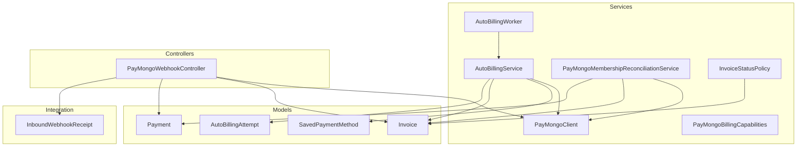
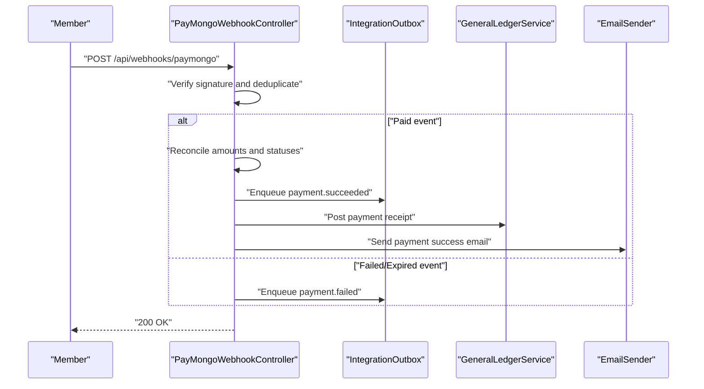
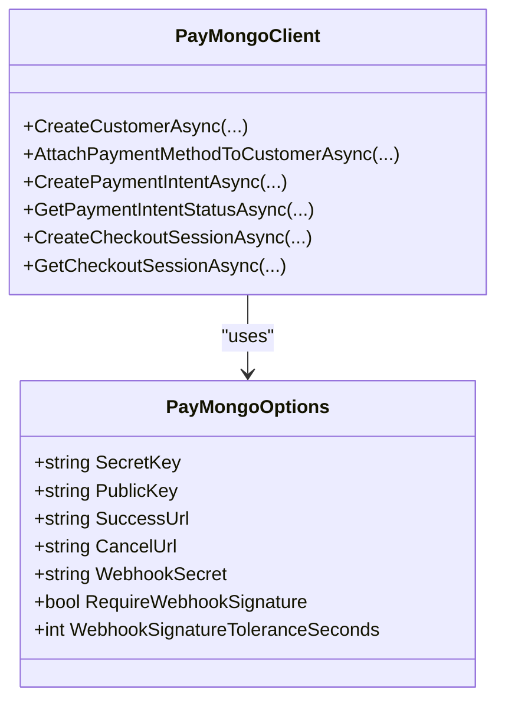
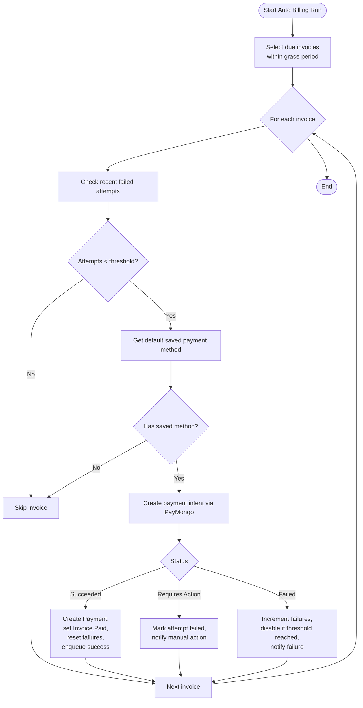
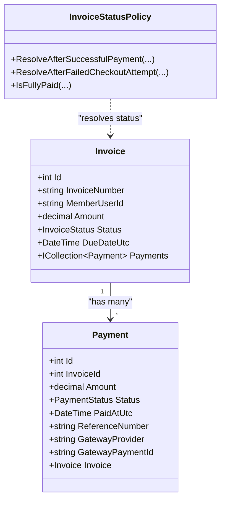
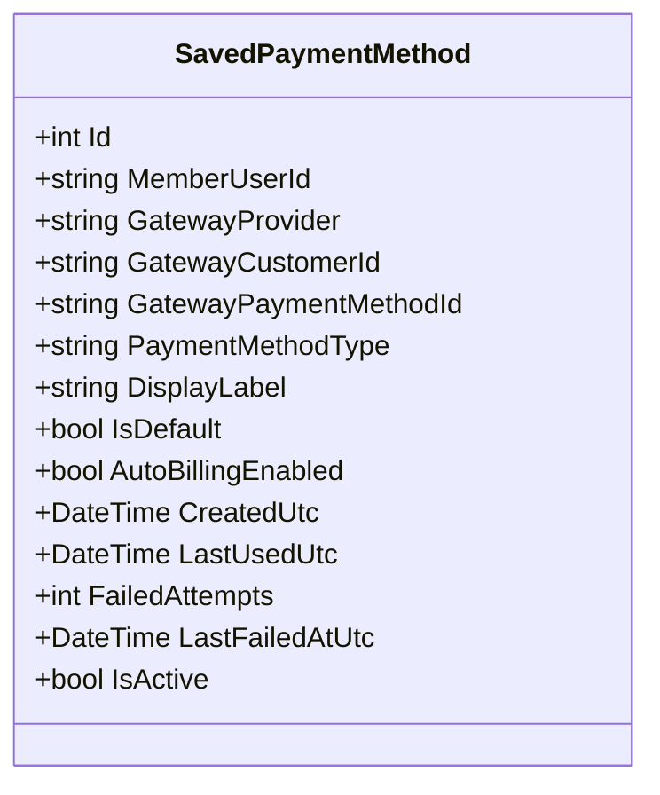
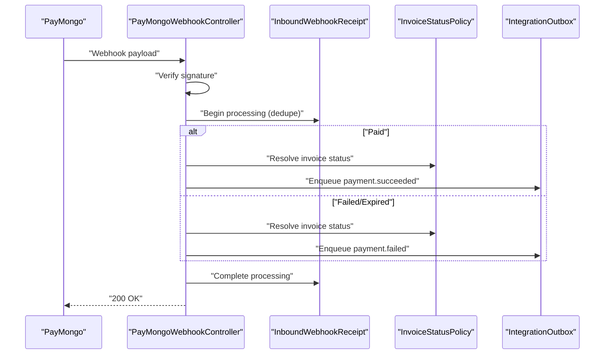
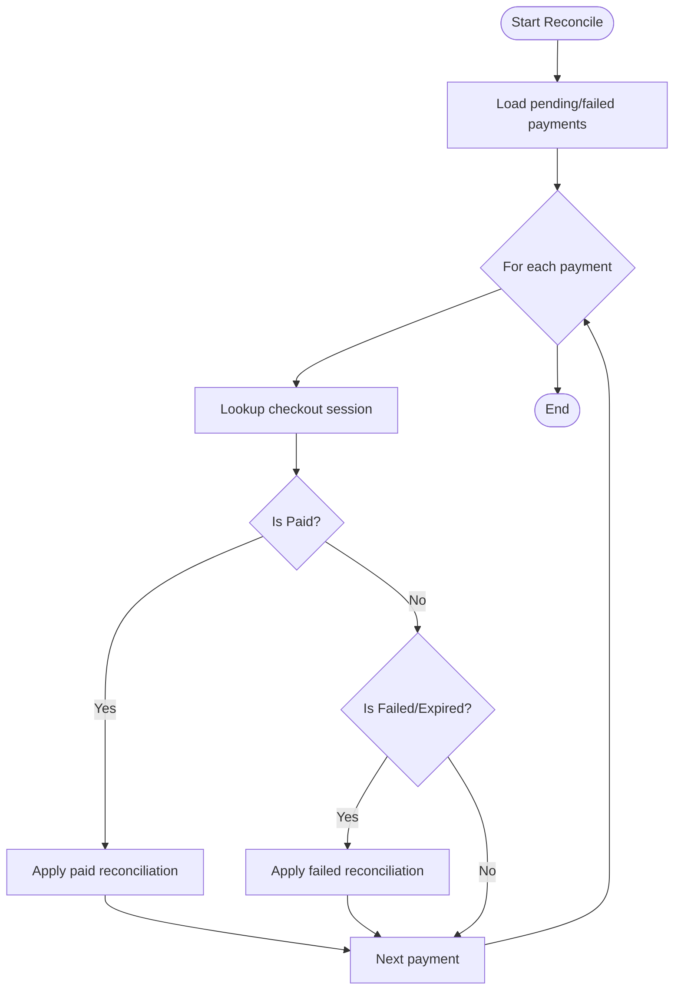
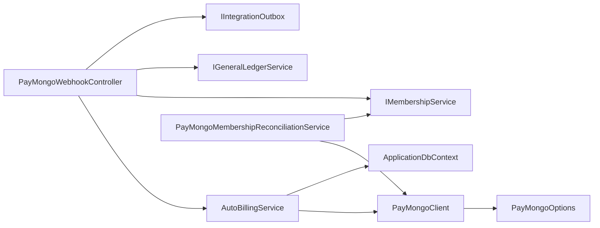

# Payment Processing System

<cite>
**Referenced Files in This Document**
- [PayMongoClient.cs](file://Services/Payments/PayMongoClient.cs)
- [PayMongoOptions.cs](file://Services/Payments/PayMongoOptions.cs)
- [AutoBillingService.cs](file://Services/Payments/AutoBillingService.cs)
- [PayMongoWebhookController.cs](file://Controllers/PayMongoWebhookController.cs)
- [PayMongoMembershipReconciliationService.cs](file://Services/Payments/PayMongoMembershipReconciliationService.cs)
- [AutoBillingWorker.cs](file://Services/Payments/AutoBillingWorker.cs)
- [Invoice.cs](file://Models/Billing/Invoice.cs)
- [Payment.cs](file://Models/Billing/Payment.cs)
- [SavedPaymentMethod.cs](file://Models/Billing/SavedPaymentMethod.cs)
- [AutoBillingAttempt.cs](file://Models/Billing/AutoBillingAttempt.cs)
- [InboundWebhookReceipt.cs](file://Models/Integration/InboundWebhookReceipt.cs)
- [BillingEnums.cs](file://Models/Billing/BillingEnums.cs)
- [InvoiceStatusPolicy.cs](file://Services/Payments/InvoiceStatusPolicy.cs)
- [PayMongoBillingCapabilities.cs](file://Services/Payments/PayMongoBillingCapabilities.cs)
- [PayMongoWebhookIntegrationTests.cs](file://EJCFitnessGym.Tests/PayMongoWebhookIntegrationTests.cs)
- [AutoBillingServiceTests.cs](file://EJCFitnessGym.Tests/AutoBillingServiceTests.cs)
- [Program.cs](file://Program.cs)
</cite>

## Table of Contents
1. [Introduction](#introduction)
2. [Project Structure](#project-structure)
3. [Core Components](#core-components)
4. [Architecture Overview](#architecture-overview)
5. [Detailed Component Analysis](#detailed-component-analysis)
6. [Dependency Analysis](#dependency-analysis)
7. [Performance Considerations](#performance-considerations)
8. [Troubleshooting Guide](#troubleshooting-guide)
9. [Conclusion](#conclusion)
10. [Appendices](#appendices)

## Introduction
This document describes the payment processing system for the EJC Fitness Gym platform, focusing on PayMongo integration, automated billing, invoice management, payment method storage, webhook processing, reconciliation, error handling, and PCI compliance considerations. It synthesizes the codebase to explain how payments are initiated, tracked, reconciled, and how real-time events are handled to maintain accurate financial records.

## Project Structure
The payment system spans several layers:
- Services: PayMongo client, auto billing, reconciliation, and policies
- Controllers: Webhook endpoint for PayMongo events
- Models: Billing entities (Invoice, Payment, SavedPaymentMethod, AutoBillingAttempt)
- Integration: Outbox pattern for reliable notifications
- Tests: Integration tests validating webhook idempotency and reconciliation behavior

**Diagram sources**
- [PayMongoClient.cs:13-717](file://Services/Payments/PayMongoClient.cs#L13-L717)
- [AutoBillingService.cs:44-493](file://Services/Payments/AutoBillingService.cs#L44-L493)
- [PayMongoMembershipReconciliationService.cs:10-423](file://Services/Payments/PayMongoMembershipReconciliationService.cs#L10-L423)
- [AutoBillingWorker.cs:34-122](file://Services/Payments/AutoBillingWorker.cs#L34-L122)
- [InvoiceStatusPolicy.cs:5-58](file://Services/Payments/InvoiceStatusPolicy.cs#L5-L58)
- [PayMongoBillingCapabilities.cs:3-18](file://Services/Payments/PayMongoBillingCapabilities.cs#L3-L18)
- [PayMongoWebhookController.cs:27-187](file://Controllers/PayMongoWebhookController.cs#L27-L187)
- [Invoice.cs:5-39](file://Models/Billing/Invoice.cs#L5-L39)
- [Payment.cs:5-38](file://Models/Billing/Payment.cs#L5-L38)
- [SavedPaymentMethod.cs:8-88](file://Models/Billing/SavedPaymentMethod.cs#L8-L88)
- [AutoBillingAttempt.cs:8-66](file://Models/Billing/AutoBillingAttempt.cs#L8-L66)
- [InboundWebhookReceipt.cs:5-43](file://Models/Integration/InboundWebhookReceipt.cs#L5-L43)

**Section sources**
- [Program.cs:364-374](file://Program.cs#L364-L374)
- [PayMongoClient.cs:13-717](file://Services/Payments/PayMongoClient.cs#L13-L717)
- [PayMongoWebhookController.cs:27-187](file://Controllers/PayMongoWebhookController.cs#L27-L187)
- [AutoBillingService.cs:44-493](file://Services/Payments/AutoBillingService.cs#L44-L493)
- [PayMongoMembershipReconciliationService.cs:10-423](file://Services/Payments/PayMongoMembershipReconciliationService.cs#L10-L423)
- [Invoice.cs:5-39](file://Models/Billing/Invoice.cs#L5-L39)
- [Payment.cs:5-38](file://Models/Billing/Payment.cs#L5-L38)
- [SavedPaymentMethod.cs:8-88](file://Models/Billing/SavedPaymentMethod.cs#L8-L88)
- [AutoBillingAttempt.cs:8-66](file://Models/Billing/AutoBillingAttempt.cs#L8-L66)
- [InboundWebhookReceipt.cs:5-43](file://Models/Integration/InboundWebhookReceipt.cs#L5-L43)

## Core Components
- PayMongoClient: Encapsulates PayMongo API calls for customers, payment intents, checkout sessions, and status lookups. Handles authentication, JSON serialization, and response parsing.
- AutoBillingService: Orchestrates automatic billing by selecting due invoices, retrieving saved payment methods, invoking PayMongo to charge, updating payments/invoices, and managing retry logic and failures.
- PayMongoWebhookController: Validates PayMongo webhook signatures, deduplicates events, processes paid/failed events, reconciles amounts, activates memberships when appropriate, and posts notifications.
- PayMongoMembershipReconciliationService: Reconciles pending member payments by polling PayMongo checkout sessions and applying paid/failed outcomes to local records.
- AutoBillingWorker: Scheduled background job that triggers AutoBillingService runs at configured intervals.
- Models: Invoice, Payment, SavedPaymentMethod, AutoBillingAttempt define the domain for billing operations.
- Policies: InvoiceStatusPolicy governs invoice state transitions; PayMongoBillingCapabilities reflects current PayMongo integration limitations.

**Section sources**
- [PayMongoClient.cs:13-717](file://Services/Payments/PayMongoClient.cs#L13-L717)
- [AutoBillingService.cs:44-493](file://Services/Payments/AutoBillingService.cs#L44-L493)
- [PayMongoWebhookController.cs:27-187](file://Controllers/PayMongoWebhookController.cs#L27-L187)
- [PayMongoMembershipReconciliationService.cs:10-423](file://Services/Payments/PayMongoMembershipReconciliationService.cs#L10-L423)
- [AutoBillingWorker.cs:34-122](file://Services/Payments/AutoBillingWorker.cs#L34-L122)
- [InvoiceStatusPolicy.cs:5-58](file://Services/Payments/InvoiceStatusPolicy.cs#L5-L58)
- [PayMongoBillingCapabilities.cs:3-18](file://Services/Payments/PayMongoBillingCapabilities.cs#L3-L18)
- [Invoice.cs:5-39](file://Models/Billing/Invoice.cs#L5-L39)
- [Payment.cs:5-38](file://Models/Billing/Payment.cs#L5-L38)
- [SavedPaymentMethod.cs:8-88](file://Models/Billing/SavedPaymentMethod.cs#L8-L88)
- [AutoBillingAttempt.cs:8-66](file://Models/Billing/AutoBillingAttempt.cs#L8-L66)

## Architecture Overview
The system integrates PayMongo for payment processing and reconciliation, with idempotent webhook handling and scheduled auto-billing.

**Diagram sources**
- [PayMongoWebhookController.cs:74-187](file://Controllers/PayMongoWebhookController.cs#L74-L187)
- [PayMongoMembershipReconciliationService.cs:148-298](file://Services/Payments/PayMongoMembershipReconciliationService.cs#L148-L298)
- [Program.cs:364-380](file://Program.cs#L364-L380)

## Detailed Component Analysis

### PayMongo Integration
- API configuration: PayMongo options are bound from configuration and injected into services. The client uses Basic auth with the secret key for most operations and supports checkout session retrieval with Basic auth.
- Payment methods: The system creates PayMongo customers and attaches payment methods. Display labels are derived from payment method details.
- Payment intents: Payment intents are created and attached to saved payment methods to attempt immediate charging. Status is checked to detect 3D Secure requirements.
- Checkout sessions: Checkout sessions are created and later looked up to reconcile paid/failed/expired states.

**Diagram sources**
- [PayMongoClient.cs:13-717](file://Services/Payments/PayMongoClient.cs#L13-L717)
- [PayMongoOptions.cs:3-14](file://Services/Payments/PayMongoOptions.cs#L3-L14)

**Section sources**
- [PayMongoClient.cs:29-281](file://Services/Payments/PayMongoClient.cs#L29-L281)
- [PayMongoOptions.cs:3-14](file://Services/Payments/PayMongoOptions.cs#L3-L14)

### Automated Billing System
- Scheduling: AutoBillingWorker runs at fixed intervals and optionally on startup, invoking AutoBillingService.
- Invoice selection: Finds unpaid/overdue invoices within a grace period and limits batch size.
- Retry logic: Prevents excessive retries by counting recent failed attempts and skipping if thresholds are exceeded.
- Payment method handling: Retrieves default saved payment methods, validates auto-billing capability, and increments failure counters on declines.
- Outcome handling: On success, creates Payment records, updates Invoice status, resets failure counters, and enqueues notifications. On failure, logs and notifies the member.

**Diagram sources**
- [AutoBillingWorker.cs:34-122](file://Services/Payments/AutoBillingWorker.cs#L34-L122)
- [AutoBillingService.cs:69-377](file://Services/Payments/AutoBillingService.cs#L69-L377)

**Section sources**
- [AutoBillingWorker.cs:34-122](file://Services/Payments/AutoBillingWorker.cs#L34-L122)
- [AutoBillingService.cs:69-377](file://Services/Payments/AutoBillingService.cs#L69-L377)
- [PayMongoBillingCapabilities.cs:3-18](file://Services/Payments/PayMongoBillingCapabilities.cs#L3-L18)

### Invoice Management Workflow
- Creation: Invoices are created with issue date, due date, amount, and status.
- Tracking: Payments are linked to invoices; statuses are updated according to policy.
- Status resolution: InvoiceStatusPolicy determines whether an invoice is fully paid, unpaid, overdue, or voided based on paid totals and due dates.
- Reconciliation: After webhook processing, amounts and statuses are reconciled; partial payments leave invoices unpaid and may trigger warnings.

**Diagram sources**
- [Invoice.cs:5-39](file://Models/Billing/Invoice.cs#L5-L39)
- [Payment.cs:5-38](file://Models/Billing/Payment.cs#L5-L38)
- [InvoiceStatusPolicy.cs:5-58](file://Services/Payments/InvoiceStatusPolicy.cs#L5-L58)

**Section sources**
- [Invoice.cs:5-39](file://Models/Billing/Invoice.cs#L5-L39)
- [Payment.cs:5-38](file://Models/Billing/Payment.cs#L5-L38)
- [InvoiceStatusPolicy.cs:5-58](file://Services/Payments/InvoiceStatusPolicy.cs#L5-L58)

### Payment Method Storage and Security
- Storage: SavedPaymentMethod persists gateway identifiers, type, display label, defaults, auto-billing flags, and failure counters.
- Security: The system stores minimal sensitive data locally (labels, IDs). Payment method tokens are managed by PayMongo; the application does not handle raw PANs or CVV.
- Compliance: PCI DSS is addressed by avoiding raw card data storage and relying on PayMongo’s hosted fields and tokens.

**Diagram sources**
- [SavedPaymentMethod.cs:8-88](file://Models/Billing/SavedPaymentMethod.cs#L8-L88)

**Section sources**
- [SavedPaymentMethod.cs:8-88](file://Models/Billing/SavedPaymentMethod.cs#L8-L88)

### Webhook Integration and Idempotency
- Signature verification: Webhook signature is validated against a configured secret, with configurable tolerance window. Production requires a webhook secret.
- Idempotency: Events are deduplicated using an inbound webhook receipt keyed by provider and event key. Concurrent processing is prevented with attempt counts and timestamps.
- Event handling: Paid events reconcile amounts, activate memberships when conditions are met, post to general ledger, and send emails. Failed/expired events update invoice status and notify users.

**Diagram sources**
- [PayMongoWebhookController.cs:74-187](file://Controllers/PayMongoWebhookController.cs#L74-L187)
- [InboundWebhookReceipt.cs:5-43](file://Models/Integration/InboundWebhookReceipt.cs#L5-L43)
- [InvoiceStatusPolicy.cs:15-48](file://Services/Payments/InvoiceStatusPolicy.cs#L15-L48)

**Section sources**
- [PayMongoWebhookController.cs:74-187](file://Controllers/PayMongoWebhookController.cs#L74-L187)
- [InboundWebhookReceipt.cs:5-43](file://Models/Integration/InboundWebhookReceipt.cs#L5-L43)
- [PayMongoWebhookIntegrationTests.cs:25-231](file://EJCFitnessGym.Tests/PayMongoWebhookIntegrationTests.cs#L25-L231)

### Reconciliation Procedures
- Pending reconciliation: Iterates through pending/failed online gateway payments, queries PayMongo checkout sessions, and applies paid/failed outcomes.
- Updates: Adjusts payment amounts, statuses, gateway identifiers, and invoice status; activates memberships when fully paid and metadata permits.
- Lifecycle maintenance: Triggers membership lifecycle maintenance after reconciliation to ensure consistency.

**Diagram sources**
- [PayMongoMembershipReconciliationService.cs:34-146](file://Services/Payments/PayMongoMembershipReconciliationService.cs#L34-L146)
- [PayMongoMembershipReconciliationService.cs:148-298](file://Services/Payments/PayMongoMembershipReconciliationService.cs#L148-L298)
- [PayMongoMembershipReconciliationService.cs:300-387](file://Services/Payments/PayMongoMembershipReconciliationService.cs#L300-L387)

**Section sources**
- [PayMongoMembershipReconciliationService.cs:34-146](file://Services/Payments/PayMongoMembershipReconciliationService.cs#L34-L146)
- [PayMongoMembershipReconciliationService.cs:148-298](file://Services/Payments/PayMongoMembershipReconciliationService.cs#L148-L298)
- [PayMongoMembershipReconciliationService.cs:300-387](file://Services/Payments/PayMongoMembershipReconciliationService.cs#L300-L387)

### Error Handling Strategies
- Auto-billing failures: Increment failure counters, disable payment methods after thresholds, and notify users. Exceptions are logged and surfaced appropriately.
- Webhook failures: Mark receipts as failed with notes, allowing retries. Tests demonstrate resilience to transient outbox failures.
- Reconciliation errors: Log warnings and continue processing remaining items.

**Section sources**
- [AutoBillingService.cs:367-377](file://Services/Payments/AutoBillingService.cs#L367-L377)
- [PayMongoWebhookController.cs:180-186](file://Controllers/PayMongoWebhookController.cs#L180-L186)
- [PayMongoWebhookIntegrationTests.cs:64-104](file://EJCFitnessGym.Tests/PayMongoWebhookIntegrationTests.cs#L64-L104)

## Dependency Analysis
- PayMongoClient depends on PayMongoOptions and uses HTTP client for API calls.
- AutoBillingService depends on ApplicationDbContext, PayMongoClient, and optional integration outbox for notifications.
- PayMongoWebhookController depends on multiple services for membership activation, finance alerts, general ledger posting, and outbox notifications.
- Reconciliation service depends on PayMongoClient and membership service to activate subscriptions when appropriate.

**Diagram sources**
- [PayMongoClient.cs:19-24](file://Services/Payments/PayMongoClient.cs#L19-L24)
- [AutoBillingService.cs:57-67](file://Services/Payments/AutoBillingService.cs#L57-L67)
- [PayMongoWebhookController.cs:51-71](file://Controllers/PayMongoWebhookController.cs#L51-L71)
- [PayMongoMembershipReconciliationService.cs:20-32](file://Services/Payments/PayMongoMembershipReconciliationService.cs#L20-L32)

**Section sources**
- [Program.cs:364-380](file://Program.cs#L364-L380)
- [PayMongoClient.cs:19-24](file://Services/Payments/PayMongoClient.cs#L19-L24)
- [AutoBillingService.cs:57-67](file://Services/Payments/AutoBillingService.cs#L57-L67)
- [PayMongoWebhookController.cs:51-71](file://Controllers/PayMongoWebhookController.cs#L51-L71)
- [PayMongoMembershipReconciliationService.cs:20-32](file://Services/Payments/PayMongoMembershipReconciliationService.cs#L20-L32)

## Performance Considerations
- Batch processing: AutoBillingService limits invoices per run to prevent overload.
- Retry throttling: Recent failed attempt checks prevent frequent retries.
- Idempotent webhook processing: Deduplication avoids redundant work and reduces load.
- Asynchronous notifications: Integration outbox decouples expensive operations like email and ledger posting.

[No sources needed since this section provides general guidance]

## Troubleshooting Guide
- Webhook signature failures: Ensure PayMongo webhook secret is configured in production and that the signature header format is valid.
- Duplicate webhook processing: Receipts track event keys and statuses; duplicates are ignored.
- Underpayment scenarios: Partial payments do not close invoices; warnings are emitted and reconciliation proceeds.
- Auto-billing disabled: Current PayMongo checkout integration does not support off-session auto-billing; service disables auto-billing and notifies users accordingly.

**Section sources**
- [PayMongoWebhookController.cs:624-682](file://Controllers/PayMongoWebhookController.cs#L624-L682)
- [PayMongoWebhookIntegrationTests.cs:107-139](file://EJCFitnessGym.Tests/PayMongoWebhookIntegrationTests.cs#L107-L139)
- [AutoBillingServiceTests.cs:14-62](file://EJCFitnessGym.Tests/AutoBillingServiceTests.cs#L14-L62)
- [PayMongoBillingCapabilities.cs:3-18](file://Services/Payments/PayMongoBillingCapabilities.cs#L3-L18)

## Conclusion
The EJC Fitness Gym payment processing system integrates PayMongo for checkout sessions and automatic charging, with robust webhook handling for real-time updates and reconciliation. Automated billing runs on a schedule, with retry logic and idempotent event processing to ensure reliability. Payment method storage is secure and compliant by design, deferring sensitive data handling to PayMongo. The system’s policies and services coordinate to maintain accurate financial records and provide timely notifications to members and staff.

[No sources needed since this section summarizes without analyzing specific files]

## Appendices

### Configuration and Setup
- PayMongo configuration is loaded from application settings and bound to PayMongoOptions. The application validates presence of webhook secret in production environments when PayMongo is enabled.

**Section sources**
- [Program.cs:144-198](file://Program.cs#L144-L198)
- [PayMongoOptions.cs:3-14](file://Services/Payments/PayMongoOptions.cs#L3-L14)

### Enums and Statuses
- Billing enums define invoice and payment statuses, enabling consistent state transitions governed by InvoiceStatusPolicy.

**Section sources**
- [BillingEnums.cs:25-49](file://Models/Billing/BillingEnums.cs#L25-L49)
- [InvoiceStatusPolicy.cs:5-58](file://Services/Payments/InvoiceStatusPolicy.cs#L5-L58)