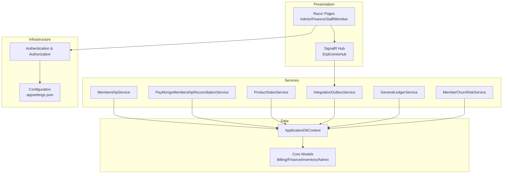
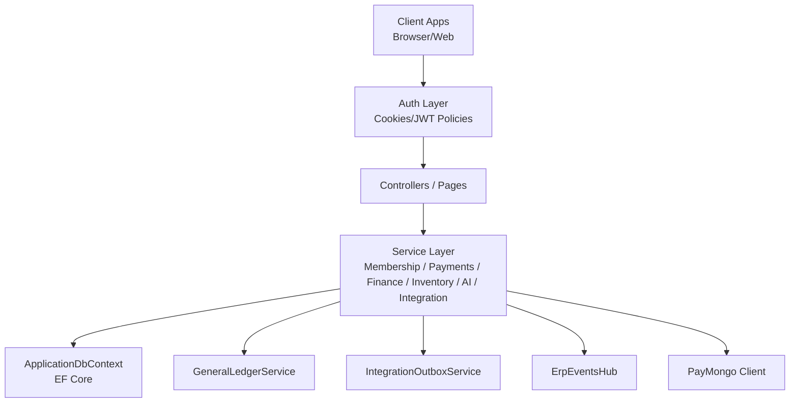
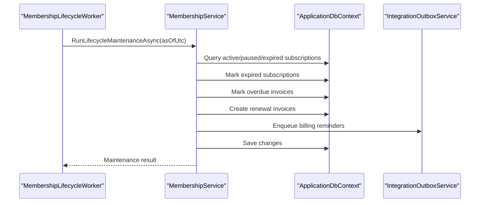
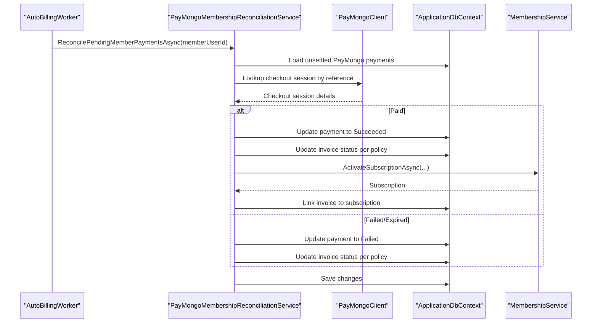
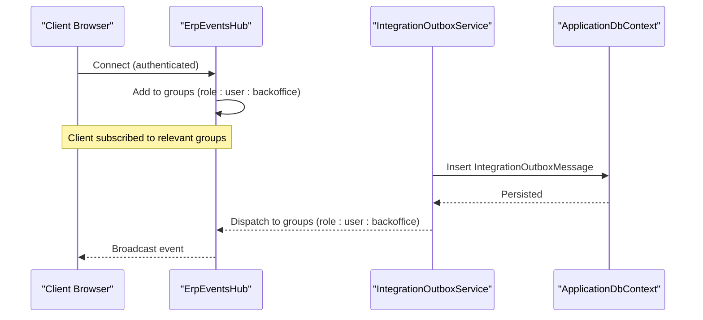
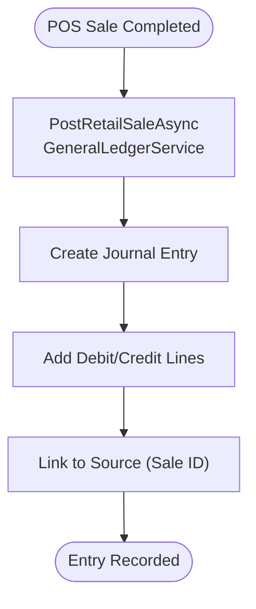
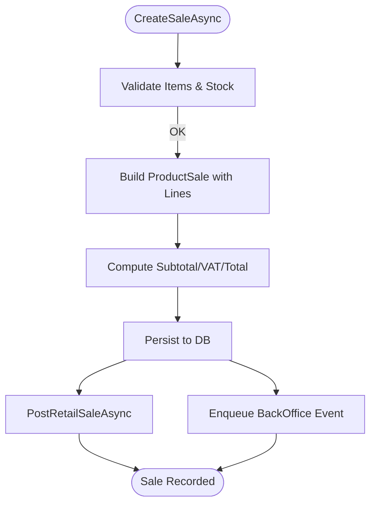
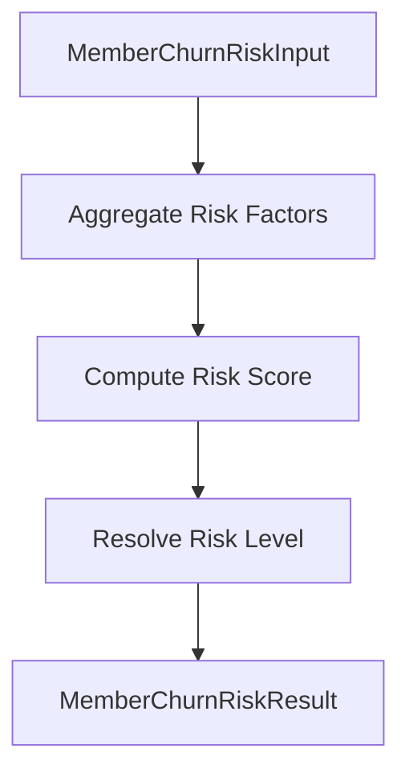
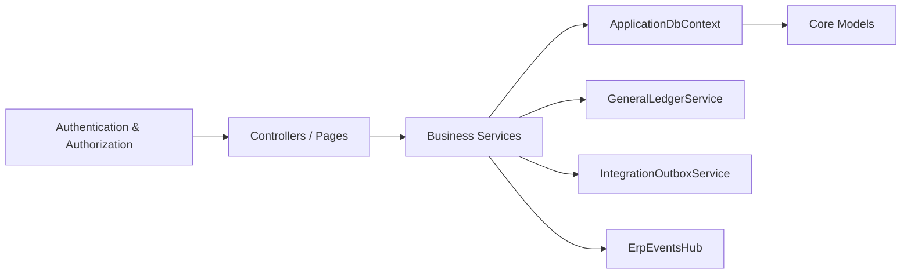

# Introduction and Purpose

<cite>
**Referenced Files in This Document**
- [README.md](file://README.md)
- [Program.cs](file://Program.cs)
- [appsettings.json](file://appsettings.json)
- [ApplicationDbContext.cs](file://Data/ApplicationDbContext.cs)
- [MemberSubscription.cs](file://Models/Billing/MemberSubscription.cs)
- [GeneralLedgerEntry.cs](file://Models/Finance/GeneralLedgerEntry.cs)
- [MembershipService.cs](file://Services/Memberships/MembershipService.cs)
- [ErpEventsHub.cs](file://Hubs/ErpEventsHub.cs)
- [MemberChurnRiskService.cs](file://Services/AI/MemberChurnRiskService.cs)
- [ProductSalesService.cs](file://Services/Inventory/ProductSalesService.cs)
- [BranchRecord.cs](file://Models/Admin/BranchRecord.cs)
- [PayMongoMembershipReconciliationService.cs](file://Services/Payments/PayMongoMembershipReconciliationService.cs)
- [IntegrationOutboxService.cs](file://Services/Integration/IntegrationOutboxService.cs)
- [IntegrationOutboxMessage.cs](file://Models/Integration/IntegrationOutboxMessage.cs)
</cite>

## Table of Contents
1. [Introduction](#introduction)
2. [Project Structure](#project-structure)
3. [Core Components](#core-components)
4. [Architecture Overview](#architecture-overview)
5. [Detailed Component Analysis](#detailed-component-analysis)
6. [Dependency Analysis](#dependency-analysis)
7. [Performance Considerations](#performance-considerations)
8. [Troubleshooting Guide](#troubleshooting-guide)
9. [Conclusion](#conclusion)

## Introduction
EJC Fitness Gym is an enterprise-grade Enterprise Resource Planning (ERP) and Gym Management System designed to streamline multi-branch fitness operations. Its core purpose is to unify membership management, financial operations, inventory control, and real-time communication into a cohesive platform that reduces operational complexity, improves member retention, and enhances staff coordination across locations.

The system’s value proposition lies in:
- Multi-branch orchestration with branch-scoped data and access controls
- Automated membership lifecycle management (signups, renewals, reminders, expirations)
- Integrated billing and payments with reconciliation against external gateways
- Financial visibility through operating expenses, revenue/profit analytics, and general ledger integration
- Inventory and retail POS with VAT computation and supply workflows
- Real-time dashboards and event-driven notifications powered by SignalR
- AI-backed insights for member churn risk and segmentation

Target audience:
- Fitness chain operators managing multiple gyms under centralized oversight
- Multi-location gym businesses requiring standardized processes and reporting
- Franchise owners needing branch-specific control with corporate visibility

Positioning:
EJC Fitness Gym positions itself as a comprehensive, scalable solution that connects people, finances, inventory, and communications—enabling efficient daily operations and informed strategic decisions.

## Project Structure
At a high level, the system follows a layered ASP.NET Core architecture:
- Identity and security (authentication, authorization, rate limiting)
- Data access (Entity Framework Core with migrations and branch-scoped models)
- Business services (membership, payments, finance, inventory, integration, AI)
- Real-time hub (SignalR for live events)
- Web UI (Razor Pages organized by functional areas)
- Configuration (appsettings for environment-specific behavior)

**Diagram sources**
- [Program.cs:32-473](file://Program.cs#L32-L473)
- [appsettings.json:1-126](file://appsettings.json#L1-L126)
- [ApplicationDbContext.cs:12-414](file://Data/ApplicationDbContext.cs#L12-L414)

**Section sources**
- [README.md:1-91](file://README.md#L1-L91)
- [Program.cs:32-473](file://Program.cs#L32-L473)
- [appsettings.json:1-126](file://appsettings.json#L1-L126)

## Core Components
- Membership lifecycle: automated renewals, reminders, expiration handling, and subscription activation/resume
- Payments and billing: invoice generation, payment reconciliation with PayMongo, and lifecycle maintenance
- Finance and accounting: operating expense tracking, revenue/profit analytics, general ledger entries, alerts
- Inventory and retail: product catalog, POS sales with VAT, stock adjustments, supply requests
- Real-time operations: SignalR hub for live dashboards and targeted notifications
- AI insights: churn risk scoring and segmentation to drive retention actions
- Integration outbox: reliable asynchronous event delivery to back office and users

Practical examples:
- Daily automation generates renewal invoices and queues 3-day payment reminders, reducing manual follow-ups
- POS sales post to general ledger automatically and trigger back-office notifications
- Churn risk scoring helps identify at-risk members proactively
- Branch-scoped access ensures regional managers operate within their scope while super admins maintain oversight

**Section sources**
- [MembershipService.cs:28-460](file://Services/Memberships/MembershipService.cs#L28-L460)
- [PayMongoMembershipReconciliationService.cs:34-146](file://Services/Payments/PayMongoMembershipReconciliationService.cs#L34-L146)
- [ProductSalesService.cs:106-218](file://Services/Inventory/ProductSalesService.cs#L106-L218)
- [GeneralLedgerEntry.cs:5-34](file://Models/Finance/GeneralLedgerEntry.cs#L5-L34)
- [ErpEventsHub.cs:12-47](file://Hubs/ErpEventsHub.cs#L12-L47)
- [MemberChurnRiskService.cs:5-34](file://Services/AI/MemberChurnRiskService.cs#L5-L34)
- [IntegrationOutboxService.cs:18-58](file://Services/Integration/IntegrationOutboxService.cs#L18-L58)

## Architecture Overview
The system is built around a modular service layer with a central data context and branch-aware policies. Authentication supports both cookie-based and JWT bearer schemes, with role-based authorization and branch scoping middleware. Real-time updates are delivered via SignalR hubs, while integration events are persisted in an outbox for eventual delivery.

**Diagram sources**
- [Program.cs:199-395](file://Program.cs#L199-L395)
- [ApplicationDbContext.cs:12-414](file://Data/ApplicationDbContext.cs#L12-L414)
- [ErpEventsHub.cs:7-47](file://Hubs/ErpEventsHub.cs#L7-L47)
- [IntegrationOutboxService.cs:7-94](file://Services/Integration/IntegrationOutboxService.cs#L7-L94)

## Detailed Component Analysis

### Membership Lifecycle Management
The membership service orchestrates subscription activation, renewal invoicing, expiration, and reminders. It computes end dates based on billing cycles, generates unique invoice numbers, and enqueues integration events for reminders and back-office notifications.

**Diagram sources**
- [MembershipService.cs:248-460](file://Services/Memberships/MembershipService.cs#L248-L460)
- [IntegrationOutboxService.cs:18-58](file://Services/Integration/IntegrationOutboxService.cs#L18-L58)

**Section sources**
- [MembershipService.cs:72-197](file://Services/Memberships/MembershipService.cs#L72-L197)
- [MemberSubscription.cs:5-28](file://Models/Billing/MemberSubscription.cs#L5-L28)

### Payments and Billing Reconciliation
The PayMongo reconciliation service synchronizes payment states with internal invoices and subscriptions. It validates checkout sessions, applies paid/failed outcomes, updates invoice statuses, and activates memberships when appropriate.

**Diagram sources**
- [PayMongoMembershipReconciliationService.cs:34-146](file://Services/Payments/PayMongoMembershipReconciliationService.cs#L34-L146)
- [MembershipService.cs:72-197](file://Services/Memberships/MembershipService.cs#L72-L197)

**Section sources**
- [PayMongoMembershipReconciliationService.cs:148-298](file://Services/Payments/PayMongoMembershipReconciliationService.cs#L148-L298)

### Real-Time Events and Notifications
The SignalR hub groups connections by role and user identity, enabling targeted real-time updates for members, staff, finance, and back office. Integration outbox messages are used to publish events that clients subscribe to.

**Diagram sources**
- [ErpEventsHub.cs:12-47](file://Hubs/ErpEventsHub.cs#L12-L47)
- [IntegrationOutboxService.cs:18-58](file://Services/Integration/IntegrationOutboxService.cs#L18-L58)
- [IntegrationOutboxMessage.cs:5-56](file://Models/Integration/IntegrationOutboxMessage.cs#L5-L56)

**Section sources**
- [ErpEventsHub.cs:7-47](file://Hubs/ErpEventsHub.cs#L7-L47)
- [IntegrationOutboxService.cs:7-94](file://Services/Integration/IntegrationOutboxService.cs#L7-L94)

### Finance and General Ledger Integration
Retail sales post journal entries through the general ledger service, capturing debits/credits and linking to source documents. Finance alert services evaluate anomalies and coordinate lifecycle actions.

**Diagram sources**
- [ProductSalesService.cs:203-215](file://Services/Inventory/ProductSalesService.cs#L203-L215)
- [GeneralLedgerEntry.cs:5-34](file://Models/Finance/GeneralLedgerEntry.cs#L5-L34)

**Section sources**
- [ProductSalesService.cs:203-215](file://Services/Inventory/ProductSalesService.cs#L203-L215)
- [GeneralLedgerEntry.cs:36-56](file://Models/Finance/GeneralLedgerEntry.cs#L36-L56)

### Inventory and Retail POS
The product sales service manages product catalogs, validates stock availability, computes VAT, and posts sales to the general ledger. It also supports voiding sales and generating summaries.

**Diagram sources**
- [ProductSalesService.cs:106-218](file://Services/Inventory/ProductSalesService.cs#L106-L218)

**Section sources**
- [ProductSalesService.cs:29-242](file://Services/Inventory/ProductSalesService.cs#L29-L242)

### AI Insights for Member Retention
Member churn risk scoring evaluates recent payment behavior, overdue invoices, membership duration, and spending patterns to classify risk levels and summarize trends.

**Diagram sources**
- [MemberChurnRiskService.cs:36-141](file://Services/AI/MemberChurnRiskService.cs#L36-L141)

**Section sources**
- [MemberChurnRiskService.cs:5-34](file://Services/AI/MemberChurnRiskService.cs#L5-L34)

## Dependency Analysis
The system exhibits strong separation of concerns:
- Presentation depends on authentication and authorization policies
- Services encapsulate domain logic and coordinate with the data context
- Real-time and integration services decouple event publishing from immediate processing
- Branch-scoped models and middleware enforce data isolation across locations

**Diagram sources**
- [Program.cs:315-395](file://Program.cs#L315-L395)
- [ApplicationDbContext.cs:12-414](file://Data/ApplicationDbContext.cs#L12-L414)

**Section sources**
- [Program.cs:315-395](file://Program.cs#L315-L395)
- [appsettings.json:70-107](file://appsettings.json#L70-L107)

## Performance Considerations
- Use branch-scoped queries and indexes to limit scans and improve filtering across locations
- Batch integration outbox dispatches and leverage retry delays to reduce load spikes
- Optimize recurring workers (membership lifecycle, auto billing, staff attendance) with configurable intervals
- Monitor health checks and alert thresholds to detect integration bottlenecks early

## Troubleshooting Guide
Common areas to inspect:
- Authentication and authorization misconfiguration (JWT signing key, Google OAuth, forwarded headers)
- Database migrations and seed initialization for default branch and GL accounts
- PayMongo webhook secret and signature verification in production
- Integration outbox backlog and failed attempts
- SignalR connection groups and role claims for real-time delivery

Operational diagnostics:
- Review operational health checks and readiness probes
- Inspect logs for reconciliation exceptions and ledger posting failures
- Validate rate limiter behavior for login attempts and API endpoints

**Section sources**
- [Program.cs:92-105](file://Program.cs#L92-L105)
- [Program.cs:191-197](file://Program.cs#L191-L197)
- [Program.cs:716-775](file://Program.cs#L716-L775)
- [appsettings.json:108-117](file://appsettings.json#L108-L117)

## Conclusion
EJC Fitness Gym delivers a robust, integrated ERP tailored for multi-branch fitness operations. By automating membership lifecycles, reconciling payments, posting financial transactions, managing inventory, and broadcasting real-time events, it significantly reduces operational friction and empowers data-driven decisions. Its branch-scoped design, AI-backed insights, and modular service architecture position it as a scalable solution for fitness chain operators, multi-location gyms, and franchise owners seeking streamlined efficiency and improved member retention.