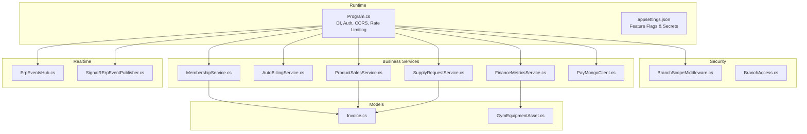
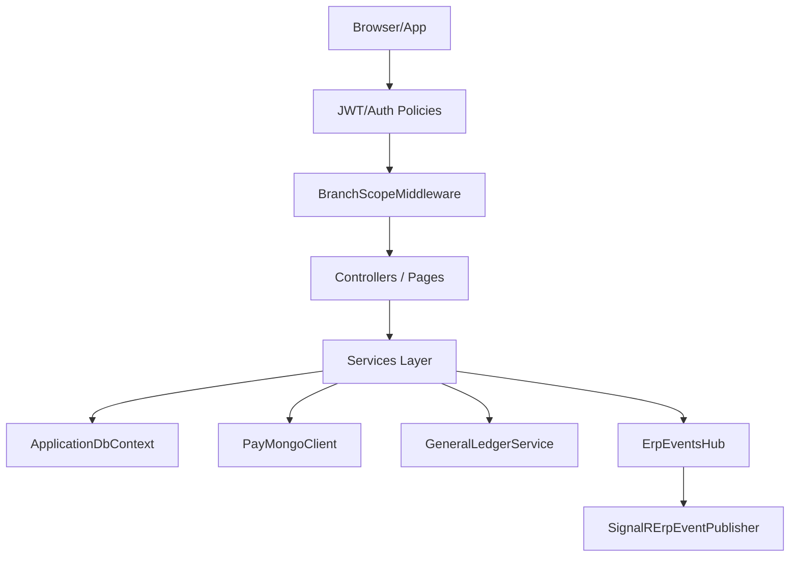
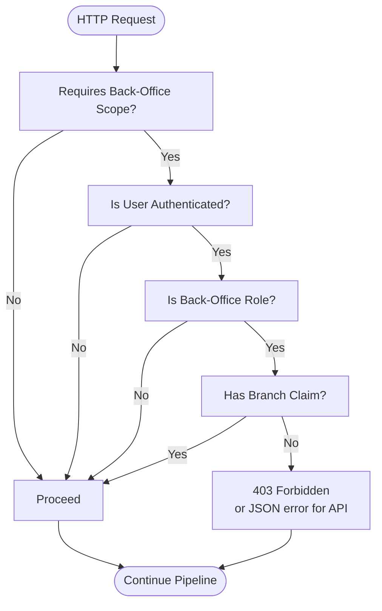
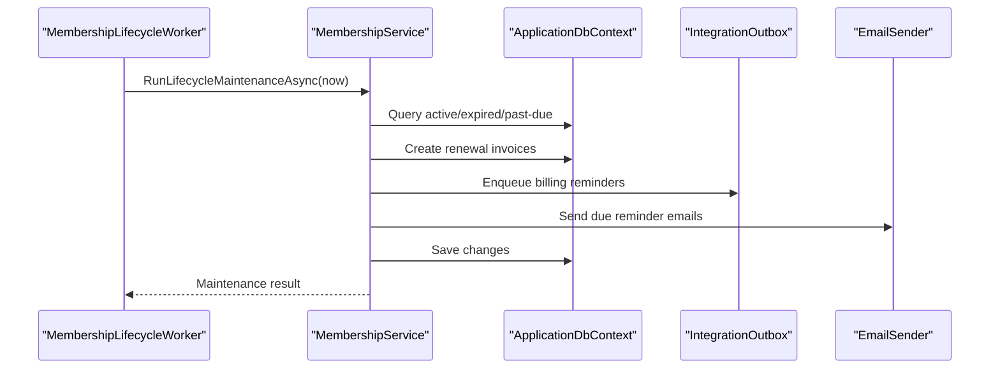
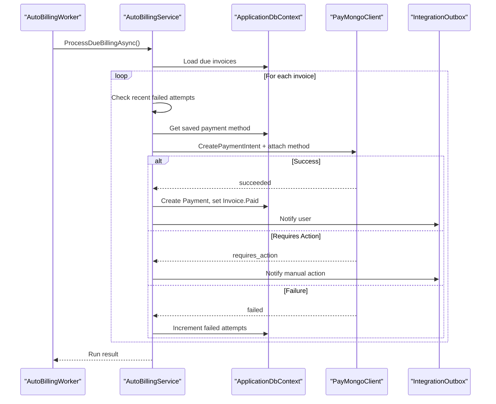
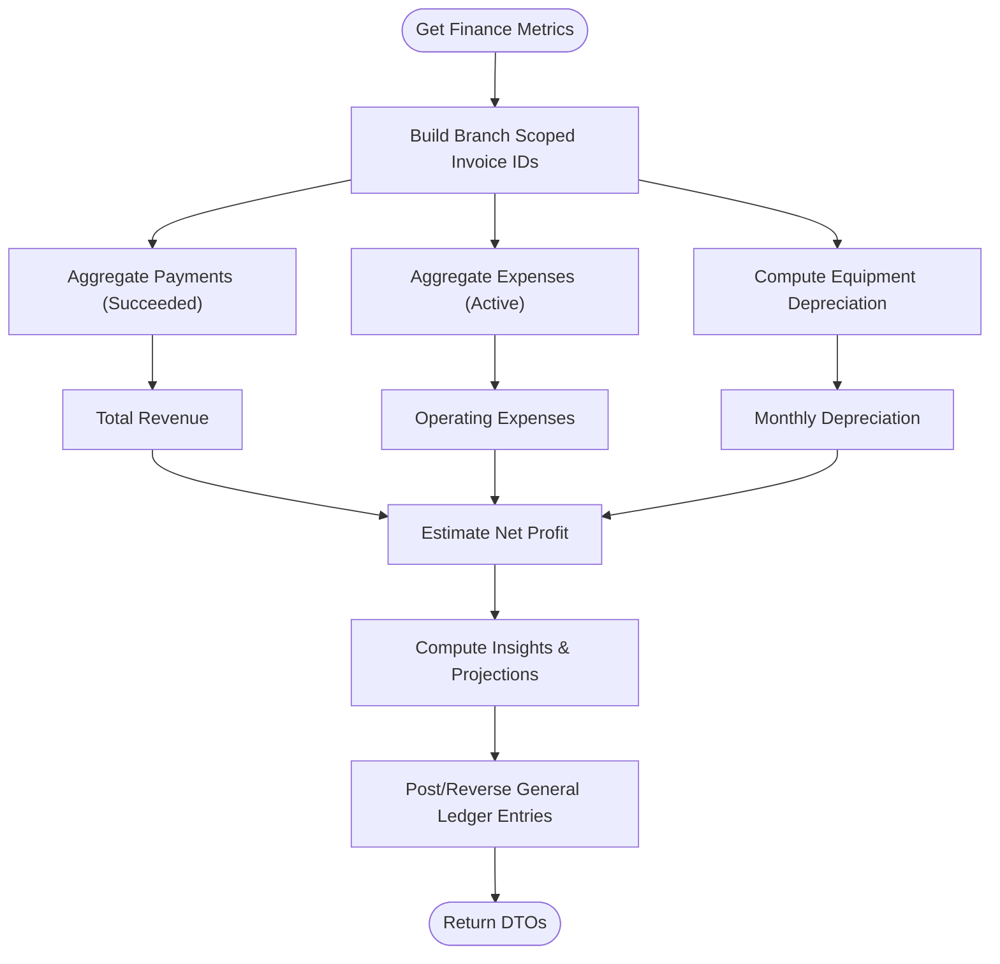
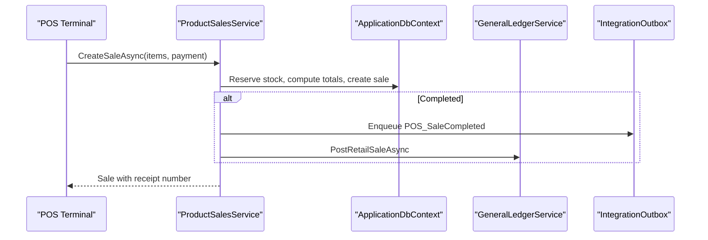
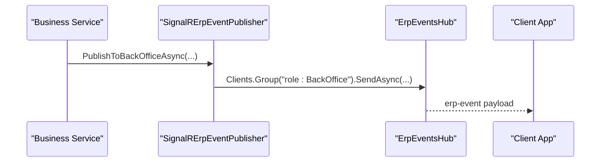
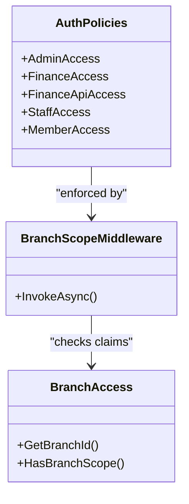
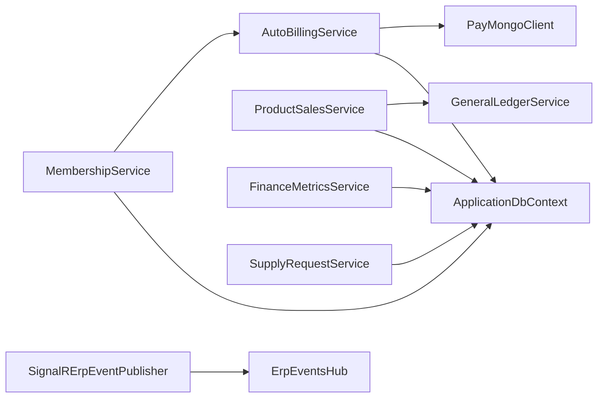

# Key Features Overview

<cite>
**Referenced Files in This Document**
- [README.md](file://README.md)
- [Program.cs](file://Program.cs)
- [appsettings.json](file://appsettings.json)
- [BranchScopeMiddleware.cs](file://Security/BranchScopeMiddleware.cs)
- [BranchAccess.cs](file://Security/BranchAccess.cs)
- [MembershipService.cs](file://Services/Memberships/MembershipService.cs)
- [AutoBillingService.cs](file://Services/Payments/AutoBillingService.cs)
- [FinanceMetricsService.cs](file://Services/Finance/FinanceMetricsService.cs)
- [SignalRErpEventPublisher.cs](file://Services/Realtime/SignalRErpEventPublisher.cs)
- [ErpEventsHub.cs](file://Hubs/ErpEventsHub.cs)
- [ProductSalesService.cs](file://Services/Inventory/ProductSalesService.cs)
- [SupplyRequestService.cs](file://Services/Inventory/SupplyRequestService.cs)
- [PayMongoClient.cs](file://Services/Payments/PayMongoClient.cs)
- [Invoice.cs](file://Models/Billing/Invoice.cs)
- [GymEquipmentAsset.cs](file://Models/Finance/GymEquipmentAsset.cs)
</cite>

## Table of Contents
1. [Introduction](#introduction)
2. [Project Structure](#project-structure)
3. [Core Components](#core-components)
4. [Architecture Overview](#architecture-overview)
5. [Detailed Component Analysis](#detailed-component-analysis)
6. [Dependency Analysis](#dependency-analysis)
7. [Performance Considerations](#performance-considerations)
8. [Troubleshooting Guide](#troubleshooting-guide)
9. [Conclusion](#conclusion)

## Introduction
This document presents a comprehensive overview of the system’s key capabilities and feature set. It explains how the platform delivers multi-branch operations with branch-scoped data isolation, automates membership lifecycles (signups, renewals, reminders), integrates financial tracking (expenses, revenue, and general ledger), manages gym equipment and retail inventory, orchestrates supply requests, automates billing with PayMongo, and provides real-time dashboards via SignalR. Security and compliance are addressed through RBAC, JWT authentication, rate limiting, and secure cookie/webhook verification.

## Project Structure
The system is organized around modular services, domain models, and layered concerns:
- Application entry and DI registration in Program.cs
- Configuration in appsettings.json
- Security middleware and claims-based branch scoping
- Business services for memberships, payments, finance, inventory, and real-time events
- SignalR hub for live dashboards and notifications
- Models for billing, finance, and inventory domains

**Diagram sources**
- [Program.cs:1-1075](file://Program.cs#L1-L1075)
- [appsettings.json:1-126](file://appsettings.json#L1-L126)
- [BranchScopeMiddleware.cs:1-73](file://Security/BranchScopeMiddleware.cs#L1-L73)
- [BranchAccess.cs:1-31](file://Security/BranchAccess.cs#L1-L31)
- [MembershipService.cs:1-597](file://Services/Memberships/MembershipService.cs#L1-L597)
- [AutoBillingService.cs:1-493](file://Services/Payments/AutoBillingService.cs#L1-L493)
- [FinanceMetricsService.cs:1-826](file://Services/Finance/FinanceMetricsService.cs#L1-L826)
- [ProductSalesService.cs:1-363](file://Services/Inventory/ProductSalesService.cs#L1-L363)
- [SupplyRequestService.cs:1-430](file://Services/Inventory/SupplyRequestService.cs#L1-L430)
- [PayMongoClient.cs:1-717](file://Services/Payments/PayMongoClient.cs#L1-L717)
- [ErpEventsHub.cs:1-50](file://Hubs/ErpEventsHub.cs#L1-L50)
- [SignalRErpEventPublisher.cs:1-101](file://Services/Realtime/SignalRErpEventPublisher.cs#L1-L101)
- [Invoice.cs:1-39](file://Models/Billing/Invoice.cs#L1-L39)
- [GymEquipmentAsset.cs:1-44](file://Models/Finance/GymEquipmentAsset.cs#L1-L44)

**Section sources**
- [README.md:1-91](file://README.md#L1-L91)
- [Program.cs:1-1075](file://Program.cs#L1-L1075)
- [appsettings.json:1-126](file://appsettings.json#L1-L126)

## Core Components
- Multi-branch support with branch-scoped data isolation enforced by claims and middleware
- Membership lifecycle automation: renewal invoice generation, overdue marking, reminders, and failed-checkout cleanup
- Financial tracking: revenue analytics, operating expenses, equipment asset aggregation, monthly snapshots, and general ledger integration
- Inventory and asset management: retail product sales with VAT, supply request workflows, and equipment asset tracking
- Automated billing: scheduled auto-charging, off-session capability checks, retry limits, and PayMongo integration
- Real-time operations: SignalR hub and publisher for live dashboards and notifications
- Security and compliance: RBAC policies, JWT authentication, rate limiting, secure cookies, and webhook signature verification

**Section sources**
- [Program.cs:315-343](file://Program.cs#L315-L343)
- [BranchScopeMiddleware.cs:14-53](file://Security/BranchScopeMiddleware.cs#L14-L53)
- [MembershipService.cs:248-460](file://Services/Memberships/MembershipService.cs#L248-L460)
- [FinanceMetricsService.cs:54-141](file://Services/Finance/FinanceMetricsService.cs#L54-L141)
- [ProductSalesService.cs:106-218](file://Services/Inventory/ProductSalesService.cs#L106-L218)
- [SupplyRequestService.cs:25-230](file://Services/Inventory/SupplyRequestService.cs#L25-L230)
- [AutoBillingService.cs:69-124](file://Services/Payments/AutoBillingService.cs#L69-L124)
- [PayMongoClient.cs:137-245](file://Services/Payments/PayMongoClient.cs#L137-L245)
- [SignalRErpEventPublisher.cs:19-54](file://Services/Realtime/SignalRErpEventPublisher.cs#L19-L54)
- [ErpEventsHub.cs:12-47](file://Hubs/ErpEventsHub.cs#L12-L47)

## Architecture Overview
The system follows a layered ASP.NET Core architecture with hosted workers for scheduled tasks, a SignalR hub for real-time updates, and modular services encapsulating business logic. Configuration-driven feature toggles and security policies govern runtime behavior.

**Diagram sources**
- [Program.cs:315-343](file://Program.cs#L315-L343)
- [Program.cs:395-396](file://Program.cs#L395-L396)
- [Program.cs:407-407](file://Program.cs#L407-L407)
- [ErpEventsHub.cs:7-47](file://Hubs/ErpEventsHub.cs#L7-L47)
- [SignalRErpEventPublisher.cs:6-17](file://Services/Realtime/SignalRErpEventPublisher.cs#L6-L17)

## Detailed Component Analysis

### Multi-Branch Support and Branch-Scoped Data Isolation
- Branch scoping is enforced via a dedicated middleware and claims-based authorization. Users must have a branch claim or be SuperAdmin to access back-office endpoints.
- Authorization policies require branch scope for Admin, Finance, Staff, and API routes.
- Middleware responds with JSON errors for API requests when branch scope is missing.

**Diagram sources**
- [BranchScopeMiddleware.cs:14-53](file://Security/BranchScopeMiddleware.cs#L14-L53)
- [BranchAccess.cs:9-28](file://Security/BranchAccess.cs#L9-L28)
- [Program.cs:315-343](file://Program.cs#L315-L343)

**Section sources**
- [BranchScopeMiddleware.cs:14-53](file://Security/BranchScopeMiddleware.cs#L14-L53)
- [BranchAccess.cs:9-28](file://Security/BranchAccess.cs#L9-L28)
- [Program.cs:315-343](file://Program.cs#L315-L343)

### Membership Lifecycle Automation
- Generates renewal invoices at cycle end for active subscriptions, marks expired subscriptions, overdue invoices, and queues reminders.
- Sends integration events and emails for reminders and lifecycle changes.
- Includes logic to void invoices resulting from failed checkouts.

**Diagram sources**
- [MembershipService.cs:248-460](file://Services/Memberships/MembershipService.cs#L248-L460)

**Section sources**
- [MembershipService.cs:248-460](file://Services/Memberships/MembershipService.cs#L248-L460)

### Automated Billing with PayMongo Integration
- Scheduled auto-billing runs within a grace window, respecting recent failed attempts and payment method capabilities.
- Charges saved payment methods, records payment attempts, and updates invoice/payment states.
- Handles 3D Secure requirements and disables auto-billing when unsupported.

**Diagram sources**
- [AutoBillingService.cs:69-124](file://Services/Payments/AutoBillingService.cs#L69-L124)
- [AutoBillingService.cs:126-377](file://Services/Payments/AutoBillingService.cs#L126-L377)
- [PayMongoClient.cs:137-245](file://Services/Payments/PayMongoClient.cs#L137-L245)

**Section sources**
- [AutoBillingService.cs:69-124](file://Services/Payments/AutoBillingService.cs#L69-L124)
- [AutoBillingService.cs:126-377](file://Services/Payments/AutoBillingService.cs#L126-L377)
- [PayMongoClient.cs:137-245](file://Services/Payments/PayMongoClient.cs#L137-L245)

### Financial Tracking and General Ledger Integration
- Computes revenue, operating expenses, equipment depreciation, and net profit over configurable windows.
- Provides insights with anomaly detection, trend projections, and risk signals.
- Monthly snapshots summarize revenue, costs, and invoice states; supports projection.
- Integrates with general ledger for retail sale postings and reversals.

**Diagram sources**
- [FinanceMetricsService.cs:54-141](file://Services/Finance/FinanceMetricsService.cs#L54-L141)
- [FinanceMetricsService.cs:143-285](file://Services/Finance/FinanceMetricsService.cs#L143-L285)
- [FinanceMetricsService.cs:330-473](file://Services/Finance/FinanceMetricsService.cs#L330-L473)

**Section sources**
- [FinanceMetricsService.cs:54-141](file://Services/Finance/FinanceMetricsService.cs#L54-L141)
- [FinanceMetricsService.cs:143-285](file://Services/Finance/FinanceMetricsService.cs#L143-L285)
- [FinanceMetricsService.cs:330-473](file://Services/Finance/FinanceMetricsService.cs#L330-L473)

### Inventory and Asset Management
- Retail product sales compute subtotal, VAT (12%), and totals, update stock, and post general ledger entries.
- Supply request workflow supports creation, approval, ordering, receiving drafts, confirming receipts, invoicing, payment, auditing, and cancellation.
- Automatic inventory synchronization on receipt confirmation and product creation from supply requests.

**Diagram sources**
- [ProductSalesService.cs:106-218](file://Services/Inventory/ProductSalesService.cs#L106-L218)
- [ProductSalesService.cs:244-294](file://Services/Inventory/ProductSalesService.cs#L244-L294)

**Section sources**
- [ProductSalesService.cs:106-218](file://Services/Inventory/ProductSalesService.cs#L106-L218)
- [ProductSalesService.cs:244-294](file://Services/Inventory/ProductSalesService.cs#L244-L294)
- [SupplyRequestService.cs:25-230](file://Services/Inventory/SupplyRequestService.cs#L25-L230)
- [SupplyRequestService.cs:320-360](file://Services/Inventory/SupplyRequestService.cs#L320-L360)

### Real-Time Operations with SignalR
- SignalR hub assigns connections to groups based on roles and user identity.
- Event publisher sends ERP events to back-office, role-specific, and user-specific groups.
- Frontend subscribes to groups to receive live updates.

**Diagram sources**
- [SignalRErpEventPublisher.cs:19-54](file://Services/Realtime/SignalRErpEventPublisher.cs#L19-L54)
- [ErpEventsHub.cs:12-47](file://Hubs/ErpEventsHub.cs#L12-L47)

**Section sources**
- [SignalRErpEventPublisher.cs:19-54](file://Services/Realtime/SignalRErpEventPublisher.cs#L19-L54)
- [ErpEventsHub.cs:12-47](file://Hubs/ErpEventsHub.cs#L12-L47)

### Security and Compliance
- RBAC policies restrict access to Admin, Finance, Staff, and Member areas; all except Member require branch scope.
- JWT bearer authentication is supported with configurable signing key and audiences; cookie fallback is available.
- Rate limiting protects against abuse with fixed-window policies for anonymous and authenticated users.
- Secure cookies and forwarded header trust are configurable; production requires secure cookies and webhook signatures.

**Diagram sources**
- [Program.cs:315-343](file://Program.cs#L315-L343)
- [BranchScopeMiddleware.cs:14-53](file://Security/BranchScopeMiddleware.cs#L14-L53)
- [BranchAccess.cs:9-28](file://Security/BranchAccess.cs#L9-L28)

**Section sources**
- [Program.cs:315-343](file://Program.cs#L315-L343)
- [Program.cs:439-456](file://Program.cs#L439-L456)
- [Program.cs:271-313](file://Program.cs#L271-L313)

## Dependency Analysis
- Services depend on ApplicationDbContext for persistence and on each other for cross-cutting integrations (e.g., membership triggers billing, sales trigger GL).
- PayMongoClient encapsulates external payment orchestration; AutoBillingService coordinates payment attempts and retries.
- FinanceMetricsService aggregates data across invoices, payments, expenses, and equipment assets.
- SignalR publisher decouples real-time delivery from business services.

**Diagram sources**
- [MembershipService.cs:1-26](file://Services/Memberships/MembershipService.cs#L1-L26)
- [AutoBillingService.cs:44-67](file://Services/Payments/AutoBillingService.cs#L44-L67)
- [PayMongoClient.cs:13-24](file://Services/Payments/PayMongoClient.cs#L13-L24)
- [ProductSalesService.cs:11-27](file://Services/Inventory/ProductSalesService.cs#L11-L27)
- [FinanceMetricsService.cs:9-52](file://Services/Finance/FinanceMetricsService.cs#L9-L52)
- [SignalRErpEventPublisher.cs:6-17](file://Services/Realtime/SignalRErpEventPublisher.cs#L6-L17)
- [ErpEventsHub.cs:7-8](file://Hubs/ErpEventsHub.cs#L7-L8)

**Section sources**
- [MembershipService.cs:1-26](file://Services/Memberships/MembershipService.cs#L1-L26)
- [AutoBillingService.cs:44-67](file://Services/Payments/AutoBillingService.cs#L44-L67)
- [PayMongoClient.cs:13-24](file://Services/Payments/PayMongoClient.cs#L13-L24)
- [ProductSalesService.cs:11-27](file://Services/Inventory/ProductSalesService.cs#L11-L27)
- [FinanceMetricsService.cs:9-52](file://Services/Finance/FinanceMetricsService.cs#L9-L52)
- [SignalRErpEventPublisher.cs:6-17](file://Services/Realtime/SignalRErpEventPublisher.cs#L6-L17)
- [ErpEventsHub.cs:7-8](file://Hubs/ErpEventsHub.cs#L7-L8)

## Performance Considerations
- Batch processing: AutoBillingService caps batch size for due invoices per run to balance throughput and latency.
- Query optimization: MembershipService uses efficient ordering and pagination for subscription history and lifecycle maintenance.
- Caching: Distributed cache and session are configured for POS cart state and cross-origin allowances are tuned for production.
- Retry and back-off: PayMongo integration respects retry limits and gracefully handles 3D Secure requirements.

[No sources needed since this section provides general guidance]

## Troubleshooting Guide
- Branch scope errors: Ensure users have a branch claim or are SuperAdmin; API endpoints return structured errors when missing.
- Auto-billing failures: Review recent failed attempts, payment method status, and whether PayMongo supports off-session auto-billing.
- PayMongo webhook verification: In production, configure webhook secret and signature tolerance; otherwise, webhook signature verification is not required.
- Finance insights anomalies: Investigate high-severity anomalies and recent trends; adjust lookback/forecast windows as needed.
- Real-time events: Verify SignalR connection groups and authentication; clients should subscribe to role:user groups.

**Section sources**
- [BranchScopeMiddleware.cs:41-53](file://Security/BranchScopeMiddleware.cs#L41-L53)
- [AutoBillingService.cs:148-208](file://Services/Payments/AutoBillingService.cs#L148-L208)
- [appsettings.json:43-43](file://appsettings.json#L43-L43)
- [FinanceMetricsService.cs:536-625](file://Services/Finance/FinanceMetricsService.cs#L536-L625)
- [ErpEventsHub.cs:12-47](file://Hubs/ErpEventsHub.cs#L12-L47)

## Conclusion
The system delivers an enterprise-grade, multi-branch gym management platform with robust automation across memberships, billing, finance, inventory, and real-time operations. Its modular services, strong security posture, and integration-ready design enable scalable growth while maintaining operational excellence and compliance.