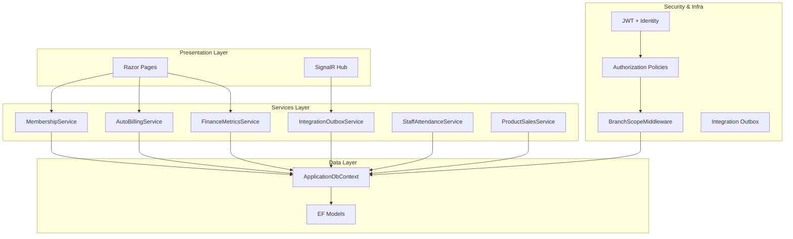
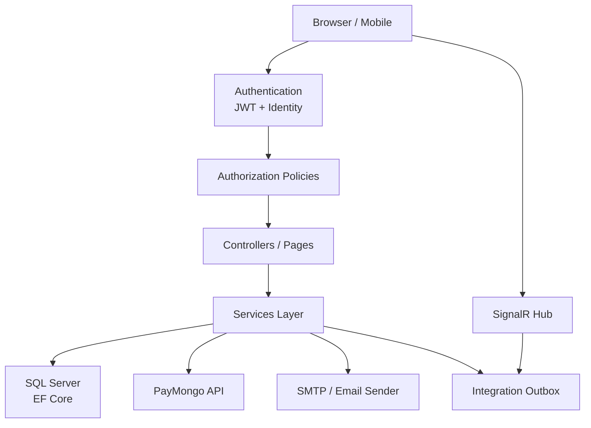
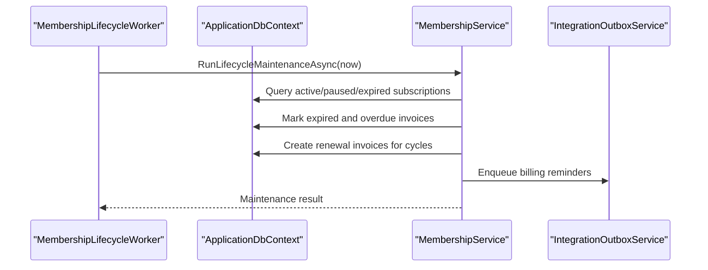
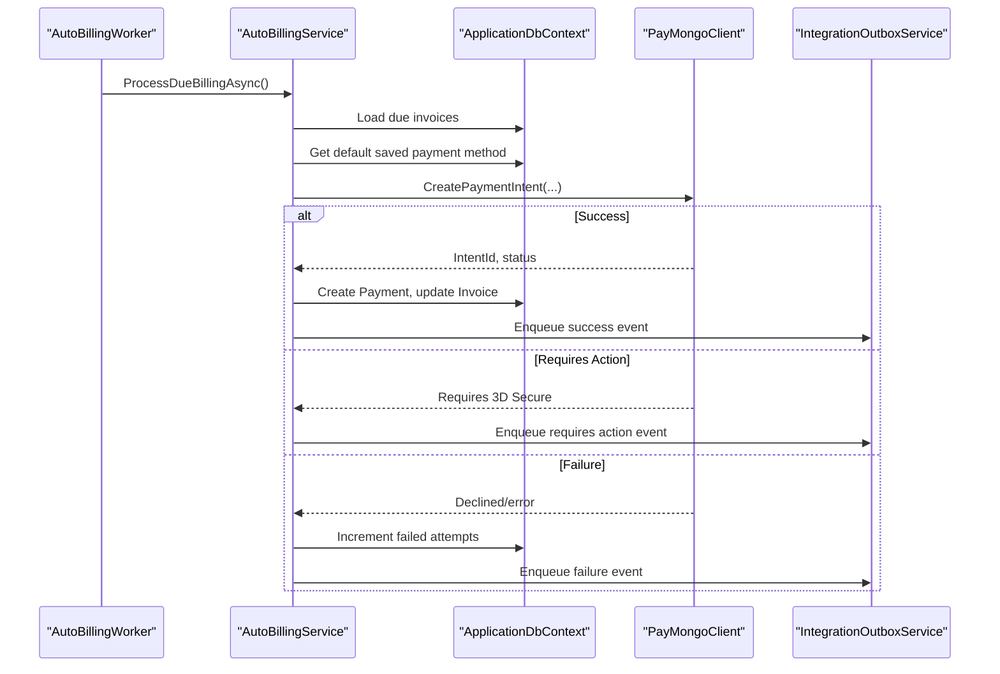
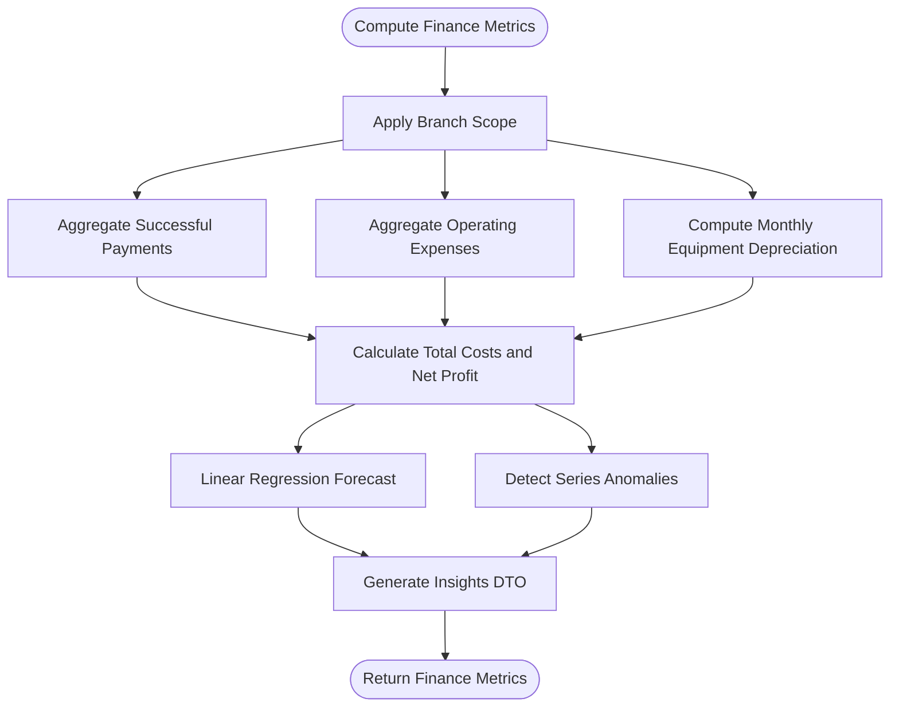
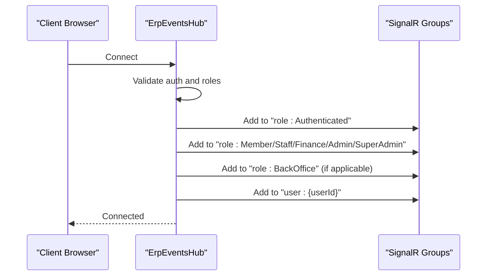
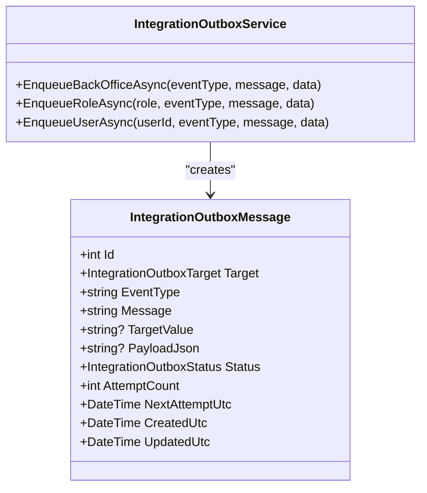
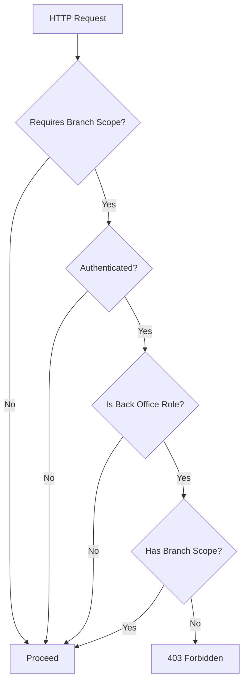
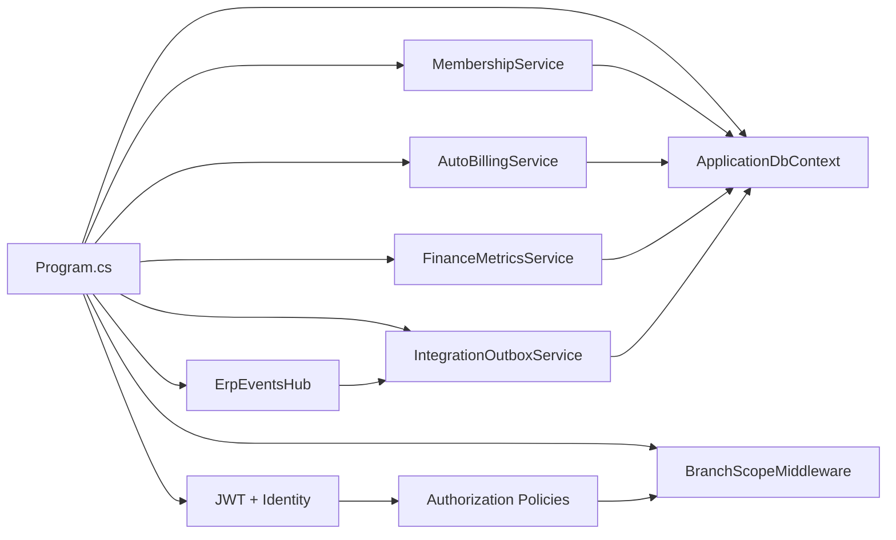

# Project Overview

<cite>
**Referenced Files in This Document**
- [README.md](file://README.md)
- [Program.cs](file://Program.cs)
- [EJCFitnessGym.csproj](file://EJCFitnessGym.csproj)
- [appsettings.json](file://appsettings.json)
- [ApplicationDbContext.cs](file://Data/ApplicationDbContext.cs)
- [MembershipService.cs](file://Services/Memberships/MembershipService.cs)
- [AutoBillingService.cs](file://Services/Payments/AutoBillingService.cs)
- [FinanceMetricsService.cs](file://Services/Finance/FinanceMetricsService.cs)
- [ErpEventsHub.cs](file://Hubs/ErpEventsHub.cs)
- [IntegrationOutboxService.cs](file://Services/Integration/IntegrationOutboxService.cs)
- [BranchScopeMiddleware.cs](file://Security/BranchScopeMiddleware.cs)
- [Invoice.cs](file://Models/Billing/Invoice.cs)
- [BranchRecord.cs](file://Models/Admin/BranchRecord.cs)
- [IntegrationOutboxMessage.cs](file://Models/Integration/IntegrationOutboxMessage.cs)
- [DashboardControllerTests.cs](file://EJCFitnessGym.Tests/DashboardControllerTests.cs)
- [MemberAccountsControllerTests.cs](file://EJCFitnessGym.Tests/MemberAccountsControllerTests.cs)
</cite>

## Table of Contents
1. [Introduction](#introduction)
2. [Project Structure](#project-structure)
3. [Core Components](#core-components)
4. [Architecture Overview](#architecture-overview)
5. [Detailed Component Analysis](#detailed-component-analysis)
6. [Dependency Analysis](#dependency-analysis)
7. [Performance Considerations](#performance-considerations)
8. [Troubleshooting Guide](#troubleshooting-guide)
9. [Conclusion](#conclusion)

## Introduction
EJC Fitness Gym is a comprehensive, enterprise-grade Enterprise Resource Planning (ERP) and Gym Management System designed to streamline multi-branch fitness business operations. It centralizes membership lifecycle management, automated billing, financial tracking, inventory and asset management, staff operations, and real-time dashboards into a unified platform. Built with modern .NET technologies, it emphasizes scalability, security, and operational excellence for gym operators, fitness chain managers, and multi-location business owners.

Key value propositions:
- Multi-branch orchestration with branch-scoped data and access controls
- End-to-end membership lifecycle automation (signups, renewals, reminders, expirations)
- Automated billing with PayMongo integration and intelligent retry/monitoring
- Financial insights with revenue, expenses, depreciation, and forecasting
- Real-time operations via SignalR for live dashboards and notifications
- Robust security with RBAC, JWT, rate limiting, and secure cookies

## Project Structure
The system follows a layered, modular architecture:
- Presentation: Razor Pages for UI and SignalR hubs for real-time events
- Services: Business logic modules for memberships, payments, finance, inventory, staff, AI, monitoring, and integration
- Data: Entity Framework Core models and migrations for SQL Server
- Security: Branch-scoped middleware, policies, and claims-based authorization
- Infrastructure: Integration outbox for decoupled event delivery and hosted workers for background tasks

**Diagram sources**
- [Program.cs:364-380](file://Program.cs#L364-L380)
- [ApplicationDbContext.cs:12-414](file://Data/ApplicationDbContext.cs#L12-L414)
- [ErpEventsHub.cs:7-48](file://Hubs/ErpEventsHub.cs#L7-L48)
- [IntegrationOutboxService.cs:7-94](file://Services/Integration/IntegrationOutboxService.cs#L7-L94)

**Section sources**
- [README.md:77-86](file://README.md#L77-L86)
- [Program.cs:364-380](file://Program.cs#L364-L380)

## Core Components
- Membership lifecycle management: automated renewal invoicing, expiration handling, reminders, and integration events
- Automated billing: off-session charging via PayMongo, retry logic, and payment method management
- Financial tracking: revenue, expenses, depreciation, monthly snapshots, forecasting, and anomaly detection
- Inventory and assets: retail products, supply requests, equipment asset tracking
- Staff operations: attendance logging, auto-close workflows, POS integrations
- Real-time operations: SignalR hub for live dashboards and targeted notifications
- Integration outbox: reliable asynchronous event delivery to users, roles, and back office
- Security and compliance: RBAC, JWT, rate limiting, forwarded headers security, and branch-scoped access

Typical use cases:
- Gym operator: manage members, view revenue trends, approve supply requests, monitor equipment
- Finance manager: track expenses, generate forecasts, review alerts, reconcile payments
- Staff: check-in members, log attendance, process POS sales, submit replacement requests
- Super admin: configure branches, manage user roles, oversee system health and integrations

**Section sources**
- [README.md:5-24](file://README.md#L5-L24)
- [MembershipService.cs:248-460](file://Services/Memberships/MembershipService.cs#L248-L460)
- [AutoBillingService.cs:69-124](file://Services/Payments/AutoBillingService.cs#L69-L124)
- [FinanceMetricsService.cs:54-141](file://Services/Finance/FinanceMetricsService.cs#L54-L141)
- [ErpEventsHub.cs:12-47](file://Hubs/ErpEventsHub.cs#L12-L47)
- [IntegrationOutboxService.cs:18-58](file://Services/Integration/IntegrationOutboxService.cs#L18-L58)
- [BranchScopeMiddleware.cs:14-53](file://Security/BranchScopeMiddleware.cs#L14-L53)

## Architecture Overview
The system employs an enterprise-grade, layered architecture:
- Web Application: ASP.NET Core 8.0 with Razor Pages and SignalR
- Authentication and Authorization: ASP.NET Core Identity, JWT bearer, and role-based policies
- Data Access: Entity Framework Core with SQL Server, branch-scoped queries, and audit-friendly models
- Background Processing: Hosted services for membership maintenance, auto billing, finance alerts, and staff attendance
- Integrations: PayMongo for payments, SMTP/email sender, and an integration outbox for event delivery
- Security Controls: Rate limiting, forwarded headers security, CORS, and branch-scoped middleware

**Diagram sources**
- [Program.cs:199-270](file://Program.cs#L199-L270)
- [Program.cs:364-407](file://Program.cs#L364-L407)
- [Program.cs:395](file://Program.cs#L395)
- [Program.cs:409-437](file://Program.cs#L409-L437)
- [Program.cs:439-456](file://Program.cs#L439-L456)
- [Program.cs:473-507](file://Program.cs#L473-L507)

## Detailed Component Analysis

### Membership Lifecycle Management
The membership module automates renewals, expiration, overdue handling, and reminder notifications. It generates invoices at billing cycle boundaries, marks expired subscriptions, and enqueues integration events for reminders and back office visibility.

**Diagram sources**
- [MembershipService.cs:248-460](file://Services/Memberships/MembershipService.cs#L248-L460)
- [IntegrationOutboxService.cs:18-58](file://Services/Integration/IntegrationOutboxService.cs#L18-L58)

**Section sources**
- [MembershipService.cs:28-197](file://Services/Memberships/MembershipService.cs#L28-L197)
- [MembershipService.cs:248-460](file://Services/Memberships/MembershipService.cs#L248-L460)
- [Invoice.cs:5-39](file://Models/Billing/Invoice.cs#L5-L39)

### Automated Billing with PayMongo
The auto billing service charges due invoices using saved payment methods, handles retries, and disables failing methods. It integrates with PayMongo for payment intents and emits integration events for member notifications.

**Diagram sources**
- [AutoBillingService.cs:69-124](file://Services/Payments/AutoBillingService.cs#L69-L124)
- [AutoBillingService.cs:226-377](file://Services/Payments/AutoBillingService.cs#L226-L377)
- [IntegrationOutboxService.cs:18-58](file://Services/Integration/IntegrationOutboxService.cs#L18-L58)

**Section sources**
- [AutoBillingService.cs:44-463](file://Services/Payments/AutoBillingService.cs#L44-L463)

### Financial Tracking and Insights
The finance module computes revenue, expenses, depreciation, and monthly snapshots. It also forecasts future performance and detects anomalies to support proactive decision-making.

**Diagram sources**
- [FinanceMetricsService.cs:54-141](file://Services/Finance/FinanceMetricsService.cs#L54-L141)
- [FinanceMetricsService.cs:143-285](file://Services/Finance/FinanceMetricsService.cs#L143-L285)
- [FinanceMetricsService.cs:330-473](file://Services/Finance/FinanceMetricsService.cs#L330-L473)

**Section sources**
- [FinanceMetricsService.cs:9-52](file://Services/Finance/FinanceMetricsService.cs#L9-L52)
- [FinanceMetricsService.cs:54-141](file://Services/Finance/FinanceMetricsService.cs#L54-L141)
- [FinanceMetricsService.cs:143-285](file://Services/Finance/FinanceMetricsService.cs#L143-L285)

### Real-Time Operations with SignalR
The SignalR hub connects authenticated users and organizes them into groups by role and user identity. It enables live dashboards and targeted notifications for members, staff, finance, admins, and back office.

**Diagram sources**
- [ErpEventsHub.cs:12-47](file://Hubs/ErpEventsHub.cs#L12-L47)

**Section sources**
- [ErpEventsHub.cs:7-48](file://Hubs/ErpEventsHub.cs#L7-L48)

### Integration Outbox and Decoupled Events
The integration outbox pattern ensures reliable delivery of events to users, roles, or back office. Hosted workers poll and dispatch messages, maintaining idempotency and retry semantics.

**Diagram sources**
- [IntegrationOutboxService.cs:7-94](file://Services/Integration/IntegrationOutboxService.cs#L7-L94)
- [IntegrationOutboxMessage.cs:5-57](file://Models/Integration/IntegrationOutboxMessage.cs#L5-L57)

**Section sources**
- [IntegrationOutboxService.cs:7-94](file://Services/Integration/IntegrationOutboxService.cs#L7-L94)
- [IntegrationOutboxMessage.cs:42-57](file://Models/Integration/IntegrationOutboxMessage.cs#L42-L57)

### Branch Scoping and Access Control
Branch-scoped middleware enforces that back office users must have a branch assignment before accessing admin/finance/staff resources. Authorization policies combine role checks with branch scope assertions.

**Diagram sources**
- [BranchScopeMiddleware.cs:14-53](file://Security/BranchScopeMiddleware.cs#L14-L53)
- [Program.cs:315-343](file://Program.cs#L315-L343)

**Section sources**
- [BranchScopeMiddleware.cs:5-73](file://Security/BranchScopeMiddleware.cs#L5-L73)
- [Program.cs:315-343](file://Program.cs#L315-L343)

## Dependency Analysis
The system’s dependency graph highlights core relationships among services, data, and infrastructure.

**Diagram sources**
- [Program.cs:364-380](file://Program.cs#L364-L380)
- [Program.cs:395](file://Program.cs#L395)
- [Program.cs:473-507](file://Program.cs#L473-L507)

**Section sources**
- [Program.cs:364-380](file://Program.cs#L364-L380)
- [Program.cs:395](file://Program.cs#L395)
- [Program.cs:473-507](file://Program.cs#L473-L507)

## Performance Considerations
- Database indexing: branch-scoped fields, invoice numbers, payment references, and date-based filters are indexed to optimize queries across large datasets
- Decimal precision: monetary fields use precise scale to avoid rounding errors in billing and finance
- Batched processing: auto billing caps per run to control load and improve throughput predictability
- Caching and minimal tracking: service methods use AsNoTracking for read-heavy operations where appropriate
- Background workers: hosted services schedule periodic maintenance to reduce peak load on request threads

[No sources needed since this section provides general guidance]

## Troubleshooting Guide
Common issues and resolutions:
- Authentication failures: ensure JWT signing key is configured in production and that Google OAuth secrets are set when enabled
- Branch access denied: back office users must have a branch assignment; verify claims and role assignments
- PayMongo webhooks: webhook secret must be configured outside development; otherwise, signature verification fails
- Email delivery: SMTP must be configured or logging sender used in non-development environments
- Database migrations: apply migrations at startup; failures indicate connection or migration conflicts

**Section sources**
- [Program.cs:90-105](file://Program.cs#L90-L105)
- [Program.cs:175-197](file://Program.cs#L175-L197)
- [Program.cs:397-406](file://Program.cs#L397-L406)
- [Program.cs:718-775](file://Program.cs#L718-L775)

## Conclusion
EJC Fitness Gym delivers a robust, scalable ERP tailored for multi-branch fitness operations. Its enterprise-grade design combines modern .NET technologies with pragmatic patterns—branch scoping, integration outbox, hosted workers, and SignalR—to address real-world challenges in membership, billing, finance, and operations. The system’s comprehensive test coverage and modular architecture support ongoing evolution and reliability across diverse gym ecosystems.