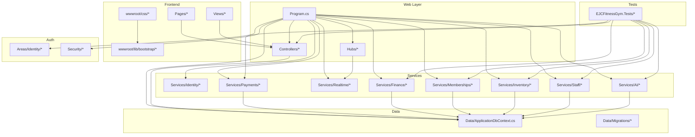
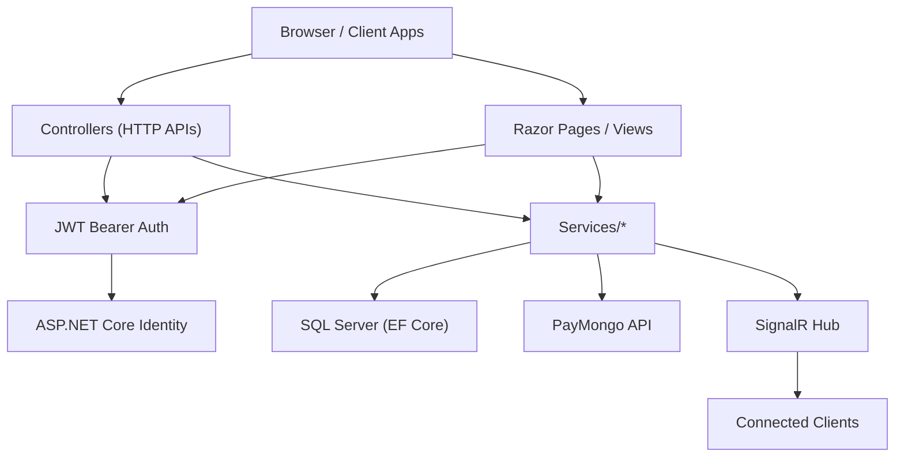
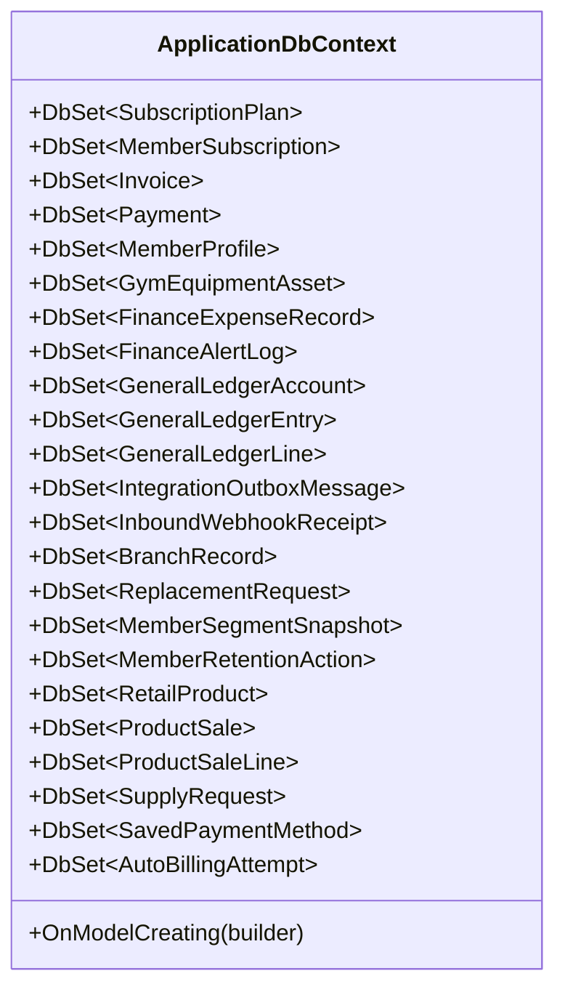
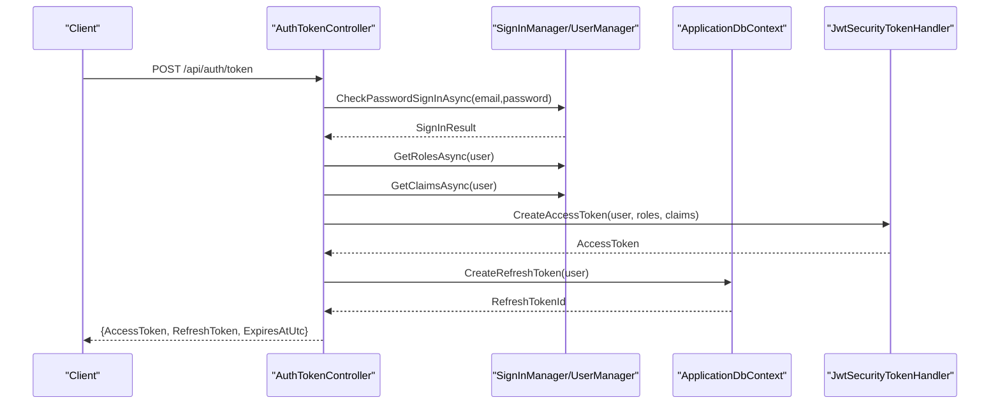
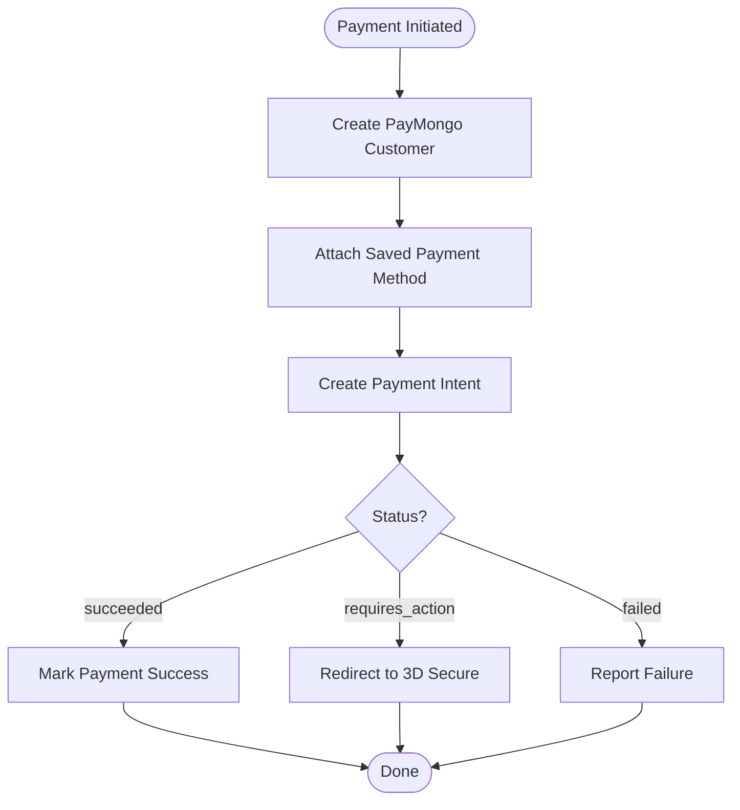
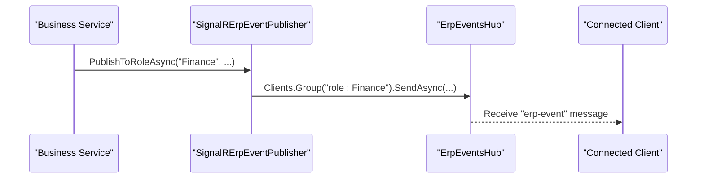

# Technology Stack

<cite>
**Referenced Files in This Document**
- [EJCFitnessGym.csproj](file://EJCFitnessGym.csproj)
- [Program.cs](file://Program.cs)
- [appsettings.json](file://appsettings.json)
- [README.md](file://README.md)
- [ApplicationDbContext.cs](file://Data/ApplicationDbContext.cs)
- [ErpEventsHub.cs](file://Hubs/ErpEventsHub.cs)
- [PayMongoClient.cs](file://Services/Payments/PayMongoClient.cs)
- [SignalRErpEventPublisher.cs](file://Services/Realtime/SignalRErpEventPublisher.cs)
- [JwtOptions.cs](file://Security/JwtOptions.cs)
- [AuthTokenController.cs](file://Controllers/AuthTokenController.cs)
- [site.css](file://wwwroot/css/site.css)
- [bootstrap.min.css](file://wwwroot/lib/bootstrap/dist/css/bootstrap.min.css)
- [EJCFitnessGym.Tests.csproj](file://EJCFitnessGym.Tests/EJCFitnessGym.Tests.csproj)
</cite>

## Table of Contents
1. [Introduction](#introduction)
2. [Project Structure](#project-structure)
3. [Core Components](#core-components)
4. [Architecture Overview](#architecture-overview)
5. [Detailed Component Analysis](#detailed-component-analysis)
6. [Dependency Analysis](#dependency-analysis)
7. [Performance Considerations](#performance-considerations)
8. [Troubleshooting Guide](#troubleshooting-guide)
9. [Conclusion](#conclusion)

## Introduction
This document describes the complete technology stack powering the EJC Fitness Gym ERP system. It covers the backend web framework (ASP.NET Core 8.0), data persistence (SQL Server with Entity Framework Core using code-first), authentication (ASP.NET Core Identity with JWT), payment processing (PayMongo integration), real-time communication (SignalR), testing (xUnit), and frontend technologies (Razor Pages, Bootstrap 5, and vanilla CSS). It also outlines version compatibility, third-party dependencies, and the architectural decisions that support performance, scalability, and maintainability.

## Project Structure
The solution follows a layered, modular structure:
- Web entrypoint and DI configuration in Program.cs
- Data access via ApplicationDbContext and EF Core migrations
- Business logic organized under Services namespaces
- Real-time capabilities via SignalR hubs
- Authentication APIs under Controllers
- Frontend assets under wwwroot (Bootstrap 5, custom CSS)
- Identity pages under Areas/Identity
- Test suite under EJCFitnessGym.Tests

**Diagram sources**
- [Program.cs:32-473](file://Program.cs#L32-L473)
- [ApplicationDbContext.cs:10-414](file://Data/ApplicationDbContext.cs#L10-L414)
- [ErpEventsHub.cs:1-50](file://Hubs/ErpEventsHub.cs#L1-L50)
- [PayMongoClient.cs:1-717](file://Services/Payments/PayMongoClient.cs#L1-L717)
- [SignalRErpEventPublisher.cs:1-101](file://Services/Realtime/SignalRErpEventPublisher.cs#L1-L101)
- [AuthTokenController.cs:16-597](file://Controllers/AuthTokenController.cs#L16-L597)

**Section sources**
- [README.md:1-91](file://README.md#L1-L91)
- [Program.cs:32-473](file://Program.cs#L32-L473)

## Core Components
- ASP.NET Core 8.0: Web framework and runtime for cross-platform server applications.
- SQL Server with Entity Framework Core (code-first): Relational data modeling, migrations, and database operations.
- ASP.NET Core Identity: User management, roles, claims, and cookie-based authentication.
- JWT Bearer Authentication: Stateless API authentication with refresh token management.
- PayMongo Integration: Online payment processing, checkout sessions, and webhook handling.
- SignalR: Real-time communication for live dashboards and event broadcasting.
- xUnit: Unit and integration testing framework with 70+ tests.
- Frontend: Razor Pages for server-rendered UI, Bootstrap 5 for responsive layout, and custom CSS.

**Section sources**
- [EJCFitnessGym.csproj:1-37](file://EJCFitnessGym.csproj#L1-L37)
- [Program.cs:56-407](file://Program.cs#L56-L407)
- [appsettings.json:1-126](file://appsettings.json#L1-L126)
- [README.md:25-34](file://README.md#L25-L34)

## Architecture Overview
The system employs a layered architecture:
- Presentation: Razor Pages for UI, controllers for API endpoints.
- Application: Services encapsulate business logic (Finance, Inventory, Payments, Staff, AI).
- Infrastructure: Data access via ApplicationDbContext and EF Core, SignalR hubs for real-time events.
- External Integrations: PayMongo for payment processing, Google OAuth for external sign-in.

**Diagram sources**
- [Program.cs:199-270](file://Program.cs#L199-L270)
- [AuthTokenController.cs:18-201](file://Controllers/AuthTokenController.cs#L18-L201)
- [ApplicationDbContext.cs:12-414](file://Data/ApplicationDbContext.cs#L12-L414)
- [PayMongoClient.cs:13-717](file://Services/Payments/PayMongoClient.cs#L13-L717)
- [ErpEventsHub.cs:7-48](file://Hubs/ErpEventsHub.cs#L7-L48)

## Detailed Component Analysis

### ASP.NET Core 8.0 and Hosting
- WebApplicationBuilder configures services, middleware pipeline, authentication, authorization, CORS, rate limiting, health checks, SignalR, and hosted services.
- Environment-aware logging and Windows Event Log filtering.
- Database connection via Entity Framework Core with auditing interceptor registration.

**Section sources**
- [Program.cs:32-118](file://Program.cs#L32-L118)
- [Program.cs:56-61](file://Program.cs#L56-L61)
- [Program.cs:473-780](file://Program.cs#L473-L780)

### Data Persistence with Entity Framework Core (Code-First)
- ApplicationDbContext extends IdentityDbContext and defines entity sets for subscriptions, invoices, payments, memberships, finance, inventory, staff, and integration artifacts.
- Extensive model configuration with precision for monetary values, composite indexes, cascading deletes, and unique constraints.
- Migrations applied at startup and seeded with default branch and GL accounts.

**Diagram sources**
- [ApplicationDbContext.cs:12-414](file://Data/ApplicationDbContext.cs#L12-L414)

**Section sources**
- [ApplicationDbContext.cs:19-42](file://Data/ApplicationDbContext.cs#L19-L42)
- [ApplicationDbContext.cs:43-411](file://Data/ApplicationDbContext.cs#L43-L411)
- [Program.cs:718-790](file://Program.cs#L718-L790)

### Authentication and Authorization
- ASP.NET Core Identity with role-based policies (Admin, Finance, Staff, Member, SuperAdmin) and branch-scoped access.
- Dual authentication scheme: cookie-based for UI and JWT Bearer for APIs.
- JWT configuration supports issuer, audience, signing key, token lifetimes, and refresh token management.
- Rate limiting for authentication endpoints.

**Diagram sources**
- [AuthTokenController.cs:49-117](file://Controllers/AuthTokenController.cs#L49-L117)
- [JwtOptions.cs:3-12](file://Security/JwtOptions.cs#L3-L12)
- [Program.cs:214-257](file://Program.cs#L214-L257)

**Section sources**
- [Program.cs:63-85](file://Program.cs#L63-L85)
- [Program.cs:199-270](file://Program.cs#L199-L270)
- [Program.cs:315-343](file://Program.cs#L315-L343)
- [JwtOptions.cs:3-12](file://Security/JwtOptions.cs#L3-L12)
- [AuthTokenController.cs:18-201](file://Controllers/AuthTokenController.cs#L18-L201)

### Payment Processing with PayMongo
- PayMongoClient encapsulates customer creation, payment method attachment, payment intents, and checkout sessions.
- Supports automatic capture, 3D Secure handling, and webhook-safe lookup of payment statuses.
- Configuration via appsettings PayMongo section with secret/public keys and webhook signature requirements.

**Diagram sources**
- [PayMongoClient.cs:26-245](file://Services/Payments/PayMongoClient.cs#L26-L245)
- [appsettings.json:37-44](file://appsettings.json#L37-L44)

**Section sources**
- [PayMongoClient.cs:13-717](file://Services/Payments/PayMongoClient.cs#L13-L717)
- [appsettings.json:37-44](file://appsettings.json#L37-L44)

### Real-Time Communication with SignalR
- ErpEventsHub groups connected clients by authentication state, user ID, and role for targeted messaging.
- SignalRErpEventPublisher publishes events to groups (e.g., BackOffice, specific roles, individual users).
- Real-time dashboards and notifications leverage SignalR hubs.

**Diagram sources**
- [SignalRErpEventPublisher.cs:6-99](file://Services/Realtime/SignalRErpEventPublisher.cs#L6-L99)
- [ErpEventsHub.cs:7-48](file://Hubs/ErpEventsHub.cs#L7-L48)

**Section sources**
- [Program.cs:395-395](file://Program.cs#L395-L395)
- [ErpEventsHub.cs:7-48](file://Hubs/ErpEventsHub.cs#L7-L48)
- [SignalRErpEventPublisher.cs:6-99](file://Services/Realtime/SignalRErpEventPublisher.cs#L6-L99)

### Testing Framework (xUnit)
- EJCFitnessGym.Tests project targets net8.0 with xUnit, coverlet, and EF providers for in-memory and SQLite testing.
- Tests cover controllers, services, integrations, and workers to ensure reliability and regression prevention.

**Section sources**
- [EJCFitnessGym.Tests.csproj:1-36](file://EJCFitnessGym.Tests/EJCFitnessGym.Tests.csproj#L1-L36)

### Frontend Technologies
- Razor Pages and Views provide server-rendered UI with role-specific layouts and partials.
- Bootstrap 5 is included via CDN and local distribution for responsive grid and components.
- Custom CSS under wwwroot/css defines typography, colors, spacing, and component styles.

**Section sources**
- [Program.cs:345-352](file://Program.cs#L345-L352)
- [site.css:1-100](file://wwwroot/css/site.css#L1-L100)
- [bootstrap.min.css:1-6](file://wwwroot/lib/bootstrap/dist/css/bootstrap.min.css#L1-L6)

## Dependency Analysis
The project relies on ASP.NET Core 8.0 packages and several third-party libraries:
- Identity and authentication: Microsoft.AspNetCore.Authentication.JwtBearer, Microsoft.AspNetCore.Authentication.Google, Microsoft.AspNetCore.Identity.EntityFrameworkCore/UI
- EF Core: Microsoft.EntityFrameworkCore.SqlServer, Microsoft.EntityFrameworkCore.Tools
- AI and NLP: Microsoft.ML, OpenAI-DotNet
- Google integration: Google.Apis.Auth
- Testing: xunit, coverlet.collector, Microsoft.NET.Test.Sdk, Microsoft.EntityFrameworkCore.InMemory/Sqlite

```mermaid
graph TB
Proj["EJCFitnessGym.csproj"]
A["Microsoft.AspNetCore.Authentication.JwtBearer"]
B["Microsoft.AspNetCore.Authentication.Google"]
C["Microsoft.AspNetCore.Identity.EntityFrameworkCore"]
D["Microsoft.AspNetCore.Identity.UI"]
E["Microsoft.EntityFrameworkCore.SqlServer"]
F["Microsoft.EntityFrameworkCore.Tools"]
G["Microsoft.ML"]
H["OpenAI-DotNet"]
I["Google.Apis.Auth"]
J["xunit / coverlet / test sdk"]
Proj --> A
Proj --> B
Proj --> C
Proj --> D
Proj --> E
Proj --> F
Proj --> G
Proj --> H
Proj --> I
Proj --> J
```

**Diagram sources**
- [EJCFitnessGym.csproj:10-22](file://EJCFitnessGym.csproj#L10-L22)

**Section sources**
- [EJCFitnessGym.csproj:10-22](file://EJCFitnessGym.csproj#L10-L22)

## Performance Considerations
- Database indexing: Monetary precision, composite indexes on branch-scoped entities, and unique constraints improve query performance and data integrity.
- Rate limiting: Fixed window limiter protects authentication endpoints from abuse.
- Caching and sessions: Distributed memory cache and session state for POS cart support.
- Background workers: Hosted services for integration dispatch, membership lifecycle, finance alerts, staff attendance, and auto billing reduce latency on request threads.
- SignalR: Efficient grouping minimizes broadcast overhead.

[No sources needed since this section provides general guidance]

## Troubleshooting Guide
- JWT signing key: Ensure Jwt:SigningKey is configured in production; otherwise cookie-based auth falls back while API auth is disabled.
- PayMongo configuration: Verify PayMongo:SecretKey and PayMongo:PublicKey; webhook signature verification is mandatory outside development.
- Database migrations: Run migrations at startup; seed default branch and GL accounts during initialization.
- CORS and cookies: Configure App:PublicBaseUrl for production origins; secure cookie policy adapts to environment.
- Rate limiting: Excessive requests receive 429 responses; adjust policies per deployment needs.

**Section sources**
- [Program.cs:92-105](file://Program.cs#L92-L105)
- [Program.cs:144-197](file://Program.cs#L144-L197)
- [Program.cs:419-437](file://Program.cs#L419-L437)
- [Program.cs:667-708](file://Program.cs#L667-L708)
- [appsettings.json:45-53](file://appsettings.json#L45-L53)

## Conclusion
The EJC Fitness Gym ERP leverages ASP.NET Core 8.0 for a robust, modern web platform, SQL Server with EF Core for reliable data management, ASP.NET Core Identity with JWT for secure authentication, PayMongo for seamless payments, SignalR for real-time experiences, and xUnit for comprehensive testing. These choices collectively deliver strong performance, scalability, and maintainability across multi-branch operations.