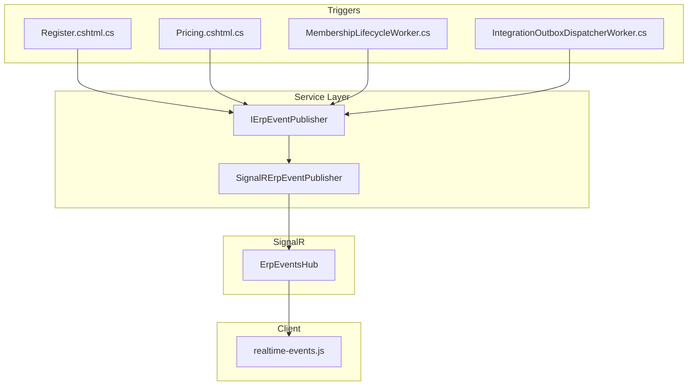
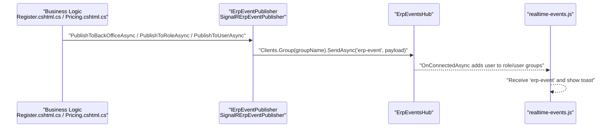
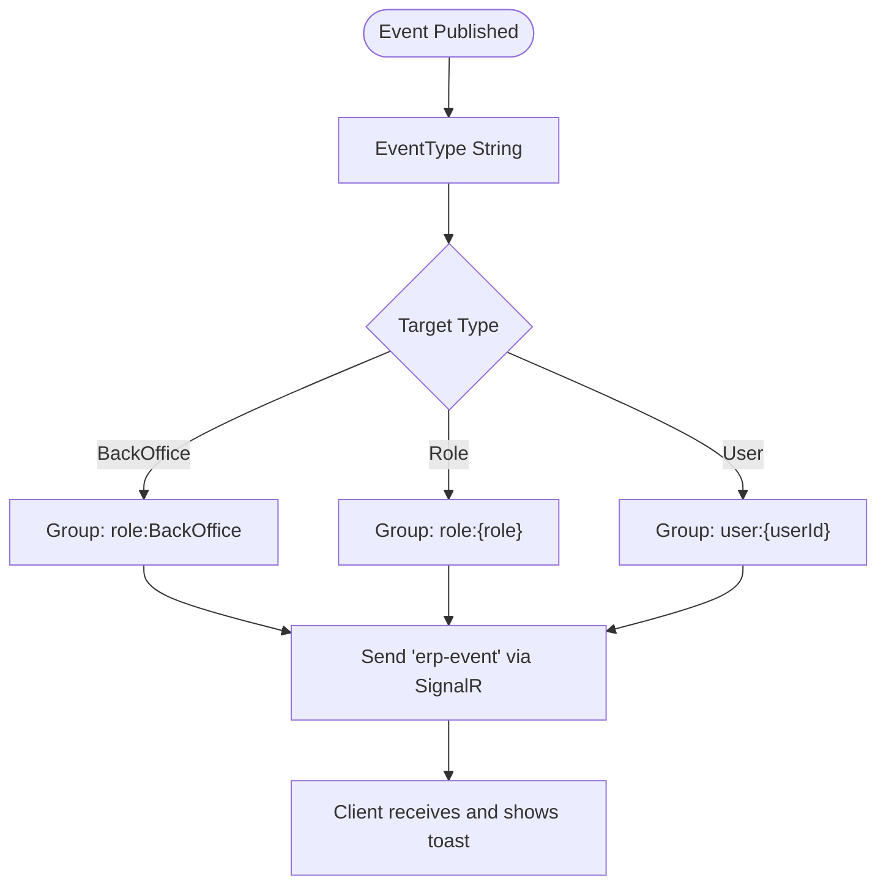
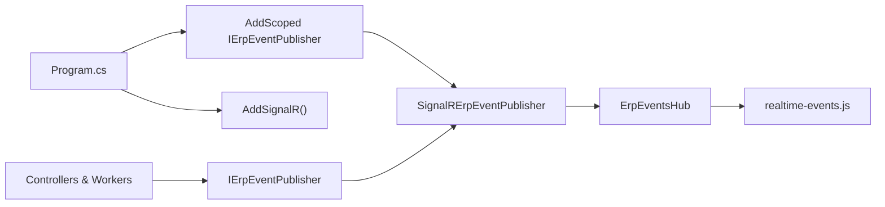

# Event Publishing System

<cite>
**Referenced Files in This Document**
- [IErpEventPublisher.cs](file://Services/Realtime/IErpEventPublisher.cs)
- [SignalRErpEventPublisher.cs](file://Services/Realtime/SignalRErpEventPublisher.cs)
- [ErpEventsHub.cs](file://Hubs/ErpEventsHub.cs)
- [realtime-events.js](file://wwwroot/js/realtime-events.js)
- [Program.cs](file://Program.cs)
- [Register.cshtml.cs](file://Areas/Identity/Pages/Account/Register.cshtml.cs)
- [Pricing.cshtml.cs](file://Pages/Public/Pricing.cshtml.cs)
- [MembershipLifecycleWorker.cs](file://Services/Memberships/MembershipLifecycleWorker.cs)
- [IntegrationOutboxDispatcherWorker.cs](file://Services/Integration/IntegrationOutboxDispatcherWorker.cs)
- [PayMongoWebhookController.cs](file://Controllers/PayMongoWebhookController.cs)
- [IntegrationOpsController.cs](file://Controllers/IntegrationOpsController.cs)
</cite>

## Table of Contents
1. [Introduction](#introduction)
2. [Project Structure](#project-structure)
3. [Core Components](#core-components)
4. [Architecture Overview](#architecture-overview)
5. [Detailed Component Analysis](#detailed-component-analysis)
6. [Dependency Analysis](#dependency-analysis)
7. [Performance Considerations](#performance-considerations)
8. [Troubleshooting Guide](#troubleshooting-guide)
9. [Conclusion](#conclusion)
10. [Appendices](#appendices)

## Introduction
This document describes the event publishing system that powers real-time notifications across the EJC Fitness Gym platform. It focuses on the IErpEventPublisher interface and its SignalR-backed implementation, detailing how business events are transformed into real-time messages, routed to appropriate recipients, and delivered to connected clients. It also covers event types, payload structures, client-side message formatting, and integration with workers and controllers that trigger notifications.

## Project Structure
The event publishing system spans several layers:
- Service layer: The IErpEventPublisher abstraction and SignalRErpEventPublisher implementation.
- SignalR hub: ErpEventsHub manages client connections and groups.
- Client-side: A JavaScript module connects to the hub and displays toast notifications.
- Workers and controllers: Trigger events for membership lifecycle, payments, and integration outbox dispatching.

**Diagram sources**
- [IErpEventPublisher.cs:1-26](file://Services/Realtime/IErpEventPublisher.cs#L1-L26)
- [SignalRErpEventPublisher.cs:1-101](file://Services/Realtime/SignalRErpEventPublisher.cs#L1-L101)
- [ErpEventsHub.cs:1-50](file://Hubs/ErpEventsHub.cs#L1-L50)
- [realtime-events.js:1-79](file://wwwroot/js/realtime-events.js#L1-L79)
- [Register.cshtml.cs:200-216](file://Areas/Identity/Pages/Account/Register.cshtml.cs#L200-L216)
- [Pricing.cshtml.cs:478-488](file://Pages/Public/Pricing.cshtml.cs#L478-L488)
- [MembershipLifecycleWorker.cs:83-98](file://Services/Memberships/MembershipLifecycleWorker.cs#L83-L98)
- [IntegrationOutboxDispatcherWorker.cs:135-169](file://Services/Integration/IntegrationOutboxDispatcherWorker.cs#L135-L169)

**Section sources**
- [Program.cs:379-395](file://Program.cs#L379-L395)

## Core Components
- IErpEventPublisher defines three publish methods:
  - PublishToBackOfficeAsync: Broadcasts to all back-office users.
  - PublishToRoleAsync: Broadcasts to users in a specific role.
  - PublishToUserAsync: Sends a targeted message to a specific user ID.
- SignalRErpEventPublisher implements the interface using SignalR’s Group mechanism. It constructs an ErpEventMessage payload and sends it to the hub endpoint "erp-event".
- ErpEventsHub assigns connected users to groups based on authentication and roles, enabling precise routing.

Key behaviors:
- Group naming convention: "role:<RoleName>" and "user:<UserId>".
- Message payload includes EventType, Message, OccurredUtc, and optional Data.
- Client receives "erp-event" and dispatches a DOM event for downstream UI handling.

**Section sources**
- [IErpEventPublisher.cs:3-24](file://Services/Realtime/IErpEventPublisher.cs#L3-L24)
- [SignalRErpEventPublisher.cs:6-98](file://Services/Realtime/SignalRErpEventPublisher.cs#L6-L98)
- [ErpEventsHub.cs:10-47](file://Hubs/ErpEventsHub.cs#L10-L47)

## Architecture Overview
The system integrates business triggers with real-time delivery through SignalR. Business logic publishes events to the publisher, which routes them to the hub and clients.

**Diagram sources**
- [Register.cshtml.cs:205-215](file://Areas/Identity/Pages/Account/Register.cshtml.cs#L205-L215)
- [Pricing.cshtml.cs:479-488](file://Pages/Public/Pricing.cshtml.cs#L479-L488)
- [SignalRErpEventPublisher.cs:76-89](file://Services/Realtime/SignalRErpEventPublisher.cs#L76-L89)
- [ErpEventsHub.cs:12-47](file://Hubs/ErpEventsHub.cs#L12-L47)
- [realtime-events.js:18-25](file://wwwroot/js/realtime-events.js#L18-L25)

## Detailed Component Analysis

### IErpEventPublisher Interface
Responsibilities:
- Define contract for publishing events to back office, specific roles, or individual users.
- Encapsulate routing semantics and payload formatting.

Usage patterns:
- Back-office broadcasts for administrative awareness.
- Role-based broadcasts for Finance, Staff, Admin, SuperAdmin.
- User-specific broadcasts for personalized notifications.

**Section sources**
- [IErpEventPublisher.cs:3-24](file://Services/Realtime/IErpEventPublisher.cs#L3-L24)

### SignalRErpEventPublisher Implementation
Processing logic:
- Validates inputs and trims values.
- Constructs ErpEventMessage with EventType, Message, OccurredUtc, and optional Data.
- Sends to SignalR group using Clients.Group(groupName).SendAsync("erp-event", payload).
- Catches exceptions and logs warnings without failing the caller.

Routing:
- PublishToBackOfficeAsync targets "role:BackOffice".
- PublishToRoleAsync targets "role:{role}" after trimming and validation.
- PublishToUserAsync targets "user:{userId}" after trimming and validation.

Idempotency and retries:
- No built-in idempotency or retry logic in the publisher.
- SignalR transport handles reconnection; client-side automatic reconnect is enabled.

**Section sources**
- [SignalRErpEventPublisher.cs:19-54](file://Services/Realtime/SignalRErpEventPublisher.cs#L19-L54)
- [SignalRErpEventPublisher.cs:56-98](file://Services/Realtime/SignalRErpEventPublisher.cs#L56-L98)

### ErpEventsHub
Connection handling:
- Adds authenticated users to "role:Authenticated".
- Adds user to "user:{userId}" group if available.
- Adds user to "role:{KnownRole}" groups based on claims.
- Adds "role:BackOffice" for non-Member roles.

Group membership determines who receives messages.

**Section sources**
- [ErpEventsHub.cs:12-47](file://Hubs/ErpEventsHub.cs#L12-L47)

### Client-Side Real-Time Handler
Behavior:
- Establishes SignalR connection to "/hubs/erp-events" with automatic reconnect.
- Listens for "erp-event" and dispatches a DOM event "ejc:erp-event" with the payload.
- Displays a toast notification using Bootstrap with a default delay.

**Section sources**
- [realtime-events.js:13-29](file://wwwroot/js/realtime-events.js#L13-L29)
- [realtime-events.js:18-25](file://wwwroot/js/realtime-events.js#L18-L25)
- [realtime-events.js:31-63](file://wwwroot/js/realtime-events.js#L31-L63)

### Event Triggers and Payloads

#### Membership Registration
- Trigger: Registration controller publishes to back office with a structured payload containing user identifiers and contact info.
- Example payload keys: userId, email, firstName, lastName, phoneNumber.

**Section sources**
- [Register.cshtml.cs:205-215](file://Areas/Identity/Pages/Account/Register.cshtml.cs#L205-L215)

#### Payment Checkout Created
- Trigger: Pricing controller publishes to the user and back office.
- Example payload keys: memberUserId, branchId, planId, planName, amount, invoiceDueDateUtc, checkoutSessionId.

**Section sources**
- [Pricing.cshtml.cs:478-488](file://Pages/Public/Pricing.cshtml.cs#L478-L488)

#### Membership Lifecycle Maintenance
- Trigger: MembershipLifecycleWorker publishes maintenance updates to back office.
- Example payload keys: trigger, asOfUtc, expiredSubscriptions, overdueInvoices, generatedRenewalInvoices, remindersQueued.

**Section sources**
- [MembershipLifecycleWorker.cs:83-98](file://Services/Memberships/MembershipLifecycleWorker.cs#L83-L98)

#### Integration Outbox Dispatch
- Trigger: IntegrationOutboxDispatcherWorker publishes based on outbox target (BackOffice, Role, User).
- Supports deserializing JSON payload or raw text.

**Section sources**
- [IntegrationOutboxDispatcherWorker.cs:135-169](file://Services/Integration/IntegrationOutboxDispatcherWorker.cs#L135-L169)
- [IntegrationOutboxDispatcherWorker.cs:171-186](file://Services/Integration/IntegrationOutboxDispatcherWorker.cs#L171-L186)

### Event Types and Routing

**Diagram sources**
- [SignalRErpEventPublisher.cs:19-54](file://Services/Realtime/SignalRErpEventPublisher.cs#L19-L54)
- [ErpEventsHub.cs:20-44](file://Hubs/ErpEventsHub.cs#L20-L44)
- [realtime-events.js:18-25](file://wwwroot/js/realtime-events.js#L18-L25)

## Dependency Analysis
- Service registration wires IErpEventPublisher to SignalRErpEventPublisher and enables SignalR.
- Controllers and workers depend on IErpEventPublisher to broadcast events.
- SignalR hub depends on authenticated claims to assign groups.

**Diagram sources**
- [Program.cs:379-395](file://Program.cs#L379-L395)
- [IErpEventPublisher.cs:3-24](file://Services/Realtime/IErpEventPublisher.cs#L3-L24)
- [SignalRErpEventPublisher.cs:6-17](file://Services/Realtime/SignalRErpEventPublisher.cs#L6-L17)
- [ErpEventsHub.cs:7-8](file://Hubs/ErpEventsHub.cs#L7-L8)
- [realtime-events.js:13-15](file://wwwroot/js/realtime-events.js#L13-L15)

**Section sources**
- [Program.cs:379-395](file://Program.cs#L379-L395)

## Performance Considerations
- SignalR transport and hubs are optimized for concurrent clients; keep payloads concise.
- Avoid excessive fan-out to broad groups; prefer role/user targeting to reduce unnecessary broadcasts.
- Client-side toast creation is lightweight; ensure minimal DOM manipulation.
- For high-volume scenarios, consider batching or throttling frequent events at the source.

[No sources needed since this section provides general guidance]

## Troubleshooting Guide
Common issues and resolutions:
- Connection failures: The client logs errors during startup and retries automatically. Verify SignalR endpoint availability and CORS configuration.
- Missing recipients: Ensure users are authenticated and in the correct roles; hub adds users to "role:Authenticated", "role:{Role}", and "user:{UserId}" groups.
- Silent failures: Publisher catches exceptions and logs warnings; check application logs for "Failed to publish realtime ERP event" entries.
- Payload deserialization: Outbox dispatcher attempts to deserialize JSON payloads; malformed JSON falls back to raw text.

**Section sources**
- [realtime-events.js:27-29](file://wwwroot/js/realtime-events.js#L27-L29)
- [ErpEventsHub.cs:12-47](file://Hubs/ErpEventsHub.cs#L12-L47)
- [SignalRErpEventPublisher.cs:82-89](file://Services/Realtime/SignalRErpEventPublisher.cs#L82-L89)
- [IntegrationOutboxDispatcherWorker.cs:171-186](file://Services/Integration/IntegrationOutboxDispatcherWorker.cs#L171-L186)

## Conclusion
The event publishing system provides a clean separation between business logic and real-time delivery. By leveraging SignalR groups and a simple event payload model, it supports flexible routing to back office, roles, and individual users. While the current implementation does not include built-in idempotency or retry, SignalR’s robust transport and client-side reconnect mitigate many reliability concerns. Extending the system with idempotency and retry would further improve delivery guarantees for mission-critical notifications.

[No sources needed since this section summarizes without analyzing specific files]

## Appendices

### Event Payload Reference
- EventType: String identifying the event category.
- Message: Human-readable summary; defaults to EventType if empty.
- OccurredUtc: Timestamp of event occurrence.
- Data: Optional structured payload (object) tailored to the event.

**Section sources**
- [SignalRErpEventPublisher.cs:68-74](file://Services/Realtime/SignalRErpEventPublisher.cs#L68-L74)

### Client-Side Event Handling
- Receives "erp-event" and dispatches a DOM event "ejc:erp-event" with the payload.
- Displays a toast notification with a default delay.

**Section sources**
- [realtime-events.js:18-25](file://wwwroot/js/realtime-events.js#L18-L25)
- [realtime-events.js:31-63](file://wwwroot/js/realtime-events.js#L31-L63)

### Integration with Payment Webhooks
- PayMongo webhook controller validates event types against allowed sets and records them for downstream processing.
- Integration ops controller categorizes events as paid or failed for audit and replay.

**Section sources**
- [PayMongoWebhookController.cs:39-44](file://Controllers/PayMongoWebhookController.cs#L39-L44)
- [PayMongoWebhookController.cs:105-169](file://Controllers/PayMongoWebhookController.cs#L105-L169)
- [IntegrationOpsController.cs:15-21](file://Controllers/IntegrationOpsController.cs#L15-L21)
- [IntegrationOpsController.cs:475-480](file://Controllers/IntegrationOpsController.cs#L475-L480)