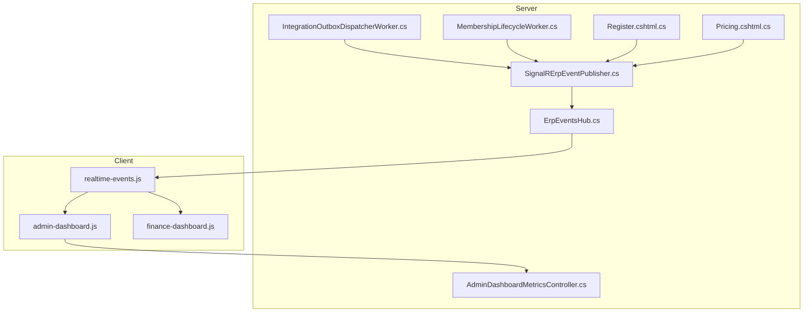
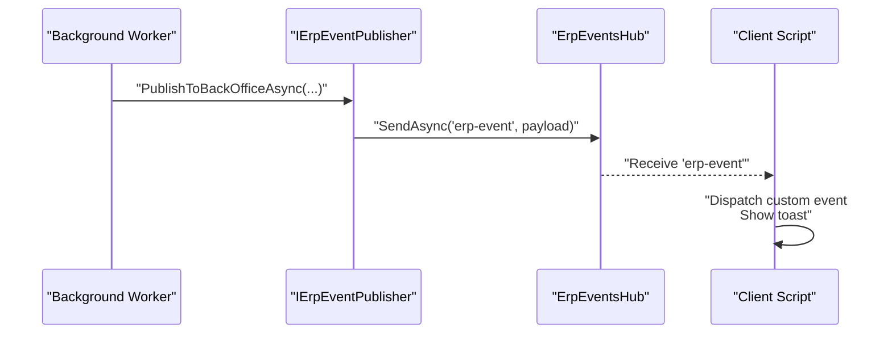
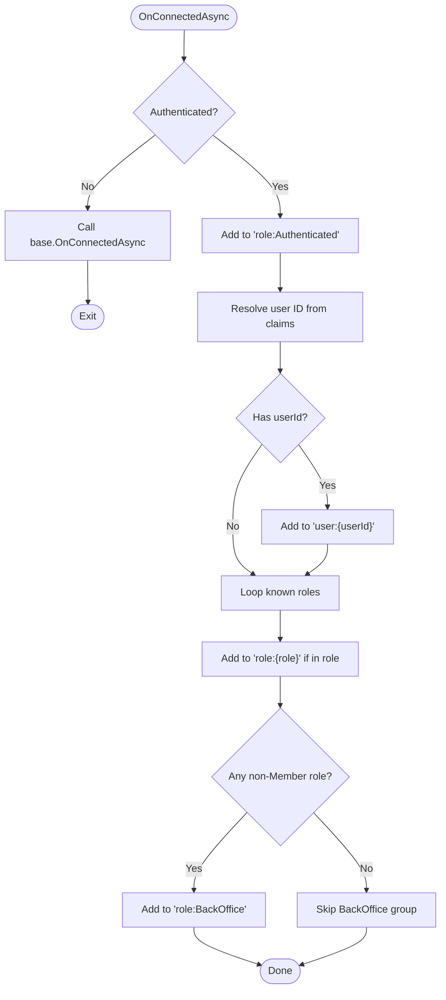
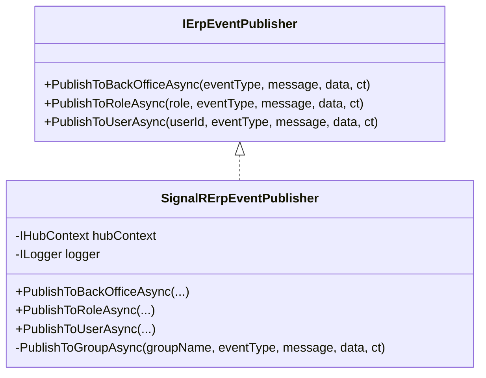
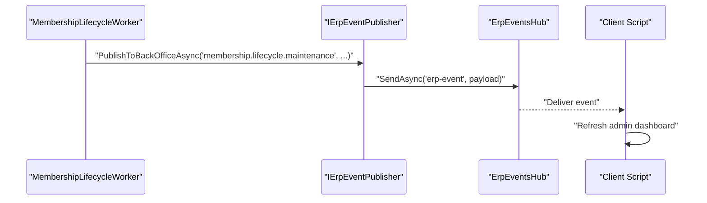
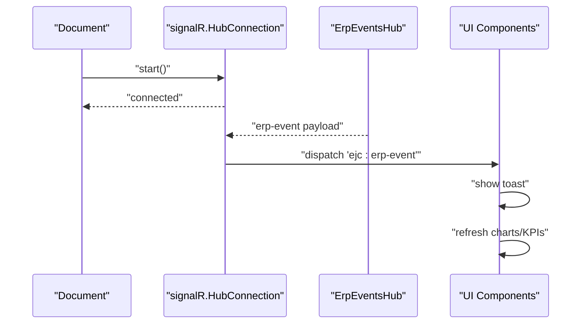
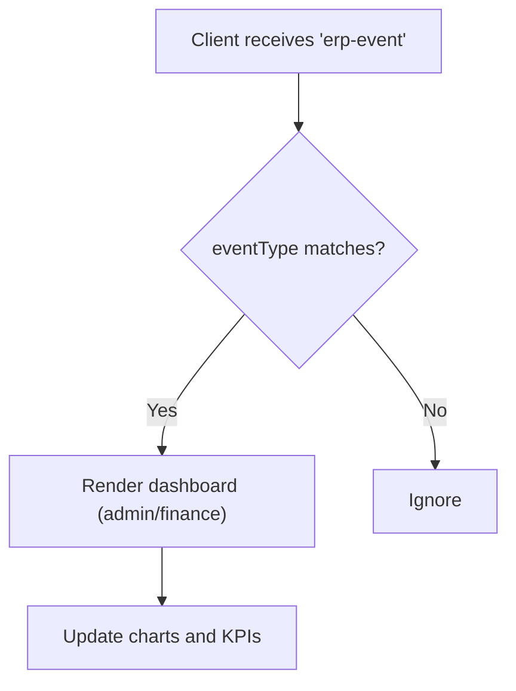
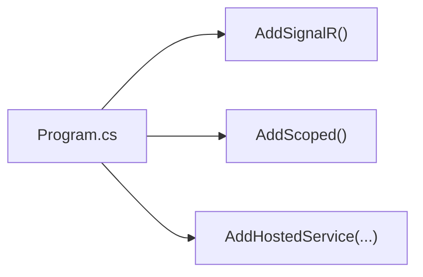

# Real-time Operations

<cite>
**Referenced Files in This Document**
- [Program.cs](file://Program.cs)
- [ErpEventsHub.cs](file://Hubs/ErpEventsHub.cs)
- [IErpEventPublisher.cs](file://Services/Realtime/IErpEventPublisher.cs)
- [SignalRErpEventPublisher.cs](file://Services/Realtime/SignalRErpEventPublisher.cs)
- [IntegrationOutboxDispatcherWorker.cs](file://Services/Integration/IntegrationOutboxDispatcherWorker.cs)
- [MembershipLifecycleWorker.cs](file://Services/Memberships/MembershipLifecycleWorker.cs)
- [Register.cshtml.cs](file://Areas/Identity/Pages/Account/Register.cshtml.cs)
- [Pricing.cshtml.cs](file://Pages/Public/Pricing.cshtml.cs)
- [realtime-events.js](file://wwwroot/js/realtime-events.js)
- [admin-dashboard.js](file://wwwroot/js/admin-dashboard.js)
- [finance-dashboard.js](file://wwwroot/js/finance-dashboard.js)
- [AdminDashboardMetricsController.cs](file://Controllers/AdminDashboardMetricsController.cs)
</cite>

## Table of Contents
1. [Introduction](#introduction)
2. [Project Structure](#project-structure)
3. [Core Components](#core-components)
4. [Architecture Overview](#architecture-overview)
5. [Detailed Component Analysis](#detailed-component-analysis)
6. [Dependency Analysis](#dependency-analysis)
7. [Performance Considerations](#performance-considerations)
8. [Troubleshooting Guide](#troubleshooting-guide)
9. [Conclusion](#conclusion)

## Introduction
This document explains the real-time operations of the EJC Fitness Gym system, focusing on SignalR-powered live dashboards and event notifications across administrator, finance, and member interfaces. It covers:
- SignalR hub initialization and group-based routing
- Event publishing service and background workers that emit real-time events
- Client-side JavaScript for connecting to SignalR hubs and handling live updates
- Notification types, event routing, and client-side event handling
- Real-time dashboard components and their update triggers
- Error handling, reconnection logic, and graceful degradation
- Performance and scalability considerations for real-time messaging

## Project Structure
The real-time system spans server-side SignalR hubs, a publisher abstraction, background services, and client-side JavaScript:
- SignalR hub: groups users by roles and personal identifiers
- Publisher: emits structured events to groups
- Background services: detect system changes and publish events
- Controllers: expose metrics APIs for dashboards
- Client scripts: connect to the hub, listen for events, and update UI

**Diagram sources**
- [Program.cs](file://Program.cs)
- [ErpEventsHub.cs](file://Hubs/ErpEventsHub.cs)
- [SignalRErpEventPublisher.cs](file://Services/Realtime/SignalRErpEventPublisher.cs)
- [IntegrationOutboxDispatcherWorker.cs](file://Services/Integration/IntegrationOutboxDispatcherWorker.cs)
- [MembershipLifecycleWorker.cs](file://Services/Memberships/MembershipLifecycleWorker.cs)
- [Register.cshtml.cs](file://Areas/Identity/Pages/Account/Register.cshtml.cs)
- [Pricing.cshtml.cs](file://Pages/Public/Pricing.cshtml.cs)
- [realtime-events.js](file://wwwroot/js/realtime-events.js)
- [admin-dashboard.js](file://wwwroot/js/admin-dashboard.js)
- [finance-dashboard.js](file://wwwroot/js/finance-dashboard.js)
- [AdminDashboardMetricsController.cs](file://Controllers/AdminDashboardMetricsController.cs)

**Section sources**
- [Program.cs](file://Program.cs)
- [ErpEventsHub.cs](file://Hubs/ErpEventsHub.cs)
- [SignalRErpEventPublisher.cs](file://Services/Realtime/SignalRErpEventPublisher.cs)
- [IntegrationOutboxDispatcherWorker.cs](file://Services/Integration/IntegrationOutboxDispatcherWorker.cs)
- [MembershipLifecycleWorker.cs](file://Services/Memberships/MembershipLifecycleWorker.cs)
- [Register.cshtml.cs](file://Areas/Identity/Pages/Account/Register.cshtml.cs)
- [Pricing.cshtml.cs](file://Pages/Public/Pricing.cshtml.cs)
- [realtime-events.js](file://wwwroot/js/realtime-events.js)
- [admin-dashboard.js](file://wwwroot/js/admin-dashboard.js)
- [finance-dashboard.js](file://wwwroot/js/finance-dashboard.js)
- [AdminDashboardMetricsController.cs](file://Controllers/AdminDashboardMetricsController.cs)

## Core Components
- SignalR Hub: Establishes connections, assigns users to role and user-specific groups, and broadcasts events to groups.
- Event Publisher: Abstraction for publishing to Back Office, roles, or individual users; serializes payloads and sends via SignalR.
- Background Workers: Emit real-time events when system changes occur (membership lifecycle, integration outbox dispatch).
- Client Scripts: Connect to the hub, listen for “erp-event” messages, show toast notifications, and refresh dashboard data on relevant events.

Key responsibilities:
- Group membership: role:Authenticated, role:Member/Staff/Finance/Admin/SuperAdmin, role:BackOffice, user:{id}
- Event payload: EventType, Message, OccurredUtc, Data
- Client handlers: dispatch custom events and update charts/KPIs

**Section sources**
- [ErpEventsHub.cs:10-44](file://Hubs/ErpEventsHub.cs#L10-L44)
- [SignalRErpEventPublisher.cs:19-54](file://Services/Realtime/SignalRErpEventPublisher.cs#L19-L54)
- [IErpEventPublisher.cs:5-23](file://Services/Realtime/IErpEventPublisher.cs#L5-L23)
- [realtime-events.js:13-29](file://wwwroot/js/realtime-events.js#L13-L29)

## Architecture Overview
The real-time architecture integrates SignalR hubs with background services and controllers. Events originate from business operations and propagate to clients through the hub.

**Diagram sources**
- [MembershipLifecycleWorker.cs:83-98](file://Services/Memberships/MembershipLifecycleWorker.cs#L83-L98)
- [IntegrationOutboxDispatcherWorker.cs:143-148](file://Services/Integration/IntegrationOutboxDispatcherWorker.cs#L143-L148)
- [SignalRErpEventPublisher.cs:78-80](file://Services/Realtime/SignalRErpEventPublisher.cs#L78-L80)
- [realtime-events.js:18-25](file://wwwroot/js/realtime-events.js#L18-L25)

## Detailed Component Analysis

### SignalR Hub: Role and User Group Management
- On connection, the hub adds authenticated users to role:Authenticated and optionally role:BackOffice.
- Users are added to user:{userId} and role-specific groups based on claims.
- Groups are used to target broadcasts during event publishing.

**Diagram sources**
- [ErpEventsHub.cs:12-46](file://Hubs/ErpEventsHub.cs#L12-L46)

**Section sources**
- [ErpEventsHub.cs:10-44](file://Hubs/ErpEventsHub.cs#L10-L44)

### Event Publishing Service
- Interface defines three publish methods: to Back Office, to a named role, and to a specific user.
- Implementation validates inputs, constructs a payload, and sends to the hub’s group endpoint.
- Errors are logged; publishes are best-effort.

**Diagram sources**
- [IErpEventPublisher.cs:3-24](file://Services/Realtime/IErpEventPublisher.cs#L3-L24)
- [SignalRErpEventPublisher.cs:6-54](file://Services/Realtime/SignalRErpEventPublisher.cs#L6-L54)

**Section sources**
- [IErpEventPublisher.cs:5-23](file://Services/Realtime/IErpEventPublisher.cs#L5-L23)
- [SignalRErpEventPublisher.cs:19-54](file://Services/Realtime/SignalRErpEventPublisher.cs#L19-L54)

### Background Services That Emit Real-time Events
- MembershipLifecycleWorker: Runs periodic maintenance and publishes membership lifecycle updates to Back Office when changes are detected.
- IntegrationOutboxDispatcherWorker: Processes outbox messages and publishes events to Back Office, Role, or User depending on target configuration.

**Diagram sources**
- [MembershipLifecycleWorker.cs:83-98](file://Services/Memberships/MembershipLifecycleWorker.cs#L83-L98)
- [IntegrationOutboxDispatcherWorker.cs:143-148](file://Services/Integration/IntegrationOutboxDispatcherWorker.cs#L143-L148)
- [SignalRErpEventPublisher.cs:78-80](file://Services/Realtime/SignalRErpEventPublisher.cs#L78-L80)
- [realtime-events.js:774-787](file://wwwroot/js/realtime-events.js#L774-L787)

**Section sources**
- [MembershipLifecycleWorker.cs:51-98](file://Services/Memberships/MembershipLifecycleWorker.cs#L51-L98)
- [IntegrationOutboxDispatcherWorker.cs:58-133](file://Services/Integration/IntegrationOutboxDispatcherWorker.cs#L58-L133)

### Client-side JavaScript: SignalR Connection and Event Handling
- Initializes a SignalR connection to the hub with automatic reconnection.
- Registers a handler for “erp-event”, dispatches a custom DOM event, and shows a toast notification.
- Provides a toast container and lifecycle to remove toasts after display.

**Diagram sources**
- [realtime-events.js:13-29](file://wwwroot/js/realtime-events.js#L13-L29)
- [realtime-events.js:18-25](file://wwwroot/js/realtime-events.js#L18-L25)

**Section sources**
- [realtime-events.js:1-79](file://wwwroot/js/realtime-events.js#L1-L79)

### Real-time Dashboard Components
- Admin Dashboard: Reacts to payment, check-in/out, membership activation/renewal, and membership lifecycle maintenance events to refresh charts and KPIs.
- Finance Dashboard: Uses a separate controller for financial metrics; real-time events can trigger refreshes similarly.

**Diagram sources**
- [admin-dashboard.js:774-787](file://wwwroot/js/admin-dashboard.js#L774-L787)
- [finance-dashboard.js](file://wwwroot/js/finance-dashboard.js)

**Section sources**
- [admin-dashboard.js:774-787](file://wwwroot/js/admin-dashboard.js#L774-L787)
- [finance-dashboard.js](file://wwwroot/js/finance-dashboard.js)

### Event Types and Routing
Common event types observed in the codebase:
- membership.lifecycle.maintenance
- member.registered
- payment.checkout.created
- payment.succeeded
- staff.member.checkin
- staff.member.checkout
- membership.activated
- membership.renewed

Routing:
- Back Office: role:BackOffice
- Role-scoped: role:{role}
- User-scoped: user:{userId}

**Section sources**
- [MembershipLifecycleWorker.cs:85-96](file://Services/Memberships/MembershipLifecycleWorker.cs#L85-L96)
- [Register.cshtml.cs:205-215](file://Areas/Identity/Pages/Account/Register.cshtml.cs#L205-L215)
- [Pricing.cshtml.cs:479-488](file://Pages/Public/Pricing.cshtml.cs#L479-L488)
- [admin-dashboard.js:780-784](file://wwwroot/js/admin-dashboard.js#L780-L784)

## Dependency Analysis
- SignalR registration and DI:
  - SignalR hub is registered and hosted.
  - IErpEventPublisher is registered as SignalRErpEventPublisher.
  - Background services are registered as hosted services.

**Diagram sources**
- [Program.cs](file://Program.cs#L395)
- [Program.cs](file://Program.cs#L380)
- [Program.cs:370-374](file://Program.cs#L370-L374)

**Section sources**
- [Program.cs](file://Program.cs#L395)
- [Program.cs](file://Program.cs#L380)
- [Program.cs:370-374](file://Program.cs#L370-L374)

## Performance Considerations
- Connection model: Automatic reconnection reduces manual reconnect logic overhead.
- Payload size: Keep event payloads minimal; include only necessary identifiers and summaries.
- Group targeting: Broadcasting to role:user groups avoids unnecessary fan-out.
- Client refresh cadence: Debounce dashboard refreshes to avoid excessive rendering.
- Scalability: Horizontal scaling of SignalR requires a backplane (e.g., Redis); ensure sticky sessions or scale-out compatible transport.
- Background workers: Batch processing and exponential backoff for outbox retries reduce load spikes.

[No sources needed since this section provides general guidance]

## Troubleshooting Guide
- Connection failures:
  - The client logs connection errors and relies on automatic reconnection.
  - Verify SignalR hub endpoint and CORS configuration.
- Event delivery:
  - Ensure users are properly authenticated and added to role:user groups.
  - Confirm publisher is injected and invoked with non-empty group/event names.
- Toast notifications:
  - Toast creation depends on Bootstrap; ensure the library is loaded.
  - Toast container is lazily created; confirm DOM readiness.
- Dashboard updates:
  - Admin dashboard listens for specific event types; ensure publishers emit matching event types.
  - Finance dashboard uses separate metrics endpoints; real-time events can trigger refreshes similarly.

**Section sources**
- [realtime-events.js:27-29](file://wwwroot/js/realtime-events.js#L27-L29)
- [realtime-events.js:65-77](file://wwwroot/js/realtime-events.js#L65-L77)
- [admin-dashboard.js:774-787](file://wwwroot/js/admin-dashboard.js#L774-L787)
- [SignalRErpEventPublisher.cs:82-89](file://Services/Realtime/SignalRErpEventPublisher.cs#L82-L89)

## Conclusion
The EJC Fitness Gym real-time system leverages SignalR for live dashboards and notifications across administrative, finance, and member interfaces. Background services and business operations emit structured events that are routed to appropriate groups and rendered on clients with minimal UI disruption. The design supports graceful reconnection, toast-driven feedback, and scalable broadcasting. For production, consider adding a backplane for horizontal scaling and optimizing payload sizes and refresh frequencies to maintain responsiveness under load.