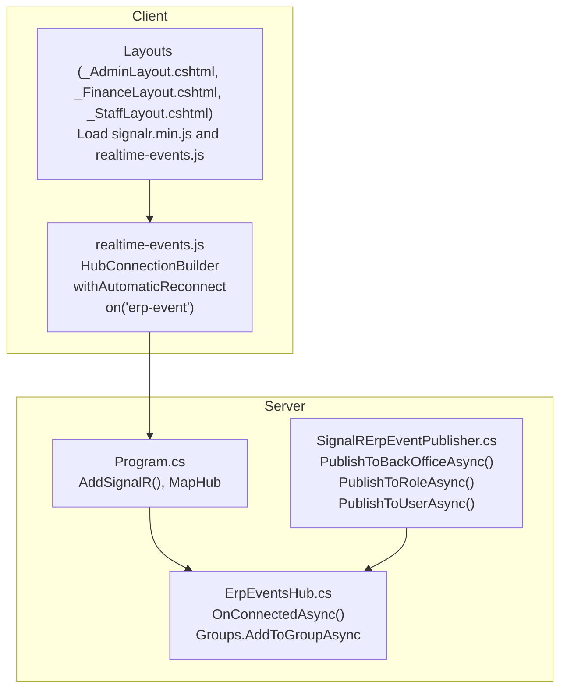
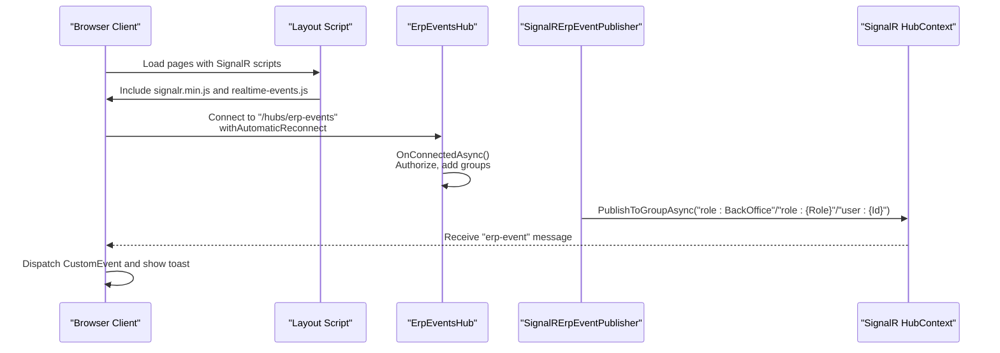
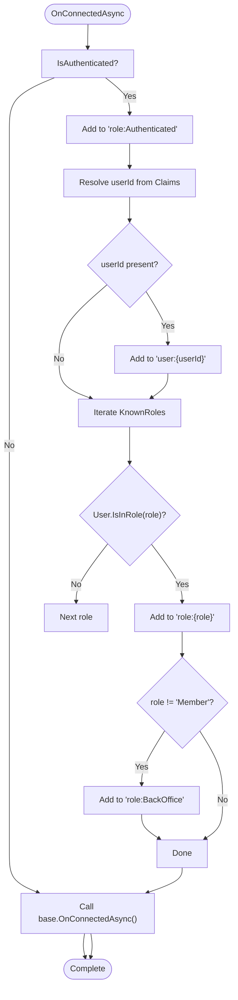
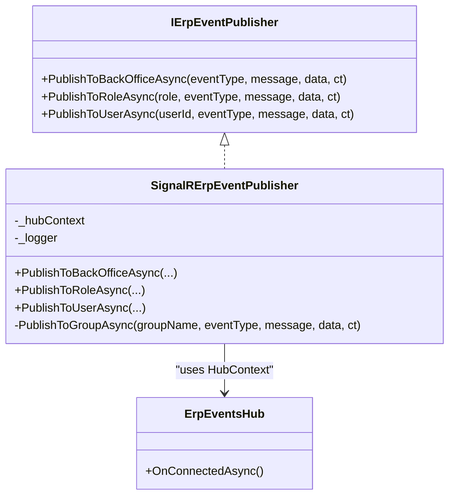
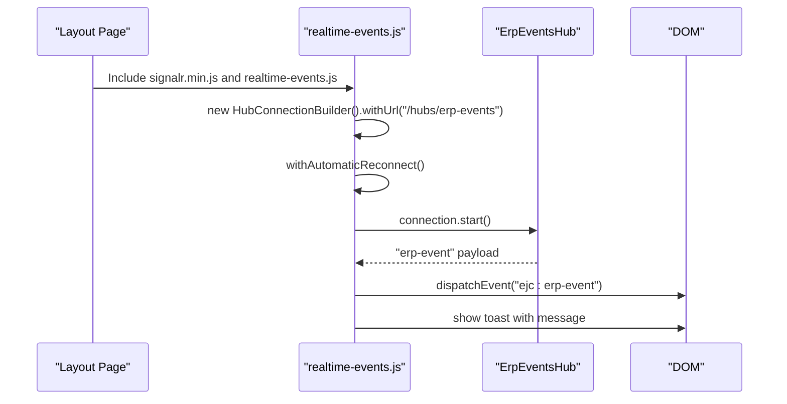
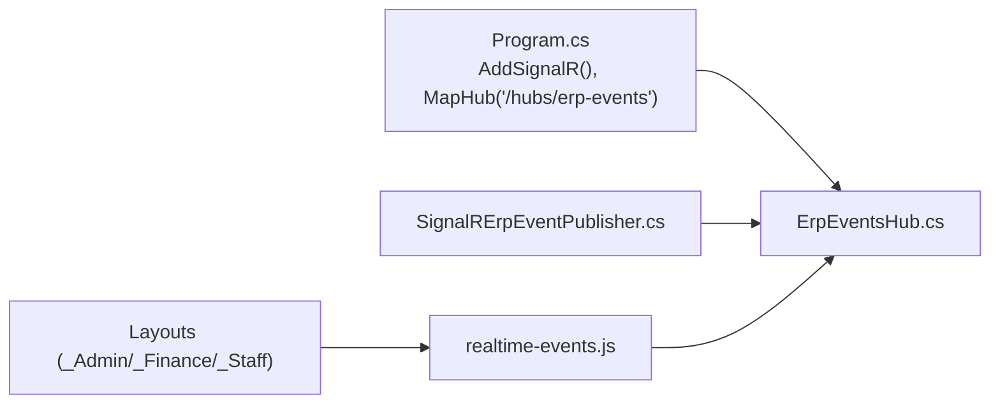

# SignalR Integration

<cite>
**Referenced Files in This Document**
- [ErpEventsHub.cs](file://Hubs/ErpEventsHub.cs)
- [SignalRErpEventPublisher.cs](file://Services/Realtime/SignalRErpEventPublisher.cs)
- [IErpEventPublisher.cs](file://Services/Realtime/IErpEventPublisher.cs)
- [Program.cs](file://Program.cs)
- [realtime-events.js](file://wwwroot/js/realtime-events.js)
- [appsettings.json](file://appsettings.json)
- [appsettings.Production.json](file://appsettings.Production.json)
- [_AdminLayout.cshtml](file://Pages/Shared/_AdminLayout.cshtml)
- [_FinanceLayout.cshtml](file://Pages/Shared/_FinanceLayout.cshtml)
- [_StaffLayout.cshtml](file://Pages/Shared/_StaffLayout.cshtml)
</cite>

## Table of Contents
1. [Introduction](#introduction)
2. [Project Structure](#project-structure)
3. [Core Components](#core-components)
4. [Architecture Overview](#architecture-overview)
5. [Detailed Component Analysis](#detailed-component-analysis)
6. [Dependency Analysis](#dependency-analysis)
7. [Performance Considerations](#performance-considerations)
8. [Troubleshooting Guide](#troubleshooting-guide)
9. [Conclusion](#conclusion)
10. [Appendices](#appendices)

## Introduction
This document explains the SignalR integration for the EJC Fitness Gym system. It covers the SignalR hub implementation, connection lifecycle, authentication and authorization, group-based message routing, publisher service, client-side integration, configuration requirements, scaling considerations, error handling, and security posture. The focus is on the ErpEventsHub and the SignalR-based ERP event publishing pipeline used by back-office and staff dashboards.

## Project Structure
The SignalR integration spans a small set of focused components:
- Hub: ErpEventsHub handles authenticated connections and groups users by roles and identity.
- Publisher: SignalRErpEventPublisher publishes ERP events to groups and users.
- Client: A browser script establishes a SignalR connection and listens for real-time events.
- Configuration: Program.cs registers SignalR and maps the hub endpoint; layouts include the SignalR client library and the real-time script.

**Diagram sources**
- [Program.cs](file://Program.cs)
- [ErpEventsHub.cs](file://Hubs/ErpEventsHub.cs)
- [SignalRErpEventPublisher.cs](file://Services/Realtime/SignalRErpEventPublisher.cs)
- [_AdminLayout.cshtml](file://Pages/Shared/_AdminLayout.cshtml)
- [_FinanceLayout.cshtml](file://Pages/Shared/_FinanceLayout.cshtml)
- [_StaffLayout.cshtml](file://Pages/Shared/_StaffLayout.cshtml)
- [realtime-events.js](file://wwwroot/js/realtime-events.js)

**Section sources**
- [Program.cs](file://Program.cs)
- [_AdminLayout.cshtml](file://Pages/Shared/_AdminLayout.cshtml)
- [_FinanceLayout.cshtml](file://Pages/Shared/_FinanceLayout.cshtml)
- [_StaffLayout.cshtml](file://Pages/Shared/_StaffLayout.cshtml)
- [realtime-events.js](file://wwwroot/js/realtime-events.js)

## Core Components
- ErpEventsHub: Enforces authorization, assigns authenticated users to a dedicated group, adds user-specific and role-based groups, and optionally BackOffice group for non-Member roles.
- SignalRErpEventPublisher: Provides typed APIs to publish ERP events to BackOffice, specific roles, or individual users via SignalR groups.
- Client script: Establishes a SignalR connection to the hub, listens for ERP events, and displays notifications.

Key responsibilities:
- Connection establishment and authentication: Authorization enforced at hub level; authenticated users are grouped automatically.
- Group-based routing: Users receive messages based on user ID and role membership.
- Publishing: Centralized publisher service encapsulates event payload construction and group dispatch.

**Section sources**
- [ErpEventsHub.cs](file://Hubs/ErpEventsHub.cs)
- [SignalRErpEventPublisher.cs](file://Services/Realtime/SignalRErpEventPublisher.cs)
- [IErpEventPublisher.cs](file://Services/Realtime/IErpEventPublisher.cs)
- [realtime-events.js](file://wwwroot/js/realtime-events.js)

## Architecture Overview
The system uses ASP.NET Core SignalR with a central hub and a publisher service. Clients connect to the hub and receive targeted updates based on their authenticated identity and roles.

**Diagram sources**
- [Program.cs](file://Program.cs)
- [ErpEventsHub.cs](file://Hubs/ErpEventsHub.cs)
- [SignalRErpEventPublisher.cs](file://Services/Realtime/SignalRErpEventPublisher.cs)
- [realtime-events.js](file://wwwroot/js/realtime-events.js)

## Detailed Component Analysis

### ErpEventsHub: Authentication, Groups, and Lifecycle
- Authorization: The hub requires authenticated users.
- Connection lifecycle:
  - Adds every authenticated connection to a shared "role:Authenticated" group.
  - Adds a "user:{userId}" group derived from the authenticated user identifier.
  - Adds "role:{Role}" groups for known roles present on the user.
  - Adds "role:BackOffice" for users with roles other than Member.
- Role set: Known roles include Member, Staff, Finance, Admin, SuperAdmin.

**Diagram sources**
- [ErpEventsHub.cs](file://Hubs/ErpEventsHub.cs)

**Section sources**
- [ErpEventsHub.cs](file://Hubs/ErpEventsHub.cs)

### SignalRErpEventPublisher: Publishing to Roles and Users
- Interfaces:
  - PublishToBackOfficeAsync: Sends to "role:BackOffice".
  - PublishToRoleAsync: Sends to "role:{role}" after trimming and validation.
  - PublishToUserAsync: Sends to "user:{userId}" after trimming and validation.
- Payload: Constructed with EventType, Message, OccurredUtc, and optional Data.
- Delivery: Uses HubContext to send to the named group; logs warnings on exceptions.

**Diagram sources**
- [IErpEventPublisher.cs](file://Services/Realtime/IErpEventPublisher.cs)
- [SignalRErpEventPublisher.cs](file://Services/Realtime/SignalRErpEventPublisher.cs)
- [ErpEventsHub.cs](file://Hubs/ErpEventsHub.cs)

**Section sources**
- [IErpEventPublisher.cs](file://Services/Realtime/IErpEventPublisher.cs)
- [SignalRErpEventPublisher.cs](file://Services/Realtime/SignalRErpEventPublisher.cs)

### Client-Side Integration: Connection Management and Event Handling
- Script inclusion: Layouts load the SignalR client library and the real-time events script.
- Connection:
  - Builds a HubConnection to "/hubs/erp-events".
  - Enables automatic reconnection.
  - Starts the connection and logs errors.
- Event handling:
  - Listens for "erp-event" messages.
  - Dispatches a CustomEvent for downstream components.
  - Displays a Bootstrap toast notification.

**Diagram sources**
- [_AdminLayout.cshtml](file://Pages/Shared/_AdminLayout.cshtml)
- [_FinanceLayout.cshtml](file://Pages/Shared/_FinanceLayout.cshtml)
- [_StaffLayout.cshtml](file://Pages/Shared/_StaffLayout.cshtml)
- [realtime-events.js](file://wwwroot/js/realtime-events.js)

**Section sources**
- [_AdminLayout.cshtml](file://Pages/Shared/_AdminLayout.cshtml)
- [_FinanceLayout.cshtml](file://Pages/Shared/_FinanceLayout.cshtml)
- [_StaffLayout.cshtml](file://Pages/Shared/_StaffLayout.cshtml)
- [realtime-events.js](file://wwwroot/js/realtime-events.js)

## Dependency Analysis
- Hub registration and endpoint mapping:
  - SignalR is added to services and mapped to "/hubs/erp-events".
- Publisher dependency:
  - The publisher depends on IHubContext<ErpEventsHub> and uses it to broadcast to groups.
- Client dependencies:
  - Layouts include the SignalR client library and the real-time script.

**Diagram sources**
- [Program.cs](file://Program.cs)
- [ErpEventsHub.cs](file://Hubs/ErpEventsHub.cs)
- [SignalRErpEventPublisher.cs](file://Services/Realtime/SignalRErpEventPublisher.cs)
- [_AdminLayout.cshtml](file://Pages/Shared/_AdminLayout.cshtml)
- [_FinanceLayout.cshtml](file://Pages/Shared/_FinanceLayout.cshtml)
- [_StaffLayout.cshtml](file://Pages/Shared/_StaffLayout.cshtml)
- [realtime-events.js](file://wwwroot/js/realtime-events.js)

**Section sources**
- [Program.cs](file://Program.cs)
- [SignalRErpEventPublisher.cs](file://Services/Realtime/SignalRErpEventPublisher.cs)

## Performance Considerations
- Connection limits and scaling:
  - The repository does not configure explicit SignalR server-side limits. For production, consider setting transport and scale-out configurations (e.g., Redis backplane) and monitoring connection counts.
- Back-pressure:
  - The publisher catches and logs exceptions during group sends; ensure consumers handle bursts gracefully.
- Client reconnections:
  - Automatic reconnection is enabled on the client; ensure retry intervals and backoff strategies are appropriate for the environment.

[No sources needed since this section provides general guidance]

## Troubleshooting Guide
- Connection failures:
  - Client logs connection errors to the console; verify network connectivity and CORS/forwarded headers configuration.
- Authentication issues:
  - The hub requires authorization; ensure clients are signed in and that cookies/JWT are properly transmitted.
- No events received:
  - Confirm the user is authenticated and belongs to the intended roles; verify group assignments occur during OnConnectedAsync.
- Publisher errors:
  - The publisher logs warnings when group sends fail; check hub logs and network conditions.

**Section sources**
- [realtime-events.js](file://wwwroot/js/realtime-events.js)
- [ErpEventsHub.cs](file://Hubs/ErpEventsHub.cs)
- [SignalRErpEventPublisher.cs](file://Services/Realtime/SignalRErpEventPublisher.cs)

## Conclusion
The SignalR integration centers on a single hub that enforces authentication and automatically organizes users into role and user-specific groups. A publisher service simplifies broadcasting ERP events to targeted audiences. The client script integrates seamlessly into back-office layouts and provides resilient real-time updates with graceful fallbacks.

[No sources needed since this section summarizes without analyzing specific files]

## Appendices

### Configuration Requirements
- SignalR registration and endpoint:
  - Add SignalR services and map the hub endpoint in the application pipeline.
- Client script inclusion:
  - Layouts include the SignalR client library and the real-time events script.
- Environment-specific settings:
  - Review production settings for cookies, forwarded headers, and logging levels.

**Section sources**
- [Program.cs](file://Program.cs)
- [_AdminLayout.cshtml](file://Pages/Shared/_AdminLayout.cshtml)
- [_FinanceLayout.cshtml](file://Pages/Shared/_FinanceLayout.cshtml)
- [_StaffLayout.cshtml](file://Pages/Shared/_StaffLayout.cshtml)
- [appsettings.json](file://appsettings.json)
- [appsettings.Production.json](file://appsettings.Production.json)

### Security Considerations
- Authorization:
  - The hub is decorated with authorization; unauthenticated connections are still established but not added to protected groups until authenticated.
- Transport and cookies:
  - Secure cookie policies and HTTPS redirection are configured in the application pipeline.
- CORS and forwarded headers:
  - Configure trusted proxies and origins appropriately for SignalR WebSocket connections.

**Section sources**
- [ErpEventsHub.cs](file://Hubs/ErpEventsHub.cs)
- [Program.cs](file://Program.cs)
- [appsettings.json](file://appsettings.json)
- [appsettings.Production.json](file://appsettings.Production.json)