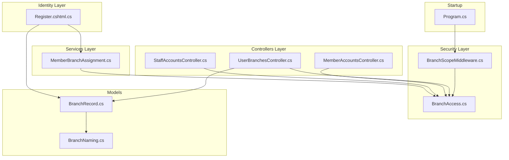
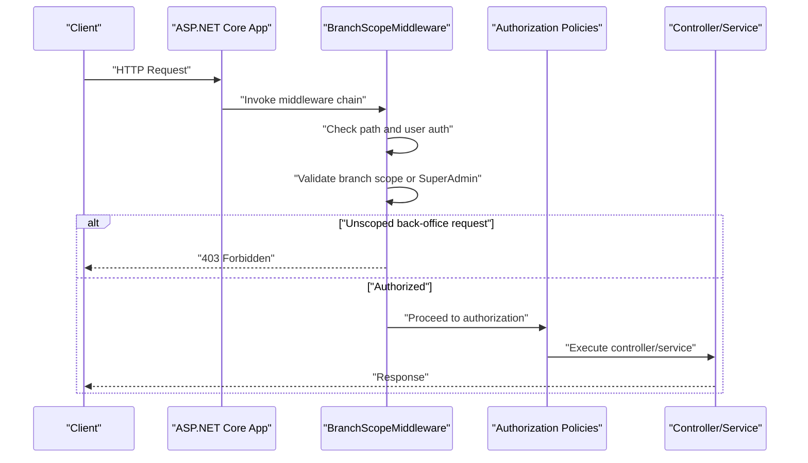
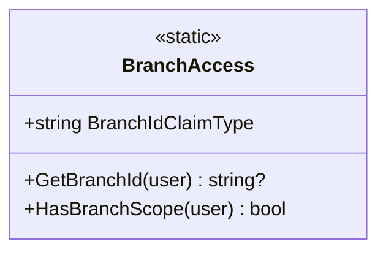
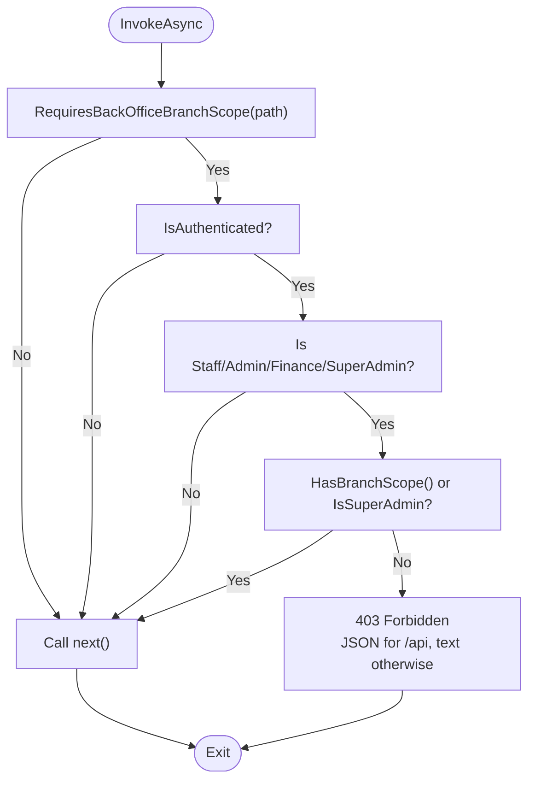
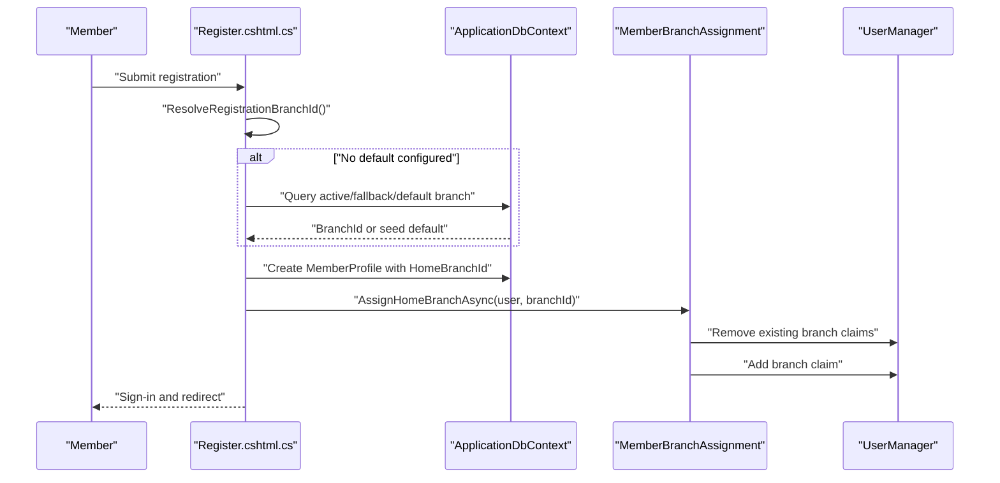
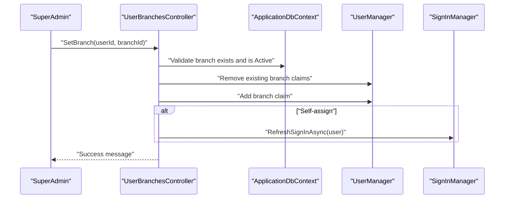
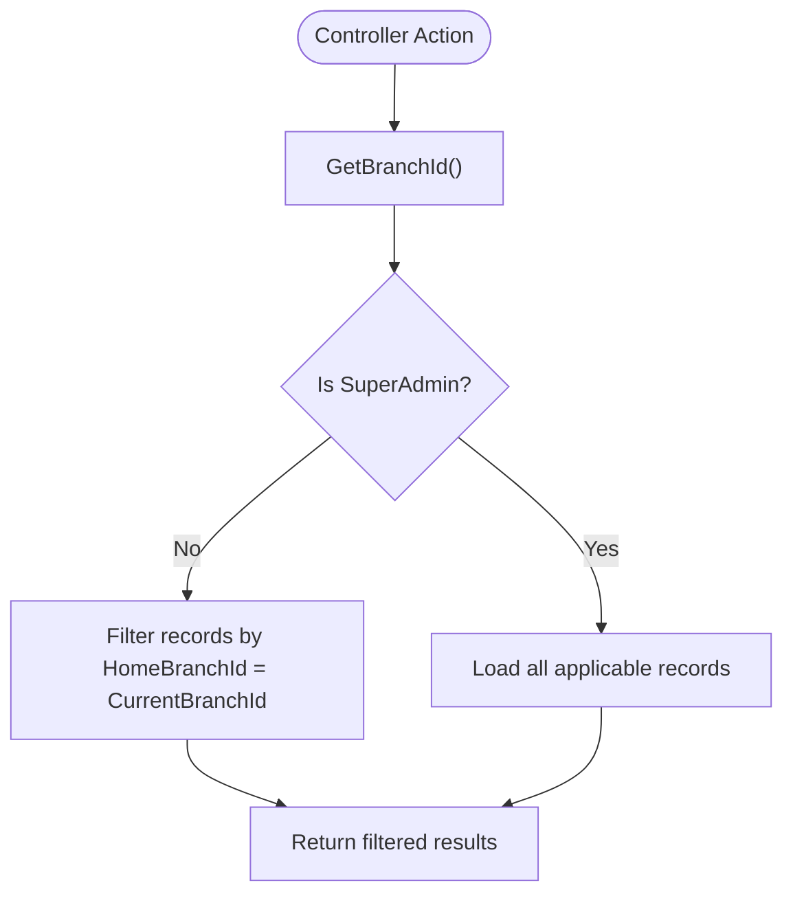
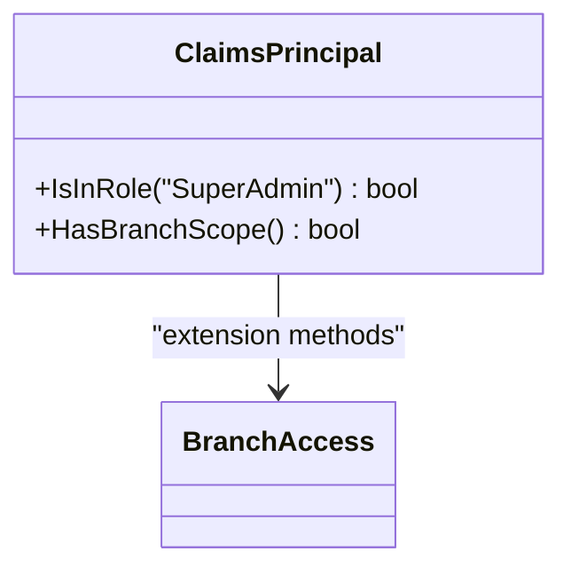
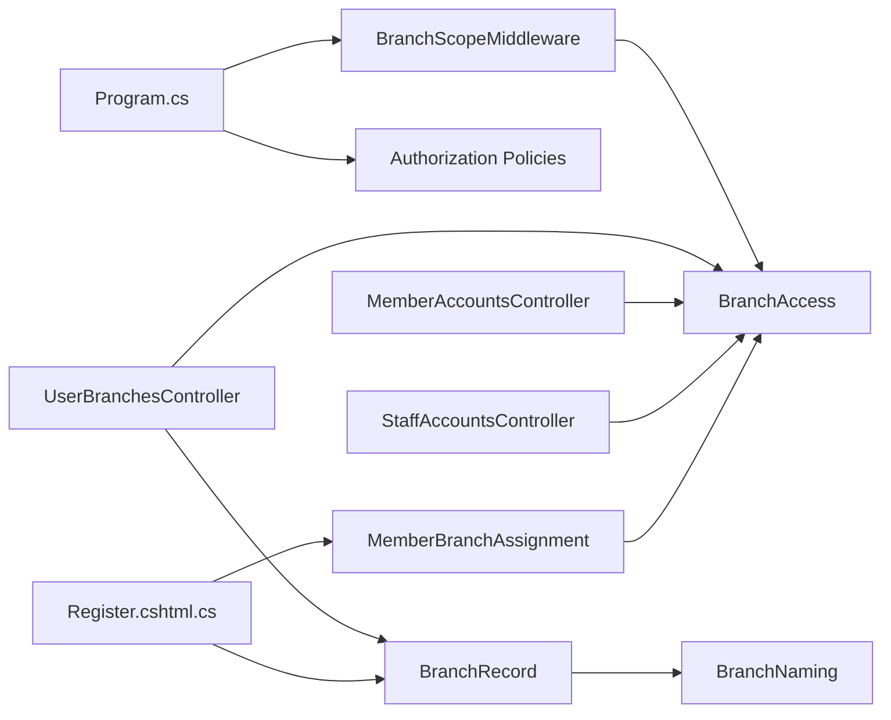

# Branch Scoping Security Model

<cite>
**Referenced Files in This Document**
- [BranchScopeMiddleware.cs](file://Security/BranchScopeMiddleware.cs)
- [BranchAccess.cs](file://Security/BranchAccess.cs)
- [MemberBranchAssignment.cs](file://Services/Memberships/MemberBranchAssignment.cs)
- [UserBranchesController.cs](file://Controllers/UserBranchesController.cs)
- [Register.cshtml.cs](file://Areas/Identity/Pages/Account/Register.cshtml.cs)
- [Program.cs](file://Program.cs)
- [BranchAccessTests.cs](file://EJCFitnessGym.Tests/BranchAccessTests.cs)
- [BranchScopeMiddlewareTests.cs](file://EJCFitnessGym.Tests/BranchScopeMiddlewareTests.cs)
- [MemberAccountsController.cs](file://Controllers/MemberAccountsController.cs)
- [StaffAccountsController.cs](file://Controllers/StaffAccountsController.cs)
- [BranchRecord.cs](file://Models/Admin/BranchRecord.cs)
- [BranchNaming.cs](file://Models/Admin/BranchNaming.cs)
</cite>

## Table of Contents
1. [Introduction](#introduction)
2. [Project Structure](#project-structure)
3. [Core Components](#core-components)
4. [Architecture Overview](#architecture-overview)
5. [Detailed Component Analysis](#detailed-component-analysis)
6. [Dependency Analysis](#dependency-analysis)
7. [Performance Considerations](#performance-considerations)
8. [Troubleshooting Guide](#troubleshooting-guide)
9. [Conclusion](#conclusion)

## Introduction
This document explains the branch scoping security model that ensures data isolation across multiple gym locations. It covers how the BranchId claim type scopes user access to specific branches, the middleware implementation enforcing branch boundaries, automatic branch assignment during registration and profile setup, examples of branch-scoped queries and data filtering, SuperAdmin bypass behavior, branch switching and assignment management, and troubleshooting guidance for access and visibility issues.

## Project Structure
The branch scoping model spans several layers:
- Security layer: middleware and claim helpers enforce branch boundaries
- Services layer: membership branch assignment utilities
- Controllers layer: branch assignment management and branch-scoped data filtering
- Identity layer: registration flow with automatic branch assignment
- Models and configuration: branch records and naming conventions
- Tests: unit tests validating branch access logic and middleware behavior

**Diagram sources**
- [Program.cs:707-708](file://Program.cs#L707-L708)
- [BranchScopeMiddleware.cs:14-53](file://Security/BranchScopeMiddleware.cs#L14-L53)
- [BranchAccess.cs:5-28](file://Security/BranchAccess.cs#L5-L28)
- [MemberBranchAssignment.cs:10-93](file://Services/Memberships/MemberBranchAssignment.cs#L10-L93)
- [UserBranchesController.cs:13-44](file://Controllers/UserBranchesController.cs#L13-L44)
- [MemberAccountsController.cs:41-87](file://Controllers/MemberAccountsController.cs#L41-L87)
- [StaffAccountsController.cs:57-68](file://Controllers/StaffAccountsController.cs#L57-L68)
- [Register.cshtml.cs:166-203](file://Areas/Identity/Pages/Account/Register.cshtml.cs#L166-L203)
- [BranchRecord.cs:3-18](file://Models/Admin/BranchRecord.cs#L3-L18)
- [BranchNaming.cs:5-67](file://Models/Admin/BranchNaming.cs#L5-L67)

**Section sources**
- [Program.cs:707-708](file://Program.cs#L707-L708)
- [BranchScopeMiddleware.cs:14-53](file://Security/BranchScopeMiddleware.cs#L14-L53)
- [BranchAccess.cs:5-28](file://Security/BranchAccess.cs#L5-L28)
- [MemberBranchAssignment.cs:10-93](file://Services/Memberships/MemberBranchAssignment.cs#L10-L93)
- [UserBranchesController.cs:13-44](file://Controllers/UserBranchesController.cs#L13-L44)
- [MemberAccountsController.cs:41-87](file://Controllers/MemberAccountsController.cs#L41-L87)
- [StaffAccountsController.cs:57-68](file://Controllers/StaffAccountsController.cs#L57-L68)
- [Register.cshtml.cs:166-203](file://Areas/Identity/Pages/Account/Register.cshtml.cs#L166-L203)
- [BranchRecord.cs:3-18](file://Models/Admin/BranchRecord.cs#L3-L18)
- [BranchNaming.cs:5-67](file://Models/Admin/BranchNaming.cs#L5-L67)

## Core Components
- BranchId claim type: A standardized claim used to represent a user’s home branch. Defined as a constant and accessed via extension methods.
- BranchAccess helpers: Provide methods to extract and validate branch scope for users, including SuperAdmin bypass logic.
- BranchScopeMiddleware: Enforces branch boundaries on protected back-office routes and APIs, blocking unscoped requests.
- MemberBranchAssignment: Resolves and assigns home branch IDs for members, using MemberProfile and UserClaims as sources.
- UserBranchesController: Manages branch creation, activation/deactivation, and user branch assignment for SuperAdmins.
- Registration flow: Automatically assigns a default branch during member registration using configuration, database fallbacks, or bootstrap logic.
- Authorization policies: Require branch scope for Admin, Finance, Staff, and Finance API access.

**Section sources**
- [BranchAccess.cs:5-28](file://Security/BranchAccess.cs#L5-L28)
- [BranchScopeMiddleware.cs:14-53](file://Security/BranchScopeMiddleware.cs#L14-L53)
- [MemberBranchAssignment.cs:10-93](file://Services/Memberships/MemberBranchAssignment.cs#L10-L93)
- [UserBranchesController.cs:13-44](file://Controllers/UserBranchesController.cs#L13-L44)
- [Register.cshtml.cs:166-203](file://Areas/Identity/Pages/Account/Register.cshtml.cs#L166-L203)
- [Program.cs:315-343](file://Program.cs#L315-L343)

## Architecture Overview
The branch scoping architecture enforces access control at two levels:
- Transport-time enforcement: Middleware inspects incoming requests and blocks unauthorized access to protected paths.
- Application-time enforcement: Controllers and services filter data by branch ID derived from claims or user profiles.

**Diagram sources**
- [BranchScopeMiddleware.cs:14-53](file://Security/BranchScopeMiddleware.cs#L14-L53)
- [Program.cs:315-343](file://Program.cs#L315-L343)

**Section sources**
- [BranchScopeMiddleware.cs:14-53](file://Security/BranchScopeMiddleware.cs#L14-L53)
- [Program.cs:315-343](file://Program.cs#L315-L343)

## Detailed Component Analysis

### Branch Access Helpers
BranchAccess defines:
- BranchIdClaimType constant for the branch identifier claim
- GetBranchId extension to extract normalized branch ID from claims
- HasBranchScope extension to determine if a user has a valid branch assignment or is SuperAdmin

**Diagram sources**
- [BranchAccess.cs:5-28](file://Security/BranchAccess.cs#L5-L28)

**Section sources**
- [BranchAccess.cs:5-28](file://Security/BranchAccess.cs#L5-L28)

### Branch Scope Middleware
BranchScopeMiddleware:
- Skips enforcement for non-back-office paths and the UserBranches management page
- Blocks unauthenticated users and back-office users without branch scope
- Returns JSON errors for API paths and plain text messages for HTML paths
- Allows SuperAdmin regardless of branch assignment

**Diagram sources**
- [BranchScopeMiddleware.cs:14-53](file://Security/BranchScopeMiddleware.cs#L14-L53)

**Section sources**
- [BranchScopeMiddleware.cs:14-53](file://Security/BranchScopeMiddleware.cs#L14-L53)

### Automatic Branch Assignment During Registration
During member registration:
- The system resolves a default branch ID from configuration, active branches, or existing claims
- If none are available, it bootstraps a default branch record
- A MemberProfile is created with HomeBranchId
- MemberBranchAssignment.AssignHomeBranchAsync sets the branch claim on the user

**Diagram sources**
- [Register.cshtml.cs:166-203](file://Areas/Identity/Pages/Account/Register.cshtml.cs#L166-L203)
- [MemberBranchAssignment.cs:95-147](file://Services/Memberships/MemberBranchAssignment.cs#L95-L147)

**Section sources**
- [Register.cshtml.cs:166-203](file://Areas/Identity/Pages/Account/Register.cshtml.cs#L166-L203)
- [MemberBranchAssignment.cs:95-147](file://Services/Memberships/MemberBranchAssignment.cs#L95-L147)

### Branch Assignment Management (SuperAdmin)
SuperAdmins can:
- Create new branches with normalized branch IDs and display names
- Activate/deactivate branches
- Assign branches to users, with validation and normalization
- Refresh the current user’s claims to reflect the new branch assignment

**Diagram sources**
- [UserBranchesController.cs:261-340](file://Controllers/UserBranchesController.cs#L261-L340)

**Section sources**
- [UserBranchesController.cs:172-340](file://Controllers/UserBranchesController.cs#L172-L340)

### Branch-Scoped Queries and Data Filtering
Controllers apply branch scoping to limit data visibility:
- MemberAccountsController filters member lists to the current branch for non-SuperAdmin users
- StaffAccountsController filters staff lists to the current branch for non-SuperAdmin users
- Both resolve home branch IDs via MemberBranchAssignment and compare against User.GetBranchId()

**Diagram sources**
- [MemberAccountsController.cs:46-87](file://Controllers/MemberAccountsController.cs#L46-L87)
- [StaffAccountsController.cs:61-68](file://Controllers/StaffAccountsController.cs#L61-L68)

**Section sources**
- [MemberAccountsController.cs:46-87](file://Controllers/MemberAccountsController.cs#L46-L87)
- [StaffAccountsController.cs:61-68](file://Controllers/StaffAccountsController.cs#L61-L68)

### SuperAdmin Bypass Behavior
SuperAdmin users bypass branch scope checks:
- BranchAccess.HasBranchScope returns true for SuperAdmins regardless of claims
- Authorization policies include a branch scope assertion for non-SuperAdmin roles
- Middleware allows SuperAdmins on protected paths

**Diagram sources**
- [BranchAccess.cs:15-28](file://Security/BranchAccess.cs#L15-L28)
- [Program.cs:315-343](file://Program.cs#L315-L343)
- [BranchScopeMiddleware.cs:29-39](file://Security/BranchScopeMiddleware.cs#L29-L39)

**Section sources**
- [BranchAccess.cs:15-28](file://Security/BranchAccess.cs#L15-L28)
- [Program.cs:315-343](file://Program.cs#L315-L343)
- [BranchScopeMiddleware.cs:29-39](file://Security/BranchScopeMiddleware.cs#L29-L39)

### Branch Switching and User Assignment Management
- Branch switching occurs when SuperAdmin updates a user’s branch claim
- The SignInManager refreshes the user’s identity to apply the new branch scope immediately
- Validation ensures only active branches can be assigned and branch IDs are normalized

**Section sources**
- [UserBranchesController.cs:333-340](file://Controllers/UserBranchesController.cs#L333-L340)

## Dependency Analysis
The branch scoping model depends on:
- Identity framework for claims and roles
- Entity Framework for branch records and user claims
- Authorization policies to gate protected areas
- Middleware ordering to intercept requests before authorization

**Diagram sources**
- [Program.cs:707-708](file://Program.cs#L707-L708)
- [BranchScopeMiddleware.cs:14-53](file://Security/BranchScopeMiddleware.cs#L14-L53)
- [Program.cs:315-343](file://Program.cs#L315-L343)
- [Register.cshtml.cs:166-203](file://Areas/Identity/Pages/Account/Register.cshtml.cs#L166-L203)
- [MemberBranchAssignment.cs:10-93](file://Services/Memberships/MemberBranchAssignment.cs#L10-L93)
- [UserBranchesController.cs:13-44](file://Controllers/UserBranchesController.cs#L13-L44)
- [MemberAccountsController.cs:46-87](file://Controllers/MemberAccountsController.cs#L46-L87)
- [StaffAccountsController.cs:61-68](file://Controllers/StaffAccountsController.cs#L61-L68)
- [BranchRecord.cs:3-18](file://Models/Admin/BranchRecord.cs#L3-L18)
- [BranchNaming.cs:5-67](file://Models/Admin/BranchNaming.cs#L5-L67)

**Section sources**
- [Program.cs:707-708](file://Program.cs#L707-L708)
- [BranchScopeMiddleware.cs:14-53](file://Security/BranchScopeMiddleware.cs#L14-L53)
- [Program.cs:315-343](file://Program.cs#L315-L343)
- [Register.cshtml.cs:166-203](file://Areas/Identity/Pages/Account/Register.cshtml.cs#L166-L203)
- [MemberBranchAssignment.cs:10-93](file://Services/Memberships/MemberBranchAssignment.cs#L10-L93)
- [UserBranchesController.cs:13-44](file://Controllers/UserBranchesController.cs#L13-L44)
- [MemberAccountsController.cs:46-87](file://Controllers/MemberAccountsController.cs#L46-L87)
- [StaffAccountsController.cs:61-68](file://Controllers/StaffAccountsController.cs#L61-L68)
- [BranchRecord.cs:3-18](file://Models/Admin/BranchRecord.cs#L3-L18)
- [BranchNaming.cs:5-67](file://Models/Admin/BranchNaming.cs#L5-L67)

## Performance Considerations
- Claims retrieval and caching: BranchAccess.GetBranchId reads the claim value; consider caching frequently accessed branch IDs per session where appropriate.
- Bulk resolution: MemberBranchAssignment.ResolveHomeBranchMapAsync minimizes database round-trips by batching user IDs and using dictionary lookups.
- Middleware overhead: The middleware short-circuits early for non-protected paths and authenticated users with valid scope.
- Query filtering: Controllers filter data server-side using branch IDs; ensure proper indexing on UserClaims and MemberProfiles for efficient lookups.

[No sources needed since this section provides general guidance]

## Troubleshooting Guide
Common issues and resolutions:
- Access denied on back-office pages:
  - Cause: Unauthenticated or unscoped back-office user
  - Resolution: Ensure the user is authenticated and has a branch claim; SuperAdmins are exempt
  - Evidence: Middleware blocks unscoped back-office requests and returns 403
- Branch assignment required message:
  - Cause: Protected route accessed without branch scope
  - Resolution: Assign a branch via UserBranchesController or register a new member to auto-assign
- Data not visible in dashboards:
  - Cause: Branch-scoped query filtered to current branch
  - Resolution: Switch to the correct branch or verify branch assignment
- SuperAdmin cannot access:
  - Cause: Incorrect role or missing claims
  - Resolution: Verify SuperAdmin role and ensure no conflicting branch claim prevents access
- API errors for unscoped requests:
  - Cause: JSON error payload returned for API paths
  - Resolution: Add branch claim or authenticate as SuperAdmin

**Section sources**
- [BranchScopeMiddleware.cs:41-52](file://Security/BranchScopeMiddleware.cs#L41-L52)
- [BranchAccessTests.cs:9-37](file://EJCFitnessGym.Tests/BranchAccessTests.cs#L9-L37)
- [BranchScopeMiddlewareTests.cs:10-73](file://EJCFitnessGym.Tests/BranchScopeMiddlewareTests.cs#L10-L73)

## Conclusion
The branch scoping security model leverages a dedicated BranchId claim, middleware enforcement, and authorization policies to ensure data isolation across gym locations. Automatic branch assignment during registration and explicit SuperAdmin bypass maintain usability while preserving security. Controllers and services consistently filter data by branch, and SuperAdmins retain global access. The provided troubleshooting guidance helps diagnose and resolve common access and visibility issues.