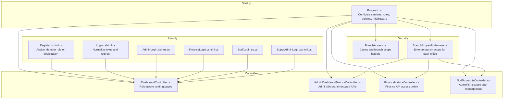
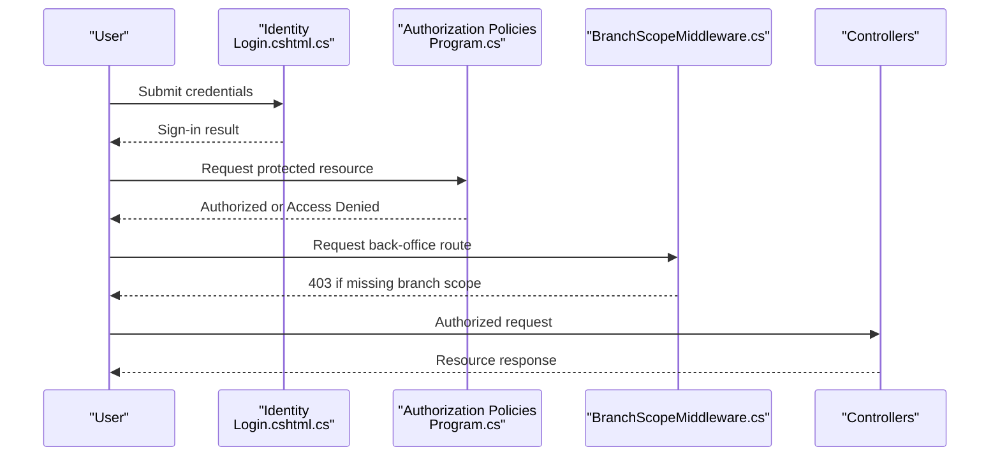
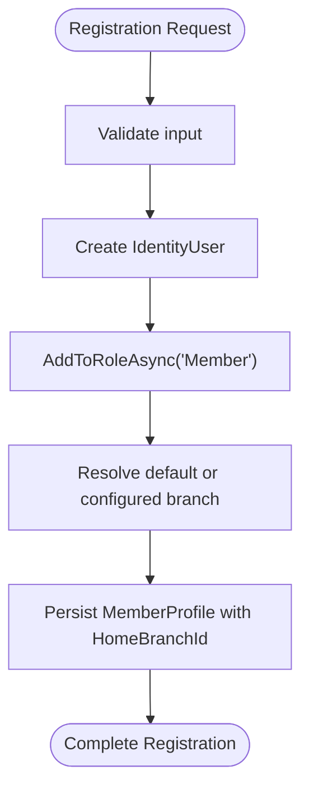
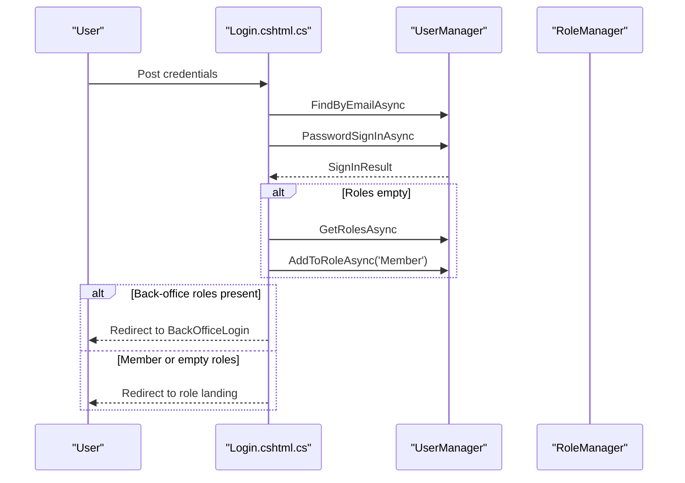
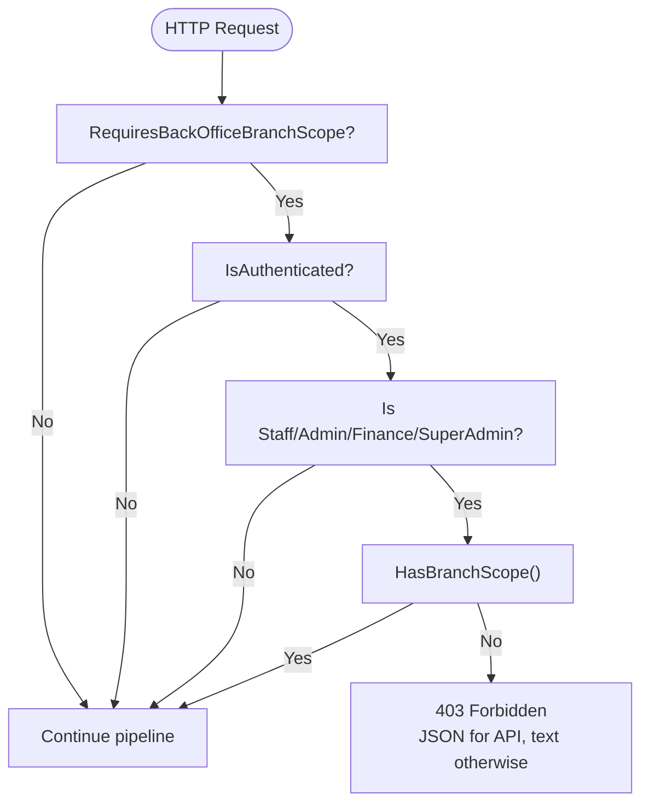
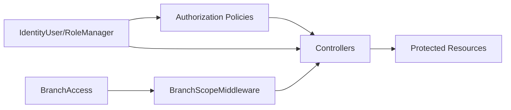

# Role-Based Access Control (RBAC)

<cite>
**Referenced Files in This Document**
- [Program.cs](file://Program.cs)
- [BranchAccess.cs](file://Security/BranchAccess.cs)
- [BranchScopeMiddleware.cs](file://Security/BranchScopeMiddleware.cs)
- [Register.cshtml.cs](file://Areas/Identity/Pages/Account/Register.cshtml.cs)
- [Login.cshtml.cs](file://Areas/Identity/Pages/Account/Login.cshtml.cs)
- [AdminLogin.cshtml.cs](file://Areas/Identity/Pages/Account/AdminLogin.cshtml.cs)
- [FinanceLogin.cshtml.cs](file://Areas/Identity/Pages/Account/FinanceLogin.cshtml.cs)
- [StaffLogin.cshtml.cs](file://Areas/Identity/Pages/Account/StaffLogin.cshtml.cs)
- [SuperAdminLogin.cshtml.cs](file://Areas/Identity/Pages/Account/SuperAdminLogin.cshtml.cs)
- [DashboardController.cs](file://Controllers/DashboardController.cs)
- [AdminDashboardMetricsController.cs](file://Controllers/AdminDashboardMetricsController.cs)
- [FinanceMetricsController.cs](file://Controllers/FinanceMetricsController.cs)
- [StaffAccountsController.cs](file://Controllers/StaffAccountsController.cs)
</cite>

## Table of Contents
1. [Introduction](#introduction)
2. [Project Structure](#project-structure)
3. [Core Components](#core-components)
4. [Architecture Overview](#architecture-overview)
5. [Detailed Component Analysis](#detailed-component-analysis)
6. [Dependency Analysis](#dependency-analysis)
7. [Performance Considerations](#performance-considerations)
8. [Troubleshooting Guide](#troubleshooting-guide)
9. [Conclusion](#conclusion)

## Introduction
This document describes the Role-Based Access Control (RBAC) system in EJC Fitness Gym. It explains the hierarchical roles, how roles are assigned during registration and login, the authorization policies that govern access to application areas, and how special cases like SuperAdmin operate with unrestricted access across branches. Practical examples demonstrate role checks in controllers and pages, and how navigation menus and feature availability reflect role-based permissions.

## Project Structure
The RBAC implementation spans several layers:
- Authentication and authorization configuration in the application startup
- Role creation and initial seeding
- Middleware enforcing branch-scoped access for back-office roles
- Controllers and pages enforcing role-based access
- Utility helpers for branch scoping and claims

**Diagram sources**
- [Program.cs](file://Program.cs)
- [BranchAccess.cs](file://Security/BranchAccess.cs)
- [BranchScopeMiddleware.cs](file://Security/BranchScopeMiddleware.cs)
- [Register.cshtml.cs](file://Areas/Identity/Pages/Account/Register.cshtml.cs)
- [Login.cshtml.cs](file://Areas/Identity/Pages/Account/Login.cshtml.cs)
- [AdminLogin.cshtml.cs](file://Areas/Identity/Pages/Account/AdminLogin.cshtml.cs)
- [FinanceLogin.cshtml.cs](file://Areas/Identity/Pages/Account/FinanceLogin.cshtml.cs)
- [StaffLogin.cshtml.cs](file://Areas/Identity/Pages/Account/StaffLogin.cshtml.cs)
- [SuperAdminLogin.cshtml.cs](file://Areas/Identity/Pages/Account/SuperAdminLogin.cshtml.cs)
- [DashboardController.cs](file://Controllers/DashboardController.cs)
- [AdminDashboardMetricsController.cs](file://Controllers/AdminDashboardMetricsController.cs)
- [FinanceMetricsController.cs](file://Controllers/FinanceMetricsController.cs)
- [StaffAccountsController.cs](file://Controllers/StaffAccountsController.cs)

**Section sources**
- [Program.cs](file://Program.cs)
- [BranchAccess.cs](file://Security/BranchAccess.cs)
- [BranchScopeMiddleware.cs](file://Security/BranchScopeMiddleware.cs)
- [Register.cshtml.cs](file://Areas/Identity/Pages/Account/Register.cshtml.cs)
- [Login.cshtml.cs](file://Areas/Identity/Pages/Account/Login.cshtml.cs)
- [DashboardController.cs](file://Controllers/DashboardController.cs)

## Core Components
- Roles: Member, Staff, Finance, Admin, SuperAdmin
- Policies: AdminAccess, FinanceAccess, FinanceApiAccess, StaffAccess, MemberAccess
- Branch scoping: Users in Staff, Finance, Admin, SuperAdmin must carry a branch claim to access back-office resources
- Middleware: BranchScopeMiddleware enforces branch scope requirement for back-office routes
- Controllers: Authorize attributes and runtime checks enforce role and scope policies

**Section sources**
- [Program.cs](file://Program.cs)
- [BranchAccess.cs](file://Security/BranchAccess.cs)
- [BranchScopeMiddleware.cs](file://Security/BranchScopeMiddleware.cs)
- [DashboardController.cs](file://Controllers/DashboardController.cs)

## Architecture Overview
The RBAC architecture combines ASP.NET Core Identity roles with custom branch-scoped claims and middleware enforcement.

**Diagram sources**
- [Login.cshtml.cs](file://Areas/Identity/Pages/Account/Login.cshtml.cs)
- [Program.cs](file://Program.cs)
- [BranchScopeMiddleware.cs](file://Security/BranchScopeMiddleware.cs)
- [DashboardController.cs](file://Controllers/DashboardController.cs)

## Detailed Component Analysis

### Role Model and Hierarchical Structure
- Member: Front-desk member portal access
- Staff: Branch-level staff operations (check-ins, POS, reports)
- Finance: Branch-level financial metrics, alerts, equipment, expenses
- Admin: Branch-level administrative dashboards and inventory
- SuperAdmin: Full unrestricted access across all branches and system administration

Branch scoping applies to Staff, Finance, Admin, and SuperAdmin. SuperAdmin bypasses branch scope checks.

**Section sources**
- [Program.cs](file://Program.cs)
- [BranchAccess.cs](file://Security/BranchAccess.cs)

### Role Assignment During Registration
- Newly registered users are automatically assigned the Member role
- A home branch is resolved and assigned to the user’s profile
- Email verification may be enforced depending on configuration

**Diagram sources**
- [Register.cshtml.cs](file://Areas/Identity/Pages/Account/Register.cshtml.cs)

**Section sources**
- [Register.cshtml.cs](file://Areas/Identity/Pages/Account/Register.cshtml.cs)

### Role Assignment During Login
- On successful login, legacy accounts without roles receive automatic Member role assignment
- Back-office users are redirected to the appropriate back-office login page
- Role-aware landing pages are selected based on user roles

**Diagram sources**
- [Login.cshtml.cs](file://Areas/Identity/Pages/Account/Login.cshtml.cs)

**Section sources**
- [Login.cshtml.cs](file://Areas/Identity/Pages/Account/Login.cshtml.cs)

### Authorization Policies and Enforcement
- AdminAccess: Admin, Finance, SuperAdmin with branch scope
- FinanceAccess: Finance, SuperAdmin with branch scope
- FinanceApiAccess: Admin, Finance, SuperAdmin with branch scope
- StaffAccess: Staff, Admin, SuperAdmin with branch scope
- MemberAccess: Member only

Policies are applied globally to folders and individually to controllers.

**Section sources**
- [Program.cs](file://Program.cs)

### Branch Scope Enforcement Middleware
- Applies to back-office routes under Admin, Finance, Staff, Invoices, SubscriptionPlans, and matching API prefixes
- For authenticated back-office users without branch scope, returns 403 (JSON for API, text for HTML)
- SuperAdmin users are exempt from branch scope checks

**Diagram sources**
- [BranchScopeMiddleware.cs](file://Security/BranchScopeMiddleware.cs)
- [BranchAccess.cs](file://Security/BranchAccess.cs)

**Section sources**
- [BranchScopeMiddleware.cs](file://Security/BranchScopeMiddleware.cs)
- [BranchAccess.cs](file://Security/BranchAccess.cs)

### Role-Based Navigation and Feature Availability
- DashboardController selects role-specific landing pages:
  - SuperAdmin → SuperAdmin dashboard
  - Admin → Admin dashboard
  - Finance → Finance dashboard
  - Staff → Staff Check-In page
  - Member → Member dashboard
- Controllers enforce role-based access:
  - AdminDashboardMetricsController: Admin, SuperAdmin with branch scope
  - FinanceMetricsController: Policy FinanceApiAccess (Admin, Finance, SuperAdmin)
  - StaffAccountsController: Admin, SuperAdmin with branch scope

**Section sources**
- [DashboardController.cs](file://Controllers/DashboardController.cs)
- [AdminDashboardMetricsController.cs](file://Controllers/AdminDashboardMetricsController.cs)
- [FinanceMetricsController.cs](file://Controllers/FinanceMetricsController.cs)
- [StaffAccountsController.cs](file://Controllers/StaffAccountsController.cs)

### Special Case: SuperAdmin Unrestricted Access
- SuperAdmin bypasses branch scope checks in middleware and controllers
- SuperAdmin dashboard aggregates system-wide metrics and user management
- SuperAdmin can manage roles and branch assignments across the system

**Section sources**
- [BranchAccess.cs](file://Security/BranchAccess.cs)
- [BranchScopeMiddleware.cs](file://Security/BranchScopeMiddleware.cs)
- [DashboardController.cs](file://Controllers/DashboardController.cs)

### Role Inheritance and Permission Escalation
- Higher roles inherit access to lower-role areas:
  - Admin inherits Staff permissions
  - Finance inherits Staff permissions
  - SuperAdmin inherits all permissions and bypasses branch scope
- Branch-scoped roles require a branch claim; SuperAdmin is exempt
- Runtime checks in controllers can further refine access within endpoints

**Section sources**
- [Program.cs](file://Program.cs)
- [BranchAccess.cs](file://Security/BranchAccess.cs)
- [BranchScopeMiddleware.cs](file://Security/BranchScopeMiddleware.cs)

## Dependency Analysis
The RBAC system depends on:
- ASP.NET Core Identity for roles and claims
- Custom branch-scoped claims and middleware
- Authorization policies configured at startup
- Controllers enforcing authorization attributes and runtime checks

**Diagram sources**
- [Program.cs](file://Program.cs)
- [BranchAccess.cs](file://Security/BranchAccess.cs)
- [BranchScopeMiddleware.cs](file://Security/BranchScopeMiddleware.cs)
- [DashboardController.cs](file://Controllers/DashboardController.cs)

**Section sources**
- [Program.cs](file://Program.cs)
- [BranchAccess.cs](file://Security/BranchAccess.cs)
- [BranchScopeMiddleware.cs](file://Security/BranchScopeMiddleware.cs)
- [DashboardController.cs](file://Controllers/DashboardController.cs)

## Performance Considerations
- Prefer authorization policies over per-request role checks in controllers for centralized enforcement
- Use branch-scoped queries to limit data access and reduce overhead
- Leverage caching for static role and branch metadata where appropriate
- Keep authorization logic minimal in hot paths to avoid latency

## Troubleshooting Guide
Common issues and resolutions:
- Back-office access denied: Ensure the user has a branch claim or is SuperAdmin
- Role landing page incorrect: Verify role assignment and middleware redirection logic
- API forbidden: Confirm the request includes proper authentication and branch scope
- Legacy accounts without roles: Ensure automatic Member role assignment occurs on first login

**Section sources**
- [Login.cshtml.cs](file://Areas/Identity/Pages/Account/Login.cshtml.cs)
- [BranchScopeMiddleware.cs](file://Security/BranchScopeMiddleware.cs)
- [Program.cs](file://Program.cs)

## Conclusion
EJC Fitness Gym’s RBAC system leverages ASP.NET Core Identity roles combined with branch-scoped claims and middleware enforcement. SuperAdmin enjoys unrestricted access across branches, while Staff, Finance, and Admin are constrained to their assigned branch. Authorization policies and controllers enforce access consistently, ensuring secure and predictable behavior across the application.