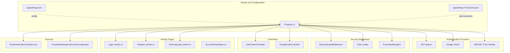
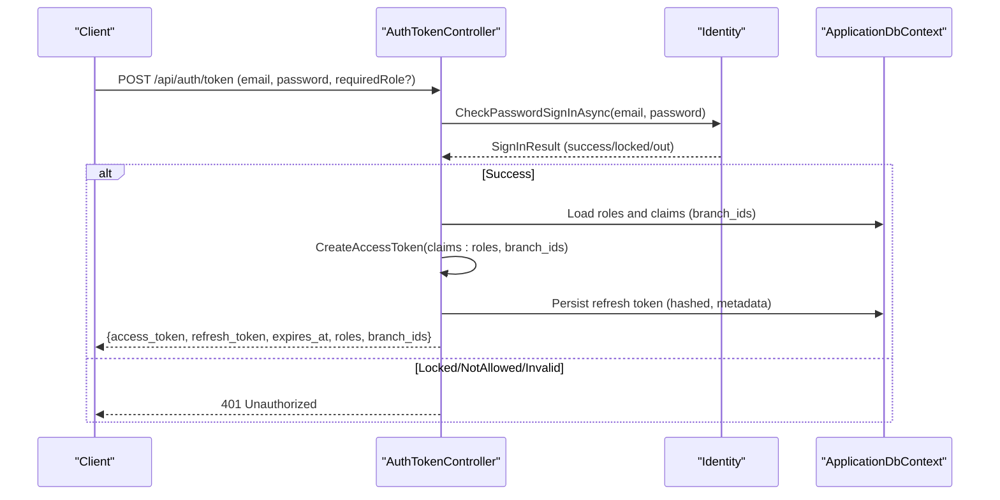
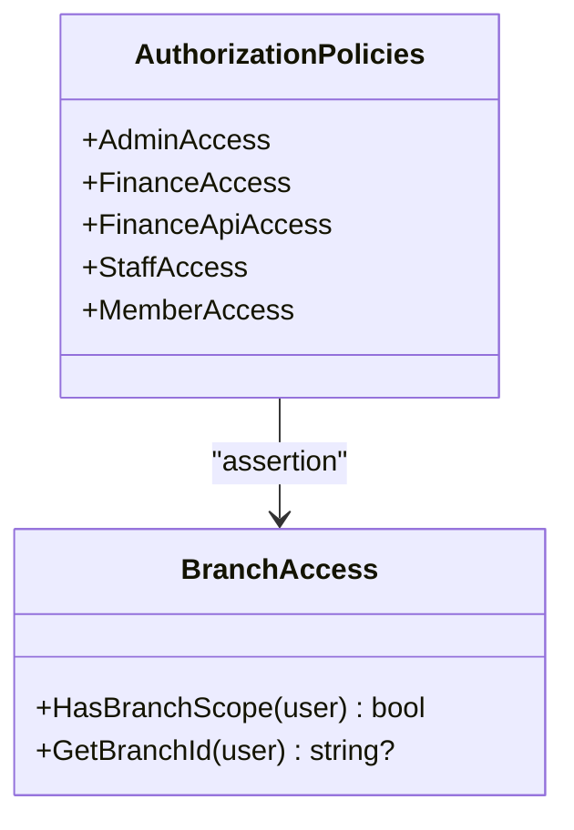
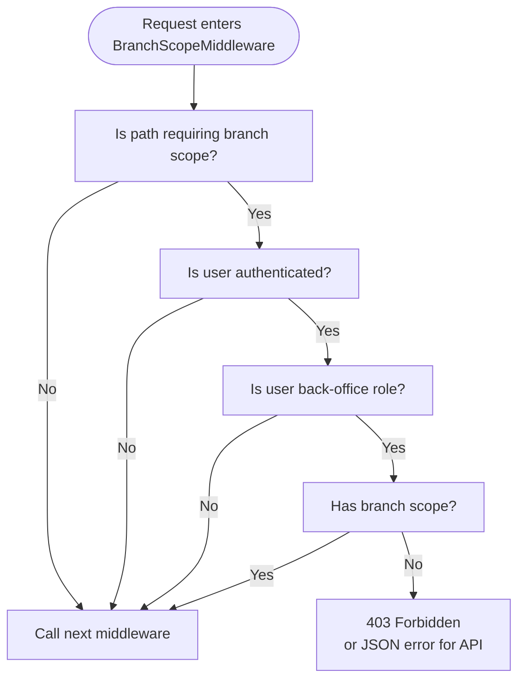
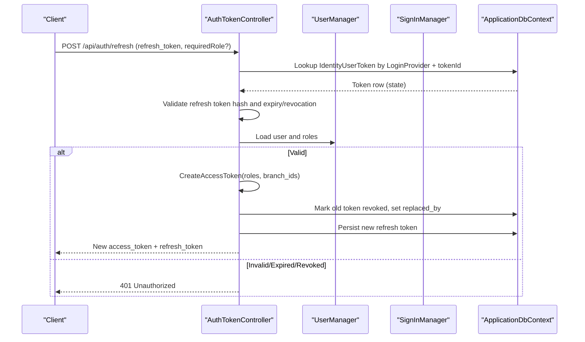
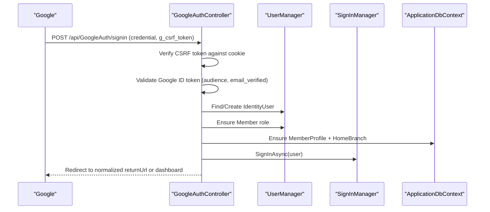
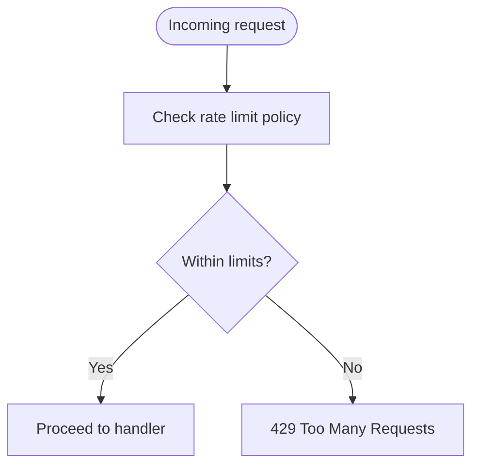
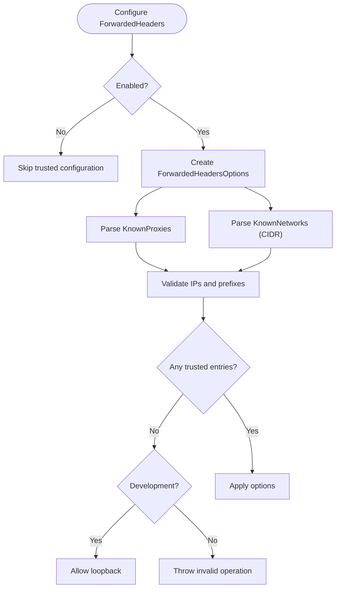
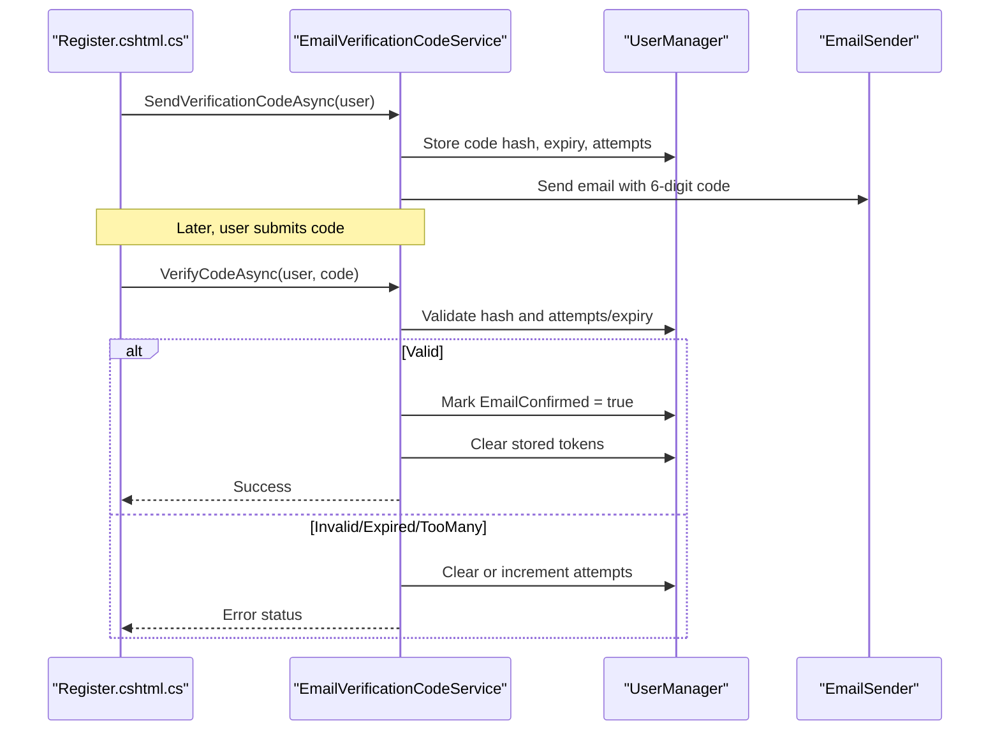
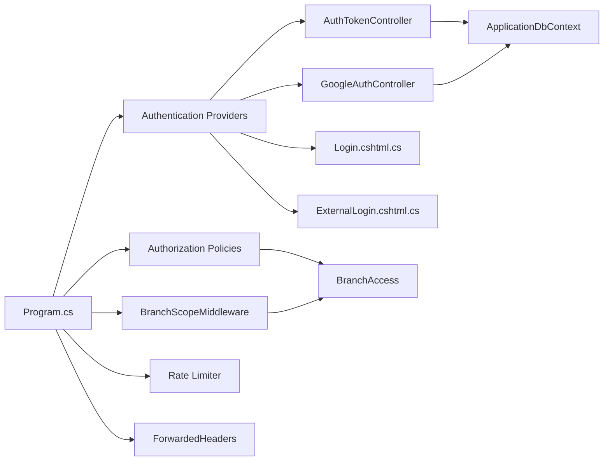

# Security and Authentication

<cite>
**Referenced Files in This Document**
- [Program.cs](file://Program.cs)
- [appsettings.json](file://appsettings.json)
- [appsettings.Production.json](file://appsettings.Production.json)
- [Security/JwtOptions.cs](file://Security/JwtOptions.cs)
- [Security/BranchScopeMiddleware.cs](file://Security/BranchScopeMiddleware.cs)
- [Security/BranchAccess.cs](file://Security/BranchAccess.cs)
- [Security/RateLimitingOptions.cs](file://Security/RateLimitingOptions.cs)
- [Services/Monitoring/ForwardedHeadersSecurityConfigurator.cs](file://Services/Monitoring/ForwardedHeadersSecurityConfigurator.cs)
- [Controllers/AuthTokenController.cs](file://Controllers/AuthTokenController.cs)
- [Controllers/GoogleAuthController.cs](file://Controllers/GoogleAuthController.cs)
- [Areas/Identity/Pages/Account/Login.cshtml.cs](file://Areas/Identity/Pages/Account/Login.cshtml.cs)
- [Areas/Identity/Pages/Account/Register.cshtml.cs](file://Areas/Identity/Pages/Account/Register.cshtml.cs)
- [Areas/Identity/Pages/Account/ExternalLogin.cshtml.cs](file://Areas/Identity/Pages/Account/ExternalLogin.cshtml.cs)
- [Areas/Identity/Pages/Account/AccountFlowHelper.cs](file://Areas/Identity/Pages/Account/AccountFlowHelper.cs)
- [Services/Identity/EmailVerificationCodeService.cs](file://Services/Identity/EmailVerificationCodeService.cs)
- [Data/ApplicationDbContext.cs](file://Data/ApplicationDbContext.cs)
</cite>

## Table of Contents
1. [Introduction](#introduction)
2. [Project Structure](#project-structure)
3. [Core Components](#core-components)
4. [Architecture Overview](#architecture-overview)
5. [Detailed Component Analysis](#detailed-component-analysis)
6. [Dependency Analysis](#dependency-analysis)
7. [Performance Considerations](#performance-considerations)
8. [Troubleshooting Guide](#troubleshooting-guide)
9. [Conclusion](#conclusion)

## Introduction
This document explains the security and authentication architecture of the EJC Fitness Gym system. It covers:
- Role-based access control (RBAC) with roles for Member, Staff, Finance, Admin, and SuperAdmin
- Branch-scoped RBAC ensuring data isolation across gym locations
- JWT-based authentication with token issuance, validation, refresh, and revocation
- Google OAuth integration for external sign-in
- Rate limiting to mitigate brute-force and abuse
- Forwarded headers security for reverse proxy/load balancer environments
- Cookie policy and session handling
- Integration with ASP.NET Core Identity for user management and email verification

## Project Structure
Security and authentication spans several layers:
- Configuration and middleware setup in the application startup pipeline
- JWT and Google authentication providers
- Identity pages and flows for login, registration, and external login
- Branch-scoped authorization policies and middleware
- Rate limiting and forwarded headers security
- Identity services for email verification

**Diagram sources**
- [Program.cs:1-800](file://Program.cs#L1-L800)
- [appsettings.json:1-126](file://appsettings.json#L1-L126)
- [appsettings.Production.json:1-33](file://appsettings.Production.json#L1-L33)

**Section sources**
- [Program.cs:1-800](file://Program.cs#L1-L800)
- [appsettings.json:1-126](file://appsettings.json#L1-L126)
- [appsettings.Production.json:1-33](file://appsettings.Production.json#L1-L33)

## Core Components
- JWT Options: Issuer, audience, signing key, access/refresh token lifetimes, limits, and retention
- Branch Access Utilities: Claims-based branch scoping and helpers
- Branch Scope Middleware: Enforces branch assignment for back-office endpoints
- Rate Limiting Options: Policies and thresholds for authentication endpoints
- Forwarded Headers Security: Trusted proxy/network configuration and validation
- AuthTokenController: Password-based JWT issuance, refresh, revoke, and identity retrieval
- GoogleAuthController: Google Sign-In with CSRF verification and member role assignment
- Identity Pages: Login, registration, external login, and flow normalization
- EmailVerificationCodeService: Time-bound, fixed-time verification tokens with retry limits
- Application Authorization Policies: Role-based policies with branch scope assertions

**Section sources**
- [Security/JwtOptions.cs:1-14](file://Security/JwtOptions.cs#L1-L14)
- [Security/BranchAccess.cs:1-31](file://Security/BranchAccess.cs#L1-L31)
- [Security/BranchScopeMiddleware.cs:1-73](file://Security/BranchScopeMiddleware.cs#L1-L73)
- [Security/RateLimitingOptions.cs:1-13](file://Security/RateLimitingOptions.cs#L1-L13)
- [Services/Monitoring/ForwardedHeadersSecurityConfigurator.cs:1-97](file://Services/Monitoring/ForwardedHeadersSecurityConfigurator.cs#L1-L97)
- [Controllers/AuthTokenController.cs:1-597](file://Controllers/AuthTokenController.cs#L1-L597)
- [Controllers/GoogleAuthController.cs:1-303](file://Controllers/GoogleAuthController.cs#L1-L303)
- [Areas/Identity/Pages/Account/Login.cshtml.cs:1-204](file://Areas/Identity/Pages/Account/Login.cshtml.cs#L1-L204)
- [Areas/Identity/Pages/Account/Register.cshtml.cs:1-354](file://Areas/Identity/Pages/Account/Register.cshtml.cs#L1-L354)
- [Areas/Identity/Pages/Account/ExternalLogin.cshtml.cs:1-396](file://Areas/Identity/Pages/Account/ExternalLogin.cshtml.cs#L1-L396)
- [Areas/Identity/Pages/Account/AccountFlowHelper.cs:1-197](file://Areas/Identity/Pages/Account/AccountFlowHelper.cs#L1-L197)
- [Services/Identity/EmailVerificationCodeService.cs:1-179](file://Services/Identity/EmailVerificationCodeService.cs#L1-L179)
- [Program.cs:315-343](file://Program.cs#L315-L343)

## Architecture Overview
The system integrates cookie-based and JWT-based authentication with explicit authorization policies and branch-scoped enforcement.

**Diagram sources**
- [Controllers/AuthTokenController.cs:49-117](file://Controllers/AuthTokenController.cs#L49-L117)
- [Areas/Identity/Pages/Account/Login.cshtml.cs:83-202](file://Areas/Identity/Pages/Account/Login.cshtml.cs#L83-L202)

**Section sources**
- [Controllers/AuthTokenController.cs:1-597](file://Controllers/AuthTokenController.cs#L1-L597)
- [Program.cs:199-270](file://Program.cs#L199-L270)

## Detailed Component Analysis

### Role-Based Access Control (RBAC)
- Roles: Member, Staff, Finance, Admin, SuperAdmin
- Policies:
  - AdminAccess: Admin, Finance, SuperAdmin with branch scope
  - FinanceAccess: Finance, SuperAdmin with branch scope
  - FinanceApiAccess: Admin, Finance, SuperAdmin with branch scope
  - StaffAccess: Staff, Admin, SuperAdmin with branch scope
  - MemberAccess: Member only
- Enforcement: Policies assert branch scope via HasBranchScope()

**Diagram sources**
- [Program.cs:315-343](file://Program.cs#L315-L343)
- [Security/BranchAccess.cs:15-28](file://Security/BranchAccess.cs#L15-L28)

**Section sources**
- [Program.cs:315-343](file://Program.cs#L315-L343)
- [Security/BranchAccess.cs:1-31](file://Security/BranchAccess.cs#L1-L31)

### Branch Scoping Security Model
- BranchId claim type is used to scope resources per gym location
- BranchScopeMiddleware enforces branch assignment for back-office routes
- SuperAdmin bypasses branch scope checks
- Certain routes (e.g., UserBranches) are excluded from branch scope enforcement

**Diagram sources**
- [Security/BranchScopeMiddleware.cs:14-53](file://Security/BranchScopeMiddleware.cs#L14-L53)
- [Security/BranchAccess.cs:15-28](file://Security/BranchAccess.cs#L15-L28)

**Section sources**
- [Security/BranchScopeMiddleware.cs:1-73](file://Security/BranchScopeMiddleware.cs#L1-L73)
- [Security/BranchAccess.cs:1-31](file://Security/BranchAccess.cs#L1-L31)

### JWT-Based Authentication
- Issuance: Validates credentials, resolves roles and branch claims, creates access token with issuer/audience/signing key, and persists hashed refresh token
- Validation: Policy scheme selects JWT Bearer when Authorization header starts with Bearer
- Refresh: Parses refresh token, validates hash, checks expiry/revocation, rotates token, prunes old tokens
- Revocation: Marks refresh token revoked in storage
- Identity endpoint: Returns current user’s roles and branch claims

**Diagram sources**
- [Controllers/AuthTokenController.cs:121-201](file://Controllers/AuthTokenController.cs#L121-L201)
- [Controllers/AuthTokenController.cs:348-441](file://Controllers/AuthTokenController.cs#L348-L441)

**Section sources**
- [Controllers/AuthTokenController.cs:1-597](file://Controllers/AuthTokenController.cs#L1-L597)
- [Security/JwtOptions.cs:1-14](file://Security/JwtOptions.cs#L1-L14)
- [Program.cs:214-257](file://Program.cs#L214-L257)

### Google OAuth Integration
- Endpoint: POST api/GoogleAuth/signin with credential and CSRF token
- CSRF verification: Compares request token with cookie token using constant-time comparison
- Validation: Verifies Google ID token audience and email verification
- User creation: Creates IdentityUser if not exists, assigns Member role, ensures profile and home branch
- Redirects: Normalizes return URLs and handles back-office role restrictions

**Diagram sources**
- [Controllers/GoogleAuthController.cs:41-138](file://Controllers/GoogleAuthController.cs#L41-L138)
- [Controllers/GoogleAuthController.cs:269-281](file://Controllers/GoogleAuthController.cs#L269-L281)

**Section sources**
- [Controllers/GoogleAuthController.cs:1-303](file://Controllers/GoogleAuthController.cs#L1-L303)
- [Areas/Identity/Pages/Account/ExternalLogin.cshtml.cs:197-281](file://Areas/Identity/Pages/Account/ExternalLogin.cshtml.cs#L197-L281)

### Rate Limiting Configuration
- Policies:
  - StrictAuthLimit: Used on token issuance and refresh
  - AnonymousLimit: Used on anonymous endpoints
- Limits: PermitLimit, WindowSeconds, QueueLimit
- Enforcement: Applied via EnableRateLimiting attributes on controllers/actions

**Diagram sources**
- [Security/RateLimitingOptions.cs:1-13](file://Security/RateLimitingOptions.cs#L1-L13)
- [Program.cs:439-456](file://Program.cs#L439-L456)
- [Controllers/AuthTokenController.cs:50-51](file://Controllers/AuthTokenController.cs#L50-L51)
- [Controllers/AuthTokenController.cs:120-121](file://Controllers/AuthTokenController.cs#L120-L121)

**Section sources**
- [Security/RateLimitingOptions.cs:1-13](file://Security/RateLimitingOptions.cs#L1-L13)
- [Program.cs:439-456](file://Program.cs#L439-L456)
- [Controllers/AuthTokenController.cs:1-597](file://Controllers/AuthTokenController.cs#L1-L597)

### Forwarded Headers Security Configuration
- Trusted proxies/networks: KnownProxies and KnownNetworks validated and enforced
- Header handling: X-Forwarded-For and X-Forwarded-Proto supported
- Symmetry: Optional header symmetry requirement
- Development fallback: Allows loopback when no trusted entries configured

**Diagram sources**
- [Services/Monitoring/ForwardedHeadersSecurityConfigurator.cs:9-73](file://Services/Monitoring/ForwardedHeadersSecurityConfigurator.cs#L9-L73)

**Section sources**
- [Services/Monitoring/ForwardedHeadersSecurityConfigurator.cs:1-97](file://Services/Monitoring/ForwardedHeadersSecurityConfigurator.cs#L1-L97)
- [Program.cs:180-189](file://Program.cs#L180-L189)

### Cookie Policy, Secure Sessions, and CSRF
- Application cookie:
  - HttpOnly: true
  - SameSite: Strict
  - SecurePolicy: Always in production, SameAsRequest otherwise
  - Redirect behavior: API 401/403 for unauthenticated requests
- Session:
  - Distributed memory cache
  - Lax SameSite
  - HttpOnly
  - IdleTimeout 4 hours
- CSRF:
  - Google OAuth uses CSRF token verification via cookie and request comparison
  - Constant-time comparison prevents timing attacks

**Section sources**
- [Program.cs:271-313](file://Program.cs#L271-L313)
- [Program.cs:459-466](file://Program.cs#L459-L466)
- [Controllers/GoogleAuthController.cs:269-281](file://Controllers/GoogleAuthController.cs#L269-L281)

### ASP.NET Core Identity Integration and Email Verification
- Identity defaults:
  - Unique email, lockout, confirmed email in non-development
  - Password policies vary by environment
- Email verification:
  - 6-digit code with SHA-256 hash stored as token
  - Expiration window and retry limits
  - Fixed-time comparison for code validation
  - Clears tokens after success or expiry/retries

**Diagram sources**
- [Areas/Identity/Pages/Account/Register.cshtml.cs:147-259](file://Areas/Identity/Pages/Account/Register.cshtml.cs#L147-L259)
- [Services/Identity/EmailVerificationCodeService.cs:32-131](file://Services/Identity/EmailVerificationCodeService.cs#L32-L131)

**Section sources**
- [Program.cs:63-85](file://Program.cs#L63-L85)
- [Services/Identity/EmailVerificationCodeService.cs:1-179](file://Services/Identity/EmailVerificationCodeService.cs#L1-L179)
- [Areas/Identity/Pages/Account/Register.cshtml.cs:1-354](file://Areas/Identity/Pages/Account/Register.cshtml.cs#L1-L354)

## Dependency Analysis
- Startup composes authentication providers and applies policies
- Controllers depend on Identity services and DbContext for persistence
- BranchScopeMiddleware depends on ClaimsPrincipal and branch claim constants
- Rate limiter and forwarded headers are applied globally before authorization

**Diagram sources**
- [Program.cs:199-343](file://Program.cs#L199-L343)
- [Security/BranchAccess.cs:1-31](file://Security/BranchAccess.cs#L1-L31)
- [Controllers/AuthTokenController.cs:1-597](file://Controllers/AuthTokenController.cs#L1-L597)
- [Controllers/GoogleAuthController.cs:1-303](file://Controllers/GoogleAuthController.cs#L1-L303)
- [Areas/Identity/Pages/Account/Login.cshtml.cs:1-204](file://Areas/Identity/Pages/Account/Login.cshtml.cs#L1-L204)
- [Areas/Identity/Pages/Account/ExternalLogin.cshtml.cs:1-396](file://Areas/Identity/Pages/Account/ExternalLogin.cshtml.cs#L1-L396)
- [Data/ApplicationDbContext.cs:1-414](file://Data/ApplicationDbContext.cs#L1-L414)

**Section sources**
- [Program.cs:1-800](file://Program.cs#L1-L800)
- [Data/ApplicationDbContext.cs:1-414](file://Data/ApplicationDbContext.cs#L1-L414)

## Performance Considerations
- JWT signing key validation occurs per request; ensure keys are configured to avoid runtime failures
- Refresh token pruning caps active tokens per user and retention period to control storage growth
- Rate limiter windows and permit limits should be tuned for expected traffic patterns
- Forwarded headers parsing validates inputs; misconfiguration throws early to prevent unsafe proxy trust

[No sources needed since this section provides general guidance]

## Troubleshooting Guide
- JWT signing key missing in production:
  - Symptom: 503 responses indicating signing key not configured
  - Resolution: Set Jwt:SigningKey in configuration
- Google OAuth errors:
  - Symptom: Redirects with error messages or CSRF mismatch
  - Resolution: Verify Google ClientId/ClientSecret, CSRF cookie presence, and email verification flag
- Branch scope forbidden:
  - Symptom: 403 when accessing back-office endpoints
  - Resolution: Assign branch claims to user or use SuperAdmin role
- Rate limit exceeded:
  - Symptom: 429 responses on auth endpoints
  - Resolution: Reduce client-side retries or adjust rate limiter configuration
- Forwarded headers misconfiguration:
  - Symptom: Incorrect client IPs or proto detection
  - Resolution: Configure KnownProxies/KnownNetworks and header symmetry appropriately

**Section sources**
- [Controllers/AuthTokenController.cs:95-99](file://Controllers/AuthTokenController.cs#L95-L99)
- [Controllers/GoogleAuthController.cs:52-66](file://Controllers/GoogleAuthController.cs#L52-L66)
- [Security/BranchScopeMiddleware.cs:41-52](file://Security/BranchScopeMiddleware.cs#L41-L52)
- [Program.cs:439-456](file://Program.cs#L439-L456)
- [Services/Monitoring/ForwardedHeadersSecurityConfigurator.cs:68-70](file://Services/Monitoring/ForwardedHeadersSecurityConfigurator.cs#L68-L70)

## Conclusion
The EJC Fitness Gym system implements a robust, layered security model:
- Clear RBAC with branch scoping for data isolation
- JWT-based authentication with secure refresh and revocation
- Google OAuth with CSRF protection and seamless member onboarding
- Strong rate limiting and forwarded headers security
- Secure cookie/session policies and Identity-driven email verification

These controls collectively protect user data, enforce role-based permissions, and maintain operational resilience under various deployment topologies.