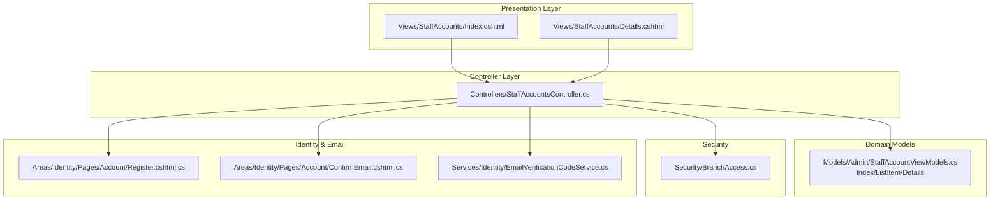
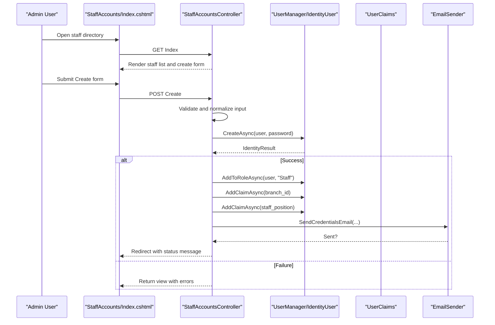
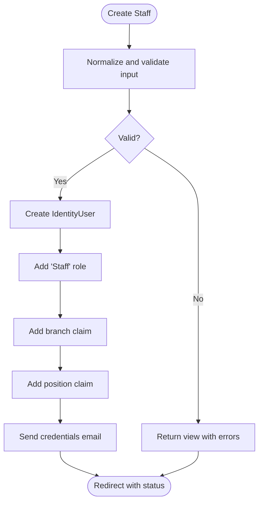
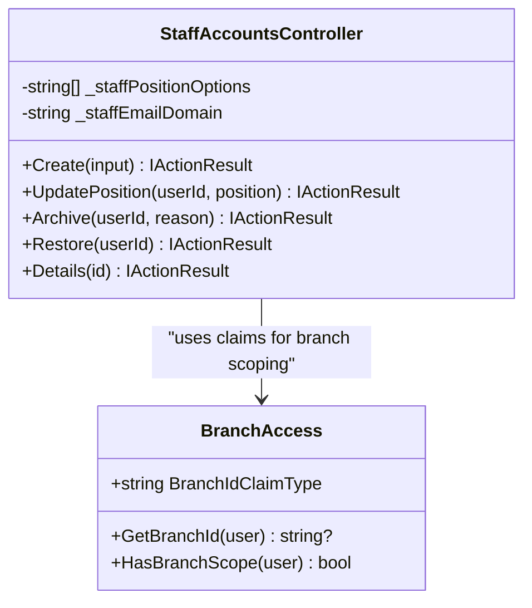
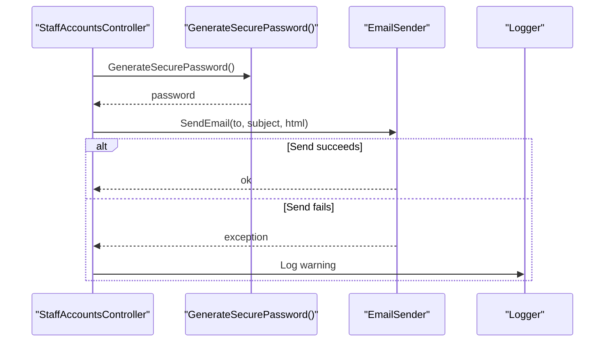
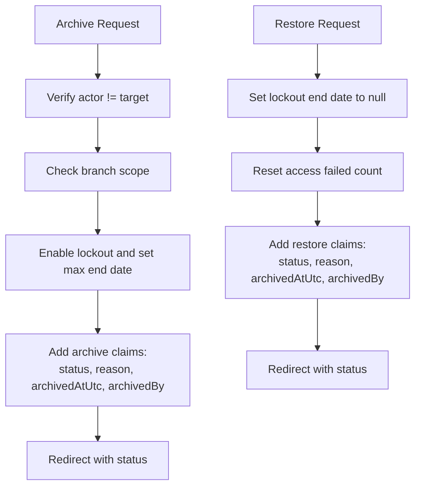
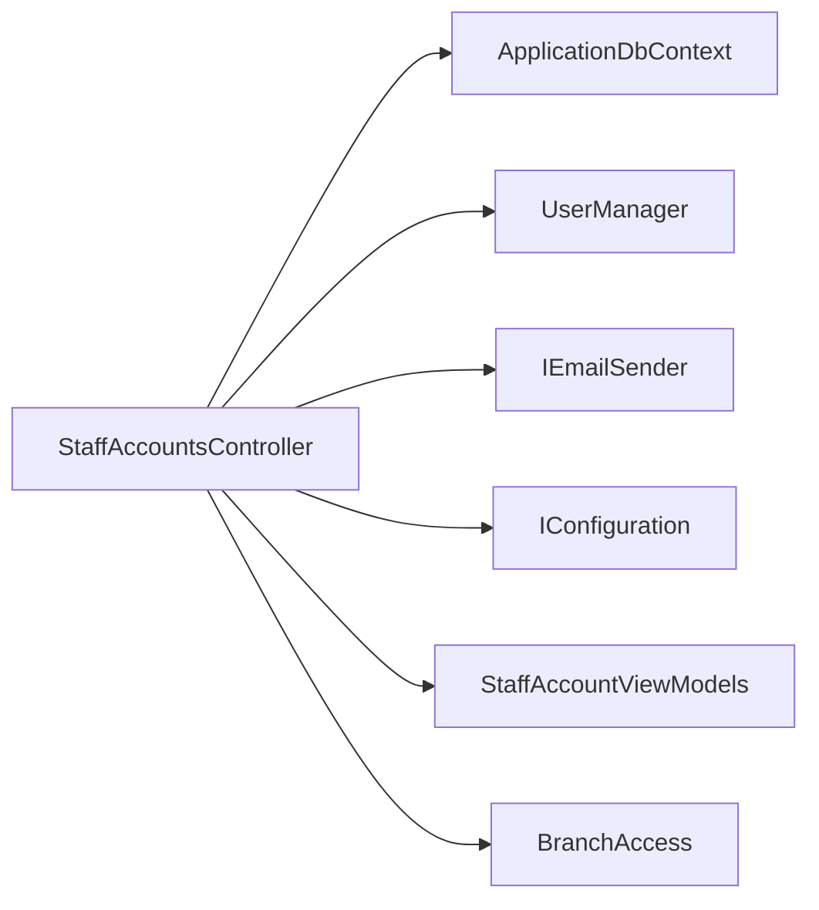

# Staff Accounts Management

<cite>
**Referenced Files in This Document**
- [StaffAccountsController.cs](file://Controllers/StaffAccountsController.cs)
- [StaffAccountViewModels.cs](file://Models/Admin/StaffAccountViewModels.cs)
- [Index.cshtml](file://Views/StaffAccounts/Index.cshtml)
- [Details.cshtml](file://Views/StaffAccounts/Details.cshtml)
- [BranchAccess.cs](file://Security/BranchAccess.cs)
- [EmailVerificationCodeService.cs](file://Services/Identity/EmailVerificationCodeService.cs)
- [Register.cshtml.cs](file://Areas/Identity/Pages/Account/Register.cshtml.cs)
- [ConfirmEmail.cshtml.cs](file://Areas/Identity/Pages/Account/ConfirmEmail.cshtml.cs)
</cite>

## Table of Contents
1. [Introduction](#introduction)
2. [Project Structure](#project-structure)
3. [Core Components](#core-components)
4. [Architecture Overview](#architecture-overview)
5. [Detailed Component Analysis](#detailed-component-analysis)
6. [Dependency Analysis](#dependency-analysis)
7. [Performance Considerations](#performance-considerations)
8. [Troubleshooting Guide](#troubleshooting-guide)
9. [Conclusion](#conclusion)
10. [Appendices](#appendices)

## Introduction
This document describes the staff accounts management functionality, covering the complete lifecycle from creation to restoration, including position management, branch assignment, access control, credential generation, email notifications, validation rules, and audit/logging of archive actions. It also outlines integration points with the identity management system and provides examples of CRUD operations.

## Project Structure
The staff accounts feature spans controllers, views, models, security helpers, and identity services:
- Controller: handles staff account CRUD, archival, restoration, and reporting
- Views: present staff directory, create modal, and details pages
- Models: strongly typed view models for index and details
- Security: branch-scoped claims and access checks
- Identity services: email verification and credential delivery

**Diagram sources**
- [StaffAccountsController.cs:15-1025](file://Controllers/StaffAccountsController.cs#L15-L1025)
- [StaffAccountViewModels.cs:1-112](file://Models/Admin/StaffAccountViewModels.cs#L1-L112)
- [Index.cshtml:1-401](file://Views/StaffAccounts/Index.cshtml#L1-L401)
- [Details.cshtml:1-157](file://Views/StaffAccounts/Details.cshtml#L1-L157)
- [BranchAccess.cs:1-31](file://Security/BranchAccess.cs#L1-L31)
- [Register.cshtml.cs:1-354](file://Areas/Identity/Pages/Account/Register.cshtml.cs#L1-L354)
- [ConfirmEmail.cshtml.cs:1-63](file://Areas/Identity/Pages/Account/ConfirmEmail.cshtml.cs#L1-L63)
- [EmailVerificationCodeService.cs:1-179](file://Services/Identity/EmailVerificationCodeService.cs#L1-L179)

**Section sources**
- [StaffAccountsController.cs:15-1025](file://Controllers/StaffAccountsController.cs#L15-L1025)
- [StaffAccountViewModels.cs:1-112](file://Models/Admin/StaffAccountViewModels.cs#L1-L112)
- [Index.cshtml:1-401](file://Views/StaffAccounts/Index.cshtml#L1-L401)
- [Details.cshtml:1-157](file://Views/StaffAccounts/Details.cshtml#L1-L157)
- [BranchAccess.cs:1-31](file://Security/BranchAccess.cs#L1-L31)
- [Register.cshtml.cs:1-354](file://Areas/Identity/Pages/Account/Register.cshtml.cs#L1-L354)
- [ConfirmEmail.cshtml.cs:1-63](file://Areas/Identity/Pages/Account/ConfirmEmail.cshtml.cs#L1-L63)
- [EmailVerificationCodeService.cs:1-179](file://Services/Identity/EmailVerificationCodeService.cs#L1-L179)

## Core Components
- StaffAccountsController: Implements staff account lifecycle operations (create, update position, archive, restore, details) with validation, normalization, and claims-based access control.
- StaffAccountViewModels: Defines strongly typed models for index listing, create input, and details view.
- Views: Provide UI for listing, creating, and viewing staff profiles, including archive tabs and action buttons.
- BranchAccess: Provides branch-scoped claims and helper methods for branch retrieval and scope checks.
- Identity services: Support email verification and credential delivery.

Key responsibilities:
- Validation: email normalization, phone number formatting, position validation, branch existence check
- Access control: role-based authorization and branch scoping
- Claims-based metadata: position, branch, archive status/reason/timestamp/archived-by, last login
- Audit/logging: archive history via claims; last login stored as claim
- Notifications: credential email delivery

**Section sources**
- [StaffAccountsController.cs:15-1025](file://Controllers/StaffAccountsController.cs#L15-L1025)
- [StaffAccountViewModels.cs:1-112](file://Models/Admin/StaffAccountViewModels.cs#L1-L112)
- [Index.cshtml:1-401](file://Views/StaffAccounts/Index.cshtml#L1-L401)
- [Details.cshtml:1-157](file://Views/StaffAccounts/Details.cshtml#L1-L157)
- [BranchAccess.cs:1-31](file://Security/BranchAccess.cs#L1-L31)

## Architecture Overview
The system integrates ASP.NET Core Identity with custom claims for branch scoping and staff metadata. Staff accounts are created as IdentityUser entries with the “Staff” role and supporting claims. Operations are restricted by roles and branch scope.

**Diagram sources**
- [StaffAccountsController.cs:71-198](file://Controllers/StaffAccountsController.cs#L71-L198)
- [Index.cshtml:222-323](file://Views/StaffAccounts/Index.cshtml#L222-L323)

**Section sources**
- [StaffAccountsController.cs:71-198](file://Controllers/StaffAccountsController.cs#L71-L198)
- [Index.cshtml:222-323](file://Views/StaffAccounts/Index.cshtml#L222-L323)

## Detailed Component Analysis

### Staff Account Lifecycle
- Creation
  - Validates email (normalization to domain), phone number formatting, position, and branch
  - Ensures uniqueness of email
  - Creates IdentityUser with normalized email, confirmed email, and optional phone
  - Assigns “Staff” role and branch/position claims
  - Generates secure temporary password and sends credentials email
- Modification
  - Update position: removes old position claims and adds new one with validation
- Archiving
  - Enables lockout, sets max lockout end date, and records archive claims (status, reason, timestamp, actor)
- Restoration
  - Clears lockout, resets access failure count, and records restore claims
- Details
  - Loads role, branch, position, archive status/reason/timestamp, last login, and recent attendance events

**Diagram sources**
- [StaffAccountsController.cs:71-198](file://Controllers/StaffAccountsController.cs#L71-L198)
- [StaffAccountsController.cs:930-1008](file://Controllers/StaffAccountsController.cs#L930-L1008)

**Section sources**
- [StaffAccountsController.cs:71-198](file://Controllers/StaffAccountsController.cs#L71-L198)
- [StaffAccountsController.cs:200-283](file://Controllers/StaffAccountsController.cs#L200-L283)
- [StaffAccountsController.cs:285-395](file://Controllers/StaffAccountsController.cs#L285-L395)
- [StaffAccountsController.cs:397-489](file://Controllers/StaffAccountsController.cs#L397-L489)
- [StaffAccountsController.cs:491-600](file://Controllers/StaffAccountsController.cs#L491-L600)

### Position Management
- Supported positions are configurable and default to predefined values if none are configured
- Normalization trims whitespace; validation ensures selection matches supported options
- Update position operation removes prior position claims and adds a new one

Supported positions:
- Front Desk
- Coach
- Trainer
- Sales
- Maintenance

**Section sources**
- [StaffAccountsController.cs:29-54](file://Controllers/StaffAccountsController.cs#L29-L54)
- [StaffAccountsController.cs:1010-1014](file://Controllers/StaffAccountsController.cs#L1010-L1014)
- [StaffAccountsController.cs:200-283](file://Controllers/StaffAccountsController.cs#L200-L283)

### Branch Assignment and Access Control
- Branch assignment is enforced via a branch claim on the user
- SuperAdmin can choose any active branch; branch admins are scoped to their assigned branch
- Access control checks:
  - Route-level authorization restricts to Admin/SuperAdmin
  - Branch scoping prevents cross-branch modifications
  - BranchId claim type constant is used consistently

**Diagram sources**
- [BranchAccess.cs:1-31](file://Security/BranchAccess.cs#L1-L31)
- [StaffAccountsController.cs:17-55](file://Controllers/StaffAccountsController.cs#L17-L55)

**Section sources**
- [BranchAccess.cs:1-31](file://Security/BranchAccess.cs#L1-L31)
- [StaffAccountsController.cs:17-55](file://Controllers/StaffAccountsController.cs#L17-L55)
- [StaffAccountsController.cs:602-823](file://Controllers/StaffAccountsController.cs#L602-L823)

### Credential Generation, Email Notification, and Security Measures
- Secure password generation with guaranteed character diversity and randomized ordering
- Credentials email includes email, temporary password, position, branch, and login URL
- Email delivery is attempted and failures are logged; UI indicates success/failure
- Phone number normalization enforces +63 prefix and 10-digit local part
- Email normalization enforces domain and sanitizes local part

**Diagram sources**
- [StaffAccountsController.cs:895-928](file://Controllers/StaffAccountsController.cs#L895-L928)
- [StaffAccountsController.cs:965-1008](file://Controllers/StaffAccountsController.cs#L965-L1008)

**Section sources**
- [StaffAccountsController.cs:895-928](file://Controllers/StaffAccountsController.cs#L895-L928)
- [StaffAccountsController.cs:965-1008](file://Controllers/StaffAccountsController.cs#L965-L1008)
- [StaffAccountsController.cs:869-893](file://Controllers/StaffAccountsController.cs#L869-L893)
- [StaffAccountsController.cs:930-963](file://Controllers/StaffAccountsController.cs#L930-L963)

### Validation Rules and Business Logic
- Email validation
  - Trims, lowercases, normalizes domain suffix, sanitizes local part
  - Rejects empty or invalid local parts
- Phone number validation
  - Accepts +63 prefix, strips leading zeros and country code, enforces 10 digits
- Position validation
  - Required and must match supported options
- Branch validation
  - Required for non-SuperAdmin; must correspond to an active branch record
- Duplicate prevention
  - Email uniqueness enforced before creation

**Section sources**
- [StaffAccountsController.cs:82-122](file://Controllers/StaffAccountsController.cs#L82-L122)
- [StaffAccountsController.cs:869-893](file://Controllers/StaffAccountsController.cs#L869-L893)
- [StaffAccountsController.cs:1010-1014](file://Controllers/StaffAccountsController.cs#L1010-L1014)
- [StaffAccountsController.cs:114-122](file://Controllers/StaffAccountsController.cs#L114-L122)

### Staff Account Status Tracking, Archive History, and Audit Trails
- Archive status tracked via a dedicated claim with “active”/“archived” values
- Archive reason, archived timestamp (UTC), and actor recorded as separate claims
- Last login timestamp stored as a claim for visibility
- Restoration reverts lockout and records restore event with timestamp and actor
- Details page surfaces archive reason and timestamp when applicable

**Diagram sources**
- [StaffAccountsController.cs:285-395](file://Controllers/StaffAccountsController.cs#L285-L395)
- [StaffAccountsController.cs:397-489](file://Controllers/StaffAccountsController.cs#L397-L489)

**Section sources**
- [StaffAccountsController.cs:285-395](file://Controllers/StaffAccountsController.cs#L285-L395)
- [StaffAccountsController.cs:397-489](file://Controllers/StaffAccountsController.cs#L397-L489)
- [StaffAccountsController.cs:533-559](file://Controllers/StaffAccountsController.cs#L533-L559)

### Examples of Staff Account CRUD Operations
- Create
  - Endpoint: POST Admin/StaffAccounts/Create
  - Input: email, phone, position, branch (conditional)
  - Outcome: IdentityUser created, role and claims added, credentials email sent
- Update Position
  - Endpoint: POST Admin/StaffAccounts/UpdatePosition
  - Input: userId, position
  - Outcome: replaces previous position claim with new one
- Archive
  - Endpoint: POST Admin/StaffAccounts/Archive
  - Input: userId, reason (optional)
  - Outcome: locks out user and records archive claims
- Restore
  - Endpoint: POST Admin/StaffAccounts/Restore
  - Input: userId
  - Outcome: unlocks user and records restore claims
- Details
  - Endpoint: GET Admin/StaffAccounts/Details/{id}
  - Outcome: renders profile with branch, position, archive info, last login, recent activity

**Section sources**
- [StaffAccountsController.cs:71-198](file://Controllers/StaffAccountsController.cs#L71-L198)
- [StaffAccountsController.cs:200-283](file://Controllers/StaffAccountsController.cs#L200-L283)
- [StaffAccountsController.cs:285-395](file://Controllers/StaffAccountsController.cs#L285-L395)
- [StaffAccountsController.cs:397-489](file://Controllers/StaffAccountsController.cs#L397-L489)
- [StaffAccountsController.cs:491-600](file://Controllers/StaffAccountsController.cs#L491-L600)

### Integration with Identity Management System
- Uses ASP.NET Core Identity (UserManager, IdentityUser)
- Roles: “Staff” role assigned during creation
- Claims: branch_id, staff_position, staff_archive_status, staff_archive_reason, staff_archived_at_utc, staff_archived_by, staff_last_login_utc
- Email verification: separate member registration flow uses email verification service; staff credentials email is sent directly upon creation

**Section sources**
- [StaffAccountsController.cs:138-186](file://Controllers/StaffAccountsController.cs#L138-L186)
- [StaffAccountsController.cs:164-186](file://Controllers/StaffAccountsController.cs#L164-L186)
- [Register.cshtml.cs:1-354](file://Areas/Identity/Pages/Account/Register.cshtml.cs#L1-L354)
- [ConfirmEmail.cshtml.cs:1-63](file://Areas/Identity/Pages/Account/ConfirmEmail.cshtml.cs#L1-L63)
- [EmailVerificationCodeService.cs:1-179](file://Services/Identity/EmailVerificationCodeService.cs#L1-L179)

## Dependency Analysis
- Controller depends on:
  - ApplicationDbContext for branch records and claims queries
  - UserManager for user operations, role management, and claims
  - IEmailSender for credential delivery
  - Configuration for email domain and supported positions
- Views depend on strongly typed view models and controller actions
- Security helper centralizes branch claim accessors

**Diagram sources**
- [StaffAccountsController.cs:32-55](file://Controllers/StaffAccountsController.cs#L32-L55)
- [StaffAccountViewModels.cs:1-112](file://Models/Admin/StaffAccountViewModels.cs#L1-L112)
- [BranchAccess.cs:1-31](file://Security/BranchAccess.cs#L1-L31)

**Section sources**
- [StaffAccountsController.cs:32-55](file://Controllers/StaffAccountsController.cs#L32-L55)
- [StaffAccountViewModels.cs:1-112](file://Models/Admin/StaffAccountViewModels.cs#L1-L112)
- [BranchAccess.cs:1-31](file://Security/BranchAccess.cs#L1-L31)

## Performance Considerations
- Batched claims queries per user reduce round-trips
- AsNoTracking used for read-only lists to improve query performance
- Sorting and pagination hints in the view assist large datasets
- Consider indexing claims by type and user for frequent lookups

## Troubleshooting Guide
Common issues and resolutions:
- Email domain normalization rejects invalid local parts; ensure the local part contains only allowed characters
- Phone number must be 10 digits after normalization; verify +63 prefix and local digits
- Branch must be active and selected by SuperAdmin; branch admins cannot select arbitrary branches
- Creating duplicate emails fails validation; ensure uniqueness
- If credential email fails, check SMTP settings; the controller logs warnings and UI displays a status message
- Archive/restore requires proper branch scope; cross-branch operations are forbidden

**Section sources**
- [StaffAccountsController.cs:82-122](file://Controllers/StaffAccountsController.cs#L82-L122)
- [StaffAccountsController.cs:930-963](file://Controllers/StaffAccountsController.cs#L930-L963)
- [StaffAccountsController.cs:869-893](file://Controllers/StaffAccountsController.cs#L869-L893)
- [StaffAccountsController.cs:965-1008](file://Controllers/StaffAccountsController.cs#L965-L1008)

## Conclusion
The staff accounts management system provides a robust, claims-driven approach to managing staff identities, positions, and branches with strong validation, access control, and auditability. The controller orchestrates lifecycle operations, while views deliver a clear interface for administrators. Integration with ASP.NET Core Identity and the email sender enables secure onboarding and ongoing operational control.

## Appendices

### UI Workflows
- Staff Directory
  - Tabs for Active and Archived staff
  - Archive/Restore actions per row
- Create Staff Modal
  - Email domain normalization and phone formatting
  - Position and branch dropdowns
  - Immediate credential email feedback

**Section sources**
- [Index.cshtml:1-401](file://Views/StaffAccounts/Index.cshtml#L1-L401)
- [Details.cshtml:1-157](file://Views/StaffAccounts/Details.cshtml#L1-L157)