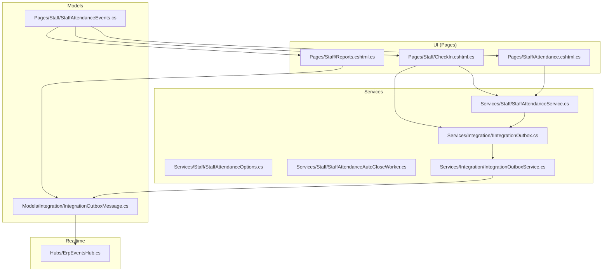
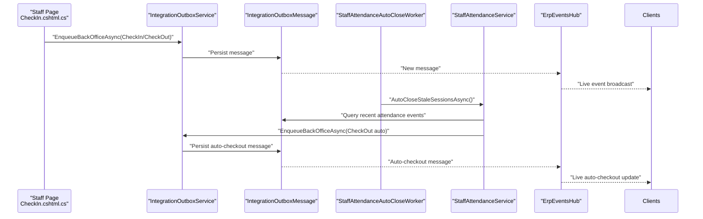
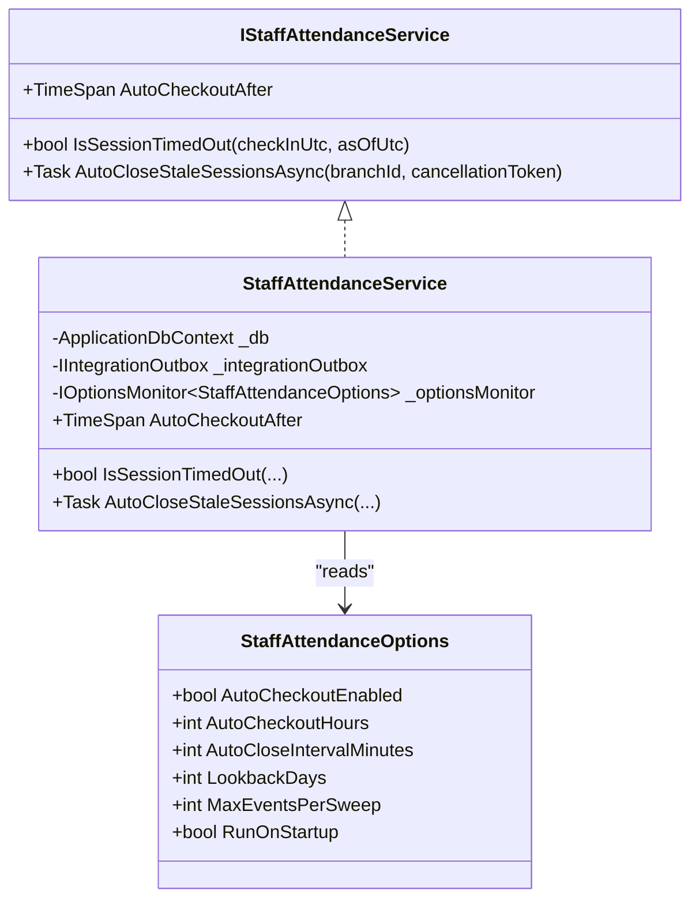
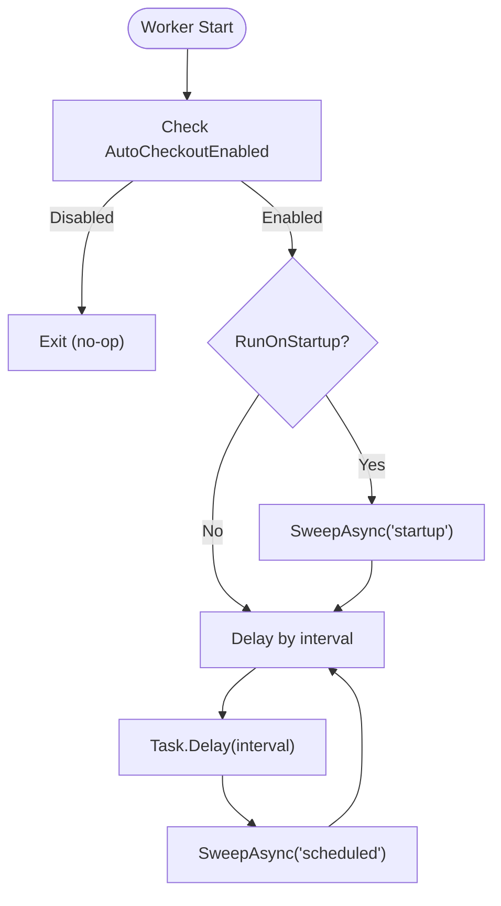
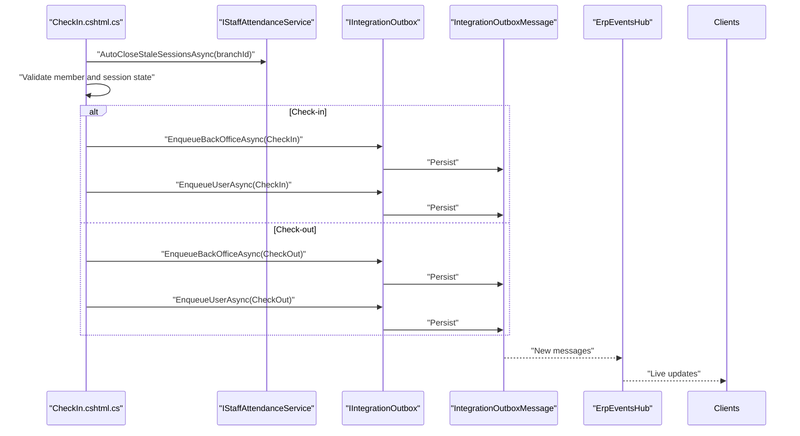
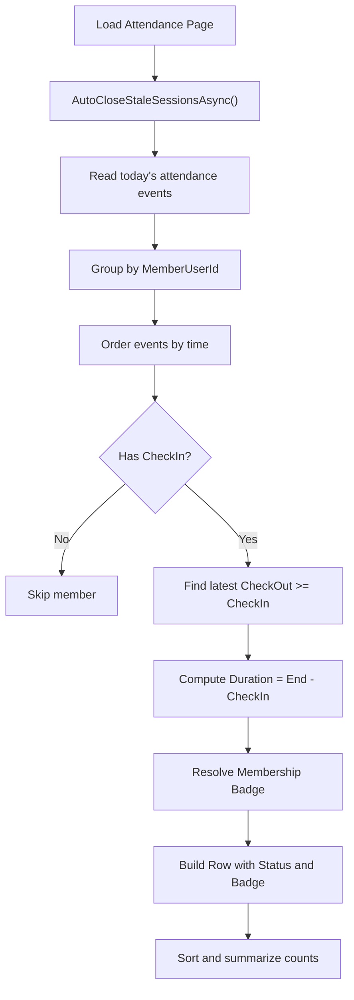
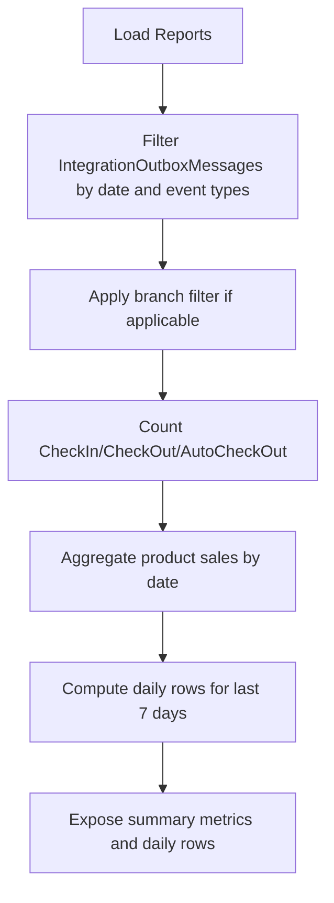
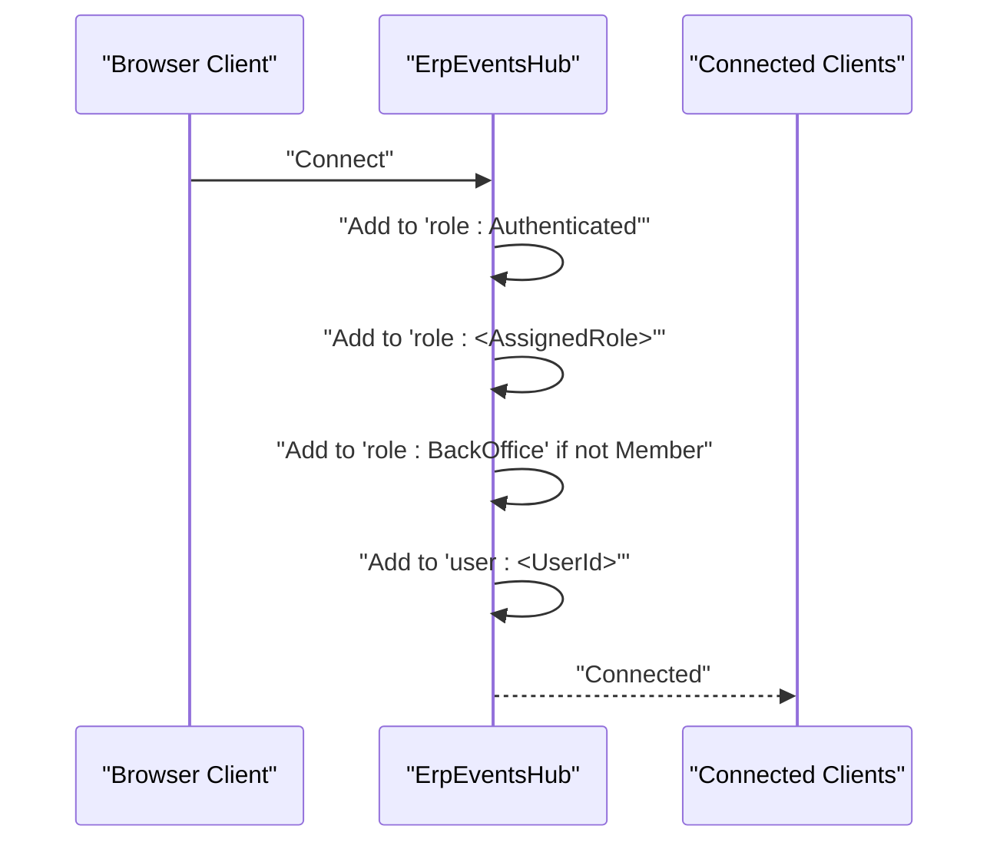
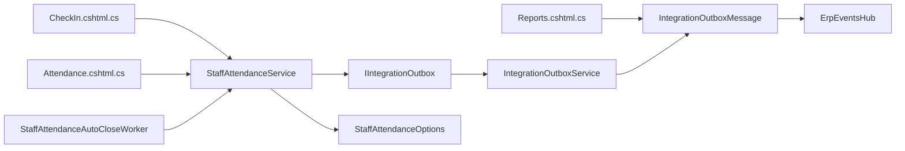

# Staff Attendance Tracking

<cite>
**Referenced Files in This Document**
- [IStaffAttendanceService.cs](file://Services/Staff/IStaffAttendanceService.cs)
- [StaffAttendanceService.cs](file://Services/Staff/StaffAttendanceService.cs)
- [StaffAttendanceAutoCloseWorker.cs](file://Services/Staff/StaffAttendanceAutoCloseWorker.cs)
- [StaffAttendanceOptions.cs](file://Services/Staff/StaffAttendanceOptions.cs)
- [StaffAttendanceEvents.cs](file://Pages/Staff/StaffAttendanceEvents.cs)
- [Attendance.cshtml.cs](file://Pages/Staff/Attendance.cshtml.cs)
- [CheckIn.cshtml.cs](file://Pages/Staff/CheckIn.cshtml.cs)
- [Reports.cshtml.cs](file://Pages/Staff/Reports.cshtml.cs)
- [ErpEventsHub.cs](file://Hubs/ErpEventsHub.cs)
- [IIntegrationOutbox.cs](file://Services/Integration/IIntegrationOutbox.cs)
- [IntegrationOutboxService.cs](file://Services/Integration/IntegrationOutboxService.cs)
- [IntegrationOutboxMessage.cs](file://Models/Integration/IntegrationOutboxMessage.cs)
</cite>

## Table of Contents
1. [Introduction](#introduction)
2. [Project Structure](#project-structure)
3. [Core Components](#core-components)
4. [Architecture Overview](#architecture-overview)
5. [Detailed Component Analysis](#detailed-component-analysis)
6. [Dependency Analysis](#dependency-analysis)
7. [Performance Considerations](#performance-considerations)
8. [Troubleshooting Guide](#troubleshooting-guide)
9. [Conclusion](#conclusion)
10. [Appendices](#appendices)

## Introduction
This document describes the staff attendance tracking system, focusing on check-in/check-out functionality (manual and automatic), time tracking and duration calculation, attendance validation, auto-close worker behavior, reporting capabilities, and integration with the real-time event system. It also covers configuration options that influence attendance behavior such as auto-checkout timing and sweep parameters.

## Project Structure
The attendance system spans several layers:
- Pages: UI surfaces for attendance management, check-in/out, and reporting
- Services: Business logic for attendance operations and background auto-close worker
- Models: Integration outbox message schema and event envelope
- Hubs: Real-time SignalR hub for live event distribution

**Diagram sources**
- [Attendance.cshtml.cs:1-208](file://Pages/Staff/Attendance.cshtml.cs#L1-L208)
- [CheckIn.cshtml.cs:1-750](file://Pages/Staff/CheckIn.cshtml.cs#L1-L750)
- [Reports.cshtml.cs:1-147](file://Pages/Staff/Reports.cshtml.cs#L1-L147)
- [StaffAttendanceService.cs:1-160](file://Services/Staff/StaffAttendanceService.cs#L1-L160)
- [StaffAttendanceOptions.cs:1-13](file://Services/Staff/StaffAttendanceOptions.cs#L1-L13)
- [StaffAttendanceAutoCloseWorker.cs:1-78](file://Services/Staff/StaffAttendanceAutoCloseWorker.cs#L1-L78)
- [IIntegrationOutbox.cs:1-26](file://Services/Integration/IIntegrationOutbox.cs#L1-L26)
- [IntegrationOutboxService.cs:1-94](file://Services/Integration/IntegrationOutboxService.cs#L1-L94)
- [IntegrationOutboxMessage.cs:1-57](file://Models/Integration/IntegrationOutboxMessage.cs#L1-L57)
- [ErpEventsHub.cs:1-50](file://Hubs/ErpEventsHub.cs#L1-L50)
- [StaffAttendanceEvents.cs:1-134](file://Pages/Staff/StaffAttendanceEvents.cs#L1-L134)

**Section sources**
- [Attendance.cshtml.cs:1-208](file://Pages/Staff/Attendance.cshtml.cs#L1-L208)
- [CheckIn.cshtml.cs:1-750](file://Pages/Staff/CheckIn.cshtml.cs#L1-L750)
- [Reports.cshtml.cs:1-147](file://Pages/Staff/Reports.cshtml.cs#L1-L147)
- [StaffAttendanceService.cs:1-160](file://Services/Staff/StaffAttendanceService.cs#L1-L160)
- [StaffAttendanceOptions.cs:1-13](file://Services/Staff/StaffAttendanceOptions.cs#L1-L13)
- [StaffAttendanceAutoCloseWorker.cs:1-78](file://Services/Staff/StaffAttendanceAutoCloseWorker.cs#L1-L78)
- [IIntegrationOutbox.cs:1-26](file://Services/Integration/IIntegrationOutbox.cs#L1-L26)
- [IntegrationOutboxService.cs:1-94](file://Services/Integration/IntegrationOutboxService.cs#L1-L94)
- [IntegrationOutboxMessage.cs:1-57](file://Models/Integration/IntegrationOutboxMessage.cs#L1-L57)
- [ErpEventsHub.cs:1-50](file://Hubs/ErpEventsHub.cs#L1-L50)
- [StaffAttendanceEvents.cs:1-134](file://Pages/Staff/StaffAttendanceEvents.cs#L1-L134)

## Core Components
- Staff attendance service: Provides auto-checkout thresholds, session timeout checks, and batch auto-closing of stale sessions. Emits attendance events via the integration outbox.
- Auto-close worker: Background service that periodically sweeps recent attendance events and auto-checks out members whose sessions exceed the configured threshold.
- UI pages: Attendance dashboard, check-in/out forms, and reporting page that consume attendance events and membership data.
- Integration outbox: Persists events targeting Back Office, Roles, or Users, enabling downstream processing and real-time distribution.
- Real-time hub: Assigns connected clients to groups by role and user to support live updates.

**Section sources**
- [IStaffAttendanceService.cs:1-12](file://Services/Staff/IStaffAttendanceService.cs#L1-L12)
- [StaffAttendanceService.cs:1-160](file://Services/Staff/StaffAttendanceService.cs#L1-L160)
- [StaffAttendanceAutoCloseWorker.cs:1-78](file://Services/Staff/StaffAttendanceAutoCloseWorker.cs#L1-L78)
- [StaffAttendanceOptions.cs:1-13](file://Services/Staff/StaffAttendanceOptions.cs#L1-L13)
- [CheckIn.cshtml.cs:183-329](file://Pages/Staff/CheckIn.cshtml.cs#L183-L329)
- [Attendance.cshtml.cs:28-121](file://Pages/Staff/Attendance.cshtml.cs#L28-L121)
- [Reports.cshtml.cs:31-136](file://Pages/Staff/Reports.cshtml.cs#L31-L136)
- [IIntegrationOutbox.cs:1-26](file://Services/Integration/IIntegrationOutbox.cs#L1-L26)
- [IntegrationOutboxService.cs:1-94](file://Services/Integration/IntegrationOutboxService.cs#L1-L94)
- [IntegrationOutboxMessage.cs:1-57](file://Models/Integration/IntegrationOutboxMessage.cs#L1-L57)
- [ErpEventsHub.cs:1-50](file://Hubs/ErpEventsHub.cs#L1-L50)

## Architecture Overview
The system records attendance actions as integration outbox messages. These messages are consumed by UI pages and workers to compute durations, statuses, and auto-close stale sessions. Real-time updates are distributed via SignalR groups.

**Diagram sources**
- [CheckIn.cshtml.cs:244-255](file://Pages/Staff/CheckIn.cshtml.cs#L244-L255)
- [IntegrationOutboxService.cs:18-26](file://Services/Integration/IntegrationOutboxService.cs#L18-L26)
- [IntegrationOutboxMessage.cs:5-40](file://Models/Integration/IntegrationOutboxMessage.cs#L5-L40)
- [StaffAttendanceAutoCloseWorker.cs:51-75](file://Services/Staff/StaffAttendanceAutoCloseWorker.cs#L51-L75)
- [StaffAttendanceService.cs:39-147](file://Services/Staff/StaffAttendanceService.cs#L39-L147)
- [ErpEventsHub.cs:12-47](file://Hubs/ErpEventsHub.cs#L12-L47)

## Detailed Component Analysis

### Staff Attendance Service
Responsibilities:
- Compute auto-checkout threshold from configuration
- Determine if a session is timed out
- Auto-close stale check-in sessions by enqueuing a check-out event

Key behaviors:
- Uses configurable hours to clamp the auto-checkout window
- Filters recent attendance events from the integration outbox
- Deduplicates by member and selects the latest event per member
- Validates branch scoping when requested
- Emits both Back Office and user-specific notifications for auto-checkouts

**Diagram sources**
- [IStaffAttendanceService.cs:1-12](file://Services/Staff/IStaffAttendanceService.cs#L1-L12)
- [StaffAttendanceService.cs:9-23](file://Services/Staff/StaffAttendanceService.cs#L9-L23)
- [StaffAttendanceOptions.cs:3-11](file://Services/Staff/StaffAttendanceOptions.cs#L3-L11)

**Section sources**
- [IStaffAttendanceService.cs:1-12](file://Services/Staff/IStaffAttendanceService.cs#L1-L12)
- [StaffAttendanceService.cs:25-147](file://Services/Staff/StaffAttendanceService.cs#L25-L147)
- [StaffAttendanceOptions.cs:1-13](file://Services/Staff/StaffAttendanceOptions.cs#L1-L13)

### Auto-Checkout Worker
Responsibilities:
- Periodically runs to close stale sessions
- Supports startup sweep and scheduled intervals
- Logs successes and failures

Operational flow:
- Checks configuration to decide whether to run
- Executes a sweep using the service
- Applies clamped interval bounds
- Wraps errors and cancellation gracefully

**Diagram sources**
- [StaffAttendanceAutoCloseWorker.cs:21-75](file://Services/Staff/StaffAttendanceAutoCloseWorker.cs#L21-L75)

**Section sources**
- [StaffAttendanceAutoCloseWorker.cs:1-78](file://Services/Staff/StaffAttendanceAutoCloseWorker.cs#L1-L78)

### Manual Check-In/Check-Out Workflow
Responsibilities:
- Validate member eligibility and active session state
- Enqueue attendance events to the integration outbox
- Notify Back Office and the member via user-targeted messages
- Update UI snapshots and recent activity

**Diagram sources**
- [CheckIn.cshtml.cs:183-329](file://Pages/Staff/CheckIn.cshtml.cs#L183-L329)
- [IIntegrationOutbox.cs:5-23](file://Services/Integration/IIntegrationOutbox.cs#L5-L23)
- [IntegrationOutboxService.cs:18-58](file://Services/Integration/IntegrationOutboxService.cs#L18-L58)
- [IntegrationOutboxMessage.cs:5-40](file://Models/Integration/IntegrationOutboxMessage.cs#L5-L40)
- [ErpEventsHub.cs:12-47](file://Hubs/ErpEventsHub.cs#L12-L47)

**Section sources**
- [CheckIn.cshtml.cs:183-329](file://Pages/Staff/CheckIn.cshtml.cs#L183-L329)

### Attendance Dashboard and Duration Calculation
Responsibilities:
- Auto-close stale sessions on page load
- Aggregate attendance events per member
- Compute durations from first check-in to latest check-out or auto-close
- Derive status badges and membership status indicators

**Diagram sources**
- [Attendance.cshtml.cs:28-121](file://Pages/Staff/Attendance.cshtml.cs#L28-L121)

**Section sources**
- [Attendance.cshtml.cs:28-121](file://Pages/Staff/Attendance.cshtml.cs#L28-L121)

### Reporting Features
Responsibilities:
- Summarize check-ins, check-outs, and auto-check-outs over a fixed window
- Include product sales and replacement requests counts
- Group daily totals for the last seven days
- Respect branch scoping for Super Admin vs. branch-specific views

**Diagram sources**
- [Reports.cshtml.cs:31-136](file://Pages/Staff/Reports.cshtml.cs#L31-L136)

**Section sources**
- [Reports.cshtml.cs:1-147](file://Pages/Staff/Reports.cshtml.cs#L1-L147)

### Real-Time Event System Integration
Responsibilities:
- Establish SignalR connections and assign clients to role and user groups
- Broadcast integration outbox messages to relevant audiences

**Diagram sources**
- [ErpEventsHub.cs:12-47](file://Hubs/ErpEventsHub.cs#L12-L47)

**Section sources**
- [ErpEventsHub.cs:1-50](file://Hubs/ErpEventsHub.cs#L1-L50)

## Dependency Analysis
- UI pages depend on the staff attendance service for auto-close and session validation, and on the integration outbox for emitting events.
- The service depends on the integration outbox abstraction and configuration options.
- The integration outbox persists messages to the database model, which are then broadcast via SignalR.
- The auto-close worker depends on the service and configuration, and runs independently on a schedule.

**Diagram sources**
- [CheckIn.cshtml.cs:1-750](file://Pages/Staff/CheckIn.cshtml.cs#L1-L750)
- [Attendance.cshtml.cs:1-208](file://Pages/Staff/Attendance.cshtml.cs#L1-L208)
- [Reports.cshtml.cs:1-147](file://Pages/Staff/Reports.cshtml.cs#L1-L147)
- [StaffAttendanceService.cs:1-160](file://Services/Staff/StaffAttendanceService.cs#L1-L160)
- [IIntegrationOutbox.cs:1-26](file://Services/Integration/IIntegrationOutbox.cs#L1-L26)
- [IntegrationOutboxService.cs:1-94](file://Services/Integration/IntegrationOutboxService.cs#L1-L94)
- [IntegrationOutboxMessage.cs:1-57](file://Models/Integration/IntegrationOutboxMessage.cs#L1-L57)
- [ErpEventsHub.cs:1-50](file://Hubs/ErpEventsHub.cs#L1-L50)
- [StaffAttendanceAutoCloseWorker.cs:1-78](file://Services/Staff/StaffAttendanceAutoCloseWorker.cs#L1-L78)
- [StaffAttendanceOptions.cs:1-13](file://Services/Staff/StaffAttendanceOptions.cs#L1-L13)

**Section sources**
- [CheckIn.cshtml.cs:1-750](file://Pages/Staff/CheckIn.cshtml.cs#L1-L750)
- [Attendance.cshtml.cs:1-208](file://Pages/Staff/Attendance.cshtml.cs#L1-L208)
- [Reports.cshtml.cs:1-147](file://Pages/Staff/Reports.cshtml.cs#L1-L147)
- [StaffAttendanceService.cs:1-160](file://Services/Staff/StaffAttendanceService.cs#L1-L160)
- [IIntegrationOutbox.cs:1-26](file://Services/Integration/IIntegrationOutbox.cs#L1-L26)
- [IntegrationOutboxService.cs:1-94](file://Services/Integration/IntegrationOutboxService.cs#L1-L94)
- [IntegrationOutboxMessage.cs:1-57](file://Models/Integration/IntegrationOutboxMessage.cs#L1-L57)
- [ErpEventsHub.cs:1-50](file://Hubs/ErpEventsHub.cs#L1-L50)
- [StaffAttendanceAutoCloseWorker.cs:1-78](file://Services/Staff/StaffAttendanceAutoCloseWorker.cs#L1-L78)
- [StaffAttendanceOptions.cs:1-13](file://Services/Staff/StaffAttendanceOptions.cs#L1-L13)

## Performance Considerations
- Event scanning windows: The auto-close worker and UI pages limit scanned events and dates to reduce load. Tune lookback days and max events per sweep to balance completeness and performance.
- Query pagination: Queries use Take limits and ordering by timestamps and IDs to ensure deterministic results.
- Branch scoping: Filtering by branch reduces dataset sizes for branch-specific views and auto-close operations.
- Background scheduling: Interval clamping prevents excessive frequency and ensures predictable cadence.

[No sources needed since this section provides general guidance]

## Troubleshooting Guide
Common scenarios:
- Auto-close not triggering: Verify the auto-checkout is enabled and the configured hours are reasonable; confirm the worker is running and not encountering exceptions.
- Stale sessions not auto-closed: Check lookback days and max events per sweep; ensure recent attendance messages exist and match the expected event types.
- Live updates missing: Confirm SignalR connection and group assignment; ensure integration outbox messages are persisted and broadcast.
- Session validation errors: Review member eligibility checks and active session detection logic in the check-in/out flows.

**Section sources**
- [StaffAttendanceAutoCloseWorker.cs:51-75](file://Services/Staff/StaffAttendanceAutoCloseWorker.cs#L51-L75)
- [StaffAttendanceService.cs:39-147](file://Services/Staff/StaffAttendanceService.cs#L39-L147)
- [ErpEventsHub.cs:12-47](file://Hubs/ErpEventsHub.cs#L12-L47)
- [CheckIn.cshtml.cs:183-329](file://Pages/Staff/CheckIn.cshtml.cs#L183-L329)

## Conclusion
The staff attendance tracking system combines manual check-in/out with robust automatic session management, real-time event broadcasting, and comprehensive reporting. Configuration options allow tuning of auto-checkout behavior and worker cadence, while branch scoping ensures appropriate visibility and control.

[No sources needed since this section summarizes without analyzing specific files]

## Appendices

### Attendance Policy and Configuration
- Auto-checkout enabled/disabled
- Auto-checkout hours (clamped to a safe range)
- Auto-close interval minutes (clamped to a safe range)
- Lookback days for event scans (clamped to a safe range)
- Maximum events per sweep (clamped to a safe range)
- Run on startup flag

**Section sources**
- [StaffAttendanceOptions.cs:1-13](file://Services/Staff/StaffAttendanceOptions.cs#L1-L13)

### Attendance Events Model
- Event types for check-in and check-out
- Parsing integration outbox messages into typed events
- Helper methods to derive action labels and detect event types

**Section sources**
- [StaffAttendanceEvents.cs:1-134](file://Pages/Staff/StaffAttendanceEvents.cs#L1-L134)

### Integration Outbox Schema
- Targets: Back Office, Role, User
- Fields: event type, message, payload JSON, status, timestamps
- Used by UI and service to enqueue and persist events

**Section sources**
- [IntegrationOutboxMessage.cs:1-57](file://Models/Integration/IntegrationOutboxMessage.cs#L1-L57)
- [IIntegrationOutbox.cs:1-26](file://Services/Integration/IIntegrationOutbox.cs#L1-L26)
- [IntegrationOutboxService.cs:1-94](file://Services/Integration/IntegrationOutboxService.cs#L1-L94)